# 과목1. 전사아키텍처 이해

# 제1장 전사아키텍처 개요

# 제1절 전사아키텍처 정의

## 1. 전사아키텍처 개념

기업의 가치창출 활동에서 다양한 환경 변화에 대해 민첩하게 대응할 수 있도록 하는 능력이 정보 기술의 역할로 중요시 되고 있다. 기업의 비즈니스 복잡도는 더욱 증대되고 있고, 업무와 IT 기능의 분리는 더 이상 무의미하게 되었다. 또한 기업이 환경 변화에대응하기 위해 시스템을 변화시키고자 할 때, 시스템이 너무 복잡하여 어디를 어떻게 변경해야 할 지 모르는 상황에 이르렀다. 따라서 건축물의 설계도처럼 기업의 전체 시스템을 쉽게 파악할 수 있는 뭔가가 필요하게 되었다. 전사아키텍처는기업의 이런복잡한 시스템을 파악하기 쉽게 정리하는 것으로, 복잡한 기업 시스템을 필요한 형태로 변화시키는 것을 좀더 쉽게 하기 위해 도입되었다.

### 나. 전사아키텍처 정의

전사아키텍처는 기업의 목표와 요구를 잘 지원하기 위해 IT 인프라의 각 부분들이 어떻게 구성되고 작동되어야 하는가를 체계적으로 기술하는 것이다. 전사아키텍처는 복잡한 기업의 모습을 다양한 측면(비즈니스, 데이터, 애플리케이션, 기술 등)에서분석하고 표현하여 이해하기 쉽도록 정보체계를 구축하고 이를 활용하는 것이다. 전사아키텍처 도입의 목적은 IT 투자 대비 효과를 최대화하고, 기업의 목적을 가장 잘 달성할 수 있는 방식으로 IT 인프라를 구성하는 것이다. 기업은 전사아키텍처 도입을 통하여 비즈니스와 IT를 보다 유기적으로 연결시킬 수 있다. 또한 비즈니스 환경 변화에 대해 신속하게 대응을 할 수 있으며, IT 자체의 효율성도 증대시킬 수 있게 한다.

전사아키텍처 개념에 대한 선진 정의를 살펴보면 다음과 같다.

  * 미국 예산관리국(OMB, Office of Management and Budget)의 전사아키텍처 정의

“전사아키텍처는 조직 및 업무 활동과 정보기술 간의 관계를 현재 모습과 향후 추구할 모습을 별 도로 정의한 청사진”

- OMB 회람 A-130

이 정의에서는 정보화의 목표인 IT와 업무 간의 연계, 현재 모습과 미래 모습을 포함하고 있다. 또한 전사 아키텍처란 업무 프로세스(Business Processes), 정보 흐름 및 관계(Information Flow and Relationships), 애플리케이션(Applications), 데이터 명세 및 관계(Data Descriptions and Relationships), 그리고 기술 하부 구조(Technology Infrastructure)로 구성된다고 정의하였으며, 이후 실무적 차원에서 구성 요소에 대한 내용이 정리되어 네 가지 영역, 즉 비즈니스 아키텍처 (위의 업무 프로세스와 정보 흐름 및 관계가 여기에 해당됨), 애플리케이션 아키텍처, 데이터 아키텍처(위의 데이터 명세 및 관계가 여기에 해당됨), 기술 아키텍처로 구분한다.

  * 미국 전자정부법의 전사아키텍처 정의

“전사아키텍처는 조직의 임무가 정의한 전략적 정보 자산, 그 임무 수행에 필요한 정보, 그 임무 수행에 필요한 기술, 변화하는 요구에 대응하기 위해 신기술의 구현을 위한 전환 과정으로 구성된 다. 전사아키텍처 각 구성 요소는 현행 아키텍처, 목표 아키텍처, 전환을 위한 계획을 포함한다”

- 미 전자정부법

이 법에서는 전사아키텍처를 업무와 IT 간 관계에 포함될 내용으로 조직의 임무, 임무에 필요한 정보와 정보기술, 전환 계획을 명시하고 있으며, 현행과 목표 아키텍처를 동시에 포함하고 있다.

  * 대한민국 EA/ITA법의 EA 정의

“일정한 기준과 절차에 따라 업무, 응용, 데이터, 기술, 보안 등 조직 전체의 정보화 구성 요소들을 통합적으로 분석한 뒤 이들 간의 관계를 구조적으로 정리한 체계 및 이를 바탕으로 정보시스템을 효율적으로 구성하기 위한 방법”

- 정보시스템의 효율적 도입 및 운영에 관한 법률(2005년 12월 30일 공표)

이 법에서는 지식정보화 사회로의 발전에 따라 다양한 정보시스템이 도입, 운영되고 있으나 이를 체계적으로 관리할 수 있는 체제가 마련되지 못하여 중복 투자 및 시스템 간 연계 미흡 등 문제점 이 나타나고 있음을 지적하고 있다. 따라서 정보시스템을 효율적으로 구성하기 위한 체제 및 방법 인 전사아키텍처의 활용을 촉진하고, 공공 기관 등에 정보시스템을 효율적으로 도입, 운영할 수 있는 기반을 마련하기 위해 전사아키텍처를 정의하도록 하고 있다.

전사아키텍처는 다양한 정보기술의 혁신 활동과 관리 통제를 포함하며, 시스템의 도입과 구축뿐만 아니라 운영과 평가까지 통합적으로 관리하는 것을 의미한다. 기업은 전사아키텍처를 통해 IT 자산을 평가하고 전사 관점에서 재설계하고 좀 더 합리적인 구조로 재배치하며, IT의 효율성과 투자 효과를 측정하는 기준으로 활용할 수 있다.

전사아키텍처의 개념을 정확히 이해하기 위해서는 전사(Enterprise)의 개념과 아키텍처 (Architecture)의 개념을 명확히 이해할 필요가 있다.

### 다. 전사개념

전사(Enterprise)란 일반적으로 기업 또는 기관을 지칭한다. 정확하게 정의하면“공동의 목표를 추구하기 위해 고객과 상품 또는 서비스가 존재하고 이를 지원하기 위한 조직, 자원, 기술을 보유하며 필요한 업무 프로세스를 수행하는 조직의 집합체”라고 할 수 있다. 전사는 비즈니스의 변화 동인을 확인하고 전략을 정의할 수 있는 조직 단위이며, 비즈니스 활동 정보를 공유하는 조직 단위라고 할 수 있다.

  * [그림 1-1-1] 전사개념" width="555" height="264" border="0">

전사의 유형은 다양하다. 전사가 하나의 기업이나 기관과 정확히 일치하지 않을 수 있다. 기업의 규모가 큰 경우 하나의 기업이 여러 개의 전사로 구성될 수 있다. 그 경우 각각의 전사는 독립적인 운영 주체로 구성된다. 또한 전사는 구분 가능한 다수의 사업 영역으로 구성된다.

전사아키텍처의 수립을 위해서는 전사의 범위를 초기에 명확히 정의해야 하며, 이를 이해당사자들이 충분이 공감할 수 있어야 한다. 전사의 정의는 전사아키텍처 수립 과정에서 중요한 판단 기준이 된다. 전사아키텍처를 수립하는 모든 활동은 정의된 전사의 성과와 목표에 초점을 두고 아키텍처를 도출해야 한다.

### 라. 아키텍처 개념

아키텍처는 고대 그리스어에서 건축 혹은 석공명인(Master)을 의미하는‘Architecton’이라는 용어로부터 유래되었다. 당시의 아키텍처는 건축물의 골격을 제공하는 설계도 역할을 했다. 좋은 아키텍처는 훌륭한 건축물을 탄생시켰고, 이들은 아직까지 인류의 훌륭한 유산으로 남겨지고 있다. 고대의 아키텍처 개념이 화강암과 대리석으로 건축물을 짓는데 적용되었다면, 산업시대에는 건축뿐만 아니라 첨단 과학기술을 이용하여 항공기, 자동차, 선박 등을 개발하는데 적용되어 왔다. 또한 오늘날 디지털 정보화 시대에는 첨단 정보기술을 이용하여 정보체계, 소프트웨어 내장형 체계, 지휘통제 통신체계 등을 구축하는데 적용되고 있다.

IEEE Std. 1971에서는 아키텍처를“ 구성요소의 구조, 구성요소들 사이의 관계, 구성요소의 설계 그리고 시간경과에 따른 구성요소의 발전을 위한 원리와 지침”으로 정의하고 있다.

아키텍처는 대상에 대한 구조뿐만 아니라, 대상 구조의 유지 관리를 위한 원칙과 지침, 그리고 향후 목표 아키텍처로 가기 위한 계획을 포함하고 있다.

  * [그림 1-1-2] 아키텍처 구성요소" width="363" height="282" border="0">

  * 규칙 (Rule) 관점

기업 또는 기관에서 아키텍처의 일관성이 흔들리는 이유는 기술적 문제 이전에 관리적 문제일 수 있다. 의사결정 단계에 상호운용이나 일관성의 유지를 위하여 준수하여야 하는 원칙을 수립하고 적용함으로써 아키텍처의 연속적인 모습이 관리될 수 있다.

  * 모델 (Model) 관점

아키텍처는 구체적인 모델이나 기법에 의하여 분석된 후 그 결과가 정의된 표기법에 의하여 표현된다. 아키텍처의 모델은 각 아키텍처 도메인에 대한 분석 결과가 아키텍처와 관련이 있는 담당자 간에 공유되어야 하는 매우 중요한 정보이다. 모델은 전사아키텍처를 수립할 때뿐만 아니라 향후의 변경을 고려한 절차나 기법을 표준화하는 것이 중요하다.

  * 계획(Plan) 관점

아키텍처는 현재 그대로의 아키텍처와 궁극적으로 지향해야 하는 목표 아키텍처를 정의하는데, 현재 상태에서 목표 상태로 되기 위한 적절한 이행 전략과 구축 계획이 필요하다. 계획이란 이런 전사아키텍처의 이행 전략과 이행 계획을 의미한다.

아키텍처란 구축하고자하는 목적에 따라 복잡한 대상을 단순하게 표현하고, 구성요소의 변화에 대한 요구를 수용할 수 있게 한 청사진(Blueprint)이라고 할 수 있다.

전사와 아키텍처의 개념을 기반으로 전사아키텍처를 다시 정의하면, 전사아키텍처란 전사에 대한 아키텍처를 정의 관리하여 전사의 비즈니스 목표를 위해 아키텍처 정보를 활용하여 IT 인프라를 최 적으로 구성하는 것이라고 할 수 있다.

## 2. 전사아키텍처 추진 현황

전사아키텍처는 최근 세계적으로 정부기관과 민간기업의 IT 혁신을 위한 주된 관심사로서, 다양한 산업에 걸쳐 전사아키텍처 프로젝트가 추진되고 있다. 특히 정부기관의 경우 전 세계적으로 전자정부 구현 사업이 활발히 추진되고 있다. 국내 정부기관도 전사아키텍처 추진 사업을 범정부 차원의 전 자정부 구현 과제 중의 하나로서 활발히 추진하고 있다. 2005년 12월 공공 부문에 전사아키텍처 도입을 의무화하는“정보시스템의 효율적 도입 및 운영 등에 관한 법률”이 제정된 것을 기반으로, 공공 부문의 정보 자원을 최적으로 관리하고 정보화 투자 효과를 제고하기 위하여 2007년부터 단계적으로 전사아키텍처가 추진되고 있다.

[Tip] ----------------------------------------------------------------------------------------

 *전사아키텍처 (EA)와 정보기술아키텍처(ITA) :*
ITA 는 정보기술아키텍처를 의미한다. 1996년 미국 정보기술관리혁신법에서 ITA(Information Technology Architecture)라는 용어를 사용했으나, 2000년 OBM A-130 회람에서 아키텍처 관련 이러한 개념을 전사아키텍처(Enterprise Architecture)라 명명하였다.

전사아키텍처는 광의의 아키텍처 개념으로, 정보기술아키텍처는 정보기술 중심의 아키텍처 개념으로 볼 수 있다. 국내의 경우 정보기술아키텍처라는 용어를 먼저 사용하였으나 현재는 전사아키텍처로 통합해 사용하고 있다. 이 책에서는 전사 아키텍처와 정보기술아키텍처를 특별히 구분하지 않고 유사한 의미로 사용하기로 한다.

---------------------------------------------------------------------------------------------

EA/ITA법의 주요 내용을 살펴보면 전사아키텍처 의무 도입 기관은 범정부의 아키텍처 목표를 지원하고 각 기관의 목표에 맞는 도입 계획을 수립해 제출하여야 하며, 아키텍처 추진 조직을 구성하고 추진 인력의 아키텍처 역량 강화를 위해 교육 등을 중점 추진하며, 전사아키텍처 도입 계획에 따라 아키텍처를 도입, 운영하고 지속적으로 유지, 발전시켜야 한다. 또한 범정부 차원의 전사아키텍처 관련 정보의 공동 활용 등을 위해 전사아키텍처 관련 정보를 제공할 수 있어야 한다. 또한 아키텍처 성숙도 모델을 활용하여 전사아키텍처 도입, 운영 실태 및 추진 성과를 분석하며, 정보화 사업 추진 시 정보시스템 구축 운영 기술 지침 및 상호 운용성 확보 등을 위한 기술 평가를 수행해야 한다.

  * [그림 1-1-3] 범정부 아키텍처 추진 방향" width="551" height="425" border="0">

행정안전부와 한국정보화진흥원은 공공 기관 전사아키텍처 추진의 주관 부처로서 범정부 전사아키 텍처 구현을 위한 단계별 계획에 따라 전사아키텍처의 도입 및 운영을 추진하고 있으며, 범정부 차원에 서 전사아키텍처 구성의 일관성을 확보하고 공공 기관 아키텍처 정보의 종합적인 분석 및 활용을 위하 여 공통의 기준을 적용할 수 있도록 참조 모델, 산출물 메타 모델, 지침 등을 개발하고 보급하고 있다.

[표 1-1-1] 전사아키텍처 관련 범정부 기준

| 구분 | 설명 |
|----|----|
| 범정부 전사아키텍처 참조 모델 | - 아키텍처 구성 요소(업무 기능 분류), SRM(서비스 컴포넌트 참조 모델), DRM(데이터 참조 모델), TRM(기술 참조 모델), PRM(성과 참조 모델)

  *  각 기관은 범정부 참조 모델을 그대로 활용하거나 각 기관의 자체 참조 모델을 수립 할 때는 범정부 참조 모델에 매핑하여야 함 |
| 범정부 전사아키텍처 산출물 메타 모델 | - 아키텍처를 구성하는 데 필요한 정보들과 그들 간의 관계를 정의한 모델(산출물 종류 와 구성을 정의)

  *  전사아키텍처 필수 산출물과 보조 산출물로 구성되며, 각 기관은 필수 산출물과 필수 요소는 반드시 정의해야 함 |
| 범정부 전사아키텍처 성숙도 모델 | - 아키텍처 수준 및 향후 발전 방향을 수립할 수 있도록 1~5단계의 아키텍처 수준과 측 정 항목을 정의한 모델

  *  매년 전사아키텍처 추진 실태와 함께 성숙도를 측정해야 함 |
| 범정부 전사아키텍처 지원시스템 (GITAMS) | - 아키텍처 관련 표준과 기준 등을 제공하고, 각 기관의 아키텍처 정보를 공유, 활용할 수 있도록 지원하는 시스템

  *  각 기관은 필수 산출물에 해당하는 정보를 매년 GITAMS에 등록해야 함 |

## 3. 전사아키텍처 관련 데이터아키텍처 전문가 역할

데이터아키텍처 전문가가 기업이 필요로 하는 고품질의 데이터 모델 또는 데이터아키텍처를 정의 하기 위해서는 이러한 전사아키텍처의 개념을 충분히 이해하고 있어야 한다.

일반적으로 전사아키텍처 수립 프로젝트에서 데이터아키텍처 전문가는 아키텍처 도메인 중 데이터 아키텍처 영역을 직접 수행하거나 간접적으로 관여하게 된다. 훌륭한 데이터아키텍처 전문가가 되고자 한다면 전사아키텍처에 대해 정확히 이해하고, 소속 기업의 전사아키텍처 추진 내역에 대하여 관심을 가지고 구축된 전사아키텍처 정보를 적극 활용해야 할 것이다. 만약 소속 기업에서 전사아키텍처를 구축하지 않았다면 데이터아키텍처 영역만이라도 전사아키텍처 개념으로 데이터아키텍처 전문가 업무에 접근하는 것도 가능하다.

# 제2절 전사아키텍처 프레임워크

## 1. 전사아키텍처 프레임워크 개념

기업이 전사아키텍처를 정의하여 관리하기 위해서는 우선 전사아키텍처를 어떻게 표현하고 운영 할 것인가에 대한 전체적인 사고의 틀을 결정해야 한다. 전사아키텍처 프레임워크는 전사아키텍처 활동에서 얻어지는 산출물을 분류하고 조직화하고 이를 유지 관리하기 위한 전체적인 틀을 정의하는 것이다.

전사아키텍처 수립을 위해서는 먼저 이러한 전사아키텍처 프레임워크를 정의해야 하는데, 이미 여러 선진 모델이 나와 있고 정부에서도 가이드를 제시하고 있어, 기관이나 기업은 이를 참조할 수 있다. 하지만, 무조건적인 적용보다는 기업의 특성에 따라 적합한 형태로 정의할 필요가 있다.

## 2. 전사아키텍처 프레임워크 구성

전사아키텍처 프레임워크는 여러 참조 모델이 있다. 우선 전사아키텍처 프레임워크를 좀더 명확히 이해하기 위해서 국내에서 비교적 일반적으로 적용되고 있는 전사아키텍처 프레임워크의 한 사례를 기준으로 전사아키텍처 프레임워크의 구성을 살펴본다.

그림[1-1-4]에서 보면, 전사아키텍처 프레임워크는 전사아키텍처 정책, 전사아키텍처 정보, 전사아키텍처 관리 등의 3가지 영역으로 구분된다. 전사아키텍처 정책은 기업이 전사아키텍처 수립을 어떻게 할 것인가의 방향을 정의한 것으로 아키텍처 매트릭스, 전사아키텍처 비전, 전사아키텍처 원칙 등으로 구성된다. 전사아키텍처 정보는 기업이 구축하는 전사아키텍처 정보의 구체적인 모습으로 현행 아키텍처, 목표 아키텍처, 이행 계획으로 구성된다. 전사아키텍처 관리는 구축된 전사아키텍처를 어떻게 관리하고 활용할 것인가를 정의한 것으로 전사아키텍처 관리 체계, 전사아키텍처 관리 시스템, 전사아키텍처 평가 모형 등으로 구성된다.

  * [그림 1-1-4] 전사아키텍처 프레임 워크 구성 예" width="499" height="338" border="0">

기업이 전사아키텍처를 구축하기 위해서는 먼저 기업의 전사아키텍처 구축 목적과 방향을 정의해 야 한다. 전사아키텍처 정책은 전사아키텍처의 정보를 어떻게 구성할 것이고, 전사아키텍처 수립을 통하여 기업이 달성하고자 하는 궁극적인 모습은 무엇이며, 전사아키텍처를 효과적으로 관리하고 활 용하기 위한 원칙은 어떤 것인지 등을 정의하는 것이다.

  * 아키텍처 매트릭스

아키텍처 매트릭스는 전사아키텍처의 정보를 체계적으로 분류한 틀로서, 기업이 관리하려고 하는 전사아키텍처 정보의 수준과 활용 계층을 결정하는 수단이다.

[표 1-1-2] 아키텍처 매트릭스 예

| 뷰(View)/ 관점(Perspective) | 비즈니스 아키텍처 | 애플리케이션 아키텍처 | 데이터 아키텍처 | 기술 아키텍처 |
|----|----|----|----|----|
|계획자 (개괄적) | 전체 업무, 조직의 구성 정보|전체 차원의 응용 시스템 구성 정보|전체 차원의 데이터베이스 구성 정보|기술 요소의 구성을 전체 차원에서 정리한 정보 |
| |- 전사 사업 모델

  *  조직 모델

  *  비즈니스 전략|- 전사 애플리케이션 영역 모델

  *  애플리케이션 원칙|- 전사 데이터 영역 모델

  *  데이터 원칙|- 전사 기술 영역모델

  *  기술 참조 모델 |
| 책임자/분석자 (개념적) | 업무의 세부 구성 정보와 업무/조직 간 관계 정보|상위 수준의 기능 구성 정보와 응용시스템 간 관계 정보|데이터베이스에서 관리되는 주요 데이터 개체와 개체 간 관계|정보 기술 기반 자원의 유형별 구성과 인터페이스 정보 |
| |- 업무 기능 모델|- 애플리케이션 모델

  *  애플리케이션 표준|- 개념 데이터 모델

  *  데이터 표준|- 표준 프로파일 |
| 설계자 (논리적) | 업무의 연계성, 흐름 정보|응용 시스템의 상세한 기능 정보와 물리적 분산 정보|데이터베이스의 논리적 데이터 구조|기술 기반 자원의 도입과 운영을 위한 유형별 구조 및 관리 체계 정보 |
| |- 프로세스 모델|- 컴포넌트 모델|- 논리 데이터 모델|- 기술아키텍처 모델 |
| 개발자 (물리적) | 업무 수행을 위한 구체적 절차, 양식, 업무 관계 정보|프로그램의 물리적인 구성 체계와 각 프로그램 구현 정보|데이터베이스의 물리적 구조 정보|도입된 기술 기반 자원의 도입, 운영, 관리에 관한 구체적 정보 |
| |- 업무 매뉴얼|- 프로그램 목록|- 물리 데이터 모델 - 데이터베이스 객체|- 기술 자원 목록 - 제품 목록 |

아키텍처 매트릭스는 일반적으로 뷰와 관점의 두 차원으로 전사아키텍처 정보를 구분하고, 뷰와 관점이 교차하는 각 셀에는 전사아키텍처 정보의 실체가 되는 산출물을 정의하는 구조이다. 아키텍처 매트릭스에서 좌우로 바라보는 것을 뷰(View)라고 하고, 위에서 아래로 바라보는 것을 관점(Perspective)이라 한다. 일반적으로 뷰는 비즈니스, 애플리케이션, 데이터, 기술 등으로, 관점은 계획자, 책임자(또는 분석자), 설계자, 개발자 등으로 분류한다. 각 셀은 전후 좌우의 셀과 연관성을 가지며, 셀 간의 추적성이 확보되어야 한다.

  * 전사아키텍처 비전

전사아키텍처 비전은 전사아키텍처 수립을 통하여 기업이 궁극적으로 달성하고자 하는 모습이다. 전사아키텍처 비전에는 전사아키텍처 구축의 목표와, 그 목표를 효과적으로 달성하기 위한 전략과 방향 등을 포함한다.

  * 전사아키텍처 원칙

전사아키텍처 원칙은 전사아키텍처 정보를 효율적으로 구축하고, 기업의 목적에 맞게 전사아키텍처 정보를 효과적으로 활용하기 위해서 조직 구성원이 공유해야 할 규범을 말한다. 전사아키텍처 원칙은 전사아키텍처 대원칙, 아키텍처 원칙, 표준 등을 포함한다.

### 나. 전사아키텍처 정보

전사아키텍처 구축을 위해서는 아키텍처 매트릭스에서 정의한 각 아키텍처 산출물에 대하여 현재 상태와 목표 상태의 정보를 구축한다. 그리고 목표 아키텍처를 달성하기 위한 이행 계획을 수립한다. 아키텍처 정보를 구축하기 위해서는 우선 아키텍처 정보의 영역을 구분해야 하는데, 이런 아키텍처 영역을 구분한 것을 아키텍처 도메인(Architecture Domain)이라 한다. 정확히 말하면, 아키텍처 도메인이란 아키텍처 매트릭스 상에서 뷰의 관점으로 아키텍처 영역을 구분한 것을 말한다. 현행 아키텍처와 목표 아키텍처는 이런 아키텍처 도메인별로 아키텍처 정보를 구축한다.

  * [그림 1-1-5] 아키텍처 도메인 예" width="536" height="290" border="0">

  * 헌행 아키텍처

아키텍처 도메인별로 정의된 산출물에 대하여 기업의 현재 상태를 아키텍처 정보로 정의한 것을 말한다.

  * 목표 아키텍처

아키텍처 도메인별로 정의된 산출물에 대하여 기업이 궁극적으로 달성하고자 하는 목표 아키텍처의 상태를 아키텍처 정보로 정의한 것을 말한다.

  * 전사아키텍처 이행계획

아키텍처 도메인별로 현재 모습에서 바람직한 목표 모습으로 이행하기 위한 이행 전략과 이행계획을 정의한 것을 말한다.

[Tip] ----------------------------------------------------------------------------------------

 *비즈니스, 업무, 사업 :*

‘비즈니스’란 용어는 원어로‘Business’이다. 우리나라 말로 번역하면‘사업’또는‘업무’로 표현할 수 있다. 사업이란 용어는 전사 차원의 경영과 관련된 어감이 강하고, 업무란 실무적 차원의 업무 활동에 관련된 어감이 강하다. 비즈니스는 사업과 업무를 포함하는 포괄적인 의미를 가진다고 할 수 있다. 하지만 이 책에서는 비즈니스와 업무를 특별히 구분하지는 않는다. 주로 비즈니스라는 용어를 사용하겠지만, 정부의 참조 모델 관련 내용에서는 업무라는 용어를 그대로 사용한다.

 *애플리케이션, 응용 :*

‘애플리케이션’이란 용어는 원어로‘Application’이다. 우리나라 말로 번역하면 응용이라고 표현할 수 있다. 애플리케이션과 응용을 같은 의미라고 할 수 있다. 이책에서는 업계에서 많이 사용하고 있는 애플리케이션을 사용하겠지만 정부의 참조 모델 관련 내용에서는 응용이라는 용어를 그대로 사용한다.

---------------------------------------------------------------------------------------------

일반적으로 아키텍처 도메인은 비즈니스 아키텍처, 애플리케이션 아키텍처, 데이터아키텍처, 기술 아키텍처 등으로 구분한다. 비즈니스아키텍처는 조직의 목적 및 임무를 지원하기 위해 수행하는 업 무를 분석하고, 이를 업무 활동 단위로 분할하여 표현한 아키텍처이다. 둘째, 데이터아키텍처는 효과 적인 업무 처리 및 의사결정을 위해 어떤 정보가 사용되고, 전달되어야 하는지를 표현한 아키텍처로 서, 전사 데이터 구성을 분류하고 데이터 모델을 정의하는 것이다. 셋째, 애플리케이션아키텍처는 조 직의 임무를 수행하는 데 필요한 애플리케이션의 기능 및 이들 간의 관계 등을 정의한 것으로, 기업 의 애플리케이션 단위를 분류하고 애플리케이션 간의 인터페이스를 정의한 아키텍처이다. 마지막으 로 기술아키텍처는 비즈니스아키텍처, 데이터아키텍처, 애플리케이션아키텍처를 지원하는 데 필요 한 정보 기술 인프라 요소 및 구조, 그리고 이들 간의 관계를 표현한 아키텍처로서, 전사의 기술 영역 을 분류하고 표준 프로파일과 기술 아키텍처 모델을 정의한 것이다.

### 다. 전사아키텍처 관리

정의된 전사아키텍처 정보를 지속적으로 유지 관리하고 효과적으로 활용하기 위해서는 전사아키텍처 관리 체계의 정립과 전사아키텍처 관리 시스템의 구축이 필요하다. 또한 전사아키텍처 관리 수준을 제고하기 위해서는 지속적으로 평가하고 개선할 필요가 있다.

  * 전사아키텍처 관리 체계

전사아키텍처 관리 체계는 흔히‘전사아키텍처 거버넌스’라고 말하기도 한다. 이것은 구축된 전사 아키텍처를 유지하고 개선하기 위한 제도적 기반을 수립하는 것이며, 정의된 전사아키텍처 원칙을 준수하도록 확인하고 통제하기 위한 조직과 프로세스를 정의하는 것을 포함한다. 전사아키텍처 관 리 체계는 전사아키텍처 활동을 관리하며, 전사아키텍처의 정보 변경을 통제하고, IT 프로젝트가 전사아키텍처의 기본적인 원칙과 정책을 준수하도록 하기 위한 목적이 있다.

  * 전사아키텍처 관리 시스템

전사아키텍처 관리 시스템은 전사아키텍처의 정보 관리의 효율성을 제고하고 전사아키텍처 정보의 공유를 활성화하기 위해 구축하는 정보시스템이다. 전사아키텍처 관리 시스템은 도입하는 기업의 요건에 따라 다양한 형태로 구성될 수 있는데, 일반적으로 전사아키텍처 정보를 정의하는 모델링 도구와 전사아키텍처 정보를 저장하는 전사아키텍처 리포지터리, 전사아키텍처 정보를 사용자에게 배포하는 전사아키텍처 포털 등으로 구성된다.

  * 전사아키텍처 평가

전사아키텍처의 관리와 활용 수준의 제고를 위해서는 전사아키텍처에 대해 주기적으로 평가하고, 개선점을 도출하여 반영해야 한다. 이를 위해서는 전사아키텍처의 수준을 객관적이고 정확하게 평가할 수 있는 전사아키텍처 성숙 모형이 필요하다.

## 3. 아키텍처 도메인 구성

아키텍처 도메인의 구성은 기업이 아키텍처 매트릭스를 어떻게 정의하느냐에 따라 다르다. 이 절에서는 아키텍처 도메인에 대해서 이해를 좀더 깊이 하기 위하여 국내 기업에서 비교적 일반적으로 활용되고 있는 아키텍처 도메인별 구성내역을 살펴본다. [표 1-1-1] 아키텍처 매트릭스를 기준으로 설명한다.

비즈니스 아키텍처는 기업의 경영 목표를 달성하기 위한 업무 구조를 정의한 아키텍처 영역으로,〈기업의 업무와 서비스의 실체를 명확히 하는 것이다. 비즈니스 아키텍처는 타 아키텍처(데이터, 애플리케이션, 기술)의 방향을 정의하고 검증하는 시발점이 된다.

  * [그림 1-1-6] 아키텍처 도미엔별 산출물 예" width="574" height="398" border="0">

급변하는 비즈니스 환경에 대한 적응성을 높이기 위해서는 정보기술이 철저하게 비즈니스 전략과 연계되어야 한다. 데이터아키텍처는 비즈니스아키텍처에서 정의한 업무를 지원하기 위해 필요한 데 이터를 정의해야 하고, 애플리케이션아키텍처는 비즈니스 업무를 수행하기 위해서 필요한 애플리케 이션을 정의해야 한다. 기술아키텍처 역시 이러한 비즈니스를 지원하는 데이터 및 애플리케이션아키 텍처를 잘 지원하기 위한 기술적 특성을 감안하여 정의되어야 한다.

  * 전사 사업 모델 (계획자 관점)

비즈니스 아키텍처는 먼저 아키텍처 정보를 구축하는 대상인 전사(Enterprise)의 범위를 정의하는 것에서부터 시작한다. 전사를 둘러싼 내외부의 이해관계자를 분석하고, 외부 객체와의 가치사슬을 분석하여 전사를 정의한다. 전사의 정확한 가치사슬을 분석하기 위해서는 외부 객체의 가치사슬과의 연관 관계를 파악하여 어떤 기능들이 외부객체에 의해서 수행되고, 외부객체의 어떤 기능을 전사 내부가 수행하고 있는지 분석해야 한다.

  * [그림 1-1-7] 전사 가치사슬 예" width="454" height="273" border="0">

  * 조직 모델 (계획자 관점)

조직 모델은 기업의 사업 모델을 지원하기 위한 기업의 조직 구조를 정의하는 것이다. 비즈니스를 수행하는 지리적 위치와 내부 객체를 도출하여 기업의 조직 구조와 업무 분장을 정의한다.

  * 업무 기능 모델 (책임자 관점)

업무 기능 모델은 기업의 업무 기능을 계층적으로 분할하고 기능 내용을 정의하는 것이다. 업무 기 능을 분할할 때는 조직 기준이 아닌 업무 기능의 유사성과 연관성을 기준으로 정의한다. 상위 업무 기능은 하위 업무 기능의 합으로 완전히 표현될 수 있어야 한다. 업무 기능 모델링은 데이터와 애 플리케이션의 상호 비교를 통한 연관 분석이 이루어진다.

  * 프로세스 모델 (설계자 관점)

프로세스 모델은 업무 기능을 상세화하여 계층적으로 프로세스을 분할하고 프로세스의 활동내용을 정의하는 것이다. 프로세스란 업무 수행을 위해 정보를 입력 받아 의미있는 활동을 통해 산출물을 생성하는 일련의 과정이다. 프로세스 모델 역시 데이터와 애플리케이션과 상호 비교를 통한 연관분석이 반복적으로 이루어진다.

  * 업무 메뉴얼 (개발자 관점)

업무 기능이나 프로세스별 업무 내역을 상세히 기술한 자료로, 전사아키텍처에서는 목록 수준의 정보를 관리한다.

### 나. 애플리케이션 아키텍처

애플리케이션 아키텍처는 기업의 업무를 지원하는 전체 애플리케이션을 식별하고 연관성을 정의 하며, 업무와 IT 특성을 고려하여 그룹화하고 범주함으로써 전체 애플리케이션 구조를 체계화하는 것이다. 애플리케이션 서비스는 애플리케이션이 지원하는 업무와 데이터의 특성을 고려하여 정의되 며, 서비스 간의 상호 연관관계를 분석 정의한다. 이는 향후 애플리케이션에 대한 배치, 통합, 포트 폴리오 관리를 위한 시각을 제공한다.

  * 전사 애플리케이션 영역 모델(계획자 관점)

기업의 업무를 지원하는 애플리케이션을 식별하고 애플리케이션별 특성 분석을 통해 이를 전사 수 준에서 구조화하는 것이다. 애플리케이션의 기능과 특성에 따라 독립되어 구현되고 운영될 수 있 는 애플리케이션을 정의하고, 애플리케이션과 관련된 업무, 데이터와 IT 특성을 감안하여 애플리 케이션을 그룹화하여 애플리케이션 영역을 정의한다.

  * 애플리케이션 모델(책임자 관점)

애플리케이션 모델은 각 애플리케이션이 지원하는 기능과 데이터 정보를 정의하고, 애플리케이션 이 제공하는 서비스를 도출하며, 이들 간의 연관 관계를 정의한 것이다. 애플리케이션이나 서비스 가 어느 업무 프로세스에서 활용되고, 어떠한 정보를 생산하고 관리하는지 연관성 분석을 한다. 애 플리케이션 모델의 정의는 개발 방법론에 의존적이다.

  * 컴포넌트 모델, 클래스 모델(설계자 관점)

실제 애플리케이션 개발에 필요한 설계 정보를 관리하는 것으로, 컴포넌트 정의나 클래스 정의, 데 이터 흐름도(DFD, Data Flow Diagram) 등이 해당되며 기업의 개발 방법론에 영향을 많이 받는 다. 기업이 가지고 있는 업무 영역별로 애플리케이션의 개발 환경은 상이할 수 있다. 예를 들면 정 보계는 컴포넌트 기반 개발(CBD, Component Based Development) 방법론을, 운영계는 메인 프레임 중심의 구조적 방법론을 사용할 수 있다.

  * 프로그램 목록(개발자 관점)

애플리케이션의 최종 단위인 프로그램에 대한 정보를 관리한다.

### 다. 데이터아키텍처

데이터아키텍처는 기업의 업무 수행에 필요한 데이터의 구조를 체계적으로 정의하는 것이다. 데이터아키텍처는 전사의 데이터 영역을 분류하는데, 업무 데이터와 메타 데이터를 구분하거나 업무 데이터는 운영계 데이터, 정보계 데이터 등으로 구분한다. 이를 기준으로 전사 수준의 주제 영역 모델, 개념데이터 모델을 정의하고, 영역별로 논리 데이터 모델, 물리 데이터 모델을 정의한다.

참고로, 데이터아키텍처 전문가가 다루는 데이터아키텍처의 범위는 데이터 구조뿐만 아니라 데이터 표준, 데이터 관리 체계 등을 포함하는 광의의 데이터아키텍처를 의미한다.아키텍처의 의미에 대해서는 1절의 아키텍처 정의를 참조하기 바라며, 데이터아키텍처 전문가의 영역에 대해서는 3장의 3절 5항을 참조 바란다.

  * 전사 데이터 영역 모델 (계획자 관점)

전사 데이터 영역 모델은 개괄 데이터 모델이라고도 하며 상위 수준의 전사 데이터 영역을 분류하여 표현한 것이며, 상위 주제 영역 수준의 데이터 구성도가 이에 해당된다. 주제 영역은 업무 기능과 대응되는 개념으로 유사 데이터를 그룹화 한 것이다.

  * 개념 데이터 모델 (책임자 관점)

개념 데이터 모델은 전사 수준의 데이터 모델로 단위 주제 영역 또는 핵심 엔터티 정도를 표현한 데이터 모델이다. 개념 데이터 모델은 전사 수준에서 사용하는 데이터를 전체적으로 표현할 수 있 는 기본 틀로서, 전사 데이터아키텍처를 관리하는 데 있어 매우 유용한 모델이다. 개념 데이터 모 델에서는 핵심 엔터티는 일반적으로 단위 주제 영역별로 한두 개가 정도가 도출된다.

  * 논리 데이터 모델(설계자 관점)

논리 데이터 모델은 개념 데이터 모델에서 정의된 주제 영역과 핵심 엔터티를 기본 정보로 하여 업 무 요건을 충족시키기 위한 데이터의 상세한 구조를 논리적으로 구체화한 것이다. 논리 데이터 모 델링은 수집된 업무 관련 데이터 정보 및 사전에 작성된 산출물을 기반으로 필요한 모든 엔터티를 도출하고, 식별자, 속성, 관계와 서브타입 등을 정의한다. 논리 데이터 모델은 엔터티, 속성에 대 한 명칭, 정의, 형식, 규칙, 코드 등을 전사적인 차원의 표준으로 정의하여 관리해야 한다.

  * 물리 데이터 모델(개발자 관점)

물리 데이터 모델은 기술적 환경과 특성을 고려하여 물리적 데이터 구조를 설계하고, 데이터베이 스 객체를 정의한 것이다. 개발자는 논리 데이터 모델을 물리적인 데이터 구조로 전환하고 데이터 무결성을 보완하여 정의하고, 데이터 분산 설계에 따른 데이터 무결성 등 추가적인 무결성 규칙을 정의한다. 데이터베이스의 성능을 고려하여 이미 설계된 데이터 구조에 추가적으로 데이터의 접근 성능 향상을 위한 인덱스 설계, 데이터 구조에 대한 비정규화 과정을 수행한다.

### 라. 기술아키텍처

기술아키텍처는 비즈니스, 데이터, 애플리케이션 아키텍처에서 정의된 요건을 지원하는 전사의 기 술 인프라 체계를 정의하는 것이다 기술 인프라는 하드웨어, 시스템 소프트웨어, 통신 네트워크, 시 스템 개발도구, 시스템 관리도구, 최종 사용자 소프트웨어 등을 포함한다. 기술 참조 모델과 표준 프 로파일 구축을 통해 애플리케이션의 이식성과 확장성을 강화하고, 벤더로부터의 독립성을 확보하며, 시스템 간의 상호운용성을 강화하는 등의 효과를 기대할 수 있다. 기술아키텍처의 경우 다른 아키텍 처와 달리 개별 기업에서도 기술 참조 모델을 정의하는 것이 일반적이다. [표 1-1-2] 아키텍처 매트 릭스에서 기술 참조 모델을 계획자 수준의 산출물로 포함한 것도 그런 의미라고 판단하면 된다.

  * 전사 기술 영역 모델, 기술 참조 모델(계획자 관점)

전사 기술 영역 모델은 기업이 업무활동에 필요한 정보기술의 영역을 상위 수준에서 분류한 것이다. 기술 참조 모델(TRM, Technical Reference Model)은 기업이 업무 활동에 필요한 기능들을 수행하기 위해 요구되는 정보기술을 상위 수준에서 논리적으로 분류한 틀인데, 전사 기술 영역 모델과 같은 범주로 볼 수 있다. 다만 기술 참조 모델은 일반적인 표준을 최대한 수렴해 정의하는 것이 특징이라고 할 수 있다.

  * [그림 1-1-8] 기술 참조 모델 예" width="566" height="380" border="0">

  * 표준 프로파일(책임자 관점)

표준 프로파일(SP, Standard Profile)은 기술 참조 모델에 명시된 서비스를 지원하기 위한 정보기술 표준들의 집합이다. 기업의 모든 기술 아키텍처 요소들에 영향을 미치는 표준들을 포함한다. 이 표준들은 시스템의 이식성, 확장성, 상호운용성, 호환성을 제고하게 된다. 일반적으로 표준 프로파일은 기술표준을 프로파일의 대상으로 하며, 최근에는 제품을 프로파일링 대상에 포함시키는것이 추세이다.

  * 기술 아키텍처 모델(설계자 관점)

기술 아키텍처 모델은 전사 기술 영역 모델이나 기술 참조 모델에서 정의된 서비스 카테고리별로 아키텍처의 패턴을 정의하거나, 기업의 소프트웨어, 하드웨어, 네트워크 등의 구성 요소에 대한 배치도를 정의하는 것이다.

  * 기술 자원 목록, 제품 목록(개발자 관점)

표준 프로파일이나 기술 아키텍처별로 관련된 기술자원 목록이나 제품 목록을 기술 아키텍처 정보로 관리한다.

## 4. 전사아키텍처 프레임워크 사례

전사아키텍처 프레임워크로 참조할 수 있는 모델은 다양하다. 자크만 프레임워크(ZEAF)를 비롯하여, 미연방정부 프레임워크(FEAF), 미재무성 프레임워크(TEAF), 미국방성 프레임워크(DoDAF), 오픈그룹 프레임워크(TOGAF), 한국정보 프레임워크 등이 대표적인 사례이다.

예를 들면 자크만 프레임워크(ZEAF)는 다섯 가지 관점(Planner, Owner, Designer, Builder, Sub-contractor)과 각 관점에 따르는 여섯 가지 묘사 방법(Data, Function, Network, People, Time, Motivation)을 정의하고 있다. 전사아키텍처 프레임워크의 대표적인 예로서 많은 다른 전사아키텍처 프레임워크에서 참조되고 있다.

[표 1-1-3] 전사아키텍처 프레임워크 예

|  | ZEAF | FEAF | TEAF | DoDAF | TOGAF | 공공부분EAF |
|----|----|----|----|----|----|----|
| 구성도 |  |  |  |  |  |  |
| 특징 | - 1980년대 말 기업활동을 공학적 관점에서 파악하는 아키텍처 개념 최초 소개

  *  기업 활동을 5W1H의 관점에서 모델링 관점 제공|- 2003년에 최신 버전 발표, 미연방정부 프레임워크 가이드 라인제공

  *  참조 모델 기반의 EAF|- 미 재무성 EAF - FEAF, DoDAF와 함께 대표적 EAF|.효과적 작전 수행을 위해 무기 체계 간 상호운용성 보장을 위해 도입된 EAF

  *  상호운용성 분석과 향상을 위해 LIBI 분석|- 민간 표준 연합인 오픈그룹 EAF|- 정부, 공공기관에 전사아키텍처 도입시 참조할 수 있도록 표준, 가이드 목적으로 추진 |
| 장점 | - 5W1H에 따라 기업활동을 상세하게 모델링할 수 있는 관점 제공

  *  Planner, Owner, Designer, Builder, Sub-contractor 관점에서 기업 활동 관심영역을 구체화|- 모델링 관점뿐만 아니라 구체적 이행 계획을 프레임워크에 포함

  *  BRM, DRM, SCRM, TRM, PRM등 다양한 참조 모델 활용|- How-Where-When을 표현하는 기능, What-How much-How Freq 를 표현하는 정보, Who-Why를 표현하는 조직, Enable를 표현하는 인프라 관점 중시|- 산출물에 대한 템플릿을 상세하게 정의하여 통일되고 검증된 방식으로 모델링 가능

  *  운영 모델에 대한 상세한 정의 및 표현 양식 제공|- 구체적 아키텍처 개발 프로세스 제안 - 각종 참조 모델의 활용관계를잘정의함|- 전사아키텍처 관련된 거의 모든 항목을 프레임워크에 포함하여 기본 프레임워크로 활용하기 용이 |
| 단점 | - 정보화 측면에서 활용도 떨어지는 부문까지 정의

  *  모델링 표현에 지나치게 집중, 실제 아키텍처 활동 계획 및 기반 정의 부족|- 아키텍처 모델의 이해 및 진화에 대해 잘 정의되어 있으나, 조직 및 관련 규정등 제반 요소의 진화적 관점부족|- 전사아키텍처 산출물 중심의 프레임워크로서 활용에 대한 접근이 부족

  *  기업의 계속적인 활동에 대한 관점이 부족|- 일반 기업 현장에서는 과도한 산출물과 정확도를 요구하고 있어 과잉 투자 가능성 있음|- 메타 모델에 근거한 연속체 개념을 도입하여 아키텍처를 파악함으로써 조직의 특수성이프레임워크에 반영되기 어려움|- 표준 프레임워크만 제시하여 구체적인 내용들은 참조한 기관에서 작성하도록 권고 |

미재무성 프레임워크(FEAF)는 8개 구성요소로 이루어져 있고 4단계에 걸쳐 점차적으로 진행하여 마지막 단계에 자크만 프레임워크의 모델 내용을 모두 관리한다. 프레임워크에는 각 세그먼트별 접근법을 채택하여 현행과 목표의 갭분석을 통한 이행 계획과 프로세스를 포함하고 있다.

오픈그룹 프레임워크는 아키텍처를 정의하기 위하여 오픈그룹에서 개발한 아키텍처 개발에 대한 지침인 아키텍처 개발 방법(ADM, Architecture Development Method), 정보기술을 체계적으로 분류한 기술 참조 모델, 표준 요약 정보를 모아놓은 데이터베이스인 표준정보기반(SIB, Standard Information Base)으로 구성되어 있다. 빌딩블록 정의에 의한 접근 방식으로 구성 단위의 문제해결 방식을 제안하고 있다.

각각의 전사아키텍처 프레임워크들은 다른 점도 있지만, 공통점 또한 많다. 프레임워크를 정의할때 이러한 선진 모델을 참조하되 기업의 특성에 맞는 것을 만들어야 하며, 경직된 사고보다는 유연성을 가지는 것이 중요하다.

# 제3절 전사아키텍처 참조 모델

## 1. 참조 모델 정의

참조 모델(Reference Model)은 아키텍처 구성 요소를 식별하여 표준화한 것으로 기관이나 기업 의 전사아키텍처를 수립할 때 참조하는 추상화된 모델이다. 참조 모델은 다양한 관점을 충족시킬 수 있도록 시스템에 대한 개념적인 모델을 추상화하고, 구성 요소를 재사용 가능한 방식으로 생성하여, 여러 기업이 사용할 수 있도록 한 것이다.

전사아키텍처에서는 비슷한 특성이 존재하는 산업군마다 정의된 참조 모델을 활용하도록 추천하 는데, 각 기업은 동종의 참조 모델을 참조하여 고유의 아키텍처를 구성할 수 있다. 이러한 참조 모델 중 잘 알려진 것은 국방, 공공 참조 모델이다. 아키텍처별 참조 모델에는 업무 참조 모델(BRM, Business Reference Model), 데이터 참조 모델(DRM, Data Reference Model), 서비스 참조 모 델(SRM, Service Reference Model), 기술 참조 모델(TRM, Technical Reference Model), 성과 참조 모델(PRM, Performance Reference Model) 등이 있다.

### 나. 참조 모델 현황

정부는 [그림 1-1-9]와 같이 전사아키텍처 참조 모델로 업무 참조 모델, 서비스 참조 모델, 기술 참조 모델, 데이터 참조 모델, 성과 참조 모델 등 5가지 참조 모델 정의를 추진하고 있다.

  * [그림 1-1-9] 범정부 EA 참조 모델 개념 구조" width="565" height="276" border="0">

  * 성과 참조 모델 : 정보화 성과의 측정을 위한 항목과 지표 및 방법을 제시
  * 업무 참조 모델 : 업무아키텍처의 기준이 되며, 아키텍처 대상 기관의 사업 또는 업무 등을 전체적으로 분류하고 정의하는 것
  * 서비스 참조 모델 : 응용아키텍처의 기준이 되며, 응용 서비스의 기능을 분류하고 정의
  * 데이터 참조 모델 : 데이터아키텍처의 기준이 되며, 기관 간에 교환되는 주요 데이터 요소를 분석하여 이를 정의하고 표준화
  * 기술 참조 모델 : 기술아키텍처의 기준이 되며, 정보기술을 분류 및 식별

[그림 1-1-9] 범정부 EA 참조 모델 개념 구조

범정부 참조 모델은 전사적 아키텍처의 일관성, 재사용성, 상호 운용성 등을 확보하기 위하여 전사 적 아키텍처의 구성에 필요한 정보화 구성 요소의 표준화된 분류 체계와 형식을 정의한 것으로서, 정 부는 공공 기관에서 공동으로 활용할 수 있는 전사적 아키텍처의 참조 모델을 개발하여 보급하고 있 다. 범정부 전사아키텍처 추진의 특징은 일반 기업의 전사아키텍처 프로젝트와 달리 범정부의 정보 화 사업을 체계적으로 추진할 수 있는 참조 모델과 지침을 만들어서 보급하는 데 역점을 두고 있다는 점이다.

참조 모델은 미 연방정부 전사아키텍처에서 처음 제시된 개념으로, 미국의 예산관리국은 2002년 부터 정부 기관 간의 업무 프로세스를 단순화하고 통합하기 위해 연방정부의 아키텍처 정보화(FEA, Federal Enterprise Architecture) 개발을 시작했고, 미 연방정부 전체 최적화 관점에서 각 기관 의 전사아키텍처 구축을 위한‘기준’을 제시하기 위해 아키텍처 영역별로 참조 모델을 정의했다. 여 기서도 역시 성과 참조 모델, 업무 참조 모델, 데이터 참조 모델, 서비스 요소 참조 모델, 기술 참조 모델 등을 정의하였다.

참조 모델 중 가장 잘 활용되고 있는 것이 기술 참조 모델이라고 할 수 있는데, [표 1-1-4]는 대표 적인 기술 참조 모델을 비교하였다.

[표 1-1-4] 기술 참조 모델 비교

| 모델 | 특징 |
|----|----|
| 미연방 TRM | - 프레임워크에서 업무, 서비스, 데이터와의 연관성이 높음

  *  TRM 구조가 내부와 외부의 3계층 구조로 되어 있어, 대내외 연계 설명이 용이

  *  최신 기술 및 메인프레임의 기술 체계를 폭넓게 수용

  *  지방 주정부 간의 연동을 고려한 접근으로 내부 IT 서비스를 위한 참조 모델로 활용 하기에는 다소 어려움이 있음 |
| 오픈그룹 TRM | - 애플리케이션 이식성 지원을 위해 필요한 기반 플랫폼의 구조와 서비스에 중점

  *  상호운용 가능한 기술 환경을 구축하기 위해 애플리케이션-통신 기반과의 인터페이 스를 중시

  *  애플리케이션에 대한 상세한 분류 체계를 제공

  *  표준 위주의 이론적 접근으로 플랫폼, 네트워크, 통신 기반에 대해서는 상세한 서비 스 분류가 정의되지 않음 |
| 가트너 TRM | - 데스크톱 애플리케이션, 엔터프라이즈 애플리케이션 구분

  *  실용적인 분류 체계를 제공하고 있으나 상세 분류 기준 미흡 |
| 정보화진흥원 TRM | - 업무 참조 모델, 서비스 참조 모델, 데이터 참조 모델 등과 함께 범정부 참조 모델 중 하나로 상호 연계성을 기대

  *  컴포넌트 기반 아키텍처 및 서비스 기반 아키텍처를 지향

  *  시스템 및 서비스의 상호운용성을 보장

  *  국내의 정보화 환경을 고려하여 유망하고 안정된 기술 선정 |

기술 참조 모델의 선진 사례는 기본적인 분류의 기준만을 제공한다. 선진 사례가 어떤 것은 너무 범용적이고, 어떤 것은 정부, 국방 등 특정 영역에 의존적이기 때문에 자사 혹은 해당 산업의 기술적 특성을 반영하지 못할 수 있다는 점을 고려해야 한다.

### 다. 참조 모델 구축 방법

참조 모델은 두 가지 방법으로 구축된다. 하나는 공통적인 특성을 추출하여 그 산업군에 맞게 범용 적으로 만드는 것이고, 또 하나는 복잡하고 대표적인 기업을 선정하여 그 기업의 아키텍처를 표본으 로 삼아 비슷한 타 기업에서 재활용하게 만드는 것이다. 먼저 공통적인 특징을 추출하여 만들어진 참 조 모델은 요소 간 경계가 불명확하고 하위 수준의 정의가 명확하지 않은 데 비해 이해하기 쉽고 많 은 산출물이 필요하지 않은 장점이 있다. 대표적인 기업의 아키텍처를 재활용하는 방향은 각 산출물 의 관계가 정확하고 하위 수준까지??상 대부분 공개 가 되지 않는다는 단점이 존재한다.

## 2. 참조 모델 사례

참조 모델에 대한 이해를 높이기 위해 범정부의 업무 참조 모델, 서비스 참조 모델, 기술 참조 모델, 데이터 참조 모델, 성과 참조 모델을 소개한다.

업무 참조 모델은 특정 기관의 독립적인 업무 기능을 중심으로 정의한 참조 모델이다. 업무 참조 모 델은 조직과 무관한 기능 위주의 접근이며, 다른 아키텍처를 정의하는 기준으로 활용될 수 있다.

업무 참조 모델은 몇 개의 업무 영역으로 구분된다. 각 업무 영역은 여러 개의 업무 단위로 구분되 고, 각 업무 단위는 세부 업무로 구성된다. 업무 참조 모델에 정의된 업무 단위는 특정 기관에 의해 수행되는 것이라기보다는 기관이 어떤 목적으로 어떤 내용의 일을 수행하든 그 업무는 여기에 정의 된 업무 단위로 묘사될 수 있다. 이는 업무 분석을 위한 공통 기준으로 활용할 수 있다. 서로 다른 기 관들이 유사한 업무를 수행하고 있는지를 파악할 수 있어 유사 업무를 지원하는 시스템을 개발할 경 우에 기관이 공동으로 활용할 수 있다. 업무 참조 모델은 다른 기관이 수행하는 프로젝트 중에서 비 슷한 내용을 검색하여 그 내용을 참고할 수 있다.

정부의 업무 참조 모델은 정책 분야, 정책 영역, 대기능, 중기능, 소기능 등으로 분류하고 있는데, 일반 기업의 업무 참조 모델은 흔히 사업 영역, 업무 영역, 업무 기능 등으로 분류하고 있다.

  * [그림 1-1-10] 범정부 업무 참조 모델 체계 예" width="523" height="264" border="0">

### 나. 서비스 참조 모델

서비스 참조 모델은 업무 수행과 목표 달성을 지원하는 서비스 요소를 분류하기 위한 기능 중심의 평 가 지향적 참조 모델이다. 공공 부문의 애플리케이션 서비스에 대한 식별을 통하여 업무와 서비스의 연 계 및 재사용을 촉진하고 중복 개발을 방지하기 위한 것으로, 업무 및 조직에 독립적인 표준 서비스 분 류 체계이다. 기관들은 이를 통해 범정부 차원의 업무 및 응용 서비스 요소를 발견할 수 있다. 서비스 참조 모델을 구축하는 목적은 응용 서비스의 재활용을 촉진하기 위한 서비스 분류 체계를 제공하며, 정 부 기관 업무 지원 컴포넌트에 대한 단일화되고 통합된 분류 체계를 제공하기 위함이다. 또한 업계와 정부 간의 컴포넌트 개발, 축적, 유통의 활성화를 촉진하며, 복잡, 다양한 정부 부처 응용 서비스를 용 이하게 식별할 수 있도록 하기 위한 것이다.

서비스 참조 모델은 여러 개의 서비스 영역으로 구분된다. 각 서비스 영역은 여러 개의 서비스 유 형으로 구성되며, 서비스 유형은 서비스 컴포넌트로 분류된다.

  * [그림 1-1-11] 범정부 서비스 참조 모델 예" width="550" height="509" border="0">

### 다. 기술 참조 모델

기술 참조 모델은 업무와 서비스 구성 요소의 전달과 교환, 구축을 지원해 주는 표준, 명세, 기술 요소를 기술하기 위한 것이다. 업무를 지원하는 응용 기능을 구현하는 데 필요한 정보 기술 및 표준들을 분류하고 정의한 체계로서, 기업의 정보화 추진을 위한 전체 정보 기술을 식별하고 정의하여 관 련된 기술 표준과 동향을 관리하여, 공통의 정보 기술 기반을 수립하고 기업의 정보 기술을 표준화할 수 있도록 한다. 각 기업은 이를 통하여 기술 및 응용 서비스의 재사용을 제고시키고, 업무 및 응용 서비스의 안전한 교환 및 전달을 위한 기반 환경을 구축하며, 정보 기술 간의 상호 운용성 확보를 지 원하여 정보 기술 성능과 투자의 최적화를 추구하도록 지원한다. 기술 참조 모델은 몇 개의 핵심 서 비스 영역으로 구성된다. 핵심 서비스 영역은 다시 하위 수준의 서비스 범주나 기술 표준으로 구성된 다. 기술 참조 모델은 서비스 컴포넌트와 연관을 가지며, 정보시스템 간 상호운용성 증대를 위한 기 술 표준을 강조한 구조를 갖고 있다.

기술 참조 모델은 특성상 다양한 산업군 및 기업에 바로 적용할 수 있기 때문에 구축하기 용이하고 기대 효과가 커서 가장 먼저 적용 가능한 영역이다. 기술 참조 모델의 수립은 시스템 구축 시 사용할 기술에 대한 표준 프로파일을 분류하는 데 활용 가능하다. 시스템 관리 시 정보 자산을 분류하는 데 활용 가능하고, 시스템 통합 시 정보시스템 간의 유사성을 판단하는 기준 항목으로 활용 가능하다.

  * [그림 1-1-12] 범정부 기술 참조 모델 예" width="562" height="581" border="0">

### 라. 데이터 참조 모델

  * [그림 1-1-13] 범정부 DRM 프레임워크와 개별기관 데이터아키텍처의 관계" width="583" height="369" border="0">

데이터 참조 모델은 기관 간의 공통 정보 파악과 활용을 지원하기 위한 모델이다. 기관 간의 정보 공유 및 데이터의 표준화, 재사용을 지원하기 위한 범정부 데이터 분류 및 데이터 표준화와 관리를 위한 기준과 체계를 정의한 것이다.

데이터 참조 모델 프레임워크는 데이터의 표준화, 참조, 재사용을 위하여 필요한 구성 요소와 구성 요소 간의 관계를 정의한 것으로서, 범정부 데이터 모델, 데이터 분류, 데이터 구조, 데이터 교환, 데 이터 관리의 5개 요소로 구성된다.

  * 범정부 데이터 모델

범정부에서 구축 및 활용하고 있는 데이터를 식별하고 데이터 영역 간의 관계를 도식화한 것으로, 개별 기관은 범정부 데이터 모델을 참조함으로써 범정부에서 구축 및 운영되고 있는 데이터에 어 떤 것이 있는지를 확인할 수 있다.

  * 데이터 분류

데이터에 대한 분류 기준을 정의한 것으로, 범정부 데이터 모델의 데이터들은 데이터 분류에 따라 그룹핑되고, 데이터 구조의 데이터 요소는 데이터 분류 체계에 매핑된다. 데이터 분류 체계를 활용 함으로써 좀 더 용이한 데이터 관리 및 검색이 가능해진다.

  * 데이터 구조

범위 내의 모든 데이터 요소와 요소의 소유주, 표준화 항목 정의, 요소 간 관계 및 정보를 저장한 다. 구축 및 활용하는 데이터 요소에 대한 표준화 항목과 가이드를 제시하고, 궁극적으로는 주요한 표준 데이터요소를 등록하여 이를 공유 및 재사용할 수 있도록 한다.

  * 데이터 교환

데이터 요소의 교환을 위하여 교환 대상 정의 및 메시지 구조, 메시지 방식을 제시하고 교환 내역 을 관리할 수 있도록 한다. 데이터 교환에서 정의한 데이터 교환 패키지를 통해서 데이터 요소를 참조/재사용할 수 있다.

  * 데이터 관리

데이터 품질, 표준화, 보안 등의 유지를 위한 데이터 관리 정책 및 규칙, 프로세스, 조직 구조를 정 의한다.

  * [그림 1-1-14] 데이터 참조 모델 구조 및 활용 예" width="583" height="279" border="0">

### 마. 성과 참조 모델

성과 참조 모델은 정보화 성과 관리를 위한 구성 요소와 관계를 정의한 것으로, 정보화 성과 제고 및 정보화 사업 품질 향상을 위한 기본 틀을 제공한다. 성과 참조 모델의 도입을 통하여 정보화 사업 의 성과 정보 생성을 지원하여 의사결정을 향상시킬 수 있으며, 정보화 사업의 입력, 과정, 출력, 최 종 성과 간의 인과 관계를 명확히 하여 계층별 성과의 연계를 증진시킨다. 또한 정보화 사업의 성과 를 가시화, 측정, 통제, 관리함으로써 정보화 사업의 개선 가능성을 파악하고 궁극적으로 성과를 증 진시킬 수 있다.

성과 참조 모델은 평가 분류 체계, 표준 가시 경로, 성과 관리 표준 양식으로 구성된다. 평가 분류 체계는 표준화된 평가 지표 개발 및 성과 관리를 위한 기본 틀(분류 체계 및 지표 사례)로서, 평가 영 역, 평가 항목, 평가 그룹, 평가 지표로 구분된다. 표준 가시 경로란 평가 그룹 및 평가 지표 간 관계 를 도식화한 것으로, 정보화 사업의 IT 성과가 서비스 품질, 고객 만족 등의 업무 성과에 기여하는 과정을 파악할 수 있도록 한다. 성과 관리 표준 양식은 공공 기관에서 성과 참조 모델을 활용하여 평 가 및 성과 관리를 하기 위한 표준 양식을 의미한다.

  * [그림 1-1-15] 범정부 성과 참조 모델 체계 예" width="429" height="422" border="0">

## 3. 참조 모델 활용

참조 모델은 다양한 용도로 활용될 수 있으며, 용도에 따라 효과도 달라진다. 참조 모델은 정부기 관과 같이 중앙 부처가 산하기관에 참조 모델을 적용하거나, 기업군의 성격을 가지는 기업의 지주회 사나 계열사가 하위 기업에 적용하는 것을 제외하고는 일반 기업이 참조 모델을 업무에 적용하는 것 은 아직 일반화되어 있지 않다.

그러나 기술 참조 모델의 경우, 기업 전체의 기술 환경을 이해하는 논리적인 틀로 받아들여 기술 아키텍처의 현황 진단과 목표 아키텍처를 정의하는 작업의 분류 체계로 잘 활용되고 있다. 참조 모델 별로 활용 방안과 기대 효과는 [표 1-1-5]와 같다.

[표 1-1-5] 참조 모델의 활용 방안 및 기대 효과

| 모델 | 활용방안 | 기대효과 |
|----|----|
| 업무 참조 모델 | - 업무 개선의 대상이 되는 관련 업무를 업무 참조 모델을 참조하여 파악

  *  개별 기관의 비즈니스 아키텍처를 업무 참조 모델을 참조하여 정의|- 관련 기관 간 업무 흐름 촉진

  *  업무 프로세스 혁신을 통한 업무 처리 생산성 제고

  *  비즈니스 성과 측정 용이 |
| 데이터 참조 모델 | - 개선 대상이 되는 관련 데이터를 데이터 참조 모델을 참조하여 파악

  *  개별 기관의 데이터아키텍처를 데이터 참조 모델을 참조하여 정의|- 정보의 상호운용성과 교환 촉진

  *  정부나 기업 또는 산업 차원의 통합된 데이터 활용

  *  데이터 중복 배제 및 재사용

  *  데이터에 대한 표준화된 정의 |
| 서비스 참조 모델 | - 개선 대상이 되는 관련 애플리케이션을 서비스 참조 모델을 참조하여 파악

  *  개별 기관의 애플리케이션 아키텍처를 서비스 참조 모델을 참조하여 정의|- 시스템 간 상호운용성 향상

  *  신뢰성 있는 시스템 구축 가능

  *  변화에 신속한 대응 가능

  *  시스템 개발 생산성, 품질 향상 기대 |
| 기술 참조 모델 | - 기술 참조 모델을 참조하여 개선 대상이 되는 관련 기술 인프라를 파악

  *  상위 기술 참조 모델을 참조하여 개별 기관의 기술 아키텍처나 기술 참조 모델 을 정의|- 시스템 간 상호운용성 향상

  *  이식성 향상

  *  시스템 확장성 향상

  *  표준화 따른 벤더 독립성

  *  재활용과 리소스 공유 |
| 성과 참조 모델 | - 정보화 성과 평가를 위한 평가 체계 및 항목을 성과 참조 모델을 참조하여 파악

  *  개별 기관의 성과 평가 체계를 성과 참 조 모델을 참조하여 정의|- 체계적인 정보화 성과 측정 및 관리

  *  정보화 사업의 중복 투자 최소화

  *  성과 기반의 예산 편성 지원

  *  IT 자원의 효율적 관리 |

기업의 데이터아키텍처 담당자는 데이터아키텍처를 정의할 때 전사아키텍처와의 통합성 및 연계 성은 물론 상위 기관 또는 산업별 데이터 참조 모델을 참조해야만 정보의 상호운용성과 교환을 촉진 할 수 있고, 데이터 중복 배제 및 재사용 증대 등의 데이터아키텍처 구축 효과를 얻을 수 있다.

# 제4절 전사아키텍처 프로세스

## 1. 전사아키텍처 프로세스 개요

전사아키텍처 프로세스는 전사아키텍처를 구축하고 관리하는 전체 절차에 관한 것으로 작업의 단계와 공정, 작업내용 등을 정의하는 것이다. 전사아키텍처 프로세스는 일반화되어 있는 방법론이 있지만, 전사아키텍처를 도입하고자 하는 기업의 목적에 맞게 프로세스를 조정할 수 있다.

전사아키텍처 프로세스는 전사아키텍처 프레임워크 구성 요소이기도 하며, 전사아키텍처 프레임워 크 내의 다른 구성 요소를 정의하기 위한 모든 절차와 작업을 포함한다. 이 절에서는 전사아키텍처 프 로세스의 전반적인 체계를 살펴본다.

## 2. 전사아키텍처 프로세스 구성

전사아키텍처 프로세스는 전사아키텍처 비젼 수립, 전사아키텍처 구축, 전사아키텍처 관리, 전사아키텍처 활용 단계로 구분할 수 있다.

  * [그림 1-1-14] 전사아키텍처 프로세스 구성 체계" width="450" height="320" border="0">

전사아키텍처 비전 수립 단계에서는 기업의 전사아키텍처 환경을 분석하고, 이를 바탕으로 기업이 추구해야 할 전사아키텍처의 방향을 수립한다. 전사아키텍처 구축 단계에서는 전사아키텍처 정보를 어떻게 구성한 것인가를 정의하고, 이를 바탕으로 현행의 아키텍처와 목포 아키텍처를 구축한다. 전사아키텍처 관리 정의 단계에서는 전사아키텍처를 효과적으로 관리 및 활용하기 위한 관리 체계를 정립하고, 관리 시스템을 구축한다. 전사아키텍처 활용 정의 단계에서는 목표 아키텍처 달성을 위한 중장기 계획을 수립하고, 전사아키텍처 정보를 전반적인 IT 관리 프로세스에 활용하도록 체계를 정의한다.

[표 1-1-6] 전사아키텍처 프로세스 단계 및 공정

| 단계 | 공정 | 내용 |
|----|----|----|
| EA 비전 수립 | EA 방향 수립|- 내외부 EA 환경 분석

  *  기업의 EA 목적 및 방향 정의

  *  기업의 EA 프레임워크 정의 |
| EA 구축 | EA 정보 구성 정의|- 아키텍처 매트릭스 정의

  *  EA 정보 구성 요소 정의

  *  EA 참조 모델 정의

  *  EA 원칙 수립 |
| EA 정보 구축|- EA 자료 수집

  *  현행 아키텍처 정보 구축

  *  목표 아키텍처 정보 구축 |
| EA 관리 정의 | EA 관리 체계 구축|- EA 정보를 운영 및 활용하기 위한 조직 및 프로세스 정의

  *  기업 내 EA 홍보 및 내부 추진 체계에 대한 교육 수행 |

 | EA 관리 시스템 구축|- EA 정보를 관리하기 위한 도구 선정

  *  EA 정보를 관리하는 시스템 구축 |
| EA 활용 정의 | EA 이행 계획|- 목표 아키텍처를 달성하기 위한 중장기적인 계획 수립 |
| EA 정보 활용|- EA 정보를 적용하여 IT 관련 업무를 수행함 |

전사아키텍처 구축시에는 단계별로 보고회 및 워크샵 형태의 행사를 통해 이해관계자의 지속적인 참여를 유도한다.

[Tip] --------------------------------------------------

 *전사아키텍처 프로세스 :*
ITA 는 정보기술아키텍처를 의미한다. 1996년 미국 정보기술관리혁신법에서 ITA(Information Technology Architecture)라는 용어를 사용했으나, 2000년 OBM A-130 회람에서 아키텍처 관련 이러한 개념을 전사아키텍처(Enterprise Architecture)라 명명하였다.

전사아키텍처 프로세스는 전사아키텍처에 대한 관리 프로세스 부문과 전사아키텍처를 구축하는 방법론에 해당하는 부분 으로 구분할 수 있다. 이 과목의 1장 4절은 전사아키텍처 전체 프로세스에 해당하며, 2장은 전사아키텍처 구축 방법론과 관련된 프로세스이며, 3장은 전사아키텍처 관리 프로세스와 관련되어 있다고 할 수 있다.

-----------------------------------------------------------

# 제2장 전사아키텍처 구축

# 제1절 전사아키텍처 방향 수립

## 1. 전사아키텍처 방향 수립 개요

전사아키텍처 방향 수립은 전사아키텍처를 구축하는데 있어 어떠한 목적을 가지고 기업에게 어떠한 목표 이미지를 지향할 것인가, 이를 달성하기 위한 프레임워크는 어떠해야 하는가를 정의하는 것이다. 초기에 방향성 정립을 통하여 다수의 이해관계자에게 공동의 목표와 목적을 제공함으로써 추진 과정에서 발생할 수 있는 의견충돌을 사전에 방지할 수 있다. 이견 발생시 정의된 목표와 지향점을 상기하며 타협의 여지를 쉽게 찾을 수 있다.

전사아키텍처 방향 수립은 아키텍처가 경영 환경과 경영 전략에 능동적으로 대응하며 발전하기 위하여 전사아키텍처 변화 동인에 대한 분석 작업을 수행하는 과정이다. 비즈니스 환경 변화 요인을 아키텍처 변화 요인의 시사점으로 도출하여 반영하는 것이다.

전사아키텍처 방향 수립은 전사아키텍처 환경 분석, 전사아키텍처 구축 방향 정의, 전사아키텍처 프레임워크 정의 등으로 구성된다.

## 2. 전사아키텍처 환경 분석

전사아키텍처 환경 분석은 기업의 외부 환경과 내부 환경을 분석하고, 관련된 이해관계자로부터 전사아키텍처 수립을 위한 요건을 도출하는 것이다. 전사아키텍처 환경 분석은 기업과 관련된 고객, 외부 환경, 경쟁자, 기업의 내부 현황 등 전사아키텍처 구축에 관련될 수 있는 환경 요인을 분석하는 것이다. 또한 여러 계층의 사용자들의 기대사항을 도출하여 전사아키텍처 구축을 위한 요건으로 정리한다. 이밖에 현행 IT 현황을 파악하고, 문제점이 무엇이고, 개선되어야 할 사항이 무엇인지 정리한다.

전사의 범위를 명확히 설정하는 것도 이 단계에 포함된다.

  * 전사아키텍처 환경 분석 수행 과제

  * 전사아키텍처 환경 분석 수행 과제

  * 비즈니스 내/외부 환경 분석

  * IT 내/외부 환경 분석

  * 전사 범위 정의

  * [그림 1-2-1] 전사아키텍처 환경 분석 작업">

## 3. 전사아키텍처 구축 방향 정의

전사아키텍처 목적 및 범위 정의는 전사아키텍처의 일반적 목적과 전사아키텍처 환경 분석 결과를 기반으로 기업의 전사아키텍처 구축 목적을 정의하며, 기업의 전사아키텍처에 대한 이해와 관리 역량을 고려하여 구축 범위를 정의하는 것이다. 기업의 전사아키텍처가 지향해야 하는 가치, 도입 목적의근거, 목적 달성시 추구하는 효과 등을 정의하는 것을 포함한다.

전사아키텍처 목적의 예를 들면 다음과 같다.

  * 상호운용성 증대

  * 정보화 투자 의사결정 체계 구축

  * 비즈니스 변화에 대한 신속한 대응체계 구축

  * 전사적 정보화 표준 정립

  * 고객 지향의 정보화 체계 구축

전사아키텍처 구축 대상이 되는 전사의 범위와 기업의 현실적 제약 사항을 반영한 아키텍처의 대 상 범위를 정의한다. 전사아키텍처 대상 범위를 정의하기 위해서는 기업의 미션과 업무 범위를 우선 확인하다. 이후 이에 필요한 정보화 영역을 식별하고, 해당 업무에 어느 정도 지원되고 있는지를 분 석한다. 이러한 분석을 바탕으로 전사아키텍처 대상 영역을 정의한다.

### 나. 전사아키텍처 비전 수립

전사아키텍처 비전은 기업이 전사아키텍처를 통해 실현하고자 하는 미래의 모습과 이를 확보하기 위해 기업이 공유해야 할 가치를 포함한다. 전사아키텍처 비전은 전사아키텍처 도입과 관련한 다양 한 이해 관계자에게 명확한 도입 방향성을 제공하여 전사아키텍처 도입의 궁극적 목표를 달성하도록 한다. 기업의 목표에 전사아키텍처가 제공해야 할 가치를 정확히 일치시킴으로써 기업의 방향과 정 보화 방향 사이의 연결 고리를 구축할 수 있게 된다.

전사아키텍처 비전의 구성 요소는 다음과 같다.

  *  *핵심목표* ?:전사아키텍처 도입을 통하여 궁극적으로 달성하고자 하는 기업의 목표 또는 실현하고자 하는 모습

  *  *핵심가치* ?:전사아키텍처의 핵심 목표의 달성을 위해 구성원들이 추구하거나 지켜야 하는 신념

  * 전사아키텍처 비전에 대한 사례

[표 1-2-1] 전사아키텍처 비전, 핵심 목적 및 가치

| 전사아키텍처 비전 | 핵심 목적 | 핵심 가치 |
|----|----|----|
|고객과 성과를 지향하는 업무 중심 전자 정부 통합 관리 체계 구현|- 행정 서비스에 대한 국민 만족

  *  고객 중심

  *  성과 지향

  *  업무 중심|- 업무와 정보 기술 연계 노력

  *  정보화 비전 및 설계도

  *  변화 대응 체계 구축

  *  통합 관리 체계 구축

  *  정보 자원 표준 및 지식 체계 구축 |

전사아키텍처 비전을 수립할 때에는 관련 이해 관계자가 명확하게 이해할 수 있고 즉각적으로 비전 의 의미를 포착할 수 있도록 기업에서 익숙한 용어로 정의하여야 하며, 모든 전사아키텍처 이해 관계 자의 합의와 홍보를 바탕으로 수립하여야 한다. 전사아키텍처 비전은 전사아키텍처의 목적, 원칙, 프 레임워크의 방향성에 영향을 주는 가장 중요한 방향성으로, 각 아키텍처 영역은 전사아키텍처 비전과 방향성을 일치시켜야 하며, 조직 내에서 직접적으로 활용할 수 있도록 목표와도 연계되어야 한다.

## 4. 전사아키텍처 프레임워크 정의

전사아키텍처 수립을 위해서는 먼저 전사아키텍처 프레임워크가 정립되어야 한다. 여러 선진 프레 임워크가 이미 나와 있고 정부에서도 가이드를 제시하고 있어 기업은 이를 참조할 수 있다. 하지만 무조건적인 적용보다는 기업의 특성에 따라 적합한 형태로 정의할 필요가 있다.

흔히 전사아키텍처 프로젝트를 기획하는 단계에서 전사아키텍처 프레임워크가 어느 정도 도출되 기도 한다. 전사아키텍처 프레임워크의 구성 요소 중 아키텍처 매트릭스는 전사아키텍처 정보 구성 단계에서 별도로 정의한다. 따라서 이 단계에서의 전사아키텍처 프레임워크 정의는 기업의 특별한 변경 요구가 있을 경우 반영?들이 공감대를 형성하고 확인하는 과정이라고 할 수 있다. (전사아키텍처 프레임워크에 대한 자세한 사항은 전사아키텍처의 이해의 전사아키텍처 프레임워크 참고)

  * [그림 1-2-2] 공공 부문 전사아키텍처 프레임워크">

[표 1-2-2] 공공 부문 전사아키텍처 프레임워크 구성 요소 설명

| 구분 | 구성요소 | 설 명 |
|----|----|----|
| 방향/지침 | 정보기술 정책|- 기업의 기본적인 정책에 부합하도록 정보 기술을 도입하고 적용하기 위한 시스템, 아키텍처, 도구, 제품 등에 독립적인 일관된 목표와 방향을 제시 |
| | 전사아키텍처 전략|- 기업의 기존 및 신규 도출될 정보 기술 전략과 전사적인 비전, 목적이 정렬된 모습을 반영

  *  전사아키텍처 전략은 비전과 목적을 포함함으로 아키텍처 비전 수립에서 작성 |
| | 아키텍처 원칙|- 원칙은 전사아키텍처 목표를 달성하기 위한 투자 및 의사결정에 객관적 기준을 제시 |
| | 요구 사항|- 전사아키텍처 전략을 충족시키기 위한 전사적 요구 조건을 의미

  *  요구 사항은 전사적 관점에서 작성되어야 함 |
| 전사아키텍처 활동 | 아키텍처 모델|- 전사의 모든 자원을 관점과 시각으로 분류한 아키텍처 모델을 정의

  *  아키텍처 모델은 전사의 모든 자원을 관점과 시각으로 분류한 매트릭스로 표현됨 |
| | 생명주기|- 전사아키텍처를 계획, 개발, 적용, 유지 보수, 통제, 감독하기 위한 일련의 프로세스로 구성

  *  계획 : 아키텍처 도입을 위하여 실무자들을 지정하고 EA의 관리 통 제 구조를 구성하며, 개발을 위한 프레임워크를 선정하고 접근방법 정의

  *  개발 : 아키텍처 목적과 선택된 아키텍처 모델에 기초해 실제 아키텍 처를 구축하는 단계이며, 현행, 목표, 이행 계획 수립으로 이루어짐

  *  적용 : 시스템 개발/획득을 위한 프로세스와 정보 기술에 대한 투자 여부를 결정하고 통제하는 정보 기술 투자 프로세스를 포함

  *  유지 보수 : 정기적으로 조직 내외부의 상황을 반영하여 지속적으로 변화하는 내용을 반영하는 활동과 개선 작업을 수행함

  *  통제와 감독 : 아키텍처 개발과 이행, 유지 보수 활동을 보증하고 문 제가 있는 환경인 경우, 이를 해결하기 위해서 지속적으로 통제와 감독을 수행 |
| | 지원 도구|- 지원 도구는 생명주기의 활동을 체계적, 효율적으로 지원하는 기준, 방법, 도구 등을 의미

  *  참조 모형, 자본 투자 연계 절차, 성숙 모델, EA 관리 시스템 등으 로 구성 |
| 산출물 | 아키텍처 산출물|- EA 활동의 결과에 따라 개발된 산출물로서, EA 목적 및 활용을 참 조하고, 시각 및 관점별로 업무 및 IT 정보를 활용할 수 있도록 필요 한 산출물을 정의

  *  범정부 EA 산출물 메타 모델 정의서에서 제시하고 있는 필수 산출 물을 반드시 준용하여 정의·행정 서비스에 대한 국민 만족 |

# 제2절 전사아키텍처 정보 구성 정의

## 1. 전사아키텍처 정보 구성 개요

전사아키텍처 정보는 기업을 잘 이해하기 위해 필요한 업무와 정보기술에 대한 정보로서 활용할만한 가치가 있고 관리가 용이한 정보라고 정의할 수 있다. 또한 전사아키텍처 정보는 업무와 정보기술의 구성요소와 구성요소 간의 관계를 포함한다.

전사아키텍처 정보는 가능한 변화하지 않은 구성요소를 도출하여 정의하는 것이 이상적이다. 전사아키텍처 정보는 관리비용 대비 효과를 고려해야 한다. 궁극적으로 전사아키텍처 정보를 활용하여 얻을 수 있는 이익보다 관리하는 데 비용이 더 많이 소요된다면 전사아키텍처 정보로 관리하는 의미가 없다고 할 수 있다. 전사아키텍처 정보의 각 구성요소가 현실적으로 관리가 가능한지는 기업의 상황을 판단하여 관리 가능한 정보를 식별한 후 그 정보를 전사아키텍처 정보로 구축하여야 한다.

전사아키텍처 정보를 표현하기 위해서는 우선 전사아키텍처 산출물과 이를 구성하는 요소를 분류하는 것이 필요하다. 흔히 매트릭스 형태로 작성하는 데 이를 아키텍처 매트릭스라고 한다. 이는 기업의 업무와 정보기술을 보다 통합적으로 볼 수 있고, 전체를 이해할 수 있게 한다.

## 2. 아키텍처 매트릭스 정의

아키텍처 매트릭스는 전사아키텍처 프레임워크의 핵심 구성요소로 전사를 설명하는 모델과 원칙정보를 통일된 시각으로 볼 수 있는 논리적 틀이다. 전사아키텍처 프레임워크가 전사아키텍처 계획, 실행, 운영에 필요한 모든 구성요소와 구성요소간의 관계를 포함하는 것이라면, 매트릭스는 협의의 프레임워크로 아키텍처 도메인의 산출물을 식별하고 정의하기 위한 논리적 체계를 정의하는 것이다.

### 나. 아키텍처 매트릭스 구성

아키텍처 매트릭스는 일반적으로 의사결정 유형(관점)과 아키텍처 정보 유형(뷰)의 두 축을 기준으로 2차원의 매트릭스 형태를 띠고 있다. 아키텍처 정보의 활용 방안을 토대로 의사결정 유형과, 아키텍처 정보 유형으로 구분하여 각 항목에 필요한 산출물을 도출하여 아키텍처 매트릭스를 정의한다.

의사결정 유형은 조직의 의사결정 구조와 시스템의 생명주기와 관련된 이해관계자를 파악하여 각 조직 사이의 이해 관점을 정의한다. 아키텍처정보 유형은 정보시스템을 이해하기 위해서 필요한 정보를 유사한 것끼리 그룹화하고, 기업의 환경에 맞도록 추상화의 레벨을 맞추는 것을 의미한다.

  * 의사결정 유형

의사결정 유형은 조직의 의사결정 유형을 계층적으로 구분한 것으로, 조직이 수행하는 업무의 의사결정 특성에 따라 단계를 정의한다. 업무와 IT 조직의 이해관계자를 식별하고, 이를 바탕으로 정보화 의사결정 계층의 구조를 분석하여 의사결정 유형을 정의한다. 전사아키텍처를 구축하는 목적에 따라 3~5단계로 나눌 수 있는데, 이는 전사아키텍처 정보의 관리 수준과 범위에 영향을 준다.

의사결정 단계가 많을수록 보다 상세한 전사아키텍처 정보가 관리되며 이는 전사아키텍처 정보 구축과 관리의 비용에도 영향을 준다.

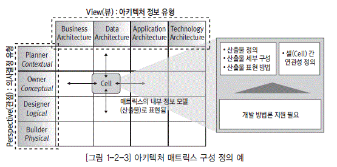

  * [그림 1-2-3] 아키텍처 매트릭스 구성 정의 예" width="555" height="275" border="0">

  * 아키텍처 정보 유형

아키텍처 정보 유형은 특성이 비슷한 아키텍처 정보를 그룹화 한 것으로, 기업이 관리하는 모든 아키텍처 정보를 수집하여 분류한다. 아키텍처정보 유형에는 업무 영역과 정보기술 영역으로 구분한다. 업무 영역은 조직, 사업 영역, 업무 기능, 업무 프로세스 등을 포함하고 정보기술 영역은 데이터, 애플리케이션, 기술 인프라 등을 포함한다. 흔히 업무, 데이터, 애플리케이션, 기술로 나눈다.

의사결정 유형의 구성요소는 기업의 정보화 관련 의사결정 계층 구조를 업무 분장이나 전결 규정, 면담 등을 통하여 파악하고, 의사결정 범위, 주기, 간격에 따라서 각 이해관계자별로 계층 구조를 정의한다. 아키텍처 정보 유형의 구성요소는 선진 사례의 뷰 구성을 바탕으로 기업의 정보 관리 요건을 반영하여 조직간 조정과 합의를 거쳐 결정한다.

  * [그림 1-2-4] 관점(Persective) / 뷰(View) 도출 절차" width="551" height="286" border="0">

아키텍처 매트릭스 정의시 선진 사례의 무조건적인 도입보다는 선진 사례에서 프레임워크를 참조하되, 기업의 현황을 고려하여 기업의 전사아키텍처 목표 달성에 필요한 구조로 아키텍처 매트릭스를 정의하는 것이 바람직하다.

### 다. 산출물 정의

의사결정 유형과 아키텍처정보 유형으로 구성된 매트릭스의 각 셀에 필요한 산출물을 정의한다. 산출물의 정의는 어떤 방법론을 사용하는가와 기업의 업무 특성이나 문화에 의하여 좌우된다. [표 1-2-1]과 [표 1-2-2]은 정보통신부와 전산원에서 발표한 아키텍처 매트릭스와 표준 산출물 예이다. 이 예는 하나의 가이드일 뿐 기업이 반드시 따라야 하는 것은 아니다.

[표 1-2-3] 공공 부문 아키텍처 매트릭스 예(공통, 보안 부분 제외)

| 뷰(View)/관점(Perspective) | 업무 | 데이터 | 응용 | 기술 |
|----|
| 계획자 | - 조직 구성도/

정의서

  *  업무 구성도/

정의서|- 데이터 구성도/

정의서|- 응용 시스템 구성도/

정의서|- 표준 프로파일

  *  기반 구조 구성도/

정의서

  *  기술 자원 목록 |
| 책임자 | - 업무 관계도/

기술서

  *  업무 기능 분할도/

기술서|- 개념 데이터 관계도

/기술서 - 데이터 교환 기술서|- 응용 시스템 관계도

/기술서 - 응용 기능 분할도/

기술서|- 기반 구조 관계도/ 기술서 |
| 설계자 | - 업무 절차 설계서|- 논리 데이터 설계서

  *  데이터 교환 설계서|- 응용 기능 설계서

  *  응용 분산 시스템 설계서|- 기반 구조 설계서

  *  시스템 성능 설계서 |
| 개발자 | - 업무 메뉴얼|- 물리 데이터 모델|- 응용 프로그램 목록|- 제품 목록 |

[표 1-2-4] 공공 부문 아키텍처 산출물 예(공통, 보안 부분 제외)

| 관점 | 산출물명 | 설명 |
|----|
 | 업무 | 조직 구성도/정의서|기업의 조직 또는 조직의 유형, 역할 간의 관계를 표현한 것으로 관련된 이해 당사자의 관계와 상위 조직과 하위 조직 간의 관계를 식별함 |

 | 업무 | 업무 구성도/정의서|기업 비즈니스 아키텍처의 개념적 모습을 도형으로 묘사한 산출물.

기업의 업무 기능을 사용자가 이해하기 쉽게 도식화하여 표현함으로써 비즈니스 아키텍처에 대한 이해와 이해 당사자 간의 대화 수단으로 활용 |

 | 업무 | 업무 관계도/기술서|업무 기능 간에 의존 관계를 도식화하여 표현. 업무 기능 간의 정보 흐름을 추적할 수 있음 |

 | 업무 | 업무 기능 분할도/

기술서|조직의 업무 기능을 계층 구조로 분류하여 표현한 것으로, 업무 기능을 식별하여 그 구조와 업무의 활동 내용을 기술함 |

 | 업무 | 업무 절차 설계서|업무 활동의 흐름을 기술한 산출물로, 각 업무 활동이 어떤 역할과 이벤트에 의하여 수행되고, 어떠한 정보를 주고받는지 등을 기술함 |

 | 업무 | 업무 매뉴얼|업무 기능과 업무 활동별로 세부 내역을 설명한 매뉴얼 정보 또는 그 목록 |

 | 응용 | 응용 시스템 구성도

/정의서|기업의 응용 시스템을 상위 수준에서 분류하고 표현함으로써 전체적으로 응용 시스템의 구조를 파악할 수 있는 산출물 |

 | 응용 | 응용 시스템 관계도

/기술서|응용 시스템 상호 간의 연계성을 표현한 것으로 응용 시스템 상호 간의 데이터 흐름을 파악할 수 있음 |

 | 응용 | 응용 기능 분할도/

기술서|응용 시스템의 기능을 계층적으로 표현한 것으로, 응용 기능의 업무 연관성과 재사용성을 파악하도록 함 |

 | 응용 | 응용 기능 설계서|응용 시스템의 기능을 정의하고 응용 기능 간의 상세 구조와 데이터 흐름을 표현한 것으로, 기능 간의 완전성 확인 가능 |

 | 응용 | 응용 분산 시스템

설계서|시스템의 분산 계층을 정의하고 분산 자원을 계층별로 할당하여 표현한 산출물 |

 | 응용 | 응용 프로그램 목록|응용 시스템에 정의된 응용 기능을 제공하는 프로그램의 정보 또는 목록. 시스템 개발 비용 산정을 위한 기반 자료로 활용됨 |

 | 데이터 | 데이터 구성도/

정의서|기업의 전체 데이터를 상위 수준에서 표현한 것으로 데이터베이스 구성현황을 한눈에파악할수있도록함‘( 개괄데이터모델’과유사함) |

 | 데이터 | 개념 데이터 관계도

/기술서|업무 수행을 위해서 필요한 데이터의 구조를 개념적 수준에서 표현 한 것. 주제 영역 또는 중요 엔터티 수준의 데이터 관계도. 업무 수행 에 필요한 데이터를 통합적으로 파악할 수 있음‘( 개념 데이터 모델’ 과 유사함) |

 | 데이터 | 데이터 교환 기술서|업무 기능 간에 교환되는 데이터 교환 요구 사항을 식별하여 표현한 것 |

 | 데이터 | 논리 데이터 설계서|업무를 수행하기 위해서 필요한 데이터의 구조를 논리적 수준에서 충분히 표현한 것으로, 데이터 유형(엔터티 타입), 식별자, 속성, 관계, 데이터 업무 규칙 등을 포함 |

 | 데이터 | 데이터 교환 설계서|응용 기능 간의 데이터 교환의 요건을 식별하여 이를 상세화하며 표현한 산출물 |

 | 데이터 | 물리 데이터 모델|업무 기능 또는 응용 시스템에 의하여 사용될 데이터를 실제 데이터 베이스로 구축하기 위해 필요한 물리적 특성을 정의한 모델. DBMS의 특성이나 거래 특성, 성능 요건 등을 고려한 설계가 됨 |

 | 기술 | 표준 프로파일|기술 참조 모델에서 정의한 기술 요소별로 아키텍처 구현에 적용되어야 하는 표준과 규칙, 제품 평가 기능 등을 기술한 자료 |

 | 기술 | 기반 구조 구성도/

정의서|기업의 기반 기술 구조에 대하여 상위 수준에서 그래픽하게 표현한 것으로 기반 기술 아키텍처를 한눈에 파악할 수 있도록 함 |

 | 기술 | 기술 자원 목록|기업의 기술 자원에 대해 전체적으로 현황을 파악할 수 있도록 작성된 현 시스템에 대한 현황서 |

 | 기술 | 기반 구조 관계도/

기술서|애플리케이션 또는 기술 서비스별 시스템 구성을 표현한 것으로, 시스템 간의 연결 관계 및 시스템 사양을 표현 |

 | 기술 | 기반 구조 설계서|시스템의 지리적 분포를 조망할 수 있는 산출물. 하드웨어, 소프트웨어, 네트워크 등이 표현 대상 |

 | 기술 | 시스템 성능 설계서|시스템에 요구되는 성능 요건을 충족시키기 위해 어떤 특성이 가장 핵심적인지를 식별하여 표현 |

 | 기술 | 제품 목록|정의된 기술 서비스와 표준을 지원하는 제품에 대한 정보 또는 목록 |

  * 매트릭스 셀 정의 내역

  * 현행 산출물 분석

  * 목표 산출물 정의

  * 산출물간 연관성 정의

  * 산출물 표현 방법 및 세부 구성 정의

### 라. 전사아키텍처 정보 구성 요소 정의

  * 전사아키텍처 정보 구성요소 식별

전사아키텍처 정보를 공유정보로 구축하기 위해서는 전사아키텍처 산출물에 포함된 정보를 중복이 없고 상호관계가 유기적으로 연결되도록 구성요소를 정의해야 한다. 전사아키텍처 정보가 문서 형태로만 관리될 경우에는 이러한 작업이 필요 없지만, 전사아키텍처 정보가 데이터베이스 형태로 구축되어 지속적으로 갱신되기 위해서는 전사아키텍처 산출물을 구성요소 단위로 분류하고 구성요소 간의 관계를 명확히 할 필요가 있다.

  * [그림 1-2-5] 전사아키텍처 정보 구성 요소 식별 예" width="538" height="318" border="0">

[그림 1-2-3]과 같이 식별된 구성 요소는 산출물의 종류와는 다른 형태를 보인다. 전사아키텍처 구성 요소는 전사아키텍처 정보를 구성하는 기초 단위라고 할 수 있으며, 산출물은 여러 개의 전사아키텍처 정보 구성 요소로부터 도출된 복합적인 정보라 할 수 있다.

  * 전사아키텍처 정보 구성요소 연관관계

전사아키텍처 정보 구성요소 간에는 많은 연관관계가 있다. 이러한 구성요소 간 연관관계를 통해 특정 업무를 지원하는 시스템이 무엇인지, 특정 시스템이 어떤 시스템과 연계되어 있는지를 알 수 있다. 또한 특정 시스템이 사용하는 데용되고 있?? 관리하면, 구성요소 간의 관계를 분석할 수 있기 때문에 특정 업무의 변화가 있었을 때 영향 받는 시스템, 데이터, 서버 등을 파악할 수 있다. 또한, 시스템 장애 발생시 연계된 시스템을 파악하여 장애 원인을 보다 쉽게 찾아낼 수 있다. 이를 통해 다양한 연관관계 매트릭스를 정의할 수 있으며, 필요한 보고서와 분석 자료를 생성할 수 있다.

연관관계가 많을수록 전사아키텍처 정보의 활용가치는 높아진다. 그렇지만, 전사아키텍처 정보의 유지관리 비용을 감안하여 현실적인 수준에서 연관관계 정보를 관리하는 것이 바람직하다.

### 마. 아키텍처 매트릭스 정의 시 고려 사항

첫째, 아키텍처 매트릭스에 정의되는 산출물은 업무와 IT, 관리자와 실무자 사이의 중요한 커뮤니케이션 툴이다. 매트릭스를 정의할 때는 일반적인 아키텍처 개념을 포함하면서 조직 내 모든 계층의 사람이 매트릭스에 포함되는 산출물이 범위와 목적에 적합하게 정의되었음을 확신할 수 있어야 한다.

둘째, 조직적, 정치적, 지리적 특성, 조직의 편견 등 다양한 조직 문화와 의사결정 구조가 반영되어야 한다. 같은 아키텍처 정보라고 하더라도 기업의 조직문화, 의사결정에 따라 산출물이 정의되는 셀이 틀려질 수 있음으로, 기업의 조직문화와 의사결정 구조를 고려해서 추상화를 해야 한다.

셋째, 아키텍처 매트릭스는 실제 시스템과 아키텍처 개발 표준에 대한 준수성을 높이고 조직별로 통일된 접근이 가능하도록 정의되어야 한다. 이는 IT 조직의 성숙도를 충분히 고려해야 한다. 매트릭스는 추상화의 수준이 포함된 구조이기 때문에 서로 다른 개발 환경과 요건을 반영하는 동시에 통일성과 일관성을 유지할 수 있도록 되어야 한다.

넷째, 각 아키텍처 도메인은 상호 간에 연계성을 가져야 한다. 비즈니스 아키텍처에서 정의된 산출물은 상호연관성을 가지며 데이터-애플리케이션-기술 아키텍처에 반영되고, 전사 차원에서 통합적인 아키텍처 관리가 이루어지도록 한다.

## 3. 참조 모델 정의

참조 모델 정의 작업에서는 기업의 기준 모델로 정의할 참조 모델의 체계와 구조를 정의하고 컨텐 츠를 구축한다.

이 공정은 다수 전사(Enterprise)를 가지고 있는 기업은 참조 모델을 정의하고, 개별 기업은 정의 된 참조 모델을 확인하는 과정이라고 할 수 있다. 즉, 이 단계에서 정부나 지주회사 또는 다수의 전사 를 가지고 있는 기관은 하위 전사나 소속 기업에서 참고할 참조 모델을 정의하게 되며, 개별 기업은 이러한 참조 모델을 참고하여 전사아키텍처 구성 요소의 타당성을 확인하게 된다.

참조 모델은 업무와 정보기술에 대한 체계적인 분류와 표준화를 통하여 정보화의 통합성, 중복 개 발 방지, 공유 정보의 발견, 상호운용성 향상 등의 목적으로 설계되어 있기 때문에, 개별 기업은 상 위기관이나 산업별 참조 모델을 참고하여 아키텍처 정보 구성 요소를 정의하는 것이 바람직하다.

참조 모델 정의는 기업이 속한 산업이나 가치 사슬 네트워크에 따라 그 범위가 달라질 수 있다. 기 업의 미션과 비전, 서비스의 특성, 기업 간 이해 관계 등을 고려해야 한다. 기술 참조 모델의 경우 개 별 기업도 기술 환경 변화에 대응하고 기술 요소 간 상호운용성을 고려하여 전사아키텍처 구축 시 정 의하여 활용하는 것이 바람직하다. 참조 모델에 대한 설명은 본 강좌의 3차 강의를 참고 바란다.

## 4. 전사아키텍처 원칙 수립

전사아키텍처 비전 달성을 위해 구성원들이 공통적으로 지켜야 하는 규범을 정의하는 것이다. 전사아키텍처 원칙은 전사아키텍처 목표 달성을 위한 의사결정의 객관적 기준을 제시하여 줌으로써, 의사결정을 효과적으로 지원해 주고 업무 협조와 조정을 위한 의사소통 과정의 투명성을 제공한다.

이는 비즈니스 전략과 정보화 전략의 연결성을 강화하는 것이고, 구성원들의 개별적인 의사결정이 조직의목표에 쉽게 정렬될 수 있도록 한다.

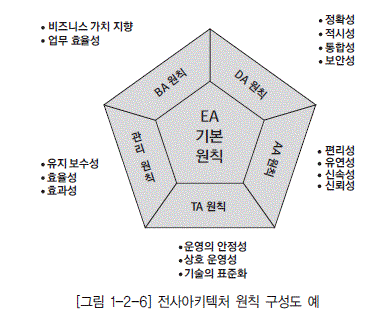

[그림 1-2-6] 전사아키텍처 원칙 구성도 예

전사아키텍처 원칙의 구성 요소는 다음과 같다.

  *  *원칙 :* 원칙의 내용을 간략하게 기술

  *  *의미 :* 원칙이 가지는 의미를 설명

  *  *근거 :* 원칙으로 채택된 원인 또는 배경

  *  *기대효과 :* 원칙이 전사아키텍처 수립에 미치는 영향 또는 준수시의 기대효과

전사아키텍처 원칙은 전사아키텍처 전체에 적용되는 기본 원칙과 아키텍처별 원칙으로 구분할 수 있다. 기본 원칙은 전사아키텍처를 추진하는 전사적 차원의 대원칙을 의미하고 개별 아키텍처별 원칙의 근거가 된다.

전사아키텍처 기본원칙은 전사아키텍처 방향 수립 단계에서 정의될 수 있고, 아키텍처별 원칙은 전사아키텍처 정보 구성 정의 단계가 수행되어 아키텍처 매트릭스가 결정된 후 아키텍처 도메인별로 정의될 수 있다.

[표 1-2-5] 전사아키텍처 기본 원칙 예

| 원칙 | 의미 |
|----|----|
| 업무 지향|기업의 정보화는 업무 개선과 상품 및 서비스 품질 개선에 기여할 수 있는 방향으로 추진되어야 한다. |
| 성과 지향|기업의 정보화는 객관적인 성과 지표에 의해 관리되고 평가되어야 한다. |
| 고객 지향|기업의 정보화는 고객의 만족도를 개선하는 방향으로 추진되어야 한다. |
| 상호운용|기업의 정보화는 전사아키텍처에 정의된 원칙과 아키텍처를 준수하여 시스템 간의 연계성과 운영의 지속성을 확보할 수 있는 방향으로 추진되어야 한다. |

아키텍처 원칙은 전사아키텍처 기본원칙을 기반으로 비즈니스 아키텍처, 데이터아키텍처, 애플리케이션 아키텍처, 기술 아키텍처 등의 아키텍처 도메인별로 원칙을 정의한다. 아키텍처 원칙은 각 아키텍처 정보를 정의하고 관리하는 기준이 되는 원칙으로, 각 아키텍처 정보 구축 시 준수되어야 한다.

[표 1-2-6] 아키텍처 원칙 예

| 아키텍처 | 원칙 | 의미 |
|----|----|----|
|비즈니스|범위의 완전성|기업이 수행하는 모든 업무 기능을 누락하지 않고 중복 없이 파악하여 정의한다. |

<tr>
<td class="lef" rowspan="2">데이터|데이터 표준 준수|정의된 표준에 따라 생성·수정·활용되도록 한다. |
|아키텍처 모델 관리|전사 차원의 아키텍처 데이터 모델을 관리하여 전사적 데이터 통합성을 유지한다. |
|애플리케이션|지원 기능 유일성|응용 시스템의 기능은 유일해야 한다. |

<tr>
<td class="lef" rowspan="2">기술|기술의 표준화|모든 기술 아키텍처 설계 및 도입 시에는 정의된 TRM/SP를 반드시 준수한다. |
|운영의 안정성|시스템의 장애에 대한 대응 체계 구축으로 시스템의 안정성, 연속성을 보장한다. |

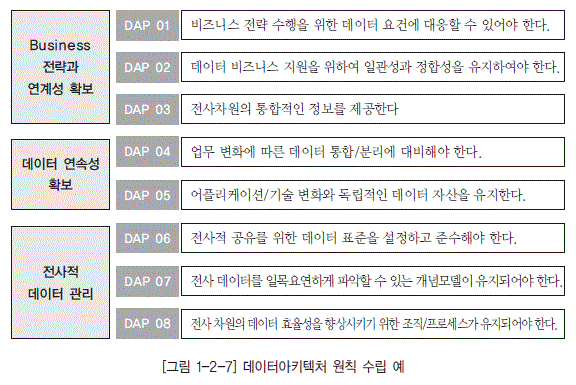

  * [그림 1-2-7] 데이터아키텍처 원칙 수립 예" width="576" height="385">

전사아키텍처 원칙을 수립할 때에는 다음과 같은 사항을 고려하도록 한다.

  * 원칙의 의도가 명확하게 제시되어 원칙 적용 시 혼돈의 발생을 최소화할 수 있어야 한다.

  * 아키텍처 및 계획 수립과 관련된 의사결정을 효율적으로 할 수 있도록 가이드할 수 있어야 한다.

  * 중대한 정보 기술 관련 의사결정 시 규범으로써 활용될 수 있어야 한다.

  * 전사아키텍처 조직의 모든 정보 관리 및 기술과 관련된 의사결정은 전사아키텍처 원칙을 기반으 로 수행하여야 한다.

  * 원칙 간에 서로 상반되는 지향점을 갖지 않도록 원칙 수립 시 사용되는 용어는 주의하여 선택하여 야 한다.

# 제3절 전사아키텍처 정보 구축

## 1. 전사아키텍처 정보 구축 준비

아키텍처 정보를 구축하기 위해서는 우선 기존에 작성된 자료를 수집해야 한다. 수집해야 할 자료는 정의된 아키텍처 매트릭스에 따라 달라진다.

업무에 관련된 것은 기업에서 관리하는 업무 지침서나 규정 등을 참조하고, 데이터나 애플리케이션에 관련된 것은 정보시스템 구축 시 작성한 산출물이나 완료보고서 등을 참조하고, 기술 인프라에 관한 것은 시스템 도입 관련 문서들과 운영 매뉴얼 등을 참조한다. 필요한 자료가 정의된 산출물의 형식 그대로 존재하지 않을 경우가 있는데 이런 경우에 유사한 산출물을 활용하거나 필요 시 생성 또는 보완 작업을 수행할 수 있다.

### 나. 전사아키텍처 정보 구축 방식

전사아키텍처 정보를 구축하는 방법에는 상향식과 하향식이 있다. 상향식 구축 방법은 최하위에 있는 구성요소를 조사 분석하여 구성요소들의 공통점을 파악하여 공통적인 구성요소들을 모아 상위 구성요소를 정의해 나가는 방식이다. 상향식 방식은 조직의 모든 업무가 포함되는 것을 보장할 수 있는 장점이 있는 반면, 상위 업무 기능 분류의 수준이 서로 다르게 나타날 수 있는 단점이 있다. 하향식 구축 방법은 최상위의 구성요소로부터 시작하여 분류 기준에 따라 하위 구성요소를 도출해 내는 방식이다. 하향식 방식은 일반적인 분류 기준이나 목적에 따른 분류 기준을 따르기 때문이 관점이 명확한 장점이 있다. 그러나 일부 업무가 누락될 가능성이 있으며 어디에도 포함되지 않는 구성요소가 발생할 수 있다는 것이 단점이다.

## 2. 현행 아키텍처 정보 구축

현행 아키텍처 정보의 구축은 현재 업무나 정보시스템에 대하여 기존의 자료를 분석하여 전사아키텍처 정보를 구축하는 것을 말한다. 상위 수준의 업무 기능과 시스템에 대한 분류를 우선 수행한 후 그 기준에 따라 나머지 전사아키텍처 정보를 구축하는 것이 효율적이다. 상위 수준의 분류 기준의 정리되면 나머지 정보 구축은 병렬적으로 수행해도 된다.

현행 아키텍처는 아키텍처 매트릭스의 전범위에 걸쳐 수행하는 것이 바람직하며 각 셀에서 정의하고 있는 산출물을 기준으로 현재 관리되고 있는 모델 및 문서를 정리 및 보완하여 현행화 하는 작업을 수행한다.

현행 비즈니스 아키텍처 정보 구축은 기업의 비전, 경영 목표, 조직 구조 등을 파악하여 정의하는 것에서 시작된다. 다음으로 업무 기능을 정의하는데, 하향식 방식(Top-Down Approach)으로는 가치 사슬분석을 통하여 최상위 업무 기능을 도출하고, 각 업무 기능을 점점 더 세분화하는 방식으 로 진행한다. 상향식 방식(Botton-up Approach)으로는 기업이 현재 수행하고 있는 단위 업무를 조사하고, 단위 업무를 유사성 기준으로 묶어 상위 업무기능을 도출하는 방식으로 업무 기능을 도출 한다. 도출된 업무 기능은 기업의 비전이나 조직 구조와 연계성을 파악한다. 향후 애플리케이션이나 데이터 등과의 연관 관계를 파악하여 상호 검증을 수행 한다.

업무 프로세스 정의도 마찬가지 방식으로 진행한다.

  * 현행 비즈니스 아키텍처 정의 내역
  * 전사 사업모델 분석
  * 조직 모델 분석
  * 업무 기능 모델 정의
  * 프로세스 모델 정의
  * 업무 매뉴얼 파악

### 나. 현행 애플리케이션 아키텍처 정보 구축

현행 애플리케이션 아키텍처 정보 구축은 업무 기능 분류를 기반으로 전사 애플리케이션을 분류하 고, 연관 관계를 분석하는 것에서 시작된다. 애플리케이션의 구조와 서비스, 응용 기능 등을 도출한 다. 도출된 애플리케이션과 데이터, 애플리케이션 서비스와 데이터의 연관 관계를 분석하고 조직이 나 업무 기능 등의 다른 구성 요소와의 연관 관계를 분석하여 상호 간의 정합성을 검증한다.

애플리케이션 영역이나 구성요소는 서비스 참조 모델을 참조하여 연관된 서비스 영역과의 연결성을 확인한다.

  * 현행 애플리케이션 아키텍처 정의 내역
  * 전사 애플리케이션 영역 식별
  * 애플리케이션 모델 정의
  * 컴포넌트 모델 정의
  * 프로그램 목록 파악
  * 애플리케이션 원칙, 표준 파악

### 다. 현행 데이터아키텍처 정보 구축

현행 데이터아키텍처 정보 구축은, 하향식의 경우 기업의 업무 수행을 위해 필요한 데이터 요건을 식별하여 데이터 모델로 표현한다. 상향식은 각 시스템에서 사용하는 데이터 정보를 분석하여 데이터 모델로 정렬하여 표현한다. 계획자 수준의 상위 정보만을 구축할 경우는 하향식 방식이 적합하며, 실무자 수준의 정보를 구축할 경우에는 상향식 방식이 더 적합하다고 할 수 있다.

하향식의 경우 의사결정이나 현황 파악의 정보 요건을 바탕으로 필요 데이터를 도출하고 정보 요건을 상세화하면서 세부 데이터 모델을 정의한다. 상향식의 경우 운영 중인 데이터베이스의 물리 테이블에 대응되는 논리 개체를 정의하고, 논리 개체 간의 관계를 정의하는 방식으로 정보를 구축하며, 논리 개체를 주제별로 묶어 개념 개체로 정의하고 그 관계를 정의한다. 데이터아키텍처 정보가 구축되면 업무 기능과 애플리케이션과의 연계성 분석을 통하여 정확성을 검증한다.

  * 현행 데이터아키텍처 정의 내역
  * 전사 데이터 영역 식별
  * 개념 데이터 모델 정의
  * 논리 데이터 모델 정의
  * 물리 데이터 모델 정의
  * 데이터베이스 객체 파악
  * 데이터 원칙, 표준, 관리 프로세스 파악

### 라. 현행 기술아키텍처 정보 구축

현행 기술 아키텍처 정보 구축은 기업의 전산 장비, 시스템 소프트웨어, 네트워크 등 기술 인프라의 구성을 체계적으로 분류하여 표현하는 것이다. 먼저 전사의 기술 인프라의 영역을 분류하고, 영역별로 구성요소를 도출하고 구성요소 간의 관계를 식별하여 표현한다. 기술 아키텍처 정보 구축 시 기술 참조 모델을 사전에 정의하여 참조하면 전체적인 일관성을 확보할 수 있다.

  * 현행 기술 아키텍처 정의 내역
  * 전사 기술영역 식별
  * 기술 참조 모델 정의
  * 기술 표준 분석
  * 기술 아키텍처 요소 식별
  * 기술자원 목록, 제품 목록 파악

## 3. 목표 아키텍처 정보 구축

목표 아키텍처 구축은 현행 아키텍처에 대한 문제점과 개선 사항을 도출하고, 이를 목표 아키텍처 에 반영하는 방식으로 진행한다. 아키텍처 간의 정의 순서는 비즈니스아키텍처를 먼저 정의하고 이 를 효율적으로 지원하는 아키텍처를 정의하는 것이 바람직하다.

목표 아키텍처의 구축 범위는 전사아키텍처 구축의 목적에 따라 다르지만, 일반적으로 초기 전사 아키텍처 수립 시에는 현행 아키텍처와 달리 아키텍처 매트릭스의 개념적 수준까지 정의한다. 개념 적 수준 이하의 산출물 작업은 실제 시스템 구축 단계에서 수행하는 것이 일반적인 접근이다. 이는 전사아키텍처?? 아키텍처에 대한 비즈니스와 기술 환 경 변화에 대한 유연성을 확보하기 위한 의미도 있다.

현행 추가 업무와 개선 요구 사항을 목표 비즈니스아키텍처에 반영한다. 사전에 업무 프로세스 재 설계(BPR, Business Process Reengineering)와 같은 작업이 이루어진 경우에 해당 작업의 결과 를 목표 비즈니스아키텍처에 반영한다. 업무 참조 모델과 연계성을 파악하여 관계를 확인한다.

목표 비즈니스아키텍처의 수준에 따라 데이터 및 애플리케이션아키텍처 수준이 결정되기 때문에 비즈니스아키텍처 정의는 중요한 의미를 가지고 있다. 특히, 목표 비즈니스아키텍처는 기업의 미래 비전을 달성하기 위한 모습을 정의하는 것을 포함해 다른 아키텍처의 적합성을 판단하는 중요한 기 준이 된다.

  * 목표 비즈니스 아키텍처 정의 내역
  * 전사 사업 모델 정의
  * 조직 모델 정의
  * 업무 기능 모델 정의
  * 프로세스 모델 정의
  * 업무 매뉴얼 정보 구축

### 나. 목표 애플리케이션아키텍처 정보 구축

목표 애플리케이션 아키텍처 정보는 목표 비즈니스 아키텍처를 지원하는 전사 애플리케이션의 구조를 정의하는 것이라고 할 수 있다. 일반적으로 목표 업무의 개선요구나 추가적인 애플리케이션 구축 요구와 애플리케이션 자체의 개선요구를 아키텍처에 반영하는 방식으로 진행한다. 도출된 애플리케이션 아키텍처 정보는 관련 비즈니스 아키텍처나 데이터아키텍처와 연관관계를 비교하여 검증한다. 또한 목표 애플리케이션 아키텍처 정의 시 서비스 참조 모델과의 연계성을 파악하여 상위 기업이나 유관 기업과의 인터페이스를 제고할 수 있도록 한다.

  * 목표 애플리케이션 아키텍처 정의 내역
  * 전사 애플리케이션 영역 모델 정의
  * 애플리케이션 모델 정의
  * 컴포넌트 모델 정의
  * 프로그램 목록 정보 구축

### 다. 목표 데이터아키텍처 정보 구축

목표 데이터아키텍처 정보는 목표 비즈니스 아키텍처를 지원하는 데이터를 식별하여 모델로 표현하는 것이라고 할 수 있다. 일반적으로 목표 업무의 개선요구나 추가적인 데이터 요구, 데이터 자체의 개선요구를 데이터아키텍처에 반영하는 방식으로 진행한다. 도출된 데이터아키텍처 정보는 관련 비즈니스 아키텍처나 애플리케이션 아키텍처와 연관관계를 비교하여 검증한다. 또한 목표 데이터아키텍처 정의시 데이터 참조 모델과의 연계성을 파악하여 상위 기업이나 유관 기업과의 데이터 인터페이스를 제고할 수 있도록 한다.

  * 목표 데이터아키텍처 정의 내역
  * 전사 데이터 영역 모델 정의
  * 개념 데이터 모델 정의
  * 논리 데이터 모델 정의
  * 물리 데이터 모델 정의
  * 데이터베이스 개체 정보 구축
  * 데이터 원칙, 표준, 관리 프로세스 정의

### 라. 목표 기술아키텍처 정보 구축

목표 기술 아키텍처 정보 구축은 목표 애플리케이션 아키텍처와 데이터아키텍처를 잘 지원할 수 있는 기술 아키텍처를 정의하는 것이라고 할 수 있다. 최근의 기술 추이와 기업의 특성을 고려한 기술술 아키텍처를 정립한다. 목표 기술 아키텍처는 기술 참조 모델과 연계하여 전체 기술 인프라의 상호운용성을 제고할 있도록 해야 하는데, 일반적으로 기술 아키텍처를 기술 참조 모델을 바탕으로 기술 구성요소와 기술 분야를 상세화하는 방식으로 진행하는 것이 바람직하다.

표준 프로파일은 조직의 수준에 따라 선택되어야 하는 표준의 기준 및 수량, 깊이가 다르다. 그렇지만 동일 기업 내에 이용되는 표준은 그 기업의 표준 프로파일과 일관성을 가져야 한다. 대상이 되는 표준을 선정할 때 개방형 시스템의 구현과 국제 표준을 항상 고려해야 한다. 그렇지만, 표준 프로파일의 구성이 구체적인 개방 시스템 환경을 정의하거나 보장하는 것은 아니므로 기업에서는 표준 및 공통기술을 위한 개방형 시스템 구축에 필요한 기준을 추가로 정의해야 한다. 표준 프로파일은 기업이 관리 가능한 수준으로 구성하는 게 바람직하며, 기술의 발전 및 환경, 기업의 비전이나 업무 등에 따라 계속 갱신해야 한다.

  * 목표 기술 아키텍처 정의 내역
  * 전사 기술 영역 모델 정의
  * 기술 참조 모델 정의
  * 표준 프로파일 정의
  * 기술 아키텍처 모델 정의
  * 기술자원 목록, 제품 목록 정보 구축

# 제3장 전사아키텍처 관리 및 활용

# 제1절 전사아키텍처 관리 체계

## 1. 전사아키텍처 관리 체계 개요

전사아키텍처를 도입함에 있어 아키텍처 정보를 정확하게 구축하는 것도 중요하지만, 더 중요한 것은 그러한 전사아키텍처 정보를 관리하고 활용할 수 있는 체계를 정립하는 것이다. 전사아키텍처 관리 체계는 전사아키텍처를 유지 관리하기 위한 조직과 프로세스 측면의 기반을 구축하는 것을 의미한다. IT 기획에서 서비스 제공에 이르는 모든 과정에서 전사아키텍처 정보를 활용하여 의사결정이 이루어짐으로서 일관성과 합리성이 증대되는 것을 목적으로 한다. 최근 이런 전사아키텍처 관리 체계의 중요성에 대한 인식이 높아지고 있다.

전사아키텍처 관리 체계는 전사아키텍처 관리 조직, 전사아키텍처 관리 프로세스, 전사아키텍처 관리 인력을 포함한다.

  * IT 관리 체계와 전사아키텍처 관리 체계

IT 관리 체계는‘IT 거버넌스’라고도 한다. 이는 IT 관리의 효율성과 효과성을 증대하기 위한 IT전반에 관한 관리 체계를 정립하는 것을 말한다. 전사아키텍처 관리 체계는‘EA 거버넌스’라고도 하는데, 전사아키텍처를 유지하고 지속적으로 개선하기 위해 제도적 기반을 구축하는 것을 의미한다. 전사아키텍처 관리 체계는 IT 관리 체계의 틀 속에서 통합되어야 한다.

  * [그림 1-3-1] IT 관리 체계(IT 거버넌스)와 전사아키텍처 관리 체계(EA 거버넌스)" width="549" height="212" border="0">

[Tip] ----------------------------------------------------------------------------------------

 *전사아키텍처 관리 체계와 EA 거버넌스 : :*
전사아키텍처 관리 체계를 최근에 EA 거버넌스라는 용어로 자주 사용한다. 이 책에서는 동일한 의미로 본다. 마찬가지로 IT 관리 체계와 IT 거버넌스도 같은 의미로 본다

---------------------------------------------------------------------------------------------

### 나. 전사아키텍처 관리 체계 구축 방향

전사아키텍처 구축의 효과를 높이기 위해서는 전사아키텍처 간의 통합성과 전사아키텍처 내의 통합성이 확보되어야 한다. 전사아키텍처 간의 통합성이란 복수 기관 간에 통합적으로 전사아키텍처가 구축되는 것을 의미한다. 또 전사아키텍처 내의 통합성이란 단일 기업 내에서 전사아키텍처 영역 간에 통합적으로 전사아키텍처가 구축되는 것을 의미한다.

전사아키텍처 관리 체계 정착을 위해서는 장기적인 접근이 필요하며 단기 효과보다는 장기간의 효과를 중시해야 한다. 또한 전사아키텍처 수립의 효과는 IT 관련 조직만의 노력으로 달성될 수 없으며 전사적인 추진 체계가 되어야 한다. 현업 부서도 전사아키텍처를 이해하고 비즈니스 아키텍처에 대한 정보를 활용하고 IT 혁신에 대한 적극적인 의견 제시와 협조가 필요하다.

효과적인 전사아키텍처 관리관체계를 구축하기 위해서는 다음을 고려해야 한다.

  * 정의된 전사아키텍처 조직 체계, 프로세스 체계 등을 문서화하여 전 조직이 준수할 수 있도록 제도화한다.

  * 전사아키텍처 관련 제반 이해당사자의 전사아키텍처 인지도 향상 및 업무 수행시 전사아키텍처정보 활용도 증진을 위한 적절한 교육 프로그램을 제공한다.

  * 목표 아키텍처로의 전환, 정보자원 관리의 혁신 등 전사아키텍처 도입에 따른 변화 관리를 위한 종합적인 프로그램을 운영한다.

  * 전사아키텍처 관리 체계를 주기적으로 점검하여 개선점을 도출하여 반영할 수 있는 제도적 장치를 마련한다.

  * 전사아키텍처 관리 시스템을 활용도와 만족도를 주기적으로 점검하여 시스템의 품질을 지속적으로 개선해 나간다.

## 2. 전사아키텍처 관리 조직 체계

전사아키텍처 관리 조직 체계는 전사아키텍처 관리를 위해 필요한 직무와 직무간의 관계, 업무 분장을 정립하는 것이다. 전사아키텍처 조직은 기업 전체 또는 정보관리 전체 조직과 일관성을 확보해야 한다. 전사아키텍처 관리 조직 체계는 계획자 수준에서 실무자 수준까지 다양한 시각에서 책임과역할이 정의되어야 한다.

전사아키텍처 관리 조직의 직무 예로는 다음을 들 수 있다.

  *  *전사아키텍처 담당 임원 :* 전사아키텍처 수립에 대한 투자 의사결정, 전사아키텍처의 주요 추진 과정에 대한 승인, 전사적 지원의 확보

  *  *전사아키텍처 아키텍트 :* 전사아키텍처에 대한 전체적 원칙 및 방향 정의, 전사아키텍처 관리의 총괄, 영역간의 조정

  *  *전사아키텍처 영역별 담당자 :* 비즈니스 아키텍처, 데이터아키텍처, 애플리케이션 아키텍처, 기술아키텍처 등의 전사아키텍처 영역별 원칙과 정보를 관리하는 담당자

  *  *전사아키텍처 관리시스템 관리자 :* 전사아키텍처 관리 시스템의 구축 및 운영을 담당

  *  *전사아키텍처 추진 위원회 :* 전사아키텍처 수립 및 적용에 대한 전사적인 중요 의사결정에 대한 승인 또는 자문을 수행하는 그룹

### 나. 전사아키텍처 관리 조직의 정의

구축된 전사아키텍처 정보를 담당하는 전담 조직이 없다면 전사아키텍처 정보는 하나의 문서에 불과하게 된다. 전사아키텍처 정보는 상호연관성을 유지하며 지속적으로 관리가 되어야 한다. 이를 위해서는 기업의 상황에 맞게 전사아키텍처를 담당하는 조직을 정의할 필요가 있다. 전사아키텍처 전담 조직은 선진 사례를 참고하고, 정보 관리 전체 조직과 전사아키텍처 관리 조직의 문제점을 파악 해 개선 방향을 도출하여 이를 기반으로 전사아키텍처 조직을 정의한다. [그림 1-3-2]는 전사아키텍 처 조직 구성의 예를 보여주고 있다.

[그림 1-3-2]에서 제시된 전사아키텍처 조직의 공통된 특징은 전사아키텍처 정보를 관리하기 위 한 위원회 및 전담 조직을 아키텍처 영역별로 정의하고 있다. 전사아키텍처와 관련된 이슈를 해당 팀 안에서만 아니라 공론화된 회의를 통해 관련 문제를 해결해 나갈 것을 정의하고 있다.

  * [그림 1-3-2] 전사아키텍처 관리 조직 구성 예" width="581" height="312" border="0">

전사아키텍처 관리 조직 정의 시 다음과 같은 것을 고려한다.

  * IT 조직의 규모

  * 전사아키텍처 관리 조직을 별도 조직으로 구성할 수 없는 중소 규모의 IT 조직은 전사아키텍처 관리 운영위원회(또는 TFT) 중심으로 전사아키텍처 관리 조직을 정의하고 전사아키텍처 전담 인력을 양성한다.

  * 전사아키텍처 관리 조직을 별도 조직으로 구성할 수 있는 대규모의 IT 조직은 전사아키텍처 관리 전담 조직을 신설하고, 전사아키텍처 관리 운영위원회를 통해 전사적으로 의사결정을 공유할 수 있는 조직 체계를 정의한다.

  * 전사아키텍처 구축의 목적

  * 전사아키텍처 구축 목적이 순수하게 아키텍처 관리와 IT 표준화 등을 위한 것이면 전사 아키텍처와 IT 표준을 통합 관리할 수 있는 전사아키텍처 관리 조직을 정의한다.

  * 전사아키텍처 구축 목적이 신시스템 구축을 위한 계획 수립이면, 프로젝트 기간 중 전사아키텍처 정보를 관리할 수 있는 조직이 필요하다. 전사아키텍처 정보 중심으로 프로젝트를 관리할 수 있는 PMO(Project Management Office)와 전사아키텍처 관리 전담 조직을 정의한다.

  * IT 조직과 현업과의 관계

  * 현업과 IT 조직간의 의사소통 문제가 있을 경우 현업의 요건을 종합적으로 관리하는 조직을 추가로 정의한다.

## 3. 전사아키텍처 관리 프로세스

전사아키텍처 관리 프로세스는 전사아키텍처를 관리하기 위한 활동을 정의하는 것이다. 전사아키 텍처 관리 프로세스는 전사아키텍처 관리와 관련된 모든 활동을 포함하고, 전체 정보관리 업무 체계 와 일관성이 확보되어야 한다. 전사아키텍처 관리 프로세스는 전사아키텍처 관리를 수행하는 세부 업무를 분류하고 내용을 정의하는 것은 물론 전사아키텍처 관리를 위해 준수해야 할 규정이나 구체 적이고 표준화된 수행 절차 또는 문서 양식을 정의하는 것을 포함한다.

예를 들면 전사아키텍처 관리 프로세스는 전사아키텍처 기획, 전사아키텍처 변경관리, 전사아키텍처 준수통제, 전사아키텍처 활용지원, 전사아키텍처 관리 시스템 관리, 전사아키텍처 평가 등으로 구분할 수 있다.

  * 전사아키텍처 기획

전사아키텍처 관리의 방향과 전사아키텍처를 효과적으로 적용 및 활용하기 위한 계획을 수립하는 등의 전사아키텍처 추진의 기획 관련 제반 활동

  * 전사아키텍처 변경 관리

영역별 전사아키텍처 정보의 변경에 대한 검토, 승인, 변경 이행 등 전사아키텍처 정보의 최신성과 품질을 확보하기 위한 제반 활동

  * 전사아키텍처 준수 통제

각 정보관리 부문이나 관련 현업 부서에서 전사아키텍처 정보를 참조하고 준수하는지 점검하고 지원하는 등의 전사아키텍처 준수도 제고를 위한 제반 활동

  * 전사아키텍처 활용 지원

각 정보관리 부문이나 관련 현업 부서에서 전사아키텍처 정보를 잘 활용하도록 전사아키텍처 정보의 공지, 홍보, 교육, 활용사례 전파 등 전사아키텍처 활용도를 제고하기 위한 제반 활동

  * 전사아키텍처 관리 시스템 관리

전사아키텍처 관리 및 활용의 효율성 제고를 위한 정보관리 시스템을 구축하고 운영하는 제반 활동

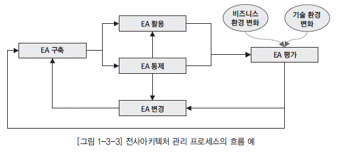

  * [그림 1-3-3] 전사아키텍처 고나리 프로세스의 흐름 예" width="566" height="257" border="0">

  * 전사아키텍처 평가

전사아키텍처 관리 및 활용 수준의 제고를 위해 전사아키텍처 평가 모형을 정의하고 주기적으로 평가하여 개선의 기회를 식별하는 제반 활동

### 나. 전사아키텍처 관리 프로세스 구성

전사아키텍처 관리를 위한 프로세스는 일반적으로 전사아키텍처 구축 후 이를 활용하고 통제한다. 비즈니스 환경이나 기술환경의 변화와 전사아키텍처 활용 상태를 평가하여 필요한 변경조치를 취하며 이것이 다시 전사아키텍처 정보로 구축되어 전사적으로 적용되는 흐름을 갖는다.

전사아키텍처 관리 프로세스의 정의는 전사아키텍처 구축을 통해 모든 활동의 중심이 전사아키텍처 중심으로 수행될 수 있도록 하여야 한다. 만약에 기존의 IT 프로세스에 전사아키텍처 변경 및 관리 프로세스만을 신규로 추가하여 정의할 경우에는 기존의 IT 프로세스에 따라로세스가 제대로 수행되지 않을 가능성이 많다. 전사아키텍처 관련 프로세스가 제대로 수행하지 않을 경우에는 전사아키텍처 정보의 최신성이 유지될 수 없게 된다. 전사아키텍처 원칙이 IT 프로세스 활동에 적용되지 않아 전사아키텍처 정보의 완전성을 유지할 수 없는 문제가 발생할 수 있다.

따라서 IT 프로세스 수립-활용/통제-평가-변경 등의 흐름을 전사아키텍처 관점에서 식별하여 전 사아키텍처 정보 중심으로 설계하면 전사아키텍처 정보의 완전성을 유지할 수 있다. 전사아키텍처 정보의 변경을 개발 및 운영 프로세스에서 식별하여 전사아키텍처 정보 변경이 바로 이어질 수 있도 록 하여 전사아키텍처 정보의 최신성을 유지할 수 있어야 한다.

  * [그림 1-3-4] 생명주기 관점의 관리 프로세스 예" width="566" height="344" border="0">

## 4. 전사아키텍처 관리 인력

전사아키텍처 관리 인력은 전사아키텍처 관리를 담당하는 직무별 역량을 정의하고 이를 확보하기 위한 방안을 정의하는 것이다. 전사아키텍처 관리를 위해 필요한 역량 요소를 분류하고, 역량 요소를 직무별로 할당하고, 이러한 역량 요소를 확보하기 위한 교육 계획을 수립하고 역량 수준을 평가할 수 있는 체계를 포함한다. 전사아키텍처가 제대로 정착되고 성과를 발휘하기 위해서는 관련 인원들의 역량 확보가 매우 중요하다. 전사아키텍처 역량 강화를 위한 교육 프로그램은 구성원의 특성에 맞게 직무별로 맞춤식 교육이 제공될 수 있도록 해야 한다.

전사아키텍처 역량 요소는 리더십 역량, 기술적 역량, 활용 역량으로 구분될 수 있다. 전사아키텍처 리더십 역량은 전사아키텍처의 사상과 가치가 기업에 어떤 의미가 있는지를 정확히 파악하고, 기업이 전사아키텍처를 효율적으로 도입하고 효과적으로 활용할 수 있도록 전사아키텍처에 대한 전사적 공감대를 형성하고 내재화를 위한 변화관리를 제대로 이끌 수 있는 관리 능력이다. 전사아키텍처 기술적 역량은 전사아키텍처의 구축 및 관리에 대한 절차와 방법론을 이해하고 있고, 전사아키텍처 정보를 정의할 수 있고, 전사아키텍처 관리 시스템을 구축할 수 있는 기술적 능력이다. 전사아키텍처 활용 역량은 전사아키텍처 정보를 활용하여 정보관리 업무와 현업의 업무활동의 효율성과 효과성을 증대할 수 있는 실용적 능력이다. 이러한 능력은 실질적으로 전사아키텍처 투자에 대한 성과와 직접적으로 연관되어 있다고 할 수 있다.

### 나. 전사아키텍처 전문가 육성

전사아키텍처 구축 완료 후 이를 관리하기 위한 조직 정의만으로 전사아키텍처 정보를 지속적으로 발전시킬 수 없다. 전사아키텍처 정보를 지속적으로 발전시킬 수 있는 아키텍처 영역별 아키텍트가 조직 내부에 있어야 한다.

전사아키텍처 구축 프로젝트가 완료된 이후에 프로젝트에 참여한 내부 인력 중심으로 관리 조직을 구성할 수도 있다. 하지만, 전사아키텍처 구축 프로젝트에 참여한 인력을 아키텍처 영역별 아키텍트로 발령만 내면 완료되는 것은 아니다. 이들이 진정한 각 영역별 아키텍트로 성장하기 위해서는 전사아키텍처 관리 직무에서 필요한 기술 수준을 정의해야 한다. 이와함께 부족한 기술이 있을 경우 교육을 통해 관련 기술을 쌓아 나갈 수 있도록 관리를 해야 한다.

  * [그림 1-3-5] 전사아키텍처 관리를 위한 직무 구성 예" width="433" height="198" border="0">

현재 내부 아키텍트가 보유하고 있는 기술 수준을 평가하여 내부 아키텍트가 전사아키텍처 정보를 원활하게 관리할 수 있는 기술 수준으로 도달 할 수 있도록 인력 양성 계획을 수립해야 한다. 인력 양성 계획은 각 아키텍트에게 경력 개발 경로를 제시하고 교육 및 평가 과정을 통해 상위의 관련 직무로 성장 할 수 있도록 한다.

# 제2절 전사아키텍처 관리 시스템

## 1. 전사아키텍처 관리 시스템 개요

전사아키텍처 관리 시스템은 전사아키텍처 정보를 구축하여 관리하고 활용하는 모든 전사아키텍 처 업무 프로세스에 대한 효율성 제고를 지원하기 위한 정보 시스템이다. 전사아키텍처 관리 시스템 은 모델링 도구를 포함하는 정보 정의 도구 영역과 전사아키텍처 리포지터리(Repository)와 전사아 키텍처 포털로 구성된 정보 관리 영역, 전사아키텍처 정보 활용 영역으로 구분할 수 있다.

전사아키텍처 모델링 도구는 전사아키텍처 정보를 도식화하여 표현할 수 있는 모델링 도구를 말한 다. 아키텍처별로 개별 모델링 도구일 수도 있고 통합된 모델링 도구가 될 수도 있다. 전사아키텍처 리포지터리는 전사아키텍처 정보를 저장하기 위한 데이터베이스와 전사아키텍처 정보 데이터 관리 를 포함한다. 전사아키텍처 포털은 전사아키텍처 정보를 다양한 사용자가 쉽게 접근할 수 있도록 유 저 인터페이스를 제공하고 있다. 경우에 따라서는 전사아키텍처 정보를 전문적으로 분석하여 활용하 는 도구가 포함된다.

  * [그림 1-3-6] 전사아키텍처 관리 시스템 구성도 예" border="0">

## 2. 전사아키텍처 정보 정의 도구

전사아키텍처 모델링 도구는 업무, 데이터, 애플리케이션, 기술아키텍처 정보를 도식화하여 표현 할 수 있는 모델링 도구를 말한다. 전용 전사아키텍처 모델링 도구일 수도 있고, 범용 데이터 모델링 도구나 애플리케이션 모델링 도구일 수도 있다. 전사아키텍처 정보를 모델링 도구로 사용하여 등록 하는 이유는 전사아키텍처 정보의 활용도를 높이기 위한 것인데, 경우에 따라서는 일반 문서화 도구 를 사용할 수도 있다. 전사아키텍처 정보가 각 관점과 뷰 간에 관계 정보까지 관리되어 상호운용성과 통합성 효과를 발휘하기 위해서는 전사아키텍처 모델링 도구가 사용되는 것이 바람직하다고 할 수 있다.

모델링 도구는 각종 다이어그램의 표현은 물론 프레임워크의 생성과 각 개체 간의 관계를 표현할 수 있는 기능을 제공해야 한다. 나아가 모델링 정보에 대한 질의와 보고서 생성 기능, 전사아키텍처 포털로 정보를 인터페이스할 수 있는 기능도 제공해야 한다.

## 3. 전사아키텍처 정보 관리 시스템

전사아키텍처 정보 관리 시스템은 아키텍처 정보를 저장하는 리포지터리와 전사아키텍처 정보를 사용자에게 배포하는 포털, 전사아키텍처 정보를 전문적으로 분석할 수 있는 추가적인 도구로 구성 된다.

  * [그림 1-3-7] 전사아키텍처 정보 관리 시스템 예" border="0">

전사아키텍처 정보 관리 시스템은 전사아키텍처 정보에 대한 버전 관리, 전사아키텍처 정보의 현 행과 목표의 비교, 아키텍처 매트릭스나 참조 모델과의 연계, 전사아키텍처 사용자의 권한 관리, 전 사아키텍처 정보에 대한 활용 통계, 분석 및 의사결정 지원 기능 등을 포함한다. 전사아키텍처 정보 관리 시스템은 패키지 형태로 도입하여 커스터마이징을 하는 방법과 자체 시스템을 구축하는 방법이 있다. 장단점은 일반적인 패키지 도입과 자체 개발의 차이 관점에서 보면 된다.

전사아키텍처 관리 시스템은 유지 관리 효율성을 극대화하고 정보의 공유와 변경 관리를 수행하는 데 있어 편리한 정보 접근성을 제공한다. 그리고 전사아키텍처 관리 시스템 활용을 통하여 각 업무를 수행하는 사용자들에게 정보를 제공하여 업무와 IT의 연관 관계 분석 및 차이 분석을 쉽게 수행할 수 있게 한다. 또한 아키텍처 매트릭스 기반의 정보 제공으로 IT 담당자 간의 일관되고 일원화된 의사 소통을 가능하게 한다. 결국 전사아키텍처 관리 시스템은 전사아키텍처 구축의 목적인 IT 투자의 중 복성 제거 및 IT 자원의 재활용성을 극대화할 수 있게 한다.

전사아키텍처 정보 관리 시스템의 도입 효과는 다음과 같다.

  * 첫째, 아키텍처 정보를 공유할 수 있어 해당 조직의 각 아키텍처 요소에 대해 이해 관계자들이 정 확하게 파악할 수 있다. 아키텍처별 최신 정보를 아키텍처 담당자의 관점에 맞게 정보를 제공할 수 있게 된다. 동시에 다수의 사용자에게 동일한 정보를 제공할 수 있고, 전사아키텍처 관리 시스템의 다양한 조회 기능을 통해 좀 더 빠르게 아키텍처 정보에 접근할 수 있다.

  * 둘째, 의사소통 도구로 전사아키텍처 관리 시스템을 활용할 수 있다. 현업과 IT가 공유할 수 있는 모델을 전사아키텍처 관리 시스템을 통해 제공함으로써 현업과의 의사소통 시 오류를 줄일 수 있 다. 또한 아키텍처별 요소 간의 연관 관계를 파악하여 관련 업무 조직과 사전에 협의하여 문제를 사전에 인식함으로써 현업의 만족도를 높일 수 있게 된다.

  * 셋째, 전사아키텍처 관리 시스템을 의사결정 도구로 활용할 수 있다. 업무와 IT 서비스 간의 차이 분석을 전사아키텍처 관리 시스템을 이용하여 할 수 있고, 현행 아키텍처와 목표 아키텍처 간의 차 이 분석을 손쉽게 할 수 있어, 시스템 개선과 관련해 좀 더 빠른 의사결정을 할 수 있게 된다.

# 제3절 전사아키텍처 활용

## 1. 전사아키텍처 활용 개요

기업의 신규 IT 투자는 계속되고 있고, 기존 시스템의 유지보수 비용은 계속 증가하고 있다. 전사적인 아키텍처와 원칙이 없이 단위 업무 위주의 근시안적인 IT 투자가 계속될 경우 시스템은 중복개발 되고, 시스템간의 상호운용성이 떨어지게 된다. 이로 인하여 재구축과 재투자가 반복되고, 비즈니스와 정보기술의 변화에 제대로 대응할 수 없게 된다. 이러한 문제를 해결하기 위해서는 전사아키텍처를 구축하고 이를 적극적으로 활용할 수 있어야 한다.

전사아키텍처의 활용이 활성화 되기 위해서는 실제 전사아키텍처 정보가 IT 관리 업무에 실질적으로 활용될 수 있도록 해야 한다. 구축된 전사아키텍처 정보를 바탕으로 목표 아키텍처를 달성하기 위한 이행계획을 수립하고, 효율적인 IT 투자에 대한 의사결정과 IT 자원에 대한 관리가 수행되어야 한다.

전사아키텍처의 활용 영역은 크게 2개로 구분할 수 있다.

  * 목표 아키텍처 이행 계획

전사아키텍처 수립 후 목표 아키텍처를 달성하기 위한 이행계획을 수립하고 그에 따라서 프로젝트를 추진하는 것이다. 주로 새로운 시스템 추진을 목적으로 전사아키텍처를 수립하는 경우에 해당한다.

  * 전사아키텍처 정보 상시 활용

전사아키텍처 정보를 활용하여 일상의 IT 업무를 지원하는 것이다. 전사 아키텍처 정립을 통해 기업의 전반적인 IT 관리 수준을 증대하고자 하는 경우에 해당한다.

## 2. 목표 아키텍처 이행 계획

목표 아키텍처 이행 계획은 현행 아키텍처에서 목표 아키텍처로의 이행을 위한 전략을 수립하고 구체적인 이행 계획을 수립하는 것이다. 현행 아키텍처와 목표 아키텍처의 차이 분석을 통하여 프로젝트를 정의한다. 정의된 프로젝트들 간의 유사성과 상호연관성을 고려하여 우선 순위를 결정하고 이를 위한 이행전략과 세부 이행계획을 수립한다. 이를 성공적으로 추진하기 위한 변화관리 계획의 수립도 필요하다. 세부 이행 계획에는 필요 인력과 자원에 대한 리소스 계획과 추진 일정, 비용 계획 등이 포함된다.

목표 아키텍처 이행계획의 주요 활동 및 작업은 다음과 같다.

  * 아키텍처 차이(Gap) 분석
  * 목표 및 현행 아키텍처 검토
  * 차이분석
  * 프로젝트 정의
  * 프로젝트 목록 정의
  * 개별 프로젝트 별 필요 리소스 정의
  * 프로젝트 우선 순위 및 연관성 분석
  * 이행 전략 수립
  * 프로젝트 이행에 필요한 단계별 이행 전략 대안 수립
  * 이행 전략 별 타당성 분석 및 대안 확정
  * 이행 전략 수립
  * 프로젝트 별 추진 방법 정의
  * 프로젝트 별 상세 일정계획 수립
  * 변화관리 계획 수립
  * 변화관리 대상 및 변화 요인 식별
  * 변화관리 계획 수립
  * 변화관리 교육 계획 및 자료 작성

## 3. 전사아키텍처 정보 상시 활용

전사아키텍처 정보 상시 활용은 기업이 전사아키텍처 정보를 구축하여 IT 업무 전반에 일상적으로 활용하는 것이다. 이를 위해서는 전사아키텍처 정보의 지속적인 개선 체계와 전사아키텍처 관리 시스템의 구축이 선행되어야 한다.

구축된 전사아키텍처 정보를 잘 활용하기 위해서는 적용 영역을 적극적으로 발굴하고, 업무 적용을 점점 확산해 나가야 한다. 전사아키텍처 정보는 IT 관리 생명주기에 해당하는 IT 기획 관리, IT구축 관리, IT 운영 및 통제 등 활동 전반에 활용된다.

[표 1-3-1] 전사아키텍처 정보 활용 영역 예

| 활용 유형 | 내용 |
|----|----|
| IT 기획 관리|- 업무 프로세스 혁신 : 비즈니스 변화와 정보기술 변화에 따르는 영향을 분석하여 대응하고, 조직 간의 업무 수행 범위 및 중복성 확인으로 업무 프로세스 개선 가능

  *  정보화 계획 수립 : 정보화 전략 계획 수립 시에 활용할 수 있으며, 중복을 배제 한 효과적인 시스템 투자 계획 수립에 활용 |
| IT 구축 관리|- 프로젝트 계획 : 정보시스템 구축을 위한 구체적인 프로젝트 계획 수립 및 제안 요청서 작성 시 활용

  *  시스템 개발 : 기존 시스템 개선 및 신규 시스템 개발을 위한 기준 및 참조 정보 를 제공하며, 시스템 간 연계성 및 재사용 대상을 식별할 수 있음 |
| IT 운영 및 통제|- 시스템 운영 : 시스템 장애 시에 전체 모습을 쉽게 파악할 수 있어 문제점을 신속 하게 찾아 낼 수 있으며, 시스템의 변경 시에 영향도를 파악할 수 있어 위험을 최 소화할 수 있음

  *  IT 통제 : 도입되는 시스템이 전사 표준을 준수하는지를 통제함으로써 상호운용 성, 유지 보수 편리성 등을 확보함 |

IT 기획 관리 활용은 중장기 정보화 계획, 단기 정보화 계획 수립 시 전사아키텍처 정보를 바탕으로 기업의 업무와 전략적 방향에 맞는 목표 시스템을 정의하고 추진계획을 수립한다. 이러한 추진 계획들은 전사아키텍처 정보를 기준으로 타당성이 검증되어야 하고 승인되어야 한다. 기업의 IT 추진방향에 맞는 IT 기획을 하기 위해서는 전사의 업무와 IT 아키텍처에 대한 이해가 필요하다. 전사아키텍처 정보는 이러한 정보 요구에 활용할 수 있다.

전사아키텍처 정보는 IT 투자에 대한 포트폴리오 관리에도 활용될 수 있다. IT 포트폴리오 관리란 기업의 비즈니스 전략, 정보기술의 변화, IT 투자 여력 등을 고려하여 기업의 사업 영역, 정보시스템 영역, 정보시스템 생명주기별로 적정한 투자가 이루어 질 수 있도록 IT 투자를 총체적으로 관리하는 것을 의미한다. 이 또한 전사아키텍처의 정보가 필요한 영역이다. 업종의 통합, 대형화, 세계화가 계속 진전되고 전사의 형태 있어 IT 투자도 변화에 대비하면서 적정한 투자가 이루어질 수 있도록 관리되어야 한다. 최근에 기업의 정보 자원이 효율적으로 배분하기 위한 IT 포트폴리오 관리의 필요성이 증대되고 있다.

### 나. IT 구축 관리

IT 구축 관리 활용은 시스템 분석, 설계, 구축, 이행 등의 모든 시스템 구축 생명주기 동안에 전사 아키텍처 정보를 바탕으로 범위를 정의하고, 애플리케이션 시스템을 설계하며, 데이터아키텍처를 정 의하고, 기술 체계를 선정하는 것을 말한다. 시스템 구축 과정에서 전사아키텍처 정보로 관리되고 있 는 원칙이나 표준, 아키텍처, 참조 모델 등이 참조되어 시스템의 중복을 배제하고 재사용성을 높이며 시스템의 통합성을 제고하고 IT 비용을 절약할 수 있게 된다.

한편, 기업 내 여러 개의 프로젝트가 항상 진행 중이므로 프로젝트 관리 능력이 중요하게 되었다. 정보시스템의 통합성이 중요하게 되었고 다양한 선진 기술이 적용됨에 따라 프로젝트 관리의 난이도 가 높아졌다. 따라서 전문적이고 독립적인 프로젝트 관리 기능이 필요하다. 이러한 기능이 수행되기 위해서는 먼저 관리의 기준이 정의되어야 하는데, 이러한 기준이 바로 전사아키텍처 정보라고 할 수 있다. 전사아키텍처 정보 대부분은 직접적으로 이러한 프로젝트 관리의 기준이 되며, 프로젝트의 변 화 관리 측면에서도 큰 활용성을 제공할 것이다. 시스템 구축이 완료되면 변경 사항을 전사아키텍처 정보에 반영하는 것도 매우 중요하다.

### 다. IT 운영 및 통제

IT 운영 및 통제 활용은 전사아키텍처의 현행 아키텍처 정보를 바탕으로 시스템을 운영하고, 사용 자의 개선 또는 추가 요구 발생 시 전사아키텍처 정보를 바탕으로 수용 또는 적용 방안을 결정하여 시스템 변경에 반영하는 것이다. 시스템 운영 시 성능 문제나 장애 발생 시 신속한 파악과 해결에 전 사아키텍처 정보는 매우 유용한 정보가 될 수 있다.

전

사아키텍처 정보는 시스템의 도입 및 폐기의 근거 자료가 될 수 있으며, 운영상에 발생하는 이슈 의 경중을 가릴 수 있는 정보로도 활용할 수 있다. IT 서비스의 품질 지표가 아키텍처 프로세스와 연 관되어 IT 업무에 대한 주기적인 평가와 보완이 이루어지고, 피드백이나 실행을 통해 도출된 보완 내용이 정보 전략이나 예산 프로세스에 제공될 수 있다.

## 4. 전사아키텍처 효과적 활용 방안

전사아키텍처 도입 초기에는 일반적인 기대 효과를 중심으로 활용되지만, 시간이 지나면 다양한 요구가 발생할 수 있다. 이에 따라 경우에 따라서는 프레임워크나 아키텍처 매트릭스의 변경이 발생할 수 있다. 전사아키텍처 구축 후 활용이 지속되고 기업의 전사아키텍처 성숙도가 높아지면, 요구 수준도 높아지며, 경우에 따라서는 전반적인 개선이 필요할 수도 있다.

전사아키텍처 정보가 좀 더 효과적으로 활용되기 위해서는 다음과 같은 사항이 고려되어야 한다.

  * 전사아키텍처 정보 자체의 품질이 보장되어야 한다. 현행 및 목표 시스템의 상황이 아키텍처 정보 에 항상 최신의 상태로 정확히 반영되어야 한다.

  * 전사아키텍처 정보를 관리하고 적용을 통제할 수 있는 전담 조직이 구성·운영되어야 한다. 이 조 직은 전사아키텍처 정보에 품질과 활용도 제고를 책임지며, 필요시 전사아키텍처 정보의 근거 자료 를 제시할 수 있어야 한다.

  * 전사아키텍처 정보를 전사적으로 공유하고 활용할 수 있는 절차와 시스템이 필요하다.

전사아키텍처의 도입은 정보화에 대한 일시적이고 단편적인 개선이 아니라 좀 더 정확한 정보를 바 탕으로 통합되고 일관성 있게 정보화를 계획, 실행, 검증 및 평가하는 체계를 갖추는 것이다.

  * [그림 1-3-8] 전사아키텍처 활용 유형" width="409" height="263">

전사아키텍처 구축은 일정 기간의 프로젝트를 통해 수행되지만 중요한 것은 전사아키텍처 정보가 활용되어야 한다는 사실이다. 기업의 모든 자원을 효과적으로 활용하고 투자에 대한 적절한 활동을 수행하기 위해서는 전사아키텍처가 정확한 기준 정보로서 제공되어야 한다. 이를 위해서는 활용 목 적에 따라 정확하게 각 아키텍처 도메인을 정의해야 하고, 정의된 전사아키텍처를 유지하기 위해 더 많은 노력을 해야 한다.

이와 같이 전사아키텍처에 대한 지속적인 관리 및 평가 활동을 통해 기업들은 궁극적인 IT 혁신을 달성할 수 있다.

## 5. 전사 아키텍처와 데이터아키텍처 전문가 영역

데이터아키텍처 전문가의 영역은 데이터아키텍처 전반에 관한 것으로, 광의의 데이터아키텍처 영역과 일치한다고 할 수 있다. 광의의 데이터아키텍처 영역은 데이터아키텍처 원칙, 데이터아키텍처정보, 데이터아키텍처관리 등을 포함한다. [그림 1-3-7]는 전사아키텍처 프레임워크를 참조한 광의의 데이터아키텍처 프레임워크의 예이다.

  * [그림 1-3-9] 전사아키텍처 활용체계 수립 절차" width="494" height="326">

데이터아키텍처 전문가(DAP, Data Architecture Professional)는 데이터아키텍처를 정의하는데 있어 기업에서 정의한 전사아키텍처 정보와 항상 연계하여 생각해야 한다. 전사아키텍처에서 정의된 원칙과 정보, 관리 체계를 준수해야 하며 데이터아키텍처 분야에서 더욱 구체화하고 그것을 관리할 수 있어야 한다. 또한 데이터 부문에서 발생하는 변경사항이 전사아키텍처 정보에 잘 반영될 수 있도록 항상 관심을 가져야 한다.

데이터아키텍처 담당자는 전사아키텍처 프레임워크를 바탕으로 데이터아키텍처 프레임워크를 상세화하고 구체화할 임무를 가지고 있다. 데이터아키텍처 정책의 데이터아키텍처 매트릭스, 데이터아키텍처 비전, 데이터아키텍처 원칙 및 표준을 더욱 구체화하고 그 내용을 정의할 수 있어야 한다. 데이터아키텍처 정보의 데이터 구조, 데이터 흐름, 데이터 활용, DB 관리, 데이터 품질 등도 데이터 관리자의 업무 프로세스와 연계하여 구체화하고 그 내용을 정의할 수 있어야 한다. 데이터아키텍처 관리의 관리 체계, 메타 데이터 관리 시스템, 평가 부문도 데이터의 효율적 관리와 효과적 활용을 위해서 잘 이해하고 있어야 할 영역이다.

  * [그림 1-3-10] 광의의 데이터아키텍처 프레임워크 예" width="528" height="374" border="0">

### 나. 전사아키텍처와 데이터아키텍처

기업의 데이터아키텍처가 진정 의미 있기 위해서는 전사 아키텍처와 통합이 이루어져야 한다. 통합의 유형에는 3가지가 있다. 전사아키텍처 전체와 범위가 일치되어야 하고, 타 아키텍처 영역와 연계가 잘 되어야 하고, 상위 아키텍처와 하위 아키텍처가 잘 연계되어야 한다.

  * [표 1-3-2] 전사아키텍처와 데이터아키텍처의 통합성 예" width="586" height="309">

전사아키텍처 관련 데이터아키텍처가 이루어야 할 3가지의 통합성은 다음과 같다.

  * 범위 통합

전사아키텍처 범위 전체에 대한 각 모델 내의 불일치성을 제거하는 것이다. 중복개발의 반대 개념이며, IT 투자의 효율성을 제고하는 원천이 된다.

  * 수평 통합

관련된 타 영역과의 불일치성을 제거하는 것이다. 운영의 조화와 관련되어 있고 IT 투자의 효과성을 제고하는 원천이 된다.

  * 수직 통합

계획자, 책임자, 설계자, 개발자간의 불일치성을 제거하는 것이다. 요구 사항에 대한 일치, 정렬(Alignment) 개념과 관련되어 있고 IT 투자의 품질 을 제고하는 원천이 된다.

# 과목2. 데이터 요건 분석

# 제1장 정보 요구 사항 개요

# 제1절 정보 요구 사항

## 1. 정의

정보 요구 사항이란 사용자가 일상적으로 수행하는 업무의 개선 사항이나 신규 개발 사항으로 시 스템을 통해 기능상의 목적을 달성하기 위해 요청하는 내용이다. 이러한 정보 요구 사항들은 현행 시 스템 분석, 사용자 요구 사항 수집, 제안 요청서, 사업 수행 계획서 등을 이용하여 수집 가능하다. 사용자의 정보 요구 사항을 정해진 일정과 비용 범위 내에서 사용자가 원하는 시스템으로 개발하기 까지는 많은 어려움이 존재한다.

현실적인 개발 환경에서 프로젝트의 성공을 위해서는 불완전하고 애매모호하게 정의된 정보 요구 사항, 현실성을 배제한 이상적인 정보 요구 사항, 특정 사용자만을 위한 정보 요구 사항들은 프로젝 트 초기 단계부터 정확한 요건 분석이 이루어져야 한다. 잘못 분석되고 설계된 정보로 시스템을 개발 한다면 사용자 요구 사항을 만족하지 못하는 시스템이 되고, 이는 사용자가 사용하지 않기 때문에 처 음부터 다시 설계하고 개발해야 하는 위험과 추가적인 비용을 지불하게 된다.

Standish Group 조사 결과에 의하면 사용자 정보 요구 사항에 대한 중요성을 확인할 수 있다. 일 반적으로 성공했다고 이야기하는 프로젝트와 실패했다고 이야기하는 프로젝트 모두 사용자 정보 요 구 사항에 대한 철저한 분석 및 변화 관리가 주요한 요인으로 작용했다. 전체 프로젝트의 29%만이 계획된 예산 내에서 납기를 준수하고, 원하는 기능과 요구 사항을 달성했다. 프로젝트의 18%는 프로 젝트 완료 전에 또는 사용자들이 사용해 보기도 전에 취소되는 경우이고, 53%의 프로젝트는 표면상 으로는 성공하였으나 내면적인 부분을 살펴보면 납기가 지연되거나 예산이 늘어나거나 기능 및 품질 에 문제가 있어 실질적인 성공으로 보기 어렵다.

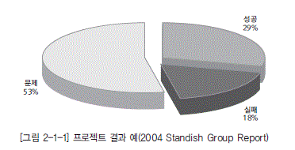

  * [그림 2-1-1] 프로젝트 결과 예(2004 Standish Group Report)" width="372" height="190">

[그림 2-1-1]의 3가지 사례를 초래한 각 프로젝트의 원인을 다시 한 번 살펴보면 공통적으로 사용 자의 정보 요구 사항에 대한 중요도를 알 수 있다. 따라서 현업 사용자들이 이야기하는 정보 요구 사 항을 IT 업무 담당자들은 처음부터 철저하게 이해하고, 무슨 내용이며 어떤 기능들을 요구하는지 정 확하게 분석하기 위해 많은 시간과 노력을 집중해야 한다.

  * [그림 2-1-2] 사용자 요구 사항의 중요성(2004 Standish Group Report)" width="574" height="173">

더욱 구체화되고 다양화되는 사용자 정보 요구 사항과 복잡해진 정보시스템의 현행을 정확하게 분 석하고 이해할 수 있는 능력이 데이터아키텍처 전문가에게 필요하다.

## 2. 정보 요구 사항 생명주기 모형(Life Cycle)

정보 요구 사항의 생명주기 모형은 [그림 2-1-3]과 같이 정보 요구 사항 수집, 정보 요구 사항 분 석 및 정의, 정보 요구 사항 상세화, 정보 요구 사항 검증으로 구성된다. 생명주기 모형을 반복적으 로 수행하여 사용자 정보 요구 사항이 정보시스템에 누락 없이 반영되어야 한다.

  * [그림 2-1-3] 정보 요구 사항 생명주기" width="439" height="174">

사용자의 정보 요구 사항을 수집하는 단계로서 사용자 인터뷰, 설문서, 워크숍, 현행 시스템 분석 등을 통해 수집한다.

### 나. 정보 요구 사항 분석 및 정의

사용자로부터 수집된 정보 요구 사항을 정리하고 방법론에서 제시하는 다양한 기법을 이용하여 분석해서 정보 요구 사항을 정의하는 단계이다.

### 다. 정보 요구 사항 상세화

확정된 정보 요구 사항의 개별 사항에 대하여 세밀하게 분석하고 기록하는 단계이다.향후 사용자 의 정보 요구 사항이 정보시스템에 정확하게 반영될 수 있도록 상세하게 작성한다.

### 라. 정보 요구 사항 검증

사용자의 정보 요구 사항을 비즈니스 관점, 조직 관점, 애플리케이션 관점과 상관분석을 통해 누락 없이 반영되었는지를 검증하는 단계이다.

## 3. 정보 요구 사항 유형

사용자의 정보 요구 사항을 유형별로 4가지로 나누어 보면 기능 개선 요건, 성능 개선 요건, 외부 인 터페이스 요건, 보안 개선 요건 등으로 구분할 수 있으며, 신규 업무에 대한 추가 및 기존 업무에 대한 개선 사항이 대부분의 요구 사항으로 도출되는 점을 감안할 때 기능 개선 및 성능 개선 요건이 많은 비 중을 차지한다. 각각의 종류별 정의, 관리 기준, 관리 방법 측면에서 정리해 보면 [표 3-1-1] 과 같다.

[표 3-1-1] 정보 요구 사항 유형

| 유형 | 구분 | 기대효과 |
|----|----|----|
<tr>
<td style="border:1px solid #666;" rowspan="4">외부 인터페이스 요건 | 정의</td>
<td style="border:1px solid #666;" colspan="2">시스템의 모든 입·출에 관한 요건으로서 대외기관으로부터 수신 및 대외기관으로 송신하는 입출력 방식이 추가 및 변경되었을 경우와 각종 제도 및 기준 등이 변경되었을 경우에 발생하는 요건이다. |

<tr>
<td style="border:1px solid #666;" rowspan="2">관리 기준 | 중복성 | 기존에 동일한 형태의 인터페이스가 존재하는지 체크한다. |
| 표준 준수도 | 인터페이스와 관련된 국제 표준 및 국가 표준이 존재할 경우, 그에 적합한 형태로 제공해야 한다. |
| 관리 방법</td>
<td style="border:1px solid #666;" colspan="2">항목 이름, 목적 설명, 입력의 원천 및 출력의 방향, 유효 범위, 시간, 다른 입/출력과의 관계, 데이터 포맷, 최종 메시지 등이 포함되어 관리되어야 한다. |

<tr>
<td style="border:1px solid #666;" rowspan="4">기능 개선 요건 | 정의</td>
<td style="border:1px solid #666;" colspan="2">시스템에서 입력을 받아들여 처리하고 출력을 만들어 내는 주요 활동 및 프로세스에 대한 요건이다. |

<tr>
<td style="border:1px solid #666;" rowspan="2">관리 기준 | 불가 변성 | 기능 개선 요건이 향후에 재변경되지 않도록 근본적인 개선 방안을 요청해야 한다. |
| 범용성 | 많은 사용자가 편리하게 사용할 수 있는 요건을 우선적으로 요청해야 한다. |
| 관리 방법</td>
<td style="border:1px solid #666;" colspan="2">입력에 대한 유효 체크, 정확한 처리 순서, 비정상 상태에 대한 반응(오버플로우, 통신 장비, 에러 처리), 매개변수의 기능, 출력과 입력의 관계, 입출력 순서, 입력을 출력으로 변환하는 공식 등이 포함되어 관리되어야 한다. |

<tr>
<td style="border:1px solid #666;" rowspan="4">성능 개선 요건 | 정의</td>
<td style="border:1px solid #666;" colspan="2">사용자가 원하는 성능 개선 사항으로는 동시 사용자 수, 처리하는 정보의 양과 종류, 트랜잭션 소요 시한 등이 있다. |

<tr>
<td style="border:1px solid #666;" rowspan="2">관리 기준 | 실현 가능성 | 해당 성능 개선 요구 사항이 현행 기술 수준과 서비스 특성을 고려할 때 구현 가능한 요건인지를 확인한 후 제시되어야 한다. |
| 측정 가능성 | 측정이 불가능한 모호한 형태로 요건이 제시되면 안 된다. |
| 관리 방법</td>
<td style="border:1px solid #666;" colspan="2">각 기관의 서비스 특성을 고려하여 정적, 동적 기준을 마련하고 해당 기준에 맞게 서비스되고 있는지를 모니터링 작업을 통해 항시 관리해야 한다. |

<tr>
<td style="border:1px solid #666;" rowspan="4">보안 개선 요건 | 정의</td>
<td style="border:1px solid #666;" colspan="2">중요 데이터에 대한 훼손, 변조, 도난, 유출에 대한 물리적 접근 통제(제한구역, 통제구역 등) 및 사용 통제(인증, 암호화, 방화벽 등)에 대한 요건을 말한다. |

<tr>
<td style="border:1px solid #666;" rowspan="2">관리 기준 | 불가 변성 | 보안 개선 요건이 향후에 재변경되지 않도록 근본적인 개선 방안을 요청해야 한다. |
| 실현 가능성 | 해당 보안 개선 요구 사항이 현행 기술 수준과 서비스 특성을 고려할 때 구현 가능한 요건인지를 확인한 후 제시되어야 한다. |
| 관리 방법</td>
<td style="border:1px solid #666;" colspan="2">가장 먼저 보안 관리가 필요한 정보에 대한 등급 관리가 필요하며, 해당 등급별로 접근 가능한 이용자 등급 관리가 필요하며 접근 방식에 있어서의 접근 통제 기준 및 사용 통제 기준이 제시되어야 한다. 해당 기준에 따라 모니터 작업을 통해 안정적인 서비스가 제공될 수 있도록 관리해야 한다. |

# 제2절 정보 요구 사항 관리

## 1. 정의 및 관리 목적

정보 요구 사항을 비롯하여 관련 애플리케이션 및 시스템 전반에 걸친 사용자의 요구를 수집하고 분류하여 반영하는 작업 절차를 말한다. 정보 요구 사항을 종합적으로 검토, 확인함으로써 요건에 맞는 정보시스템을 개발하여 사용자의 만족도를 높인다.

정보 요구 사항 관리는 데이터, 애플리케이션, 비즈니스 등의 요구 사항을 전부 포함하는 통합 관리 프로세스를 정립해야 한다.

## 2. 정보 요구 사항 관리 프로세스

### 가. 업무흐름 프로세스

사용자로부터 정보 요구 사항을 접수하고, 반영 여부를 결정하여 통보하고, 최종적으로 시스템 개 발로 완료되는 전체적인 업무 흐름 프로세스는 [그림 2-1-4]와 같다.

  * [그림 2-1-4] 정보 요구 사항 업무 흐름 프로세스" width="555" height="255">

  * 요구 사항 발송

사용자가 정보시스템을 활용하면서 발생하는 불편 사항이나 신규 개발 사항 등의 요건을 정보 요 구 사항 정의서 양식에 기록하여 정보시스템 담당자에게 발송한다. 정보 요구 사항 정의서는 [그림 2-1-5]와 같이 구성할 수 있다.

  * 요구 사항 수렴

사용자로부터 접수한 정보 요구 사항 정의서를 수집하여 규칙에 맞게 정확하게 정의했는지 확인하 고, 해당 요건을 검토할 처리 담당자를 지정하여 이송한다.

  * 요구 사항 검토

요청된 정보 요구 사항과 관련된 자료 및 작성 기준, 구성요소, 원칙 등을 확인해서 반영 여부를 판단한다. 반영이 가능한 경우는 개발 물량, 협조 담당자, 관련자 등의 영향도 분석을 한다. 반영이 불가능한 경우는 미반영 사유와 함께 요건을 발송한 담당자에게 재전달하여 결과를 알 수 있게 한다.

  * 영향도 분석

요청된 내역을 토대로 신규 개발 및 변경에 따른 영향이 얼마나 되며, 이로 인해 영향을 받는 설계서, 기존 애플리케이션, 데이터베이스 등을 파악해서 영향도 분석을 마무리한다.

  * 공식화

영향도 분석 후 관련되는 담당자를 소집하여 의견을 공유하고, 담당자들과의 협의를 통해 반영 유형을 결정한다. 반영 유형은 규모 및 기간, 시급성에 따라 결정되며 처리 방법은 신규 시스템 개발 또는 기존 시스템 변경에 의해 발생한다.

  * 반영 작업 계획 수립

영향 분석 결과를 근거로 업무 영역 및 관련 담당자들과의 미팅 후 반영 계획을 수립한다. 작업 일정 계획에는 표준과 설계서 변경, 데이터베이스 및 애플리케이션 수정, 테스트, 이관 등의 작업이 명시되어야 한다.

  * [그림 2-1-5] 정보 요구 사항 정의서 예" width="562" height="277">

### 나. 수행 조직 및 수행 업무

사용자 정보 요구 사항을 반영하기 위해 필요한 역할별 담당 업무는 [표 3-1-2]과 같다.

[표 2-1-2] 역할별 담당 업무

| 역할 | 담당업무 |
|----|
| 사용자 | - 정보 요구 사항 정의 및 상세화

  *  정보 요구 사항 변경 요청

  *  정보 요구 사항 반영을 위한 미팅

  *  정보 요구 사항 반영 여부 확인

  *  미결 사항에 대한 의사결정 실시 |
| 담당자 | - 사용자 정보 요구 사항 접수

  *  사용자 정보 요구사항에 대한 기본적인 검토

  *  반영 여부 결정을 위한 사용자와 1차 미팅

  *  접수 요건에 대한 처리 방식 및 처리 기한 결정

  *  관련 부서별 담당자 수집 및 요건 협의 주도

  *  사용자 정보 요구 사항 반영

  *  테스트 및 검증

  *  사용자 반영 결과 통보 |
| 데이터

아키텍처

전문가 | - 사용자 정보 요구 사항에 대한 표준/데이터베이스/애플리케이션 차원에 대한 영향도 분석 및 보고

  *  접수된 요구 사항에 대한 표준 준수 여부 체크

  *  영향도 분석을 통한 수정 및 변경 계획 수립

  *  표준 제시 및 준수 여부 검토 |

# 제2장 정보 요구 사항 조사

# 제1절 정보 요구 사항 수집

## 1. 정보 요구 사항 수집 형태

사용자 정보 요구 사항을 파악하기 위한 방법은 다양하다. 사용자와의 인터뷰를 통한 직접적인 수 집도 가능하지만 현업 사용자가 업무에 대한 기준이나 절차를 알아보기 위해 사용하는 업무 매뉴 얼을 통해서도 요구 사항을 도출할 수 있으며, 정보시스템을 사용하기 위한 전산 처리 매뉴얼, 기 존 정보시스템의 산출물 등 다양한 형태의 자료로부터 현행 정보시스템 및 사용자 요구에 대한 정 보를 수집할 수 있다.

  * 사용자 정보 요구 사항 수집을 위한 다양한 소스 형태

  * 관련 문서 수집

  * 사용자 면담을 통한 수집

  * 워크샵을 통한 수집

  * 현행 업무 처리 매뉴얼을 통한 수집

  * 현행 정보시스템 관련 산출물을 통한 수집

## 2. 관련 문서 수집

관련 문서에는 업종에 대한 이해에 도움이 되는 자료, 기업에 대한 전체적인 상황 이해시 도움이 되는 자료, 사용자가 업무 처리를 위해 참고로 하는 상세한 업무 매뉴얼, 업무 처리시 활용하는 정보 처리 매뉴얼, 정보시스템으로부터 산출되는 보고서 및 각종 장표, 처리 화면 등이 포함되며 본 자료 를 수집하고 체계적으로 분석해서 정리함으로써 사용자 정보 요구 사항을 파악한다.

### 가. 문서수집 목적

구현 시스템의 대상과 범위를 좀더 명확하게 정의하고 기업과 업종에 대해 잘 이해하기 위하여 업종, 경영 전략, 정보시스템 등에 대한 과거 실적 자료 및 향후 계획 등의 자료를 수집한다.

### 나. 문서 수집 자료

정보 요구 사항에 도움이 되는 자료의 종류 중 대표적인 자료는 다음과 같다.

  * 경영 계획에 대한 자료

예) 중장기 경영 전략, 향후 3년에 대한 경영 계획서

  * 정보시스템에 대한 자료

예) 현행 발행 보고서, 전산 처리 의뢰서

  * 과거 수행한 컨설팅 보고서

  * 전산처리 업무 매뉴얼

  * 현업부서 업무 자료

예) 실무 교육 자료

### 다. 문서수집 원칙

  * 문서는 기존에 보유하고 있는 문서를 변형하지 않고 수집하고, 정보시스템에 대한 자료는 별도의 정리 양식을 이용하여 작성한다.

  * 수집된 문서를 바탕으로 경영 및 정보시스템 현황에 대한 요약표를 작성하여 그 내용을 숙지한다.

  * 수집된 문서들은 계획 수립 기간, 문서 관리자를 지정하여 운영한다.

  * 유형별 문서를 향후 활용을 위하여 문서 분류 방식을 결정한 후에 일정한 장소에 보관한다.

  * 수집된 문서는 통상 대외비의 성격이 강하므로 개인별로 보관하는 것을 통제하고 문서 보안 관리에 주의한다.

## 3. 사용자 면담

면담은 분석가가 특정 관점에서의 업무 요건이나 업무 절차를 조사하기 위하여 일반적으로 한 명 (혹은 두 명)의 실무자와 대면하여 질의와 응답을 통해 정보를 수집하는 방법이다. 특히 프로세스와 프로시저에 대한 이해를 얻기 위한 준비 단계 또는 워크숍 진행을 돕기 위한 준비 단계에 유용하다. 실무자와의 개별적인 면담은 워크숍보다 훨씬 융통성이 있으며 진행 측면에 있어서도 유연한 진행이 가능하다. 또한 전체 프로젝트의 범위를 커버하는 측면에 있어서도 면담이 워크숍보다 뛰어나다. 참여자에게 적은 시간을 할당함으로써 일정 수립이 용이하여 누락된 부분이 발견되었을 때 추가적인 면담의 계획 및 준비가 쉽게 이루어질 수 있다.

### 가. 사용자 면담 진행

사용자로부터 중요한 업무 내용을 수집하며 사용자들로 하여금 시스템 개발에 대한 관심과 신임을 고조시키고, 시스템 개발에 필요한 분야의 전문가와 대화를 통해서 필요한 정보를 수집하기 위해 면담을 진행한다.

  * [그림 2-2-1] 면담 절차">

#### 1) 계획 및 준비

* 가) 면담 주제 선정

  * 면담 주제는 수행 대상 작업과 면담 대상자의 책임 수준에 따라 결정한다. 면담 대상자 및 대상 작업별로 면담 주제에 따라 면담 요지를 작성한다. 면담 요지를 통하여 면담 대상자는 적절한 답변을 미리 준비할 수 있다. 상상에 의한 답변을 최소화할 수 있으며, 면담 시간도 절약할 수 있다.

  * 질문 항목은 면담을 통해 얻고자 하는 것이 무엇인지를 명확히 선정하며, 면담 대상자가 이해하기 쉽고 질문 항목에 따라 자유로운 의사개진을 할 수 있도록 구성한다. 면담 요지는 면담 개시 1주일 전에 미리 면담 대상자에게 배포하여 면담 대상자가 답변 내용이나 관련 자료 등을 미리 준비할 수 있도록 한다.현업 부서용 면담 요지는 다음과 같은 내용을 포함하도록 한다.

  * 면담의 취지, 목적, 수행 방법, 시간 등

  * 프로젝트의 개요: 목표, 범위, 기간, 조직

  * 업무의 향후 수행 방향에 대한 의견

  * 면담 대상자가 소속된 부서의 업무 현황 및 개선 요구 사항

  * 현재 사용하는 정보시스템에 관한 의견

  * 프로젝트에 관한 의견 : 요구 사항, 프로젝트 참여 방안 등

전산 부서용 면담 요지는 다음과 같은 내용을 포함하도록 한다.

  * 면담의 취지, 목적, 수행 방법, 시간 등

  * 프로젝트의 개요 : 목표, 범위, 기간, 조직

  * 기획 분야 현황 및 계획 : 전산 부서 조직 및 인력, 연혁, 계획, 문제점, 과제 등

  * 시스템 분야 현황 및 계획 : 조직 및 인력, 시스템 구성, 네트워크 구성, 시스템 운영 절차, 향후 계획, 문제점 및 과제 등

  * 애플리케이션 분야 현황 및 계획 : 조직 및 인력, 애플리케이션 구성, 데이터베이스 구성, 진행 중인 개발 업무, 개발 및 유지보수 계획, 문제점 및 과제 등

* 나) 면담 진행 팀 구성

  * 각 면담 진행 팀은 2명 이상의 프로젝트팀 구성원으로 구성한다. 한 명은 면담자로서 면담을 주도적으로 진행하고, 다른 한 명은 기록자로서 면담 내용을 대상자가 말한 그대로 상세하게 기록한다. 필요한 경우 관찰자가 면담에 참여할 수도 있다.

  *

[표 2-2-1] 면담자별 역할

| 모델 | 활용 방안 |
|----|
 | 면담자|- 면담을 진행한다.

  *  면담의 취지를 설명하고 면담 대상자에게 질문한다. |

 | 기록자|- 면담 대상자의 답변 내용을 기록한다.

(내용을 요약하지 말고 표현 그대로를 기록해야 한다)

  *  면담 대상자의 답변 내용을 충분히 이해하고 기록하기 위하여 면담 대상 업무에 대한 사전 지식이 있어야 한다.

  *  면담 종료 시에 기록 내용 중 주요 사항(수치, 업무 분장 및 책임소재 조직 등에 대한 내용)을 확인한다. |

 | 관찰자|- 면담이 수행 의도대로 진행되고 있는가를 관찰한다.

  *  면담이 주제의 범위를 벗어나는 경우, 주의를 환기시킨다.

  *  면담자가 놓치는 부분에 대하여 보충 질문을 한다.

  *  최종적으로 면담의 종료에 대해 판단한다. |

  * 면담 진행팀은 면담 대상자에 대한 사전 준비에서 면담 수행, 정리, 분석까지의 작업을 공동으로 수행한다. 면담 진행 요원들이 업무 영역 분석에 대한 면담 경험이 없는 경우에는 실제 면담 수행전에 사전 교육이 필요하다. 이 활동을 통하여 면담자가 찾아야 하는 정보와 면담 대상자를 대하는 방법, 결과를 기록하는 공통 유형 등을 개발하는 데에 도움을 준다.

* 다) 면담 대상자 선정

  * 수행 작업에 따라 면담 대상을 선정한다. 면담 대상자는 업무에 대한 명확한 이해를 가능하게 해줄 수 있는 사람을 선정해야 한다.

  * 적절한 대상을 선택하기 위하여 전체 조직 구성도와 프로젝트 범위를 검토하고, 프로젝트 후원자나 사용자측으로부터 추천을 받는 것이 좋다. 선정된 대상자의 전문 분야와 책임 분야에는 프로젝트의 범위가 포함되어 있어야 한다.

  * 여러 명의 사용자나 조직들이 유사한 업무를 수행하고 있는 경우에는 차이점 파악을 위하여 해당 업무에 대하여 적어도 두 명 이상의 면담 대상자를 선정한다. 동일한 업무를 수행하더라도 정보화에 대한 의견은 다를 수 있기 때문이다.

* 라) 면담 일정 수립

  *

  * 면담 실시가 공표되고 프로젝트 후원자의 지원을 얻은 후 선정된 면담 대상자들에게 프로젝트의 목적과 범위를 통보하고 사용 가능한 관련 문서 자료를 요청한다.

  * 면담은 초기 단계에서 일정(전체 일정)이 정해져 있어야 하며, 면담 개시 최소 1주일 전에 면담 대상자별로 세부 일정을 확정한다. 또한 가능하면 하향식(상위 관리자나 경영층으로부터 현장 실무자 순)으로 일정을 수립한다.

  * 면담 시간은 1.5시간(상위 관리자)에서 3시간(실무자)을 초과하지 않도록 하며, 필요시 집단 면담을 수행할 수도 있다. 또한 하루에 3회 이상의 면담은 진행하지 않는다. 세부일정 수립시에는 담당 면담 진행팀도 함께 참여한다.

* 마) 면담 준비

  * 면담 수행 전에 모든 이용 가능한 자료를 활용하여 면담 대상자가 담당하는 업무 활동을 검토하는 것이 중요하다. 또한 면담 대상자의 신상명세, 경력, 개인적 성향 등도 파악하고, 면담 대상자의 역할, 기능, 경력 등에 대해서도 알아두어야 한다.

  * 면담 대상자의 업무에 대한 태도나 해당 업무 종사 기간, 경험 등을 알아두는 것도 좋다. 면담 시나리오를 준비한다. 면담 시나리오에는 면담 대상자에게 설명할 프로젝트의 목적과 범위, 면담자 소개, 면담 진행 요령, 면담 종료시 수칙 등을 미리 작성하여 실제 면담 진행시 활용할 수 있도록 한다. 이 면담 시나리오는 면담 대상자에게 배포하지는 않는다.

  * 도표를 이용할 경우 면담의 효율성을 높일 수 있다. 면담 수행 전에 상세한 면담 주제목록을 중간 관리자와 실무 관리자에게 배포하여 면담 진행자들을 미리 소개하고, 사용 가능한 관련 문서 자료도 함께 요청한다. 면담 진행순서를 준비한다. 이는 면담 규모와는 상관없이 필수적이다.

  * 면담 수행 직전 30분 동안에는 수행될 면담에 관한 최종 준비 상황을 확인한다. 면담 장소는 별도의 프로젝트 면담 장소와 같이 업무나 기타 요인으로부터의 방해를 피할 수 있는 장소가 좋다.

### 나. 면담

면담은 면담 시작과 면담 주제 토의로 구성된다.

* 가) 면담 시작

  * 면담 시작 30분 전에 다른 면담 진행팀과 함께 필요한 정보 요구와 진행 순서를 점검하고, 면담 진행팀원들 각자의 역할을 확인한다.

  * 면담은 정시에 시작하도록 한다. 면담이 시작되면 면담자는 면담 대상자에게 면담 진행팀을 소개하고, 프로젝트의 목적, 범위, 일정 등을 먼저 설명한 후 면담의 목적과 주요 질문 및 진행 방식, 예정 시간, 면담 진행팀원들의 역할을 설명한다. 또한 질문에 대하여 현상, 계획, 바람직한 상황 등을 구분하여 대답해 줄 것을 당부하고, 필요한 경우 면담 주제나 질문사항을 수정한다.

  * 면담은 복수의 팀에서 수행될 수 있으므로 면담 진행팀들 간의 수행 방식을 통일하기 위하여 모든 절차가 면담 지침에 세세한 문구까지 모두 반영되어 있어야 한다.

* 나) 면담 주제 토의

  * 면담자는 준비된 면담 요지에 따라 면담을 진행하고 면담 내용은 모두 면담 기록지에 기록한다.

  * 질문 시에는 개방적 질문을 사용하며 면담 주제나 질문지의 순서와 범위를 벗어나지 않도록 노력하고 대화의 흐름이 끊기지 않도록 주의한다.

  * 기록자는 토의된 내용을 가능한 한 모두 기록한다. 추가적인 내용의 기록을 위하여 충분한 여백을 두고 논의한 말을 그대로 기록한다. 토의된 내용이 여담일지라도 중요한 정보일 경우가 있으므로 반드시 기록한다.

  * 모든 면담 결과의 후속 분석 작업을 위한 공통의 기준으로 사용될 수 있는 표준 기록 양식이 있어야 한다. 면담에서 제기되는 이슈는 면담자와 기록자 모두 기록한다.

  * 토의가 진행되는 동안 면담 대상자의 주요 책임 업무를 명확히 정의하고 면담 대상자의 각 업무가 시간과 같은 논리적인 순서에 따라 진행되는지를 확인한다.

### 다. 면담 결과 분석

잘 정리된 면담 결과 모음은 후속 업무 분석 작업의 수행에 중요한 기반이 된다. 따라서 결과를 정리할 때에는 간결하면서도 수집된 정보를 빠뜨리지 않도록 주의하여 작성한다.

  * 면담 진행팀은 기록된 내용과 면담 중의 응답에 대한 개인적 의견을 고려하여 면담 결과를 정리 한다. 면담 결과의 정리는 면담이 종료된 직후 면담 진행팀 전원이 참석하여 주요 이슈를 정리하는 것이 바람직하다.

  * 기존의 업무 모델을 틀로서 사용할 수 있으나 현재 업무와의 사이에 발생하는 차이점에 주의하고, 가능하면 면담 대상자의 업무 용어를 사용한다. 분석 결과의 정리를 위한 별도의 양식은 정해져 있지 않으나 면담 대상자가 수행하는 업무 활동과 각 업무 활동의 수행 목적, 생성 정보, 필요 정보 등을 구분하여 정리하는 것이 좋다.

  * 의문 사항이나 추가 사항이 있으면 즉시 면담 대상자에게 확인을 하고, 필요한 경우에 추가 면담을 실시할 수도 있다. 분석된 면담?간을 할애하여 프로젝트팀원이 상세하게 분석하도록 한다.

### 라. 분석 결과 피드백

분석, 정리한 면담 내용에 대하여 면담 대상자로부터 확인을 받는다.

  * 별도의 정리 내용이 없거나, 필요한 경우 면담 기록지 내용 전체에 대하여 확인을 받을 수도 있다. 간혹 면담 대상자가 면담 결과에 대하여 상반된 의견을 제시하는 경우가 있으므로 본인에게 승인을 받는 것은 매우 중요하다.

  * 또한 이 과정에서 면담 대상자는 정리된 내용에 대한 수정 사항을 제시할 수도 있다. 기록 내용에 대해서는 면담 대상자의 의견을 기입해 두는 것이 좋다.

  * 일정상 개인별로 결과에 대한 피드백이 곤란한 경우에는 현업실무자 전원을 대상으로 워크숍을 진행할 수도 있다. 이 경우에는 부서 간의 이해관계에 따라 이견이 발생할 수도 있으므로, 민감한 사안에 대해서는 사전 조정 작업이 필요하다.

### 마. 면담 수행시 고려 사항

  * 면담 시간 준수

면담 시간이 초과되지 않도록 하며 면담 시작 전에 예상 시간을 확인하고, 면담 종료 10분 전에 얼마나 많은 내용을 진행했는지 확인하고, 추가적인 시간이 요구되는 경우 향후의 추가 면담 일정을 문의한다.

  * 비밀보장

일반적으로 계획 단계나 분석 단계의 면담에서는 업무에 관한 기밀사항이 없다. 그러나 면담 대상자가 원하는 사항에 대해서는 비밀보장을 약속한다. 면담을 시작할 때 면담 대상자에게 외부에 누출되거나 특정인에게 알려지면 안 되는 사항들을 지적해 줄 것을 요청한다.

  * 기대수준 설정

어떤 면담 대상자는 현재 프로젝트가 종료되면 새로운 정보시스템이 개발되는 것처럼 생각하는 경우도 있다. 현재 프로젝트의 관심은 기존의 요구 또는 잠재적인 요구의 파악에 있으며, 시스템의 설계는 후속적으로 이루어질 것이라는 것을 주지시킨다.

  * 면담 범위 준수

면담 진행 중에 면담 대상자의 업무 범위 밖의 안건을 토의할 수도 있다. 토의가 다른 업무 범위를 다룰 경우에는 면담 주제로 돌아가기에 앞서 토의 사항을 명확히 한 후 향후 해당 업무 부서와의 면담시에 확인하도록 한다.

  * 적절한 대상자 선정

때때로 면담 진행 중에 면담 대상자가 잘못 선정되었다고 판단될 경우가 있다(해당 업무 범위 밖의 업무를 담당하거나 상세한 지식이 없는 경우). 이러한 경우에는 정중한 사과와 함께 면담을 종료하고 더 이상의 시간을 낭비하지 말아야 한다. 면담에 적절한 사람을 결정한 후 면담을 종료한다.

  * 응답 유도

가장 힘든 상황은 응답자가 대답하지 않거나 협조하지 않는 경우일 것이다. 면담자는 재빨리 잘못된 부분을 지적하고 개방적인 질문으로 응답을 유도한다. (예:업무 수행시 가장 큰 문제점은 무엇입니까?)

  * 면담 내용 문서화

기록자는 면담 내용을 가능한 한 완전하게 기록하고 추가적인 내용을 기록하기 위한 충분한 여백을 확보한다. 면담 기록지는 기록자 혼자서만 보는 것이 아니라는 것을 명심한다.

  * 잘못된 선입견의 배제

현재 갖고 있는 선입견들이 문제를 유발할 수 있으면 이를 버리고, 업무에 대한 면담 대상자의 관점에 대하여 다시 질문한다.

  * 전형적인 질문의 예

  * 업무 활동의 중요한 유형을 말씀하여 주십시오.

  * 이 업무 활동이 종료되면 무슨 일이 일어납니까? 또 그 다음에는 무슨 일이 일어납니까? 일반적 결과는 무엇입니까? 어떤 것이 잘못될 수 있습니까? 잘못되면 어떻게 조치합니까?

  * 업무를 트리거(Trigger)하게 하는 것은 무엇입니까? 언제 무엇을 합니까(월말과 같은 특정 시 점)? 그 밖에 하는 것은 무엇이 있습니까?

  * 어떤 정보를 보냈습니까? 이들로 어떤 작업을 실행했습니까?

  * 업무에 필요한 정보에는 어떤 것들이 있습니까? 이들 정보로 무엇을 합니까? 적당한 상세화 수 준은 어느 정도입니까?

## 4. 워크숍

### 가. 워크숍 개요 및 목적

워크숍은 어떠한 목적을 달성하기 위하여 전문 진행자의 진행 아래 프로젝트의 현업 부서 측과 전산 부서 측의 주요 구성원들이 함께 참여하는 회의이다. 정치적이거나 개인적인 요소들의 영향을 피하고, 다양한 정보의 원천으로부터 정보의 빠른 추출이나 공유를 필요로 하는 경우나 단순한 회의나 토론 이상의 무언가를 요구하는 상황 등에 사용될 수 있다. 중요한 것은 서로 관련 있는 부서들을 대상으로 워크숍을 실시하는 것이며 특정 주제에 대한 결론의 도출을 위해서도 유용하다. 워크숍의 주요 목적을 3가지 정도 들 수 있다.

  * 경영층 또는 현업 부서장의 공통된 의견을 도출한다.

  * 유사한 업무 또는 관련된 업무 등을 수행하는 부서에 대한 면담에 드는 노력을 절감한다.

  * 전문가들의 판단력을 이용하여 최적의 결론을 도출한다.

### 나. 워크숍 준비

워크숍을 통해 달성해야 할 목표와 구체적인 논의 사항들을 도출하기 위해 사전 준비가 필요하다.

  * 워크숍 과제 선정과 계획 수립

  * 참가 대상자 선정

  * 참가 대상자에 대한 사전 브리핑 및 교육 훈련

  * 킥오프 모임 수행

  * 워크숍 자료 준비

  * 설비와 물품 준비

  * 워크숍 장소 선정

  * 워크숍 기간 선정 프로그램 준비

### 다. 워크숍의 수행

프로젝트 관리자와 현업 책임자는 워크숍이 공정하게 진행될 수 있도록 노력하며 워크숍의 산출물에 이해관계를 가지고 있기 때문에 워크숍 진행자가 되어서는 안 된다. 또한 올바른 의사소통과 투명성을 위하여 전문 용어의 사용은 가능한 자제하고 사용자 입장의 언어를 사용하도록 한다.

#### 1) 워크숍 개시

  * 워크숍의 시작을 알리고 간략한 인사의 말을 한다.

  * 부수적인 항목들(휴게실 위치, 흡연구역 등)에 대해서 공지한다.

  * 일정을 확인한다.

#### 2) 워크숍 수행 준비

  * 워크숍의 목적과 접근방법의 개요를 설명한다.

  * 사용자로 하여금 워크숍의 목적을 재확인한다.

  * 워크숍 기간 동안 작업을 수행하기 위하여 필요한 기법들을 습득한다.

#### 3) 워크숍 수행

  * 구체적인 워크숍 수행 방식은 형태나 특정 목적에 따라 다르게 수행한다.

  * 워크숍의 목적에 맞게 진행될 수 있도록 조정하고 관찰한다.

  * 세부적인 진행 방법 등은 기법을 이용한다.

#### 4) 워크숍 종료

  * 종료할 때는 진행 일정을 확인하고 진행 사항을 요약한다.

  * 워크숍 과정에서 도출된 요구 사항을 공유할 수 있도록 요약하고, 책임자가 전체에게 공유하여 1차적으로 검토 받을 수 있도록 한다.

## 5. 현행 업무조사서

업무조사는 전체 부서에 대하여 동일한 기준으로 조사하는 것을 원칙으로 한다. 업무 표준화가 부진 하여 각 지점이나 부서마다 다르게 업무를 수행하는 경우가 발생할 수 있고, 회사 전체의 업무 수행 빈도와 데이터 수발량을 조사하기 위해서는 전수조사가 필요하기 때문이다.

  * 동일한 업무를 수행하는 부서 혹은 지점이 여러 개인 경우에는 표본 추출 또는 발췌 조사도 가능하다.

  * 업무 조사서의 양식은 단순하고 이해하기 쉬워야 하며, 양식의 작성 방법과 작성된 표본을 첨부하여 배포하는 것이 효과적이다.

  * 업무조사서가 잘 작성된 경우에도 잘못 작성되거나 내용이 불충분한 경우가 발견되므로 업무조사서를 1차 수거한 후에 반송하여 다시 작성하는 경우가 발생할 수 있다. 이러한 상황도 일정 계획 수립에 반영하여야 한다.

  * 사용자가 처리하고 있는 업무 기능을 정리된 양식으로 기록하여 향후 작업에 도움이 되도록 한다.

## 6. 현행 프로그램/데이터 관련 문서

현행 시스템에 대한 자료 수집은 향후 사용자 요구 사항을 좀더 세부적으로 진행하기 위한 사전 단계로서 반영되어야 할 현행 시스템의 업무요건을 빠짐없이 파악하기 위한 작업이다.

  * 현행 시스템 프로세스(프로그램)의 구조는 프로세스 계층도와 유사하게 계층적 구조로 표현하며, 이러한 현행 시스템 프로세스(프로그램)계층도는 향후에 업무 모델의 완전성을 검증하기 위한 비교자료로 활용된다.

  * 현행 시스템의 데이터에 대한 분석은 현행 시스템에서 사용되는 현행 데이터 저장소의 구조를 파악함으로써 현행의 업무 프로세스에서 사용되는 데이터 구조를 이해한다.

  * 현행 데이터 저장소의 구조는 현행 시스템 데이터 목록 및 세부 내역을 분석함으로써 현행 시스템의 데이터에 대한 업무 요건 및 업무 규칙은 현행 데이터 저장소의 구조와 화면, 양식, 보고서 레이아웃 등을 이해한다.

# 제2절 정보 요구 사항 정리

## 1. 정보 요구 사항 정리

### 가. 사용자 면담 정리

사용자 면담 시 제공된 자료의 샘플이나 관련 문서를 체계적으로 정리 기록한다. 정리가 완료되면 주요한 관점(업무 흐름, 수치, 주관 부서, 책임 부서 등)의 내용에 대해서는 다시 한 번 기록된 부분 의 오류가 있는지를 사용자에게 확인 받도록 한다.

  * [그림 3-2-2] 면담 기록지 예">

### 나. 업무 조사서 정리

회사 차원에서 활용하는 업무 문서 및 팀에서 사용하는 업무 문서를 포함하여 전체 리스트를 파악 할 수 있도록 체계적인 양식으로 정리한다.

[표 2-2-2] 업무 조사서에 포함되는 유형

| 모델 | 정리항목 |
|----|
 | 수행 중인 프로세스 목록|- 대/중/소 분류별 프로세스명

  *  프로세스 설명 및 수행 빈도

  *  전산화 정도 / 전산화 필요성 |

 | 프로세스의 업무 흐름|- 정보시스템을 포함하여 관련 부서 간의 업무 흐름을 시스템 흐름도 형태로 도식화 |

 | 타부서 또는 외부 기관으로부터 받은 문서|- 문서명 및 설명

  *  접수 부서(기관)

  *  접수 주기, 접수 수단

  *  활용 형태 / 단위 문서량 |

 | 사용 중인 시스템|- 시스템명

  *  사용 범위, 사용 방법, 사용 빈도

  *  유용성

  *  편리성 |

  * [그림 3-2-3] 수행중인 프로세스 목록 예 / [그림 3-2-4] 타 부서,외부기관 문서 목록 예 / [그림 3-2-5] 사용중인 시스템 목록 예">

### 다. 워크숍 정리

사용자 워크숍을 통해 도출된 요구 사항이나 해결 과제들을 명백하고 간결한 문장으로 정리한 후 사후 대처할 수 있도록 한다. 해결과제에 대해서는 별도의 ID를 부여하여 관리한다. 워크숍 결과 정리시에는 다음 사항을 포함한다.

  * 워크숍의 목적

  * 워크숍 진행 내용

  * 해결과제에 대한 상태

  * 기타 특이사항

  * [그림 3-2-6] 워크숍 정리 예">

### 라. 기타 기법 정리

관련 문서에 대한 정리 양식과 현행 프로그램 및 데이터에 대한 정리 양식은 일반적인 표준 양식을 정의하기가 어려워 제3장 정보 요구 사항 분석에서 사례를 들어 설명하기로 한다.

## 2. 정보 요구 우선순위 분석

사용자로부터 수집된 모든 정보 요구 사항을 전부 시스템에 반영할 수 없다면, 필요한 기법을 동원 하여 우선순위를 부여하고 부여된 우선순위에 맞게 절차적으로 진행될 수 있어야 한다. 이를 위해 적용할 수 있는 기법으로 화폐가치 산출 방법과 상대적 중요도 산정 방법이 있다. 이를 이용하여 우선 순위를 평가함으로써 단위시스템의 개발 우선순위를 산정하는 기준으로 활용할 수 있다. 별도의 기법을 적용하지 않고 고유상황에 맞게 우선순위를 부여하고 진행하는 경우도 고려할 수 있다.

현재는 요구 사항에 대한 우선순위, 중요도, 소요 비용, 기대 효과 등을 고려한 비교적 판단이 용이 한 방법으로 약식 형태로 판단하고 있으며, 본 분석 방법은 실제에서는 보편적으로 사용하기에 시간 과 노력이 많이 소요되는 관계로 적용에 일정 부분 어려움이 존재한다.

### 가. 가.화폐가치 산출 방법

화폐가치 산출 방법은 최종적으로 구해진 가치가 높을수록 우선순위가 있다. 그러나 최종 순위는 산출된 수치에 의존하지 않고 고유의 상황에 따라 다르게 적용될 수 있다.

  * 정보 요구 사항을 전부 나열한다.

  * 각각의 정보 요구 사항에 대하여 기업 차원의 중요성을 평가하여 1점부터 3점까지의 점수를 부여한다.

  * 각각의 정보 요구 사항에 대하여 시스템 차원의 중요성을 평가하여 1점부터 3점까지의 점수를 부여한다.

  * 각각의 정보 요구 사항이 다른 정보 요구 사항에 대해 얼마나 도움을 주는가를 평가하여 1점부터 5점까지의 점수를 부여한다.

  * 앞서 부여한 세 가지 점수를 모두 곱한다.

  * 전체 정보 요구 사항에 대하여 앞서 계산된 점수를 더하고, 점수 합계를 100으로 하여 각각의 정보 요구 사항 가치를 백분율(%)로 환산한다.

  * 회사 전체의 이익에 앞에서 구한 백분율를 곱하여 각각의 정보 요구 사항 가치를 금액으로 환산한다.

  * 가치가 높은‘정보 요구 사항2’,‘ 정보 요구 사항1’의 순으로 우선순위를 부여하는 방법이다.

  * [그림 3-2-7] 화폐가치 산출 방법 예">

### 나. 상대적 중요도 산정 방법

상대적 중요도 산정 방법은 정보 요구 사항이 무엇을 지원하느냐에 따라 점수를 부여하고 이를 가 중치에 따라 계산하여 중요도를 산정하는 방식이다. 상대적 중요도 산정 방법 역시 다소 복잡하여 적 용에 한계를 가지며, 각기 부여된 가중치에 이해를 달리 할 수 있는 여지가 있다.

  * 정보 요구 사항이 업무에 기여하는 수준에 따라 1점부터 5점까지의 점수를 부여한다. 예를 들어 목적을 지원하면 5점, 목표를 지원하면 4점, 전략을 지원하면 3점 등의 방법으로 업무를 분류한 체계에 따라 결정한다.

  * 정보 요구 사항 대 정보 요구 사항 매트릭스를 작성하여, 각각의 정보 요구 사항이 다른 정보 요구 사항에 얼마나 관련되어 있는가를 계산한다. 가장 관련이 큰 정보 요구 사항에 9점을 부여하고, 나 머지 정보 요 정보시스템이 각각의 정보 요구 사항을 얼마나 충족하는가에 대하여 1점에서 3점까지의 점수를 부여한다. 예를 들어 만족스러운 경우에는 3점, 보통인 경우에는 2점, 지원하지 않는 경우에는 1점 등의 방식으로 부여한다.

  * 앞서 부여한 세가지 점수에 대하여 가중치를 결정한다. 예를 들어 업무 지원 정도는 50%, 다른 정보 요구 사항과의 관련도는 20%, 현행 시스템 지원 정도는 30% 등의 방법으로 정하되, 정보 전략계획을 수립하는 대상 기업의 특성을 감안하여 결정한다.

  * 가중치에 따라 앞에서 계산한 세 가지 요인의 가중 평균을 구하여 각각의 정보 요구 사항에 대한 중요도를 평가한다.

# 제3절 정보 요구 사항 통합

## 1. 정보 요구 사항 목록 검토

전사 관점에서 동일한 정보 요구 사항을 여러 부서 및 사용자가 제시했는지를 검토하기 위하여 별도의 양식으로 취합 조정한 후 중복 도출 여부를 검토한다.

  * [그림 3-2-8] 정보 요구 사항 목록 검토 예">

## 2. 정보 요구 사항 목록 통합/분할

취합된 전체 정보 요구 사항을 대상으로 최종 분석할 정보 요구 사항을 도출한다. 우선 동일 부서 내 정보 요구 사항을 기준으로 중복성 검토를 진행하여 유일한 정보 요구 사항을 도출하고, 도출된 정보 요구 사항이 다른 부서의 정보 요구 사항에 포함되어 있는지를 확인한다.

### 가. 동일 부서 내 중복 요구 사항 검토

  * 부서 내 정보 요구 사항 목록을 작성한다.

  * 정보 요구 사항 제목을 기준으로 부서 내 동일 요건의 요구 사항이 존재하는지를 파악한다.

  * 정보 요구 사항의 세부 요청 내용을 기준으로 세밀하게 중복 여부를 파악한다

  * 부서 내 동일 요건이 도출된 경우 관리대상 요구 사항에 통합할 정보 요구 번호를‘비고’란에 기입 한다.

  * 동일 부서 내 중복성을 배재한 요구 사항 목록을 완성한다.

### 나. 서로 다른 부서간 중복 요구 사항 검토

  * 부서 내 정리된 정보 요구 사항 목록과 부서간에 동일한 정보 요구 사항이 존재하는지를 파악한다.

  * 정보 요구 사항의 세부 내용을 세밀하게 검토하여 중복여부를 파악한다.

  * 부서 간에 동일 요건이 도출된 경우 관리 대상 요구 사항에 통합할 정보 요구 번호를 기입하여 관리한다.

  * 최종적으로 전사 관점의 검토된 정보 요구 사항 목록을 작성한다.

  * [그림 3-2-9] 정보 요구 사항 목록 검토 예">

# 제3장 정보 요구 사항 분석

# 제1절 분석 대상 정의
                            
사용자로부터 수집한 정보 요구 사항을 바탕으로 업무 현황을 파악한다. 이를 근간으로 관련 업무 및 시스템의 문서를 조사, 수집 및 파악함으로써 현행 업무 및 현행 시스템에 대한 분석 대상을 정의한다. 사용자의 정보 요구 사항을 구체화하고 상세화하는 작업의 효율성을 이루고자 한다.

## 1. 현행 업무 분석 대상 정의

### 가. 분석 대상 자료

현행 업무를 파악하여 필요한 정보 요구 사항을 도출하기 위해 필요한 관련 자료를 확보하여야 하며, 이에 해당되는 업무 자료는 다음과 같은 자료를 활용한다.

  * 현행 업무 흐름도

  * 현행 업무 설명서

  * 현행 업무 분장 기술서

### 나. 분석 대상 업무 영역 선정

수집된 사용자의 정보 요구 사항을 바탕으로 현행의 업무흐름 및 관련 데이터를 파악하여 분류기준에 따라 분석 대상 현행 업무 목록을 작성한다. 작성된 분석 목록을 가지고 정보 요구 사항 분석을 위한 대상으로 선정할 것인지 결정을 하고 분석 대상 업무 목록표에 표기한다. 분류기준이란 통상적으로 현행 업무 기능 분해도의 단위 업무 또는 업무 분장상의 구분 등을 말한다. 분석 대상 현행 업무 목록의 예는 [그림 3-3-1]과 같다.

  * [그림 3-3-1] 분석 대상 업무 목록표 예">

## 2. 현행 시스템 분석 대상 정의

### 가. 분석 대상 현행 시스템 선정

정리된 정보 요구 사항에 대해서 업무 영역별 분석 대상 현행 시스템을 선정하기 위하여 업무 영역/현행 시스템 매트릭스를 작성한다. 이를 작성하기 위해서는 업무 분석 프로젝트의 수행 범위를 정확히 파악하는 것이 선행되어야만 업무 영역별로 대상 현행 시스템을 선정하는 작업이 가능하다.

업무 영역/현행 시스템 매트릭스의 예는 [그림 3-3-2]과 같다.

  * [그림 3-3-2] 업무 영역/현행 시스템 매트릭스 예">

업무 영역/현행 시스템 매트릭스를 바탕으로 업무 영역별 분석 대상 시스템 목록을 작성한다. 분석 대상 시스템 목록의 예시는 [그림 3-3-3]과 같다.

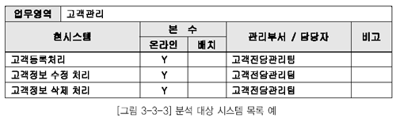

  * [그림 3-3-3] 분석 대상 시스템 목록 예">

### 나. 분석 대상 현행 시스템 관련 자료

현행 시스템과 관련된 문서를 조사 및 수집하고 이를 현행 시스템 수집 문서 목록에 정리한다. 현행 시스템 관련 수집 대상 문서는 다음과 같다.

  * 현행 시스템 구성도

  * 현행 시스템의 분석, 설계 및 개발 보고서

  * 화면, 장표 및 보고서 레이아웃

  * 현행 시스템 테이블 목록 및 테이블 정의서

  * 프로그램 목록

  * 사용자 및 운영자 지침서

  * 시스템 지원 및 유지보수 이력

  * 시스템 개선 요구 사항 등

현행 시스템 수집 문서 목록의 예는 [그림 3-3-4] 과 같다.

  * [그림 3-3-4] 현행 시스템 수집 문서 목록 예">

수집된 문서의 평가는 다음의 기준으로 수행하고 보완 여부 항목에 표기함으로써 보완 작업을 종료한다.

  * 유용성 : 문서의 활용 가능성 여부

  * 완전성 : 문서의 내용에 누락된 부분이 없는지의 여부

  * 정확성 : 문서의 내용이 현재의 시스템과 일치하는지의 여부

  * 유효성 : 문서가 최신의 내용을 반영하고 있는지의 여부

### 다. 추가적인 분석 대상

현행 데이터 측면의 업무 요건 혹은 업무 규칙을 보다 상세하게 분석하기 위하여 사용자 뷰도 분석 대상에 포함한다. 데이터 뷰는 전체적인 정보 중에서 일부를 바라보는 관점을 나타내며, 이러한 사용 자 뷰가 종합되어 나타나는 것이 화면, 수작업 파일, 수작업/전산 양식, 보고서 등의 레이아웃이다.

# 제2절 정보 요구 사항 상세화
                            
정보 요구 사항 분석 대상이 정의된 현행 업무 영역 관련 자료 및 현행 시스템 관련 자료에 대하여 분 석을 하고, 분석 결과인 분석 산출물을 토대로 사용자의 정보 요구 사항을 보완하고 비기능적 정보 요 구 사항을 포함하여 문서 작업을 통한 정보 요구 사항 정의서를 보완한다.

  * 비기능적 정보 요구 사항

  * 시스템이 만족시켜야 하는 제약 조건(기술적 제약 조건, H/W, S/W와 관련된 제약 조건)

  * 시스템이 반드시 만족시켜야 하는 주요 성능 척도(반응 시간, 저장 능력, 동시 처리 능력)

  * 신뢰성, 확장성, 이식성, 보안

## 1. 프로세스 관점의 정보 요구 사항 상세화

프로세스는 실제로 업무가 수행되는 행위를 뜻한다. 프로세스는 기본 기능이 분해되면서 나타나 다시 프로세스로 분해된다. 업무 기능은 기업의 목표달성을 위하여 지속적으로 수행되기 때문에 시작 시점과 종료 시점이 명확히 구분되지 않는다. 하지만 프로세스는 시작 시점과 종료 시점이 명확하고 실행 횟수를 셀 수 있는 업무 활동을 의미한다. 프로세스는 업무를 어떻게 수행하는가 보다는 어떤 업무가 수행되는지를 나타낸다. 따라서 입력(Input)과 출력(Output)이 있으며 입력을 출력으로 바꾸는 변환과정을 포함한다. 프로세스를 분해하다 보면 더 이상 분해되지 않는 최소 단위의 업무를 찾게 되는 데 이를 기본 프로세스라 부른다.

### 가. 수행 절차

  * 프로세스 중심으로 정리된 프로세스 목록, 프로세스의 업무 흐름도 내용을 수반하는 업무 조사서를 바탕으로 프로세스 계층도, 프로세스 정의서를 작성한다.

  * 도출된 기본 프로세스를 기준으로 기본 프로세스에서 필요로 하는 정보 항목과 산출되는 정보 항목을 정리하고, 산출되는 정보 항목 중 기본 로직이 필요한 경우 기본 로직을 정리한다.

  * 표준화 과정을 통하여 해당 정보 항목에 대해서 통합성/분리성 여부를 검토한 후 최종적으로 사용자의 정보 요구 사항을 충족하는 정보 항목 목록을 정의한다.

### 나. 수행 작업 내용

[표 2-3-1] 프로세스 관점의 정보 요구 상세화

| 수 행 작 업 | 수 행 작 업 내 용 |
|----|
 | 프로세스 분해/상세화|- 단위 업무 기능별 하향식으로 프로세스를 분해 및 도출

  *  프로세스 계층도 및 프로세스 정의서를 작성 |

 | 정보 항목 도출 및 표준화|- 기본 프로세스별 정보 항목을 정리

  *  정보 항목에 대한 표준화 정리

  *  정보 항목 목록 정의 |

 | 정보 항목별 통합성,

분리성 여부 검토|- 프로세스별로 관리되는 정보 항목을 분류

  *  정보 항목별 동음이의, 이음동의 존재 여부 파악

  *  통합/분리 여부 검토 후 최종 정보 항목 목록 정의 |

### 다. 수행 작업 지침

#### 1) 프로세스 분해 / 상세화

* 가) 프로세스의 분해

  * 프로세스의 분해는 단위 업무 기능으로부터 출발하여 점진적으로 수행한다. 단위 업무 기능은 하위에 더 이상 업무 기능을 포함하지 않고, 프로세스만으로 구성된 업무 기능을 의미한다.

  * 단위 업무 기능별로 상세하게 프로세스를 분해하지 않고, 해당 업무 영역의 전체 단위 업무 기능 에 대하여 프로세스의 분해 수준을 맞추어 점진적으로 분해한다.

  * 업무 기능 계층도가 단위 업무 기능 수준까지 분해되지 않았을 경우에는 단위 업무 기능 수준까지 더 분해한 후 프로세스를 도출한다.

* 나) 프로세스 분해 깊이

  * 프로세스 분해시 업무적인 특성을 고려하여 분해의 수준은 3차 수준까지 분해한다.

  * 3차 수준까지 프로세스를 도출하는 과정에서 기본 프로세스 수준까지 도출되는 경우도 있으며 업무 활동 분해의 근본적인 목적은 최종적으로 기본 프로세스의 도출에 있다.

  * 그러나 초기 작업에서는 도출된 프로세스가 기본프로세스인지는 중점을 두지는 않으며 대상 범위의 모든 프로세스를 균형 있게 분해하는 데에 주의를 기울인다.

  * 도출할 프로세스의 대상은 일반적으로 데이터의 상태를 변화시키는(생성, 수정, 삭제) 것만을 프로세스로 정의한다. 하지만 업무적으로 중요한 의미를 가지는 조회용 프로세스 또는 수작업 프로세스는 필요에 따라 명명규칙을 달리하여 도출하는 것도 바람직하다.

다) 프로세스 명칭

프로세스의 명칭은 명명규칙을 준수하여 명명하되 업무 용어를 그대로 사용하고 이름만으로도 개략적인 수행 내용의 파악이 가능하도록 함축적이며 유일한 이름을 부여하는 것이 중요하다.

* 라) 프로세스 계층도

  * 프로세스 계층도를 작성하는 목적이 기본 프로세스의 도출에 있으며, 추후 업무적으로 기술한 프로세스 정의서를 바탕으로 작업을 수행하게 되므로 이에 대한 상세한 내용이 반영된다.

  * 프로세스 계층도는 높은 응집도(Cohesion) 및 낮은 결합도(Coupling)를 유지하도록 모듈성을 확보하는 것이 중요하다. 이러한 원칙에 따라 분석하면 분석의 복잡도와 모호성이 감소되고 분석의 집중력이 향상되어 프로젝트 관리 및 프로세스 유지보수가 용이하다. 일반적으로 상위 프로세스에 포함되는 하위 프로세스가 7개를 초과하면 상위 프로세스를 분리하는 것을 고려한다. 프로세스 계층도의 예는 [그림 3-3-5]과 같다.

  * 프로세스별 정의(설명)는 업무를 구체적으로 이해할 수 있는 수준으로 상세하게 작성한다. 프로 세스 정의서는 프로세스와 기본 프로세스를 함께 기술하는 양식으로서, 프로세스 정의서 양식의 데이터 사용 항목은 모든 프로세스에 대해 기술할 필요는 없다. 그러나 기본 프로세스의 경우에는 반드시 작성하도록 한다. 프로세스 정의서는 [그림 3-3-6]과 같다.

  * 이미 작성된 프로세스 계층도를 재검토해 해당 업무 영역에 포함되는 모든 업무 요건 및 업무 규칙이 반영되었는지를 확인하고, 프로세스 계층도를 조정한다.

  * 현 수준의 프로세스 계층도를 더욱 상세하게 분해하여 업무의 최소 단위인 기본 프로세스까지 도출한다.

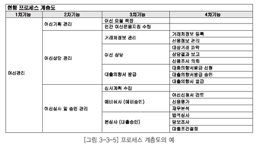

  * [그림 3-3-5] 프로세스 계층도의 예">

  * [그림 3-3-6] 프로세스 정의서의 예">

#### 2) 정보 항목 도출 및 표준화

  * 프로세스 분해 및 상세화에서 도출한 기본 프로세스별로 등록(C), 조회(R), 변경(U), 삭제(D) 기능을 구분하여 기술한다.

  * 기능에 따라 구분된 프로세스별로 정보 요구 분석에서 정의된 정보 요구 사항 정의서 및 업무 조사서 상의 내용을 파악하여 관리하고자 하는 정보 항목을 도출한다. 서술식으로 표현된 자료에서 정보 항목을 도출하기 위해서 ‘명사형’으로 표현된 단어를 파악하면, 이러한 단어들이 정보 항목의 대상이 되는 경우가 많다.

  * 도출한 정보 항목은 명명규칙을 준수하여 명명하되, 업무 용어를 그대로 사용하며, 명사형으로 기술한다.

  * [그림 3-3-7] 정보 항목 도출 예">

  * 해당 도출된 정보 항목에 대해서 그룹핑하여 정보 항목군으로 구분하고. 정보 항목 목록을 작성 한다. 정보 항목 정의는 [그림 3-3-8] 로 정리한다.

  * [그림 3-3-8] 정보 항목 목록 예">

#### 3) 정보 항목별 통합성 검증

  * 정보 유형별 및 정보 항목별로 전사 관점에서의 통합/분리여부를 검토한다.

  * 동일한 정보 항목에 대해서 통합시 다음과 같은 장점이 존재한다.

  *  통합 정보 항목으로 도출 시 정보 항목의 관리가 용이함

  *  동일한 유형의 정보 항목이 존재 시 통합 정보 유형으로 수용 가능

  * 단, 아래와 같은 단점도 존재한다.

  *  무리한 통합 작업으로 인한 정보 항목의 애매모호성 존재

  *  통합 정보 항목에 대한 관리 부족으로 통합의 의미 상실 가능성 존재

  * 통합 작업 후 해당 정보 항목 목록에 대한 통합성 여부를 기재하고 최종 정보 항목 목록을 작성 한다.

  * [그림 3-3-9] 정보 항목 목록 예">

## 2. 객체지향 관점의 정보 요구 사항 상세화

객체지향 방법론에서는 유즈케이스 다이어그램을 중심으로 정보시스템의 기능적 정보 요구 사항을 정의한다. 해당 다이어그램은 사용자와의 의사소통을 원활하게 진행될 수 있도록 도움을 주며, 시스템 영역내의 유즈케이스와 액터, 그리고 그들 간의 관계를 유즈케이스 다이어그램으로 도식화하고 도출된 유즈케이스의 사건 흐름을 상세화한다.

### 가. 유즈케이스 다이어그램

  * 액터(Actor)

  * 정보시스템과 상호작용하는 개인, 그룹, 회사, 조직, 장비 등 정보 서비스를 받는 객체를 말한다.

  * 엑터의 이름은 명확하게 액터의 역할을 나타내는 이름으로 정의한다.

  * 유즈케이스(Usecase)

  * 도출된 액터별로 개발 시스템에서 제공해야 하는 기능을 나타낸다.

  * 사건 흐름에 대한 개요을 간략하게 기술한다.

  * 액터(Actor)와 유즈케이스 간의 관계

  * 확장(Extend) : 하나의 유즈케이스가 다른 유즈케이스의 행동을 추가함에 따라 나타나는 두 유즈케이스의 관계를 말한다. 하나의 유즈케이스가 다른 유즈케이스를 경우에 따라 선택적으로 수행되는 경우에 사용된다.

  * 포함(Include) : 하나의 유즈케이스가 다른 유즈케이스를 사용함을 나타내는 두 유즈케이스의 관계를 말한다. 하나의 유즈케이스가 다른 유즈케이스를 반드시 수행하는 경우에 사용된다.

  * Communicates : 행위자가 어떤 유즈케이스에 참가함을 나타낸다. 이것은 행위자와 유즈케이스 사이의 유일한 관계이다.

유즈케이스 다이어그램의 예는 [그림 3-3-10]와 같다.

  * [그림 3-3-10] 유즈케이스 다이어그램">

### 나. 유즈케이스 상세화

유즈케이스의 사건 흐름을 구조화하는 작업으로 모든 선택 또는 대안 흐름을 기술한다. 유즈케이스의 특별 정보 요구 사항을 정의한다. 유즈케이스에는 관련이 있지만 사건 흐름에는 고려되지 않는 정보 요구 사항을 유즈케이스의 특별 요구 사항으로 정의한다. 이러한 특별한 정보 요구 사항은 비기능적인 정보 요구 사항으로 기술한다. 사건 흐름을 기술할 때 정상적인 흐름에 대해 먼저 기술한 후 예외사항에 대한 사건흐름을 기술한다. 다음과 같은 내용을 기술한다.

  * 유즈케이스에 대한 개략적인 설명

  * 사건 흐름(Flow or Event)

  * 사전, 사후 조건

  * 비기능적인 정보 요구 사항

  * 주된 사건 흐름에 대체될 수 있는 대안 흐름

  * 예외 처리 사항

### 다. 클래스 다이어그램 작성

#### 1) 엔터티 클래스 도출

유즈케이스 모형을 검토하여 문제 영역 내의 개념을 나타내 엔터티 클래스를 도출하여 정의한다. 식별된 클래스에 이름을 부여하고, 간략한 설명을 기술한다. 클래스 이름은 간결하고 업무적 의미를 함축한 단수형 명사로 부여하며, 은어 및 약어 사용은 배제한다.

  * 유즈케이스 다이어그램을 조사하여 명사 및 명사구를 후보 객체로 선정한다.

  * 의미가 모호한 것은 제거한다.

  * 이음동의어 및 동음이의어를 고려하여 선정한다.

  * 문제 영역과 관련이 없는 것은 제거한다.

  * 유사한 구조와 행위를 가진 객체들을 클래스로 그룹핑한다.

#### 2) 관계 도출 및 클래스 도출

관계란 의미있고 관심있는 연결을 나타내는 클래스간의 관계를 의미한다. 클래스간의 집단화 관계를 식별하고 명명한다. 집단화 관계란 전체적인 클래스와 부분적인 클래스의 포함 관계를 표현한다.

#### 3) 속성 정의

속성이란 클래스가 나타내는 객체의 특성을 의미한다. 유즈케이스 다이어그램을 검토하여 클래스를 구성하는 속성을 도출한다. 속성에 대한 이름을 부여하고 간략한 설명을 기술한다. 속성의 이음은 성을 가지고 있는 정보를 명확하게 지정하는 명사로 한다.

# 제3절 정보 요구 사항 확인
                            
사용자 및 부서로부터 접수해서 최종적으로 작성된 산출물에 대해 정보 요구 사항을 제시한 담당자와 세부 재검토를 통하여 누락 사항 및 보완 사항을 도출하기 위한 계획을 수립하고 재검토를 실시한다.

## 1. 수행 절차

  * 분석 결과 도출된 산출물에 대해서 재검토 기준을 정의하고, 재검토 계획을 수립한다.

  * 재검토 대상 산출물의 완전성, 정확성, 일관성, 안정성 등 다양한 측면에서 재검토를 실시한다.

  * 재검토 결과, 추가 및 보완 사항이 존재하는 경우에 내용을 문서로 정리한 후 해당 산출물에 추가 반영 여부를 확인하고, 미반영시 미반영 사유의 타당성을 검토한다.

## 2. 수행 작업 내용

[표 3-3-2] 정보 요구 사항 확인 수행 작업

| 수 행 작 업 | 수 행 작 업 내 용 |
|----|
 | 재검토 계획 수립|- 재검토의 대상이 되는 분석 결과 및 정보 요구 사항 정의서 산출물 확인

  *  대상 산출물별로 재검토 기준(체크 리스트) 정의 |

 | 재검토 실시|- 재검토 계획서 작성 및 승인

  *  재검토 대상 산출물 준비 및 배포와 재검토 담당자별 역할 분담

  *  업무 영역별로 재검토 대상 산출물을 재검토 |

 | 보완 결과 확인|- 재검토 결과를 토대로 업무 영역별로 산출물 보완

  *  재검토 결과 반영 여부 확인 및 미반영 사유 검토

  *  정보 요구 사항 정의서의 안정성 분석

  *  재검토 결과를 토대로 보완 목록 수정 |

## 3. 수행 작업 지침

### 가. 재검토 계획 수립

재검토의 대상이 되는 분석 결과 산출물을 확인한다. 일반적인 재검토의 대상이 되는 것은 정보 요구 사항 정의서, 정보 항목 목록, 유즈케이스 정의서 , 클래스 다이어그램 등이 있다. 재검토 기준은 해당 작업의 완전성과 정확성 및 안정성을 검증할 수 있는 체크리스트로 작성한다. 재검토 및 검증의기준을 간략히 요약하면 다음과 같다.

  * 완전성: 사용자의 정보 요구 사항이 누락없이 모두 정의되었는지 확인

  * 정확성: 사용자의 정보 요구 사항이 정확히 표현되었는지의 여부

  * 일관성: 표준화 준수 여부 확인

  * 안정성: 추가 정보 요구 사항 변경에 따른 영향도 파악

정보 요구 사항별로 1차 재검토 후 결과를 모델에 반영할 수 있도록 일정을 계획하여야 한다. 재검토를 통해 전체 업무영역에 영향을 미치는 공통사항에 대한 변경과 통합성을 일관되게 추적 관리할 수 있도록 별도의 인원을 재검토팀에 배정하여야 한다.

  * 재검토 계획서에 포함되어야 할 사항

  * 정보 요구 사항 재검토 개요 및 목적

  * 재검토 일자

  * 재검토 장소 및 시간 계획

  * 재검토 참석 대상 및 재검토 업무

  * 참석 대상별 재검토 세부 시간 계획

  * 재검토시 준비물

  * 재검토 후 산출물

  * 재검토 후 지적사항 반영 계획 수립

### 나. 재검토 실시

<li style="list-style-type:none;">

  * 재검토 기준 및 재검토 대상 산출물을 준비하고 재검토에 참여할 대상자에게 배포한다.

  * 재검토 관련 장소, 시간, 준비 장비 등 재검토를 실시하기 위한 제반 준비를 수행하며, 재검토 담당자별로 재검토 세션에서 수행해야 할 역할을 충분히 주지시킨다.

  * 재검토 세션 실시 이전에 반드시 배포된 산출물을 예습해야 한다. 재검토 세션 이전에 재검토 대상 산출물을 예습하는 것은 아주 중요한 일이다. 실제 재검토 세션에서의 재검토는 재검토한 결과를 토대로 의문사항, 잘못 정의된 사항 등에 대하여 의견을 개진하고 결론을 도출하여 반영 대상을기준에 따라 반드시 사전에 담당자별로 수행되어야 한다.

  * 재검토시 진행자는 제기되는 이슈에 대해서 참석자들간에 결론을 도출하기 위한 토론이 발생하지 않도록 이슈 목록으로 정리하게 하고 정해진 일정 내에 마칠 수 있도록 주의를 기울여야 한다.

  * 재검토시에는 통합성 검증을 위하여 해당 업무 영역과 관련 있는 업무 영역 담당자가 참여하여야 한다.

  * 재검토는 많은 인원이 함께 작업을 수행하는 경우에, 진행시간이 초과되어 충분한 검증이 이루어지지 못할 수도 있으므로, 진행자는 세션별로 적절한 시간 배분 및 조정의 역할을 충실히 수행하는 것이 중요하다.

  * 재검토 세션이 종료되면 세션별로 그 결과를 재검토 결과로 정리한다. 재검토 결과는 [표 3-3-11]과 같은 양식에 정리한다.

class="aligncenter" 

  * [그림 3-3-11] 재검토 결과서 예">

<li style="list-style-type:none;">

<li style="list-style-type:none;">

  * 재검토 결과가 정리되면 해당 정보 요구 사항별 보완 사항을 유형에 따라 보완 목록에 작성한다. 보완 목록을 작성시에는 재검토 결과의 지적 사항만을 기록하는 것이 아니라 내용 보완시 해당 분석 결과 산출물의 일관성 유지를 위해, 특정내용이 변경됨으로써 함께 변경되어야 할 대상도 함께 기록한다. 보완 목록은 [그림 3-3-12]과 같은 양식에 작성한다.

class="aligncenter" 

  * [그림 3-3-12] 보완 목록 예">

<li style="list-style-type:none;">

<li style="list-style-type:none;">

  * 보완 사항을 반영할 경우에는 정보 요구 사항간의 일관성이 유지되도록 주의한다. 모든 사항의 반영이 완예되면 반영해야 할 사항의 누락은 없는지, 잘못 반영된 사항은 없는지를 전체적으로 검토한다.

### 다. 보완 결과 확인

<li style="list-style-type:none;">

<li style="list-style-type:none;">

  * 재검토 준비와 마찬가지로 보완 결과에 대한 확인 준비를 한다. 재검토 결과, 보완 목록, 보완 사항이 반영된 정보 요구 사항 정의서를 준비하고 배포한다.

  * 보완 목록에 준하여 정보 요구 사항 정의서 반영 여부를 확인한다. 반영되지 않은 사항의 미반영 사유가 존재할 경우에는 미반영 사유가 타당성이 있는지를 검토하고 사유가 타당하지 못검토 결과 미반영 사유가 업무 규칙이나 정책의 변경을 수반하는 경우에 프로젝트 기간 내에 해결 가능한 것은 개선과제로 정리하여 해당 부서에 의뢰한다.

  * 보안 목록에 있는 보완 사항이 모델에 모두 반영된 것을 확인하면 본 작업은 종료된다.

## 4. 수행시 고려사항

<li style="list-style-type:none;">

  * 일관성 있는 기준 및 명확한 일정을 수립함으로써 모든 참여 인력에 공감대를 형성하는 것이 중요하며, 이를 바탕으로 작업을 수행해야 한다.

  * 재검토는 한번으로 종료되지 않는 것이 보통이므로 두번 이상을 진행하되 세션마다 재검토 기준을 명확히 하여 해당 기준에 초점을 맞추어 수행하는 것이 바람직하다.

  * 재검토 세션을 수행시 세션 진행의 효율성을 감안하여 적정한 참여 대상을 선정해야 한다. 너무 많은 인력이 참여하게 되어 세션의 집중력을 상실하거나 결론에 도달하지 못하는 경우에 주의해야 한다.

# 제4장 정보 요구 검증

# 제1절 정보 요구 상관분석 기법

                            
도출된 정보 요구 사항을 다른 영역(기능, 프로세스, 조직 등)과 비교 분석함으로써 정보 요구 사항의 도출이 완전하게 효과적으로 이루어졌는지를 파악할 수 있다. 이를 기반으로 향후 안정적이고 확장 가 능한 데이터 모델 설계가 가능하다. 이러한 상관분석은 매트릭스 분석 기법을 활용하며, 이 절에서는 정보 요구 사항과 애플리케이션의 기본 프로세스, 비즈니스의 업무 기능, 조직과의 매트릭스 분석 기법 을 소개한다.

정보 요구 사항의 충족도를 파악하기 위한 상관분석 수행의 주체는 다음과 같으며, 아래의 장·단점 을 고려하여 충분한 시간을 가지고 검토한다. 정보 요구 분석가나 품질보증 팀에 의해 상관분석을 진행 한 후, 단계 종료 시점에 외부 인력에 의한 요구 사항의 감리를 통하여 객관성 및 완전성을 증대시킨다.

## 1. 주체별 분류

### 가. 요구 사항 분석가 수행

정보 요구 사항을 수집하고 분석한 주 담당자를 기준으로 검토 기준 항목을 마련하고 상관분석을 수행하는 방법을 말한다.

  * 정보 요구 사항을 도출한 분석가에 의해 수행되므로 자체 분석에 의한 객관성 저하의 문제점이 발생할 수 있다.

  * 정보 요구 사항의 도출 절차 및 관련 업무팀과의 의사소통이 원활하므로 상관분석에 추가 인력의 투입 없이 원활하게 진행할 수 있다.

  * 요구 사항 분석가의 업무에 대한 이해도가 높으므로 상관분석을 통한 정확한 업무의 분석 가능성이 높다.

### 나. 품질보증팀 수행

프로젝트팀 내의 통합 검토팀이나 품질보증팀의 협조를 얻어 도출된 정보 요구 사항의 상관분석을 수행한다.

  * 요구 사항 분석가보다는 업무에 대한 이해도가 낮으나 상관분석 작업의 수행을 통한 업무 이해도를 높일 수 있으며 전체적인 인터페이스의 검증에 용이하다.

  * 낮은 업무의 이해도로 인해 일부 사안에 대한 정확한 분석을 통해 단점을 지적하여 수정하기 어렵다.

### 다. 외부 감리 수행

외부 감리 인력을 이용한 정보 요구 사항 상관분석을 수행한다.

  * 업무 파악의 한계가 있으나 제 3자의 시각으로 검토할 수 있다.

  * 프로젝트 내부 인력이 효과적으로 지원하지 않을 경우 상황에 맞지 않는 분석 결과를 초래할 수 있다.

  * 상관분석의 객관성을 극대화 할 수 있다.

## 2. 정보 요구/애플리케이션 상관분석

정보 요구 사항을 바탕으로 도출된 정보 항목을 애플리케이션 아키텍처에서 정의된 프로세스 모델과 비교하여 상호 간의 일관성을 확보하고 품질 수준을 향상시키는 동시에 누락 혹은 중복된 정보 요구 사항을 점검한다. 이는 다음과 같은 절차를 통해 매트릭스 분석을 진행한다.

  * 정보 요구/애플리케이션 상관분석을 위해 정보 요구 사항을 바탕으로 도출된 정보 항목들과 애플리케이션 영역에서 도출한 기본 프로세스를 사용하여 매트릭스를 작성한다.

  * 매트릭스 분석은 기본 프로세스와 정보 요구 사항을 기반으로 기본 프로세스의 액션 (C: 생성, R: 조회, U: 수정, D: 삭제)을 빠짐없이 정의한다. 그리고 기본 프로세스/정보 요구 사항 매트릭스를 작성하여 모든 정보 요구 사항들이 기본 프로세스에 의해 충분히 사용되고 있는지 또는 모든 기본 프로세스를 수행하는데 필요한 정보 요구 사항이 도출되어 있는지를 조사함으로써 정보 요구 사항과 기본 프로세스 도출의 완성도 및 일관성을 검증한다.

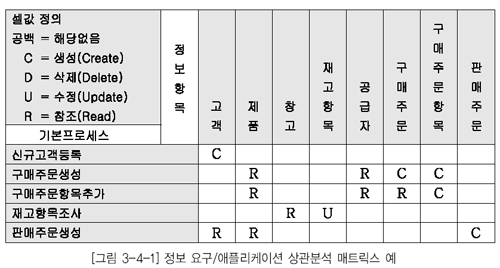

  * [그림 3-4-1] 정보 요구/ 애플리케이션 상관분석 매트릭스 예">

  * 매트릭스의 각 셀에는 기본 프로세스가 사용하는 정보 항목에 대한 액션이 생성(C), 조회(R), 수정(U), 삭제(D)로 표현되는데, 복수의 액션이 발생할 경우에는 C &gt; D &gt; U &gt; R의 우선순위에 따라 하나만을 기록한다. 그러나 분석기법의 활용시 CRUD가 복수로 발생할 경우 모두 기록할 수 있으며, 이는 분석기법을 활용하는 분석가의 매트릭스 활용 목적에 따라 선택 가능하다.

  * 모든 정보 항목이 모든 기본 프로세스에서 사용되었는지 혹은 모든 정보 항목을 사용하고 있는지를 확인한다.

  * 정보 요구/애플리케이션 상관분석 매트릭스는 두 가지 객체 중에서 한가지가 누락되거나 잘못 정의된 경우에는 분석이 가능하지만 정보 항목과 기본 프로세스가 모두 누락된 경우에는 분석이 불가능하다. 따라서 매트릭스가 작성되기 전에 이러한 경우가 있는지를 사전에 확인해야 하며, 매트릭스를 분석하는 경우에도 이러한 사례가 있는지를 파악해야 한다.

## 3. 정보 요구/업무 기능 상관분석

정보 요구 사항을 바탕으로 도출된 정보 항목을 비즈니스 아키텍처에서 도출된 업무 기능과 비교하여 상호 간의 일관성을 확보하고 품질수준을 향상시키는 동시에 누락 및 중복된 정보 요구 사항을 점검할 수 있다. 비즈니스에서 요구하는 정보 항목은 데이터 모델링의 근간이 되므로 업무 기능별 필요 정보 항목의 누락 여부의 확인은 매우 중요하다.

  * 가치 사슬 분석 등의 기법을 통해 도출된 최하위 수준의 전사 업무 기능을 도출하고 이렇게 도출된 업무 기능을 매트릭스의 열에 배치한다.

  * 정보 요구 사항에 따라 도출된 정보 항목을 매트릭스의 행에 배치한다.

  * 업무 기능과 정보 항목 간의 상호작용을 다음과 같이 정의한다.

  *  정보 항목의 생성, 수정, 삭제를‘C’로 표시한다.(Create 또는 Change)

  *  값의 변경 없이 정보 항목을 검색만 하는 경우에는‘U’로 표시한다.(Use)

  *  아무 관련이 없는 것은 빈칸으로 남겨둔다.

  * [그림 3-4-2] 정보 요구 대 업무 기능 매트릭스 예">

## 4. 정보 요구/조직 기능 상관분석

정보 요구 사항을 바탕으로 도출된 정보 항목을 비즈니스 아키텍처에서 도출된 조직 단위와의 매트릭스 분석을 통해 정보 항목의 생성 주체 및 활용 부서의 매핑이 가능하다. 이를 기반으로 향후 정보 항목에 대한 오너십(Ownership)을 할당하여 관리함으로써 데이터를 효율적으로 관리할 수 있다.

  * 조직 단위명은 기업의 조직도에 나타난 순서로 입력한다. 만일 기업이 둘 이상의 소재지에서 운영 된다면 조직 단위를 분할하고 소재지 타입에 따라 클러스터링한다. 매트릭스에 소재지 타입(예 : 본사, 영업소, 공장)에 의해 그룹핑된 조직 단위명을 입력한다.

  * 정보 요구 사항에 따라 도출된 정보 항목을 매트릭스의 행에 배치한다.

  * 조직과 정보 항목 간의 상호작용을 다음과 같이 정의한다.

  *  정보 항목의 생성, 수정, 삭제를‘C’로 표시한다. (Create 또는 Change)

  *  값의 변경 없이 정보 항목검색만 하는 경우에는‘U’로 표시한다.(Use)

  *  아무 관련이 없는 것은 빈칸으로 남겨둔다.

  * [그림 3-4-3] 정보 요구 대 조직 기능 상관분석 매트릭스 예">

# 제2절 추가 및 삭제 정보 요구 사항 도출

## 1. 정보 요구/애플리케이션 상관분석

### 가. 애플리케이션 충족도 분석 매트릭스

애플리케이션 충족도 분석 매트릭스는 다음 기준에 따라 점검하며 추가되거나 삭제되어야 할 정보 요구 사항을 도출한다.

  * 정보 요구 사항에 따라 발생하는 정보 항목을 생성하는 기본 프로세스가 반드시 존재해야 한다.

  * 정보 항목의 상태를 종료시키는 기본 프로세스가 존재해야 한다.

  * 생성된 정보 항목은 조회, 수정, 삭제 액션 중 하나가 발생해야 한다.

  * 하나의 정보 항목을 생성, 수정, 삭제하는 프로세스의 합은 7개를 초과하지 않는 것이 보통이다. 이를 초과하는 경우에는 올바르게 정의되었는지를 확인한다.

  * 수작업으로 정의하거나 조회 전용으로 특별히 정의된 기본 프로세스를 제외한 나머지의 기본 프로 세스는 반드시 생성, 수정, 삭제 액션 중의 하나를 수행해야 한다.

### 나. 매트릭스 분석

매트릭스 분석은 다음과 같은 점검 내용을 중심으로 보완한다.

  * 매트릭스 분석은 추가 및 삭제되어야 할 정보 요구 사항을 도출한다. 해당 점검 내용의 조치 사항이 애플리케이션과 관련된 것일 경우에는 해당 애플리케이션 팀에 전달하고 협의하여 정의된 정보 요구 사항과 애플리케이션은 프로세스와의 일관성을 가져야 한다.

[표 3-4-1] 매트릭스 점검 내용

| 번호 | 점검 내용 | 분석 결과 | 조치 사항 |
|----|
<tr>
<td rowspan="3">1</td>
<td class="lef" rowspan="3">기본 프로세스가 사용 (CRUD)하는 정보 항목이 없음|정보 항목의 누락|정보 항목 도출 |
|기본 프로세스 필요없음|기본 프로세스 삭제 |
|기본 프로세스가 분석 대상 업무 영역에 속하지 않음|해당 업무 영역으로 이동 |

 | 2|정보 항목이 7개 이상의 기본 프로세스에서 사용됨|정보 항목이 너무 큼|정보 항목의 세분화 필요 |

 | 3|정보 항목을 생성하는 기본 프로세스가 없음|기본 프로세스의 누락

정보 항목이 필요없음 정보 항목이 분석 대상 업무 영역에 속하지 않음|기본 프로세스의 도출

정보 항목 삭제

해당 업무 영역으로 이동 |

 | 4|정보 항목을 생성하는 기본

프로세스가 둘 이상 존재|기본 프로세스의 중복|기본 프로세스의 합성 |

<tr>
<td rowspan="3">5</td>
<td class="lef" rowspan="3">엔터티를 삭제하는 기본

프로세스가 없음|기본 프로세스의 누락|기본 프로세스의 도출 |
|업무에 삭제가 존재하지 않음|전산상의 오류인 경우에 삭제가 필요한지 확인 |
|기본 프로세스가 분석 대상

업무 영역에 속하지 않음|해당 업무 영역으로 이동 |

 | 6|정보 항목을 삭제하는 기본

프로세스가 둘 이상 존재|기본 프로세스의 중복|기본 프로세스 합성 |

 | 7|정보 항목이 생성만 되고 사용되는 곳이 없음|기본 프로세스의 누락|기본 프로세스의 도출 |

 | 8|기본 프로세스가 정보 항목을 조회만 함|기본 프로세스가 아님|모듈 검토 |

 | 9|기본 프로세스가 여러 액션을 수행함|정의된 기본 프로세스가 너무 큼|프로세스 추가 분해 |

## 2. 정보 요구/업무 기능 상관분석

■ 매트릭스 분석

매트릭스가 완료된 후 다음 질문을 통해 행과 열을 분석한다.

  * 모든 업무 기능은 정보 항목과 연관이 있는가?

  * 각 정보 항목은 적어도 한번 이상의‘C’(Create)를 갖는가?

  * 생성된 정보 항목은 다른 업무 기능에 의해 사용( ‘U’)되는가? 이것은 정말 단순조회인가?

■ 정보 항목과 연관성이 없는 업무 기능은 관련 팀과의 협의 하에 업무 기능 도출의 적절성이나 관련 정보 항목을 다시 파악해야 하며, 이를 바탕으로 매트릭스를 보완한다.

■ 정보 항목에 매핑이 없는 업무 기능의 경우 관련 팀과 협의하여 정보 요구 사항 보유 여부를 확인한 후 추가적인 정보 요구 사항이 있을 경우 정보 요구 조사 프로세스에 따라 정보 요구 목록에 신규로 추가한다.

## 3. 정보 요구/조직 기능 상관분석

■ 매트릭스 분석

  * 모든 업무 기능은 정보 항목과 연관이 있는가?

  * 각 정보 항목은 적어도 한번 이상의‘C’(Create)를 갖는가?

  * 생성된 정보 항목은 다른 업무 기능에 의해 사용( ‘U’)되는가? 이것은 정말 단순조회인가?

■ 정보 항목의 활용도를 파악할 수 있으며, 정보 항목의 수요가 많은 경우에는 해당 정보 항목의 물리 모델링 단계에 성능/활용 측면의 모델링 기법을 적용함으로써 정보 활용의 효율성을 기한다.

■ 정보 항목을 생성하는 조직 단위가 복수로 존재할 경우 데이터 관리의 복잡성으로 인해 향후 문제가 발생할 수 있으므로 해당 정보 항목에 대한 데이터 관리 주체의 선정에 주의를 기울인다.

# 제3절 정보 요구 사항 보완 및 확정

## 1. 정보 요구 보완

애플리케이션 기본 프로세스 대 정보 요구 사항, 업무 기능 대 정보 요구 사항, 조직 대 정보 요구 사항 매트릭스 분석을 통해 파악된 추가 및 삭제 정보 요구 사항에 대하여 담당자와 구체적인 미팅을 실시하고, 일정 계획시 설정된 반영 계획에 따라 정보 요구 목록을 보완한다.

## 2. 정보 요구 확정

보완된 정보 요구 사항에 대하여 재차 사용자 재검토를 실시하며, 추가 반영 사항에 대한 반영 여 부 의사결정을 실시한 후 최종 정보 요구 목록에 대한 확정을 실시한다. 정보 요구 목록을 통해 향후 데이터 모델과 관련된 모든 산출물을 추적할 수 있으므로 누락된 항목 없이 정확하게 작성한다.

# 과목3. 데이터 표준화

# 제1장 데이터 표준화 개요

# 제1절 데이터 표준화 필요성

## 1. 데이터 관리 현황 및 개선 방안

최근 데이터가 기업의 전략적 의사결정의 핵심 요소로 대두됨에 따라 데이터 통합 및 데이터 품질 에 대한 관심이 증대되고 있다. 데이터의 품질을 확보하기 위해 데이터의 표준화가 필수적으로 수반 되어야 한다. 그러나 데이터 활용에 있어 다음과 같은 현실적인 문제점들이 정확한 정보를 적시에 사 용자에게 전달하는 데 장애 요인이 되고 있다.

### 가. 데이터 활용상의 문제점

  * 데이터의 중복 및 조직, 업무, 시스템별 데이터 불일치 발생

데이터 표준 정책의 미비로 정보시스템 개발 및 운영 과정상에서 동일한 의미의 데이터를 다른 명칭으로 중복 관리하거나 동일한 명칭의 데이터를 시스템간에 상이한 로직으로 산출하여 다른 의미로 활용한다.

  * 데이터에 대한 의미 파악 지연으로 정보 제공의 적시성 결여

데이터 명칭, 데이터 정의에 대한 표준 미관리로 인해 새로운 정보 요건이나 정보 요건 변경시 필요 데이터를 파악하는데 많은 시간을 낭비하여 정보 사용자에게 적시에 정확한 정보를 제공하는데 어려움이 있다.

  * 데이터 통합의 어려움

단위 시스템 위주의 데이터 표준을 적용하거나 적용치 않는 경우도 존재하여 전사 데이터웨어하우스 구축 등 전사 데이터에 대한 통합적인 정보 요건을 기반으로 시스템을 구축할 때에는 데이터의 의미 파악 및 데이터의 중복 여부 파악 등에 많은 어려움이 있다.

  * 정보시스템 변경 및 유지보수 곤란

데이터 표준 정책 미비로 인해 정보시스템의 변경이나 유지보수시 데이터 의미 파악에 어려움을 겪고 있고, 새로운 정보 요건 반영시 기존 데이터의 활용이 가능한지 파악이 어려워 유지보수에 많은 노력이 따른다.

### 나. 데이터 문제점의 원인

이러한 문제점들은 과거 정보시스템 개발 및 운영 과정상에서 다음과 같은 요인들로 인하여 발생한다.

  * 동시 다발적인 정보시스템 개발

최근의 정보시스템 개발 프로젝트는 시스템간 상호 연관성이 증대되어 단위 시스템 위주의 개발 보다는 관련 정보시스템을 동시에 개발하는 경향이 뚜렷하다. 이러한 개발 환경 하에서 전사적인 데이터 표준 정책 없이 단위 시스템 위주로 표준 정책을 수립하여 단위 시스템의 업무 기능 구현에 초점을 맞추어 개발 프로젝트가 진행되었다.

  * 전사 데이터 관리 마인드 미형성

데이터에 관리 주체가 단위 시스템의 개발자, 운영자 중심으로 이루어져 있어 단위 업무 지원에 초점을 맞추고 있다. 최근의 정보화 요건들은 단위 시스템의 데이터뿐만 아니라 여러 시스템의 데이터를 복합적으로 활용하는 경우가 많으므로 전사 데이터를 체계적으로 관리하고자 하는 마인드 형성이 필요하다.

  * 전사 데이터 관리 인력 부재

정보시스템 개발 단계에서는 개발 수행사의 품질 관리 조직을 통해 표준에 대한 관리가 이루어진 다. 유지 보수 단계에서는 개발 단계에서 수립된 표준과 표준 준수 관리에 대한 역할을 맡은 전문 적인 데이터 관리 인력을 활용치 않고 개별 유지 보수 인력들에 의존한다.

  * 전사 데이터 표준 관리 도구 부재

데이터 표준 관리에는 데이터 표준, 데이터 표준 준수 체크, 데이터 표준 조회 및 활용 등 많은 자동화된 시스템의 지원을 필요로 한다. 정보시스템 개발시에는 수작업으로 데이터 표준의 적용, 준수 체크 등을 수행하였지만 운영 단계에서 수작업에 가까운 표준 관리 방법은 많은 애로사항이 존재한다.

### 다. 데이터 관리 개선방안

데이터가 기업의 전략적 의사결정을 위한 핵심 요소이기 때문에 데이터 통합, 데이터 품질을 달성하기 위해서는 전사적인 데이터 표준화 활동이 필요하다.

  * 데이터 표준화, 규격화를 위한 기본 방침 설정

  * 전사적인 정보 공유를 위해 유지되어야 할 공통 데이터 요소의 도출

  * 전사적인 데이터 요소 등록 및 관리 체계 구축

  * 정보시스템 개발 및 유지보수시 승인된 데이터 요소를 활용함으로써 시스템 개발의 효율성 및 데이터 공유성 향상

## 2. 데이터 표준화 기대효과

전사적인 데이터 표준화 활동들이 수행되면 현업 사용자는 정확한 데이터를 사용할 수 있고, 올바른 의사결정을 내릴 수 있다. 이는 기업의 경쟁력 확보에 많은 영향을 미친다.

  * 명칭의 통일로 인한 명확한 의사소통의 증대

동일한 데이터에 대해서는 동일한 명칭을 사용함으로써 개발자-현업, 운영자-현업, 운영자-운영자 등 다양한 계층간에 명확하고 신속한 의사소통이 가능하다.

  * 필요한 데이터의 소재 파악에 소요되는 시간 및 노력 감소

새로운 정보 요건 사항 발생시 표준화된 데이터를 사용함으로써 데이터의 의미, 데이터의 위치 등을 신속하게 파악할 수 있어 정보 활용자에게 원하는 시기에 정확한 정보를 전달한다.

  * 일관된 데이터 형식 및 규칙의 적용으로 인한 데이터 품질 향상

데이터 형식 및 규칙을 데이터 표준에 맞게 적용함으로써 데이터의 입력 오류 방지를 통해 데이터 의 품질을 향상시킬 수 있다. 또한 데이터의 활용에 있어 표준에 근거하여 활용함으로써 잘못된 데 이터의 활용으로 인한 의사결정의 오류를 줄인다.

  * 정보시스템 간 데이터 인터페이스 시 데이터 변환, 정제 비용 감소

데이터 통합 프로젝트나 개별 시스템에서 다른 시스템의 데이터가 필요한 경우 전사적으로 데이터 표준에 의해 데이터가 관리되고 있으면, 별도의 변환이나 정제 작업을 수행하지 않고 그대로 활용 하면 되기 때문에 별도의 비용적인 부분이 발생하지 않는다.

# 제2절 데이터 표준화 개념

## 1. 데이터 표준화 정의

데이터 표준화는 시스템별로 산재해 있는 데이터 정보 요소에 대한 명칭, 정의, 형식, 규칙에 대한 원칙을 수립하여 이를 전사적으로 적용하는 것을 의미한다. 이러한 데이터 표준화 작업은 데이터의 정확한 의미를 파악할 수 있게 할 뿐만 아니라 데이터에 대한 상반된 시각을 조정하는 역할을 수행한다.

  * [그림 3-1-1] 데이터 표준화 의미">

### 가. 데이터 명칭

데이터 명칭은 해당 기업 내에서 데이터를 유일하게 구별해주는 이름이다. 따라서 데이터 명칭에 대한 표준화는 동음이의어 및 이음동의어의 조정을 필요로 한다. 데이터 명칭은 일반적으로 다음의 원칙에 부합되어야 한다.

  * 유일성

데이터 명칭은 해당 개념을 유일하게 구분해 주는 이름이어야 한다. 하나의 개념에 대해 모든 사용자들이 통일된 용어를 사용할 수 있도록 오직 하나의 명칭만을 허용해야 한다.

예1) 고객 계좌번호, 고객 구좌번호 -&gt; ‘고객 계좌번호’로 통일

예2) EMAIL 주소, EMAIL -&gt; ‘EMAIL 주소’로 통일

  * 업무적 관점의 보편성

데이터 명칭은 업무적 관점에서 보편적으로 인지되는 이름이어야 한다. 일반적으로 기업 또는 조직 내의 구성원들이 해당 개념을 지칭할 때 가장 많이 사용하는 업무 용어를 그대로 사용하는 것이바람직하다.

  * 의미 전달의 충분성

데이터 명칭은 그 이름만으로 데이터의 의미 및 범위가 파악될 수 있어야 한다. 업무나 사용자의 관점에 따라 의미가 달라질 수 있는 이름은 수식어 등을 사용함으로써 구체화하는 것이 좋다.

### 나. 데이터 정의

데이터 정의는 해당 데이터가 의미하는 범위 및 자격 요건을 규정한다. 사용자가 데이터의 의미를 가장 잘 이해할 수 있도록 업무 관점에서 범위와 자격 요건을 명시해야 하고, 데이터 명칭만으로는 사용자에게 전달하기 어려운 기타 사항들을 전달하는 역할을 한다. 또한 데이터 정의는 데이터 소유자를 결정하는 기준이 된다. 데이터 정의를 기술할 경우 다음의 사항들을 고려한다.

  * 데이터 사용자가 데이터의 의미를 잘 이해할 수 있도록 관련 업무를 모르는 제 3자의 입장에서 기술한다.

  * 서술식 정의만으로 데이터의 의미 전달이 어려울 경우에 실제 발생할 수 있는 데이터의 값도 같이 기술한다.

  * 데이터 명칭을 그대로 서술하거나 약어 또는 전문 용어를 이용한 정의 기술은 가급적 사용하지 않는다.

### 다. 데이터 형식

데이터 형식은 데이터 표현 형태의 정의를 통해 데이터 입력 오류와 통제 위험을 최소화하는 역할을 한다. 데이터 형식은 업무 규칙 및 사용 목적과 일관되도록 정의한다.

  * 데이터 타입

  * Numeric

  * Text

  * Date

  * Char

  * Timestamp 등

<dl class="t_dot">

  * 데이터 길이 및 소수점 자리

  * 데이터 형식을 정의할 경우에는 다음의 사항들을 고려한다.

</dl>

  *  *도메인을 정의하여 데이터 표준에 적용함으로써 성격이 유사한 데이터 간의 데이터 형식을 통일화 한다.*

  *  *데이터의 최대값 또는 최대 길이가 고정되어 있지 않을 경우 충분히 여유있게 정의한다.*

  *  *특수 데이터 타입(CLOB, Long Raw 등)은 데이터 조회, 백업, 이행 등에 있어서 제약 사항이 존재하는 경우가 많기 때문에 가급적 사용하지 않는다.*

### 라. 데이터 규칙

데이터 규칙은 발생 가능한 데이터 값을 사전에 정의함으로써 데이터의 입력 오류와 통제 위험을 최소화하는 역할을 한다. 데이터 규칙을 통해 데이터의 정합성 및 완전성을 향상할 수 있다. 데이터 규칙의 유형은 다음과 같다.

  * 기본 값

사용자가 화면이나 프로그램으로부터 어떠한 값의 입력도 없는 경우 데이터 타입에 따라 미리 정의된 기본값이 입력될 수 있도록 한다. 즉 데이터 값의 입력을 생략했을 경우 자동으로 입력되는 데이터 값을 의미한다. 예를 들면, Numeric 타입의 항목에 대한 기본 값으로 ‘0’이 자동으로 입력되게 하거나 Char 타입의 항목에 대한 기본 값으로 ‘스페이스’가 자동으로 입력되게 한다.

  * 허용 값

업무 규칙과 일관성을 갖도록 입력이 가능한 데이터 값을 제한하는 것으로 표준 코드 중 데이터 항목별로 가질 수 있는 코드 값을 사전에 정의하는 경우가 이에 해당한다. 예를 들면 표준코드에 정의된 허용 값이 01,02,03,04...10과 같이 정의 되었으나 특정 데이터 항목에서 발생할 수 있는 허용 값은 01,03,05처럼 부분적인 값을 갖는 경우이다.

  * 허용 범위

업무 규칙과 일관성을 갖도록 입력이 가능한 데이터 값을 범위로 제한하는 경우이다. 예를 들면, 특정 데이터 항목에 허용 범위로 1~5까지를 정의한 경우 1~5 이외에는 입력이 불가능하도록 사전 에 제한할 수 있다.

## 2. 데이터 표준화 구성요소

전사적인 데이터 표준화를 추진하기 위해 수립해야 할 표준화 구성요소는 데이터 표준, 데이터 관리 조직, 데이터 표준화 절차이다.

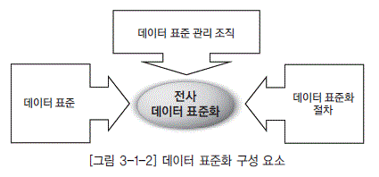

  * [그림 3-1-2] 데이터 표준화 구성 요소">

### 가. 데이터 표준

데이터 표준화는 기본적으로 데이터 모델 및 데이터베이스에서 정의할 수 있는 모든 오브젝트를 대상으로 하는 것이 수행하는 것이 이상적이나 주로 관리해야 될 필요성이 있는 오브젝트만을 대상으로 데이터 표준화를 하는 것이 효율적이다. 일반적으로 데이터 표준으로 관리되는 대상에는 용어, 단어, 도메인, 코드가 있다.

  * 표준 용어

업무적으로 사용하는 용어에 대한 표준을 정의함으로써 용어 사용 및 적용에 대한 혼란을 방지하고 원활한 커뮤니케이션을 촉진시킨다. 표준 용어는 업무적 용어와 기술적 용어가 있다.

<dl class="t_dot">

  * 업무적 용어

  * 흔히 일상 업무에서 사용하는 용어로서 보고서나 업무 매뉴얼상에서 많이 나타난다. 데이터 표준화 작업은 주로 데이터베이스에 적용하고 사용할 객체에 국한되기 때문에 업무적 용어의 표준화가 반드시 필요한 것은 아니다. 그러나 데이터베이스에서 적용할 용어들이 대부분 현업에 서 사용하는 용어를 그대로 수용한다는 점을 고려할 때 업무적 용어의 표준화는 데이터 표준화 작업을 수월하게 해주는 장점이 있다. 업무적 용어 표준화의 예는 색인(INDEX)을 들 수 있다.

</dl>

<dl class="t_dot">

  * 기술적 용어

  * 정보시스템에서 사용하는 용어를 지칭한다. 데이터 모델 또는 데이터베이스 스키마에서 나타나는 테이블명 및 칼럼명 등이 기술적 용어에 해당한다. 데이터 표준화 측면에서 용어를 표준화한다는 것은 업무적인 용어를 정보시스템에 반영하기 위해 기술적인 용어로 전환하고 이것을 일관되게 유지하고 관리한다는 것이다. 테이블 및 칼럼의 한글명은 대부분 업무적이터베이스의 제약 사항(테이블명의 중복 불허, 명칭에 대한 길이 제약)과 표준 단어의 사용에 따라 업무적 용어와는 상이하게 정의될 수도 있다.

</dl>

  * 표준 단어

표준 용어를 구성하는 단어에 대한 표준을 정의함으로써 용어에 대한 한글명과 영문명을 일관되게 정의할 수 있게 한다. 표준 단어의 목적은 2가지를 들 수 있다.

  * 표준 단어를 관리함으로써 동일한 개념을 의미하는 용어(또는 표준용어)의 생성을 예방한다. 예를 들어 ‘고객’과 ‘계좌’라는 표준단어를 정의함으로써 ‘고객 계좌’라는 용어만 표준으로 인정 하고 ‘고객 구좌’라는 용어는 표준에서 배제할 수 있다.

  * 표준용어의 영문명 작성 기준이 된다. 즉, 테이블 및 칼럼의 한글명만 작성하면 영문명은 표준 단어에 의해 자동으로 결정된다.

  * 표준 도메인

표준 도메인은 칼럼에 대한 성질을 그룹핑한 개념이다. 도메인은 크게는 문자형, 숫자형, 일자형, 시간형으로 분류할 수 있고, 더 세부적으로는 명, 주소, ID(이상 문자형), 금액, 율, 수량(이상 숫자형) 등으로 분류할 수 있다.

도메인에 대한 표준을 정의함으로써 동일한 성질을 가진 칼럼의 데이터 타입 및 데이터 길이를 일관되게 관리할 수 있으며, 향후 칼럼 값에 대해 공통적인 데이터 검증 규칙의 적용이 가능하다. 표준 도메인을 칼럼에 적용함으로써 칼럼의 데이터 타입 및 데이터 길이를 일관되게 정의할 수 있다.

  * 표준 코드

코드는 도메인의 한 유형으로서 특정 도메인 값(코드값)이 이미 정의되어 있는 도메인이다. 따라서 코드에 대한 표준은 다른 표준과는 달리 데이터 값, 즉 코드값까지 미리 정의해야 한다.

  * 기타 데이터 표준 관련 요소

용어, 단어, 도메인 및 코드 등 일반적으로 관리하는 데이터 표준 이외에도 필요에 따라서 데이터 모델에서 정의하는 주제영역, 관계명과 데이터베이스에서 정의하는 데이터베이스, 데이터베이스 스키마, TABLESPACE, INDEX, CONSTRAINT 등에 대한 표준을 관리한다.

### 나. 데이터 표준 관리 조직

전사적으로 수립된 데이터 표준 원칙, 데이터 표준, 데이터 표준 준수 여부 관리 등을 위해서는 데이터 관리자(DA, Data Administrator)의 역할이 요구된다. 데이터 관리자는 하나의 기업 또는 조직 내에서 데이터에 대한 정의, 체계화, 감독 및 보안 업무를 담당하는 관리자를 의미한다. 이러한 데이터 관리자는 기업 또는 조직 전반에 걸쳐 존재하는 데이터에 대한 관리를 총괄하고 정보 활용에 대한 중앙 집중적인 계획 수립 및 통제를 수행한다.

#### 1) 데이터 관리자 주요 역할

<dl class="t_dot">

  * 데이터에 대한 정책과 표준 정의

  * 데이터 관리자는 데이터에 대한 표준화 원칙 및 표준을 정의한다. 표준에 대한 변경과 추가가 발생시에 최종적으로 승인 의사결정을 수행하며, 기업 내에 산재된 시스템에 대한 데이터 표준 준수 여부를 주기적으로 체크하여 지속적인 표준 관리 활동을 수행한다.

</dl>

<dl class="t_dot">

  * 부서간 데이터 구조 조율

  * 데이터 관리자는 전사 데이터 관리 기준에 의거하여 단위 시스템이나 조직 부처에 명확한 데이터 관리 기준을 제시하고, 부서간에 데이터 구조에 대한 이견 발생시에 전사 데이터 관리 관점에서 데이터 구조를 제시하여 체계적인 데이터 구조 관리가 이루어지는 역할을 수행한다.

</dl>

<dl class="t_dot">

  * 데이터 보안 관리

  * 데이터 관리자는 데이터에 대한 보안 정책 수립, 보안 정책 준수 여부 체크, 보안 시정 조치 요구등을 수행한다.

</dl>

<dl class="t_dot">

  * 데이터 모델 관리

  * 데이터 관리자는 데이터에 대한 중요한 의사소통의 도구가 되는 데이터 모델을 물리적인 변경 시점에 동일하게 관리함으로써 향후 데이터 활용에 대한 업무 협의시 신속한 의사결정이 이루어지도록 관리한다.

</dl>

<dl class="t_dot">

  * 데이터의 효율적인 활용 방안 계획

  * 데이터 관리자는 데이터가 전사적으로 공유되어 효율적으로 활용되도록 지속적으로 데이터 활용상의 문제점 등을 체크하여 데이터 활용과 관련된 방안을 수립하여 시행한다.

</dl>

#### 2) 데이터 관리자 세부 역할

데이터 관리자는 다음과 같이 전사 데이터 관리자, 업무 데이터 관리자, 업무 시스템 데이터 관리 자로 나뉘어지고 각자의 역할은 [표 3-1-1]과 같다.

[표 3-1-1] 데이터 관리자 세부 역할

| 구분 | 주요 활동 |
|----|
 | 전사 데이터 관리자|- 데이터 표준화에 대한 정책 결정

  *  검토된 데이터 표준 제안에 대한 승인 |

 | 업무 데이터 관리자|- 담당 업무 기능의 데이터 요구 사항 반영을 위해 필요한 데이터 표준 정의

  *  업무 관련 데이터 표준 변경 제안에 대한 합동 검토 |

 | 업무 시스템

데이터 관리자|- 시스템 관리 목적의 데이터 요구 사항을 위해 필요한 데이터 표준 정의

  *  업무 관련 데이터 표준 변경 제안에 대한 합동 검토

  *  데이터 모델에 대한 데이터 표준 적용 및 준수 여부 체크 |

#### 3) 데이터베이스 관리자와 비교

데이터 관리자(DA, Data Administrator)와 데이터베이스 관리자(DBA, DataBase Administrator) 는 [표 3-1-2]와 같이 역할이 구분된다.

[표 3-1-2] 데이터 관리자/데이터베이스 관리자 역할 비교

| 구분 | 데이터 관리자(DA) | 데이터베이스 관리자(DBA) |
|----|
 | 관리 대상|데이터 요구 사항을 반영한 데이터 모델 및 각종 표준|데이터 모델을 특정 데이터베이스 제품의 특성에 맞추어 구축한 데이터베이스 |

 | 주업무|업무에 필요한 데이터의 메타 데이터를 정의하고 신규 또는 변경된 요구 사항을 신속하게 데이터 모델에 반영|요구되는 성능 수준을 발휘하면서 안정적 으로 운영되도록 데이터베이스를 관리 |

 | 품질 수준 확보|데이터 표준의 관리 및 적용을 통해 품질 수준을 확보|데이터의 정합성 관리를 통해 데이터 품질 수준을 확보 |

 | 전문 기술|담당 업무 분야에 대한 업무 지식과 데이 터 모델링에 대한 전문성이 필요|데이터 모델에 대한 해독 능력 및 특정 데 이터베이스 제품에 대한 전문 지식이 필요 |

### 다. 데이터 표준화 절차

일반적인 데이터 표준화 절차는 데이터 표준화 요구 사항 수집, 데이터 표준 정의, 데이터 표준 확 정, 데이터 표준 관리로 이루어지며, 데이터 표준화 절차별 주요 활동은 [표 3-1-3]과 같다.

[표 3-1-3] 데이터 표준화 절차별 활동

| 구분 | 주요 활동 |
|----|
 | 데이터 표준화

요구 사항수집|- 개별 시스템 데이터 표준 수집

  *  데이터 표준화 요구 사항 수집

  *  표준화 현황 진단 |

 | 데이터 표준 정의|- 표준화 원칙

  *  데이터 표준 정의 : 표준 용어, 표준 단어, 표준 도메인, 표준코드, 기타 표준 |

 | 데이터 표준 확정|- 데이터 표준 검토 및 확정

  *  데이터 표준 공표 |

 | 데이터 표준 관리|- 데이터 표준 이행

  *  데이터 표준 관리 절차 수립 : 데이터 표준 적용, 변경, 준수 검사 절차 |

# 제3절 데이터 표준 관리 도구
                            
데이터 표준 관리 도구는 수립된 전사 데이터 표준 정보의 관리, 데이터 표준에 의한 개발 및 유지보수 지원, 데이터 표준 준수 및 변경 영향도 평가를 담당하는 기능으로 구성된다. 최근에는 이러한 데이터 표준 관리 기능과 더불어 애플리케이션 정보, 데이터 흐름 정보, 각종 데이터에 대한 메타 정보에 대한 조회 기능을 갖는 시스템을 도입하여 활용하고 있다.

## 1. 확장된 데이터 표준 관리 도구의 기능

최근에는 이러한 데이터 표준 관리 기능 외에 애플리케이션 정보, 데이터 흐름 정보, 각종 데이터 에 대한 메타(Meta) 정보에 대한 조회 기능을 갖는 메타 데이터 시스템을 도입하여 활용하고 있다.

  * [그림 3-1-3] 데이터 표준 관리 시스템 구성">

[그림 3-1-3] 데이터 표준 관리 시스템 구성

| 기능명 | 설명 |
|----|
 | 데이터 모델 관리|데이터 표준 관리 도구를 이용하여 개념, 개괄, 논리, 물리 모델에 대한 조회 및 변경 관리를 하는 기능 |

 | 데이터 표준 관리|표준 단어, 표준 도메인 등의 표준 관련 사전을 관리하는 기능 |

 | 데이터 품질 관리|데이터 품질 진단 및 분석과 비즈니스 규칙 등을 관리하는 기능 |

 | OLAP 정보 관리|OLAP 시스템에 구현된 메타 정보와 연계하여 관리하는 기능 |

 | 사용자 권한 관리|현업 및 IT 사용자에 대한 권한 관리 기능 |

 | &lt;변경 영향도 분석/td&gt;|표준 및 모델 변경에 따른 전체 영향도를 분석하는 기능 |

 | ETL 정보 관리|계정계부터 최종 사용자까지 데이터 흐름 및 매핑 정보에 대한 관리 기능 |

 | 표준 요청 관리|표준의 신규 및 변경에 따른 절차와 승인 관리 기능 |

 | JOB 관리|ETL 프로그램의 정상 및 오류 여부 등을 관리하는 기능 |

 | DB 스키마 관리|데이터 모델과 실제 DB와의 일치성 등을 관리하는 기능 |

## 2. 데이터 표준 관리 시스템 기능

일반적인 데이터 표준 관리 시스템은 데이터 표준 관리, 데이터 구조 관리, 프로세스 관리의 기능으로 구성된다.

### 가. 데이터 표준 관리 기능

데이터 표준을 정의하고자 할 때 기존에 정의된 표준들을 조회하고, 이미 정의된 데이터 표준이 잘준수되도록 관리하는 기능으로 구성된다.

[표 3-1-4] 데이터 표준 관리 기능

| 기능 | 세부 설명 | 주요 내용 |
|----|
 | 단어 관리 | 전사 단어 사전 및

금칙어|- 전사 관점에서의 단어 사전 관리

  *  금칙어의 사전 정의 및 관리 |

 | 용어 관리 | 용어 사전|- 업무적으로 정의된 표준 용어에 대한 관리

  *  기본 단어의 조합으로 업무 용어를 생성함 |

 | 도메인 관리 | 도메인 사전|- 대표 및 그룹 속성에 대한 데이터 타입, 길이, 소수점 이하 길이 등을 사전에 정의한 도메인 관리 |

<tr>
<td rowspan="2">표준 코드

관리 | 전사 표준 코드|- 수집된 코드로부터 코드 통합 과정을 거쳐 전사 표준 코드를 도출한 후 관리 |

 | 코드 변환 매핑|- 소스 코드 값과 표준 코드와의 변환 매핑 관리 |

 | 멀티 표준

관리 | 멀티 표준|- 코드, 칼럼, 테이블, 도메인 등에 대하여 멀티 표준을 관리해서 전사에 존재하는 여러 표준을 지원하고 이후 전사 표준으로 통합 되도록 함 |

### 나. 데이터 구조 관리 기능

데이터 모델의 구조를 관리하거나 소스 시스템으로부터 DB 스키마를 리포지터리에 로드하기 위 해 필요한 기능 등으로 구성된다.

[표 3-1-5] 데이터 구조 관리 기능

| 기능 | 세부 설명 | 주요 내용 |
|----|
 | ER 모델 구조

관리 | 모델,

테이블의

구 조 정보|- ER 모델 관리

  *  리포지터리로부터 데이터 구조 정보를 추출 및 로드 |

 | DB 스키마

관리 | 다양한 DBMS

지원 및 DB 스키마 로드|- 다양한 DBMS로부터 DB 카탈로그를 추출 및 로드 |

 | 가변 속성

관리 | 모델의 사용자 속성을 자동 생성|- 모델 기본 속성 외에 설계 속성을 쉽게 추가 |

 | 이력 관리 | 이력 관리|- 데이터 모델 변경 이력

  *  형상 관리 지원 |

 | 모델 비교

관리 | 충실도 및

준수도 검사|- 데이터 구조 정보에서 표준화 자동 검사

  *  표준에 대한 준수도 자동 검사

  *  데이터 구조 정보 간 비교 |

### 다. 프로세스 관리 기능

데이터 표준에 대하여 신규 및 변경이 발생하거나 데이터 모델과 관련해 신규 테이블 등을 요청하고 승인하는 업무 프로세스 기능으로 구성된다.

[표 3-1-6] 프로세스 관리 기능

| 기능 | 세부 설명 | 주요 내용 |
|----|
 | 표준 등록 | 표준 요청 프로세스 지원|- 코드, 칼럼, 테이블, 도메인 등에 대한 사용자 요청부터 데이터관리자의 승인/반려 기능 지원 |

 | 모델 등록 | 모델 등록 요청

프로세스 지원|- 엔터티, 속성, 테이블, 칼럼 등 데이터 모델에 대한 사용자 요청을 등록하고 관리자의 승인/반려 기능을 지원 |

## 3. 데이터 표준 관리 시스템 도입시 고려사항

데이터 표준 관리 시스템 도입시 시스템의 확장성, 유연성, 편의성 관점에서 충분한 검토가 이루어져야 한다.

  * 확장성

  * 다양한 시스템 및 DBMS의 정보 수집과 OLAP 툴 등의 다양한 데이터 구조 정보를 추출 할 수 있는지 검토한다.

  * 유연성

  * 데이터 표준을 전사적으로 일시에 적용하기는 곤란하므로 단계적 적용을 위한 여러 개의 통합 표준을 사용할 수 있는 복수 표준 관리가 가능한지와 한글명 및 영문명의 표현 방식, 표준의 변경 용이성을 검토한다.

  * 편의성

  * 한글명의 영문명 자동 변환, 표준 검증의 주기적인 작업 수행 기능, 메타 정보 수집시 Import 수작업 최소화 등 사용자 편의성을 검토한다.

</dl>

# 제2장 데이터 표준 수립

# 제1절 데이터 표준화 원칙 정의

## 1. 데이터 표준화 요구 사항 수집

현업 및 개발자로부터 데이터 표준과 관련된 요구 사항을 인터뷰 및 설문조사 등을 통하여 조사함으로써 전사 데이터 표준 대상 후보를 식별하고 개선점을 도출하는데 사용할 자료를 마련한다. 조사시 현업 및 개발자들이 각자 맡고 있는 담당 영역의 틀에서 벗어나 반드시 전체적인 관점 및 제3자의 관점에서 기술할 수 있도록 유도한다.

  * 데이터 표준과 관련된 문제점을 조사할 때 유효한 방법 중 하나는 자신이 맡고 있는 영역과 다른 영역간의 인터페이스 부분에서 발생하는 불편 사항 및 개선 사항을 파악하는 것이다. 영역이라는 것은 주제 영역간 또는 정보 시스템간 일 수 있다.

  * 특정 영역에 대한 데이터 표준 요구 사항을 조사할 때 해당 영역을 오랫동안 관리하여 온 담당자보다는 해당 영역에 대해 익숙치 않은 관련자의 관점이 오히려 더 유용하다. 담당자는 자기가 담당하고 있는 영역에 대해 이미 익숙해져 있기 때문에 데이터 표준에 대한 필요성을 많이 느끼지 못할수 있다.

  * [그림 3-2-1] 표준화 요구 사항 정의서 예">

## 2. 현행 데이터 표준 원칙 분석

현행 정보시스템에서 적용하고 있는 데이터 표준 원칙 및 데이터 표준을 수집하고, 수집된 자료를 통하여 식별된 데이터 표준의 관리 대상 및 현황을 파악한다.

### 가. 현행 데이터 표준 원칙 수집

현행 정보시스템에 적용되고 있는 데이터 표준에 대한 원칙을 수집한다. 현행 데이터 표준 원칙은 다음의 방법들을 통하여 수집한다.

  * 현 정보시스템 개발 지침 문서 및 데이터 표준의 확보

현행 데이터 표준 원칙은 기존 정보시스템을 개발할 당시 작성하고 적용되었던 개발 지침 문서 및 데이터 표준을 통하여 수집한다. 데이터 표준 개발 지침 문서로는 각종 오브젝트(테이블, 칼럼 등)에 대한 명명규칙 등이 있다. 또한 실제 정의된 데이터 표준에 대한 검토를 통해서도 각 데이터 표준 대상별 관리 항목을 파악할 수도 있다.

  * 현행 정보시스템 모델의 분석

현행 데이터 모델 또는 데이터베이스 스키마에서 보여지는 오브젝트의 정의 패턴 분석을 통하여 정보시스템 구축시 적용했던 원칙을 유추해 낼 수 있다. 그러나 유추해 낼 수 있는 데이터 표준 대상 및 관리 항목이 상당히 제한적이다.

### 나. 데이터 표준 원칙 사용 현황 분석

수집된 데이터 표준 원칙 자료를 토대로 현행 정보시스템에서 적용하고 있는 데이터 표준 대상 및 관리 항목을 도출한다. 데이터 표준 대상별로 어떠한 정보시스템에 적용하고 있는지, 어떠한 관리 항목을 관리하는지, 어떻게 상이하게 관리되고 있는지에 대해 조사한다. 이를 통해 향후 전사 데이터 표준 대상에 대한 개선점을 도출하는데 사용할 자료를 마련한다.

  * [그림 3-2-2] 현행 데이터 표준 사용 현황 명세서 예">

## 3. 데이터 표준 개선 방안 정의

현행 데이터 표준 사용 현황 명세서와 표준화 요구 사항 정의서를 토대로 하여 데이터 표준 대상별 문제점 및 개선 방안을 도출한다. 문제점 및 개선 방안 도출시 반드시 전사적인 관점에서 접근하며, 전사적 관리의 필요성을 검토하여 관련 데이터 표준 대상 또는 대상별 관리 항목을 신규로 정의하거나 정의 대상에서 제외한다. 또한 최종적으로 데이터 표준 개선 방안은 기존에 수립된 데이터 관리 정책에 부합되어야 한다.

  * [그림 3-2-3] 데이터 표준 개선 방안 정의서 예">

## 4. 데이터 표준 원칙 수립

현행 데이터 표준에 대한 개선 방안을 토대로 향후에 적용할 전사 데이터 표준 기본 원칙을 정의하고, 향후 전사 데이터 표준의 생성 및 변경시 참고할 수 있도록 각 데이터 표준 대상별 데이터 표준 원칙을 작성하여 문서화한다.

### 가. 데이터 표준 기본 원칙 정의

데이터 표준 개선 방안을 참고하여 전체적으로 적용할 기본 원칙을 수립함으로써 표준화에 대한 방향을 사전에 정의할 수 있다. 표준화 원칙의 예로는 한글명에 특수 기호를 사용하지 않거나, 영문명 표기시 발음되는 대로 기술하는 것을 금지하거나, 이음동의어 사용을 금지하는 것을 정의하는 것이다.

  * [그림 3-2-4] 표준화 원칙 정의서 예">

### 나. 데이터 표준 지침 작성

모든 사용자들이 참고해야 하는 데이터 표준화에 대한 구체적인 지침 문서를 작성한다. 각 데이터 표준 대상에 대한 세부 지침 사항은 데이터 표준 기본 원칙에 부합되도록 작성한다.

#### 1) 데이터 표준 지침의 기본 구성

데이터 표준 지침은 데이터 표준 대상별로 어떻게 표준화할 것인가에 대해 구체적으로 정의한 문 서이다. 일반적으로 데이터 표준 지침에 포함될 내용들은 다음과 같다.

<dl class="t_dot">

  * 개요

  * 데이터 표준화 및 데이터 표준 지침에 대한 목적을 기술한다.

</dl>

<dl class="t_dot">

  * 데이터 표준화 관련자의 역할과 책임

  * 데이터 표준화와 관련된 사용자들을 정의하고 그들의 역할 및 책임을 규정한다. 일반적으로 정의 하는 관련자로는 전사 데이터 관리자, 데이터 관리자, 모델러 등이 있다

</dl>

<dl class="t_dot">

  * 데이터 표준 관리 절차

  * 데이터 표준과 관련된 일련의 작업 프로세스를 규정하고, 프로세스별로 데이터 표준화 관련자들의역할을 기술한다. 일반적으로 데이터 표준 관리 절차로는 데이터 표준 정의, 데이터 표준 변경, 데이터 표준 준수 프로세스가 있다.

</dl>

<dl class="t_dot">

  * 데이터 표준 기본 원칙

  * 데이터 표준 대상 모두에 대해 일반적으로 적용되어지는 기본 원칙을 기술한다.

</dl>

<dl class="t_dot">

  * 데이터 표준 대상별 명명규칙

  * 데이터 표준 대상별로 데이터 표준 명칭을 작성하는 방법에 대해 구체적으로 기술한다. 데이터 표 준 대상별로 차이는 있으나, 일반적으로 명명 규칙은 [표 3-2-1]의 내용들을 포함한다.

</dl>

[표 3-2-1] 데이터 표준 대상별 명명규칙

| 기술 내용 | 설명 |
|----|
 | 사용 문자|알파벳, 한글, 숫자, 특수문자, 전각/반각 등의 허용 여부 또는 사용 조건을 규정한다. |

 | 영문 대소문자|알파벳을 사용할 경우 대소문자 사용과 관련한 규칙을 규정한다. |

 | 한글명과 영문명 동시 정의 여부|DBMS에 반영되는 객체들은 대부분 알파벳으로 정의하도록 되어 있는 경 우가 있기 때문에 이와 관련된 데이터 표준 정의 대상에 대해서는 한글명과 영문명의 정의가 필요하다. 일반적으로 표준 단어, 표준 용어가 이에 해당 한다. |

 | 명칭의 구조|표준 용어를 사용하는 테이블명 및 칼럼명의 경우 명칭을 통하여 그 특성 또는 부가 정보를 표시할 수 있도록 명칭에 대한 단어 표준 조합 구조를 명시한다. 예) 수식어 + [수식어] + 속성 유형(금액, 건수, 코드 등) |

 | 명칭에 대한 허용 길이|표준 용어를 사용하는 테이블명 및 칼럼명의 경우 DBMS의 물리적 특성으 로 길이의 제약을 받기 때문에 표준 용어의 허용 길이를 명시해야 한다. |

 | 명칭 표준화에 대한 기준|유사한 개념의 단어/용어가 복수 개 존재할 경우 어떤 기준으로 표준 단어/ 표준 용어로 선택할 것인가를 결정하는 기준을 정의한다. 예) 일련번호, ID, SEQ --&gt; ID로 표준화한다. |

 | 명칭에 대한 예|명칭에 대한 허용 길이, 명칭 구조 체계, 명칭 표준화 기준 등을 준수하여 작성된 샘플을 몇 가지 명시한다. |

<dl class="t_dot">

  * 데이터 형식 정의에 대한 기준

  *

데이터 표현 형태를 정의하는 기준 및 방법을 기술한다. 일반적으로 표준 용어를 칼럼으로 사용하 는 경우나 표준 도메인, 표준 코드에 대하여 데이터 형식 정의에 대한 기준을 정의한다. 표준 용어 의 명칭에 대한 표준화 기준을 정의할 때 데이터 형식도 같이 정의함으로써 명칭의 결정과 동시에 데이터 형식도 자동적으로 결정된다.

  *  예1) 표준 용어의 경우: ID에 대한 데이터 형식은 8자리 텍스트로 한다.

  *  예2) 표준 도메인의 경우:‘ 번호’성 도메인에 대한 데이터 형식은 텍스트로 정의한다.

</dl>

<dl class="t_dot">

  * 기타

  * 데이터 표준 대상별로 고유한 특성에 대해 원칙을 구체적으로 기술한다.

  *  예) 표준 도메인의 경우 데이터 타입을 결정하는 기준

</dl>

#### 2) 주요 데이터 표준 대상별 지침의 일반적인 구성

데이터 표준 대상에 대한 세부 지침은 각 데이터 표준 대상의 특성에 맞게 기술한다. 다음은 관련 데이터 표준 대상별로 일반적으로 기술하는 지침의 내용이다.

<dl class="t_dot">

* 표준 단어
  * - 한글명 및 영문명에 대한 알파벳, 한글, 숫자, 특수문자, 전각/반각 등의 허용 여부 또는 사용조건
  * - 대소문자 사용 규칙
  * - 한글명, 영문명에 대한 허용 길이
  * - 합성어(단어의 조합으로 이루어진 단어) 정의에 대한 지침
  * - 접두사에 대한 처리 방안
  * - 동음이의어/이음동의어 허용 여부 및 처리 방안

</dl>

<dl class="t_dot">

* 표준 용어
  * - 데이터 명칭에 대한 구조 체계
  * - 한글명, 영문명에 대한 허용 길이
  * - 용어를 테이블이나 칼럼명으로 사용할 경우 준수해야 할 특이한 명명규칙
  * - 용어를 칼럼명으로 사용할 경우 데이터 형식 표준화에 대한 기준 및 표준 도메인 적용 여부

</dl>

<dl class="t_dot">

* 표준 도메인
  * - 데이터 형식 표준화에 대한 기준

</dl>

<dl class="t_dot">

* 표준 코드
  * - 데이터 명칭에 대한 구조 체계 및 명명에 대한 기준
  * - 데이터 형식 표준화에 대한 기준
  * - 코드번호 체계 정의에 대한 규칙

</dl>

#### 3) 데이터 표준 개발 지침 작성 시 유의사항

일반적으로 데이터 표준 지침은 현행 데이터 표준 지침을 그대로 유지하는 것이 가장 바람직하지만, 무엇보다도 단위 정보시스템의 영역을 벗어나 다른 정보시스템에서도 적용이 가능하도록 범용성을 고려하여 정의한다.

  * DBMS마다 허용하는 테이블 및 칼럼의 물리명 길이가 상이하다. 따라서 용어에 대한 영문명의 허용 길이에 대한 지침을 정의할 때 적용대상 DBMS에 모두 적용이 가능하도록 고려해야 하며, 어려울 경우 영문 축약명을 추가로 정의하거나 뷰(View)를 사용하는 등 다른 대안을 마련한다.

  * DBMS마다 정의하고 있는 데이터 타입이 각기 상이하기 때문에 특정 DBMS 기준으로 데이터 형식을 정의할 경우 다른 DBMS에서는 다른 데이터 타입으로 적용되는 경우가 발생한다. 따라서 표준 용어 또는 표준 도메인에 서로 다른 DBMS에 따라 어떻게 적용할 것인가에 대한 방안을 고려해야 한다.

  *  방안1) 데이터 형식을‘문자 1자리’, ‘숫자 15.2자리’등 논리적으로 기술하는 것으로 지침을 내리고, 이러한 논리적인 데이터 형식과 각 DBMS별 물리적인 데이터 타입 간의 변환 Map을 정의한다.

  *  방안2) 데이터 형식의 정의시 특정 DBMS 기준의 데이터 타입을 이용하여 정의하고, 기준이 되는 DBMS의 데이터 타입과 기타 DBMS의 데이터 타입 간의 변환 Map을 정의하여 다른 DBMS에 적용할 때 데이터 타입 결정에 대한 기준을 제공한다.

# 제2절 데이터 표준 정의

## 1. 표준 단어(Word) 사전 정의

표준 단어 사전 정의는 기존 데이터 모델 및 용어집을 통해 해당 기관에서 사용되고 있는 모든 단 어를 추출한다. 추출된 단어는 단어 종류와 유형을 분류하고 업무 정의 및 용도를 고려하여 표준 단어를 정의한다. 표준 단어 사전을 정의할 경우 이음동의어, 동음이의어 처리에 주의해야 한다. 정의된 표준 단어는 정의된 표준화 원칙을 참고하여 영문명과 영문 약어명을 정의한다.

### 가. 표준 단어 사전

일반적으로 단어란 문법상 일정한 뜻과 구실을 가지는 말의 최소 단위를 의미하며, 정보 시스템에서 사용하는 표준 단어 사전이란 기업에서 업무상 사용하며 일정한 의미를 갖고 있는 최소 단위의 단어를 정의한 사전을 말한다.

표준 단어를 정의함으로써 업무상 편의나 관습에 따라 동일한 단어를 서로 다른 의미로 사용하는 경우, 혹은 하나의 단어에 다양한 의미를 부여하여 사용하는 등의 문제를 방지한다.

#### 1) 표준 단어 관리 기준

<dl class="t_dot">

  * 표준성

  * 정보시스템이나 일반적인 업무에서 사용되는 단어 가운데에서 추출해야 하며, 너무 업무적인 용어 의 사용을 최소화하여 정보시스템의 특성에 부합되도록 한다.

</dl>

<dl class="t_dot">

  * 일반성

  * 일상적으로 사용하고 있는 사전적 의미의 단어와 의미상 크게 다르지 않아 일반인도 해당 단어의 의미를 이해할 수 있어야 한다.

</dl>

<dl class="t_dot">

  * 대표성

  * 동의어를 가질 수 있으며 표준 단어로 선언된 단어는 비슷한 의미의 동의어들을 대표할 수 있어야 한다.

</dl>

#### 2) 표준 단어 작성 형식

표준 단어는 전사적으로 관리하고 있는 엔터티와 속성을 개별 단위로 하여 추출하며, 추출된 단어 는 동음이의어와 이음동의어를 정비한 후 논리명(한글명)을 기준으로 물리명(영문명, 영문약어명), 유사 용어까지 함께 정리하여 관리한다. 표준 단어 사전에는 개별 단어 외에도 동의어, 유의어, 반의 어 등과 같은 단어 간의 구조도 함께 정의해야 한다. 표준 단어 사전은 [그림 3-2-5]와 같은 형식으 로 작성한다.

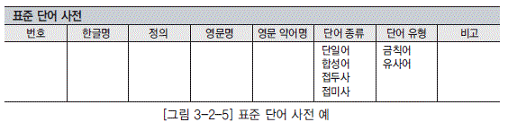

  * [그림 3-2-5] 표준 단어 사전 예">

### 나. 표준 단어 정의

표준 단어는 정보시스템별로 혼재되어 사용되고 있는 모든 용어를 단어 단위로 분할하여 도출한 다. 표준 단어는 [그림 3-2-6]과 같은 일련의 과정을 거쳐 정의한다.

  * [그림 3-2-6] 표준 단어의 도출">

#### 1) 현행 용어 수집

기업 내 존재하는 모든 정보시스템에 대한 데이터 모델 또는 테이블 정의서와 칼럼 정의서를 분석하여 현행 용어에 대한 한글명 및 영문명을 수집한다. 현행 용어를 통하여 단어를 분할하고 그에 해당하는 영문 약어명을 도출하려는 것이 목적이므로 일부 상용화된 애플리케이션 패키지처럼 한글명이 존재하지 않은 데이터 모델은 수집 대상에서 제외한다.

#### 2) 단어 분할

수집된 현행 용어에서 업무상 사용되며 일정한 의미를 갖고 있는 최소 단위의 단어로 분할한다. 단어 분할을 통하여 한글명과 그에 해당하는 영문 약어명이 도출되어야 하기 때문에 단어 분할시 한글명을 비롯하여 영문명도 같이 분할이 되는가를 고려해야 한다. 단어 분할시 단독으로 분할되는 숫자는 표준화 대상 단어에서 제외한다.

  * [그림 3-2-7] 단어 분할의 예">

#### 3) 단어 정렬

분할하여 취합된 모든 단어 중에서 의미가 동일한 단어들에 대해 하나의 대표 단어를 표준으로 선정하고 그에 대한 영문 약어명을 선택한다. 최종적으로 도출해낸 모든 단어들은 한글명과 영문 약어명 모두 유일해야 한다.

단어 정렬시 이용 가능한 기법

  * 한글명이 동일한 단어와 의미가 동일한 단어(이음동의어)들을 취합한 후 활용 빈도가 가장 많은 한글명을 표준 단어로 선택한다. 이음동의어는 영문 약어명이 동일한 단어들에 대한 검색으로 찾을 수 있다.

  * 한글명이 동일한 단어와 이음동의어를 모두 통틀어 가장 많이 나타나는 영문 약어명을 해당 표준 단어에 대한 영문 약어명으로 선택한다.

  * 동음이의어의 경우 상대적으로 활용 빈도가 낮은 의미의 단어에 대해서는 동일한 의미를 갖는 다른 한글명을 표준 단어로 선택한다.

  * [그림 3-2-8] 이음동의어 처리">

  * [그림 3-2-9] 동음이의어 처리">

#### 4) 표준 단어 사전 정의

단어 정련 작업을 통하여 표준으로 선택한 모든 단어들에 대한 한글명 및 영문명을 표준 단어 사전에 등록한다. 그리고 의미는 유사하나 각기 다른 표준으로 등록한 표준 단어들은 유사어로, 표준으로 선택되지 않은 나머지 이음동의어들에 대해서는 금칙어로 등록하여 관리하고 향후 적절한 표준 단어의 검색을 위해서 관련 표준 용어를 같이 기술한다.

### 다. 표준 단어 정의시 고려사항

  * 표준 단어의 단위는 최소 단위를 기준으로 하되 사용 빈도가 높은 단어의 조합 또는 단어의 조합이 하나의 고유한 의미를 가지는 경우 하나의 표준 단어로 정의하는 것이 유리할 수 있다.

예) 신용카드, 선하증권

  * 대부분의 DBMS는 테이블 물리명 및 칼럼 물리명의 첫 글자를 알파벳으로 시작하도록 제약하고 있다. 따라서 표준 단어의 영문명도 반드시 알파벳으로 시작하도록 정의하도록 한다.

예) 1순위 --&gt; RNK1, 2개월 --&gt; M2

  * 단어는 특히 동음이의어가 많기 때문에 사용빈도가 높은 것을 표준 단어로 사용빈도가 낮은 것은 다른 단어와 조합하여 표준 단어로 정의하도록 한다.

  * 접두어, 접미어와 같이 한 자리로 구성된 단어들은 가급적 표준에서 배제하는 대신 앞뒤에 나오는 단어와 조합하여 표준 단어로 정의하는 것이 바람직하다.

  * [그림 3-2-10] 접두어/접미어 개별 단어 방식">

  * [그림 3-2-11] 접두어/접미어 합성 단어 방식">

## 2. 표준 단어(Word) 사전 정의

표준 도메인 사전 정의는 업무적인 용도, 사용 빈도와 데이터의 물리적인 특성 등을 고려하여 도메 인을 분류하고 도메인별 데이터 타입을 부여한다. 도메인에는 코드성 도메인과 숫자 도메인, 날짜 도 메인, 문자 도메인 등이 있다.

### 가. 표준 도메인 사전

도메인이란 속성에 정의된 조건을 만족시키는 값의 범위를 의미한다. 표준 도메인은 전사적으로 사용되고 있는 데이터 가운데에 논리적, 물리적으로 유사한 유형의 데이터를 그룹화하여 해당 그룹에 속하는 데이터의 유형과 길이를 정의한 것을 말한다. 도메인은 여러 개의 하도메인이 여러 개의 도메인에 중복적으로 사용될 수 있다.

#### 1) 표준 도메인 관리 기준

<dl class="t_dot">

  * 표준성

  * 표준 도메인은 전사 차원에서 공통적으로 사용되는 속성을 대상으로 정의한다. 예를 들어 은행의 계좌번호는 은행 하위 업무나 상품에 따라 다르지 않으므로 표준 도메인을 정의하여 사용한다.

</dl>

<dl class="t_dot">

  * 유일성

  * 동일한 내용의 중복 도메인이 서로 다른 이름으로 선언되지 않도록 관리한다.

</dl>

<dl class="t_dot">

  * 업무 지향성

  * 도메인은 지나치게 일반화하여 정의하기보다는 업무의 특성을 충분히 반영할 수 있도록 선언하여 관리한다. 예를 들어 계좌번호의 도메인은 ‘-’가 없이 정의하는 것보다 적절한 의미를 나타내도록 ‘-’를 이용하여 표현할 수 있다.

</dl>

#### 2) 표준 도메인 작성 형식

전사적으로 관리하고 있는 모든 데이터 속성 혹은 대표 속성 가운데에 DBMS에 동일한 형태로 구현되는 속성들을 추출하여 그룹화한다. 모든 속성은 임의의 도메인에 할당되어야 하며, 하나 이상의 도메인에 복수로 할당되면 안 된다. 속성과 도메인은 상호 매핑하여 관리해야 하며 새로운 속성이 추가될 경우 해당 속성의 도메인을 선정, 등록할 것을 권장한다. 또한 도메인의 삭제는 해당 도메인을 사용하고 있는 속성이 없을 경우에만 가능하도록 해야 한다. 표준 도메인 사전은 [그림 3-2-12]와 같은 형식으로 작성할 수 있다.

  * [그림 3-2-12] 표준 도메인 사전 예">

### 나. 표준 도메인 정의

표준 도메인은 정보시스템별로 혼재되어 사용되고 있는 칼럼의 칼럼명, 데이터 타입, 길이 등을 정리 하여 표준 도메인을 정립한다. 표준 도메인은 [그림 3-2-13]과 같은 일련 과정을 거쳐서 정의하게 된다.

  * [그림 3-2-13] 표준 도메인의 도출">

#### 1) 현행 용어 정보 분석

기업 내 존재하는 모든 정보시스템에 대한 데이터 모델 또는 칼럼 정의서를 이용하여 현행 용어에 대한 용어명과 데이터 타입 정보를 수집한 뒤 물리적으로 유사한 유형의 용어들을 그룹화한다. 그룹화할 때에는 다음의 기법을 이용해 정리하도록 한다.

  * 동일한 정보시스템에 대한 데이터 모델에서 추출된 현행 용어들을 유일하게 추출한다. 유일한 용어를 추출할 때에는 한글명, 영문명, 데이터 타입 및 길이 모두 일치하는지를 확인한다.

  * 데이터 타입과 길이가 동일한 용어들을 검색하여 유사한 속성의 용어들을 그룹핑한다.

  * 용어명 중에서 끝 쪽 단어를 기준으로 유사한 속성의 용어들을 그룹핑한다.

#### 2) 표준 도메인 정의

그룹핑된 유사 속성 용어의 의미에 따라 표준 도메인명을 정의하고 그에 따른 데이터 타입 및 길이를 정의한다. 표준 도메인은 다음의 기준에 따라 정의한다.

  * 가급적이면 업무적으로 의미가 있는 도메인명을 부여한다.

예) ID, 증권번호, 일자, 일시, 주소, 여부, 환율(O), 문자1, 문자2, 숫자12(X)

  * 기존 데이터와의 호환성 및 범용성을 위하여 그룹핑된 용어들에게 부여된 데이터 타입 길이 중 가장 큰 데이터 타입 길이를 표준으로 정한다.

### 다. 표준 도메인 정의시 고려사항

  * 현실적으로 어느 도메인에도 속하지 않는 칼럼이 있을 수 있기 때문에 모든 용어를 포괄하는 표준 도메인을 생성할 필요는 없다.

  * 표준 도메인에 정의할 데이터 형식을 어떻게 정의하고 각기 다른 DBMS에 어떻게 물리적으로 적용할 것인가에 대한 방안을 고려해야 한다.

  * 표준 도메인을 도출하면서 동일한 용어로 판명된 현행 용어들을 별도로 기록하여 향후 동일한 데이터 표준 용어로 통일할 때 참고

## 3. 표준 코드(Code) 사전 정의

표준 코드 정의는 수집된 용어로부터 코드를 선별하여 현 코드의 코드값을 조사한다. 현 코드를 바탕으로 통합 요구 사항과 통합 필요성에 따라 통합 대상을 파악하고 표준 코드를 정의하고 현 코드와 매핑 설계를 한다. 정의된 표준 코드별로 오너십(Ownership)을 정의하여 향후 해당 코드에 대한 수정, 삭제에 대한 권한을 관리할 수 있도록 한다.

### 가. 표준 코드 사전

표준 코드에는 각 산업별로 법·제도적으로 부여하여 공통적으로 사용되는 코드뿐만 아니라 기업 내부에서 정의하여 사용하는 코드도 포함된다.

#### 1) 표준 코드 관리 기준

<dl class="t_dot">

  * 재사용성

  * 표준 코드는 기업에서 자체적으로 정의하여 사용하는 것보다 표준화 기구나 정부, 공공기관에서 정의한 코드를 재사용하는 것이 데이터에 대한 이해력을 높이고 코드 관리를 용이하게 하는데 더 효과적이다.

</dl>

<dl class="t_dot">

  * 일관성

  * 코드는 업무 범위 내에서 가능한 한 유일하게 정의되어야 한다. 동일한 내용의 코드를 사용 형태나 업무 범위에 따라 중복 정의하여 사용할 경우 전사 차원의 코드 데이터의 중복은 물론 코드 데이터의 불일치 문제를 발생시킨다.

</dl>

<dl class="t_dot">

  * 정보 분석성

  * 가능한 범위의 데이터는 모두 코드화하여 관리한다. 즉 사용자가 텍스트로 직접 입력하는 값을 최소화하고 정의된 범위 안에서 선택하도록 함으로써 정보 분석시에 데이터는 있으나 분석 가치가 없는 데이터가 생성되지 않도록 한다.

</dl>

#### 2) 표준 코드 작성 형식

전사적으로 사용하고 있는 코드를 추출하여 정의하고 부여된 코드와 동일한지를 확인하고, 동일한 값을 가지는 코드에 대해서 통합 작업을 수행하여 단일화 작업을 수행한다. 코드는 표준화 팀에서 엄 격한 기준에 따라 관리되어야 하며, 사용자 임의대로 코드 체계를 생성하거나 수정해서는 안된다. 또 한 코드는 도메인과 밀접하게 연관되어 관리해야 하나 도메인에 값의 범위가 명확히 정의되어 있는 경우(예를 들어‘여부’는‘Y/N’으로 표기)에는 특별히 코드화하여 관리하지 않아도 된다. 표준 코드 사

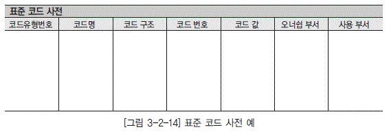

  * [그림 3-2-14] 표준 코드 사전 예">

### 나. 표준 코드 정의

표준 코드는 각 정보시스템별로 사용되고 모든 코드들을 수집하여 동일 코드를 파악하고 통합하여 표준 코드를 정의한다. 표준 코드는 다음과 같은 일련의 과정을 거쳐 정의한다.

#### 1) 현행 코드 수집

기업 내 존재하는 모든 정보시스템에서 사용하는 코드 정보를 수집한다. 일반적으로 각 정보시스 템에서는 단독 코드 테이블, 통합 코드 테이블, 애플리케이션 정의 등 3가지 코드 관리 형태가 있으 므로 코드 관리 형태별로 수집 방법을 달리해야 한다.

<dl class="t_dot">

  * 단독 코드 테이블

  * 하나의 코드를 하나의 테이블에서 관리하는 형태이다. 이런 형태로 관리하는 코드들은 대부분 코드 데이터가 필수적으로 가지고 있어야 할 코드 번호, 코드값 외에 부가 정보들을 관리할 경우가 많다. 따라서 이런 형태로 관리하는 데이터가 코드인지, 아니면 정보성 데이터(ID로 관리되는 정보)인지를 명확히 구분한 뒤 추출 여부를 판단해야 한다.

</dl>

<dl class="t_dot">

  * 통합 코드 테이블

  * 복수개의 코드를 하나의 통합 관리 테이블에서 관리하는 형태이다. 통합 관리 테이블에서 관리하는 기본적인 내용으로는 코드 자체를 식별하기 위한 코드 유형 번호, 코드명, 코드 구조, 코드 번호, 코드값 등이 있고 기타 코드 관리 차원에서 필요한 정보들(생성 일자, 폐지 일자, 오너십, ...)이 있다. 통합 코드 테이블에서 관리하는 코드는 모두 수집한다.

</dl>

<dl class="t_dot">

  * 애플리케이션 정의

  * 코드를 데이터베이스에 저장하여 관리하지 않고 애플리케이션에서 정의하여 관리하는 형태이다. 애플리케이션의 프로그램 소스를 확보하지 않고서는 코드 정보를 확보하기가 어렵기 때문에, 이러한 코드 정보의 확보는 사용자 인터페이스를 조회하거나 해당 코드 정보를 데이터로서 저장하는 코드성 칼럼의 데이터 값을 추출하는 간접적인 방법을 통해 수집할 수 있다.

  * 코드는 해당 코드를 관리하는 테이블에서 코드값을 누락하거나 애플리케이션에서 코드값을 정의하는 이유 때문에 단어, 도메인, 용어와는 달리 수집시 누락될 가능성이 많다. 코드 정보 수집의 누락을 최대한 방지하기 위해서 다음의 방법을 통하여 수집 대상 코드를 정확히 파악하도록 한다.

</dl>

<dl class="t_dot">

  * 코드 데이터 값 수집

  * 코드를 관리하는 테이블, 통합 코드 테이블, 애플리케이션 사용자 인터페이스를 통하여 코드 정보를 수집한다.

</dl>

<dl class="t_dot">

  * 코드성 칼럼 파악

  * 각 정보시스템의 테이블에 존재하는 칼럼 중에서 코드 정보를 저장하는 코드성 칼럼을 파악한다. 이 경우 해당 칼럼이 코드를 저장하는 칼럼인지 아니면 정보성 데이터에 대한 참조 데이터를 저장하는 칼럼인지 명확히 구분해야 한다.

</dl>

<dl class="t_dot">

  * 수집된 코드에 대한 사용처 파악

  * 식별한 코드성 칼럼별로 어떠한 코드를 저장하는지를 파악함으로써 누락된 코드를 확인한다. 코드의 누락은 코드성 칼럼에 저장된 코드 데이터 값과 수집된 코드 번호를 비교하고 검증함으로써 파악한다. 이 과정을 통하여 코드 테이블 및 애플리케이션 사용자 인터페이스를 통하여 확보하지 못했던 코드 정보를 추가로 수집한다.

</dl>

#### 2) 현행 코드 상세 분석

수집된 현행 코드 정보를 상세히 분석함으로써 동일하거나 통합이 가능한 코드를 식별한다. 통합 대상 코드의 식별은 다음의 방법을 고려하여 식별한다.

  * 코드값이 일치하는 동일한 코드 인스턴스를 가지는 코드를 찾은 뒤 해당 코드의 모든 코드 인스턴스를 확인하고 비교함으로써 통합 가능한 코드를 식별한다.

  * 분석해야 할 대상 코드가 너무 많을 경우에는 코드를 사용하는 업무 기능별로 코드를 분류한 후, 분류된 단위로 코드를 분석한다.

#### 3) 표준 코드 정의

현행 코드 상세 분석을 통하여 식별된 통합 대상 코드의 코드 인스턴스를 정련하여 통합한다.

  * 통합 대상이 없는 코드는 현행 코드 인스턴스를 그대로 유지하는 것이 일반적이다.

  * 통합 대상이 존재하고 통합 대상 코드의 코드 번호가 서로 상이할 경우 새로운 코드 번호를 부여함으로써 표준 코드를 정의한다.

### 다. 표준 코드 활용

향후 모든 정보시스템은 표준 코드를 사용해야 한다. 그러나 일부 업무에서 특정 코드의 모든 코드 값을 사용하지 않고 범위를 한정하여 일부 코드값만 사용 할 경우에는 표준 코드로부터 파생된 코드를 정의하여 사용한다. 이 경우 파생 코드에 정의된 코드 번호, 코드값은 반드시 표준 코드에 정의되어 있어야 하며, 파생 코드에 코드 인스턴스를 추가해야 할 경우 표준 코드에 먼저 정의 하도록 한다.

### 라. 표준 코드 정의시 고려사항

  * 코드값은 향후 확장성을 고려하여 정의하여야 하며, 여러 업무에서 사용할 수 있도록 통합된 코드로서의 일관성을 유지해야 한다.

  * 시스템 운영 중에 코드값이 변경되는 경우 해당 코드를 사용한 기존 데이터의 유지를 위해 기존 코드값을 삭제하는 대신 사용 중지 상태로 관리하고 새로운 코드값을 신규로 정의한다.

  * 표준 코드를 도출하면서 파악한 표준 코드-현행 코드 간의 변환 매핑 정보를 별도로 기록하여 향후 신규 정보시스템으로의 데이터 이행시 참고한다.

  * [그림 3-2-15] 표준 코드와 파생 코드의 정의 및 활용">

## 4. 표준 용어 사전 정의

표준 용어 사전 정의는 단어, 도메인, 코드 표준이 정의되면 이를 바탕으로 표준 용어를 구성하고, 단어의 조합, 도메인 분류, 데이터 타입 길이, 코드값 등을 기준으로 해서 표준 적용이 업무적으로나 IT적으로 무리가 없는지 검토한다. 또한 검토 과정에서 누락된 단어, 도메인, 코드 등이 없는지를 확인하고 추가 보완 작업을 수행 한다.

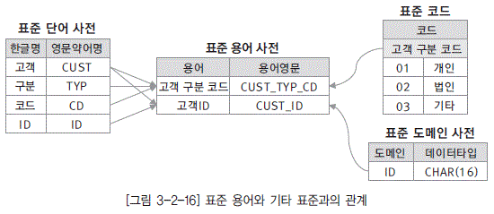

  * [그림 3-2-16] 표준 용어와 기타 표준과의 관계">

### 가. 표준 용어 사전

용어는 업무에서 자주 사용하는 단어의 조합을 의미하며, 표준 용어는 전사적으로 사용하는 엔터티와 속성을 대상으로 표준 단어 사전에 정의된 단어를 조합하여 정의한다. 단어는 개별적이나 용어는 업무와 조직의 성격에 따라 그 조합이 달라질 수 있다. 표준 용어를 정의함으로써 기업 내부에서 서로 상이한 업무 간에 의사소통이 필요한 경우, 용어에 대한 이해 부족으로 유발되는 문제점을 최소화 할 수 있다.

#### 1) 표준 용어 관리 기준

<dl class="t_dot">

  * 표준성

  * 같은 기업 내부라도 업무별로 동일한우가 매우 많 다. 따라서 표준 용어 사전은 용어의 표준화를 통해 용어 사용의 차이에 따라 발생되는 전사 차원 의 혼란을 최소화할 수 있어야 한다.

</dl>

<dl class="t_dot">

  * 일반성

  * 용어가 지나치게 업무 관점에서만 정의되어 일반적으로 이해하기 힘들거나 의미상에 혼란을 초래해서는 안 된다. 일반적인 의미와 전혀 다르게 사용된 용어는 적절한 다른 용어로 대체하고, 새로운 용어 개발 또한 자제해야 한다.

</dl>

<dl class="t_dot">

  * 업무 지향성

  * 용어는 기업의 업무 범위 내에서 약어를 사용하거나 내부에서 별도로 정의하여 사용할 수 있다. 단 지나친 약어의 사용은 업무에 대한 이해도를 떨어뜨릴 수 있으므로 주의한다.

</dl>

#### 2) 표준 용어 작성 형식

표준 용어는 전사적으로 보유하고 있는 엔터티와 속성을 대상으로 추출된 표준 단어를 조합하여 생성되며 용어 사전은 엔터티 용어 사전과 속성 용어 사전으로 구분하여 정의 관리한다. 정의된 각각 의 용어는 논리명(한글명)과 물리명(영문명)을 가지며, 용어 범위 및 자격 형식 등이 설명되어야 한 다. 표준 용어 사전은 [그림 3-2-17]과 같은 형식으로 작성할 수 있다.

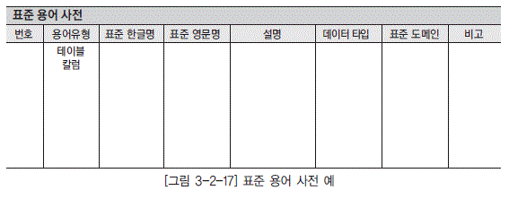

  * [그림 3-2-17] 표준 용어 사전 예">

### 나. 표준 용어 정의

표준 용어는 정보시스템별로 사용되고 있는 모든 현행 용어를 수집하고 표준 단어 사전, 표준 도메인 사전, 표준 코드 사전 등을 참조하여 현행 용어에 대한 표준 용어를 도출한다. 표준 용어는 [그림 3-2-18]과 같은 일련의 과정을 거쳐 정의한다.

  * [그림 4-2-17] 표준 용어 도출">

#### 1) 현행 용어에 대한 표준 단어 도출 및 표준 용어 정의

현행 용어로부터 표준 용어의 도출은 단어 수준에서의 표준화를 통해 이루어진다. 우선 현행 용어를 분할하여 구성 단어를 도출한 뒤 해당 단어와 관련된 유사 단어를 검색한다. 검색한 유사 단어 중에서 표준 단어를 찾아낸 뒤 각각의 현행 구성 단어에 대한 표준 단어를 조합하면 표준 용어가 도출 된다. 표준 용어에 대한 영문명은 표준 단어의 조합을 통하여 자동으로 부여된다.

#### 2) 표준 단어에 대한 도메인/코드 정의

표준 도메인을 도출하면서 별도 관리했던 정보를 가지고 표준 단어에 대한 도메인을 정의할 수 있 다. 현행 용어가 어떠한 표준 도메인 도출에 관련되었는지를 찾은 다음 해당 표준 도메인을 위의 과 정에서 도출된 표준 용어에 적용한다. 표준 단어가 사용하는 표준 코드도 이와 유사한 방법을 이용하 여 정의한다.

### 다. 표준 용어 정의시 고려사항

  * 표준 용어 도출시 데이터 표준 원칙에서 정의한 한글명 및 영문명의 허용 길이를 넘지 않도록 한다.

  * 만약 영문명의 허용 길이가 문제가 된다면 한글명을 변경하거나 한글명을 구성하는 표준 단어들 중 일부를 조합하여 하나의 표준 단어를 등록하여 영문명의 길이를 축약한다.

  * 생성된 표준 용어가 너무 길다면 두개의 표준 용어를 복합하여 생성하는 방법도 고려한다.

# 제3절 데이터 표준 확정

## 1. 데이터 표준 검토

데이터 표준 검토는 데이터 관리자가 정의한 표준 단어 사전, 표준 도메인 사전, 표준 코드, 표준 용어 사전 등을 확인하고 해당 용어가 현재 사용되고 있는 용어로 정확하게 정의되어 있는지를 확인하고 승인 처리한다.

### 가. 데이터 표준 검토 계획 수립

데이터 표준 검토 대상이 되는 자료를 확인한다. 데이터 표준 검토 대상은 표준 단어 사전, 표준 도 메인 사전, 표준 코드 사전, 표준 용어 사전 등이 있다. 검토 기준은 전사 데이터 표준 기본 원칙 및 각 대상 별 데이터 표준 지침을 근거로 작성한다. 데이터 표준에 대한 주요 검증 기준은 다음과 같다.

  * 유일성

각 데이터 표준이 물리적으로나 의미론적으로나 유일한지 확인한다.

예) 표준 단어 사전 내에서의 동음이의어 존재 여부, 용어 사전 내에서의 이음동의어 존재 여부

  * 완전성

각 데이터 표준 대상별 필수 입력 사항들이 전부 정의되었는지 확인한다.

예) 표준 단어의 한글명과 영문 약어명

  * 정확성

각 데이터 표준 대상별 입력 사항이 충실히 입력되었는지 확인한다.

예) 표준 용어의 정의

  * 범용성

정의한 데이터 표준이 여러 정보시스템에서 적용이 가능한지 확인하고, 향후 개발할 각 정보시스템에 적용할 수 있도록 검토 계획을 수립해야 한다.

예) 표준 도메인의 데이터 타입에 대한 타당성

### 나. 데이터 표준 검토

  * 검토 기준 및 검토 대상 산출물을 준비하고 검토에 참여할 대상자에게 배포한다.

  * 검토 관련 장소, 시간, 준비 장비 등 검토를 실시하기 위한 제반 준비를 수행하며, 검토 담당자별로 검토 세션에서 수행해야 할 역할을 충분히 주지시킨다.

  * 검토시 진행자는 제기되는 이슈에 대해서 참석자들간에 결론을 도출하기 위한 토론이 발생하지 않도록 이슈 목록으로 정리하고 검토가 정해진 일정 내에 마칠 수 있도록 주의를 기울여야 한다.

  * 검토 세션이 종료되면 세션별로 그 결과를 정리한다. 검토 결과는 [그림 3-2-19]와 같은 양식에 정리한다

  * 검토 결과가 정리되면 데이터 표준 대상별로 보완 사항을 작성한다. 보완 목록을 작성할 때는 검토 결과의 지적 사항만을 기록하는 것이 아니라 특정 내용이 변경됨으로써 함께 변경되어야 할 대상 도 함께 기록한다. 특히 표준 단어, 표준 도메인, 표준 코드에 대한 변경은 표준 용어에 영향을 미 치게 된다. 보완 목록은 [그림 3-2-20]과 같은 양식에 작성한다.

  * [그림 3-2-19] 검토 결과서 예">

  * [그림 3-2-20] 보완 목록 예">

### 다. 데이터 표준 보완 및 승인

  * 보완 결과에 대해 확인 준비를 한다. 검토 결과, 보완 목록, 보완 사항이 반영된 데이터 표준을 준비하고 배포한다.

  * 보완 목록에 준하여 데이터 표준 반영 여부를 확인한다. 반영되지 않은 사항 중 미반영 사유가 존재할 경우에는 미반영 사유가 타당성이 있는지를 검토하고 사유가 타당하지 못한 경우에는 보완 되도록 조치한다.

  * 보안 목록에 있는 보완 사항이 모델에 모두 반영된 것을 확인하면 본 작업을 종료하고 전사 데이터 관리자의 승인을 득한다.

## 2. 데이터 표준 공표

데이터 표준 공표는 확정된 데이터 표준을 배포하여 전사 시스템에 적용 가능하도록 하며, 관련 내 역에 대한 이해 및 적용을 위한 교육 작업을 수행한다.

### 가. 데이터 표준 배포

검토가 종료되고 전사 데이터 관리자의 승인을 득한 데이터 표준은 데이터 표준 관리 도구에 등록 하여 전사의 모든 사용자가 데이터 표준을 조회할 수 있도록 조치하고, 정보시스템 개발 관련자들이 데이터 표준을 준수하여 개발할 것을 공지한다.

### 나. 데이터 표준 교육

데이터 표준에 대한 이해 및 효과적인 적용을 위해 사용자 및 운영자에 대한 교육 훈련 계획을 수립하고, 데이터 표준 지침 및 기타 데이터 표준 관련 교육 교재를 작성하고 교육을 수행한다.

# 제3장 데이터 표준 관리

# 제1절 데이터 표준 관리

## 1. 데이터 표준 관리 개요

개별적인 데이터 표준화 요소에 대한 표준화 작업 절차 이후, 데이터 표준 정의 단계에서 수립된 데이터 표준에 근거하여 관리 프로세스를 정립하여 데이터 표준이 관리되도록 한다. 세부적인 개념과 절차는 별도의 과목에서 다루며 본 절에서는 전체적인 개념과 절차를 다룬다.

## 2. 데이터 표준 관리 프로세스 유형

데이터 표준을 관리하기 위해 필요한 프로세스는 많이 있지만 기본적으로 꼭 필요한 프로세스를 몇가지 들 수 있다.

  * 정의된 데이터 표준이 개발 과정이나 운영 과정에서 발생하는 데이터 표준의 신규 요건이 발생한 경우에 이를 처리하기 위한 프로세스

  * 데이터 표준이 변경 또는 삭제되는 경우, 관련 데이터 표준화 요소와 데이터 모델, 데이터베이스, 관련 프로그램까지 영향도를 분석할 수 있는 절차와 이를 처리하기 위한 프로세스

  * 데이터 표준을 잘 준수하고 있는지를 수시로 체크하고 확인할 수 있는 프로세스 등으로 나눌 수 있다.

# 제2절 데이터 표준 관리 프로세스

## 1. 데이터 표준 관리 프로세스 구성요소

전사적 차원에서의 일관된 데이터 형식 및 규칙의 적용으로 데이터 품질을 향상시키고, 데이터 표준에 대한 관리 프로세스를 제대로 정의함으로써 데이터 표준을 지속적으로 유지할 수 있다. 이를 위한 구성요소는 프로세스, 태스크, 역할과 담당 업무가 명확하게 정의되어야 한다.

## 2. 구성요소별 설명

### 가. 프로세스

데이터 표준이 신규로 발생하거나 변경 사항이 발생하는 경우에 거쳐야 할 전체적인 업무 프로세 스를 정의함으로써 정의된 데이터 표준이 잘 준수되게 하고, 항시 데이터 표준이 잘 지켜졌는지 확인 하여 조치할 수 있도록 한다. [그림 3-3-1]과 같은 형식으로 정의한다.

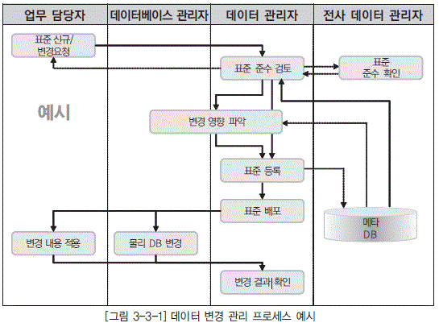

  * [그림 3-3-1] 데이터 변경 관리 프로세스 예시">

### 나. 태스크

  * 표준 신규/변경 요청

업무 담당자는 데이터 관리자에게 표준 단어, 표준 용어, 표준 도메인 등 데이터 표준 대상을 신규 또는 변경 요청한다. 표준 용어를 신규 또는 변경시에 표준 용어를 구성하는 표준 단어 또는 표준 도메인이 존재하지 않은 경우에는 해당 표준 단어 또는 표준 도메인을 선행 신규 요청을 해야 한다.

  * 표준 준수 검토

요청된 사항에 대해서 데이터 관리는 요청된 사항에 대한 표준 준수 여부를 검토하고 검토 결과를 업무 담당자에게 피드백하며 준수 여부 체크시 요청한 용어가 해당 용어 설명에 부합하는지, 요청한 용어가 기존 용어의 의미와 중복되는지 여부를 체크한다

### 다. 역할과 담당 업무

데이터 표준 관리 프로세스를 효율적으로 수행하기 위해서는 [표 3-3-1]과 같은 역할과 담당 업무 가 정의되어야 한다.

[표 3-3-1] 역할별 담당 업무

| 역할 | 담당 업무 |
|----|
 | 업무 담당자|- 표준 신규 및 변경 요청

  *  데이터 관리자로부터 지시받은 변경 내용 적용 |

 | 데이터베이스 관리자|- 데이터 관리자로부터 변경 표준 사항에 대한 변경 영향 파악 협조 및 평가서 작성

  *  데이터 관리자로부터 지시받은 변경 내용 적용

  *  테스트 및 검증 - 사용자 반영 결과 통보 |

 | 데이터 관리자|- 업무 담당자로부터 요청받은 신규 및 변경 사항 검토 및 표준 준수 여부 체크

  *  변경 영향도 분석 및 보고 후 변경 계획 수립

  *  준수 여부 체크 후 메타 DB에 표준 등록

  *  메타 DB에 등록 완료 후 신규 및 변경 표준 배포

  *  업무 담당자 및 데이터베이스 관리자에게 변경 작업 지시 후 변경 작업 수행 결과 확인 |

 | 전사 데이터 관리자|- 전사 관점에서의 표준 가이드 자문 및 제시 |

# 과목4. 데이터 모델링

# 제1장 데이터 모델링 이해

# 제1절 데이터 모델링 개요

## 1. 데이터 모델링 정의

### 가. 데이터 모델링 탄생 배경

현재의 기업 정보시스템은 데이터베이스 관리 시스템(DBMS, DataBase Management System)을 논외로 하고는 설명할 수 없을 것이다. 하지만 초창기에는 데이터의 저장 매체가 존재하지 않았으며, 기업의 정보시스템은 저장 매체가 없는 단지 배치(Batch) 프로그램 위주의 정보시스템이었다. 이후 파일이나 데이터베이스 관리 시스템과 같은 데이터 저장 매체의 발전과 더불어 온라인(Online) 데이터 처리 정보시스템이 태동하게 되었다. 현재의 관계형 데이터베이스 관리 시스템이 아닌 이러한 시기의 파일이나 데이터베이스 관리 시스템(대표적인 예로 IBM의 계층형 데이터베이스 - HDB, Hierarchical Database)의 데이터 중심 관리 기법이 아니라 배치 프로세스에서 태동한 프로세스 중심의 데이터 관리 기법(구조적 방법론)에 의하여 정보의 고립화라는 현상을 초래하게 되었으며, 많은 기업들은 정보시스템을 유지 관리하는 데 막대한 비용을 투자해야만 했던 것이다. 이에 많은 학자들은 프로세스 중심의 정보시스템 분석, 설계 기법에 문제점이 있다고 생각하게 되었고, 진정 기업 정보시스템의 핵심은 데이터(정보)를 어떻게 하면 중복없이 정확하게 유지 관리할 수 있을까에 대한 보다 근본적인 안을 제시하게 되었다. 이와 함께 기업의 경영 정보시스템에 근본적인 문제가 설계나 개발의 문제보다는 정확한 업무의 파악(데이터에 대한 정확한 분석)이 선결되어야 한다는 결론에 이르렀으며, 이러한 환경에서 보다 현실적(실세계를 좀 더 잘 표현할 수 있는)인 관계형 데이터베이스나 개체 관계 모델링 기법(ERD, Entity Relationship Diagram)을 발전시켜 왔던 것이다.

### 나. 모델 정의

일상생활에서 많이 접할 수 있는 단어인 모델(Model)은 다양한 현장에서 사용된다. 예술 분야에서 그림, 사진 등과 같은 작품의 대상이 되는 인물이나 대상을 보통 모델이라고 한다. 또한 아파트 분양을 할때 시공 회사에서 제공하는 모델 하우스는 분양을 원하는 사람들에게 아직 아파트 자체가 현존하지는 않지만 어떤 모습과 환경으로 시공자가 아파트를 건설할 것인가에 대한 정보를 제공한다. 이와 같이 모델이란 어떤 대상을 의미하는 포괄적 의미를 가지고 있다고 할 수 있으며, 특히 데이터 모델은 현실 세계에 대해 우리가 관심있어 하는 대상을 데이터베이스화 하기 위한 개념적 도구라고 정의할 수 있다.

아래는 모델의 일반적 의미를 실례로 설명한 내용이다.

1) 물리적 모델

현실에 실재하는 것이 아닌 복잡한 자동차의 모형, 대형 선박의 스케치 또는 설계도, 자동차의 모의 실험용으로 사용되는 바람 터널에서의 자동차 축소 모형 등이 물리적 모델의 실례이다.

2) 개념적 모델

특정 시점에 맞게 기상을 예측하기 위해서 사용되는 수리적 공식이나 원형을 파괴하지 않고 조작·수정·변경시키기 위한 경제 모형 등을 들 수 있다.

### 다. 모델링 정의

모델링이라는 단어는 실체를 나타내는 일과 모형화라는 의미로 해석된다. ‘실체를 나타낸다’의 의미는 ‘대상을 나타낸다’라는 말로 해석될 수도 있다. 모형화라는 의미는 ‘형태를 만드는 일’ 혹은 ‘대상을 만드는 일’이라고 해석할 수 있다. 따라서 데이터 모델링이란 사용자의 요구사항으로부터 데이터의 실체를 나타내는 일이라고 해석할 수 있을 것이다.

다음은 데이터 모델링의 다양한 관점에 대한 일반적 정의 사례이다.

  * Webster 사전

  *  가설적 또는 일정 양식에 맞춘 표현(a hypothetical or stylized representation).

  *  어떤 것에 대한 예비 표현으로, 그로부터 최종 대상이 구축되도록 되어있는 계획으로 기여하는 것

  * 복잡한 ‘현실 세계’를 단순화시켜 표현하는 것이다.

  * 모델이란 사물 또는 사건에 관한 양상(Aspect)이나 관점(Perspective)을 연관된 사람이나 그룹을 위하여 명확하게 하는 것이다.

  * 모델이란 현실 세계의 추상화된 반영이다.

데이터 모델링을 다시 정의하면 기업 업무에 대한 종합적인 이해를 바탕으로 데이터에 존재하는 업무 규칙(Business Rule)에 대하여 참(True) 또는 거짓(False)을 판별할 수 있는 사실(사실명제)을 어떻게(How), 누가(Who) 접근하는지 또한 이에 대한 전산화와는 별개의 관점에서 이를 명확하게 표현하는 추상화 기법이라 할 수 있다. 즉, 현재 업무를 파악하여 문제점을 인식하고 개선 사항을 도출하며 미래에 적합한 설계를 이끌어 내기 위해 인간이 해야 할 대부분의 결정들을 내리는 단계까지를 모두 포함하는 것이 데이터 모델링이다.

### 라. 데이터 모델이 제공하는 것

  * 시스템을 현재 또는 원하는 모습으로 가시화하도록 도와준다.

  * 시스템의 구조와 행동을 명세화 할 수 있게 한다.

  * 시스템을 구축하는 틀을 제공한다.

  * 우리가 결정한 것을 문서화한다.

  * 다양한 영역에 집중하기 위해 다른 영역의 세부 사항은 숨기는 다양한 관점을 제공한다.

  * 특정 목표에 따라 다양한 상세 수준을 제공한다.

## 2. 데이터 모델링 필요성

데이터 모델링은 프로세스 모델링과 함께 시스템 개발에 있어서 중요한 두 개의 축을 이룬다. 프로세스 중심의 분석/설계 방법을 통해 설계한 데이터 모델은 업무 프로세스의 변화에 따라 영향을 많이 받기 때문에 상대적으로 업무 변화에 대한 영향을 적게 받으면서 유연한 시스템을 만들기 위해 데이터 중심의 설계에 많은 관심이 모아지고 있다. 개발 방법론에 따라 다소간 차이는 있으나 데이터 모델링과 프로세스 모델링은 상호 보완적인 관점에서 이해되어야 하며 특히 데이터 모델은 시스템의 뼈대가 되기 때문에 데이터 모델링의 결과에 따라 시스템의 안정성은 많은 영향을 받게 된다고 할 수 있다. 고품질의 데이터 모델은 시스템의 안 정성과 유연성, 성능 등에 미치는 영향이 크기 때문에 고품질의 데이터 모델을 확보하기 위한 데이터 모델링은 시스템 개발에 있어서 가장 핵심적인 과정이라 할 수 있다. 과거의 시스템 구축 방법의 주를 이루는 프로세스 중심적인 시스템 구축 방법에서는 위와 같이 데이터와 관련한 정보 공유의 문제점이 다수 발생하게 된다. 이러한 요인들은 결국 데이터의 무결성에 좋지 않은 영향을 주게 된다. 이러한 문제점들은 데이터 품질에도 악영향을 미치게 된다. 이러한 문제점들을 해소하기 위한 방안으로 기업들은 데이터 품질 툴을 고려하고 있다. 많은 기업이 데이터 품질 툴을 이미 도입하였거나 또는 도입을 검토하고 있다. 하지만 데이터 품질 툴 도입과 같은 일회성의 데이터 품질 향상 방안으로는 문제점을 근본적으로 치유하기에는 무리가 있다.

  * [그림 4-1-1] 프로세스 중심 개발 방법의 문제점">

근본적인 조치로는 난로 연통형의 개별 업무 영역을 초월하여의 설계가 근본적인 해결 방안이다. 이러한 통합 데이터 구조의 가장 큰 특징은 데이터 의 중복이 최소화되어 있다는 점이다.

데이터 모델링이 중요하다고 한다. 시스템 구축 과정 중에는 여러 설계 과정이 존재한다. 그 중에서도 특히 데이터 설계가 중요한 이유를 다음과 같이 정리할 수 있다.

  * 파급 효과(Leverage)

시스템 구축이 완성되어 가는 시점에서는 많은 애플리케이션이 테스트를 수행하고, 대규모의 데이터 이행을 성공적으로 수행하기 위한 많은 단위 테스트가 수행되고, 이러한 과정이 반복된다. 각 단위 테스트가 성공적으로 수행되고 완료되면 전체를 묶어 병행 테스트, 통합 테스트를 수행하게 된다. 만약 이러한 시점에 데이터 모델을 불가피하게 약간 변경해야 하는 상황이 발생한다고 가정해 보자. 이를 위해서 많은 영향 분석 과정이 일어나야 한다. 데이터 구조의 변경에 따른 표준 영향 분석, 응용 변경 영향 분석 등 많은 영향 분석이 일어난다. 그 이후에 해당 분야의 실제적인 변경 작업이 발생하게 된다. 변경을 해야 하는 데이터 모델의 형태에 따라 그 영향 정도는 차이가 있겠지만 이 시기의 데이터 구조의 변경으로 인한 일련의 변경 작업은 전체 시스템 구축 프로젝트에서 큰 위험 요소가 아닐 수 없다. 이러한 이유로 인해 시스템 구축 작업 중에서 다른 어떤 설계 과정보다 데이터 설계가 더 중요하다고 볼 수 있다.

  * 복잡한 정보 요구 사항의 간결한 표현(Conciseness)

데이터 모델은 구축할 시스템의 정보 요구 사항과 한계를 가장 명확하고 간결하게 표현할 수 있는 도구이다. 정보 요구 사항을 파악하는 가장 좋은 방법은 수많은 페이지의 기능적인 요구 사항을 파악하는 것보다 간결하게 그려져 있는 데이터 모델을 리뷰하면서 파악하는 것이 훨씬 빠른 방법이다. 데이터 모델은 건축물로 비유하면 설계 도면에 해당한다. 이것은 건축물의 설계 도면이 건축물을 짓는 많은 사람이 공유하면서 설계자의 생각대로 일사불란하게 움직여서 아름다운 건축물을 만들어 내는 것에 비유할 수 있다. 데이터 모델은 시스템을 구축하는 많은 관련자가 설계자의 생각대로 정보 요구 사항을 이해하고 이를 운용할 수 있는 애플리케이션을 개발하고 데이터 정합성을 유지할 수 있도록 하는 것이다. 이렇게 이상적으로 역할을 할 수 있는 모델이 갖추어야 할 가장 중요한 것은 정보 요구 사항이 정확하고 간결하게 표현되어야 한다는 점이다. 활용하고 있는 데이터 모델이 이와 같은 요소들을 충족한 모델인지를 확인해 볼 필요가 있다.

  * 데이터 품질(Data Quality)

데이터베이스에 담겨 있는 데이터는 기업의 중요한 자산이다. 이 데이터는 기간이 오래되면 될수록 활용가치는 훨씬 높아진다. 그런데 오랫동안 저장된 데이터가 그저 그런 데이터, 정확성이 떨어지는 데이터라면 어떨까? 이것은 일부 시스템의 기능이 잘못되어 수정하는 성격의 일이 아니다. 이것은 해당 데이터로 얻을 수 있었던 소중한 비즈니스의 기회를 상실할 수도 있는 문제이다. 데이터 품질의 문제가 중요한 이유가 여기에 있다. 데이터 품질의 문제는 데이터 구조가 설계되고 초기에 데이터가 조금 쌓일 때에는 인지하지 못하는 경우가 대부분이다. 이러한 데이터의 문제는 오랜 기간의 숙성된 데이터를 전략적으로 활용하려고 하는 시점에 대두되기 때문이다. 데이터 품질의 문제를 야기시키는 중대한 이유 중 하나가 바로 데이터 구조의 문제로 인해 야기된다. 중복 데이터의 미정의, 데이터 구조의 비즈니스 정의의 불충분, 동일한 성격의 데이터를 통합하지 않고 분리함으로써 데이터 불일치 등등 데이터 구조의 문제로 인한 데이터 품질의 문제는 치유하기에 불가능한 경우가 대부분이다.

데이터 모델링의 필요성은 다음과 같은 관점에서 설명될 수 있다.

### 가. 애플리케이션과 데이터의 통합

현재 기업에서는 진정한 정보 인프라 구축을 위해 데이터와 애플리케이션의 통합에 많은 노력을 기울이고 있다. 데이터 기반의 통합이 아닌 애플리케이션 코딩 차원의 통합 시도에는 너무나 많은 비용과 시간이 소요된다. 데이터를 기반으로 한 통합은 효과적이면서 동시에 저비용으로 통합 프로젝트를 안정적으로 수행하면서 성공적으로 완수하기 위한 필요조건이 되고 있다. 이로 인해 데이터 기반 통합의 핵심 요소인 데이터 모델링의 중요성은 날로 부각되고 있다.

### 나. 개발자들의 시스템 이해

개발자들은 하나의 애플리케이션에서 사용되는 데이터가 어떤 것인지 파악하고 이해하는 것뿐만 아니라 전체 시스템에서 데이터가 어떻게 상호 연관성을 가지고 유기적으로 움직이고 있는가에 대해 명확하게 이해하는 데 많은 어려움을 겪고 있다. 개발자들은 그들이 개발할 시스템과 데이터를 좀 더 확실하게 이해하기 위해 데이터의 모형화를 필요로 한다.

1) 사용자 관점 데이터

프로세스 모델링과 같이 데이터 모델링은 사용자가 원하는 것의 논리적 개념과 시스템이 어떻게 그것을 제공하는지의 물리적 개념을 명확하게 나타낸다.

2) 물리적 표현 또는 사용에 관계없는 데이터 그 자체의 본질

물리적인 것과 논리적인 것을 구별함으로써 저장 기법, 데이터와 파일 접근 방법 그리고 데이터를 사용하는 사람과 사용법에 대한 내역 등 변화되는 물리적인 것으로부터 독립되어 조직과 사용자가 필요로 하는 필수적이고 기본적인 데이터를 정의할 수 있다.

3) 애플리케이션간 데이터 사용

데이터 모델링은 데이터 정의, 생명주기 정보(CRUD) 그리고 언제 어떻게 데이터가 사용되었는지를 추적할 수 있는 방법(매트릭스 분석 기법을 이용한 상호작용 분석) 등을 제공함으로써 애플리케이션을 통해 데이터가 어떻게 사용되는지를 개발자들이 쉽게 이해할 수 있도록 한다.

### 다. 데이터 모델링시 주의점

1) 중복(Duplication)

데이터 모델은 같은 데이터를 사용하는 사람, 시간, 그리고 장소를 파악하는데 도움을 준다. 이러한 지식 응용은 데이터베이스의 여러 장소에 같은 정보를 저장하는 잘못을 하지 않도록 한다.

2) 비유연성(Inflexibility)

데이터 모델을 어떻게 설계했느냐에 따라 사소한 업무 변화에도 데이터 모델이 수시로 변경됨으로써 유지보수의 어려움을 가중시킬 수 있다. 데이터의 정의를 데이터의 사용 프로세스와 분리함으로써 데이터 모델링은 데이터 혹은 프로세스의 작은 변화가 애플리케이션과 데이터베이스에 중대한 변화를 일으킬 수 있는 가능성을 줄인다.

3) 비일관성(Inconsistency)

데이터의 중복이 없더라도 비일관성은 발생한다. 예를 들어 신용 상태에 대한 갱신 없이 고객의 납부 이력 정보를 갱신하는 것이다. 개발자가 다른 데이터와 모순된다는 고려 없이 일련의 데이터를 수정할 수 있기 때문이다. 데이터 모델링시 데이터와 데이터간 상호연관 관계에 대한 명확한 정의는 이러한 위험을 사전에 예방할 수 있도록 해준다.

## 3. 데이터 모델링 단계

데이터 모델링은 현실 세계의 기업 업무에서 발생하는 데이터에 대하여 물리적으로 데이터베이스화하기 위해 이루어지는 과정 중의 한 단계이다. 이 데이터 모델링은 개념 데이터 모델링, 논리 데이터 모델링, 물리 데이터 모델링 등 3단계로 나눌 수 있으며, 엄밀한 의미에서범주로 보기도 한다.

  * [그림 4-1-2] 데이터 모델링 단계">

개념 데이터 모델링 단계에서는 주제별로 분류 가능한 업무를 분석한 후 핵심 엔터티(Entity)를 추출 하고 그들 간의 관계를 정의하여 전체 데이터 모델의 골격을 생성한다. 이렇게 도출된 엔터티(업무) 간 의 관계를 표현하기 위해 개체-관계 다이어그램(ERD, Entity-Relationship Diagram)을 작성한다.

[Tip] ----------------------------------------------------------------------------------------

 *데이터 모델링 과정은 다음과 같은 문제를 해결하려고 한다.*

1. 어떠한 데이터가 중요한가?

2. 어떻게 데이터가 표시될 것인가?

3. 어디에 데이터가 저장될 것인가?

우선 시스템 분석 및 설계와 데이터베이스 설계의 차이를 알아야 한다. 데이터 모델링에서는 시스템 분석보다 조직의 업무를 지원하기 위한 포괄적 데이터베이스를 개발하는 데 초점이 맞춰진다. 반대로 시스템 분석에서는 데이터베이스 요구 사항을 고려하기는 하지만 데이터의 흐름, 데이터 변환, 입력, 출력 설계, 데이터 처리를 위한 과정에 초점이 맞춰진다. 보통 데이터 모델링 과정은 개념적 데이터 모델링(개념 데이터 모델링), 논리적 데이터 모델링(논리 데이터 모델링), 물리적 데이터 모델링(물리 데이터 모델링) 과정을 포괄한다.

---------------------------------------------------------------------------------------------

논리 데이터 모델링 단계에서는 개념 데이터 모델링 단계에서 정의한 핵심 엔터티와 관계를 바탕으로 상세 속성을 정의하고 식별자를 확정하며 정규화와 같은 상세화 과정을 수행한다. 마지막으로 물리 데이터 모델링 단계에서는 논리 데이터 모델을 기반으로 목표하는 DBMS의 특성 및 구현 환경 등을 감안한 스키마(데이터 구조)를 일정한 기준과 규칙에 의해 도출하고 칼럼(Column)의 데이터 타입과 크기를 정의한다. 또한 데이터 사용량을 분석 예측하는 과정을 통해 효율적인 데이터베이스가 될 수 있도록 인덱스의 정의 및 역정규화 작업을 수행한다.

이러한 단계별 내용은 프로젝트 진행과도 일치한다. 물리 데이터 모델링 단계 후에 얻어진 스키마를 실제 데이터베이스로 생성하면 본격적인 애플리케이션 개발 단계로 넘어가게 된다. 각 단계에 대해 상세히 알아보면 다음과 같다.

### 가. 개념 데이터 모델링(Conceptual Data Modeling)

개념 데이터 모델링은 조직, 사용자의 데이터 요구 사항을 찾고 분석하는 데서 시작한다. 이 과정은 어떠한 자료가 중요하며 또 어떠한 자료가 유지되어야 하는지를 결정하는 것도 포함한다. 이와 같이 데이터 요구 사항은 분석 과정의 초기에 본질적으로 기술과 무관한 사양들의 집합인 개념 데이터 모델로 형상화되고, 비즈니스 이해 관계자들과 초기 요구 사항을 논의하기 위해 사용된다. 이 단계에 있어서의 주요한 활동은 핵심 엔터티와 그들 간의 관계를 발견하고, 그것을 표현하기 위해서 개체-관계 다이어그램을 생성하는 것이다. 개체-관계 다이어그램은 조직과 다양한 데이터베이스 사용자에게 어떠한 데이터가 중요한지를 나타내기 위해서 사용된다. 데이터 모델링에서 다루는 범위와 수행 과정이 전 조직에 걸쳐 이루어진다면, 그것은 전사적 데이터 모델(Enterprise Data Model)이라고 불린다.

개념 데이터 모델을 통해 조직의 데이터 요구를 공식화하는 것은 두 가지의 중요한 기능을 지원한다. 첫째, 개념 데이터 모델은 사용자와 시스템 개발자의 데이터 요구 사항 발견을 지원한다. 개념데이터 모델은 추상적이다. 그렇기 때문에 그 모델은 상위의 문제에 대한 구조화를 쉽게 하며, 사용자와 개발자가 시스템 기능에 대해서 논의할 수 있는 기반을 형성한다. 둘째, 개념 데이터 모델은 현 시스템이 어떻게 변형되어야 하는가를 이해하는 데 유용하다. 일반적으로 매우 고립된(StandAlone) 시스템도 간단하게 추상적 모델링을 통해서 좀 더 쉽게 표현되고 설명된다.

### 나. 논리 데이터 모델링(Logical Data Modeling)

논리 데이터 모델링은 데이터 모델링 프로세스의 Input으로써 비즈니스 정보의 논리적인 구조와 규칙을 명확하게 표현하는 기법 또는 과정이라 할 수 있다. 논리 데이터 모델링의 결과로 얻어지는 논리 데이터 모델은 데이터 모델링이 최종적으로 완료된 상태라고 정의할 수 있다. 즉, 물리적인 스키마 설계를 하기 전 단계의‘데이터 모델’상태를 일컫는 말이다. 논리 데이터 모델링의 핵심은 어떻게 데이터에 액세스하고 누가 데이터에 액세스하며, 그러한 액세스는 전산화와는 독립적으로, 다시 말해서 누가(Who), 어떻게(How), 그리고 전산화는 별개로 비즈니스 데이터에 존재하는 사실들을 인식하여 기록하는 것이며, 이것은 기법으로서의 의미를 넘어 하나의 철학이라고도 할 수 있다.

특히 데이터 모델링 과정에서 가장 핵심이 되는 부분이 논리 데이터 모델링이라고 할 수 있다. 데이터 모델링이란 모델링 과정을 통해서 조사하고 결정한 사실을 단지 개체-관계 다이어그램이라는 그림으로 그려내는 과정을 말하는 것이 아니다. 시스템 구축을 위해서 가장 먼저 시작할 기초적인 업무 조사를 하는 초기 단계부터 인간이 결정해야 할 대부분의 사항을 모두 정의하는 시스템 설계의 전 과정을 지원하는‘과정의 도구’라고 해야 할 것이다.

이 단계에서 수행하는 또 한 가지 중요한 활동은 정규화이다. 정규화는 논리 데이터 모델 상세화 과정의 대표적인 활동으로 논리 데이터 모델의 일관성을 확보하고 중복을 제거하여 속성들이 가장 적절한 엔터티에 배치되도록 함으로써 좀 더 신뢰성있는 데이터 구조를 얻는 데 목적이 있다. 논리데이터 모델의 상세화는 식별자 확정, 정규화, M:M 관계 해소, 참조 무결성 규칙 정의 등을 들 수 있으며, 추가적으로 이력 관리에 대한 전략을 정의하여 이를 논리 데이터 모델에 반영함으로써 데이터 모델링을 완료하게 된다. 이에 대한 상세한 내용은 제3장 논리 데이터 모델링에서 다룬다.

### 다. 물리 데이터 모델링(Physical Data Modeling)

데이터 모델링 과정의 세 번째 단계인 물리 데이터 모델링은 논리 데이터 모델이 데이터 저장소로서 어떻게 컴퓨터 하드웨어에 표현될 것인가를 다룬다. 데이터가 물리적으로 컴퓨터에 어떻게 저장될 것인가에 대한 정의를 물리적 스키마라고 한다. 이 단계에서 결정되는 것은 테이블, 칼럼 등으로 표현되는 물리적인 저장 구조와 사용될 저장 장치, 자료를 추출하기 위해 사용될 접근 방법 등이 있다.

계층적 데이터베이스 관리 시스템 환경에서는 데이터베이스 관리자가 물리적 스키마를 설계하고 구현하기 위해서 보다 많은 시간을 투자하여야 한다. 계층적 데이터베이스 관리 시스템 환경에서의 물리적 스키마 설계의 예는 데이터의 디스크상의 위치, 색인화할 레코드, 다양한 최적화 문제 등이다.

이에 비해, 논리 데이터 모델은 매체에 물리적으로 구현되는 것과는 독립적으로 여겨진다. 현실적으로 물리 데이터 모델을 계층적 데이터베이스 관리 시스템에 구현하는 것은 그것이 구현될 하드웨 어와 밀접한 관계를 맺고 있다. 그러나 관계형 데이터베이스 관리 시스템의 출현으로 인해 그 초점이 개념 및 논리 데이터베이스 설계로 이동하고 있다. 그래서 관계형 데이터베이스 관리 시스템을 사용하는 조직에서는 데이터베이스 관리자가 잘 유지해야 하는 데이터 항목의 발견과 데이터 항목 간에 존재하는 논리 관계를 이해하는데 더 많은 시간을 할애한다. 관계형 데이터베이스 관리 시스템의 출현으로 인하여 물리적 데이터베이스 설계와 관련된 문제들은 많은 부분 관계형 데이터베이스 관리 시스템 소프트웨어에서 처리되고 있다.

## 4. 모델링 기본원칙

일반적으로 모델링의 방법론, 기법, 도구와 같은 개발 보조 수단의 사용 없이는 시스템이 잘 설계될 수 없을 것이라 생각하게 된다. 하지만 과거의 수많은 시스템들은 이러한 개발 보조기구의 사용없이 성공적으로 개발됐다. 물론 과거의 시스템들은 단순해서 그러할 수 있었다고 주장한다면 그 말 역시 맞는 말이다. 그러나 이러한 사실들은 여기에서 말하려는 모델링의 핵심 사항은 아니다. 프로젝트의 어려움 정도 또는 도구와 기술에 상관없이 좋은 설계를 포함한 훌륭한 시스템 개발은 다음의 단순한 단계로부터 시작한다.

  * 해결해야 하는 문제점들을 선별, 결정한다.

  * 해결책을 위한 문제점들을 구체화한다.

  * 시스템을 구축한다.

  * 실제로 구현한다.

시스템 개발 실패의 주요 요인을 무엇이라 생각하는가? 그것은 처음의 요구 사항을 충족시키지 못하는 설계자의 무능력을 들 수 있다. 즉 적절한 시스템이 개발되기 위해서는 요구 사항을 완전하고 정확하게 식별해야 한다. 논리 데이터 모델링은 기능 또는 조직이 사용하는 물리적 설계 구조에 관계없이 기업의 비즈니스에 존재하는 데이터의 명확한 구조 및 정의를 제시한다. 이는 최종 사용자 관점에서 바라보는 정보구조를 개념화하고 추상화시킨 데이터의 구조이다. 다음에 설명할 세 가지 최우선 원칙들은 논리 데이터 모델링의 접근 방식을 성공적으로 이끄는 토대이다.

### 가. 커뮤니케이션 원칙(Communication Principle)

요구 사항은 모든 사람들이 이해할 수 있도록 명확하게 공표됨은 물론 최종 사용자 지향적으로 분명하게 파악되는 수준으로 작성되어야 한다. 논리 데이터 모델링의 주목적은 최종 사용자 데이터에대한 뷰(View)를 개념화하고 추상화하여 시스템 설계자들에게 전달하는 것이다. 물론 커뮤니케이션 원칙이 최종 사용자들에게만 적용되는 것은 아니다. 다른 배경과 기술을 가진 많은 사람들도 논리 데이터 모형의 이해를 필요로 한다.

[표 5-1-1] 데이터 모델의 이해를 필요로 하는 그룹

| 그룹명 | 필요성 |
|----|
 | 최종 사용자|개념화, 추상화, 정규화 기법을 통하여 중복없고, 데이터의 정확성을 보장하는 데이터 구조의 이해 및 사용 |

 | 시스템 분석가|시스템에서 사용되어질 정확한 데이터의 구조 및 데이터가 갖는 업무 규칙의 이해 |

 | 데이터베이스

관리자|논리 데이터 모델의 구조와 물리 스키마(데이터의 구조)의 차이점을 이해하고 최종 사용자에게는 데이터의 제공, 시스템 분석가에게는 물리 스키마의 제공을 위한 데이터 구조의 이해 |

 | 타 프로젝트에서

작업하는 분석가|관련 프로젝트가 데이터를 어떻게 정의하고 있는지를 알아냄. 인터페이스(Interface)가 개발되어지고 데이터가 애플리케이션 또는 시스템 간에 공유되기 위한 데이터 구조 및 업무 규칙의 이해 |

 |  |  |

[표 5-1-1]의 그룹 구성원들과의 커뮤니케이션을 용이하게 하기 위해서는 두 가지의 논리 데이터 모델을 생각해 볼 수 있다. 그것은 비즈니스 지향적인 최종 사용자 데이터 모델과 기술적인 상세 데이터 모델이다. 논리 데이터 모델의 문서와 그림을 작성할 때 그 목적을 명확히 해야 한다. 왜냐하면 모델을 보는 사람들에게 기술적으로 알아보기 힘든 혼란을 주는 것은 곤란하기 때문이다. 이와 같은 명확한 정의를 통해 시스템 개발 관련자와 최종 사용자들간에 비즈니스 요구 사항이 정확히 전달되어야 한다.

### 나. 모델링 상세화 원칙(Granularity Principle)

데이터의 상세화 정도를 제시하고 조직이 사용하는 정보 구조의‘최소 공통 분모’를 제시해야 한다. 또한 복잡한 구조는 요소적인 부분들로 쪼개야 하며 불필요한 구조와 중복은 제거되어야 한다. 일반적으로 논리 데이터 모델은 너무 상세화될 필요가 없다든지 애플리케이션에 대한 상세화는 물리 데이터 모델에서 이룰 수 있다는 생각은 위험한 태도이다. 모델링의 상세화 원칙은“데이터는 데이터의 본질과 잠재적 사용을 이해할 수 있을 만큼 상세화되어야 한다”는 것을 의미한다. 사실 좋은 설계는 분석 단계(논리 데이터 모델)를 위한 상세 수준이 다른 단계(물리 데이터 모델)에서 선택된 수준만큼 상세화되어야 한다는 것을 의미한다.

많은 모델러(Modeler)가 겪는 문제는 논리 데이터 모델에서 물리 데이터 모델로의 이동이 분해 과 정이라고 오해하는 것이다. 하지만 논리 데이터 모델에서 물리 데이터 모델로의 이동은 분해가 아니 라 보통 수준의 상세화에서 발생하는 변환(Transformation)이다. 즉, 물리 데이터 모델링은 논리 데이터 모델에 대한 변환 과정이다. [그림 4-1-3]을 참조한다.

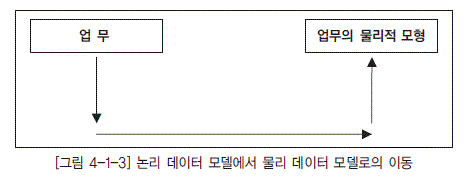

  * [그림 4-1-3] 논리 데이터 모델에서 물리 데이터 모델로의 이동">

### 다. 논리적 표현 원칙(Logical Representation Principle)

조직의 데이터에 대한 논리적 측면을 최대한 표현해야 한다. 모델은 물리적 제약 조건 없이 비즈니스를 그대로 반영해야 한다. 즉, 논리 데이터 모델은 특정 아키텍처, 기술 또는 제 사용자들이 항상 시스템 개발자들에게 가지는 주요 불만 사항은 바로 ‘이해의 부족’이다. 사용자가 원하는 것에 근거를 두지 않은 프로젝트는 실패할 확률이 높다. 또한 기존 애플리케이션에 대한 빈약한 문서화의 주요 원인 중 하나는 성급하게 물리적 설계 단계로 들어가려 하는 분석가들의 성향 때문이다. 논리적 설계와 물리적 설계를 구별하지 못하면 프로젝트가 추 구하고자 하는 물리적 선택 사항을 제한하거나 잘못된 방향으로 진행하게 된다. 이러한 문제들을 예를 통해 이해해 보자.

1) 웬만한 분석의 결과는 잘 알고 있다(지름길을 좋아하는 것)

어떤 이들은 여러 가지 이유(예를 들어, 자명하게 보이는 분석을 수행하는 데 시간 낭비를 줄이기 위해 또는 결과가 이미 정해져 있어서)때문에 분석을 생략하는 경우가 많다. 대부분의 경우에서 모델러들은 애플리케이션 개발 과정에서 발생할 수 있는 모든 것들을 알 수 없다. 또한 모델러들은 몇 십년내에 시스템에서 발생할 수 있는 것에 대해서도 확신하지는 못한다. 결론적으로 최적의 행동은 솔루션에 독립적인 방식으로 규칙을 따르고 문제를 문서화하는 것이다.

2) 조급하게 솔루션을 구체화하는 것

문제를 조사할 때 데이터베이스가 어떻게 구현되어야 하는가에 관한 기발한 아이디어가 나오기란 어렵다. 이러한 점에서 섣불리 솔루션을 구체화하는 것은 잘못된 것이다. 그 이유는 문제의 일부분만을 파악했을 때 이를 해결할 수 있는 모든 데이터가 확보된 것은 아니며, 나중에 인식한 문제로부터 다른 솔루션을 발견할 수도 있기 때문이다. 또한 문제가 정확히 진술된 것이 아니기 때문에 작업물을 검토하는 다른 사람들은 솔루션이 문제를 해결하는 이유를 이해할 수 없을 것이다. 이것은 분석가들이 솔루션을 그들의 머리에서 없애야 한다는 것이 아니라 솔루션에 대한 좋은 생각이 표면화되었을 때 그것을 기록하여 논리적 설계 다음에 물리 데이터 모델 설계자에게 전달하여야 한다는 것을 의미한다.

논리적 설계의 컴포넌트가 부정확하거나 빼먹었을 때 물리 데이터 모델에서 논리 데이터 모델로의 회귀는 피할 수 없다. 물리 데이터 모델 제약 조건이 명시된 경우 조차도 논리 데이터 모델은 제약 조건이 없는 것처럼 진행해야 한다. 그럼에도 불구하고 이러한 경우들이 논리적 표현 원칙을 변화시키지는 않는다. 논리 데이터 모델링이 2년짜리 프로젝트의 첫 단계이든지 수많은 2주 짜리의 반복 과정이든지에 상관 없이 원칙은 솔루션을 구체화하기 전에 문제를 이해해야 한다는 것이다.

## 5. 좋은 데이터 모델의 요소

일반적으로 시스템 구축 과정에서 생성되는 데이터 모델은 품질을 평가하는 것이 매우 어렵다. 사실은 특정 데이터 모델이 업무 환경에서 요구하는 사항을 얼마나 잘 시스템적으로 구현할 수 있는가를 객관적으로 평가할 수 있다면 가장 좋은 평가 방법일 것이다. 하지만 이것을 객관적으로 평가할 수 있는 기준이 존재하지는 않는 것이 현실이다. 다음에서는 이러한 상황에서 대체적으로 좋은 데이터 모델이라고 말할 수 있는 몇 가지의 요소를 설명한다.

### 가. 완전성(Completeness)

업무에서 필요로 하는 모든 데이터가 데이터 모델에 정의되어 있어야 한다. 완전성은 데이터 모델을 검증하기 위해서 가장 먼저 확인해야 할 부분이다. 이 기준이 충족되지 못하면 다른 어떤 평가 기준도 의미가 없어진다. 만약 보험사의 데이터 모델에 고객의 직업을 관리하기 위한 속성이 존재하지 않는다면 어떻겠는가? 이것은 심각한 데이터 모델의 문제점이다.

### 나. 중복 배제(Non-Redundancy)

하나의 데이터베이스 내에 동일한 사실은 반드시 한 번만 기록하여야 한다. 예를 들면, 하나의 테이블에서‘나이’칼럼과‘생년월일’칼럼이 동시에 존재한다면 이것은 데이터 중복이라고 볼 수 있다. 이러한 형태의 데이터 중복 관리로 인해 여러 가지의 바람직하지 않는 형태의 데이터 관리 비용을 지불하고 있다. 예를 들면, 저장 공간의 낭비, 중복 관리되고 있는 데이터의 일관성을 유지하기 위한 추가적인 데이터 조작 등이 대표적으로 낭비되고 있는 비용이라고 볼 수 있다.

### 다. 비즈니스 룰(Business Rules)

데이터 모델에서 매우 중요한 요소 중에 하나가 데이터 모델링 과정에서 도출되어 지고 규명되어지는 수많은 업무 규칙(Business Rules)을 데이터 모델에 표현하고 이를 해당 데이터 모델을 활용 하는 모든 사용자가 그 규칙을 공유할 수 있게 제공하는 것이다. 특히 데이터아키텍처에서 언급되는논리 데이터 모델(Logical Data Model)에서 이러한 요소들이 포함되어야 함은 매우 중요한 요소라고 할 수 있다. 예를 들면, 보험사의 사원들은 매월 여러 가지 항목에 대해 급여를 지급받고, 이를 데이터로 관리하고 있다. 각 사원들은 월별로 하나 이상의 급여 항목(기본급, 상여금, 수당, 수수료, 등등)에 대해 급여를 지급받는다. 여기에 더 나아가 각 사원은 사원 구분별(내근, 설계사, 계약직, 대리점 등)로 위의 급여 항목을 차등적으로 지급받는다는 업무 규칙이 존재한다. 이러한 내용을 데이터 모델에 나타내어야 한다. 이렇게 함으로써 해당 데이터 모델을 사용하는 모든 사용자(개발자, 관리자등)가 해당 규칙에 대해 동일한 판단을 하고 데이터를 조작할 수 있게 되는 것이다.

### 라. 데이터 재사용(Data Reusability)

데이터의 재사용성을 향상시키고자 한다면 데이터의 통합성과 독립성에 대해서 충분히 고려해야 한다. 무슨 이야기인가? 과거에 정보시스템이 생성되고 운영되던 형태를 되짚어보면 철저하게 부서 단위의 정보시스템으로 설계되고 운용되어 왔다. 현재 대부분의 회사에서 진행하고 있는 신규 정보 시스템의 구축 작업은 어떻게 이루어지고 있는가? 회사 전체 관점에서 공통 데이터를 도출하고 이를전 영역에서 사용하기에 적절한 형태로 설계하여 시스템을 구축하게 된다. 이러한 형태의 데이터 설계에서 가장 중요하게 대두되는 것이 통합 모델이다. 통합 모델이어야만 데이터 재사용성을 향상시킬 수 있다. 또 다른 측면에서 보면 과거 정보시스템의 데이터 구조의 가장 큰 특징은 데이터 모델이 별도로 존재하지 않고 애플리케이션의 부속품 정도로 인식되어져 왔던 것이 사실이다. 이러한 환경에서의 데이터는 프로세스의 흐름에 따라 관리되게 마련이다. 이러면 데이터 중복이 많이 발생하고 데이터의 일관성 문제가 심각하게 초래된다. 데이터가 애플리케이션에 대해 독립적으로 설계되어야만 데이터 재사용성을 향상시킬 수 있다.

### 마. 안정성 및 확장성(Stability and Flexibility)

정보 시스템은 비즈니스의 변화에 대해 최적으로 적응하도록 끊임없이 요구 받고 있다. 하지만 정보시스템의 데이터 모델은 이러한 변화에 대해 어떻게 대응할 수 있는가? 현재의 데이터 구조를 거의 변화하지 않고도 변화에 대응할 수 있는 데이터 구조도 있을 것이고, 아주 적은 확장을 통해 이러한 변화에 대응하는 것도 있을 것이다. 하지만 이러한 변화에 대응하기 위해 데이터 구조적으로 아주 많은 변화를 주어야만 한다면 변화의 대상이 되는 부분뿐만 아니라 정보시스템의 나머지 부분들도 많은 영향을 받게 될 것이다. 그래서 많은 기업이 정보시스템을 구축하는 과정에서 데이터 구조의 확장성, 유연성에 많은 노력을 기울이고 있다. 그렇다면 어떤 데이터 모델이 이러한 확장성을 가진 데이터 모델인가?

현대의 기업들이 동종의 타 기업으로부터 경쟁 우위에 자리매김하려고 한다면 구축하는 데이터 모하게 대응할 수 있어야 한다. 특히 근래의 많은 패키지 시스템이 가지고 있는 데이터 모델들은 확장성을 강조하기 위해서 많은 부분을 통합한 데이터 모델 형태를 가지고 있는 것을 볼 수 있다. 여기에서도 잘 나타나듯이 확장성을 담보하기 위해서는 데이터 관점의 통합이 불가피하다. 특히 정보시스템에서의 ‘행위의 주체’가 되는 집합의 통합,‘ 행위의 대상’이 되는 집합의 통합, ‘행위 자체’에 대한 통합 등은 전체 정보시스템의 안정성, 확장성을 좌우하는 가장 중요한 요소라 할 수 있다.

### 바. 간결성(Elegance)

데이터 모델이 갖추어야 하는 중요한 요소 중 하나는 기업이 관리하고자 하는 데이터를 합리적으로 균형이 있으면서도 단순하게 분류하는 것이다. 아무리 효율적으로 데이터를 잘 관리할 수 있더라도 그것의 사용, 관리 측면에서 복잡하다면 잘 만들어진 데이터 모델이라고 할 수 없다. 동종의 비즈니스를 영위하는 기업이라고 하더라도 각 회사의 데이터 모델을 비교해 보면 복잡도에는 많은 차이가 있는 것을 볼 수 있다. A 보험사는 계약 업무를 수행하기 위해 10개의 테이블을 정의해 업무를 수행하는 반면에 B 회사는 100개의 테이블을 정의해 동일한 업무를 수행하고 있다. 두 회사의 데이터 모델의 차이점은 무엇인가? 10개의 테이블을 가지고 업무를 수행하고 있는 A 회사의 데이터 모델은 간결하지만 새로운 업무 환경의 변화에 대해 확장성을 가지고 있다. B 회사는 겉으로는 새로운 업무 환경의 변화(신규 상품의 출현 등)에 능동적으로 대처하고 있는 것처럼 보이지만 사실은 보유하고 있는 데이터 모델의 한계로 인해 테이블의 수가 지속적으로 증가해 왔다. 이렇게 됨으로써 데이터 모델은 간결하지 못하고 동일한 형태로 관리되어야 하는 데이터가 복잡한 형태로 관리되어지고, 그들과의 관계를 갖고 있는 다른 여러 가지의 데이터나 복잡한 형태의 관계들이 불가피해 복잡성을 증가시켜왔다. 결국 간결한 모델의 기본적인 전제는 통합이다. 합리적으로 잘 정돈된 방법으로 데이터를 통합하여 데이터의 집합을 정의하고, 이를 데이터 모델로 잘 표현하여 활용한다면 웬만한 업무 변화에도 데이터 모델이 영향을 받지 않고 운용될 수 있게 된다.

### 사. 의사소통(Communication)

데이터 모델의 역할이 많다. 그 중에서도 중요한 것이 데이터 모델의 의사소통 역할이다. 데이터 모델은 대상으로 하는 업무를 데이터 관점에서 분석하고 이를 설계하여 나오는 최종 산출물이다. 데이터 분석 과정에서는 자연스럽게 많은 업무 규칙이 도출된다. 이 과정에서 도출되는 많은 업무 규칙은 데이터 모델에 엔터티, 서브타입, 속성, 관계 등의 형태로 최대한 자세하게 표현되어야 한다. 예를 들면,‘ 사원’테이블에는 어떠한‘사원구분’을 가지는 사원들이 존재하는가? ‘ 정규직’,‘ 임시직’ 사원들이 같이 존재하는가? 아니면 또 다른 형태의 사원들이 존재하는지를 표현해야 한다. 더 나아가서‘호봉’이라는 속성은‘정규직’일 때에만 존재하는 속성인데, 이러한 업무 규칙이 데이터 모델에 표현되어야 한다. 또한 관리하는 사원 중에서‘정규직’사원만이‘급여’테이블과 관계를 가진다. 이러한 부분은 개별 관계로 데이터 모델에 표현되어야 한다. 이렇게 표현된 많은 업무 규칙은 해당 정보시스템을 운용, 관리하는 많은 관련자들이 설계자가 정의한 업무 규칙들을 동일한 의미로 받아들이고 정보시스템을 활용할 수 있게 하는 역할을 한다. 즉, 데이터 모델이 진정한 의사소통 (Communication)의 도구로서의 역할을 하게 된다.

### 아. 통합성(Integration)

기업들이 과거로부터 정보시스템을 구축해왔던 방법은 개별 업무별로의 단위 정보 시스템을 구축하여 현재에까지 유지 보수를 해오고 있는 것이 보통이다. 점진적인 확장과 보완의 방법으로 정보시스템을 사용해 왔기 때문에 동일한 성격의 데이터임에도 불구하고 전체 조직 관점에서 보면 여러 곳에서 동일한 데이터가 존재하기 마련이다. 특히 이러한 데이터 중에서도 고객, 상품 등과 같이 마스터 성격의 데이터들이 분할되어 관리됨으로 인해 전체 조직 관점의 데이터 품질, 관리, 활용 관점에서 많은 문제점이 나타나고 있는 것이 현실이다. 가장 바람직한 데이터 구조의 형태는 동일한 데이터는 조직의 전체에서 한 번만 정의되고 이를 여러 다른 영역에서 참조, 활용하는 것이다. 물론 이때에 성능 등의 부가적인 목적에 따라 의도적으로 데이터를 중복시키는 경우는 존재할 수 있다. 동일한 성격의 데이터를 한 번만 정의하려면 공유 데이터에 대한 구조를 여러 업무 영역에서 공동으로 사용하기 용이하게 정의할 수 있어야 한다. 이러한 이유로 데이터 아키텍처의 중요성이 한층 더 부각되고 있다.

# 제2절 데이터 모델링 기법 이해

## 1. 데이터 모델 목적

데이터 모델은 데이터베이스 설계에 대한 계획 또는 청사진이다. 설계자와 개발자, 사용자 등 모든 관련자들은 데이터 모델을 통해 구축될 시스템의 데이터 구조에 대한 형상을 이해하고, 요구 사항의 구현과 변경 등에 대해 원활한 의사소통을 도모하게 된다. 예를 들어, 건물을 지을 때 건축설계 회사는 건물 공사 이전에 그 건물을 위한 계획이나 청사진을 작성하게 되는데, 만일 계획 단계에서 어떤 방이 너무 좁거나 불편한 곳이 있다면 단순히 설계 도면의 선을 다시 그림으로써 청사진이 변경될 수 있지만 건물이 완공된 후에 변경이 필요하게 되면 벽, 상하수도, 전기 등 모든 것을 다시 시공해야만 하기 때문에 비용이나 시간 측면에서 많은 손해를 보게 될 것이다. 이와 같이 완공된 건물을 변경하는 것보다는 계획 단계에서의 변경이 훨씬 쉽고 간결하며 비용 면에서도 저렴하기 때문에 설계자는 시공에 앞서 조감도, 평면도, 입체도 등 다양한 논리 도면을 통해 건물주(사용자)가 건물의 논리적인 형태를 쉽게 이해하고 의견을 제시하거나 확정을 할 수 있도록 유도한다. 이때 사용된 도면들은 설계자와 시공자, 건물주 등이 짓고자 하는 건물에 대해 동일한 논리적 모습을 공유하게 함으로써 원활한 의사소통의 수단이 되었다고 할 수 있다.

이러한 논리는 건축 공사뿐만 아니라 시스템 개발도 동일하게 적용될 수 있다. 데이터 모델링 단계에서 업무를 잘못 이해했거나 관계를 잘못 정의한 것이 발견되었다면 해당하는 다이어그램과 일부 관련된 문서만 변경하면 된다. 그러나 데이터베이스와 응용 프로그램 개발이 완료된 후 이러한 오류를 발견하여 수정하려면 이와 관련된 많은 프로그램과 SQL문이 변경되어야 할 뿐만 아니라 데이터가 새로운 구조로 옮겨져야 하는 등 이러한 변경을 반영하는 데 많은 비용과 시간이 필요하게 되기 때문에 가능하면 설계 단계에서 조기에 오류들이 발견되고 정정되도록 원활한 의사소통이 필요하게 되고, 이러한 목적을 달성하는 데 데이터 모델은 최적의 수단으로 활용될 수 있다.

## 2. 개체-관계 모델 기법(Entity-Relationship Modeling)

개체-관계 모델은 1976년에 피터 첸(Peter Chen)에 의해서 최초로 제안되었으며 그의 논문을 통 해 이 모델의 기본적인 구성 요소가 정립되었다. 그 후 데이터 모델을 만들어 주는 많은 도구와 기법 이 소개되었는데 계층적 데이터 모델, 네트워크 데이터 모델, ANSI/SPARC 데이터 모델, 개체-관 계 데이터 모델, 의미 객체 모델 등을 예로 들 수 있다. 이 가운데에서 개체-관계 모델은 표준적인 데이터 모델로 부상했는데 이 모델이 지니고 있는 단순성 때문에 현재 개념/논리 데이터 모델링에서 가장 일반적으로 사용되고 있다. 이 모델에 서브타입이 추가되면서 확장된 개체-관계 모델 (Extended Entity-Relationship model)이 만들어졌으며 이제 일반적으로 개체-관계 모델이라고 하면 이 확장된 개체-관계 모델을 의미한다.

개체-관계 모델은 다음과 같은 목적으로 사용되고 있다.

  * 데이터에 대해 관리자, 사용자, 개발자들이 서로 다르게 인식하고 있는 뷰들을 하나로 통합할 수 있는 단일화된 설계안을 만들 수 있다.

  * 서로 다른 뷰를 충족시킬 수 있는 데이터 처리와 제약 조건 등의 요구 사항을 정의하기 위해서 이다.

개체-관계 모델은 개체-관계 다이어그램(ERD, Entity Relationship Diagram)으로 표현된다.

개체-관계 다이어그램은 최종 사용자의 관점에서 데이터 구조를 그림 형태로 묘사하기 위해 개체, 관계, 속성이라는 세 개의 기본 요소를 사용하며, 엔터티와 이들간의 관계를 미리 약속된 도형을 사 용하여 알기 쉽고 일목요연하게 그림으로 표시한 것이라 정의할 수 있다.

본 절에서는 이들 각 요소들을 구체적으로 살펴본다.

## 3. 개체-관계 모델 구성 요소

개체-관계 데이터 모델링은 일반적으로 개발 방법론에 의하여 논리 모델링(논리 데이터 모델링)과 물리 모델링(물리 데이터 모델링)으로 나눌 수 있을 것이다. 논리 데이터 모델이란 각 기업에서 업무를 수행하기 위해 필요한 개체(엔터티)가 무엇이며, 개체의 유일성을 보장해주는 식별자(Unique identifier)가 무엇이며, 각 엔터티 간에는 어떤 상관관계가 있고 필요한 속성이 무엇인지를 설명해주는 그림이다. 즉, 업무 담당자와 IT 시스템 설계자 사이의 의사소통이라 할 수 있다. 여기에서 중요한 것은 논리 데이터 모델링은 데이터베이스나 하드웨어 등과 같은 시스템과 아무런 상관없이 업무에서 필요한 데이터를 그림으로 그려놓고 이를 검증하는 방법으로, 주로 개체-관계 다이어그램을 사용한다는 것이다. 따라서 외래키(FK, Foreign Key), 기본키(PK, Primary Key), 액세스 성능, 분산 시스템 등의 물리적 시스템 환경은 고려하지 않는다. 이 때문에 논리적 모델의 특징은 초기에 엔터티와 엔터티의 관계에서 M:M 관계, 순환 관계(Recursive), 슈퍼/서브 타입(Super/Sub Type), 배타적(Arc) 관계 등을 갖고 있는 개체(엔터티)가 많이 보인다는 점이다. 잘 설계된 논리 데이터 모델은 비록 업무 방식이 바뀌어도 업무 영역이 바뀌지 않는 한 설계 변경이 거의 발생하지 않는다. 이러한 이유 때문에 많은 시스템 설계자는 프로세스 중심의 설계보다 데이터 중심 방식의 설계를 주로 사용한다. 논리 데이터 모델에서 하나의 엔터티는 반드시 물리적으로 하나의 테이블이나 세그먼트가 되지는 않으며, 하나 이상 또는 테이블 한 개의 일부가 될 수도 있다. 물리 데이터 모델링은 논리 데이터 모델링을 기초로 현재의 시스템 환경(네트워크, 하드웨어, 운영체제, 미들웨어, 데이터베이스, 디스크 용량, 분산 등)을 고려하여 최고의 성능 향상을 목적으로 한다.

논리 데이터 모델링에서 물리 데이터 모델링 단계로 넘어오면서 고려해야 하는 작업의 사례는 다음과 같다.

  * Super/Sub 관계의 엔터티를 몇 개의 테이블로 만들 것인가

  * 배타적(Arc) 관계 엔터티의 외부키(Foreign Key)를 몇 개로 할 것인가

  * 성능 향상을 위해 테이블을 추가해야 할 것인가 혹은 통합해야 할 것인가

  * 통계 작업을 위해 합계(Summary) 테이블 같은 임시성 테이블을 몇 개로 할 것이며, 유일키를 무 엇으로 할 것인가

  * 테이블의 칼럼을 다른 테이블에 중복할 것인가, 중복한다면 어떤 애플리케이션이 관련되어 있는 가, 인덱스의 설정, 스냅샷(Snapshot) 또는 뷰(View) 등의 객체가 필요한가

  * 분산 환경에서 테이블을 중복할 것인가, 중앙에 필요한 테이블을 따로 가져갈 것인가

  * 데이터가 분산 환경에서 이동 시 문제를 어떻게 해결할 것인가

물리 데이터 모델링 단계에서는 이러한 해결 과제가 산적해 있으며, 이를 종합적으로 해결할 때 전체적인 성능 향상을 기대할 수 있다. 위의 개념은 매우 중요하며 논리 데이터 모델과 물리 데이터 모델의 구분이 반드시 필요하다. 왜냐하면 물리적인 디자인은 시스템의 변경에 따라 필수적으로 변경이 되는 요소지만 논리 데이터 모델은 업무 영역이 바뀌지 않는 이상 변경이 거의 없는 특성이 있기 때문이다. 따라서 하나의 그림으로 모델을 관리하게 되어 변경이 일어날 때마다 유지 보수를 하다 보면 현재의 시스템과 상관없는 것으로 전락하게 되고, 결국은 막대한 비용을 들여 만들었던 개체-관계 다이어그램이 존재 가치를 상실하게 될 수도 있다.

### 가. 엔터티(Entity)

엔터티는 업무 활동상 지속적인 관심을 가지고 있어야 하는 대상으로서, 그 대상들 간에 동질성을 지닌 것으로 볼 수 있는 개체 집합이나 그들이 행하는 행위의 집합으로 정의할 수 있다. 동질성은 집합을 어떻게 정의하느냐에 따라 달라질 수 있는데, 집합에 들어갈 개체들의 동일한 성질을 어디까지로 한정할 것인지를 결정하는 것으로 동질성 유무를 판단할 수 있다. 예를 들면, ‘고객’이라는 집합을 ‘우리 상품을 구매한 사람이나 법인’으로 정의했다면 아직 구매를 한 적이 없는 잠재 고객이나 구매 상담자, 또 법인번호가 없는 단체나 개인 사업자 등은 이들과 동질성을 갖지 못한다. 그러나 이들이 현재 어떠한 방법으로든 관리가 되고 있거나 앞으로 관심을 갖고자 하는 범주에 해당한다면 집합의 정의를 더 확장해야만 이들을 고객 집합 내에 끌어들일 수 있다. 집합에 대한 정의 문제는 엔터티의 구성 속성과 관계 정의에도 영향을 미치고, 이것은 결과적으로 데이터 모델 전체의 구성에 영향을 미치게 되므로 엔터티, 즉 집합에 대한 명확한 정의는 데이터 모델링에서 가장 핵심적인 사안이라 할 수 있다. 그러므로 엔터티를 정의할 때는 어떤 대상이 그 엔터티에 속하는지 여부를 명확하게 구분할 수 있도록 정의해야 한다.

엄밀한 의미에서 엔터티는 동질성을 갖는 개별 개체나 행위를 지칭하며, 달리 엔터티 인스턴스(Entity Instance) 라고도 한다. 그리고 이들의 집합을 엔터티 타입(Entity Type)이라고 부른다. 동질성을 갖는다는 의미는 어떤 한 개체(엔터티 인스턴스)를 설명하거나 묘사할 수 있는 특성들(예컨대, 학번, 이름, 학과 등과 같은 항목들)에 대해 다른 여러 개체들이 동일한 특성들로 설명 또는 묘사될 수 있음을 말하며, 이와 같은 개체들의 집합을 엔터티 타입이라고 한다. 예를 들면, 어떤 특정한 학번, 이름, 학과로 특징지어질 수 있는‘홍길동’학생은 엔터티 인스턴스이고, 학번, 이름, 학과 등과 같은 공통적인 특성 항목들을 공유하는 학생들의 집합인 ‘학생’은 엔터티 타입이 된다. 엔터티와 엔터티 타입은 각각‘실체’와‘실체형’으로 번역되어 사용되기도 하나, 일반적으로 엔터티와 엔터티 타입으로 사용하기로 하며, 통상적으로 많은 책들과 실무상에서 엔터티와 엔터티 타입은 엄격하게 구분하지 않고 엔터티로 줄여서 사용하고 있기 때문에, 본 과목에서는 개체나 행위의 집합을 엔터티로 통칭할 것이다.

엔터티는 그 집합에 속하는 개체들의 특성을 설명할 수 있는 속성(Attribute)을 갖는데, 예를 들어 ‘학생’이라는 개체 집합은 학번, 이름, 이수학점, 등록일자, 생일, 주소, 전화번호, 전공 등의 속성으로 특징지어질 수 있다. 이러한 속성 가운데에는 개체 집합 전체가 공유할 수 있는 공통 속성도 있고, 개체 집합 중 일부에만 해당하는 개별 속성도 있을 수 있다.

개체-관계 다이어그램을 표기하는 방법은 여러 가지가 있는데, 그것들에 대해서는 뒤에서 설명하기로 하고, 여기서는 그 중 한가지만 리차드 바커(Richard Barker)가 제안한 바커 표기법(Barker Notation)과 정보공학표기법(IE Notation)에 따른 표현을 예로 설명한다. 엔터티를 개체-관계 다이어그램으로 나타낼 때는 [그림 4-1-4]와 같은 모양으로 나타내고 이름을 부여할 수 있다. [그림4-1-4]에서 좌측은 바커 표기법을, 우측은 정보공학표기법(이후 IE 표기법이라 지칭)을 적용한 엔터티 모습의 예이다.

  * [그림 4-1-4] 엔티티 모습 예">

### 나. 속성(Attribute)

속성은 엔터티에 저장되는 개체 집합의 특성을 설명하는 항목이라고 할 수 있다. 엔터티를 명확하고 구체적으로 정의했다 하더라도 이것만으로는 개체 집합의 특성을 설명하기에는 부족함이 있다. 예를 들면, ‘직원’엔터티의 개체인 ‘김철수’와 ‘홍길동’은 독립적인 사람 개체임에는 분명하지만 이들의 특성을 설명할 수 있는 보다 구체적인 항목(속성)이 없으면 이 집합을 명쾌하게 객관화할 수 없다. ‘직원’집합의 특성을 설명하기 위해 직원번호, 직원명, 주민등록번호, 연락전화번호, 거주지, 주소 등과 같은 속성을 정의했다면 이제 이러한 속성 구성을 통해 어떻게 ‘홍길동’이라는 개체를 특징짓고 변별할 것인지를 분명하게 이해할 수 있고, 집합의 의미 또한 좀 더 명확해진다고 할 수 있다. [그림 4-1-5]와 [그림 4-1-6]에서 엔터티의 속성을 표현하는 서로 다른 방법을 보여 주고 있다. [그림 4-1-5]는 엔터티에 연결되는 속성을 타원으로 보여 주고 있다. 이 스타일은 데이터 모델링 소프트웨어 제품이 출현하기 이전에 원래의 개체-관계 모델에서 사용되었다. [그림 4-1-6]은 현재의 데이터 모델링 소프트웨어 제품에서 보편적으로 사용되고 있는 바커 표기법과 IE 표기법의 스타일을 보여 주고 있다.

[그림 4-1-5]의 개체-관계 다이어그램에서 속성은 개체 집합을 나타내는 직사각형에 실선으로 연결된 타원형으로 표현되며, 각 타원형은 고유의 속성 이름을 갖는다. 또한 각 속성은 가질 수 있는 값의 범위가 있는데, 이를 그 속성의 도메인(Domain)이라 한다. 예를 들면 학생이라는 엔터티가 있을때 학점이라는 속성의 도메인은 0.0에서 4.0 사이의 실수 값이며, 주소라는 속성은 길이가 20자리 이내의 문자열로 정의할 수 있다. 여기서 물론 각 속성은 도메인 이외의 값을 갖지 못한다.

  * [그림 4-1-5] 타원으로 표시된 속성 예">

  * [그림 4-1-6] 직원 개체 집합의 속성 예">

일반적으로 서로 다른 개체 집합에 정의된 속성은 같은 도메인을 공유할 수 있다. 예를 들면, 학생 개체 집합에서 주소 속성에 해당하는 도메인과 교수 개체 집합에서의 주소 속성 도메인은 같은 값들의 범위를 가질 수 있다. 개체 집합 내에서 각각의 개체를 식별할 수 있도록 하나 또는 그 이상의 속성들로 이루어진 속성 집합을 식별자(Unique Identifier)라고 하는데, 이 속성들이 개체 집합 내의 각 개체를 유일하게 지정한다. 예를 들면 학번, 성명, 주소, 생년월일, 학과 등의 속성들로 이루어진 학생 엔터티에서 학번 속성은 하나의 식별자가 될 수 있다.

[그림 4-1-7]은 자동차 개체 집합의 속성 구성을 나타낸 것이며, ‘ID_NUM’이라는 속성에 밑줄을 친 것은 식별자를 의미한다. [그림 4-1-6]과 같은 표현에서는 ‘#’표시가 붙은 속성이 식별자이다. 속성은 단순형 혹은 복합형으로 분류할 수 있다. 예를 들면, 주소 속성은 시, 구, 동, 번지 등과 같은 여러 세부 속성들로 구성될 수 있는데, 이를 복합 속성(Composite Attribute)이라 한다. 또한 나이, 성별 등의 속성은 더 이상 다른 속성들로 구성될 수 없는 단순한 속성이므로 단순 속성(Simple Attribute)이라 한다. 속성은 관리 목적이나 상세화 정도에 따라서 단일 값(Single Value) 또는 다중 값(Multi Value)을 가질 수 있다. 주민등록번호와 같은 속성은 반드시 하나의 값만 존재하므로 이 속성은 단일치 속성(Single-Valued Attribute)이라 하고, 어떤 사람 전화번호와 같이 여러 개의 값을 가질 수 있다. 자동차의 색상 속성도 차 지붕, 차체, 외부의 색이 다를 수 있다. 이런 속성을 다중치 속성(Multi-Valued Attribute)이라 한다.

[그림 4-1-7]과 같은 표현에서 다중치 속성은 두 개의 실선으로 표시한다. 개체-관계 모델에서는 복합 속성, 다중치 속성을 정의할 수 있지만, 직접 구현은 불가능할 수도 있다. 이를 위해서는 M:M 관계나 다수의 속성 또는 1:M 관계의 추가 엔터티를 사용하여 수정해 주어야 한다. 만약 다중치 속성이 존재하면 설계자는 아래의 방법 중 하나를 선택하여 해결할 수 있다.

1) 엔터티 내에서 다중치 속성을 여러 개의 새로운 속성으로 나눈다. [그림 4-1-7]에서의‘COLOR’ 속성에 대해 [그림 4-1-8]과 같은 새로운 속성을 만들어 [그림 4-1-7]에서‘CAR’개체형의 속성들로 부착시킨다.

2) 다중치 속성을 구성하는 속성들로 구성된 새로운 엔터티를 만든다. 이때 새로운 엔터티는 원래 엔터티와 M:1 관계를 맺게 한다. [그림 4-1-8]의‘COLOR’속성을 떼어내어 새로운 엔터티로 만들면 새로운 엔터티‘COLOR’는‘CAR’개체형과 M:1 관계가 될 것이다. 속성 중에는 유도 속성 (Derived Attribute)으로 분류될 수 있는 것도 있는데, 이 속성은 다른 속성의 값으로부터 어떤 계산을 통해 새로운 값을 얻게 되므로 집합의 본질이나 특성을 규명하기 위한 속성을 고려할 때 제외할 수도 있다. 예를 들면, 어떤 사람의 나이 속성은 현재 날짜로부터 생년월일 속성의 값을 뺌으로써 나이의 값을 유도할 수 있다. [그림 4-1-9]에서와 같은 표현에서 유도 속성은 점선으로 표시된다.

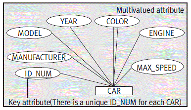

  * [그림 4-1-7] 기본적인 개체-관계 모델 개체 정의">

  * [그림 4-1-8] 다중치 속성의 구성 속성들로 만들어진 새로운 개체형">

  * [그림 4-1-9] 유도 속성">

### 다. 식별자

엔터티의 각 개체들은 인스턴스라고 하는데, 인스턴스는 그들을 지칭하거나 식별해 주는 속성인 식별자(Unique Identifier)를 가지고 있다. 예를 들어, 직원 인스턴스는 직원번호, 주민번호, 직원명으로 식별될 수 있다. 이들 중 직원명은 실세계에서는 직원 각각을 식별하는 데 이용될 수 있으나 데이터 측면에서는 동명이인의 문제 때문에 식별성이 미약한 편이다. 봉급이나 입사일 같은 속성으로는 각각의 인스턴스를 유일하게 식별할 수 없다. 이와 마찬가지로 고객은 고객번호나 고객이름으로 식별될 수 있고, SALES-ORDER은 OrderNumber(주문번호)에 의해서 구별될 수 있다.

식별자는 하나 또는 그 이상의 속성으로 구성된다. 특히 두 개나 그 이상의 속성으로 이루어진 식별자를 복합 식별자(Composite Identifier)라 부른다. 그 예로는 (Area Code, Local Number), (Project Name, Task Name), (First Name, Last Name, Date Of Hire) 등이 있다. 식별자와 키는 구별하여 사용되어야 하며, 이 둘은 서로 일치할 수도 있고 그렇지 않을 수도 있다. 즉 식별자는 논리적인 관점에서 사용되고 키(Key)는 물리적인 관점에서 사용된다. 따라서 엔터티는 식별자를 가지며, 테이블은 키를 가진다고 할 수 있다. 이러한 이유로서 식별자가 엔터티에 대해 하는 역할은 키가 테이블에 대해 하는 역할과 동일하다.

엔터티는 데이터 모델에서 3단계의 상세 수준으로 표현된다. 때로는 엔터티와 그것이 가지는 속성 모두가 표시되기도 한다. 이 경우 [그림 4-1-10]에 나와 있는 것과 같이 식별자 속성을 표현하기 위해 바커 표기법에서는 #이 식별자 속성 앞에 그려지고, IE 표기법에서는 엔터티 박스 내부의 상단에 식별자 속성을 표시한다. 데이터 모델에서는 모든 속성을 자세히 표현하면 개체-관계 다이어그램을 다루기가 힘들어진다. 이 경우에는 [그림 4-1-11]에서처럼 식별자만 보이거나 [그림 4-1-12]에서처럼 엔터티 박스 안에 엔터티 이름만 간결하게 보일 수도 있다.

  * [그림 4-1-10] 직원 엔터티 예">

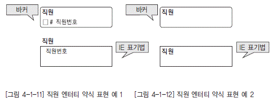

  * [그림 4-1-11] 직원 엔터티 약식 표현 예 1 [그림 4-1-12] 직원 엔터티 약식 표현 예 2">

데이터 모델링의 초기 단계에서부터 모델을 지나치게 상세히 표현하면 개체-관계 다이어그램을 이해하고 다루기가 힘들어질 수도 있기 때문에 [그림 4-1-11]에서처럼 간단하게 식별자만 보이거나 [그림 4-1-12]에서처럼 직사각형 안에 개체 이름만 간결하게 보임으로써 많은 모델들 중에서 사용자가 필요한 것들을 손쉽게 식별하게 하기도 한다. [그림 4-1-11]과 [그림 4-1-12]에서 위는 바커 표기법을 사용한 엔터티의 약식 표현이며, 아래는 IE 표기법을 사용한 엔터티의 약식 표현이다. 세가지 기법 모두가 실제로 사용되며, [그림 4-1-12]의 더 간결한 형식은 상위 수준의 개요와 전반적인 개체-관계를 보여주는 데 사용된다.

### 라. 관계(Relationship)

관계는 엔터티와 엔터티 간 연관성을 표현하는 것으로, 엔터티의 정의에 따라 영향을 받기도 하고, 속성 정의 및 관계 정의에 따라서도 다양하게 변할 수 있다. 엔터티 간에 논리적으로 존재할 수 있는 수많은 관계 중에서 정말로 의미가 있고 관리할 가치가 있는 관계를 식별해 낸다는 것이 쉬운 일은 아니다. 최초의 개체-관계 다이어그램에서 관계는 속성을 가질 수 있었으나 현재는 그렇지 않다. 관계의 표현에는 이항 관계(Binary Relationship), 삼항 관계(Ternary Relationship), n항 관계가 존재할 수 있는데, 실제 삼항 관계 이상은 잘 사용되지 않는다. [그림 4-1-13] 참조 매핑 카디날리티(Mapping Cadinality)는 개체-관계 다이어그램에서 개체와 연결될 때 나타나는 대응(Mapping)되는 수로 대응수라고도 한다. 대응수는 최대 대응수(Maximum Cadinality)와 최소 대응수(Minimum Cadinality)로 구분된다. 매핑 카디날리티가 포함된 개체-관계 다이어그램에 대하여 예제를 통해 설명하고자 한다. [그림 4-1-13] 참조

다음과 같은 조건하에서 교수 개체와 학생 개체 간에 성립하는 지도 관계의 매핑 카디날리티를 결 정하고, 개체-관계 다이어그램을 작성하면 [그림 4-1-13]과 같은 이항 관계 구조의 다이어그램을 완성할 수 있다.

■ 조건 1 : 교수는 꼭 학생에 대한 지도를 해야 한다.

&lt;min-card(교수, 지도)="1&lt;/p"&gt;&lt;/min-card(교수,&gt;

■ 조건 2 : 교수는 여러 명의 학생을 지도할 수 있다.

Max-Card(교수, 지도) = n

■ 조건 3 : 학생은 꼭 교수에게 지도를 받아야 한다.

Min-bCard(교수, 지도) = 1

■ 조건 4 : 학생은 여러 명의 교수에게 지도를 받을 수 없다.

Max-Card(교수, 지도) = 1

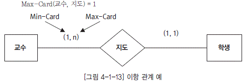

  * [그림 4-1-13] 이항 관계 예">

### 마. 카디날리티(Cardinality)

개체-관계 다이어그램은 데이터베이스가 지켜야 할 제약 조건들을 명시할 수 있다. 중요한 제약 조건 중의 하나로 연결(Connectivity)이라는 것이 있는데, 이는 한 개체가 관계를 통하여 다른 개체 와 관련된 개체들의 수를 나타낸다. 관계의 연결은 1:1, 1:M, M:M으로 분류된다. 개체-관계 다이어 그램에서는 관계의 연결을 1, M을 사용하여 표현하며 [그림 4-1-14]의 예와 같다. 표기법에 따라서 는 M:M을 M:N으로 표현하기도 하지만 여기서는 M:M으로 나타내기로 한다.

  * [그림 4-1-14] 관계 연결">

  * 일대일(One To One, 1:1) : X에 속하는 한 개체는 Y에 속하는 한 개체에만 연결되며, Y에 속하는 한 개체도 X 에 속하는 한 개체에만 연결된다.

  * 일대다(One To Many, 1:M) : X에 속하는 한 개체는 Y에 속하는 한 개체에만 연결되며, Y에 속하는 한 개체는 X에 속하는 여러 개체와 연결된다

  * 다대다(Many To Many, M:M) : X에 속하는 한 개체는 Y에 속하는 여러 개체와 연결될 수 있으며, Y에 속하는 한 개체도 X에 속하는 여러 개체와 연결될 수 있다.

또한 카디날리티(Cardinality)란 관계에 참여하는 하나의 개체에 대해 다른 엔터티에서 몇 개의 개체가 참여하는지를 나타낸다. 예를 들면, 한 명의 학생이 1개 이상 6개 이하의 과목에 등록할 수 있다면 카디날리티는 (1, 6)이다. 한 명의 교수가 최대 3개의 과목을 가르칠 수 있다면 카디날리티는 (0, 3)이다. 카디날리티는 (Min, Max)의 값 한 쌍으로 표현하는데, 여기서 Min은 관계에 참여하는 개체의 최소 개수, Max는 관계에 참여하는 최대 개수를 각각 의미한다. 여기서 Max의 값이 M으로 표시되면 최대 개수에 제한이 없음을 의미한다. [그림 4-1-15]에서 PROFESSOR-COURSE의 관계를 살펴보면 다음과 같이 해석할 수 있다.

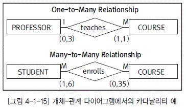

  * [그림 4-1-15] 개체-관계 다이어그램에서의 카디날리티 예">

1) PROFESSOR-COURSE는 1:M 관계이다.

2) PROFESSOR의 카디날리티는 (0, 3) 이다. 즉 각 교수는 3개 이하의 과목을 가르칠 수 있다.

3) COURSE의 카디날리티는 (1, 1)이다. 즉 각 과목을 가르치는 교수는 반드시 1명이어야 한다.

### 바. 존재 종속

만약 한 엔터티의 존재가 다른 엔터티(들)의 존재에 영향을 받는다면 이를 존재 종속(Existence-Dependent)이라 한다. 예를 들어, 어느 보험회사가 J. H. Callifante라는 사원과 그의 부양 가족들에게 보험 혜택을 준다고 할 때 EMPLOYEE, DEPENDENT라는 엔터티들을 정의한다고 하자. J. H.Callifante에게 Jill, Annelise, Jorge라는 3명의 부양 가족이 있다면 부양 가족 3명은 J. H.Callifante 없이는 보험 혜택을 받을 수 없다. 다시 말해 부양 가족 3명의 정보가 DEPENDENT라는 테이블에 존재하지만 EMPLOYEE와 연관지어 있을 때만 존재하게 된다. 이러한 것을 존재 종속이라 한다. 만약 J. H. Callifante가 직장을 그만 두어 테이블에서 없어지게 되면 부양 가족 3명도 함께 없어지게 된다. 여기서 DEPENDENT의 식별자는 EMPLOYEE의 키인 E_NUM과 DEP_NUM으로 구성된다. 두 개의 테이블들을 연결시켜 보면 J. H. Callifante는 3명의 부양 가족이 있고, W.K. Smithson은 부양 가족이 없음을 알 수 있다.

  * [그림 4-1-16] 존재 종속 예">

### 사. 서브타입

확장된 개체-관계 다이어그램은 서브타입의 개념을 도입했다. 서브타입은 정확한 의미로는 서브 타입 엔터티이며 그것의 전체집합인 슈퍼타입(Supertype)의 부분집합이다. 예를 들어 학생들은 학 부학생이나 대학원생으로 분류될 수 있다. 이 경우 학생이 슈퍼타입이고 학부학생과 대학원생은 서브타입이다.

  * [그림 4-1-17] 서브타입과 서브타입 구분자 예(바커 표기법)">

[그림 4-1-17]은 바커 표기법에 따른 서브타입 표현으로, 슈퍼타입인 사원은 서브타입인 내근사원, 설계사, 대리점을 가지고 있다. 슈퍼타입은 세 서브타입에 공통적인 모든 속성을 포함하고 있고, 서브타입은 각 서브타입에 적절한 속성만을 포함하고 있다. [그림 4-1-17]에서 속성 ‘사원구분’은 내근사원, 설계사, 대리점인지를 가리킨다. 어떤 서브타입이 적합한지를 결정해 주는 속성을 구분자(Discriminator)라고 부른다. IE 표기법을 사용하는 툴을 사용하면 [그림 4-1-18]과 같이 구분자는 서브타입 부호 바로 옆에 나타난다.

  * [그림 4-1-18] 서브타입과 서브타입 구분자 예(IE 표기법)">

모든 슈퍼타입이 구분자를 가지고 있는 것은 아니다. 만일 구분자가 없다면 적합한 서브타입을 생성하기 위해 응용 코드가 작성되어야 한다. 서브타입은 배타적(Exclusive) 또는 포괄적(Inclusive)일 수 있다. 만약 배타적이라면 슈퍼타입은 많아야 1개의 서브타입과 관련될 수 있다. 만약 포괄적이라면 슈퍼타입은 1개 또는 그 이상의 서브타입과 관련될 수 있다. [그림 4-1-19]는 IE 표기법에 따라 MANAGER와 DB_ADMIN을 서브타입으로 가진 사원 슈퍼타입의 형태를 표현한 사례이다. 돔 안의 X는 서브타입이 배타적인 것을 의미한다. 따라서 사원은 MANAGER나 DB_ADMIN 중 하나가 될 수는 있으나 둘 다 될 수는 없다. 이에 대한 구분은 서브타입을 의미하는 돔 옆에 서브타입 구분자를 표시하여 이 서브타입 구분자 속성을 통해 사원이 어느 서브타입에 속하는지 알 수 있음을 표현하고 있다. [그림 4-1-20]은 이러한 동일한 서브타입을 포괄적으로 보여주고 있다. 여기서 사원 슈퍼타입은 MANAGER, DB_ADMIN, 또는 양쪽 모두 될 수도 있는 포괄적 서브타입의 형태로 표현되어 있으며, X가 없는 돔 형태를 사용하여 두 개 이상의 서브타입과 관련된 포괄적 서브타입을 표현한다. 여기서 돔 옆에 서브타입 구분자를 나타내지 않음은 특정한 서브타입 구분자 속성을 가지고 있지 않음을 의미한다. 이와 같이 배타적 서브타입이나 포괄적 서브타입을 표현할 때 서브타입 구분자를 지정하지 않고 서브타입을 표현하는 것은 가능하나, 서브타입 구분자를 사용하지 않게 되면 인스턴스가 어느 유형에 해당하는지 알기 위해 주변 속성들을 확인해 보아야 하기 때문에 불가피한 경우가 아니면 효율성 측면에서 바람직하지 않다.

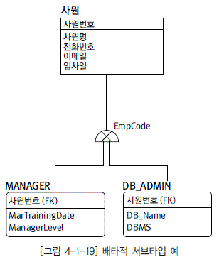

  * [그림 4-1-19] 배타적 서브타입 예">

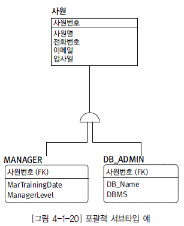

  * [그림 4-1-20] 포괄적 서브타입 예">

### 아. 객체지향 모델링(Object-Oriented Modeling)

과거, 소프트웨어 생산성 향상은 상당히 힘든 일로 여겨졌다. 구조적 기법, 방법론, 4세대 언어, 관계형 DBMS, CASE 도구는 시스템 개발상의 문제점을 없애고 비용을 절감하고 소프트웨어 개발의 품질을 향상시키기 위해 시도되었다. 그러나 대부분의 시도는 실패로 끝났다. 최근의 접근 방식 중의 하나가 재사용 코드(Reusable Code)의 개념에 초점을 둔 것이다. 이 개념은 한번 소프트웨어 루틴 (Routine)을 저장해 놓고 그것을 모든 프로그래머들과 공유하는 것을 말하는 것이다. 많은 노력 끝에 방법론과 CASE와 같은 많은 접근 방식들의 결합(Combination)은 재사용 코드에 대한 실제적인 성 과로 생산성의 이익을 가져왔다. 많은 개발자들은 이 새로운 접근 방식이 향후 시스템 개발에 있어 지 배적인 대세가 될 수 있다고 확신하고 있다. 만약 이것이 성공한다면 객체지향 접근 방식은 애플리케이션이 어떻게 개발되어야 하는지를 과감하게 변화시킬 수 있을 것이다. 객체지향 개발은 전체 시스 템 개발 영역을 다루고 있다. 그것의 종류는 아래와 같다.

  * 객체지향 방법론

  * 객체지향 분석

  * 객체지향 설계

  * 객체지향 모델링

  * 객체지향 프로그래밍

  * 객체지향 DBMS

객체지향 개발이 시작된다면 그것은 시스템 개발 생명 주기의 많은 부분(논리적 데이터 모델링을 포함해서)에 영향을 미칠 것이다. 객체지향 모델링의 간단한 개요를 제시하고 그것이 어떻게 논리적 데이터 모델링의 스키마에 적합하게 되는지를 살펴보자.

### 자. 객체지향 개념

객체지향 모델링은 객체지향 개발의 기본이다. 여기에서 객체지향에 대한 특성과 개념을 발견할 수 있을 것이다. 우선 객체지향의 용어를 검토해 보자. 조직이나 시스템은 객체(Object)라는 것에 관 련되어 있고 객체에 대한 정보를 저장한다. 고객, 직원, 교실, 책, 그리고 전표 등이 객체의 예이다. 객체는 대개 객체를 기술하는 데이터와 그 기술 데이터를 운영하는 메소드(Method)로 구성된다. 속 성 유형과 메소드를 공유하는 객체가 그룹화되어서 객체 클래스(또는 클래스)로 된다. 객체 인스턴스 는 객체 클래스의 어커런스이다. 예를 들어, 직원이 객체 클래스이면‘홍길동’은 클래스 직원의 객체 인스턴스이다.

객체는 속성과 메소드로 구성된다. 속성은 객체클래스의 성질이다. 이름, 주문번호, Color, 그리 고 책제목 등은 속성의 예이다. 속성값이 바로 객체 인스턴스의 성질인 것이다. 메소드는 하나 이상 의 속성을 접근, 조작, 수정, 삭제, 생성하는 프로세스이다. 예를 들어‘신규조직을 추가하라’또는 ‘주문서를 작성하라’등이 그 예이다.

객체는 연관(Association) 또는 상속(Inheritance)을 통해서 다른 객체들에 연결된다. 연관은 객 체 간의 자연적 관계이다. 비??다. 예를 들어, 고객은 제품을 산다. 그래서 고객 객체와 제품 객체 간의 자연적 관계인‘산다’가 있다. 연관은 카디날리티 와 모달러티(선택적 그리고 의무적)를 가질 수 있고 연관은 하나, 둘, 셋 이상 객체들 간에 존재할 수 있다.(즉 일항, 이항 그리고 다항)

반적인 객체(상위클래스)를 가지고 제일 아래 (Hierarchy) 조직을 생각해 보면 하위 클래스는 상위 클래스로부터 속성과 메소드를 상속한다. 예를 들어 도매 고객 객체와 소매 고객 객체는 상위 클래스‘고객’의 하위 클래스이다. 이 하위 클래스는 고객 클래스로부터 모든 속성과 메소드를 상속한다. 게다가 하위 클래스는 하위 클래스 고유의 속성 과 메소드를 가질 수 있으며 다른 객체들에게 상위클래스로 작는 것은 그 객체 외부에서 일어나는 것과는 관계가 없다는 것과 같은 구체적 경계 (Boundary)를 가지고 있다. 이것을 일명 캡슐화(Encapsulation)라고 한다. 예를 들어 고객 객체는 ‘신규 고객을 추가하라’라는 메소드를 가지고 있다. 고객 객체는 그 메소드가 호출될(Invoke) 때 무 엇을 해야 하는지를 정확히 알고 있다. 그러나 제품 객체에 적용될 때에 그 메소드는 의미가 없다.

고객 객체의 속성과 메소드는 다른 객체들로부터 감추어져 있다. 본질적으로 그 객체는 적절한 메 시지가 전달될 때 작업을 수행하는 ‘블랙박스’이다. 그 작업이 무엇이고 그 작업이 어떻게 수행되는 지는 다른 객체에게 알려지지 않는다. 객체는 메시지를 주고 받음으로써 다른 객체와 통신한다. 예를 들어 구매 객체는 고객 객체에게 고객의 신용 상태를 변화시키라는 메시지를 보낼 수 있다. 캡슐화 때문에 구매 객체는 고객 객체가 신용 상태를 어떻게 변화시키는지 알 필요가 없다. 즉, 메시지‘고 객 신용 상태를 변화시켜라’를 받은 결과로써 고객 객체가 사용하거나 수정하려는 메소드와 속성은 구매 객체에게 전달된다. 이러한 정보는 객체 모형에 표시될 수 있다. [그림 4-1-21]과 같이 객체 모형에서 객체는 굵은 선으로 된 상자(Bold-lined Box)로 표시된다. 연관과 상속의 연결은 두꺼운 선으로 나타난다. [그림 4-1-22] 참조

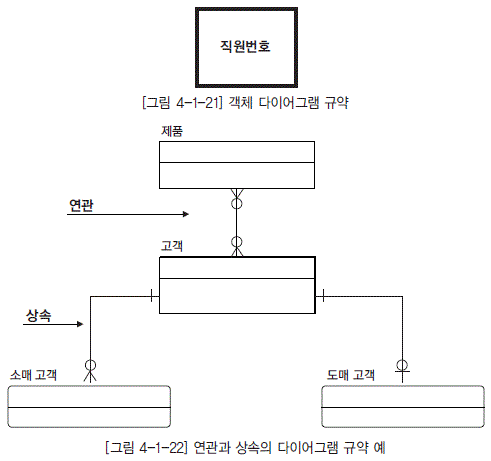

  * [그림 4-1-22] 연관과 상속의 다이어그램 규약 예">

속성이 적거나 별도 문서에 있다면 속성은 [그림 4-1-23]과 같이 객체 상자 안에 기입될 수도 있다. 객체 안의 속성이 속성 자신의 구조를 가질 수 있다면 그 객체는 자기 자신의 논리적 데이터 모델을 가질 수 있다. [그림 4-1-24] 참조

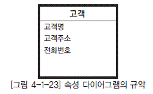

  * [그림 4-1-23] 속성 다이어그램의 규약">

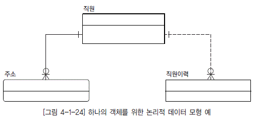

  * [그림 4-1-24] 하나의 객체를 위한 논리적 데이터 모형 예">

대부분의 객체 메소드는 메소드를 기술하는 서술(Narrative)에 의해서 표현될 수 있다. 그러나 메소드가 복잡하다면, 데이터 흐름 다이어그램(DFD, Data Flow Diagram)과 같은 다양한 프로세스 모델링 기법 중의 하나가 사용될 수 있다. [그림 4-1-25] 참조

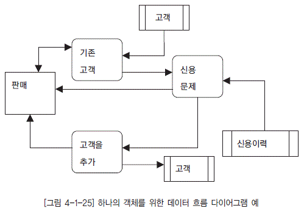

  * [그림 4-1-25] 하나의 객체를 위한 데이터 흐름 다이어그램 예">

메시지는 메시지 이동의 방향을 나타내는 화살표와 점선에 의해 객체 모형에 표현된다. [그림 4-1-26] 참조

  * [그림 4-1-26] 메시지 다이어그램의 규약">

### 차. 객체 모형

객체 모형을 생성시키기 위해서 아래와 같은 방법을 취한다.

1) 주제에 연관된 기본(Basic) 객체를 식별한다. 그 결과는 엔터티 목록과 같은 것이다.

2) 객체 간의 연관(Association)을 식별한다.

3) 많이 알려져 있는 객체 모델링의 규약을 이용해서 객체의 다이어그램을 그린다.

4) 객체 간의 메시지는 다이어그램에 추가될 수 있다.

?

객체 모형이 완료되었을 때, 각 객체 내부에 대해서 표시하면 된다. 즉, 객체의 속성과 메소드가 문서화될 필요가 있다.

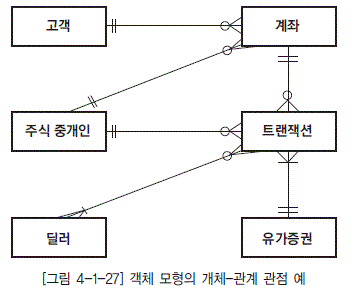

  * [그림 4-1-27] 객체 모형의 개체-관계 관점 예">

### 카. 객체 모형 데이터

객체 내의 데이터를 문서화하는 것은 상대적으로 간단하다. 그 이유는 객체 내에서 발견된 속성들 은 그 객체의 성질이거나 메시지 안에 전달된 다른 객체의 성질이기 때문이다. 예를 들어 [그림 5- 1-28]에서 메시지 부분으로서의 트랜잭션 객체는 트랜잭션 번호를 주식 중개인 객체에 전달한다. 두 객체의 메시지가 트랜잭션 번호를 사용한다고 할지라도 트랜잭션 번호는 트랙잭션의 성질이지 주식 중개인의 성질은 아니다. 트랜잭션 번호는 트랜잭션 객체 안에 정의되어 있다. 그래서 주식 중개인 객체 안에서 재정의될 필요는 없다. 오직 데이터만이 한번 문서화할 필요가 있다. 그래서 다른 객체 들에 속하는 데이터는 소유 객체 안에만 문서화 된다.

대부분의 경우에서 한 객체 안의 데이터는 구조를 가지지 않는다. 구조상 데이터가 개체-관계 다 이어그램에 있다면, 다양한 엔터티 내에 있을 수 있다는 것을 뜻한다. 즉 데이터 구조가 없는 객체는 모든 객체의 속성들이 개체-관계 다이어그램에서 하나의 엔터티 내에 있다는 것을 의미한다. 데이터 구조가 없을 때 객체의 데이터를 문서화하는 것은 객체의 정의와 도메인을 구체화시키는 것으로 제 한된다. 그러나 객체의 데이터가 구조를 가진다면 그 구조는 개체-관계 다이어그램의 단편도 (Fragment Diagram) 안에 모형화되어야 한다.

예를 들어 계좌 객체의 데이터가 정적인(Static) 계좌 정보뿐만 아니라 다양한 활동 항목(Activity Items)을 포함하고 있다면 분석가는 개체-관계 다이어그램 단편도에 계좌와 계좌 활동 간의 일대다 관계를 표현할 것이다. [그림 5-1-28] 참조

  * [그림 4-1-28] 객체 개체-관계 단편도">

### 타. 객체 모형의 메소드

객체 메소드가 복잡하지 않다면 메소드는 간단한 설명부(Narrative) 또는 구조화된 기법으로 가장 잘 문서화된다. 복잡한 메소드는 좀 더 정교한 문서화 접근 방식이 필요하다. 이벤트 지향적인 프로세스는 상태 전이 모델링(State Transition Modeling)과 같은 동적(Dynamic) 프로세스 모델링 기법이 필요하다. 반면에 정적인 프로세스는 데이터 흐름 다이어그램이나 기능 분해(Functional Decomposition)와 같은 기법을 사용한다. 계좌 객체의 계좌 갱신 메소드는 데이터 흐름 도표에 의해서 문서화된다. [그림 4-1-29] 참조

다이어그램에서 어떻게 트랜잭션 객체가 외부 엔터티로 표현되었는지, 또한 계좌 갱신 메시지가 계좌 객체에 대한 데이터 흐름이라는 점을 유의해야 한다.

다이어그램에서 어떻게 트랜잭션 객체가 외부 엔터티로 표현되었는지, 또한 계좌 갱신 메시지가 계좌한다.

  * [그림 4-1-29] 객체 데이터 흐름 다이어그램 예">

### 파. 불명료한 객체 접근 방식

객체 접근 방식에는 두 가지 주의 사항이 있다. 첫번째는 객체지향 개발의 가장 단순화된 표현이다. 이것은 객체지향 개발을 분명하게 이해하는데 필요한 많은 객체지향 특징을 무시하는 것이다. 불행히도 그러한 특징을 탐색하는 것은 설명하기가 매우 어렵다. 두번째는 객체지향 모델링의 미성숙이다. 객체가 어떻게 표현되고 기호가 어떻게 사용되어야 하는가 등의 정의는 아직까지 초기단계이 다. 현재 접근 방식은 크게 변화하고 있고 많은 개발자들이 표준안을 원한다고 할지라도 이러한 상황은 당분간 계속될 것이다.

### 하. 객체지향 모델링과 논리 데이터 모델링간의 관계

객체지향 모델링과 논리 데이터 모델링은 공통점이 많다. 객체지향 모델링 개념은 논리 데이터 모델 링의 개념과 매우 유사하다. 그러나 많은 유사점에도 불구하고 차이점 또한 존재한다. 객체지향 모델링 에서만 유일한 것은 데이터와 프로세스를 같은 엔터티로 결합시킨 것이다.

[표 4-1-2] 객체지향 모델링과 논리 데이터 모델링 간의 비교

| 객체지향 모델링 | 논리 데이터 모델링 | 차이점 |
|----|
 | 객체 | 엔터티|객체는 프로세스를 포함한다. |

 | 속성 | 속성 | - |

 | 연결

(Link) | 관계

(Relationships)|유사하다.

  *  연관은 동일하다.

  *  상속은 데이터 모델링이 메소드를 포함하지 않는다는 것만 제외한다면 서브타입/슈퍼타입과 동일하다. |

 | 캡슐화 | -|대응하는 논리적 데이터 모델링의 개념은 없다. |

 | 객체 클래스 | 엔터티 유형|없음 |

 | 객체 인스턴스 | 엔터티 인스턴스|없음 |

 | 메시지 | -|메시지는 프로세스와 연관되어 있기 때문에 대응하는 개념은 없다. |

논리적 기초가 잘 갖춰진 데이터 모델러는 일반 프로세스 모델러보다 객체지향 모델링 개념을 더 쉽게 소화한다. 많은 객체지향 접근 방식은 논리적 데이터 모델링 접근 방식과 유사하다. 그래서 객체지향 모델링을 논리적 데이터 모델링의 연장으로 간주하기도 한다. 다른 주요 유사성은 두 가지 접근 방식이 다음의 어려움을 공유한다는 것이다. 많은 분석가는 데이터가 프로세스에 종속하지 않는 방식으로 데이터와 프로세스의 개념을 결합한다. 이것은 객체지향 모델링에 기반한 애플리케이션을 개발하는 사람들이 논리적 데이터 모델링의 개념도 잘 이해하고 있기 때문이다. 또한 좋은 접근 방식들은 서로 결합하기 때문이다.

### undefined. 객체지향 모델링 장점

객체지향 모델링의 장점은 재사용 코드와 같은 개념이 실제로 가능한 환경을 제공한다는 것이다. 이것은 또 다른 문제를 해결해 준다. 데이터나 프로세스 중 어느 것도 조직의 모든 규칙을 표현할 수는 없다. 일부 규칙은 프로세스 모형에서 표현될 수 있고 일부는 데이터 모형에서 표현된다. 그러나 객체지향 모델링은 모든 비즈니스 규칙이 표현될 수 있는 유일한 환경을 제공한다. 객체지향 모델링은 또한 프로세스와 데이터 모델링을 함께 운영한다. 데이터와 프로세스가 객체의 성질인 반면 데이터와 프로세스 각각은 그들의 풍부함(Richness)을 달성하는 다른 접근 방식을 필요로 한다는 사실이 위의 사항들을 확신하게 한다.

# 제3절 데이터 모델링 표기법 이해

## 1. 바커 표기법 (Baker Notation)

바커 표기법은 영국 컨설팅 회사 CACI에 의해 처음 개발되었고 리차드 바커(Richard Barker)에 의해 지속으로 업그레이드 되었다. 오라클에서 Case Method(Custom Development Method)로 채택하여 사용하고 있다.

### 가. 엔터티(Entity)

엔터티는 기업에서 지속적으로 저장하고 관리해야 할 대상이다. 하나의 관리 대상이 엔터티가 되기 위해서는 반드시 두개 이상의 속성을 가져야 한다. 속성이 없는 실체는 존재할 수 없다. 엔터티란 실제 세상에 있는 객체(Object)이다.

  * 엔터티는 네 부분의 모서리가 둥근 형태인 소프트-박스(Soft-box)로 표현한다.

  * 엔터티는 하나 이상의 속성으로 구성된다.

  * [그림 4-1-30] 바커 엔터티(Entity) 예">

### 나. 속성(Attribute)

속성은 하나의 엔터티에 종속되는 명사적 단어들을 말한다. 일반적으로 명사적 단어들 중에 구성 요소를 포함하고 있는 명사들은 엔터티가 되고 그렇지 못한 명사들은 속성이 된다. 속성의 상태에는 2가지 종류가 있다. 해당 속성에 어떤 값을 반드시 저장해야 하는 경우에는 * (Mandatory)를 표시하며 해당 속성에 어떤 값이 존재할 수도 있고 존재하지 않을 수도 있는 경우에는 o (Optional)를 표시하게 된다.

  * [그림 4-1-31] 바커 속성(Attribute) 예">

### 다. 관계(Relationship)

두 개의 엔터티간에 CONDITIONAL을 표기한 후 해당 엔터티의 가까운 위치에 관계 명칭을 표기하고 관계(Relationship)는 실세계의 해당 엔터티에서 발생하는 동사적 단어들을 표기한다.

  * [그림 4-1-32] Barker Conditional 작성 단계 예">

#### 1) 엔터티와 엔터티간의 관계

  *  *1:1 관계*

A 엔터티에 존재하는 데이터 1개와 관계되는 B 엔터티에 존재하는 데이터의 개수도 1개인 엔터티간의 관계를 1:1 관계라고 한다.

  *  *1:M 관계*

A 엔터티에 존재하는 데이터 1개와 관계되는 B 엔터티에 존재하는 데이터의 개수가 여러 개인 엔터티 간의 관계를 1:M의 관계라고 한다.

  *  *M:M 관계*

A 엔터티에 존재하는 데이터 1개와 관계되는 B 엔터티에 존재하는 데이터의 개수가 여러 개이며, B 엔터티에 존재한 데이터 1개와 관계되는 A 엔터티에 존재하는 데이터의 개수도 여러 개인 엔터티 간의 관계를 M:M 관계라고 말한다.

  #### 2) 엔터티와 엔터티간 상관 관계의 조건

  *  *필수 조건*

필수 사항은 실선으로 표시하고 상대 엔터티에 대해 해당 엔터티에 조건을 만족하는 엔터티가 반드시 존재할 경우에 표시한다.

  *  *선택 조건*

선택 사항은 점선으로 표시하고 상대 엔터티에 대해 해당 엔터티에 조건을 만족하는 엔터티가 존재할 수도, 존재하지 않을 수도, 있을 경우 표시한다.

  * [그림 4-1-33] 바커 관계 예">

### 라. 식별자(Unique Identifier)

식별자란 하나의 엔터티에 구성되어 있는 여러 개의 속성 중에 엔터티를 대표할 수 있는 속성을 의미하며 하나의 엔터티는 반드시 하나의 식별자가 존재해야 한다. 보통 식별자와 키(Key)를 동일시 생각하고 있는 경우가 있는데 식별자는 논리 데이터 모델링 단계에서 사용하고 키는 물리 데이터 모델링 단계에서 사용한다.

#### 1) 식별자의 유형

  *  *본질 식별자*

속성들 중에서 집합의 본질을 명확하게 설명할 수 있는 의미상의 주어를 본질 식별자라한다. 의미상의 주어에는 사원번호, 상품번호처럼 집합을 식별하기 위한 임의의 유일값을 사용하는 인조 식별자(Artificial Unique Identifier)도 있고, 내가 태어나기 위해서 절대적으로 존재했어야만 하는 본질 속성들에 해당하는 것으로 자신의 고유 속성과 부모로부터 물려받은 속성(릴레이션십)들로 이루어진 것도 있을 수 있다.

  *  *후보 식별자*

각 인스턴스를 유일하게 식별할 수 있는 속성 또는 속성들의 조합이며, 후보 식별자로 속성 집합을 선택하는 경우에는 개념적으로 유일해야 한다.

  *  *대체(보조) 식별자*

보조 식별자란 원래의 식별자를 대신할 수 있는 또 다른 속성들이나 릴레이션십을 말한다. 가령 사원 엔터티에 공식적으로 부여된 식별자(실질식별자)는 사원번호이지만, 만약 주민등록번호 속성이 유일한 값을 가지면서 필수적(mandatory)으로 정의되었다면 비록 공식적인 식별자는 아니지만 식별자로서의 역할을 할 자격은 충분히 갖추고 있다. 특히 보조 식별자는 여러 참조 엔터티 중에서 원래의 식별자보다 보조 식별자로 연결을 맺는 것이 자신에게는 훨씬 유리한 경우에 의미가 있게 된다.

  *  *인조 식별자*

인조 식별자란 식별자 확정시 기존의 본질 식별자를 그대로 실질 식별자로 인정할 수 없는 여러 가지 상황이 발생했을 때, 전부 혹은 일부를 임의의 값을 가진 속성들로 대체하여 새롭게 구성한 식별자를 말한다. 가령, 사원 엔터티에 이미 존재하고 있는 속성 중에서 원래의 본질 식별자를 찾으라고 한다면 주민등록번호가 될 것이다. 그러나 이 속성은 너무 길고 관리상 여러 가지 문제점이 발생하기 때문에 새롭게 사원번호라는 임의의 값을 가진 인조 속성을 영입하여 공식적인 식별자 자리까지 부여받은 것이다.

  *  *실질 식별자*

인스턴스를 식별하기 위해 공식적으로 부여된 식별자를 말한다. 본질 식별자나 인조 식별자 모두가 실질 식별자가 될 수 있다.

  #### 2) 작성 방법

식별자 앞에는 # 기호를 표시하고 여러 개# 기호를 반복적으로 표시한다.

  * [그림 4-1-34] 바커 식별자(Unique identifier) 예">

### 마. 서브타입(Sub-type)

바커 표기법에서는 슈퍼타입(super-type) 안에 서브타입(sub-type)을 상자로 나타낸다. 이것은 다이어그램에서 공간을 적게 사용하는 장점을 가지고 있다. 서브타입은 서브타입의 중복을 허락하지 않는 상호 배타적 관계이다.

  * [그림 4-1-35] 바커 서브타입 예">

### 바. 관계의 표현 비교

다음은 바커 표기법과 I/E 표기법의 가장 큰 차이점인 관계의 표현 비교를 설명하겠다. [그림 4-1-36]은 사원과 부서 엔터티 간의 관계를 표현한 모습이다. 릴레이션이란 양방향 관계를 합성한 것이라 할 수 있다. 각 관계를 설명하자면 사원을 주어로 부서를 보는 관계에서 의미는“각각의 사원은 단 하나의 부서를 반드시 가져야 한다”라고 정의할 수 있다. 또한 부서를 주어로 사원을 보는 관계의 정의는 “각각의 부서는 하나 이상의 사원을 현 주소속 부서로서 배치 받을 수도 있다”라는 의미를 표현한 것이 바로 관계선이다. 이때 관계선을 살펴보면 실선과 점선으로 구분할 수 있다. 실선은 필수를 뜻하고 점선은 필수가 아님을 뜻한다. 현재 [그림 4-1-36]의 사원 엔터티가 주어일 경우 사원 엔터티 쪽에 가까이 있는 실선이 바로 사원이 주어일 때 부서를 바라보는 관계를 설명한 것이다. 때문에 까마귀 발 모양은 이미 설명한 것처럼 하나 이상의 개체를 허용한다는 뜻이다. 이런 표시를 근거로 “각각의 사원은 단 하나의 부서를 반드시 가져야 한다”와 같이 정의할 수 있다.

  * [그림 4-1-36] 바커 표기법의 관계의 표현 예">

## 2. I/E 표기법 (Information Engineering Notation)

Information Engineering(I/E)은 1981년에 Clive Finkelstein과 James Martin이 공동 저술로 발표하였으며, 80년대 중반에 James Martin에 의해 그 체계가 정리되면서 본격적으로 활용이 되었고, 정보시스템을 구축하는데 있어서 데이터 분석(Data Analysis)과 데이터베이스 설계(Database Design)를 위한 매우 유용한 기법으로 자리 잡게 되었다.

이 모델은 관계의 다(Many) 쪽을 나타내기 위해 까마귀 발을 사용하기 때문에 때때로 까마귀 발모델(Crow’s Foot Model)이라 부른다.

### 가. 엔터티(Entity)

엔터티란 사용자가 추적하고자 하는 어떤 사물이다.

  * [그림 4-1-37] I/E 엔터티(Entity) 예">

### 나. 속성(Attribute)

엔터티는 엔터티의 특징을 기술해 주는 여러 개의 속성을 가진다. 속성은 [그림 4-1-38]과 같이 엔터티 안에 위치한다.

  * [그림 4-1-38] I/E 속성(Attribute)의 예">

### 다. 관계(Relationship)

까마귀 발 부호는 관계의 다(Many) 쪽을 보여주는 데 사용되고, 타원(Oval), 해쉬 마크 및 까마귀발의 다양한 조합들은 [표 4-1-3]과 같이 사용된다.

  * [표 4-1-3] I/E 관계(Relationship) 예">

### 라. 식별자(Unique Identifier)

엔터티는 그들을 지칭하거나 식별해 주는 속성인 식별자를 가지고 있다. 속성의 식별자는 엔터티의 상단에 나타나며, [그림 4-1-39]와 같이 수평선이 식별자 밑에 그려진다.

  * [그림 4-1-39] I/E 식별자(Unique Identifier) 예">

### 마. 서브타입(Sub-type)

서브타입은 배타적 또는 포괄적일 수 있다. 만일 배타적이라면 슈퍼타입은 많아야 1개의 서브타입과 관련될 수 있다. 만일 포괄적이라면 슈퍼타입은 1개 또는 그 이상의 서브타입과 관련될 수 있다. [그림 4-1-40]에서 A는 슈퍼타입, B와 C는 배타적 서브타입이다. 구분자는 보이지 않고 있다. 관계는 실선으로 그려져 있다. [그림 4-1-41]에서 A는 슈퍼타입, B와 C는 포괄적 서브타입이다. 관계는 실선으로 그려져 있다.

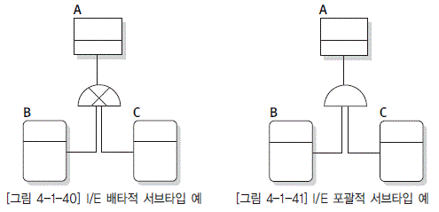

  * [그림 4-1-40] I/E 배타적 서브타입 예와 [그림 4-1-41] I/E 포괄적 서브타입 예">

# 제2장 개념 데이터 모델링

# 제1절 개념 데이터 모델링 이해

## 1. 개념 데이터 모델 정의

개념적 데이터 모델이란 건물로 말하면 철제빔으로 건물의 골격을 세워 놓은 형태와 유사하다. 건 물의 골격이 주요 골조 자재로 구성되어 있듯이 개념 데이터 모델도 주요 핵심 엔터티들로 구성된다. 핵심 엔터티란 행위의 주체나 목적물이 되는 개체 집합에 해당하는 엔터티를 의미한다. 이들은 부모가 존재하지 않는 창조된 집합이어서 다른 집합의 존재 유무에 상관없이 독립적으로 탄생할 수 있다. 핵심 엔터티는 대체적으로 여러 가지 하위의 행위 엔터티를 탄생시킨다.

## 2. 개념 데이터 모델 의의

개념 데이터 모델은 단지 대상을 주요 핵심 엔터티로 한정한다는 것일 뿐이지 모델링 기법은 논리적 모델링과 특별히 다를 것이 없다. 만약 우리가 하향식으로 데이터아키텍처를 수립해 간다면 개념적 모델은 개괄적 모델을 좀더 상세화된 형태로 진화시키거나 중요 엔터티만 선정하여 모델링을 함으로써 탄생된다. 물론 이후에도 모델링의 상세화는 계속되어 갈 것이며, 필연적으로 개념적 모델도 따라서 약간씩 변화가 일어날 수 밖에 없다. 하지만, 개념 데이터 모델은 앞으로 아무리 상세한 모델링이 진행되더라도 전체적인 골격은 개념적 모델을 벗어나지 않는다는 것이다.

## 3. 데이터아키텍처 프레임워크 상에서 개념 데이터 모델

전사아키텍처에서 개념 레이어는 최상위의 개괄 레이어와 하위의 논리 레이어 중간에 존재하는 레이어이다. 데이터아키텍처에서는 개괄 데이터 모델과 논리 데이터 모델 사이에 존재하는 모델이라고 할 수 있다. 여기에서 개괄 데이터 모델은 흔히 사용되어지는 주제 영역 관계도와도 대응되는 부분이라고 할 수 있다. 개념 데이터 모델은 상위의 주제 영역별로 핵심 엔터티와 핵심 속성, 또한 핵심 엔터티들 사이의 관계들로 이루어진 데이터 모델이라고 할 수 있다. 아키텍처의 개념을 종종 건축물에 비유하곤 한다. 개념 데이터 모델을 건축물에 비유해 보면 건물의 기둥들과 중요 벽체들로만 만들어진 건물 설계 도면에 비유할 수 있다. 이 단계에서 정의된 핵심 엔터티들과 관계들을 기반으로 논리 데이터 모델에서는 업무 요구 사항에 기반을 둔 상세 데이터 모델이 생성된다.

# 제2절 주제 영역 정의

## 1. 주제 영역 개념

주제 영역(Subject Area)은 기업이 사용하는 데이터의 최상위 집합이다. 예를 들어, 제조 업체의 경우 인사, 생산, 자재, 판매 등의 주제 영역이 있을 수 있다. 하나의 주제 영역으로 정의되는 데이터간의 관계는 밀접하고, 다른 주제 영역에 포함되는 데이터 간의 상호작용은 최소화할 수 있도록 정의한다. 데이터는 기본적으로 관계 구조로 표현된다. 관계 구조는 데이터 간의 관계가 복수 개로 표현되면서 서로 연결되어 있기 때문에 하향식(Top-down) 분석이 용이하지 않다. 계획 수립 단계는 하향식 분석을 원칙으로 하고, 검증을 위해서 부분적으로 상향식 분석을 사용한다. 데이터를 하향식으로 분석하기 위한 개념으로 유용한 것이 주제 영역이다. 주제 영역은 계층적으로 표현될 수 있다. 주제 영역을 분해하면 하위 수준의 주제 영역이나 엔터티가 나타난다.

특히 현행 시스템을 개선하거나 현행 시스템에 대한 데이터 관리 체제를 생성하고 체계화하고자 할 경우에는 상향식 분석을 수행한다. 이 경우에는 현재 운용하고 있는 시스템에서 사용하고 있는 데이터에 대해 상위 수준에서 파악하기 위해 전사적인 관점에서의 데이터 분류를 수행하고, 이의 결과를 주제 영역(Subject Area)이라는 이름으로 관리하게 된다. 이렇게 분류된 결과는 보통 업무에서 관리하고자 하는 데이터 집합들의 그룹으로, 친밀도가 높아 동질성이 있는 데이터들로 이루어지는 것이 보통이다. 각 데이터 분류들은 일반적으로 관련된 업무 기능이 존재한다.

## 2. 주제 영역 분류 원칙 및 기준

### 가. 주제 영역 분류 원칙

#### 1) 데이터 중복 최소화

동일한 기능을 하는 자원(지역 및 정보)이 중복 정의되어 낭비되지 않도록 체계적인 분류 작업이 필요하다.

#### 2) 데이터 확장성 보장

가까운 미래의 추가되어지는 정보에 대해 최대한의 확장성을 고려하여 분류 체계가 설계되어야 한다.

#### 3) 데이터 관련성 및 편의성 확보

  * 타 자원(정보 및 지역)과의 인접성을 고려해 설계한다.

  * 고객 편의(정보 요건)를 고려한 자원 내의 핵심적인 데이터 집합에 대한 것을 명시한다.

  * 핵심 관계에 대한 것도 명시한다.

  * 필요에 따라서는 표준화된 타 영역의 설계(참조 모델)도 참조하여 데이터 분류를 생성한다.

### 나. 주제 영역 분류 기준

#### 1) 데이터 관점의 분류

  * 기존의 분류 방침이 데이터와 업무 영역의 개념이 혼재되어 있었으나 본 주제 영역 분류에서는 업무를 발생시키는 주체, 대상 및 행위 등 데이터 관점에서 데이터를 생성시키고 사용하는 유형에 근거하여 분류를 수행한다.

  * 데이터와 시스템/애플리케이션 간의 독립성이 계속 증가되는 추세하에서는 더욱더 장기적이고 전사적인 관점에서 데이터 유사성을 고려하여야 한다.

  * 시스템이나 애플리케이션이 다르더라도 동일한 유형의 데이터를 유사한 방식으로 활용한다면 이를 동일한 영역으로 분류하여 통합된 관점에서 데이터를 관리하여야 한다.

#### 2) 업무 요건 추가에 대한 유연성 보장

  * 업무 요건의 변경이나 추가 시 유연성을 보장할 수 있도록 전사 분류 체계를 설정한다.

  * 업무 요건 변경에 대해서 데이터 구조의 변경을 최소화하려면 동일한 유형의 데이터를 본질이 희석되지 않는 한도 내에서 최대한 집합으로 통합해야 한다. 이렇게 함으로써 모델의 유연성과 확장성, 융통성이 보장되어 신규, 추가 요건에 대해 기존의 분류 구조에 적절하게 수용될 수 있다.

  * 만일 새로운 영역이 필요한 상황이 발생한다면 전사적인 협의를 통하여 적절한 계층의 분류 구조를 조정한다.

#### 3) 주제 영역 간 균형 유지

  * 데이터 분류는 일부분에 국한된 것이 아니고 전체적인 균형을 유지하는 것이 중요하다.

  * 특정 부분을 너무 상세하게 분류하거나, 분류 방식이 타 영역과 다른 방식으로 되어 있으면 전체적인 혼란을 야기할 수 있다.

  * 데이터 분류에 대한 추가나 변경이 발생할 경우 해당 부문만을 고려하여 수행하기보다는 타 영역의 분류 체계와의 형평성 및 균형을 고려하여 분류 구조를 관리한다.다.

### 다. 주제 영역 명명

1) 실 업무에서 보편적으로 사용하는 업무 용어를 부여하는 것이 바람직하다.

예) 인사, 생산, 판매, 구매, 재무 등

2) 유일한 단수형 명사를 사용한다.

3) 데이터의 그룹을 의미하는 이름을 부여한다.

  *  업무 활동(Activity)을 의미하는 이름을 배제하고 데이터 그룹을 의미하는 이름을 사용하도록 한다.

### 라. 주제 영역 정의 절차

  * [그림 4-2-1] 주제 영역 정의 절차">

### 마. 주제영역 분류 방법

  * 1차 분류 : 주요 데이터 집합의 유형 정의

  * 기존의 시스템별로 제공되는 데이터의 성격 및 특성을 고려하여 영역을 분류한다.

  * 업무의 변화에 민감하지 않도록 정의한다.

  * 분류 예시(아래 예시들을 복합적으로 적용하는 것도 가능)

  *  데이터를 발생시키는 주체로서의 분류 → 관계자, 상품/서비스, 자산, 채널 등

  *  데이터를 발생시키는 주체 간의 상호 작용으로 발생하는 대상으로서의 분류 → 계약, 리스크, 상품, 조건

  *  공통 및 관리 성격의 상위 개념으로서의 분류 → 경영 관리(정보, 방침, 지원 등)

  * 2차 분류 : Biz 활동에 필요한 데이터 분류

  * Biz 활동에 필요한 분석 주제와 현황 등의 영역으로 분류한다.

  * 기본(정보), 상세(정보), 관계(정보) 등과 같은 데이터의 기능적 구성 관점에서 접근하여 1차 분류 를 세분화한다.

  * 업무 변화 수용의 융통성을 반영하여 정의한다.

  * 분류 예시

  *  관계자 : 관계자 기본, 관계자 상세, 관계자 관계, 관계자 분류 등

  * 3차 분류 : 2차 영역의 세부 주제 영역 분류

  * Biz 활동에 필요한 분석 주제와 현황 등의 영역으로 분류한다.

  * 사용자에게 제공되는 실제 데이터로서의 관점에 근거하여 정의한다.

  * 업무적인 관점에서 분류한다.

  * 분류 예시

  *  관계자(기본) : 고객, 법인, 조직, 직원 등

  *  계약(기본) : 수신계약, 예금계약, 신탁계약 등

  #### 4) 데이터의 그룹을 의미하는 이름을 부여한다.

업무 활동(Activity)을 의미하는 이름을 배제하고 데이터 그룹을 의미하는 이름을 사용하도록 한다.

## 3. 주제 영역 활용

### 가. 목적

  * 데이터의 계층적 구조를 파악하는 데 도움이 된다.

  * 업무 기능(Function)과 병행하여 분석하는 경우에 분석의 최상위 단위 역할을 하여 품질 확보에 기여한다.

  * 주제 영역 계층과 업무 기능 계층 간의 대응 관계를 확인한다.

  * 주제 영역은 기업의 전사 업무를 위한 전체 데이터 구성에 대한 청사진을 제공한다.

  * 데이터 구성 및 통합에 대한 방향 제시(선언적 성격)

  * 효율적 데이터 관리를 위한 기준을 제공한다.

### 나. 장점

  * 데이터 및 업무 활동 모델의 품질 보증(Quality Assurance)

  * 프로젝트 관리(Project Management) 용이

  * 모델 개발 조정(Development Coordination) 용이

  * 리포지터리(Repository) 관리 용이

  * 상세 사항의 전개 혹은 축약 가능

## 4. 주제 영역 도출

### 가. 업무에서 사용하는 데이터의 명사형 도출

  * 정보 수집 소스로부터 명사형 찾기

### 나. 업무 기능의 이름으로부터 도출

  * 데이터와 업무 활동의 상호 보완 관계

### 다. 하향식(Top-down) 접근 방법

  * 주제 영역에서 출발하여 엔터티 타입으로 전개

### 라. 상향식(Bottom-up) 접근 방법

  * 엔터티 타입을 그룹핑하여 주제 영역 도출

### 마. 분석 단계에서의 도출

  * 아키텍처 모델(Architecture Model)을 정련하는 과정에서 도출

  * 데이터 모델을 상세화하는 과정에서 도출

## 5. 주제 영역 정의 내용

### 가. 주제 영역 목록

  * 레벨 : 주제 영역의 계층 수준(1차, 2차, ... 단위)

  * 주제 영역명

  * 설명(단위 주제 영역의 경우)

  * 대표 엔터티 : 해당 주제 영역 내에서 대표적인 엔터티를 기술한다.

### 나. 주제 영역 정의서 샘플 양식

  * [그림 4-2-2] 주제 영역 정의서 예">

# 제3절 후보 엔터티 설정

## 1. 개념

엔터티를 선정하기 위해서 우리가 가장 먼저 해야 할 일은 엔터티 후보를 수집하는 것이다. 이 단계는 말 그대로 후보를 찾아내는 것이지 엔터티를 확정하는 것이 아니므로 후보의 자격 여부만 가려내는 선에서 수사를 멈출 수 있어야 한다. 엔터티 후보를 수집할 때는 다양한 경로를 통해 수집하는 것이 바람직하며, 후보인지를 검증하는 객관적인 기준을 적용하여 후보라는 것을 판명하는 엔터티 후보 판정 단계를 거치게 된다. 이들은 엔터티 후보 분류 단계에서 3가지 형태로 분류된다.

## 2. 엔터티 후보 수집

엔터티 후보를 수집할 수 있는 방법은, 기존 시스템이 있었다면 시스템 도큐먼트(Document)가 있고, 현업에서 사용하는 각종 장표들도 있다. 또한 현업 사용자와의 인터뷰를 통해 후보를 찾을 수도 있고, 관련 서적을 통해서도 가능하다. 만약 프로세스 모델링을 먼저 수행하여 자료 흐름도가 나와 있다면 그 속에 있는 데이터 스토어 또한 훌륭한 엔터티 후보가 될 수 있다. 뿐만 아니라 타사 혹은 유사 시스템의 자료를 확보하고 있다면 거기에서도 많은 후보가 나타날 것이다. 현업 담당자들이 기안한 각종 보고 자료, 또는 현장에 가서 직접 업무를 조사해 보는 방법도 있다.

  * 기존 시스템 도큐먼트

시스템 도큐먼트에는 데이터 구조 및 프로세스 명세들이 나타나 있는 설계 자료에서부터 사용자를 위한 지침서에 이르기까지 다양한 도큐먼트가 있다. 이 자료를 가지고 있다면 엔터티 후보를 도출하는데 가장 유용하게 사용할 수 있다.

  * 현업 장표/보고서

실제 업무를 하는 조직에서는 대체적으로 정보시스템과 관련되지 않았더라도 오래 전부터 그들이 수행하는 업무의 효과적인 처리를 위하여 많은 장표를 가지고 있다. 또한 처리된 업무의 집계·분석·관리를 위해서 많은 종류의 보고서를 가지고 있다. 이러한 장표나 보고서에서 진짜 엔터티를 찾으려면 이 자료를 만들기 위해서 어떤 본질적인 집합이 필요한지를 분석해 보아야 한다. 좀 더 자세히 말하면 자료에 기술된 항목들을 속성이라 가정하고 이 속성들의 주인이 될 본질적인 집합이 무엇이 될지를 검토해 보라는 것이다. 여기서 말하는 본질 집합은 가공된 결과가 아닌 원재료(Source)가 되는 정보를 말한다.

  * 현업 인터뷰(Interview)

엔터티 후보를 도출할 때부터 현업 담당자들과 같이 시작하는 것이 최상의 모델링 방법이다. 사전에 충분한 분석을 통해 짧은 시간에 많은 것을 확인할 수 있도록 질문을 준비해야 한다.

  * 관련 전문 서적

현재의 업무를 있는 그대로의 모습으로 형상화하는 것이 아니라 좀 더 개선되고 발전된 모습으로 재창조하는 것이다. 이를 위해서 얻을 수 있는 정보는 현업만으로는 분명히 한계가 있다. 관련 전문 서적을 통하여 현실에 적용하기 위해 고민하고 있는 문제를 해결하는 데 필요한 아이디어나 힌트를 얻을 수만 있어도 충분히 목적을 달성한 것이다. 이러한 시각에서 전문 서적을 참고하면 생각보다 얻을 것이 많다.

  * 데이터 흐름도 (DFD, Data Flow Diagram)

업무 파악 및 시스템 분석을 위해 기능 설계를 데이터 흐름도로 작성했다면, 여기에 있는 데이터 저장소(Data Store)와 데이터 사전(Data Dictionary)에 있는 정보를 이용하여 엔터티 후보를 도출할 수 있다. 데이터 흐름도를 작성할 때 생성되는 데이터 저장소는 비록 테이블처럼 표현되지만 사실은 특정 데이터를 저장해야 한다는 데이터의 추상화된 집합이지 엔터티가 되는 것은 아니다. 예를 들어, 자재 구매 기능에서 자재 정보 자료 저장소로 정보가 저장되고 여기에는 자재 코드+자재명+규격+구매 수량+... 등의 자료 사전이 생성되지만 실제 모델링을 해보면 자재, 자재 유형, 단가정보 등의 많은 엔터티가 나타나게 된다.

  * 타 시스템 자료

타 시스템이 가지고 있는 엔터티를 면밀히 조사하고 이것들이 우리가 가져가야 할 집합과 어떻게 다른지를 밝히고 앞으로는 어떻게 정의해야 할 것인지를 조사한다. 엔터티 후보를 손쉽게 찾을 수 있는 또 하나의 방법은 관계사나 유사 업종의 시스템 도큐먼트를 입수해서 참조하는 것이다.

  * 현장 조사

본격적인 모델링을 하기 전에 현장을 답사하는 것이 좋다. 그렇게 해야 모델러와 개발 종사자들 간에 공통적인 의사소통 수단(Communication Protocol)이 좀 더 쉽게 만들어진다. 그렇지 못하면 설계 시에는 서로를 충분히 이해한 것 같은데, 나중에 가서 보면 무엇인가 앞뒤가 맞지 않는 일이 자주 발생한다. 이것은 결국 동일한 사실에 대해서 서로가 동상이몽을 하고 있었다는 것을 의미한다.

## 3. 엔터티 후보 식별

다양한 경로를 통해 엔터티 후보를 수집하는 과정에서 가장 중요한 것은 엔터티 후보를 어떻게 식별할 것인가에 대한 문제이다. 이러한 판단을 위해서는 무엇보다도 누구나 인정할 수 있는 구체적이고 객관적인 잣대가 있어야 한다. 엔터티 후보의 식별은 다음의 세 가지 단계에 대한 검증을 통해 객관화할 수 있다.

  * 후보 엔터티의 개념 정립을 명확히 한다.

  * 우리가 관리하고자 하는 것인지를 따져 본다.

  * 가로와 세로를 가진 면적(집합)인지를 확인한다.

### 가. 엔터티 후보의 개념 정립

엔터티 후보로 검토해 볼 대상의 최초 상태는 한낱 단어에 불과하다. 단어란 단지 사전적 의미에 지나지 않으므로 우리는 이 단어가 의미하는 진정한 집합이 무엇인지를 정의해야 한다. 예를 들어 사원이란 단어의 사전적 의미는 회사에 근무하는 사람 혹은 사단법인을 구성하는 사람이라고 되어 있다. 그러나 우리가 검토할 사원은 우리 회사에 근무하거나 촉탁(임시) 사원, 관계사, 협력사 등에서 지원받은 사원들을 포함한 집합이 될 수도 있다. 우리는 반드시 이와 같은 구체적 집합을 정의한 다음에야 비로소 다음 단계에 대한 검토를 진행할 수 있다. 그것은 애매모호한 대상을 놓고 구체적인판단을 하고자 노력하는 것은 도로(徒勞)에 지나지 않기 때문이다.

### 나. 관리 대상 판정

엔터티 후보로 선정하기 위해 개념을 정립해 둔 단어에 대해 우리가 검토해야 할 첫 번째 작업은 과연 이것이 우리가 관리하고자 하는 대상이 맞는지를 확인하는 일이다. 이 말은 앞으로 우리가 모델링을 하면서 던지는 모든 질문에 반드시 기본적으로 포함되어야 하는 주어부(主語部)에 해당하는 구문이다. 이 문장이 있음으로 인해서 모델링을 할 대상 업무에 따라 모델링의 결과가 달라지는 원인이된다.

  * 사람이라는 논리적인 집합은 구멍가게 업무를 모델링을 하느냐 혹은 행정 전산망에 대한 모델링을 하느냐에 따라 관리하고자 하는 집합이 달라지므로 데이터 모델의 모습도 달라질 수 있다.

  * 현재 관리하고 있느냐 뿐만 아니라 앞으로는 관리해야 하지 않느냐를 모두 포함하고 있다. 사실 현재 관리되고 있다는 것을 확인하는 것도 쉽지 않겠지만, 앞으로 관리할 것인지를 결정하는 것은 매우 전략적인 판단이 필요하다.

### 다. 집합 여부 확인

엔터티는 집합이어야 하지만 모든 집합이 모두 엔터티가 되는 것은 아니다. 여기서는 엔터티를 결정하는 것이 아니라 엔터티 후보를 선정하려는 것이므로 검토하고자 하는 대상이 집합이 되는지 여부만 확인한다.

  * [그림 4-2-3] 집합 여부 확인 예">

집합이란 다른 측면에서는 면적이라고 할 수도 있다. 면적이 되려면 가로 선분과 세로 선분이 있어야 한다. 선분이란 서로 다른 독립적인 두개 이상의 점(點)이 있어야 한다. 여기서 점이란 속성을 의미한다. 만약 우리가 검토할 대상이 하나의 점만 있다면 선분이 되지 못하므로 비록 세로가 선분이되더라도 수직선 밖에 될 수 없다. 마찬가지로 세로가 하나의 점이라면 최대 수평선 밖에 될 수 없기 때문에 이런 경우는 면적(집합)이 되지 못하므로 엔터티가 될 수 없다.

## 4. 엔터티 후보 선정시 유의사항

엔터티 후보의 선택은 데이터 모델링의 시작 부분이다. 엔터티 후보를 선정하는 동안에 아래와 같은 몇 가지의 유의사항을 염두에 두어야 한다.

  * 엔터티 가능성이 있다고 예상되면 일단 검토 대상에 올려라

엔터티 후보라고 해서 모두가 최종적으로 엔터티가 되는 것은 당연히 아니다. 그 대신 후보란 다른 후보들과 비교됨으로써 결정되는 것이므로 이런 후보들을 충분히 수집한 후 언젠가는 후보들을 하나씩 비교하면서 검토하게 된다. 버리게 되더라도 이 때 버리면 되므로 일단 모든 가능성 있는 대상을 최대한 수집한다는 생각을 가지고 접근하는 것이 좋다.

  * 너무 깊게 들어가지 마라

후보의 자격이 있다/없다 정도만 판단한다. 물론 필요에 따라 좀더 깊은 곳에 있는 내용을 통해 현재 결정하고자 하는 것에 대한 확신이 필요하다면 얼마간은 더 깊이 들어가 볼 수는 있다. 그러나 엔터티 후보를 선정하는 단계에서 절대로 너무 깊이 들어가서는 안 된다

  * 동의어처럼 보이더라도 함부로 버리지마라

특정 단어의 경우에는 의미를 일반적인 의미와는 다르게 사용하는 경우가 많다. 마치 새로운 언어가 생겨나는 것과 유사하게 누가 사용하기 시작했는지는 모르지만 언젠가부터 그렇게 알고 사용하기 시작하면서 의미가 그대로 굳어 버린다. 예를 들어 어떤 회사에는 상품과 제품이 있는데 일반적으로는 동일한 의미로 사용하지만 이 회사는 다른 의미로 사용하고 있었다. 이와 같이 동일한 의미로 여겨지지만 실제 정의된 집합은 같지 않을 수가 있고, 비슷하기는 하지만 정확하게 일치하지 않는 경우도 종종 발견된다. 그러므로 동의어처럼 보인다고 함부로 버릴 게 아니라 일단 후보로 도출하는 것이 중요하다. 데이터 모델링의 뒷부분에서 이러한 부분들을 가지고 다른 어떤 집합과 중복된 것인지, 완전히 포함되는 부분집합을 말하는 것인지, 아니면 일부가 서로 겹쳐져 있는 형태인지를 정확하게 규명하게 된다.

  * 개념이 모호한 대상은 일차로 그 개념을 상식화하여 이해하라

어려운 전문 용어나 특화된 업무에 대해서는 일반적이고 상식적인 예를 들어서 엔터티의 개념만을 파악한다. 이 단계에서 해당 업무 또는 데이터에 대해 정확한 개념을 파악하는 것은 무리가 따르기 마련이다.

  * 프로세스에 너무 연연해 하지마라

지금까지 우리는 모든 업무를 프로세스 중심으로 이해했기 때문에 프로세스 중심으로 설명을 듣지 않으면 이해하기가 매우 어렵다. 그러나 데이터 모델에는 프로세스가 없다. 흐름도 없고, 시간도 없다. 이것이 우리를 참으로 어렵게 만든다. 모델링을 하면서 자꾸 업무의 흐름에 집착하면 데이터흐름도처럼 데이터 모델이 업무를 따라 흘러가는 이상한 현상이 발생한다. 물론 데이터 모델링에서도 업무의 흐름을 완전히 배제하지는 않는다. 다만 그것은 현재 목적한 데이터 모델링의 어떤 결정을 좀더 완벽하게 하기 위해서 프로세스를 파악해 보는 것일 뿐이다.

  * 예외 경우에 너무 집착하지마라

예외 처리에 집착하지 말라는 뜻은 예외 처리가 중요하지 않다는 의미가 아니다. 지금 엔터티 후보를 수집하고 선정하는 단계에서는 가볍게 넘어가라는 것이다. 나중에 엔터티의 내부 구성 집합(Subtype)이나 릴레이션십을 정의하는 단계에서 이러한 예외 경우를 분석하여 설계에 반영하게된다.

  * 단어 하나하나에 집중해서 판단해라

누구나 알고 있는 것처럼 보이는 단어에 대해서도 좀더 깊이 구체적인 집합을 생각해야 한다. 예를들어 누구나 사원이 어떤 집합인지는 확실히 알고 있다고 생각한다. 그러나 좀더 깊이 들어가서 외부 용역사원이나 협력사 직원도 우리 사원 집합에 들어오는지를 물어보면 대답을 못한다. 왜냐하면 이렇게 구체적으로 사원이라는 집합에 대해서 정의한 적이 없기 때문이다. 매우 상식적이고 일반적인 용어로 정의된 엔터티 후보라도 사실은 매우 개략적이고 모호하게 정의되어 있는 경우가많다.

## 5. 수집된 엔터티 분류

개념 데이터 모델링에서는 일단 데이터 모델의 골격을 잡는 일부터 철저하게 수행해야 한다. 이렇게 하기 위해서는 엔터티 후보를 분류하는 작업부터 수행해야 한다. 분류 작업의 궁극적인 목적은 골격에 해당하는 엔터티만을 따로 분류해서 거기에 노력을 집중함으로써 나무만 보고 숲을 보지 못하는 오류를 범하지 않도록 하기 위한 것이다. 엔터티 후보를 분류하는 작업은 다음 두 단계에 걸쳐 진행된다. 첫 번째 단계는 우선적용 대상을 분류하는 것이고, 두 번째 단계는 첫 번째 단계에서 선별한 핵심 엔터티를 데이터 영역별로 분류하는 것이다.

### 가. 우선적용 대상 분류

엔터티 후보를 우선적용 대상별로 분류하는 목적은 모델링의 골격에 해당하는 주요 엔터티를 먼저 도출하여 이를 명확히 정의함으로써 모델링의 기초를 단단하게 하는 것이다. 이를 바탕으로 흔들림없이 상세한 모델링을 진행해 갈 수 있게 된다. 모델링을 순차적으로 접근해 가야 할 형태별로 분류한다면 크게 세 가지로 나눌 수 있다.

첫 번째는 사람, 상품, 자재 등과 같이 행위를 발생시키는 주체나 목적어가 되는 엔터티(여기서는 키 엔터티라 부르기로 한다)이다. 두 번째는 키 엔터티가 행위를 함으로써 발생되는 행위의 집합 중에서 좀더 하위의 행위를 발생시키는 주체나 목적어가 될 수 있는 엔터티(여기서는 메인 엔터티라 부르기로 한다)이다. 그리고 나머지 엔터티(여기서는 액션 엔터티라 부르기로 한다)를 세 번째로 분류한다.

#### 1) 키 엔터티(Key Entity)

자신의 부모를 가지지 않는 엔터티를 말한다. 여기서 부모 엔터티란 자신을 태어나게 한 - 만약 이 엔터티가 없다면 논리적으로 자신이 태어날 수 없는 - 엔터티를 말한다. 태초부터 창조된 집합이란 다른 엔터티의 도움을 받지 않더라도 얼마든지 어떤 개체를 새롭게 정의할 수 있는 집합을 말한다. 예를 들어, 사원 엔터티에 있는 홍길동이란 개체는 아직 부서가 정해지지 않았더라도 사원으로서 정의하는 데 문제가 없다. 물론 부서 엔터티와 관계를 정의할 때 반드시 부서를 갖도록 하는 규칙을 부여할 수도 있겠지만 그렇다고 해서 부서가 직접적으로 사원을 태어나게 한 부모인 것은 결코 아니다. 다시 말해 사원은 부서 없이도 태어날 수 있지만 부서가 결정되지 않으면 결코 탄생시키지 않겠다는 규칙을 부여할 수는 있다. 키 엔터티를 구별할 때 이러한 규칙과 부모의 차이를 혼동하는 경우가 자주 나타나고 있으므로 여기서 정확히 개념을 정립해야 한다. 키 엔터티의 예로는 다음과 같은 엔터티가 있을 수 있다.

  * 사원

  * 부서

  * 고객

  * 상품

  * 자재

#### 2)메인 엔터티(Main Entity)

키 엔터티를 제외한 다른 모든 엔터티는 부모 엔터티를 가지고 있어야만 태어날 수 있다. 이러한 엔터티는 업무의 크기에 따라 엔터티 간 계층의 깊이가 달라진다. 여기서 키 엔터티를 제외한 엔터티 중에서 업무의 중심에 해당하는 엔터티를 메인 엔터티라 정의하고, 나머지를 액션 엔터티로 정의한다. 이렇게 정의하는 것은 전체를 단계적으로 파악하고자 하는 의도가 있다. 메인 엔터티의 예로는 다음과 같은 엔터티가 있다.

  * 보험계약, 사고, 예금원장, 청구 …

  * 구매의뢰, 출하지시, 공사 …

  * 주문, 예산편성, 매출 …

#### 3)액션 엔터티(Action Entity)

매출, 출고, 입금과 같은 엔터티는 눈에 잘 보이지만 이들을 태어나게 한 고객, 공정, 창고 등은 엔터티로서는 눈에 잘 보이지 않는다. 키 엔터티에 해당하는 것들은 다만 우리 눈에는 코드 정도로 보일 뿐이고 실제 모델링에서도 이러한 부모들이 나중에 나타나는 경우가 많다. 액션 엔터티는 수행된 업무를 담고 있으므로 중요도를 가지고 따진다면 물론 가장 중요하다고 할 수 있다. 그러나 이들은 스스로는 결코 태어날 수 없는 - 반드시 부모를 가져야만 하는 - 자손들이다. 이들을 제대로 정의하기 위해서는 낳을 부모들부터 먼저 정확하게 정의하는 것이 일의 당연한 순서일 것이다.

액션 엔터티를 구별하는 방법은 매우 쉽다. 키 엔터티와 메인 엔터티가 아닌 것은 모두 액션 엔터티이기 때문이다. 앞으로 모델링이 좀더 구체적으로 진행되더라도 키 엔터티와 메인 엔터티는 집합의 본질이 크게 달라지지 않는다. 그러나 액션 엔터티는 상위 엔터티들이 어떻게 결정되느냐에 따라서 크게 영향을 받기 때문에 업무의 본질은 살아 있지만 최초에 예상했거나 과거에 정의했던 의미상의 주어가 크게 달라질 수도 있다. 액션 엔터티의 예로는 다음과 같은 엔터티가 있다

  * 상태 이력, 차량 수리 내역, 상세 주문 내역,···

### 나. 우선적용 대상 분류 사례

[그림 5-2-3]에서 예시된 엔터티 후보를 접근 형태별로 분류해 보기로 하자. 검토 대상은 가능한 무순으로 하고 간단한 설명만 하도록 하겠다.

  * [그림 4-2-4] 우선 적용 대상 분류 예">

위의 후보 대상 중에서 키 엔터티에 해당하는 몇 가지만 분류해 보면 다음과 같다.

  * 고객

고객은 상식선에서 생각하더라도 당연히 개체 집합이므로 키 엔터티로 분류해야 한다. 문제는 어떤 구체적인 집합을 고객으로 할 것이냐를 결정하는 것이 중요하다. 가령 개인과 법인을 모두 고객이라고 할 것인지, 현재 우리와 직접 관계를 가진 것만이 고객인지, 아니면 잠재고객까지 포함한 것을 고객이라 할 것인지에 대한 결정을 하는 것이 중요하다.

  * 법인

법인 또한 당연히 개체 집합이라는 것은 굳이 설명할 필요도 없다. 강의를 하다보면 가끔 법인을 메인 엔터티라고 생각하는 사람도 있다. 그 이유를 물어보면 고객의 자식이 아니냐고 반문한다. 이것은 착각이다. 법인은 고객의 부분집합이지 자식은 아니다. 부분집합과 자식은 절대로 같은 개념이 아니다. 만약 사원 엔터티를 남자, 여자로 구분했다면, ‘남자는 사원의 아들인가’ 그렇다면 ‘여 자가 사원의 자식인가’ 나중에 엔터티 확정 단계에 가면 집합의 독립성과 동질성에 대한 평가를 하게 되는데 여러 가지 결론이 나올 수 있다. 즉, 고객 집합에 법인 집합이 포함된다면 이는 독립성에 저촉을 받는 것이므로 법인은 엔터티가 아니라 고객의 서브타입에 불과하다. 만약 개체의 일부만 고객에 포함된다면 고객 집합의 동질성을 확장하여 법인 집합 모두를 포함시킬 것인지, 아니면 어떤 특별한 목적이 있다면 중복이 있더라도 별도의 개체 집합으로 할 것인지 등의 결정에 따라 판단은 달라진다.

  * 금융기관

이것은 법인의 한 부분 집합일 수 있으므로 당연히 키 엔터티로 보아야 한다. 이 또한 고객과 법인과의 관계에서 고려했던 문제처럼 법인과 금융기관 관계에서도 동일한 고민이 발생한다. 즉, 금융기관을 법인의 서브타입으로 보아야 할 것인지, 독립적인 집합으로 보아야 할 것인지를 검토하면서 유사해 보이는 두 집합의 개념을 좀 더 정확하게 정의를 해야 한다는 것이다. 얼핏 생각하면 금 융기관은 당연히 법인의 일부분처럼 보인다. 그러나 집합을 좀 더 명확히 해보면 미묘한 차이가 있을 수도 있다. 가령, 법인 엔터티는 국가가 인정한 공식 법인이 있다면 그것이 하나의 단위 개체가 되는 집합이라고 정의했다고 가정하자. 그렇지만 금융기관 엔터티는 금융기관의 본·지점이 하나의 개체가 되는 집합이라고 했다면 이들은 성격이 다른 집합이 될 것이다.

  * 수납기관

단어의 구성을 보면 금융기관과 유사해 보이지만 결론은 정반대이다. 수납기관은 엔터티가 아니다. 물론 다른 엔터티와 개체의 중복이 발생하더라도 수납을 받을 수 있는 모든 개체들을 모아두고이를 수납기관이라고 정의한다면 안 될 것도 없지만 개체 본연의 본질이 많이 희석되는 일이 발생한다. 예를 들어 행정기관인 세무서에서 세금을 수납 받는다면 이것을 수납기관의 개체로 두어야 하겠는가? 만약 법이 바뀌어 수납을 받지 않는다면 이 집합에서 다시 빼내어야 하는가? 또 수납의 반대 개념인 지급도 발생할 것이므로 그렇다면 지급기관 엔터티도 만들어야 하고 여기에도 이 개체가 존재해야 하지 않겠는가? 수납기관이란 말에는 기관이란 개체 본질과 수납이라는 행위 본질이 같이 들어 있는-다시 말해서 두 개의 집합을 연결한-모습이므로 이것은 엔터티가 아니라 릴레이션십이 되는 것이다.

  * 거래자

거래자는 엔터티가 아니다. 엔터티는 순수한 개체 본질이 되거나 행위 본질이 되어야 하는데 거래자는 거래라는 행위 본질과 자라는 개체 본질이 혼합되어 있으므로 엔터티가 아니라 관계이다. 다시 말해서 개체 집합인 자(고객)와 거래내역이라는 행위 집합의 관계 명칭이 바로 거래자인 것이다. 이러한 집합에 대해 얼핏 생각하면 엔터티 정의에서 검토했던 우리가 관리하고자 하는 집합이며, 2개 이상의 속성과 2개 이상의 개체를 가져야 한다는 조건을 모두 만족하고 있으므로 엔터티로 오해하는 경우가 많은데 절대 그렇지 않다.

### 다. 데이터 영역별 분류

이 골격에 해당하는 엔터티들을 명확하게 정의해야 한다. 상위 엔터티가 단단하게 고정되지 않고서는 사상누각이 될 수밖에 없기 때문에 앞으로 좀 더 상세한 모델링이 진행되더라도 굳건하게 견딜 수 있도록 견고하게 정의를 해야 한다. 앞서 도출했던 골격 엔터티들의 의미를 정밀하게 비교하여 구체화시키기 위해서는 유사한 의미를 가진 엔터티를 서로 모아 함께 비교하는 것이 필요하다. 뚜렷한 차이를 가지는 것들 간이라면 대충만 비교해도 그 차이가 분명하게 나타나지만 미묘한 차이를 가지고 있는 것들은 곁에 놓고 같이 비교해 보지 않으면 쉽게 그 차이를 알아낼 수 없다. 데이터 영역을 정의하는 방법은 접근 방법별로 볼 때 크게 하향식(Top-Down)과 상향식(Bottom-Up) 접근 방법으로 나누어 볼 수 있다. 또한 그 구성에 따라 세상의 모든 집합을 크게 나누어 행위의 주체나 목적물이 되는 개체들이 모인 집합과 그들의 활동으로 얻어지는 행위??, 지역, 시설, 재료 등은 행위의 주체로서 개체 집합의 예가 될 수 있고, 계약, 주문, 청구, 매출, 수납 등은 기업의 업무를 크게 분류한 것으로서 행위 형태의 데이터 영역으로 분류될 수 있다. 실제 업무에서 자주 발생하는 엔터티의 일부를 몇 가지 데이터 영역별로 분류해보면 [표 4-2-1]과 같다.

[표 4-2-1] 엔터티 영역별 분류 정의서 예

| 모델 | 대 상 엔 터 티 후 보 |
|----|
 | 사람|사원, 가입자, 회원, 고객, 학생, 교사, 환자, 협력사 직원 … |

 | 물건|부품, 원재료, 연료, 저장품, 상품, 건물, 운송센터 … |

 | 사건

관리자|계약, 수주, 주문, 발주, 재해, 고장, 사건, 신고, 입고, 출고 … |

 | 장소|창고, 생산라인, 행정구역, 하천, 선거구, 공항, 항만, 공정 … |

 | 개념|판매목표, 생산계획, 평가기준, 할인기준, 배부기준, 공법 … |

 | 금전|입급, 청구, 차입금, 예적금, 연간예산, 융자, 사내대출 … |

 | 조직|부서, 판매망, 채널, 거래처, 법인조직, 교대조, 대리점 … |

# 제4절 핵심 엔터티 정의

## 1. 개념

### 가. 엔터티란?

  * 엔터티란 업무 활동상 지속적인 관심을 가지고 있어야 하는 대상으로서 그 대상에 대한 데이터를 저장할 수 있고 대상들 간의 동질성을 지닌 개체 또는 행위의 집합

  * 엔터티를 정의할 때는 어떤 대상이 그 엔터티에 속하는지 혹은 속하지 않는지를 명확하게 정의할 수 있어야 한다.

  * 예를 들어 영화배우라는 엔터티를 영화에서 극중 배역으로 분하여 연기하는 사람(?)으로 정의한 경우에 파트라슈는 주연이지만 배우인지 아닌지를 명확히 정의할 수 있어야 한다.

### 나. 엔터티 정의의 요건

  * 우리가 관리하고자 하는 것인지를 확인한다.

  * 가로와 세로를 가진 면적(집합)인지를 확인한다.

  * 대상 개체들 간의 동질성이 있는지를 확인한다.

  * 다른 개체와 확연히 구분되는 독립성을 가지는지를 확인한다.

  * 순수한 개체이거나 개체가 행위를 한 행위 집합인지를 확인한다.

## 2. 의미상 주어 정의

엔터티에는 인조 식별자(Artificial Unique Identifier)가 있을 수 있고, 이를 가주어(假主語)라 한다면 진주어(眞主語)에 해당하는 관계나 속성이 어딘가에 있을 수 있다. 예를 들어 신용카드의 가주어는 임의의 번호를 부여해서 만든 카드번호를 말하며, 진주어는 카드를 발급 받은 사람(고객 번호)과 발급 받은 상품(상품 코드), 그리고 발급일자가 될 것이다. 이 진주어를 의미상의 주어라고 할 수 있으며, 의미상의 주어를 모델링 입장에서 본다면 원래의 본질적인 식별자에 해당한다. 여기에서는 이것을 본질 식별자라고 칭한다.

### 가. 본질 식별자 정의의 의의

모델링 진행 과정에서 본질 식별자를 특별히 중시하는 이유는 집합의 의미가 모호한 상태에서는 더 이상 객관적인 판단을 진행해 가는 것이 불가능하기 때문이다. 집합의 인스턴스가 생성되는 정확 한 단위를 모르고서는 집합이 명확해질 수 없다. 다시 말해서 집합의 의미가 명확하게 정의되지 않은 모호한 집합에 인조적인 유일한 이름만 가져다 붙인다고 해서 갑자기 집합의 정의가 명확해지지는 않는다.

### 나. 본질 식별자 정의 예

신용카드 엔터티의 본질 식별자인 고객 번호와 상품 코드는 부모에게서 상속받은 관계 속성이며, 이 부모들은 바로 키 엔터티이다. 다시 말해 본질 식별자로 상속 관계를 규명해 올라갔을 때 최상위에 존재하는 것이 바로 키 엔터티라는 것이다. 여기서 주의할 것은 임의의 엔터티가 다른 엔터티와 1:M이나 1:1 관계일 때 1 쪽의 엔터티가 항상 본질 식별자가 되는 것은 아니다. 예를 들어, 사원 엔터티와 부서 엔터티는 M:1의 관계를 가지지만 사원 엔터티의 부모가 부서 엔터티는 아니다. 다시 말해 1쪽의 엔터티라고 해서 항상 본질 식별자가 되는 것은 아니다. 본질 식별자란 만약 그가 없다면 자신이 절대로 태어날 수 없을 때만 해당된다.

## 3. 코드성 키 엔터티 모델링

소위 코드성 엔터티라고 부르는 엔터티를 개념적 모델링 단계에서 도출할 것인지 아니면 나중에 상세 모델링 단계의 정규화 단계에서 처리할 것인지에 대한 판단은 모델링의 효율적인 진행에 커다란 영향을 미친다. 이런 유형의 엔터티를 현 단계에서 너무 많이 도출시킨다면 모델링은 복잡성의 함정에 빠져 버릴 것이다. 반면, 꼭 필요한 것을 누락시켰다면 태어나야 할 중요한 자식 엔터티가 나타나지 않을 수도 있다. 이러한 고민을 해결하는 방법은 다음의 네 가지 기준에 따라 판단하는 것이다.

  * 이 엔터티가 자식 엔터티를 가지는가?

  * 이 엔터티가 자신만의 다양한 속성을 가질 것인가?

  * 이 엔터티가 여러 엔터티에 관계를 가질 것인가?

  * 이 엔터티가 다양한 종류의 관계를 가질 것인가?

### 가. 자식 엔터티 유무 확인

이것은 해당 엔터티가 다른 엔터티의 본질 식별자가 되고 있는지를 찾아내는 것이다. 다시 말해서, 비록 겉모양은 볼품없이 초라하지만 만약 이 엔터티가 도출되지 않았을 때 중요한 자식 엔터티도 같이 태어날 수 없다면 반드시 미리 도출해야 한다는 것이다.

[그림 4-2-5]에 있는 엔터티를 검토해 보자. 이 그림은 어떤 생산 공장에 있는 생산에 관련된 설비를 정의한 엔터티이다. 여기에 들어 있는 개체를 크게 나누어 펌프, 탱크, 배관, 발전기, 압축기 등으로 분류했다고 하자. 이러한 분류를 모델링에서는 서브타입(Sub-type)이라고 한다. 이 분류가 그 림에서처럼 단지 설비를 분류하는 데에만 사용한다면-그것이 비록 나중에 코드화를 함으로써 별도의 엔터티로 생성된다고 하더라도-지금 단계에서 굳이 엔터티로 도출할 필요가 없다. 그 이유는 지금 엔터티로 도출한 것이나 나중에 정규화 단계에서 도출한 것이나 별차이도 없으면서 초기 단계의 복잡성만 가중시키기 때문이다.

  * [그림 4-2-5] 자식 엔터티 유무 확인 예">

그러나 만약 설비 타입과 생산 라인별로 우리가 관리하고자 하는 공정 제어값이 있다면 이 설비타입은 분명히 부모의 역할을 하게 되므로 지금 도출해 두지 않으면 자식 엔터티도 같이 누락된다.

### 나. 속성 존재 여부 확인

해당 엔터티가 현재 혹은 미래에 단순한 코드명이나 코드의 의미에 대한 설명 외에 또 다른 속성을 가질 수 있는가를 확인해 보는 것이다. 엔터티가 이러한 속성을 가지고 있다는 것은 자기만의 확실한 사유재산이 있다는 것을 의미하므로 마땅히 독립적인 개체 집합으로서의 자격이 있다고 하겠다. 이러한 엔터티는 필연적으로 다른 엔터티와 다양한 관계를 가지게 될 것이며, 앞으로 자신을 참조하는-향후에 조인(join)이 발생하는-행위 엔터티가 분명히 발생하게 될 것이므로 미리 엔터티로 도출해 두는 것이 바람직하다.

### 다. 관계 존재 여부 확인

엔터티가 향후 다른 엔터티와 많은 관계를 가질 가능성이 있는지를 검토해 보는 것이다. 엔터티가 다양한 관계를 맺고 있다는 것은 활동성이 왕성하다는 것을 의미한다. 여기서 말하는 관계는 반드시 부모(의미상의 주어)로써의 관계만 의미하는 것이 아니라 일반적인 관계까지 모두 포함한 포괄적인 관계를 말한다. 만약 이러한 엔터티를 누락시킨다면 앞으로 우리가 정의해야 할 많은 릴레이션십들 도 같이 누락될 것이다.

## 4. 집합 순수성 예

### 가. 집합 순수성 의미

엔터티는 반드시 순수한 본질(本質) 집합이 되어야 한다는 것은 정의하고자 하는 집합이 사람, 상품 등과 같이 단위 사물을 정의한 개체(個體) 집합이 되든지, 아니면 이들이 어떤 활동을 함으로써 만들어진 입금, 계약 등과 같은 행위(行爲) 집합이 되든지 간에 반드시 둘 중의 어느 하나가 되어야 한다는 것이다. 그렇지 못하고 이들이 서로 결합된 형태라면 그것은 관계이다.

### 나. 집합 순수성 예

납입자와 같은 단어 개체 집합이 합성되어 있음을 알 수 있다. 물론 여기서 ‘자’란 사람이나 단체와 같은 개체 집합을 의미하며, 이러한 개체가 포함될 수 있는 본질 집합은 고객과 같은 집합들이 이에 해당할 수 있다. 그렇다면 납입자란 순수 본질 집합인 고객과 납입이 결합되어 만들어진 것, 다시 말해 이것은 엔터티가 아니라 관계라는 것이다.

### 다. 집합 순수성 적용 예외 사항

#### 1) 관계의 엔터티화

관계가 엔터티로 변하는 경우이다. 관계가 M:M이 되면 더 이상 관계로만 존재할 수 없기 때문에 엔터티로 바뀌게 되며, 이를 릴레이션 엔터티라고 한다. 예를 들어 피보험자란 단어를 분석해 보면, [그림 4-2-6]에 있는 것처럼 보험 수혜자로 위촉되었다는 행위와 그 수혜자가 된 사람의 개체가 결합되어 있어 순수한 본질 집합이 아니기 때문에 관계가 분명하다.

  * [그림 4-2-7] 바커 표기법(좌측)과 IE 표기법(우측)으로 표현한 피보험자 모델 예">

하지만, M:M 관계는 최종적으로는 관계로써 존재할 수 없기 때문에 1:M으로 연결된 교량 역할을 해주는 엔터티로 바뀌어야 한다. 이 엔터티는 관계가 변해서 생성되었기 때문에 릴레이션 엔터티(Relation Entity)라고 부른다. 방법론에 따라서 제휴 엔터티(Association Entity)나 교차 엔터티(Intersection Entity)라고 부르기도 한다.

#### 2)일부 집합 정의

전체 논리적인 집합 중에서 관리하고자 하는 일부의 집합만을 엔터티로 정의하고자 할 때, 구체적인 명칭을 부여하다 보면 이를 수식하고 있는 단어로 인해 마치 개체 집합과 행위 집합의 합성처럼 보일 수가 있다. 예를 들면 금융기관이란 엔터티 후보가 있을 때 언뜻 생각하면 금융과 기관의 합성어로 구성되어 있는 것처럼 보이므로 이것을 관계로 오해할 수도 있지만 이것은 엔터티이다.

[그림 4-2-8]에 있는 금융기관과 수납기관은 언뜻 보기에는 마치 모두 행위처럼 보이는 금융, 수 납의 수식을 하는 부분과 업체들을 말하는 개체 집합인 기관이 결합된 형태처럼 보인다. 그렇지만 이 두 가지 단어는 서로 결론이 다르다. 먼저 결론부터 말한다면 금융기관은 엔터티가 될 수 있지만 수 납기관은 엔터티가 아니라 관계일 뿐이다.

단순하게 생각하면 금융이란 말이나 수납이란 말은 모두 동일한 역할을 하는 것처럼 보인다. 그러 나 조금만 더 깊이 생각해보면 이들 간에는 아주 뚜렷한 차이가 있음을 알 수 있다. 금융은 기관이라 는 큰 집합의 특정 부분 집합을 나타내기 위해 사용된 말이다. 마치 전체 집합인 고객의 일부를 법인 고객으로 표현한 것과 같은 의미로 사용되었다. 반면, 수납기관에 사용된 수납이란 뜻은 기관의 개체 가 행하는 여러 행위 중의 하나이다. 가령 은행에서는 수납만 하는 것이 아니라 출납 행위도 한다.

  * [그림 4-2-8] 금융기관 모델 예">

#### 3)배타적 관계 대체

엔터티가 여러 엔터티와 동일한 내용의 관계를 갖는 배타적 관계를 가질 때 만약 배타적 관계의 변화 가능성이 높다면 이를 피하기 위해 배타적 관계에 있는 것들만 모아서 별도의 엔터티를 구성하는 경우이다. 예를 들어보자. 물건을 배달하기 위해서는 목적지가 있을 것이다.

  * [그림 4-2-9] 바커 표기법(위)과 IE 표기법(아래)에 따른 배송모델 예">

일반적으로 이것을 배송처라고 부르는데, 이 단어를 풀어보면‘배송’이라는 행위와‘처’라는 개체 집합이 결합되어 만들어졌음을 발견할 수 있다. 이론적으로 보면 이것은 관계가 틀림없다. 여기서 먼저 ‘처’에 해당하는 원래의 집합을 찾아보면 [그림 4-2-9]와 같이 다양한 개체 집합들이 이에 해당할 것이다. 그런데 만약 업무의 변화가 심해서 배송처가 될 대상 집합이 앞으로 계속 늘어날 가능성이 높다면 필연적으로 배타적 관계 선분이 증가할 것이고, 이에 따라 애플리케이션의 처리 방법에는 빈번한 수정이 발생하게 된다. 이러한 경우라면 약간의 집합적 중복이 발생하더라도 별도의 엔터티를 생성할 필요가 있다.

## 5. 집합 동질성

### 가. 집합 동질성 의미

엔터티에서 동질성(同質性)을 정의한다는 것은 말 그대로 집합에 들어갈 개체들의 동일한 성질을 어디까지로 한정할 것인가를 결정하는 것을 말한다. 가령, 사원이라는 집합을 우리 회사에 공식적인 적(籍)을 두고 있는 사람들로만 정의했다면 협력회사 사원이나 관계사 직원들은 이들과 동질성을 갖지 못한다. 그러나 개념을 확장하여 우리 회사에 공식적인 적을 두고 있거나 사내 업무에 관련된 준 사원에 해당하는 사람들이라고 정의했다면 협력회사나 관계사 직원은 정규 사원과 동질성을 갖게 된다.

### 나. 집합 동질성 부여의 예

고객이라는 집합의 동질성을 부여하는 두 가지 경우를 가정해 보자. 첫 번째는 고객집합에 대해 우리 회사의 상품을 구매했거나, 구매할 사람들의 집합이라고 규정했다고 가정하자. 두번째 경우는 우리 회사의 상품을 구매했거나, 구매할 가능성이 있는 모든 사람 혹은 법인·단체들의 개체집합이라고 규정했다고 가정하자.

#### 1) 사람의 집합이라고 규정한 경우

이 경우에는 사람만의 집합이고, 우리 상품과 구체적인 관계를 맺은 사람들만 존재하는 집합으로 정의했다는 특수성이 분명히 나타나야만 한다. 이러한 구체적인 정의는 잠정 고객은 이 집합에 포함 되지 않는다는 집합적 비교를 확실하게 해 주고 법인, 금융기관 등도 전혀 동질성을 갖고 있지 않다 는 것을 분명하게 나타내고 있다

#### 2)사람 또는 법인이라고 규정한 경우

위의 이러한 집합들을 분명하게 포함시켰다는 것을 내포하고 있다.

## 6. 엔터티 명칭

엔터티에 적절한 명칭을 붙여주는 작업은 생각보다 매우 중요한 일이다. 도출한 집합의 의미에 가장 어울리는 명칭을 부여해야만 앞으로의 커뮤니케이션에서 오류를 줄일 수 있고, 제3자에게 설명할 때도 의미의 전달이 명확해질 수 있다. 사실 지금까지 명확화를 했다고 생각하는 것은 겨우 엔터티 단위일 뿐이다.

### 가. 적절한 엔터티 명칭

엔터티 명칭은 그 엔터티를 함축시킨 의미를 담고 있어 남에게 일일이 설명하지 않아도 오해를 최소화시킬 수 있어야 한다.

### 나. 엔터티 명칭 부여하기 예제

엔터티의 의미를 명확하게 정의하는 작업은 매우 중요한 일이며, 그에 못지 않게 적절한 명칭을 부여하는 일에도 심혈을 기울여야 한다. 적절한 엔터티 명칭을 부여하기 위한 예를 들어보자.

  * [그림 4-2-10] 바커 표기법(위)과 IE 표기법(아래)에 따른 적절한 엔터티명 부여 예">

[그림 4-2-10]에서 좌측에 있는 교육과정이란 엔터티는 의미상으로 본다면 교육과목에 가까운 엔터티이다. 다시 말해서 이 과정이 몇 차례 강의가 개설되더라도, 혹은 아직 언제 강의를 개설할지 결정이 나지 않았더라도 과정마다 단 하나씩의 개체를 가지게 되는 키 엔터티라고 하자. 이 엔터티는 그 진행 일정과 강사가 정해지면서 여러 번에 걸쳐 강의가 진행될 것이다. 이 엔터티는 교육과정을 부모로 해서 태어난 자식에 해당하는 행위 집합이며, 그 이름을 교육일정으로 하여 생성됐다. 이 엔터티의 의미는 명확해 보이며, 그 명칭에도 큰 문제가 없어 보인다. 그러나 분명히 엔터티의 명칭에 문제가 있다. 교육일정이라고 되어 있는 엔터티의 속성을 보면 일정만 있는 것이 아니다. 교육장소· 강사 등의 일정과는 전혀 다른 속성도 있다. 그렇다면 이 집합의 개체는 교육일정이 아니라 개설된 강좌로 보는 것이 더 어울린다.

## 7. 서브타입

### 가. 서브타입 지정 의의

엔터티를 명확화하는 단계에서 해야 할 또 하나의 중요한 작업은 엔터티 내에 들어가는 구체적인 부분 집합(서브타입)의 종류를 명시하는 것이다. 개체-관계 도표(ERD, Entity Relationship Diagram)를 입체적이고 구체적으로 작성하기 위해서는 집합의 부분 집합을 표현해 주어야 한다. 예를 들어 어떤 보험회사의 사원정보 엔터티를 사원의 유형별로 바라보면 내근사원, 설계사, 대리점으로 구성되어 있지만, 직무별로 바라본다면 경영자, 관리자, 영업사원, 사무직 등으로 구분할 수 있다. 만약 성별로 바라본다면 남자, 여자로 구분할 수 있다.

### 나. 서브타입 지정시 고려사항

#### 1) 교집합 허용 불가

서브타입 간에 교집합(交集合)을 허용하지 않는다. 다시 말해 남자와 여자 집합의 교집합, 즉 남자도 되고 여자도 되는 개체가 존재한다면 이는 서브타입이 될 수 없다.

#### 2)서브타입의 합이 전체집합

서브타입을 모두 결합하면 반드시 전체 집합이 되도록 해야 한다. 만약 전체 집합이 될 자신이 없다면 나머지 부분(여집합, 餘集合)을 기타로 정의해서라도 반드시 이 규칙을 준수해야 한다.

  * [그림 4-2-11] 바커 표기법(위)과 IE 표기법(아래)에 따른 서브타입의 지정 예">

#### 3)서브타입 표현의 기준

서브 타입의 표현은 추후 궁극적으로는 물리 모델에서 테이블 분할의 기준 역할을 하게 된다. 이러한 목적 이외에 서브타입 표현을 위해서는 기본적으로 다음과 같은 기준을 가지는 것이 바람직하다.

  * 개별 속성을 가지는 경우

  * 개별 관계를 가지는 경우

  * 가독성을 증진시키고자 하는 경우

### 다. 서브타입 도출

#### 1) 분류 속성

분류 속성에 따라 엔티티의 정보가 차별화되는 경우에 서브타입을 도출할 수 있다.

#### 2)다수의 선택적 속성

다수의 선택적 속성이 존재하는 경우에 서브타입을 도출할 수 있다.

#### 3)선택적 관계가 존재하는 경우

서브타입으로 분할함으로써 관계가 필수적으로 변하는지를 확인한다.

#### 4)도출 절차

  * 분류 속성을 확인(엔티티의 발생이 차별화되는 경우)한다.

  * 분류 속성값에 의해 분류되는 서브타입을 파악한다.

  * 분류 속성에 따라 필수적/선택적 분할을 정의한다.

  * 서브타입별 속성을 할당한다.

  * 슈퍼타입의 관계를 해당 서브타입에 정의한다.

### 라. 서브타입의 활용

#### 1)데이터 모델에 업무 규칙을 명확히 표현하여 업무를 정확히 이해할 수 있다.

  * 엔티티의 정의를 좀더 구체화하여 데이터 모델에 대한 가독성을 향상시킬 수 있다.

  * 속성의 선택성 제거

  * 관계의 선택성 제거

#### 2)서브타입의 표현은 업무 규칙의 명확성과 표현의 복잡성이라는 트레이드 오프(Trade Off) 관계가 적절히 조화를 이루어야 한다.

## 8. 엔터티 통합과 분할

엔터티를 크게 하나로 할 것인지 아니면 여러 개의 개별 엔터티로 할 것인지의 결정은 향후에 일어날 데이터 모델링의 많은 과정에 커다란 영향을 미치게 된다. 예를 들면, 개발 단계의 생산성, 난이도, 수행 속도, 업무 변경에 대한 유연성, 유지·보수의 비용 등 많은 부분에 영향을 미친다. 좋은 형태의 통합은 변화에 대한 유연성을 증가시키고, 마치 분모의 개수가 감소하듯이 복잡한 업무를 단순화시킬 수 있지만 나쁜 통합 형태는 본질의 희석을 가져와 모호한 집합을 만들게 된다. 엔터티 통합/분할의 결정 사례를 알아보자.

### 가. 엔터티 독립성

엔터티를 결정하기 위해서 우리가 따져 보아야 할 독립성이란 우리가 새롭게 정의하고자 하는 엔터티가 앞서 정의해 둔 어떤 엔터티에도 포함되지 않는 독립적인 집합인지를 확인하는 것이다.

  * [그림 4-2-12] 집합 독립성 예">

  * 고객이라는 엔터티의 동질성을 우리 회사 제품의 구매 주체가 되었거나 될 가능성을 가진 사람이나 법인, 단체로 규정했다고 하자. 이때 새롭게 법인이라는 엔터티 후보를 검토한다면 이 집합에 속할 개체들은 이미 고객 엔터티에 속할 수 있기 때문에 독립적인 집합이 아니다.

  * 고객 엔터티를 사람의 집합만으로 국한해서 동질성을 부여했다면 법인은 독립적인 집합이 된다.

  * 우리가 독립성을 따질 때는 먼저 검토할 엔터티 후보의 의미를 명확히 해야 한다. 그것은 자신의 집합에 어떠한 개체들이 속해 있는지를 구체적으로 알아야만 다른 엔터티와의 독립성을 확인할 수 있다.

### 나. 엔터티 분할/통합

집합 간에는 상품과 고객처럼 전혀 포함 관계를 가지지 않거나, 고객과 사원처럼 일부가 포함되거나, 아니면 사원과 임원처럼 전체가 포함되는 세 가지 경우가 존재한다. 그런 집합 간에 서로 포함되지 않는 경우라도 동질성을 크게 확장하면 포함될 수도 있고, 반대로 동질성을 구분하면 별도로 분리될 수도 있는 것이기 때문에 상황에 따라 종합적인 판단이 필요해지는 것이며, 그 판단의 합리성에 따라 모델의 품질은 크게 영향을 받게 된다.

이러한 결정에 따라 집합은 이합집산이 일어날 수 있으며 최종적으로 엔터티의 모습이 결정되는 것이다. 이와 같이 집합의 일부가 서로 겹쳐져 있을 때 이들 간의 모양을 결정하는 방법은 크게 세가지로 나눌 수 있다.

  * 첫째, 어느 한 집합을 확장??차된 부분을 어느 한쪽 집합에서만 가지도록 해 둘 사이를 완전 분리하는 방법

  * 셋째, 비록 교차되는 부분이 있더라도 두 집합을 별개의 집합으로 간주하고 필요시 이들 간에 관계를 맺어 주는 방법

어떤 상황에서 이것들을 선택해야 할 것인지는 매우 중요하고 어려운 판단이다. 엔터티를 결정하는 것은 결국 집합의 형태를 결정하는 것이므로 이러한 결정의 적절성이 바로 모델링의 품질을 좌우하는 가장 기본적인 요소이다.

  * [그림 4-2-13] 집합 이합집산 예">

### 다. 집합 동질성 확대를 통한 집합 통합 사례

#### 1) 보험회사의 대리점 사례

보험회사에서 대리점은 상황에 따라 조직과 유사한 집합으로 볼 수도 있고, 사원과 유사한 집합으 로 볼 수 있다. 보험회사라면 보험모집, 고객관리, 실적 등의 주체가 되는 개체는 사람인 사원이나 설계사뿐만 아니라 대리점이 될 수도 있으므로 이러한 집합은 많은 행위를 공통적으로 한다는 입장 에서 보면 매우 유사성이 강한 집합이다. 또한 개인도 자격조건에 따라서 대리점이 될 수 있어 조직의 의미보다는 설계사나 사원의 역할을 하는 경우가 많기 때문에 사원 집합을 확장하여 여기에 포함 시키고 있다.

#### 2)통신회사의 대리점 사례

통신회사의 대리점은 회사의 조직처럼 실적 관리의 단위가 되거나 일반 부서와 유사한 업무 처리 를 하기 때문에 조직으로 보는 것이 일반적이라 할 수 있다.

#### 3)대리점 사원

대리점 사원을 사원이라는 의미에서 동질성을 찾았다면 사원 엔터티에 포함시켜야 옳을 것이다. 가령 대리점에 소속된 사원이지만 어떤 행위의 주체로서의 의미는 일반 사원과 동일하다고 한다면, 사원 엔터티에 포함시키고 일반 사원과 희석되지 않도록 서브타입으로 구분하는 것이 좋다. 그러나 우리가 관리할 행위의 주체(모집자, 고객관리자 등)로서 일반 사원과 동격의 의미를 가지는 것은 대 리점이고, 대리점 사원은 단지 참조 정보로서 관리하고자 한다면 대리점은 사원 집합에 포함시키고 대리점 사원은 별도의 엔터티로 분리하여 불필요하게 사원의 의미를 희석시키지 않는 것이 좀더 좋은 방법이다.

  * [그림 4-2-14] 집합 동질성 확대 예">

### 라. 유연성 향상을 위한 통합

집합의 동질성을 확장시켜 중첩된 집합을 포함시키면 이들 간의 집합적 관계는 명확해진다. 이러 한 집합의 확장은 비록 유연성과 단순성을 증가시키기는 하지만 지나친 확장은 집합의 의미를 희석 시키므로 주의해야 한다.

  * [그림 4-2-15] 바커 표기법(위)과 IE 표기법(아래)에 따른 유연성 향상을 위한 통합 예">

[그림 4-2-15]에서와 같이 부모 집합인 사원 엔터티에는 아직 경력 정보를 입수하지 못했거나 신입사원이기 때문에 경력이 없는 사원도 있다는 것은 이상할 것이 없다. 어떤 사원의 경력 정보라고 하더라도 그 정보의 주인이 되는 사원이 없다면 정보로서 아무런 가치가 없다. 부모는 상황에 따라 자식을 가질 수도, 갖지 않을 수도 있지만 자식은 설사 부모가 누군지 모를지언정 결코 없을 수는 없다. 이것이 바로 보편 타당한 규칙이다. 이 말을 다른 의미로 해석을 해보면 그림 좌측과 같이 사원 엔터티에만 새로운 개체가 추가되더라도 경력 정보에는 영향을 미치지 않는다는 것을 뜻한다. 어차피 부모인 사원은 경력 정보를 가지지 않을 수 있도록 허용되었기 때문에 경력 정보를 가지지 않은 새로운 사원이 추가되었다고 해서 이 규칙에 영향을 줄 수 없는 것은 당연하다. 결과적으로 키 엔터티(사원 엔터티)는 최대한 통합되어 집합이 늘어나더라도 하위 엔터티에는 거의 영향을 미치지 않으므로 과감한 통합을 시도하는 것이 바람직하다.

## 9. 엔터티 정의 기술과 엔터티 정의서 작성

엔터티 후보를 도출하고 충분한 검토와 검증을 거쳐 엔터티의 구성 단위와 형태 등을 결정하고 나면, 다시 서브타입 정의, 동질성 파악을 통한 엔터티 통합 및 분할 등의 과정을 거쳐서 최종적인 엔터티 형태가 확정된다. 엔터티 도출 및 정의 과정에서 엔터티의 개념을 정립하고 적절한 이름을 부여한 후 엔터티 분할·통합 과정을 거쳐 가장 적절한 명칭을 확정해야 한다. 이와 같은 과정을 거쳐 확정한 엔터티의 이름은 이미 이름만으로도 해당 엔터티가 어떤 집합인지 최대한 표현될 수 있어야 하며, 나머지 미진한 부분은 엔터티 정의 또는 엔터티 설명에서 구체적으로 기술하여 이해관계자 간의 명확한 의사소통과 개념 공유가 가능하도록 해야 한다. 이를 위해 엔터티 정의 기술 시 다음과 같은 내용으로 서술함으로써 해당 엔터티에 대한 상세하고 구체적인 내용이 온전하게 전달될 수 있도록 해야 한다.

  * 데이터 집합의 개념 및 성격

  * 집합 구성상의 특징

  * 데이터 생성, 변경, 삭제 시의 특이사항 또는 데이터 오너쉽 등 기타 특이사항 등

[그림 4-2-16]은 이와 같은 기준에 따라 작성한 엔터티 정의 기술 사례이다.

  * [그림 4-2-16] 엔터티 정의 기술 사례">

  * [그림 4-2-16] 엔터티 정의 기술 사례">

엔터티 정의 기술이 완료되면 엔터티 정의에 관련된 추가적인 상세 정보 항목들을 작성하여 문서화 및 의사소통 수단으로 활용한다. 엔터티 정의서는 이러한 목적으로 작성하는 대표적인 산출물이다. [표 4-2-17]은 엔터티 정의서에 대한 작성 사례이다. 엔터티 정의서에 대한 항목 구성과 서식은 각 조직이나 프로젝트 여건에 맞춰 변형하여 사용할 수 있으며, 가능하면 최대한 상세한 내용으로 작성되어야 산출물의 작성 목적을 달성할 수 있다.

  * [그림 4-2-16] 엔터티 정의 기술 사례">

# 제5절 관계(Relationship) 정의

## 1. 관계(Relationship)란 ?

관계(Relationship)란 엔터티와 엔터티 사이의 관계(關係)를 말한다. 즉, 관리하고자 하는 업무 영역 내의 특정한 두 개의 엔터티 사이에 존재하는 많은 관계 중 특별히 관리하고자 하는 직접적인 관계(업무적 연관성)를 의미한다.

  * [그림 4-2-18] 집합 간의 다양한 관계 예">

## 2. 관계 이해

### 가. 관계도 집합이다

관계는 두 엔터티 사이에 그 목적과 내용이 다른 여러 개의 관계가 동시에 존재할 수 있다. 마치 교통량이 너무 많거나 좀더 나은 이동을 위해 특수 목적을 가진 더 세분화된 교량을 추가할 수도 있고, 작은 교량을 없애고 커다란 교량으로 통합할 수도 있듯이 관계 또한 크게 묶을 수도 있고, 구체적으로 분할시킬 수도 있다.

  * [그림 4-2-19] 관계 집합 예">

### 나. 직접 관계를 관계라고 한다

데이터 모델링에서의 데이터 집합(엔터티) 간에는 무수한 관계가 존재한다. 하지만 이러한 모든 관계를 표현(설계)하는 것은 아니다. 많은 관계 중에서 직접 종속인 것만을 관계로 보고 모델링하는 것이다.

### 다. 두 엔터티 간에는 하나 이상의 관계가 존재할 수 있다

두 개의 엔터티 사이에는 서로 다른 업무 규칙을 가진 별개의 관계가 존재 할 수 있다.

  * [그림 4-2-20] 바커 표기법(위)과 IE 표기법(아래)에 따른 복수 관계 예 /">

보험계약과 고객과의 관계는 [그림 4-2-20]에서 볼 수 있듯이 계약자 관계는 1:M이지만 피보험자 관계는 M:M이 될 수 있다. 물론 명의 변경을 할 수도 있고 그 이력까지 관리하겠다고 한다면, 계약자 관계도 다시 M:M이 된다. 보험 종류에 따라 하나의 보험계약에 여러 명의 고객이 피보험자가 될 수 있으며, 고객 또한 하나 이상의 보험계약에 피보험자가 될 수 있으므로 이 관계는 당연히 M:M 관계를 가진다.

### 라. 외래키로 정의

관계는 외래키(FK, Foreign Key)로 구현되어 참조 무결성(RI, Referential Integrity)으로 데이터 정합성 유지의 역할을 하게 된다.

참조무결성 : 제3장-제3절-4항 참조 무결성 규칙 정의 참조

### 마. 관계의 관점

  * 항상 두 엔터티 간에 존재한다.

  * 항상 두개의 관점을 가지고 있다.

  * 데이터의 양방향 업무 규칙(Business Rule)을 표현

  * 관계를 통하여 정보로서의 활용가치 상승

  * 외래키로 구현되어 참조무결성으로 데이터의 정합성 유지

  * 참조무결성

## 3. 관계표현

### 가. 관계 형태(Degree/Cardinality)

#### 1) 하나 이상(Many)

[그림 4-2-21]에 있는 까마귀 발가락처럼 표시된 모양은 하나 이상(Many)을 나타낸다. 하나 이상이란 반드시 하나 이상이 되어야 한다는 것이 아니라 하나 이상인 것이 적어도 한가지는 존재하고 있다는 것을 의미한다. 이 말은 1:M의 관계에는 1:1의 관계가 포함되어 있다는 것을 의미하고 있다. 나중에 우리가 관계 형태를 규명할 때도 하나 이상인 경우가 한가지라도 있는지에 대해 집중적으로 검토함으로써 이 관계를 밝혀내게 된다.

#### 2)단 하나(Only One)

[그림 4-2-21] 우측에 있는 수평선은 단 하나임을 의미한다. 여기서 수평선이란 직선이 될 수도 있고 점선으로 표현될 수도 있으며 이것은 다음에 설명할 선택 사양에 따라 결정된다. 단 하나뿐임을 규명하는 것 또한 하나 이상인 경우가 하나라도 존재하는지를 검토함으로써 밝혀 낼 수 있다.

  * [그림 4-2-21] 바커 표기법(위)과 IE 표기법(아래)에 따른 관계 형태 예">

### 나. 선택 사양(Optionality)

직선은 반드시 존재해야 함을 의미하고, 점선은 존재하지 않을 수도 있음을 의미한다.

#### 1) 일반적인 형태

주로 참조하는 엔터티(M쪽)는 참조되는 엔터티(1쪽)가 반드시 존재해야 하는 경우가 많이 나타난다. 반대로 1쪽 엔터티는 M쪽 엔터티와 반드시 관계를 맺지 않아도 되는 경우가 가장 일반적인 형태라고 할 수 있다. 일반적이란 말은 이러한 경우가 가장 많이 나타난다는 것이지 항상 그러해야 한다는 것을 말하는 것은 아니다.

#### 2)바람직한 형태

우리는 모델링에서 가능한 직선 관계를 가지도록 - 특히 자식 쪽에서 - 노력해야 한다. 즉, M쪽 관계의 선택사양을 직선관계로 만들려고 노력해야 한다. 부모 엔터티에 개체가 존재하지 않는 자식 엔터티의 개체가 많이 발생한다면 정보의 정합성에 많은 문제점이 나타나게 된다.

### 다. 관계명

#### 1) 두 개의 관계 멤버십에 각각 부여

  * 각자 상대방 입장에서의 관계명을 기술한다.

#### 2) 현업에서 사용하는 간결한 동사형으로 표현

  * 두 엔티티 타입 간의 업무적 연관성을 나타내는 이름 부여

  * 현재 시제를 사용

  * 다른 관계명과의 유일성은 확보되지 못함

  * 능동/수동형의 사용은 가급적 배제

  * [그림 4-2-22] 관계명 예">

#### 3)업무적 의미가 없거나 애매모호한 용어는 배제

  * 예: ∼(관계가)있다, ∼(관련이)있다, ∼이다, ∼한다 등

## 4. 관계 정의 방법

먼저 한쪽 엔터티를 기준으로 상대 엔터티와의 관계를 규명하고 다시 반대 방향으로 관계를 규명 한다. 관계를 규명할 때 가장 먼저 해야 할 일은다.

### 가. 관계 구문 이해

관계를 규명할 때 사용하는 관계 구문(Relationship Syntax)은 다음과 같은 전형적인 형태를 가진다.

  * [그림 4-2-23] 관계 구문 예">

위의 관계 부분을 설명하면 다음과 같다.

  * 엔터티1

관계를 규명할 두 엔터티 중에서 어느 한쪽이 주어가 되어 상대방과의 관계를 규명하고자 할 때 주어가 되는 엔터티

  * 임의의

영어적 표현이라면‘ANY’와 같다고 이해하면 된다. 따라서 ‘임의의’란 결국 ‘모든’과 같은 뜻이라 하겠다. 즉, 집합 내의 개체 중에서 아무것이나 하나(임의의 개체)를 선택하여 만족하는지 증명하는 것이다.

  * 하나는

주어 집합에 있는 ‘임의의’ 나 ‘하나’의 개체를 말한다. 이 하나가 어떤 형태로 상대방과의 관계를 가지는지를 검증한다.

  * 관계 형태

하나가 몇 개의 상대방을 가질 수 있는지를 집중적으로 밝히는 것이다. 여기에서 단 하나인 것을 증명하기 위해서 하나만 가지는 경우를 수없이 내세우는 것보다 하나 이상인 경우를 한 가지만 제시하는 것이 보편적인 방법이다.

  * 엔터티2

주어가 되는 엔터티가 바라 본 상대방 엔터티이다.

  * 관계명

관계 규명을 통해서 정의된 관계 명칭이다.

  * 선택 사양

필수(실선), 선택(점선)의 모습을 결정하는 과정이다. 여기서‘반드시 관계명이어야 한다’와‘관계명일 수도 있다’를 결정하기 위해서는 관계명을 만족하는 경우를 아무리 많이 제시하더라도 없을 수도 있다는 한 가지 경우만 예를 들면 결정할 수 있다.

### 나. 관계 정의 절차

[그림 4-2-24]는 어디에서나 접할 수 있는 사원과 부서 엔터티 간의 관계를 정의한 모습이다.

  * [그림 4-2-24] 바커 표기법(위)과 IE 표기법(아래)에 따른 관계 정의 예">

[그림 4-2-24]와 같이 두 집합 간의 관계는 두 집합 각각의 관점에서 바라 본 관계가 궁극적으로는 합성된 형태가 완성된 관계가 된다. 이 관계에 대해서 각각의 관점에서 생각하고 판단해야 할 사항은 예를 들면 다음과 같다.

#### 1) 사원을 주어로 부서를 보는 관계에서 판단해야 할 사항 예제

  * 사원 엔터티의 임의의 한 개체(사원 한 사람)가 상대인 부서 엔터티에 단 하나의 개체(부서 하나)에만 소속되는지, 아니면 하나 이상에 소속될 수 있는지 판단한다.

  * 지금까지 소속되었던 모든 부서를 찾고자 하는 것인지, 아니면 현재 소속되어 있는 부서만 찾고자 하는지를 판단한다.

  * 겸임(兼任)을 하는 사원(주로 관리자)에 대한 처리 방안을 판단한다.

  * 현재 소속을 가지지 않는 사원이 단 한 명이라도 있는지를 판단한다.

  * 사원 엔터티가 우리 회사에 적을 두고 있는 사람만이 아니라 관계사나 협력사에서 파견되어 근무하는 사람들까지 포함된 집합인지를 판단한다.

  * [그림 4-2-25] 바커 표기법(위)과 IE 표기법(아래)에 따른 사원 주어 관계 예">

#### 2) 부서를 주어로 사원을 보는 관계에서 판단해야 할 사항 예제

  * 하나 이상의 사원을 가지는 부서가 있을 수 있는지를 판단한다.

  * 부서가 사원을 반드시 가져야 하는지, 그렇게 하지 않을 수도 있는지에 대해 판단한다.

  * 최종적인 관계는 임의의 부서는 하나 이상의 사원을 현 주소속 부서로서 배치 받을 수도 있다로 결정한다.

  * [그림 4-2-26] 바커 표기법(위)과 IE 표기법(아래)에 따른 부서 주어 관계 예">

## 5. 관계 형태

관계의 형태는 크게 1:1, M:1, M:M의 세 가지로 나눌 수 있다. 물론 선택 사양까지 결합하면 훨씬 많은 형태가 나타나지만 형태로만 나눈다면 이렇게 세 가지로 분류할 수 있다. 각각의 형태들은 고유한 특징을 가지고 있으며, 각자 가장 흔하게 발생하는 기본 형태(Default Style)를 가지고 있다.

### 가. 1:1 관계(Relationship)

1:1 관계란 어느 쪽 당사자의 입장에서 상대를 보더라도 반드시 단 하나씩과 관계를 가지는 것을 말한다.

#### 1) 특징

  * 현실에서 매우 드물게 나타나는 형태

  * 업무의 흐름에 따라 데이터가 설계된 형태에서 많이 나타남.

  * 엔터티 수직 분할시에 많이 나타남.

#### 2)필수-선택 형태

  * 한쪽은 실선이고 다른 쪽은 점선이 되는 모습이다. 좌측에 있는 엔터티의 개체는 대응되는 우측 엔터티의 개체가 반드시 존재해야 하지만 우측 엔터티의 개체와 대응되는 좌측 엔터티의 개체는 없을 수도 있다는 것이다.

  * [그림 4-2-27] 바커 표기법(위)과 IE 표기법(아래)에 따른 1:1 필수-선택 관계 형태 예">

  * 좌측의 Personal Computer가 조립되기 위해서는 반드시 단 하나씩의 Mother Board를 가져야 한다. 그러나 Mother Board는 아직 조립에 사용되지 않은 것이 존재할 수 있으므로 위와 같은 관계가 나타난다.

#### 3) 필수-필수 형태

  * 양쪽 모두 실선인 모습이다. 이 관계를 수학적으로 풀어보면 두 엔터티는 같은 엔터티라는 것이 증명된다. 수학에서 사용하는 필요충분조건은 P ⇒ Q이고, Q ⇒ P이면, P ⇔ Q 라는 법칙이다. 이것은 서로 필요충분조건을 만족하면 두 개는 서로 동치(同値)라는 것을 의미한다.

  * 대부분의 경우가 데이터 양을 감안하여 수직분할을 한 경우가 대부분이다. 하지만 이러한 데이터들은 논리적 관점에서 보면 하나의 데이터 집합이라고 볼 수 있다.

#### 4)선택-선택 형태

  * 바커표기법에서는 양쪽 모두가 점선인 모습으로, IE표기법에서는 양쪽 끝에 모두 타원(oval)이 나타나는 모습의 관계로서 자주 발생되지 않는 형태이다.

  * [그림 4-2-28]에서 좌측 3개의 엔터티는 서로 1:1 관계를 가지고 있지만 서로 존재할 수도, 존재하지 않을 수도 있는 형태이다. 이것을 만약 나중에 그대로 테이블로 설계한다면 전체 집합(1,2,3,4)을 찾기 위해서는 항상 합집합을 만들어야 한다.

  * [그림 4-2-28] 1:1 선택-선택 형태 예">

### 나. M:1 관계(Relationship)

M:1 관계는 가장 흔하게 나타나는 매우 일반적인 형태라 할 수 있다. 이는 마치 부모와 자식과의 관계처럼 계층적인 구조로 이해해도 좋다.

#### 1)특징

  * 가장 흔하게 나타나는 관계의 형태이다.

  * 내가 참조할(부모쪽) 정보는 나에 대해서 반드시 하나만 존재해야만 참조(join)할 때 내 집합에 변화가 생기지 않으므로 내가 참조하는 엔터티는 반드시 1쪽이 될 수 밖에 없다.

  * M:1 관계는 한쪽은 M(many)이고 다른 한쪽은 1(one)인 것을 말한다. 이 관계의 가장 일반적인 선택 사양의 모습은 [그림 4-2-29]와 같이 참조하는 쪽(M)은 실선(바커표기법)이거나 타원(oval)을 갖는 형태(IE표기법)이고 참조되는 쪽(I)은 점선(바커표기법)이거나 타원(oval)이 없는 형태로 나타낸다.

  * [그림 4-2-29]와 같이 참조하는 쪽(M)은 실선이 되도록(바커표기법)하거나 타원이 포함되도록 (IE표기법) 하는 것이 바람직하며, 반대로 참조되는 쪽(I)은 점선이 되도록(바커표기법) 하거나 타원이 없는 형태가 되도록(IE표기법) 하는 것이 좋은 모양이다.

#### 2)One to many relationship (Both Side Mandatory)

  * 현실 세계에서 그리 많은 경우는 아니지만 가끔 발생하는 형태이다.

  * 주문과 주문 아이템의 관계에서 하나의 주문이 여러 개의 아이템을 포함하고 있는 경우, 주문 아이템이 없는 주문은 업무적으로 의미가 없고 마찬가지로 주문이 없는 주문 아이템도 의미가 없다.

#### 3)One to many relationship (One Optional)

  * 현실 세계에서 가장 흔한 형태이다.

  * 부서와 사원 간의 관계에서 모든 사원은 반드시 하나의 부서에 소속되어야 한다. 하지만 사원이 하나도 없는(신생) 부서도 존재할 수 있다.

  * [그림 4-2-29] 바커 표기법(위)과 IE 표기법(아래)에 따른 M:1 관계의 일반적인 형태 예">

#### 4) One to many relationship (Many Optional)

  * one to many 관계에서 현실적으로 드문 형태.

  * [그림 4-2-30]의 예는 여러 번의 납품 건에 대해서 한번에 모아 대금 청구를 하는 경우이다. 즉 선 납품 후 대금 청구하는 계약 조건에서 아직 대금이 청구되지 않는 납품 건은 청구번호가 정해지지 않은 경우이다.

  * [그림 4-2-30] 바커 표기법(위)과 IE 표기법(아래)에 따른 M:1 관계의 종류 예">

  * [그림 4-2-30] 바커 표기법(위)과 IE 표기법(아래)에 따른 M:1 관계의 종류 예">

#### 5) One to many relationship (Both Side Optional)

  * 이 또한 현실 세계에서 흔한 형태 중의 하나.

  * 관계의 선택성(Optional)이 증가할수록 모델의 모호성도 증가하므로 될 수 있으면 선택성을 해소해야 한다.

### 다. M:M 관계(Relationship)

#### 1) 특징

  * M:M 관계는 관계를 가진 양쪽 당사자 모두에서 1:M 관계가 존재할 때 나타나는 모습이다.

  * M:M관계의 선택 사양은 양쪽 모두가 선택적(바커표기법에서는 점선으로, IE표기법에서는 실선의 M:M형태)인 것이 기본형이다.

  * [그림 4-2-31] M:M 관계 예">

  * M:M 관계는 의외로 아주 빈번하게 발생되는 관계이다. 그러나 데이터 모델링이 완료된 후에 M:M은 존재하지 않는다. 이 말은 M:M 관계가 아직 덜 풀려진 형태라는 것을 의미한다.

  * M:M 관계는 관계가 해소되면서 새로운 엔터티(Relation Entity/Intersection Entity)를 생성시킨다. [그림 4-2-32]와 같이 새로 생성된 릴레이션 엔터티와 기존 엔터티 사이에는 1:M 관계로 분해된 새로운 관계가 나타난다. M:M 관계를 분해했을 때 항상 1:M 관계로 분해되는 것은 아니다. [그림 4-2-33]의 상품과 주문 사이의 M:M 관계와 같이 때때로 덜 분해된 M:M 관계가 사이에 나타날 수도 있다. 이 경우 앞의 작업과 동일하게 분해 작업을 수행하여 M:M 관계가 완전히 해소될 때까지 관계를 분해해야 한다.

  * [그림 4-2-32] 바커표기법(위)과 IE표기법(아래)에 따른 다대다 관계 해소 사례">

  * [그림 4-2-32] 바커표기법(위)과 IE표기법(아래)에 따른 다대다 관계 해소 사례">

  * [그림 4-2-33] 바커표기법(위)과 IE표기법(아래)에 따른 다대다 관계 해소 특이 사례">

  * [그림 4-2-33] 바커표기법(위)과 IE표기법(아래)에 따른 다대다 관계 해소 특이 사례">

### 라. 다중 관계 처리

#### 1) 특징

다중 관계란 어떤 두 엔터티의 사이에 하나 이상의 관계를 가지고 있는 상태를 말한다. 서로 다른 엔터티 사이에도 경우에 따라 얼마든지 하나 이상의 다양한 관계가 존재할 수 있다. 관계도 집합이기 때문에 내용을 엄격하게 구분하여 여러 개의 관계로 정의할 수도 있고, 크게 묶어서 한두 개로 정의할 수도 있다. 묶거나 분리한다는 입장에서 보면 앞에서 설명한 관계의 통합, 분할과 비슷하게 보일 수도 있지만 엄연히 다른 개념이다.

  * [그림 4-2-34] 바커 표기법(위)과 IE 표기법(아래)에 따른 다중 관계 예">

[그림 4-2-34]에 있는 공사(工事) 엔터티는 말 그대로 회사 내에서 일어나는 각종 토목이나 건축물을 구축하거나 보수하는 작업을 말한다. 이러한 작업에는 실제 공사의 수행을 담당하는 부서(예를들면, 공무1과)와 투입된 비용에 대한 손익 처리(원가배정 부서)의 대상이 되어야 할 부서가 있을 것이다. 또 그 공사의 진행을 감독하는 부서도 관리할 수 있을 것이다. 가령, 생산1과가 관장하는 공정의 설비 개선 공사를 공무1과가 담당하고, 공무관리과에서 공사를 감독한다면 손익 부서는 생산1과, 공사담당부서는 공무1과, 감독 부서는 공무관리과가 될 것이다. 우리가 관리해야 할 이런 관계를 [그림 4-2-34]의 상단에 있는 것처럼 여러 개의 관계로 나누어 관리하는 것을 병렬식이라고 하고, 하단에서처럼 하나로 묶어서 관리하는 것을 직렬식 관계라고 부른다.

#### 2) 병렬식 관계

병렬식이란 말 그대로 두 엔터티 사이에 존재하는 관계들을 별도의 관계로 간주함으로써 여러개의 관계 선분이 나란히 병렬로 관계가 맺어지게 되는 경우이다.

  * [그림 4-2-35] 바커 표기법(위)과 IE 표기법(아래)에 따른 병렬식 관계 예">

병렬식으로 결정한다는 것은 [그림 4-2-35]와 같이 계약자, 피보험자, 수익자 등을 별도의 관 계로 정의하겠다는 의미다. [그림 4-2-35]의 하단은 이렇게 정의했을 때 나중에 테이블의 구조 (관계형 데이터베이스로 설계 시)가 나타나는 모습을 보여주고 있다.

#### 3) 병렬식 관계 특징

<dl class="t_dot">

* 가) 테이블이 될 때 여러 개의 칼럼으로 나열된다.

  * 물리 데이터 모델에서 테이블로 변환할 때 이러한 관계는 여러 개의 칼럼으로 생성되어진다.

  *

* 나) 하나의 로우(row)에서 관리되므로 새로운 테이블을 추가할 필요가 없다.

  * 나열된 모든 관계가 결국에는 모두 외래키 칼럼이 되어서 같은 로우에 펼쳐지게 되므로 이들을 위하여 새로운 테이블이 추가될 필요가 없다는 것이다. 이 말은 다시 말하면 이렇게 관리하는 방법은 기존 집합에 변화가 발생하지 않는다는 것이다. 이 특징이 바로 다음에 설명할 직렬식과 가장 큰 차이라고 할 수도 있겠다. 직렬식은 관계를 관리하기 위한 전용 엔터티(즉, 릴레이션 엔터티)를 가짐으로써 변화에 대한 유연성은 크게 증가하지만 새로운 엔터티를 추가해야 하고, 관계의 형태가 나빠진다 - M:M이 발생한다 - 는 단점이 있다.

  *

* 다) 인덱스 수가 증가되고 SQL이 복잡해진다.

  * 각각의 관계가 여러 개의 독립적인 칼럼으로 나타나기 때문에 이들이 검색 조건에 사용된다면 이들 모두에게 별도의 인덱스가 존재해야만 한다. 만약 [그림 4-2-33]에 있는 피보험자 관계처럼 동질성이 강함에도 불구하고 병렬식으로 정의했다면 피보험자의 고객 정보들을 참조하고자 할 때마다 나열된 각각에 대해 동일한 액세스를 해야 한다. 뿐만 아니라 만약 단 한 곳에라도 인덱스가 없다면 모두 없는 것이나 다름없는 매우 심각한 일이 발생한다. 이들이 혼자로서는 분포도가 너무 나빠 다른 칼럼과 결합 인덱스를 만들어야 한다면 각각에 대해서도 모두 동일하게 결합해 주어야 하기 때문에 상황에 따라서는 매우 심각한 일이 발생할 수도 있다.

  *

* 라) 새로운 관계의 추가, 관계 형태의 변경 등에 매우 취약한 형태이다.

  * 업무의 변화가 테이블이나 칼럼에 영향을 주지 않고, 데이터의 변화로 나타난다면 유연성은 크게 향상된다. 특히 관계형 데이터베이스에서 사용하는 SQL에서는 테이블이나 칼럼을 변수로 하는 것이 불가능하다. 물론 다이나믹 SQL을 사용하면 마치 변수로 처리할 수 있는 것처럼 보이지만 사실은 그렇지 않다. 비록 겉모양은 그렇게 하였더라도 DBMS로 날라오기 전에 바인딩(Binding)을 하여 최종적으로는 이들 변수를 없애기 때문에 결국 DBMS는 변수로 이들을 처리하지 않는다.

좀 더 정확하게 말한다면 DBMS는 이들을 변수로 해서는 처리가 불가능하다는 것이 옳은 표현이다. DBMS는 데이터 사전을 이용하여 사용자 SQL을 해석하고 실행 계획을 수립해야 한다. 그러나 근거가 될 테이블과 칼럼이 변수로 지정되어 그 값을 알지 못한다면 아무것도 참조할 수 없게 된다. 이런 이유로 인해 테이블이 추가된다거나 새로운 칼럼이 추가되어 기존의 처리에 영향을 미친다면 반드시 SQL은 수정되어야만 한다. 즉, 업무의 변화로 인해 데이터 모델에 변화가 발생했을 때 많은 애플리케이션을 수정해야 하므로 유연성이 크게 나빠질 수밖에 없는 것이다.

이런 의미에서 병렬식은 직렬식에 비해 유연성이 훨씬 부족하다. 병렬식은 새로운 관계가 추가되면 결국 새로운 칼럼(외래키)이 추가되어야 하고, 관련된 애플리케이션이 수정되어야 하지만 직렬식에서는 거의 변화가 일어나지 않는다.

  *

* 마) 관계 내용별로 상세 정보를 관리할 수 없다.

  * 병렬식으로 나열된 관계는 기존의 집합을 유지하도록 하는 장점이 있지만, 이들이 칼럼으로 나 열됨으로써 나중에라도 각자에 대한 상세한 정보를 관리할 자식 엔터티를 가질 수 있는 길이 원천적으로 봉쇄된다는 매우 중요한 제한 요소를 가지고 있음을 잊어서는 안된다.

[그림 4-2-36] 상단의 A, B, C는 병렬식 관리로 인해 옆으로 나열된 속성이다. 이 속성에 대해 좀 더 상세한 정보를 관리해야 할 일이 생겨서 그림 하단에 있는 새로운 엔터티를 추가하게 되었다.

</dl>

  * [그림 4-2-36] 병렬식 관계 특징">

#### 4) 직렬식 관계

두 엔터티 사이에 존재하는 몇 개의 관계를 모아 상위 개념으로 통합함으로써 하나의 관계로 관리하는 방법이다. 이 방법은 여러 가지의 관계를 하나로 통합했기 때문에 관계의 명칭 또한 당연히 상향으로 조정되어야 한다.

[그림 4-2-37]은 앞서 병렬로 정의된 여러 관계를 모두 묶어‘보험계약관련자’라는 명칭의 관계로 통합한 모양이다. 여러 개의 M:1 관계를 통합하면 당연히 M:M 관계가 된다. 이 관계를 해소하면 보험계약관련자란 관계 엔터티가 탄생한다. 이때 각각의 관계들이 서로 섞이지 않도록 하기위하여 서브타입을 사용하였다.

  * [그림 4-2-37] 바커 표기법(위)과 IE 표기법(아래)에 따른 직렬식 관계 예" width="488" height="365">

  * [그림 4-2-37] 바커 표기법(위)과 IE 표기법(아래)에 따른 직렬식 관계 예">

#### 5)직렬식 관계의 특징

<dl class="t_dot">

* 가) 관계들을 관리하는 새로운 엔터티가 추가되어야 한다.

  * M:M 관계를 해소시켜 관계 엔터티를 생성하는 것을 말하는 것이다. 이 방법은 앞으로 설명할 양호한 유연성을 얻는 대가로 새로운 엔터티가 추가되는 비용이 발생한다. 물론 특별하게 관리할 가치가 있다면 얼마간의 비용이 발생하더라도 그렇게 관리해야 한다는 것에는 이론의 여지가 없다.

  *

* 나) 관계들이 로우(Rows) 형태로 나타난다.

  * 칼럼의 나열로 나타나는 병렬식과 크게 대비되는 모습이다. 앞서 유연성을 얻고 싶다면 업무의 변화를 엔터티나 속성의 변화로 만들지 말고, 데이터를 증가하게 만들어야 한다고 했었다. 직렬식은 계약자, 피보험자 등등 아무리 많아지고, 변경이 발생하더라도 새로운 로우들이 만들어지거나 수정됨으로써 쉽게 해결되기 때문에 유연성이 높아지는 것은 당연하다.

  *

* 다) 인덱스 수가 감소하고 SQL이 단순해진다.

  * 향후 물리 데이터 모델링, 데이터베이스 디자인 과정에서 생성할 인덱스 전략에 영향을 미친다. 즉, 병렬식인 경우와 반대로 생각하면 쉽게 이해할 수 있다. 만약, 병렬식으로 설계되었다면 많은 관계들이 다수의 칼럼(계약고객번호, 주피보험자고객번호 …)이 되었으므로 칼럼마다 인덱스가 필요해진다. 하지만 직렬식으로 되어 있는 보험계약관련자 엔터티에는 고객번호 칼럼이 하나밖에 존재하지 않으므로 당연히 고객번호에 대한 인덱스는 하나만 있어도 충분하다.

  *

* 라) 새로운 관계의 추가, 관계 형태의 변경 등에 매우 유연한 형태이다.

  * 직렬식 관계는 엔터티의 형태를 특별한 목적으로 보강하는 것 즉, 구조 변화에 대해서도 유연성을 가지고 있으므로 병렬식에 비해 유연성의 차이는 매우 크다는 것을 인정하지 않을 수 없다. 그렇기 때문에 대부분은 직렬식으로 하는 것이 바람직하다고 할 수 있다. 그렇다고 해서 앞서 소개한 공사와 부서간의 관계처럼 관리할 관계가 분명하고 내용이 독립적인 경우까지 무조건 그렇게 해야 한다는 뜻은 아니므로 오해하지 말기 바란다.

  *

* 마) 관계 내용별로 상세 정보를 관리할 수 있다(자식 엔터티를 거느릴 수 있다).

  * 모든 관계들이 관계 엔터티에서 별개의 개체로 관리되고 있으므로 이들이 자식 엔터티를 거느릴 수 있다

</dl>

### 마. 특수한 형태 관계

#### 1) 순환 관계 ( Recursive Relationship )

하나의 엔터티가 다른 엔터티가 아닌 자기 자신과 관계를 맺는 관계를 순환 관계(Recursive Relationship)라고 한다. 이와 같은 순환 관계를 표현한 모델을 순환 구조 모델 또는 순환 모델이라고 하며, [그림 4-2-38]의 좌측에 표현된 조직 구조와 같은 계층 구조를 표현하는 데 유용하다.

  * [그림 4-2-38] 순환 관계 예">

순환 관계는 다음과 같은 특징을 가지고 있다.

  * 하나의 순환 엔터티는 각 엔터티의 모든 속성을 포함해야 한다.

  * 각 계층에 있는 속성은 동일하게 하는 것이 가장 좋다.

  * 순환 모델은 필수(직선) 관계로 취급될 수 없고(무한 LOOP 발생), 반드시 선택사양 관계이다.

  * 순환 모델의 특징은 조직의 변경(추가/삭제)에 쉽게 대응할 수 있다는 것이다.

#### 2) BOM(Bill of Materials) 관계

BOM 관계의 모델을 네트워크 구조(전철 노선이나 하이퍼링크를 갖는 웹 도큐먼트 같은)라 한다. 이러한 네트워크 구조를 제조업에서 [그림 4-2-39]와 같이 부품의 소요량 파악 등의 모델에 유용하게 이용하게 되면서 M:M 순환 구조는 BOM(Bill of Material) 모델이라 알려지게 되었다.

  * [그림 4-2-39] 바커 표기법(위)과 IE 표기법(아래)에 따른 BOM 관계 예">

BOM 모델은 M:M 순환 관계라 하며, 상세 모델링 과정에서 새로운 관계 엔터티(Relation Entity, Intersection Entity)를 추가하여 두 개의 일대다(1:M) 관계로 구성된 모델로 구체화된다.

#### 3) Arc (Mutually Exclusive) 관계

어떤 엔터티가 두 개 이상의 다른 엔터티의 합집합과 관계를 가지는 것을 배타적(Exclusive) 관계 혹은 아크(Arc) 관계라 한다. 이러한 아크 관계는 동일한 의미의 관계가 서로 다른 하나 이상의 엔터티와 배타적으로 관계를 갖고 있을 때 이를 하나로 통합함으로써 발생하게 된다.

이러한 관계의 특징은 다음과 같다.

  * 아크 내에 있는 릴레이션십은 보통 동일하다.

  * 아크 내에 있는 릴레이션십은 항상 필수이거나 선택사양이어야 한다.

  * 아크는 반드시 하나의 엔터티에만 속해야 한다(하나의 아크가 여러 엔터티를 가질 수 없다).

  * 어떤 엔터티는 다수의 아크를 가질 수 있다. 그러나 지정된 관계는 단 하나의 아크에만 사용되어야 한다.

  * [그림 4-2-40] 바커 표기법(위)과 IE 표기법(아래)에 따른 Arc 관계 표현 예">

# 제6절 개념 데이터 모델 작성

## 1. 개념 데이터 모델의 구성 요소

개념 데이터 모델은 핵심 엔터티(키엔터티, 메인엔터티)와 핵심 엔터티 사이의 관계 도출을 통해 핵심 구조라 할 수 있는 데이터 모델의 골격을 정의한 것이다. 이것은 데이터 아키텍처 상에서 개괄 데이터 모델로부터 업무 요건을 충족하기 위해서 데이터 주제영역별로 상세화하여 핵심 엔터티들을 도출하고 관계를 정의함으로써 생성되기도 하고, 수집된 엔터티 후보들을 검토하고 분류하여 핵심 엔터티들을 도출하고 이들 간의 관계를 정의함으로써 생성되기도 한다. 주제영역별로 작성된 개념 데이터 모델을 전사 영역으로 확장하여 하나의 개념 데이터 모델로 작성한 것을 전사 개념 데이터 모델(Enterprise Conceptual Data Model) 또는 확장 개념 데이터 모델(Extended Conceptual Data Model)로 부르기도 한다. 전사 개념 데이터 모델에서는 전사 관점의 핵심 엔터티와 관계를 통해 전사적인 핵심 데이터 구조를 정의한다.

  * [그림 4-2-41] 바커 표기법에 따른 개념 데이터 모델 작성 사례">

  * [그림 4-2-42] IE 표기법에 따른 개념 데이터 모델 작성 사례">

개념 데이터 모델은 시스템에 대한 사용자의 요구사항을 정형화된 모델로 표현함으로써 사용자가 요구하는 데이터의 범위 및 구조를 용이하게 확인할 수 있고, 사용자의 요구 사항을 사용자와 함께 검토하여 신규 시스템에 해당 요구사항을 반영할지 여부를 결정하여 개발범위를 정하는데도 도움을 준다. 또한 개괄 데이터 모델 및 전사 개념 데이터 모델과의 불일치가 발생하지 않도록 데이터의 골격을 유지하고 향후의 논리 및 물리 데이터 모델과의 구조적 정렬(얼라인먼트)을 지원한다.

개념 데이터 모델은 주요 핵심 엔터티와 이들 간의 관계 정의 위주로 구성하여 데이터의 전체적인 골격을 파악하는 것이 목적이기 때문에, 작성된 개념 데이터 모델 상에서는 속성 표현이 불필요할 수있다. 그러나 개념 데이터 모델을 구성하는 핵심 엔터티들이 데이터의 발생 기원 측면에서 상위 수준에 해당하기 때문에, 전체 데이터 구성에 대한 이해를 돕기 위해 향후에 이들이 세분화되거나 자식으로 탄생될 수 있는 하위 엔터티나 부가적인 엔터티들을 속성이나 서브타입 형태로 표현하는 경우도 있다. 드물지만 때로는 엔터티를 이해하는데 도움을 주거나 해당 엔터티의 속성으로 명백한 일부 핵심 속성이 함께 도출되기도 한다. [그림 4-2-41]과 [그림 4-2-42]는 각각 바커 표기법과 IE 표기법에 따라 작성한 개념 데이터 모델의 사례이다.

### 가. 개념 데이터 모델 미작성시 영향

  * 개괄 데이터 모델 및 전사 개념 데이터 모델과의 불일치 사항이 발생할 수 있다.

  * 논리 및 물리 데이터 모델 작성 시 사용자 요구사항 반영이 누락되거나 잘 못 반영될 수 있다.

  * 주제영역 간 혹은 업무 간 데이터 연관에 있어 범위가 불명확해져 오류가 발생할 수 있다.

### 나. 개념 데이터 모델의 작성이 불필요한 경우

개념 데이터 모델은 반드시 작성하는 것을 원칙으로 하는 것이 바람직하지만, 시스템의 특성이 대체적으로 연산처리 중심이거나 업무에 연관된 데이터를 저장하지 않는 경우는 생략할 수 있다.

## 2. 개념 데이터 모델의 작성 방법

### 가. 개괄 데이터 모델로부터 상세화하는 경우

  * 개괄 데이터 모델 또는 전사 개념 데이터 모델로부터 개념 데이터 모델을 작성할 단위 주제영역을 결정한다.

  * 도출된 핵심 엔터티를 주제영역과 매핑한다.

  * 주제영역별로 해당 엔터티들 간의 관계를 정의하여 개념 데이터 모델을 작성한다.

  * 개념 데이터 모델을 상위 수준의 어플리케이션 모델이나 프로세스 모델과 비교하여 검증한다.

### 나. 수집된 엔터티 후보로부터 작성하는 경우

  * 수집된 엔터티 후보들을 검토하고 분류하여 핵심 엔터티를 도출한다.

  * 수집된 엔터티 후보들과 핵심 엔터티들을 분류하여 데이터 주제영역을 정의한다.

  * 데이터 주제영역별로 해당하는 핵심 엔티티들을 배치하고 이들 간의 관계를 정의하여 개념 데 이터 모델을 작성한다.

  * 개념 데이터 모델을 상위 수준의 어플리케이션 모델이나 프로세스 모델과 비교하여 검증한다.

### 다. 현행 데이터 리버스를 통해 작성하는 경우

  * 현행 물리 데이터 모델을 생성하고 상세화 및 논리화를 거쳐 현행 논리 데이터 모델을 작성한 다.

  * 현행 논리 데이터 모델의 엔터티들을 분류하여 핵심 엔터티를 도출하고 현행 데이터 주제영역 에 매핑한다.

  * 현행 논리 데이터 모델로부터 현행 핵심 엔터티 간의 관계를 정의하여 현행 개념 데이터 모델을 작성한다.

  * 사용자 요구사항이나 현행 시스템 분석 결과 또는 선진 사례 등을 검토하여 개선 사항을 반영함 으로써 현행 개념 데이터 모델로부터 목표 개념 데이터 모델을 생성한다.

  * 목표 개념 데이터 모델을 상위 수준의 어플리케이션 모델이나 프로세스 모델과 비교하여 검증 한다.

# 제3장 논리 데이터 모델링

# 제1절 논리 데이터 모델링 이해

## 1. 논리 데이터 모델링 정의

논리적 데이터 모델링이란 데이터베이스 설계 프로세스의 Input으로써 비즈니스 정보의 구조와 규칙을 명확하게 표현하는 기법이다. 논리적 모델은 데이터 모델링이 최종적으로 완료된 상태를 말한다. 즉, 물리적인 스키마 설계를 하기 전단계의 데이터 모델 상태를 일컫는 말이다.

논리적 데이터 모델링의 핵심은 어떻게 데이터에 액세스하며, 누가 데이터에 액세스하며, 그러한 액세스의 전산화와는 독립적으로 비즈니스 데이터에 존재하는 사실을 인식·기록하는 기법일 뿐만 아니라 철학이다.

특히 데이터 모델링 과정에서 가장 핵심이 되는 부분이 논리 데이터 모델링이라고 할 수 있다. 데이터 모델링이란 모델링 과정이 아닌 별도의 과정을 통해서 조사하고 결정한 사실을 단지 개체-관계 다이어그램(ERD, Entity Relationship Diagram)이라는 그림으로 그려내는 과정을 말하는 것이 아니다. 시스템 구축을 위해서 가장 먼저 시작할 기초적인 업무조사를 하는 초기 단계부터 인간이 결정해야 할 대부분의 사항을 모두 정의하는 시스템 설계의 전 과정을 지원하는 과정의 도구라고 해야 할 것이다.

## 2. 논리 데이터 모델링 목적 및 효과

  * 해당 비즈니스에 대한 데이터 관점에서의 명확한 이해

데이터 모델링을 한마디로 하면 업무의 데이터 관점에서의 표현 또는 설계라고 할 수 있다.

  * 전사적인 통합 데이터 체계 확립

논리 데이터 모델링을 통하여 전사의 데이터에 대한 구조를 체계화하고 이를 통한 통합 데이터 체계를 확립한다.

  * 데이터의 일관성 및 정확성 유지를 위한 규칙 도출

기업이 관리하는 데이터의 일관성, 정확성을 유지하기 위해서는 데이터에 대한 정확한 업무 규칙과 데이터 처리 규칙들을 생성 관리해야 한다. 이것을 표현하고 관리하는 것은 논리 데이터 모델을 통해서 하게 된다.

  * 안정적인 데이터베이스 설계의 토대 마련

논리 데이터 모델을 통하여 물리 데이터 모델이 생성된다. 특히 데이터 모델의 구체적인 실체(객체)인 데이터베이스를 안정적이고 체계적으로 생성하는 기초가 된다.

  * 사용자와의 명확한 의사소통을 위한 수단으로 활용

시스템 설계자와 업무 담당자 간의 의사소통의 수단으로 논리 데이터 모델이 사용된다. 반면 설계자와 개발자 간의 의사 소통의 수단은 물리 데이터 모델이라고 볼 수 있다. 하지만 이 과정에서 개발자라고 하더라도 논리 데이터 모델에 표현되어 있는 비즈니스 규칙에 대한 이해가 선행되어야 한다.

## 3. 논리 데이터 모델링 필수 성공요소

  * 업무에 능통한 현업 사용자와 함께 데이터 모델링을 진행하라

데이터 모델링 작업은 결국 업무를 데이터 관점에서 체계화하는 작업이다. 즉, 비즈니스에서 사용되는 데이터를 집합(엔터티)으로 생성하고 이들 간의 관계(Relationship)를 지정하는 작업이다. 이러한 작업을 하는 과정에서 업무를 알고 있는 현업 사용자의 참여는 필수적이다.

  * 절차(Procedure)보다는 데이터에 초점을 두고 모델링을 진행하라

데이터 모델에는 순서와 시간, 흐름의 개념이 들어가지 않는다. 이러한 개념을 넣어서 마치 데이터 흐름도(DFD, Data Flow Diagram)처럼 업무의 흐름에 따라 엔터티가 발생하는 경우를 실전에서는 많이 보게 된다. 이런 식의 데이터 모델에서는 많은 데이터의 중복과 데이터 정합성을 훼손할 개연성을 내포한 모델이 만들어지게 마련이다. 그렇기 때문에 가능한 절차를 배제한 채로 데이터 모델을 생성해야 한다.

  * 데이터의 구조(Structure)와 무결성(Integrity)을 함께 고려하라

  * 개념화(Conceptualization)와 정규화(Normalization) 기법을 적용하라

  * 가능하면 다이어그램(Diagram)을 이용하여 업무를 표현하라

  * 데이터 모델링을 지원하는 데이터 사전을 구축하라

# 제2절 속성 정의

## 1. 속성 개념

### 가. 속성 정의

속성은 엔터티에서 관리되는 구체적인 정보 항목으로 더 이상 분리될 수 없는 최소의 데이터 보관 단위이다. 예를 들어, 엔터티 사원에 속하는 모든 엔터티는 이름을 갖고 있다. 또한 모든 사원에는 입사일자, 사원번호, 생년월일 등의 특성을 가지고 있다. 엔터티 사원에 속하는 모든 인스턴스들이 공통으로 가지는 이러한 특성을 속성(Attribute)이라고 한다. 각 엔터티들은 일련의 속성들에 의해 상세화될 수 있다.

### 나. 속성 특징

#### 1) 속성의 어원적 의미

속성이라는 의미에는 가공되지 않은 것이라는 의미도 포함되어 있다. 이 말은 곧 원천적인 것을 의미한다. 또한 고유한 성질이란 의미도 가지고 있는데 이 말은 남의 도움을 받지 않더라도 자기만이 가지고 있는 독자적인 성질이 반드시 있어야 함을 뜻한다. 혼자서도 독자적인 성질을 가지고 있느냐에 대한 문제는 절대적이 아니라 상대적이라는 것 때문에 판단이 쉽지 않다. 즉 어떤 시스템의, 어떤 엔터티에서, 어떤 목적으로 사용하려고 하느냐에 따라서 달라지기 때문에 사람의 종합적인 판단이 필요하다는 것이다. 이러한 속성의 어원적인 특징들은 속성 검증의 원칙으로도 사용된다.

#### 2) 속성도 일종의 집합이다.

물리 데이터 모델링 단계에서 엔터티는 테이블이 되고, 속성은 칼럼이 된다. 결국 속성에는 데이터 값이 들어가게 되며, 그 값들은 여러 종류를 가지게 된다. 가령, 사원 정보 엔터티의 직책 속성에는 사원, 대리, 과장, 부장 … 등 여러 종류의 값들이 존재한다. 만약 이 값들의 종류 하나 하나를 개체 라고 한다면, 직책이란 속성은 결국 이들을 구성요소로 하는 집합이란 뜻이 된다.

#### 3) 릴레이션십도 속성이다.

물리 데이터 모델링 단계에 가서 보면 릴레이션십 또한 결국은 일종의 속성이 될 수 밖에 없다.

  * [그림 4-3-1] 바커 표기법(위)과 IE 표기법(아래)에 따른 매출 상품 모델 예">

<dl class="t_dot">

* 가) 매출 부서

  * [그림 4-3-1]에서 매출 부서는 엄격히 말해서 매출 엔터티의 속성이 아니라 부서 엔터티와의 릴레이션십이라고 하는 것이 정확한 표현이다. 사실 이론적으로 따진다면 속성은 전체 엔터티를 통틀어 반드시 유일하게 존재해야만 한다. 나 자신(속성)은 우리집(엔터티)에 속하고, 거기서 유일하지만 다른 모든 것(엔터티)들에 대해서도 반드시 유일한 존재이다.

매출 엔터티에 있는 매출 부서 속성에는 나중에 분명히 부서 코드가 들어온다. 부서 코드 속성이 오직 한 곳에만 위치해야 한다면 반드시 부서 엔터티에 있어야만 한다. 이 말은 다른 엔터티에 있는 모든 부서 코드는 사실 모두가 릴레이션십이라는 것을 의미한다. 이 릴레이션십은 나중에 데이터베이스 설계 단계에서 관계형 데이터베이스로 설계하고자 한다면 매출 테이블에 매출 부서라는 외래키 칼럼으로 존재하게 된다.

* 나) 매출 상품 릴레이션십

  * [그림 4-3-1]의 좌측에 있는 매출 상품 릴레이션십은 속성이 아닌 릴레이션십으로 제대로 표현 되어 있다. 설계 단계에서 결과적으로 동일해지는데 굳이 이것을 릴레이션십으로 표현하여 그림을 복잡하게 할 필요가 있겠는가?

물론, 원론적으로 본다면 이를 무조건 릴레이션십으로 표현하는 것이 옳다는 것에는 이견이 있을 수 없다. 왜냐하면 우리가 작성하는 논리적 데이터 모델이란 업무를 체계적으로 형상화하는 것이지 데이터베이스의 구조를 정의하는 것이 아니기 때문이다. 엄격히 말한다면 논리적 데이터 모델에는 데이터베이스나 컴퓨터와 같은 물리적 요소들은 전혀 감안하지 않은 상태에서 정의되어야 한다.

</dl>

#### 4) 속성들 간은 서로 독립적이다

속성들은 반드시 식별자에 직접 종속되어야 한다. 이 말은 정규화의 제2정규형에 해당하는 말이 다. 만약 속성들 간에 종속성이 존재한다면 이들은 별도의 엔터티로 분리되어야 한다. 이것이 바로 제3정규형이다.

## 2. 속성 후보 도출

속성을 결정할 때에도 다양한 후보를 준비하고 이들 중에서 속성의 검증 규칙에 부합하는 것을 속성으로 최종 결정하게 된다. 특히 이러한 후보 도출 작업은 기존의 현장조사에 국한하지 않고 좀더 적극적이고 개선적인 사고를 가지고 사용자에게 많은 질문을 하고 확인해 속성 후보를 도출한다.

### 가. 속성 후보 수집처

속성은 결국 속성 후보 중에서 선택되기 때문에 우리는 일단 다양한 경로를 통해서 좋은 후보를 가능하다면 최대한 많이 확보해야 한다.

#### 1) 구 시스템의 문서자료

가동 중인 기존 시스템의 데이터 구조 및 프로세스 명세들이 나타나 있는 설계 자료에서부터 사용자를 위한 지침서에 이르기까지 다양한 도큐먼트가 있을 것이다. 이 자료는 엔터티 후보 및 속성 후 보를 도출하는데 가장 유용하게 사용할 수 있다.

#### 2) 현업 장표/보고서

현업에서 사용하고 있는 각종 장표나 보고 자료들을 수집해서 조사해 보는 것이다. 현업 업무 중에는 업무를 효과적으로 처리하기 위하여 많은 장표와 각종 보고 자료를 만들고 있다. 물론 이들을 그대로 속성 후보로 선정할 수 있는 것은 결코 아니다. 그 중의 상당 부분은 다른 속성에 의해 만들어질 수 있는 가공된 결과(추출 속성, Derived Value)인 경우가 많기 때문이다. 더구나 이것들은 대부분 정규화가 되어 있지 않기 때문에 정확히 파악해야만 진정한 의미의 속성 후보를 찾아낼 수 있다.

#### 3) 사용자와 협의

데이터 모델링 과정에서부터 시종일관 현업 담당자들과 같이 진행하는 것이 데이터를 모델링하는 최상의 방법이다.

#### 4) DFD의 DD(Data Dictionary)

업무 파악 및 시스템 분석을 위한 기능 설계로 자료 흐름도가 존재한다면 여기에 있는 데이터 저장소(Data Store)와 데이터 사전(Data Dictionary)에 있는 정보를 이용하여 속성의 후보를 도출할 수 있다. 자료 흐름도를 작성할 때 생성되는 자료 저장소는 비록 테이블처럼 표현되지만 사실은 이러한 내용의 데이터가 저장되어야 한다는 데이터의 추상화된 집합이라 할 수 있으며, 그 속에 들어가야할 구체적인 속성이 데이터 사전에 기술된다.

#### 5) 전문 서적 및 자료

동일한 업무에 대한 전문 서적 또는 자료를 통해서도 속성의 후보를 도출할 수 있다.

#### 6) 다른 시스템 자료

우리가 개발할 시스템의 주변을 살펴보면 사내외에 이와 관련된 시스템이나 유사한 시스템을 찾을 수 있을 것이다. 만약 여러분이 그들이 가지고 있던 속성 또한 후보로서 참조하는 것도 속성 후보를 찾는데 좋은 방법이다.

### 나. 속성 후보 선정 원칙

속성의 후보를 선택할 때는 최대한 충분히 수집해야 한다. 그것은 검토한 결과 자신의 속성이 아닌것으로 판명될지라도 검토할 기회를 제공해 주는 단서라는 중요한 역할을 하기 때문이다.

#### 1) 원시(Source) 속성으로 보이는 후보는 버리지 않는다

다른 속성에 의해 다시 재현할 수 있는 가공(추출, Derived) 속성이 아닌, 다시 말해서 만약 이 속성이 없다면 다시는 재현할 수가 없을 때 이 속성을 원시 속성이라고 부른다. 재현이 불가능하다면 이것을 버리는 순간, 이미 정보는 소실되어 버리므로 절대 버려서는 안된다.

#### 2) 소그룹별로 후보군(Pool)을 만들고 가장 근접한 엔터티에 할당한다

모든 엔터티가 정의되어 있는 상태가 아니라 단지 핵심 엔터티들을 대상으로 모델링을 실시해왔을 뿐이므로 아직은 모든 엔터티가 드러나 있지는 않다. 그렇기 때문에 각 속성 후보들을 적절한 데이터 그룹으로 생성하여 두는 것이 필요하다.

### 다. 속성의 기본 구성요소

#### 1) 속성명

속성의 내용이나 목적이 무엇인지 알려주는 명사 또는 명사구이다. 기업에서 널리 사용하는 용어 를 쓴다.

  * 속성의 의미를 명확히 표현하는 함축성 있는 명사 혹은 명사구를 사용한다.

  * 해당 업무에서 일반적으로 사용하는 용어를 사용한다.

  * 실체명은 속성명으로 사용하지 말아야 한다.

  * 필요시 표준 약어를 제정하여 속성명을 생성하고 그 속성명을 단 하나의 실체에만 속하도록 하는 것이 바람직하다.

#### 2) 도메인

속성이 지닐 수 있는 값에 대한 업무적인 제약 조건으로 파악된 일련의 특성이다. 모든 영역에서 같은 도메인을 사용하는 것이 좋다. 속성이 기존 도메인 집합에 속해 있지 않는 경우에는 새로운 도메인을 추가한다. 도메인은 다음과 같은 속성들을 가진다.

  * 데이터 타입

  * 길이

  * 허용 값(Permitted Value): 속성에 지정할 수 있는 모든 값들의 집합

  * 디폴트 값 및 디폴트 알고리즘

#### 3) 선택성

모든 건의 해당 속성이 반드시 값을 가져야 하는지 여부를 나타낸다.

  * 선택성 조건 =&gt; 선택성이 다른 속성 값에 의해 영향을 받는 경우

  * 필요조건 / 금지조건 / 무관계조건

## 3. 속성 검증 및 확정

다양한 경로를 통해 수집된 속성 후보를 엔터티에 배정시킨 후 이제 우리가 해야 할 일은 이들을 검증하여 제자리를 찾게 해 주는 일이다. 속성을 검증하는 작업은 총 4단계로 나누어 실시한다.

### 가. 최소 단위(Atomic Value)까지 분할하라

#### 1) 검증 방법

  * 집합 개념의 속성은 단순 개념으로 분할한다.

  * 가능한 최소 단위까지 분할한 후 관리 필요에 따라 통합한다.

  * 일자, 시간, 성명, 주민등록번호, 우편번호 등은 일반적으로 분할하지 않는 것이 좋다.

  * 분할 및 통합의 기준은 업무의 요구 사항에 따른다.

#### 2) 분할 속성의 대표적 유형

<dl class="t_dot">

* 가) 일자(日字) 형태의 속성 : 매출일자

  * 분리된 것들이 속성의 자격을 가지고 있는지를 검토하기 위해서는 이들이 자기 혼자서도 독립적 인 의미를 가지고 있는지 확인해 보아야 한다. 매출월(mm)이 매출년도(yyyy)나 매출일(dd)을 무 시하고 혼자서도 어떠한 의미를 가지고 있겠는가? 아마 대부분의 경우는 이들을 하나로 결합했을 때만 매출이 발생한 일자라는 의미를 가질 수 있을 것이므로 이런 경우라면 통합된 것이 속성이라고 보아야 한다.

</dl>

  * [그림 4-3-2] 분할 속성 예">

<dl class="t_dot">

* 나) 외부에서 공인된 속성 : 우편번호 유형

  * 국가나 공공기관에 의해서 이미 공인되어 있는 각종 번호들(예; 우편번호, 주민등록번호, 사업자 등록번호, 법인번호, 여권번호 등)에 대한 속성 관리 형태는 매우 유사하다. 이들은 단지 길이에서 차이가 있지만 대부분 OOO-OOO 형식으로 나타난다. 우편번호의 앞의 세 자리는 마치 성명의 성과같이 나름대로 확실한 의미가 있다. 이 세자리 숫자는 반드시 단 하나의 시군구만 지칭하므로 분명한 의미가 있다는 것이다. 그러나 뒤의 세 자리는 앞의 시군구가 없으면 독자적으로 의미를 갖지는 못한다.

* 다) 전화번호 유형 : 전화, 팩스번호

  * 전화번호는 지역번호(DDD)+국번+개별번호로 나누어진다. 일반적인 의미로 본다면 이들 각각 에는 분명히 독립적인 의미가 있다. 그러나 지금 우리가 검토하고자 하는 엔터티 내에서 과연 독립 적인 의미를 가지느냐는 또 다른 문제일 수 있다. 예를 들어, 고객 엔터티에 있는 고객의 연락전화 번호를 검토한다고 가정해보자. 국번만 독립적인 의미로 부여할 경우가 있는가? 뒷자리 4자리의 개별번호만 액세스하여 어떤 처리나 참조를 할 가치가 있는가? 지역번호만 독립적인 의미로 인정 하여 처리할 경우가 있겠는가? 물론 이러한 질문에 대한 대답은 그 엔터티의 내용이나 앞으로의 관리 수준에 많은 영향을 받는다.

* 라) 주소 유형 : 고객 주소

  * 주소 형태로 관리되어야 하는 일단의 속성들은 어떤 시스템에서도 자주 등장하는 매우 중요한 속성의 한 유형이다. 주소를 세부적으로 나누는 방법은 여러 가지를 생각해 볼 수가 있다. 가령 도 (광역시) + 시군구 + 읍면동 + 단지(아파트,건물) + 동호수(번지)로 아주 세분화를 시킬 수도 있다. 크게 나누어 우편번호와 연결되어 사전에 이미 생성되어 있는 주소 부분(여기서는 지역주소라고 표현함)과 나머지 부분(상세주소로 표현)으로 분리하는 방법이다.

</dl>

### 나. 하나의 값(Single Value)만을 가지는지 검증한다

속성에서 관리되어야 할 값이 반드시 단 하나만 존재해야 한다는 것이다. 그러나 이 말의 진정한 의미는 그 속성에 들어올 수 있는 값의 종류가 반드시 하나만 존재하고 있다는 의미는 절대 아니다. 쉽게 설명한다면 그 엔터티에 들어가는 개체마다 반드시 하나의 값만 보유하고 있어야 한다는 것이다.

#### 1) 검증 방법

  * 여러 값을 가지거나 반복되는 속성은 잘못된 속성이다.

  * 반복되는 속성은 새로운 엔터티로 분할해야 할 1차 정규화의 대상이 된다.

#### 2) 대표적 유형

  * [그림 4-3-3] 바커 표기법(위)과 IE 표기법(아래)에 따른 Single Value 예">

  * [그림 4-3-3] 바커 표기법(위)과 IE 표기법(아래)에 따른 Single Value 예">

* 가) 계약일

계약일은 고객 엔터티의 속성이 아니라 가입계약의 속성이다. 즉, 고객은 여러 개의 계약일을 가질 수 있기 때문에 고객의 속성이 될 수 없다. 상황에 따라서 아직 가입계약 엔터티가 도출되지 않 았을 수도 있고, 이미 도출되어 있을 수도 있다. 만약 아직 도출이 되지 않은 상태라면 이 속성에 대한 유일 값 검증에 의해서 가입계약 엔터티는 자연스럽게 도출될 것이며, 이미 존재한다면 이 속 성을 거기에 적절히 반영하면 된다.

* 나) 차량번호

어떤 고객은 하나 이상의 차량을 가질 수도 있다. 물론 지금까지 보유한 차량의 이력을 관리하고자 한다면 당연히 유일하지 않을 것이고, 현재 입장에서만 보더라도 하나 이상의 차량을 보유한 사 람들은 얼마든지 존재한다. 그러나 이처럼 실제로는 하나 이상이 존재하지만 업무적으로 판단했을 때 굳이 하나 이상의 차량을 관리할 필요성이 없다거나 과거의 이력을 관리할 의사가 없다면 모델 링 입장에서는 유일값이 되므로 이들은 이 엔터티의 속성이다.

* 다) 취미

취미는 사람에 따라 당연히 여러 가지를 가질 수 있다. 취미와 같은 고객의 성향 정보는 마케팅의 중요한 자료가 된다. 엄청나게 많은 고객 모두를 대상으로 마케팅을 한다는 것은 너무 많은 비 용이 들어가기 때문에 가능성이 높은 고객들을 대상으로 표적 마케팅을 하지 않을 수 없다. 이때 고객의 각종 성향 정보는 매우 중요한 가치를 가진 정보이므로 이를 최대한 확보하려는 노력은 반드시 필요하다.

### 다. 추출 속성(Derived Attribute)인지 검증한다

속성 검증의 제3단계는 그 속성이 원천적인 값인지, 다른 속성에 의해 가공되어서 만들어진 값인지를 검증하자는 것이다. 원천적인 값이란 말 그대로 다른 것에 의해 만들어진 것이 아닌 태초부터 창조된 것을 말하며, 추출 값이란 이들을 가지고 언제라도 쉽게 재현할 수 있는 속성을 말한다. 어 쩌면 이것은 매우 분명하고 단순한 개념이지만 실전적인 시각에서 바라보면 그리 간단하지만은 않다.

#### 1) 대표적 유형

  * [그림 4-3-4] 바커 표기법(위)과 IE 표기법(아래)에 따른 추출 속성 사례">

  * [그림 4-3-4] 바커 표기법(위)과 IE 표기법(아래)에 따른 추출 속성 사례">

* 가) 현재 정보만 관리하는 형태 : 현주소, 고객 등급 등

자식 엔터티에 있는 맨 마지막 정보를 현재의 정보라는 의미로 중복화하는 경우라고할 수 있다. 엄밀하게 말하면 이력(선분) 개념이 들어가 있는 자식 정보 중에서 현재 시점을 통과하고 있는 선 분에 해당하는 데이터를 미리 가져다 두는 형태이다.

* 나) 최초 정보를 보관하는 형태 : 최초 가입일, 모집 사원 등

자식 엔터티의 여러 정보 중에서 하나만 선택하는 또 하나의 방법은 바로 최초로 발생한 정보만 가져다 두는 것이다. 실전에서 발생하는 대부분의 경우는 현재 정보나 집계 형태로 나타나지만, 가끔은 최초의 정보를 보관하고자 하는 경우도 나타난다.

* 다) 집계 정보를 관리하는 형태 : 인원 수, 가족 수, 총직원 수 등

추출 값을 관리하는 속성 중에서 아마 가장 많이 나타나는 형태는 수행 속도를 위해 하위 엔터티의 정보를 집계해 가져다 둔 경우일 것이다. 물론 집계의 형태에는 금액 관련 속성들에서 많이 발 생하는 합계(sum)와 발생회수(count)를 관리하기 위해 사용하는 건수, 회수, 차수 등의 단어가 들 어가는 속성들이 대부분이다.

* 라) 추출 릴레이션만 관리하는 형태 : 가입 계약번호, 관리 사원 등

추출 속성 중에는 자식 엔터티의 식별자를 전부 또는 일부만 옮겨둔 것을 자주 발견할 수 있다. 논리적으로는 M쪽의 식별자가 1쪽으로 올 수는 없지만 대부분의 경우 마지막 건의 식별자를 가져 다 두는 경우가 많다.

* 마) 대표 정보만 관리하는 형태 : 대표 전자메일 ID, 취미, 법인의 대표자 정보

자식 엔터티에 있는 여러 개의 정보를 하나로 만들어 올리는 방법 중에는 가장 대표적인 것 하나 만을 선정하는 경우도 있다. 예를 들어, 한 사람이 여러 개의 전자메일 ID을 가질 수 있다. 심지어 사람에 따라서는 십여 개를 가지고 있기도 한다.

* 바) 다른 속성의 일부 정보만 분리한 형태 : 성별, 결혼 여부 등

추출 속성 중에는 특별한 목적을 위해서 다른 속성의 일부를 떼어서 새로운 속성을 만드는 형태도 자주 등장하고 있다. 사실 우리가 확실한 속성이라고 할 수 있는 성별도 이러한 형태에 속한다. 만약 개인 서브타입에 속하는 모든 고객이 주민등록번호를 반드시 가져야 하고, 그 값이 확실하다고 가정한다면 일곱째 자리에 따라 남·여를 구별할 수 있다.

* 사) 일부분만 추출 값인 형태 : 인원 수, 법인의 대표자 정보 등

일부분이란 이 속성에 값이 들어가는 수많은 개체들 중에서 일부는 다른 엔터티에서 가공하여 만들 수 있지만 다른 일부는 원시 값인 경우를 말하는 것이다.

### 라. 보다 상세하게 관리할 것이냐?

‘보다 근원적인 정보를 관리해야 하지 않겠느냐?’고 질문하는 것이다. 다시 말해 현재까지는 이대로도 충분했지만 수 많은 변화가 예상되는 미래를 대비하기 위해 좀더 근원적인 정보를 관리할 필요 성에 대해 검토해 보자는 것이다. 이 단계가 바로 데이터 모델링이 현재뿐만 아니라 미래의 시스템 구조를 찾아 나가는 과정이라는 것을 의미한다

## 4. 추출 속성 규칙

다른 엔터티나 속성으로부터 유도되거나 계산된 속성들은 유도 또는 계산에 사용된 기준 속성(Base Attribute)에 대한 종속성과 함께 그 방법이 데이터 모델에 표현되어야 데이터 가공에 따른연관관계를 명확하게 전달하고 기록으로서 의미를 가질 수 있다.

  * 초기 데이터 모델링 이론을 보면 도출된 속성이나 가공된 속성은 중복으로 인식하고 이를 데이터 모델에 표현하지 말것을 권고했다. 그러나 현재는 이러한 속성들이야 말로 기업의 관리자들이 관 심을 가지고 보는 속성으로 데이터 모델 내 반드시 기술할 것을 권장하고 있다.

  * 추출(Derived) 속성이란 하나 이상의 다른 데이터 속성에 축적된 여러 사례의 값을 토대로 어떤 추가 계산 작업을 수행함으로써 선택적으로 주제를 도출하는 속성에 대하여 새로운 값을 창출하는 속성이다.

  * 계산(Calculated) 속성은 엔터티의 단일 사례에 대한 어떤 특성을 기술하며, 일반적으로 관련 속성의 또다른 단일 사례로부터 계산된다.

  * 추출 속성은 경영층이 진실로 원하고 필요로 하는 정보를 대표한다.

  * 추출 속성은 사용자들의 데이터 요구 사항을 나타낸다.

  * 데이터 모델에 추출 속성을 포함시키는 것은 그들의 물리적 구현에 대한 어떤 것도 내포하지 않는다.

  * 추출 속성은 향후 과정에서 결코 기본키(Primary Key)로서의 역할을 맡지 않아야 한다.

## 5. 속성 정의시 유의사항

데이터 모델링을 진행하는 과정에서 속성의 정의 시 흔히 범하는 오류는 필요할지도 모른다고 생각 되는 속들을 필요할 때마다 이것저것 나열해 두는 방법으로 속성을 정의하는 것이다. 이런 방식의 속성 정의에는 진정한 엔터티 자신의 속성 이외의 다른 엔터티에서 빌려 온 것들이거나 여기저기에 있는 정보를 이용하여 가공을 해놓은 속성들이 많이 존재한다. 하지만 이러한 방법으로 정의된 속성들은 항상 데이터의 정합성을 해칠 수 있는 개연성을 가지고 있기 마련이다. 데이터 모델링에서 데이터가 들어가 살게 될 방이라 할 수 있는 속성을 명확하게 정의하는 일은 중요하다. 속성을 정의할 때에는 다음과 같은 유의 사항을 지켜야 한다.

### 가. 의미가 명확한 속성 명칭을 부여한다.

속성의 명칭을 명확히 하는 것은 매우 중요하다. 이 말의 진정한 의미는 그 속성의 개념을 정확히 부여한다는 것을 뜻한다.

#### 1) 직업이라는 속성 정의

직업의 사전적인 의미는 생계를 위하여 일상적으로 하는 일이라는 뜻이다. 하지만 이것이 ‘회사원, 전문직, 자영업, 공무원 …’처럼 수십 가지 정도로 분류한 것을 말하는 것인지, 아니면 이 보다 훨씬 상세하게 ‘전산설계, 프로그래머 …‘ 등과 같이 수백 가지로 분류한 것을 말하는지, 아니면 수 천 가지 이상으로 상세하게 분류한 것을 말하는지를 분명하게 정의해야 한다.

#### 2) 학점이라는 속성

학생이 수강한 강좌에서 취득한 ‘A학점, B학점 …’을 말하는 것인지, 그 강좌를 이수했을 때 받는 ‘2학점, 3학점 …’을 말하는지 분명히 해야 한다는 것이다. 이런 상황에서는 설사 최초 설계 단계에서는 매우 명확한 정의가 되었더라도 의미의 와전이나 단절은 필연적으로 발생한다.

### 나. 유일한 복합명사 사용

속성의 개념을 구체적이고 명확하게 정의했다면 그 명칭을 제대로 부여하는 것도 매우 중요한 일이다. 남들에게 구구절절 보충설명을 하지 않더라도 거의 유사한 생각을 가질 수 있도록 보편적이고 함축성 있는 단어를 찾아내어야 한다. 속성이란 자신만이 가지는 분명한 독립적인 의미를 가지고 있 기 때문에 명칭 또한 단순히 일반 용어만으로 부여해서는 결코 구체적인 의미를 나타낼 수 없다. 결론적으로 말하면, 보편적인 용어를 적절히 결합한 복합명사를 만듦으로써 구체적인 표현을 할수 있다는 것이다.

[그림 5-3-5]와 같은 논리 데이터 모델을 예로 보면 모호하게 이름지어진 속성이 많이 존재한다.

  * [그림 4-3-5] 바커 표기법(위)과 IE 표기법(아래)에 따른 속성 명칭 예">

#### 1) 순번

많은 데이터 모델에서 순번 혹은 일련번호라는 명칭의 속성을 자주 접하고 있다. 이 속성은 인조식별자를 생성하기 위해서 사용한 것이 분명하며, 누구나 그렇게 받아들이고 있기도 하다. 그러나 분명히 이 속성의 명칭에는 문제가 있다. 여기서 만약 정확하게 표현하고자 한다면 보험계약순번 혹은 계약순번으로 지정하는 것이 옳다. 만약 순번이라고만 표현한다면 나중에 테이블로 설계가 되었을 때 이 테이블을 참조하는 하위 테이블에서 보면 어디서 온 칼럼인지 분명치 않게 된다. 만약 또 다른 엔터티에서도 순번이라는 속성을 가지고 있고 그것도 참조한다면 실제로는 서로 다른 속성이었지만 참조하는 쪽에서 보면 동일한 이름으로 나타난다는 문제가 있다.

#### 2) 상태

이 명칭만으로는 속성의 의미가 참으로 애매모호하기 짝이 없다. 물론 심증적으로는 보험계약상태를 말하는 것으로 보이지만 확실하지 않다. 실전에서는 이처럼 오해의 여지가 남아있는 애매한 명칭들이 많이 나타난다. 이 상태가 자기 엔터티에서 지정되는 값을 관리하고자 하는 것인지, 하위 엔터 티의 최종 상태를 가져다 둔것인지, 그것도 아니면 하위 엔터티의 상태를 종합해서 새로 의미를 부여한 상태를 의미하는지 구분할 수 없다. 어떤 상태를 의미하는지 누가 보아도 알 수 있도록 명칭을 분명하게 지정해야 한다.

#### 3) 보험기간

보험계약이 적용되는 기간일 것으로 예상되기는 하지만 가령 12개월, 20개월 …로 표현되는 것인지 1년, 2년, …으로 표현되는 것인지를 알 수가 없다.

#### 4) 최초납입영수일자

간결한 명사를 최초 + 납입 + 영수 + 일자로 잘 결합하여 복합명사를 만듦으로서 누가 보더라도 오해가 없을 만큼 상세하게 표현되어 있다.

#### 5) 초회납방

최초로 납입한 회차의 납입 방법을 말하는 것인데 설사 그 업무에 관련 있는 대부분의 사람들이 이해한다고 하더라도 최초납입회차 납입방법으로 표현하는 것이 바람직하다.

이렇듯 우리가 데이터 모델링에서 사용하는 속성명을 분명하게 표현하기 위해서 가능한 한 복합명사를 사용해야 한다.

### 다. 단수형으로 속성명을 사용한다

속성은 단일 값만을 저장하기 때문에 단수형으로 적는 것이 바람직하다. 예를 들어 고객 엔터티의 전자메일 속성 이름을 [전자메일들]과 같이 지었다면, 이 속성은 여러개의 값들을 저장하는 것인가? 그렇다면 속성이 될 수 없으므로 여러 속성으로 분리하든지 아니면 별도의 고객 전자메일 엔터티로 분리해야 한다.

### 라. 표준 단어 제정

표준 용어 사전을 데이터 모델링을 하기 이전에 생성하여 두면 데이터 모델의 각 객체들(엔터티, 속성, 테이블, 칼럼 등)이 최대한 그 기준을 준수하도록 유도하기가 용이하며 뚜렷한 일관성이 생길것이다. 또한 표준화 준수 여부를 관리하거나, 표준으로 변경할 대상을 선정하는 일, 어떤 속성의 파생 근원을 분석하는 데도 굉장한 힘을 발휘한다. 뿐만 아니라 속성을 구성하는 단어들을 관리하는 용어 사전에 데이터베이스 설계 단계에서 속성을 칼럼(Column)으로 전환시킬 때 사용할 영문 약어를 같이 제정해 두는 것도 바람직하다. 최근에는 모델링 도구뿐만 아니라 데이터 표준화를 전문적으로 수행하는 툴도 등장하고 있는 추세이다.

### 마. 작의적인 전용 금지

전용(轉用)이란 말을 사전에서 찾아보면 예정되어 있는 곳에 쓰지 않고, 다른 데로 돌려서 쓰는것이라고 되어 있다. 이말과 통합이란 말에는 미묘한 관련이 있다. 가령 A를 위해??부터 A와 B를 위해서 만들었다면 통합이다. 그러나 결과만 놓고 본다면 어쨌거나 A와 B를 위해 사용되었다는 것은 동일하다.

전용이 발생하는 경우는 크게 세 가지로 나눌 수 있다.

  * 모델러가 속성의 의미를 매우 추상적이고, 모호하게 정의했기 때문에 그것을 적용하는 개발자들이 각기 다르게 이해함으로써 나타나는 경우이다.

  * 개발이 막바지에 도달했거나 이미 운용 중인 시스템에서 새로운 사용자 요구 사항으로 인해 새로운 속성의 추가가 필요할 때 나타나는 경우이다.

  * ERP 패키지에서 자주 나타나는 형태로써 미리 전용의 용도로 속성을 정의해 두는 경우를 말한다.

# 제3절 엔터티 상세화

## 1. 식별자(UID, Unique Identifier) 확정

엔터티 내의 모든 인스턴스는 유일하게 구분되어야 한다. 이러한 유일성을 보장하기 위해서 필요한 것이 식별자이다. 식별자에는 크게 본질 식별자(Primary UID 또는 Intrinsic UID), 주(실질) 식별자(Actual UID), 대체(보조) 식별자(Secondary UID)로 구분할 수 있다. 대체 식별자는 방법론에 따라서 AK 혹은 Alternate Key로 부르기도 하지만 현재 단계에서는 Key 보다 식별자가 더 적절한 표현이다.

### 가. 본질 식별자

엔터티에는 인조 식별자(Artificial Unique Identifier)가 있고, 진주어(眞主語)에 해당하는 관계나 속성이 어딘가에 있다. 개념 데이터 모델링 과정에서 키 엔터티와 일부 핵심 엔터티에 대해서 본질 식별자를 정의하였다. 여기에서는 엔터티 상세화 단계에서 정의되어질 핵심,액션(행위) 엔터티에 대한 본질 식별자를 정의한다.

본질 식별자를 정의하는 방법은 키 엔터티와 행위 엔터티가 서로 다르다. 행위 엔터티를 정의하는 방법에는 상황에 따라 하향식과 상향식으로 접근하는 방식을 적용할 수 있다. 키 엔터티는 부모가 없이 창조된 집합이므로 식별자 또한 창조시켜 주어야 한다. 그러나 행위 엔터티는 항상 부모가 누구인지를 확인하는 방식으로 진행된다.

#### 1) 키 엔터티의 본질 식별자

키 엔터티는 우리가 잘 알고 있듯이 사원, 고객, 상품과 같이 부모 엔터티 없이도 혼자서 정의될 수 있는 엔터티이다. 예를 들면 사원 엔터티에는 이미 이전부터 정의해서 사용하고 있던 사원번호가 있다는 것은 굳이 언급할 필요도 없다. 그러나 좀더 깊이 생각해 본다면 사원 집합의 개체는 사람이므로 사실 본질 식별자는 주민등록번호라고 볼 수 있다. 물론 외국인 사원이 있다면 여권번호, 외국인 등록번호 등이나 임시로 부여한 임의의 값을 광의의 주민등록번호로 정의한다면 이것을 개념적으로는 원래의 본질 식별자로 볼 수 있다. 뒤에서 확정 식별자를 설명할 때 전략적인 부여 방법에 대해 자세하게 언급하겠지만 이 주민등록번호는 몇 가지 전략적인 이유 때문에 사원번호라는 인조 식별자에게 대표 권한을 물려준 것이다.

#### 2) 절대 종속 / 상대 종속 의미

절대 종속과 상대 종속은 나를 태어나게 하는데 절대적인 영향을 주었는지, 그렇지 않는지를 따지 는 것이다. 다시 말해서 내가 태어나기 위해서 절대적으로 존재했어야 하는지, 아니면 그것이 없어도 내가 태어날 수가 있는지를 확인하는 것이다. 절대 종속을 확인하는 방법은 매우 간단하다. 영화 백 투더 퓨쳐(Back To the Future)처럼 과거로 돌아가서 누구를 없앴더니 내가 태어나지 않게 된다면 그는 나를 태어나게 하기 위해 절대적으로 필요한 존재이다. 반면에 누군가가 우리 집안과 분명히 어떤 관계를 맺고 살았지만 설혹 그가 없다고 하더라도 내 탄생에는 아무런 영향을 미치지 않는다면 그는 나의 탄생에 대해서는 상대 종속이 된다.

#### 3) 직접 종속 / 간접 종속 의미

‘1촌이냐? 1촌 이상이냐?’를 구분한다. 즉, 부모 엔터티와의 관계가 1촌이면 직접 종속이고 1촌 이상이면 간접 종속이라고 볼 수 있다.

#### 4) 행위 엔터티의 본질 식별자

행위 엔터티의 본질 식별자란 이와 같이 절대종속이면서도 직접종속인 것을 찾고자 하는 것이며, 결국은 자신을 태어나게 한 근본을 찾는 것이다.

  * [그림 4-3-6] 본질 식별자 예">

본질 식별자를 찾는 가장 확실한 방법은 사건의 전모를 가장 체계적으로 표현할 수 있다는 기사 작성의 여섯 가지 원칙인 육하원칙(六何原則)을 이용하는 것이다. ‘누가, 무엇을, 언제, 어디서, 어떻 게, 왜’라는 이 여섯 가지의 질문을 통해 발생된 행위를 구체적으로 규명하면 상황에 대한 정확한 사실을 규명할 수 있다.

### 나. 후보 식별자 도출

이전 단계에서 정의된 본질 식별자를 기본으로 식별자의 기본 목적인 자기를 식별할 수 있어야 한다는 유일성 유지의 목적과 다른 엔터티에서 정보로 참조해야 하는 목적을 적절히 판단하여 최종 식별자를 확정해야 한다. 하나의 엔터티 내에는 식별자로 사용할 수 있는 하나 이상의 식별자가 있다. 이 중에서 하나가 식별자로 선택되게 된다. 나머지 식별자들을 후보 식별자(Candidate UID, 방법 론에 따라서는 CK 혹은 Candidate Key라고도 하지만 현재 단계에서 Key라는 표현보다는 식별자라는 표현이 더 적절하다)라고 한다. 이러한 후보 식별자들은 다음과 같은 조건을 만족해야 한다.

#### 1) 각 인스턴스를 유일하게 식별할 수 있어야 한다

가장 기본적인 전제 조건이며, 후보 키들은 유일한 값을 가지고 이를 통해 나머지 인스턴스와 자신을 식별하는 능력을 가져야 한다. 후보 식별자는 단일 속성뿐만 아니라 하나 이상의 속성이 모인 집합으로서도 후보 식별자가 될 수 있다. 그러므로 속성 혹은 여러 속성들이 조합된 속성 집합은 전체 인스터스에서 유일값을 가져야 한다. 그래야만 특정한 인스턴스를 선택하기 위해서 전체 인스턴스에서 유일한 값을 가지는 후보 식별자를 선택할 수 있다.

#### 2) 나머지 속성들을 직접 식별할 수 있어야 한다

인스턴스 간에서 뿐만이 아니라 후보 식별자는 나머지 속성을 식별할 수 있는 능력을 가지고 있어야만 한다. 이는 후보 식별자가 유일 값을 가지고 있는 상황에서 특정 인스턴스를 추출하기 위해서 유일값을 가진 후보 식별자를 찾아내면, 후보 식별자에 관련된 나머지 속성을 다시 찾아낼 수 있다는 의미이다.

#### 3) NULL이 될 수 없다

후보 식별자들은 NULL이 될 수 없다. NULL이란 해당 속성에 값이 지정되지 않았다는 적극적인 표시라고 볼 수 있다. 따라서 NULL이 허용되는 속성이 있다면 값을 넣지 않은 경우에는 NULL이 할당된다. NULL이 할당되었다는 것은 값이 없다는 것이므로 NULL이 있는 속성은 식별할 수가 없다.

#### 4) 후보 식별자로 속성 집합을 선택하는 경우에는 개념적으로 유일해야 한다

집합으로 후보 식별자를 선택하는 경우에는 개념적으로도 유일할 것이라는 판단을 하고서 후보 식별자로 선정해야만 한다. 만일, 회원 테이블에 대한 견본 데이터를 보고서 부서+성명 집합이 유일한 값을 가진다고 판단했다고 하더라도 개념적으로 부서에 동일한 이름을 가지는 사원이 없다고 확신할 수 있겠는가? 하지만 만일에 부서를 관리하는 엔터티에서 부서명+팀명을 후보 식별자로 선택하는 것은 개념적으로 유일할 수 있다. 한 부서에 동일한 이름을 가지는 팀은 없기 때문이다.

#### 5) 후보 식별자의 데이터는 자주 변경되지 않는 것이어야 한다

데이터가 자주 변경된다고 해서 후보 식별자가 될 수 없는 것은 아니지만 일반적으로 후보 식별자의 값은 자주 변경되지 않는다. 데이터베이스 설계 단계에서 이러한 식별자들은 대부분 인덱스를 통해 구현된다. 인덱스는 물리적으로 트리 구조를 가지고 수많은 노드 및 포인터를 관리하게 된다. 어떤 노드의 데이터가 변경되면 트리 구조를 재수정하는 데에 너무나 많은 시간이 필요하게 되어 데이터베이스의 성능을 떨어뜨리게 되므로, 인덱스에 선택되는 칼럼의 데이터가 자주 변경되는 것은 좋지 않다.

### 다. 대체(보조) 식별자

대체(보조) 식별자란 원래의 식별자를 대신할 수 있는 또 다른 속성들이나 관계(관계속성)를 말한다. 가령 사원 엔터티에 공식적으로 부여된 식별자는 사원번호이지만, 만약 주민등록번호 속성이 유일한 값을 가지면서 필수적(Mandatory)으로 정의되었다면 비록 공식적인 식별자는 아니지만 식별자로서의 역할을 할 자격은 충분히 갖추고 있다. 특히 대체(보조) 식별자는 여러 참조 엔터티 중에서 원래의 식별자 보다 대체(보조) 식별자로 연결을 맺는 것이 자신에게는 훨씬 유리한 경우에 의미가 있게 된다.

### 라. 인조 식별자 지정

인조 식별자란 식별자 확정시 기존의 본질 식별자를 그대로 실질 식별자로 인정할 수 없는 여러가지 상황이 발생했을 때, 전부 혹은 일부를 임의의 값을 가진 속성들로 대체하여 새롭게 구성한 식별자를 말한다. 가령, 사원 엔터티에 이미 존재하고 있는 속성 중에서 원래의 본질 식별자를 찾으라고 한다면 주민등록번호가 될 것이다. 그러나 이 속성은 너무 길고 관리상 여러 가지 문제점이 발생하기때문에 새롭게 사원번호라는 임의의 값을 가진 인조 속성을 영입하여 공식적인 식별자 자리까지 부여받은 것이다. 인조 식별자는 다음과 같은 기준을 가지고 지정하는 것이 바람직하다.

#### 1) 최대한 범용적인 값을 사용한다

인조 식별자의 속성은 남들이 알지 못하는 임의의 값일 수 있기 때문에 특별한 결격 사유가 없다면 가능한 한 기존에 범용적으로 사용하던 것을 그대로 사용하는 것이 좋다. 예를 들어, 이미 회사 내에 공인되어 사용하고 있는 사원번호, 상품코드, 국가나 공공 기관에서 부여한 은행코드, 국제적으로 사용하고 있는 무역상품 분류체계인 HS코드, 범용적으로 사용하고 있는 국가나 통화(通貨)코드 등은 가능하다면 그대로 사용하는 것이 여러 가지로 유리한 점이 많다.

#### 2)유일한 값을 만들기 위한 인조 식별자를 사용한다

지금까지 정의해 왔던 본질 식별자를 그대로 사용하면 심각한 문제가 발생하는 경우가 몇 가지 있다. 여기에서는 그 중에서 한 가지인 유일값에 대한 확신이 없을 때 이를 해결하기 위해 인조 속성을 영입하는 경우에 대해 설명하고자 한다. 어떤 경우에는 본질 식별자는 논리적으로야 문제가 없지만 실제적으로는 유일성에 대한 현실적인 문제가 발생하므로 인조 속성의 도입을 검토해야만 한다. 물론 그 인조 속성을 아예 전체 본질 식별자를 대체하도록 하든, 그 중의 일부를 대체하게 하든 종합적 인 판단에 따라 달라지겠지만 인조 속성이 필요하다는 것은 분명하다. 사실 실전에서 인조 속성을 도 입하는 상당 부분은 바로 이런 경우라고 할 수 있다.

#### 3)하나의 인조 식별자 속성으로 대체할 수 없는 형태를 주의한다

인조 속성을 만들 때 이 속성이 구체적으로 본질 식별자의 어느 부분을 대체하고 있는지를 분명하게 정의해야 한다. 그러나 하나의 인조 식별자 속성에 같이 대체될 수 있는 것과 절대로 그렇게 해서는 안 되는 경우가 있다는 것에 유의해야 한다. 만약 이런 원칙을 어긴다면 나중에 집합 내의 개체의 정의가 모호해져 엔터티 전체를 애매한 집합으로 변질시키게 되므로 주의해야 한다. 예를 들면, 이력을 대체하는 일련번호 인조식별자를 갖고 있는 엔터티가 자식을 갖게 되면 일련번호 인조식별자가 상속되게 되고, 이때 부모에 변경이력이 발생하게 되면 자식에 변경이 없더라도 새로운 이력일련번호를 상속하여 자식을 다시 만들어야 하는 상황이 발생할 수 있으며, 이로 인해 자식의 정보를 활용하는데 있어서 혼란이나 왜곡이 생길 수 있다.

#### 4)편의성 ·단순성 확보를 위한 인조 식별자를 사용할 수 있다

속성의 길이가 너무 길거나 기억하기가 어려워서 좀더 쉽고 간편한 이름으로 변경할 목적으로도 인조 속성을 추가시킬 수도 있다. 마치 사람의 이름을 간편하고 부르기 쉽도록 애칭이나 별명을 만드는 것과 유사한 목적이라 할 수 있다. 성을 포함해서 대부분 세 글자에 지나지 않는 우리나라 사람들에게는 그리 흔치 않는 일이지만 훨씬 긴 이름을 가진 외국 사람들에게 흔하게 사용된다. 이처럼 본질 식별자를 그대로 사용해도 불편이 없다면 굳이 인조 속성을 만들 필요가 없겠지만 그렇지 않다면 고려해 볼 만한 충분한 가치가 있다.

#### 5)의미의 체계화를 위한 인조 식별자를 사용할 수 있다

의미를 체계화한다는 말을 다른 말로 쉽게 표현하면 코드화를 한다는 것과 유사하다. 과거에는 전산 은 곧 코드라는 말이 있을 정도로 모든 것을 코드화하려고 애를 썼다. 코드화한다는 말에는 곧 속성의 자릿수마다 나름의 의미를 부여하겠다는 의미를 포함한다. 논리적으로 임의의 값이란 말에는 이미 정해진 값의 형태가 포함되어 있다. 인조 속성이란 임의의 값을 정의하는 것이라고 했다. 그렇다고 해서 그야말로 아무 값이나 괜찮다는 것은 아니다. 특별한 의미를 부여할 필요가 없다면 순차적인 번호, 곧 일련번호를 정의하는 것으로도 충분하겠지만 특정한 의미를 부여함으로써 변별력이 향상된다거나 처리의 규칙이 생겨난다면 너무 지나치지 않는한 그것을 무조건 나쁘다고만 할 수는 없다.

#### 6)내부적으로만 사용하는 인조 식별자

인조 식별자를 생성하는 또 한 가지의 경우는 현업 사용자들에게는 전혀 알려주지 않으면서 시스템 내부적으로만 사용하는 형태이다. 물론 데이터 모델링 입장에서 본다면 현업 사용자뿐만 아니라 시스템 개발이나 관리를 하는 사용자 또한 엄연한 사용자임에 틀림이 없다. 여기서 설명하고자 하는 것은 새롭게 정의한 인조 식별자가 비록 업무적으로는 아무런 의미도 없지만 시스템적인 필요성에 의해서 도입하는 경우를 소개하려는 것이다.

### 마. 식별자 확정

식별자는 자기 엔터티를 위해 생성하는 것처럼 보인다. 하지만 보다 중요한 결정 요소는 나를 참조 할 다른 엔터티가 원하는 형태로 결정되어야 하는 것이기 때문에 주변 엔터티의 상황을 종합적으로 살피고, 주변 엔터티의 상황도 최대한 수렴할 수 있도록 하는 것이 매우 중요하다. 그래서 식별자를 확정할 때는 자기 자신에 대한 존재 가치뿐만 아니라 남들에 대한 배려를 어떻게 조화시키느냐가 중요한 관건이다.

#### 1) UID BAR의 두 가지 의미

UID BAR가 가지고 있는 본질을 자세히 살펴보면 크게 두 가지의 의미를 가지고 있다.

* 가) 식별자로서의 역할

  * 엔터티 자신의 입장에서 보았을 때 자신의 개체들을 다른 것들과 구별될 수 있도록 유일한 값을 만드는데 일조를 한다는 의미이다.

* 나) 정보로서의 역할

  * 참조하는 엔터티의 입장에서 보았을 때 상대방의 식별자를 상속 받았기 때문에 자신이 보유한 정보가 증가했다는 의미도 가지고 있다.

조상의 식별자를 내가 상속 받고, 다시 그것을 내 자손들에게 물려준다면 자손들은 굳이 나를 경유하지 않고서도 조상이 누구인지 알 수 있는 것과 유사하다. 인조 식별자를 설명하면서 언급했듯이 단지 유일한 값을 만들기 위한 목적 뿐이었다면 굳이 부모에게 받은 식별자를 자??을 만드는 것이 가능하다. 이 말에는 부모의 식별자를 내 이름에 넣는 것에 상관없이 내가 태어난 이상 부모는 존재한다는 의미가 내포되어 있다. 비록 부모가 분명하더라도 부모의 식별자가 나의 식별자를 만들기 위해서 반드시 필요한 것은 아니라는 것이다. 그러나 내 식별자에 부모의 식별자를 포함시키지 않는 순간에 내 자손들에게는 더 이상 조상의 식별자를 상속시키지 못한다.

</dl>

#### 2) UID 상속과 단절의 원리

식별자 확정이란 단지 자기 식별자의 형태를 결정한다는 단순한 의미로만 생각해서는 안된다. 데이터 모델이 복잡한 업무로 인해 어쩔 수 없이 복잡해지더라도 식별자 상속이 전략적으로 이루어진다면 나중에 데이터를 처리할 때의 실제 액세스 단계에서는 훨씬 간편하게 만들 수 있다. 즉, UID의 적절한 상속과 단절 전략은 실질적인 처리의 단순화를 가져다 줄 수 있으므로 그 전략적 가치를 가지고 있다.

  * [그림 4-3-7] 바커 표기법(위)과 IE 표기법(아래)에 따른 UID 상속 예">

  * [그림 4-3-7] 바커 표기법(위)과 IE 표기법(아래)에 따른 UID 상속 예">

  * [그림 4-3-7]에서 보면 A_엔터티와 B_엔터티 사이의 릴레이션에 UID BAR가 있다는 것은 C_엔터티와 B_엔터티 사이의 릴레이션에 UID BAR의 존재 여부와 상관 없이 무조건 조부모인 A_엔터티의 식별자 A를 상속 받게 된다는 것을 의미한다. 이는 곧 C_엔터티에는 A가 있으므로 이미 아버지인 B_엔터티를 경유하지 않고서도 직접 A_엔터티와 연결될 수 있음을 의미한다. 이 릴레이션십에 의해 부모나 그 이상의 조상에게 있던 식별자 속성이 설계 단계에서 나에게 상속된다는 의미일 뿐이지 참조하는 경로가 그렇게 되어야 함을 뜻하는 것은 결코 아니다. 이렇게 평범하고 당연해 보이는 사실이 갖는 진정한 가치는 상속 여부를 결정할 때 매우 중요한 판단의 기준이 된다.

#### 3)식별자 확정 절차

하향식(Top-down) 방식, 즉 상위 엔터티부터 시작해서 하위 엔터티로 순차적으로 결정해 가는 것이 좋다. 식별자 상속이란 상위에서 하위로 이루어지기 때문이다.

* 가) 키 엔터티 식별자 확정

  * 부모를 가지지 않는 최상위 엔터티이므로 서로 독립적으로 식별자를 확정할 수 있다. 사실 엄밀히 말하면 최상위 엔터티인 키 엔터티는 본질 식별자와 굳이 다르게 할 필요가 없으므로 본질 식별자를결정하는 단계에서 미리 식별자를 확정하는 것이 좀더 현실적이다. 물론 식별자 확정 단계에서 주변의 상황과 여건을 감안하여 일부를 조정하여 최종적으로 확정한다.

* 나) 메인 엔터티 식별자 확정

  * 메인 엔터티는 해당 업무의 근본이 되는 엔터티라고 할 수 있으므로 자신이 하위에 거느리고 있는 수많은 엔터티의 상황을 종합적으로 감안한 전략적인 결정을 해야 할 것이다. 이러한 엔터티는 자신의 하위 엔터티에게는 최상위 조상이기도 하므로 될 수 있는 대로 식별자 속성의 개수를 적게 하는 것도 중요하다. 이런 이유 때문에 경우에 따라서는 전체를 대신하는 인조 식별자를 생성하기도 한다.

* 다) 하위 엔터티 식별자 확정

  * 이런 부류의 엔터티는 가능하다면 인조 속성을 많이 사용하지 않는 것이 바람직하다. 그 이유는 인조 속성이란 임의의 값을 의미하므로 유일성에는 도움을 줄지 모르지만 정보로서의 가치는 현저하게 감소하기 때문이다.

</dl>

## 2. 정규화(Normalization)

정규화는 논리적 데이터 모델을 일관성이 있고 중복을 제거하여 보다 안정성을 갖는 바람직한 자료구조로 만들기 위해 여러 단계를 거친다. 그 단계는 제 1차 정규형에서부터 제 5차 정규형과 BCNF(Boyce-Codd Normal Form)까지로 구성되어 있다. 대체로 적절하고 일관성을 유지하면서 중복이 없는 논리적 데이터 모델을 구축하는 데에는 흔히 3차 정규형이 사용된다.

### 가. 정규화의 의미

  * 잘 만들어진 데이터 모델이라고 해도 엔터티에 데이터를 삽입, 수정, 삭제할 때 오류가 발생할 개연성을 가지고 있다. 이러한 것들을 통칭해서 변경 이상(Modification Anomaly)이라고 한다. 여기에는 구체적으로 삽입 이상(Insertion Anomaly), 수정 이상(Update Anomaly), 삭제 이상 (Deletion Anomaly) 등이 있다.

  * 변경 이상이 발생하는 엔터티를 그대로 운용하게 되면 데이터가 신뢰할 수 없는 값들로 채워질 가 능성이 있다. 즉, 데이터의 일관성, 무결성을 해칠 가능성이 있는 것이다.

  * 정규화 과정을 통해서 변경 이상의 엔터티를 정규화된 엔터티로 변환하게 된다.

  * [그림 4-3-8] 정규화 과정">

#### 1) 입력 이상

별도의 사실이 발생하기 전까지 원하는 데이터를 삽입할 수 없음. 어떤 데이터를 삽입하려고 할 때 불필요하게 원하지 않는 데이터도 함께 삽입된다.

#### 2) 삭제 이상

일부 정보를 삭제함으로써 유지되어야 할 정보까지도 삭제되는 연대 삭제가 발생한다.

#### 3)갱신 이상

일부 속성 값을 갱신 함으로써 원하지 않는 정보의 이상 현상(무결성 파괴, 정보의 모순성)이 발생 한다.

### 나. 정규화의 장점

#### 1) 중복값이 줄어든다

궁극적으로 칼럼 간, 레코드 간, 테이블 간에 중복되는 데이터들을 최소화할 수 있다. 이것이 정규 화의 최대 성과라고 할 수 있다. 사실은 모든 장점이 이것에서 시작된다.

#### 2) NULL 값이 줄어든다

전체적으로 NULL 값의 사용이 줄어들게 된다.

#### 3) 복잡한 코드로 데이터 모델을 보완할 필요가 없다

데이터에 중복된 값이 적고, 그 부모가 누구인지가 항상 명시되어 있는 상황에서 데이터의 무결성을 지키기 위한 복잡한 코드를 사용할 필요가 없어진다. 데이터베이스 코드를 작성하는데 복잡한 변환 과정과 조인 질의, NULL 값 처리들이 필요하다는 것은 그 데이터베이스 설계가 문제가 있다는 말이 기도 하다.

#### 4) 새로운 요구 사항의 발견 과정을 돕는다

실제 정규화 과정에서 많은 엔터티 혹은 속성들이 태어나게 된다. 또한 많은 결정 과정에서 업무 담 당자와의 협의를 통해서 현재뿐만 아니라 미래까지도 고려한 요구 사항의 발견 과정이기도 하다.

#### 5) 업무 규칙의 정밀한 포착을 보증한다

정체계화되고, 규칙의 Value화에도 도움을 주게 된다.

#### 6) 데이터 구조의 안정성을 최대화한다

중복된 값이 최소화되고 모든 정보들이 자기가 있어야 할 자리에 존재하게 되기 때문에 향후 발생 하게 될 모델 변화에도 유연하게 대처할 수 있다.

### 다. 정규화 단계

#### 1) 1차 정규형 (1NF, First Normal Form)

* 가) 정의

  *

  * 모든 속성은 반드시 하나의 값을 가져야 한다. 즉, 반복 형태가 있어서는 안된다.

  * 각 속성의 모든 값은 동일한 형식이어야 한다.

  * 각 속성들은 유일한 이름을 가져야 한다.

  * 레코드들은 서로 간에 식별 가능해야 한다.

</dl>

* 나) 정규화 작업

  *

  * [그림 4-3-9]에서와 같이 고객 엔터티의 계약일 속성의 값이 여러 건이 된다면 1차 정규형을 위배하는 것이 된다.

</dl>

  * [그림 4-3-9] 바커 표기법(위)과 IE 표기법(아래)에 따른 1차 정규형 예">

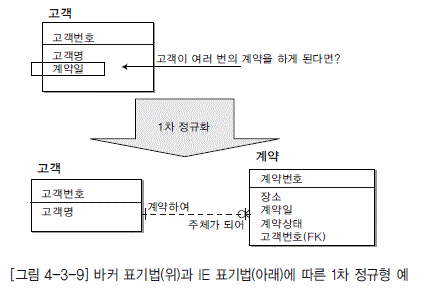

  * [그림 4-3-9] 바커 표기법(위)과 IE 표기법(아래)에 따른 1차 정규형 예">

  * 어떤 속성이 다수의 값을 가지고 있다면 M:1 관계의 새로 엔터티를 추가한다.

  * 관계형 모델에서는 관계(Relation) 정의상 한 속성이 하나의 값만을 가져야 한다. 그러므로 비정규형 관계는 엄밀히 말하면 관계로 간주할 수 없다.

  * 비정규형 관계가 관계로서의 모습을 갖추기 위해선 여러 개의 복합적인 의미를 가지고 있는 속 성이 분해되어 하나의 의미만을 표현하는 속성들로 분해되어야 한다. 즉 속성수가 늘어나야 한 다.

  * 비정규형 관계가 관계로서의 모습을 갖추기 위해선 하나의 속성이 하나의 값을 가질 수 있어야 하며, 이 조건을 만족시키기 위해선 로우(Row)가 늘어나야 한다. 또는 다른 관계로 분리되어야 한다.

  * 분석 또는 모델링 진행 과정에서 발생하며, 최종적인 모델링 완성 단계에서는 나올 수 없다. 그러나 분석(모델링) 초기 단계에는 상세히 분해된 속성보다는 위와 같은 레벨의 속성 추출이 복잡도를 줄일 수 있으므로 실전에서는 효율적이고 유리하게 이용될 수도 있다.

#### 2) 2차 정규형 (2NF, Second Normal Form)

* 가) 정의

  *

  * 식별자가 아닌 모든 속성들은 식별자 전체 속성에 완전 종속되어야 한다.

  * 이것을 물리 데이터 모델의 테이블로 말하면 기본키가 아닌 모든 칼럼들이 기본키에 종속적이어 야 2차 정규형을 만족할 수 있다는 것이다.

</dl>

* 나) 정규화 작업

  *

  * [그림 4-3-10]에서와 같이 식별자가 학번 + 코스코드로 이루어진 학과등록 엔터티에서 학번 속성에 평가코드, 평가내역 속성들이 종속적이다. 그렇기 때문에 이것은 2차 정규형을 위반하고 있는 것이다.

  * [그림 4-3-10]에서와 같이 식별자가 학번 + 코스코드로 이루어진 학과등록 엔터티에서 코스코드 속성에 코스명, 기간 속성들이 종속적이다. 그렇기 때문에 이 또한 2차 정규형을 위반하고 있는 것이다.

  * 의미상의 주어 즉, 본질식별자를 알아야 식별자 부분 종속인지를 구분할 수 있다.

  *

  * [그림 4-3-10] 바커 표기법(위)과 IE 표기법(아래)에 따른 2차 정규형 예">

  * 속성의 의미가 명확해야 종속성을 비교할 수 있다.

  * 어떤 속성 식별자 전체에 종속되어 있지 않으면 잘못된 위치이며 새로운 엔터티 즉, 상위 부모 엔터티를 생성하고 UID BAR를 상속받게 된다.

</dl>

#### 3) 3차 정규형(3NF, Third Normal Form)

* 가) 정의

  *

  * 2차 정규형을 만족하고 식별자를 제외한 나머지 속성들 간의 종속이 존재하면 안된다. 이것이 3차 정규형을 만족하는 것이다.

* 나) 정규화 작업

  *

  * [그림 4-3-11]에서 학과등록 엔터티에서 평가코드, 평가내역 속성들이 서로 간에 종속적이다. 즉, 평가내역 속성은 평가코드 속성에 종속적이다. 그렇기 때문에 이것은 3차 정규형을 위반하 고 있는 것이다.

  * 3차 정규형을 위반하고 있을 시에는 [그림 4-3-11]에서의 평가항목 엔터티처럼 부모 엔터티가 생성되고 그 부모 엔터티로부터 UID Bar가 없는 관계를 상속받게 된다.

</dl>

  * [그림 4-3-11] 바커 표기법(위)과 IE 표기법(아래)에 따른 3차 정규형 예">

  * [그림 4-3-11] 바커 표기법(위)과 IE 표기법(아래)에 따른 3차 정규형 예">

#### 4) BCNF 정규형

* 가) 정의

  *

  * 모든 결정자가 키인 릴레이션이 BCNF이다. 반대로 어떠한 결정자 하나라도 키가 아닌 릴레이 션이라면 BCNF가 될 수 없다.

  * 기존의 2차 정규형과 3차 정규형을 보완하려는 목적으로 만들어졌다. 즉 부분 종속이나 이행 종속이 없는 3차 정규형도 변경 이상 현상이 나타날 수 있기 때문이고, 이것은 어떤 Non-Key 속성이 결정자로 동작하기 때문에 발생한다.

* 나) 3차 정규형의 문제점

  *

  * 한 릴레이션에 여러 개의 후보키(Candidate Key)가 있으며,

  * 모든 후보키들이 적어도 둘 이상의 속성으로 이루어지는 복합(Composite) 키이며,

  * 모든 후보키들이 적어도 하나 이상의 공통 속성이 포함되는 경우이다.

</dl>

  * [그림 4-3-12] BCNF 정규형">

* 다) 3차 정규형을 만족하고 BCNF가 아닌 경우

  *

  * 각 속성이 단 하나의 값으로 구성된 경우(1차 정규형)

  * Non-Key 속성인 D는 후보키(Candidate Key)인 A+B 또는 B + C 에 완전 함수 종속이므로 2차 정규형에 속한다.

  * 또한 Non-Key 속성이 D 하나 뿐이므로 Non-Key 속성 간의 종속 관계가 존재하지 않으므로 제 3차 정규형을 만족한다.

</dl>

## 3. ３. M:M 관계 해소

### 가. M:M 관계의 의미

M:M 관계는 논리 데이터 모델링 과정에서 많이 나타난다. 이러한 관계는 데이터 모델이 아직 덜 완성된 모습이라고 할 수 있다. 그래서 M:M 관계는 최종적으로 완성된 데이터 모델에는 존재할 수 없는 형태라고 할 수 있다.

  * 실제 업무 중 대부분은 M:M 관계이다. 즉, 기업이 관리하고 있는 많은 데이터 중에서 기업의 업무 내용에 해당하는 데이터가 이러한 M:M 관계로 표현되고 향후에 모델링이 더 진행됨에 따라 이것 이 해소된다.

  * 키 엔터티와 키 엔터티 간에는 대부분 M:M 관계이다. 그래서 데이터 모델 상세화 단계에서 이러한 M:M 관계가 해소되면서 액션 엔터티가 새롭게 도출되기도 한다.

  * 지속적으로 발생되는 대다수의 엔터티는 M:M 관계이다. 즉, 기업의 업무 내용을 관리하는 데이터는 대부분 이러한 관계에 의해서 생겨난 엔터티라고 볼 수 있다.

### 나. M:M 관계 해소의 의의

M:M 관계는 불특정 관계로도 알려져 있으며, 데이터 구조에 있어서 어떠한 실제적 방법으로도 구 현이 불가능하다. 이것이 이 관계를 해결하는데 충분한 이유이지만, 데이터 모델 구축 작업 초기에 그렇게 하는 데에는 또 다른 동기가 있다.

  * M:M 릴레이션십은 새로운 릴레이션 엔터티를 추가하여 M:1 관계로 변경한다.

  * 연관 실체(associative, relational) 엔터티는 M:M 관계 미결 시 간과해 버렸을 추가 업무 규칙 또는 업무 논리를 내포할 수 있다. 특히 업무 규칙이 정밀하게 정의됨에 따라 하위 유형(subtype)계층 구조가 연관 실체로부터 나타나기 쉽다는 점, 분석 초기에 M:M 관계가 해결되지 않은 모델에서 이들이 간과된다는 점이다.

  * M:M 관계는 데이터 종속성에 대한 결정을 어렵게 하여, 모델의 논리적 완성과 부분집합 식별 능력을 제한한다.

  * M:M 관계 해결시까지 모델은 불안정 상태에 머물 것이다. 모델은 정규화되지 못하고, 모델에 대한 문서화 작업도 완비되지 못할 것이다.

  * [그림 4-3-13]에서와 같이 제품 엔터티와 공급자 엔터티 간에는 M:M 관계가 존재한다. 이 관계는 제품 공급이라는 업무 내용에 의해서 두 엔터티 간에 생겨난 M:M 관계이다.

  * 이 관계가 해소된 결과로 공급제품목록이라는 새로운 엔터티가 만들어지고 또한 각각의 두 엔터티 즉 제품, 공급자와 1:M 의 관계를 부모로서 가지게 된다.

  * [그림 4-3-13] 바커 표기법(위)과 IE 표기법(아래)에 따른 M:M 관계 해소 예">

  * [그림 4-3-13] 바커 표기법(위)과 IE 표기법(아래)에 따른 M:M 관계 해소 예">

실습 예제 ----------------------------------------------------------------------------------------

[문] 다음 지문의 내용에 대한 엔터티를 정의하고 이들의 관계를 작성하시오.

고객은 각기 다른 배송지 정보를 설정하여 두고 주문 시에 선택할 수 있다. 단, 최초의 기본 배송지는 가입 시에 등록했 던 주소지로 설정하며, 기본 배송지는 변경할 수 있다. 고객은 여러 상품을 하나의 주문으로 묶어 처리할 수 있으며, 하나의 주문은 신용카드, 포인트 등과 같은 여러 개의 결제 수단을 사용하여 결제할 수 있다.

## 4. 참조무결성 규칙 정의

  * 관계 테이블의 모든 외부 식별자 값은 관련 있는 관계 테이블의 모든 주 식별자 값이 존재해야 한다.

  * 실체의 주 식별자(PK)와 마찬가지로 외부 식별자(FK)도 데이터 무결성에 관한 업무 규칙을 내포하고 있다.

  * 데이터베이스 설계 관점에서 선택하지 말고, 사용자의 업무 규칙에 따라 적절한 규칙을 선택한다.

### 가. 입력 규칙

자식 실체의 인스턴스(Instance)를 입력할 때 참조무결성 규칙의 종류는 다음과 같다.

#### 1) Dependent

대응되는 부모 실체에 인스턴스가 있는 경우에만 자식 실체에 입력을 허용한다.

#### 2) Automatic

자식 실체 인스턴스의 입력을 항상 허용하고, 대응되는 부모 건이 없는 경우 이를 자동 생성한다.

#### 3) Nullify

자식 실체 인스턴스의 입력을 항상 허용하고, 대응되는 부모 건이 없는 경우 자식 실체의 참조키 (FK)를 Null 값으로 처리한다.

#### 4) Default

자식 실체 인스턴스의 입력을 항상 허용하고, 대응되는 부모 건이 없는 경우 참조키(FK)를 지정된 기본 값으로 처리한다.

#### 5) Customized

특정한 검증 조건이 만족되는 경우에만 자식 실체 인스턴스의 입력을 허용한다.

#### 6) No Effect

자식 실체 인스턴스의 입력을 조건 없이 허용한다.

### 나. 삭제 규칙

부모 실체의 인스턴스를 삭제할 때(또는 그것의 주 식별자를 수정할 때) 사용되는 무결성 규칙은 다음과 같다.

#### 1) Restrict

대응되는 자식 실체의 인스턴스가 없는 경우에만 부모 실체 인스턴스 삭제를 허용한다.

#### 2) Cascade

부모 실체 인스턴스의 삭제를 항상 허용하고, 대응되는 자식 실체의 인스턴스를 자동 삭제한다.

#### 3) Nullify

부모 실체 인스턴스의 삭제를 항상 허용하고, 대응되는 자식 실체의 인스턴스가 존재하면, 그것의 참 조키(FK)를 Null 값으로 수정한다.

#### 4) Default

부모 실체 인스턴스의 삭제를 항상 허용하고, 대응되는 자식 실체의 인스턴스가 존재하면, 그것의 참 조키(FK)를 기본 값으로 수정한다.

#### 5) Customized

특정한 검증 조건이 만족되는 경우에만 부모 실체 인스턴스의 삭제를 허용한다.

#### 6) No Effect

부모 실체 인스턴스 삭제를 조건 없이 허용한다.

# 제4절 이력 관리 정의

## 1. 이력 관리란 ?

데이터는 현재의 프로세스만 처리하고 버리는 것이 아니라 마치 후손에게 물려주어야 할 귀중한 문화유산처럼 오랜 기간의 데이터를 유지시켜 좀 더 가치있는 정보를 제공할 수 있는 밑거름이 되도 록 해야 한다. 현재는 단지 하나의 점에 불과하지만 과거란 엄청난 개수의 점이 모여 있는 형상이다. 사실 현재의 데이터조차 제대로 다루기가 어려운 데 이미 지나가 버린 데이터에 연연한다는 것은 생 각처럼 그리 쉬운 일이 아닌 것은 분명하다. 굳이 위상수학(topology)을 동원하지 않더라도 수학 시 간에 배웠듯이 점으로 선분을 만들려면 무한대의 점이 필요하다. 이력은 선분이고 현재의 순간은 점 이므로 선분 -그것도 과거에 비해 현저하게 오랜 기간 - 을 관리해야 한다는 것은 결코 함부로 결정 해서는 안된다.

모든 업무는 언제 시작해서 언제 끝났는지에 관한 정보가 기록되어 있다. 가장 흔한 예로 주민등록 증의 뒷면을 보면 주소 변경란이 있다. 이사를 가서 주소지를 옮길 때마다 거기에는 주소 이력 정보 가 기입된다. 언제 어느 동으로 이사를 갔으며, 변경된 주소는 무엇이냐 하는 것 등이다.

예를 들면 [그림 4-3-14]에서와 같이 통화 데이터에서 관리되고 있던 환율 데이터에 대한 다음과 같은 업무 요구 사항이 발생하면 환율에 대한 이력을 관리하게 된다.

  * [그림 4-3-14] 바커 표기법(위)과 IE 표기법(아래)에 따른 통화 이력 예">

  * 어제의 환율은 얼마인가?

  * 오늘 아침의 환율은 얼마인가?

  * 환율의 변화에 대한 추이 분석을 하고자 한다.

  * [그림 4-3-15] 선분 이력 예" width="476" height="215">

[그림 4-3-15]는 [그림 4-3-14]의 데이터 모델이 구현되어 실제 데이터가 들어가 있는 모습이다. 즉, 환율별로 이력이 관리되고 있는 모습을 보여주고 있다.

## 2. 이력 관리 대상 선정

### 가. 사용자 조사

데이터의 이력을 관리한다는 것은 관리하지 않을 때와 비교했을 때 많은 비용이 들어가는 일이다. 즉, 이력을 관리할 필요가 없는 데이터에 대해서 이력을 관리하는 것은 여러 가지 측면에서 낭비이 다. 그래서 다음과 같은 질문에 대한 사용자의 검증 과정을 거쳐야 한다.

  * 변경 내역을 감시할 필요가 있는가?

  * 시간의 경과에 따라 데이터가 변할 수 있는가?

  * 시간의 경과에 따라 관계가 변할 수 있는가?

  * 과거의 데이터를 조회할 필요가 있는가?

  * 과거 버전을 보관할 필요가 있는가?

### 나. 인력 데이터의 종류

이력 데이터의 종류에는 크게 세 가지 정도의 종류가 있는데 여기에 따라서 이력을 관리하는 전략 을 세워서 관리해야 한다.

#### 1) 발생 이력(Occurrence History) 데이터

어떤 데이터가 발생할 때마다 이력 정보를 남겨야만 한다면 이력은 발생 이력이라고 볼 수 있다. 예를 들어 고객의 접속 기록을 남겨야만 하는 경우 고객이 웹사이트를 접속할 때마다 그 접속 데이터 를 남긴다면 이것을 발생 이력이라고 할 수 있다. 이 방법은 전통적으로 이력을 관리하는 방법으로 사용되어 왔다.

이러한 이벤트성 이력 데이터를 관리하는 방법으로는 [그림 4-3-16]의 그림처럼 이벤트가 발생할때에만 이력 데이터를 발생하는 방법이 있고, 아래 그림과 같이 이력이 발생하지 않더라도 날마다 데이터를 생성하는 경우도 있다.

  * EVENT 발생 시마다 생성-Event가 발생할 때마다 사진을 찍어 두어야 이력을 관리할 수 있는가?" width="526" height="150">

  * DAILY마다 생성-아무 변화가 없는 경우도 데이터 생성 그러나 완벽한 이력 관리는 불가능 [그림 4-3-16] 발생 이력 예" width="521" height="168">

#### 2) 변경 이력 (Modification History) 데이터

데이터가 변경될 때마다 변경 전과 후의 차이를 확인해야 한다면 변경 이력을 남길 수 있다. 예를 들어, 고객이 주문을 하고서 주문 정보를 변경하였을 때 이전 주문과 변경된 새로운 주문 정보를 관 리하기 위해서 변경된 새로운 주문 정보를 이력 정보로 남겨야 한다.

#### 3) 진행 이력 (Progress History) 데이터

업무의 진행에 따라 이 데이터를 이력 정보로 남겨야만 하는 경우가 있다. 가장 대표적인 것이 바로 주문과 같은 업무 처리이다. 물론 이력이 관리되는 형태는 위의 변경 이력과 같은 형태로 관리 된다. 예를 들면, 주문의 업무 처리는 구매 신청 -&gt; 입금 완료-&gt; 배송 준비 중 -&gt; 배송 중 -&gt; 배송 완료 혹은 주문 취소 등과 같은 업무 진행 상황이 있다. 대부분의 주문 업무 처리의 경우 각 단계가 언제 누구에 의해서 처리되고, 현재 단계는 무엇인지에 관한 정보가 필요한 경우가 많다. 이러한 경우의 업무를 처리하기 위해서는 진행 이력이 중요하다.

### 다. 이력 관리 형태

  * 시점 이력 : 데이터의 변경이 발생한 시각만을 관리

  * 선분 이력 : 데이터 변경의 시작 시점부터 그 상태의 종료 시점까지 관리

#### 1) 시점 이력

특정 통화의 환율이 변경되면 새로운 인스턴스가 생겨나고(New Record), 그 시점의 해당 통화의 환율과 발생 시각을 기록/보관함으로써 환율이 어느 시점에 얼마의 값으로 변경되었다라는 정보를 관리하는 것이다. 이러한 방식의 이력 관리 방법은 아래 예에서 특정한 시점의 데이터를 추출하고자 할 경우에 불필요한 작업을 수행하게 된다. 이러한 점을 주의하여야 한다.

  * [그림 4-3-17] 바커 표기법(위)과 IE 표기법(아래)에 따른 시점 이력 예" width="417" height="334">

  * - 시점 이력 활용 예

  * SELECT 환율

  * FROM 환율 변동 이력

  * WHERE 발생 시각 = (SELECT MAX(발생시각)

FROM 환율 변동 이력

WHERE 발생 시각 &lt;=20020521 AND 통화_ID =‘ USD’)

AND 통화_ID = ‘USD

</dl>

#### 2)선분 이력

각 통화의 특정 기간 동안 유효한 환율을 관리

  * - 선분 이력 활용 예

  * SELECT 환율

  * FROM 환율 변동 이력

  * WHERE 발생 시각 between 시작 시각 and 종료 시각

  * AND 통화_ID = ‘USD’

</dl>

  * - 선분 이력 의미

  * [그림 4-3-19]를 예를 들어 선분 이력의 의미를 살펴 본다.

  * 17을 가진 선분을 = 로 찾을 수는 없다.

  * 그러나 17이 통과하는 선분을 찾아보자.

  * 어떤 점이나 반드시 하나의 선분을 통과한다.

  * 선분이 아무리 길어도 레코드는 하나이다.

  *

  * [그림 4-3-19] 선분 이력의 의미" width="448" height="192">

  * 17의 지점을 [그림 4-3-19]에서와 같은 선분 이력 데이터에서 찾는 방법은 다음과 같다.

  * 부등식 표현 : 시작점 &lt;= 17 &lt;= 종료점

  * 연산자 표현 : 17 Between 시작점 and 종료점

</dl>

### 라. 선분 이력 관리 유형

#### 1) 인스턴스 레벨 이력 관리

하나의 인스턴스의 어떤 변경이라도 발생하면 전체 인스턴스를 새롭게 생성하는 방식의 이력 관리 유형이다.

  * [그림 4-3-20] 인스턴스 이력 관리 예" width="550" height="169">

이러한 방식의 이력 관리 유형의 특징은 다음과 같다.

  * 한번의 액세스로 스냅샷을 참조하는 것이 가능하다. 즉, 한번의 액세스로 해당 시점의 모든 데이터 를 참조하는 것이 가능하다.

  * 로그성 데이터를 저장할 목적인 경우 적당한 방법이다.

  * 다른 이력 관리 유형에 비해서 저장하기가 쉽다.

  * 가장 큰 단점 중에 하나는 하나 이상의 칼럼에 변경이 발생했을 때 이벤트가 모호해진다는 점이다.

  * 만약 이벤트가 자식 정보를 가지게 된다면 매우 치명적이다. 즉, 각각의 변경 이벤트가 하위의 데이터(엔터티)를 가지게 된다면 해당 이벤트를 찾기가 매우 어려워진다.

  * 이력 관리의 다른 유형들에 비해서 저장 공간의 낭비를 초래할 수 있다.

  * 실제 어떤 데이터가 변경된 것인지를 찾기 위해서는(즉, 이벤트를 찾기 위해서는) 과거의 데이터를 Merge해서 비교를 해야만 가능할 수 있다.

  * 특정 순간의 스냅샷만 보는게 아니라면 처리가 복잡해지는 경향이 있다.

  * 변화가 빈번하게 발생하는 상황이라면 고려해 볼 수 있는 유형이다.

#### 2) 속성 레벨 이력 관리

[그림 4-3-21]에서와 같이 이력을 관리할 대상 속성에서 변화가 생길 때만 이력을 생성하는 방식이다

  * [그림 4-3-21] 속성 레벨 이력 관리 예" width="554" height="163">

이러한 방식의 이력 관리 유형의 특징은 다음과 같다.

  * 변경 이벤트가 매우 분명하게 관리된다. 즉, 실제 어떤 데이터가 변경되었는지가 분명하다.

  * 하나의 이력 관리 엔터티에서 다른 엔터티와 통합 이력 관리가 가능하다.

  * 변경된 것만 처리하기 때문에 독립적 처리가 가능하다.

  * 변화가 발생할 가능성은 매우 낮으면서 이력 관리 대상 속성은 매우 많은 경우에 사용하는 것이 유리하다.

  * 특정 속성들에 변화가 집중되는 경우에 해당 속성에 대해서만 이력을 관리할 수 있기 때문에 유리하다.

  * 여러 속성에 대한 이력이 필요할 때 많은 Merge가 발생하게 된다.

  * 이력 관리의 다른 유형들에 비해서 향후 사용될 데이터 액세스 쿼리에서 조건 검색이 조금 어렵다.

  * 변화가 너무 많은 경우에는 적용이 곤란하다.

#### 3) 주제 레벨 이력 관리

[그림 4-3-22]에서와 같이 내용이 유사하거나 연동될 확률이 높은 것별로 인스턴스 레벨 이력을 관리하는 방법이다.

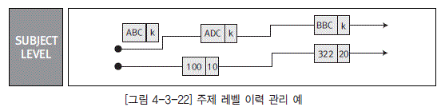

  * [그림 4-3-22] 주제 레벨 이력 관리 예" width="557" height="139">

이러한 방식의 이력 관리 유형의 특징은 다음과 같다.

  * 인스턴스 레벨과 속성 레벨의 장점을 모두 수용하는 형태의 이력 관리 형태이다.

  * 목적이 분명한 엔터티를 생성함으로써 확장성을 확보할 수 있는 용도로 사용할 수 있다.

  * 변경 부분만 처리가 가능하다.(독립적 처리 가능)

  * 다른 엔터티와 통합 이력 관리가 가능하다.

  * 속성 레벨의 단점을 해소할 수 있다.

  * 전체를 참조할 때 인스턴스 레벨에 비해 Merge가 발생하는 문제점이 존재한다.

  * 부문에 따라 변경 정도의 차이가 심한 경우 유리하다.

## 3. 선분 이력 관리용 식별자 확정

### 가. 선분 이력에서 식별자 결정 시 고려사항

선분 이력을 관리하는 엔터티의 UID를 확정하는 것은 향후에 테이블로 만들어지고 사용될 때의 성능 측면도 고려되어야 한다.

[그림 4-3-23]에서와 같이 부서별로 이력이 관리되는 엔터티를 예를 들어 설명하면 의미적인 UID는 부서코드 + 이력시작일 + 이력종료일을 기본키로 하는 것이 유리하다. 하지만 이것은 [그림 4-3-23]에서과 같이 물리적인 측면, 즉 실제 데이터는 Unique하지만 의미적으로는 Unique하지 않는 일이 발생한다. 이러한 부분의 의미적인 Unique을 검증할 수 있는 조치를 병행해야 한다.

  * [그림 4-3-23] 선분이력의 UID" width="471" height="314">

### 나. 선분 이력에서 종료점 처리 시 주의사항

#### 1) 종료점이 미정이므로 NULL

  * 논리적으로는 타당하지만 비교가 불가능

  * 인덱스를 사용하지 못하므로 수행 속도 저하

#### 2) 수렴하므로 최대치 부여

  * 아직 종료되지 않았으므로 무한히 계속되는 것으로 간주

  * 최대치 부여 (예; 일자라면 9999/12/31)

  * 가능한 TABLE creation 시 Default constraints 부여

  * 수행 속도에 유리

# 제5절 논리 데이터 모델 품질 검토

## 1. 논리 데이터 모델 품질 검토 개요

데이터 모델 설계가 완료되면 모델러를 비롯한 이해관계자는 데이터 모델 리뷰 세션을 통해 작성된 데이터 모델의 품질을 검토한다. 데이터 모델 검토는 개념 데이터 모델링, 논리 데이터 모델링, 물리 데이터 모델링의 각 단계가 수행된 후 각 단계에서 작성된 개념 데이터 모델, 논리 데이터 모델, 물리 데이터 모델에 대해 이루어진다. 일반적으로 논리 데이터 모델과 물리 데이터 모델은 모든 이해 관계자들이 가장 관심을 갖고 검토하는 산출물로, 데이터 모델의 중요성을 생각하면 이 검토 과정이야말로 향후의 모든 공정에 대해 영향을 미칠 수 있는 매우 의미 있는 작업이라 할 수 있다. 데이터 모델을 검토하기 위해서는 모든 이해관계자가 동의하는 검토 기준이 필요하며, 통상 논리·물리 데이터 모델에 대한 검토 기준은 과목Ⅰ. 전사아키텍처 이해 부분에서 설명한 데이터아키텍처 정책 수립 시 DA원칙/표준에 포함되어야할 중요한 사안이다.

데이터 모델의 품질 검토 기준은 주로 논리 데이터 모델과 물리 데이터 모델에 대해 적용하며, 조직에 따라서는 개념 데이터 모델에 대한 검토 기준을 추가하기도 한다. 기본적인 품질 검토 기준은 과목VI. 데이터 품질 관리 이해 부분에서 설명한 데이터 구조의 관리 기준을 준용할 수 있으며, 논리 데이터 모델에 대한 품질 기준을 좀 더 세분화해 보면 [표 4-3-1]과 같이 정의해 볼 수 있다. 논리 데이터 모델 품질 검토의 목적은‘완벽한 모델’보다‘(조직에) 적합한 모델’의 관점에서 생각해 볼 수 있으며, 이에 따라 논리 데이터 모델의 품질 기준도 조직에 따라 혹은 업무 상황이나 여건에 따라 가감하거나 변형하여 사용하기도 한다.

[표 4-3-1] 논리 데이터 모델의 품질 기준

| 기준 항목 | 설 명 | 검토 관점 사례 |
|----|
 | 정확성|데이터 모델이 표기법에 따라 정확하게 표현되었고, 업무영역 또는 요구사항이 정확하게 반영되었음을 의미함|- 사용된 표기법에 따라 데이터 모델이 정확하게 표현 되었는가

  *  대상 업무영역의 업무 개념과 내용이 정확하게 표현 되었는가

  *  요구사항의 내용이 정확하게 반영 되었는가

  *  업무규칙이 정확하게 표현 되었는가 |

 | 완전성|데이터 모델의 구성 요소를 정의하는데 있어서 누락을 최소화하고, 요구사항 및 업무영역 반영에 있어서 누락이 없음을 의미함|- 모델 표현의 충실성(완성도)

  *  필요한 항목(엔터티/속성 설명 등)들의 작성 상태

  *  논리 데이터 모델링 단계에서 결정해야할 항목들의 작성 상태(속성의 선택성(optionality), 식별자, 정규화, 엔터티/속성의 중복배제, 이력관리 등)

  *  요구사항 반영 및 업무 영역 반영의 완전성: 목적하는 업무 영역을 기술(설계)하는데 있어서 논리 데이터 모델 구성요소(엔터티, 속성, 관계 등)들이 누락없이 정의 된 정도 |

 | 준거성|제반 준수 요건들이 누락 없이 정확하게 준수되었음을 의미함|- 데이터 표준, 표준화 규칙 등을 준수하였는가

  *  법적 요건을 준수 하였는가 |

 | 최신성|데이터 모델이 현행 시스템의 최신 상태를 반영하고 있고, 이슈사항들이 지체없이 반영되고 있음을 의미|- 업무상의 변경이나 결정사항 등이 시의 적절하게 반영되고 있는가

  *  최근의 이슈사항이 반영 되었는가

  *  현행 데이터 모델은 현행 시스템과 일치 하는가 |

 | 일관성|여러 영역에서 공통 사용되는 데이터 요소가 전사 수준에서 한 번만 정의되고 이를 여러 다른 영역에서 참조·활용되면서, 모델 표현상의 일관성을 유지하고 있음을 의미함|- 여러 주제영역에서 공통적으로 사용되는 엔터티는 일관성 있게 사용되는가(전사 수준에서 한 번만 정의되고 이를 여러 다른 영역에서 참조·활용한다는 의미에서 통합성이라 하기도 함)

  *  모델 표현상의 일관성을 유지하고 있는가 |

 | 활용성|작성된 모델과 그 설명 내용이 이해관계자에게 의미를 충분하게 전달할 수 있으면서, 업무 변화 시에 설계 변경이 최소화되도록 유연하게 설계되어 있음을 의미|- 작성된 설명 내용이나 모델 표기 등이 사용자나 모델을 보는 사람에게 충분히 이해가 될 수 있고, 모델의 작성 의도를 명확하게 이해할 수 있는가(의사소통의 충분성)

  *  데이터 모델은 유연성을 갖고 있는가(오류가 적고 업무변화에 유연하게 대응하여 데이터 구조의 변경이 최소화 될 수 있는 설계 결과) |

## 2. 논리 데이터 모델 품질 검토 체크리스트의 활용

논리 데이터 모델의 품질 검토 기준에 따라서 논리 데이터 모델에 정의된 엔터티, 관계, 속성 등 데이터 모델의 주요 구성요소와 논리 데이터 모델 전반에 대한 체크리스트를 구성할 수 있으며, 이를 통해 논리 데이터 모델의 품질 검토를 보다 용이하게 수행할 수 있다. [표 4-3-2]는 논리 데이터 모델의 주요 구성 요소별로 품질 검토 기준 항목을 적용하여 작성한 품질 검토 체크리스트의 사례이다.

[표 4-3-2] 논리 데이터 모델 품질 검토 체크리스트 사례

| 검토대상 | 검토항목 | 검토 내용 |
|----|
<tr>
<td rowspan="8">엔터티 | 엔터티명|- 사용된 표기법에 따라 데이터 모델이 정확하게 표현 되었는가

  *  대상 업무영역의 업무 개념과 내용이 정확하확하게 반영 되었는가

  *  업무규칙이 정확하게 표현 되었는가

  *  데이터 집합의 개요나 성격, 관리 목적 등을 설명하였는가?

  *  데이터 집합 구성상의 특징이 설명되어 있는가?

  *  데이터 집합의 생명주기나 오너쉽 등을 비롯한 기타 특이사항에 대한 내용을 포함하고 있는가?

  *  설명된 내용은 모든 이해관계자가 이해하고 의사소통 하는 데에 어려움이 없도록 쉽고 상세하게 기술되었는가? |

 | 엔터티 정의|- 도출된 엔터티는 요구사항을 충족하거나 업무 영역을 설명하기에 충분한가?

  *  우선순위에 따른 엔터티 분류 관점에서 중요한 키엔터티나 메인엔터티가 누락되지 않았는가?

  *  엔터티는 서브타입을 사용하여 구체적·입체적으로 정의되었는가?

  *  서브타입 정의 시 구분자 속성은 명확하게 정의하였는가?

  *  서브타입 구성은 엔터티의 성격을 설명하기에 충분한가?

  *  서브타입은 충분하게 도출되었는가? (전체집합=Σ서브타입)

  *  향후의 업무 변화 가능성에 대비하여 모델 변경을 최소화할 수 있도록 유연성, 확장성이 고려되었는가? |

 | 통합 수준|- 업무 행위의 주체가 될 수 있는 전사관계자와 같은 중요 기준데이터는 통합이 고려되었는가?

  *  엔터티간 동질성을 부여할 수 있는 유사 목적·구성의 엔터티에 대해 통합이 고려되었는가? (서브타입 사용)

  *  코드 엔터티는 통합이 고려되었는가?

  *  계층구조 엔터티에 대한 통합은 고려되었는가?

  *  배타관계 엔터티의 통합은 고려되었는가?

  *  다른 영역에서 동일 목적의 엔터티는 동일 명칭과 구조로 일관되게 사용되었는가?

  *  엔터티 분리는 명확하고 합리적인 근거와 목적에 의해 적절한 형태로 이루어졌는가? |

 | 권한|- 메타데이터 권한을 정의 하였는가? (엔터티 생성/변경/삭제)

  *  데이터 오너쉽을 정의 하였는가? (데이터 생성/변경/삭제) |

 | 발생 건수/

빈도|- 현재의 데이터 저장 건수/빈도는 파악하였는가?

  *  향후 예상되는 데이터 저장 건수/빈도의 변화가능성은 파악하였는가? |

 | 다른 엔터티와의

관계|- 다른 엔터티와 하나 이상의 관계를 가지고 있는가? |

 | 법규 준수|- 관련 법규에서 요구하는 데이터를 보관하기 위한 엔터티를 정의하였는가?

  *  조직 특성에 비추어 보호가 요구되는 엔터티를 식별하였는가? |

 | 요구사항

추적가능성|- 정의된 엔터티는 요구사항과 매핑이 되었는가? |

<tr>
<td rowspan="10">속성 | 속성명|- 속성명은 명명규칙을 준수하였는가?

  *  제한요건에 따라 약어를 사용한 경우 약어사용 규칙을 준수하였는가?

  *  의미 전달이 명확한 명칭을 사용하였는가? |

 | 속성 정의|- 엔터티명이나 엔터티 성격에 맞는 속성이 도출되었는가?

  *  엔터티의 성격이나 목적에 비추어 속성은 충분하게 도출되었는가?

  *  속성의 선택성 결정은 적절한가?

  *  유일값 원칙에 위배되는 속성이 존재하는가?

  *  속성의 원자단위 구성은 적절한가?

  *  속성의 관리 목적상 상세화 여부 검토가 수행되었는가?

  *  인조 속성의 생성 단위나 생성 규칙이 정의되었는가? |

 | 속성 설명|- 속성의 개요나 성격, 관리 목적 등을 설명하였는가?

  *  속성으로 관리하고자 하는 데이터의 형태적 혹은 구성상의 특징이 포함되어 있는가?

  *  데이터 집합으로서 속성의 생명주기나 오너쉽 등을 비롯한 기타 특이사항에 대한 내용을 포함하고 있는가?

  *  설명된 내용은 모든 이해관계자가 이해하고 의사소통 하는 데에 어려움이 없도록 쉽고 상세하게 기술되었는가? |

 | 속성 유형|- 엔터티 성격에 맞게 식별자가 정의되었는가?

  *  관계를 통해 상속받은 관계속성은 명확한 역할명을 사용하고 있는가? |

 | 식별자 정의|- 모든 본질식별자가 적절하게 파악되었는가?

  *  인조식별자 사용 시 대응하는 속성 구성이 파악되었는가?

  *  실질식별자로서 본질식별자나 인조식별자를 사용하는 기준을 준수하고 있는가? |

 | 법규 준수|- 법규상 암호화 대상인 속성은 식별하였는가?

  *  법규상 필요한 속성은 정의되었는가?

  *  법규상 수집·보관에 따른 제약이 존재하는 속성은 처리 방안을 고려하고 적용하였는가? |

 | 도메인 정의|- 표준 도메인을 정의하여 적용하였는가?

  *  속성의 도메인은 일관성 있게 정의되었는가? |

 | 추출

속성의 정의|- 추출 속성은 명확하고 합리적인 이유를 토대로 정의하였는가?

  *  추출 속성의 원시 속성은 식별하였는가?

  *  추출 속성은 추출 방법 또는 산식이 명확하게 정의되었는가?

  *  추출 속성의 빈도(구성 수준)는 적절한가? |

 | 요구사항 추적가능성 | - 속성 수준에서 필요한 요구사항 매핑은 수행되었는가? |

 | 오너쉽 정의|- 속성 수준에서 데이터 오너쉽 정의가 필요한 경우 데이터 오너쉽이 정의 되었는가? |

<tr>
<td rowspan="8">관계 | 관계명|- 관계명이 누락된 관계가 존재하는가?

  *  관계명 부여 규칙 존재 시 이를 준수하였는가?

  *  두 엔터티 간의 업무적 관계를 자식(자식 엔터티)이 바라보는 부모(부모 엔터티)의 역할 관점으로 파악하여 관계명을 표현하였는가? |

 | 관계 정의|- 업무 영역을 설명하거나 요구사항을 충족하는데 있어서 필요한 관계들이 충분히 도출·정의되었는가?

  *  관계 정의는 업무 영역의 내용이나 요구사항과 일치하는가?

  *  배타적 관계가 정의된 경우 업무 내용과 일치하는가?

  *  배타적 관계가 정의된 경우 현재의 업무 개선 관점이 고려되었는가?

  *  배타 관계 해소를 위한 검토가 수행되었는가? |

 | 관계 설명|- 관계가 왜 존재해야 하는지의 관점에서 기술하고 있는가?(업무규칙, 정규화 등) |

 | 관계 표현|- 표기법에 따라 정확하게 표현하였는가?

  *  관계에 표현된 기수성·선택성은 업무규칙을 정확하게 설명하는가? |

 | 식별자 상속|- 자식에 상속된 관계 속성은 정확한 역할명으로 표현되었는가?

  *  모든 관계 속성들의 출처(또는 관계)가 명확하게 파악되었는가? |

 | 요구사항

추적가능성|- 관계에 대해 필요한 요구사항 매핑은 수행되었는가? |

 | 외부키

(외래키)*|- 외부키(외래키)가 부모 엔터티의 주식별자(실질식별자)와 일치하는가?

  *  외부키 항목이 기본키와 기본키가 아닌 속성에 펼쳐져 있는가?

  *  자식에 상속된 관계 속성의 선택성은 적절한가? |

 | 참조무결성**|- 업무규칙에 근거하여 참조무결성을 정의하였는가? |

<tr>
<td rowspan="3">모델

전반 | 주제영역

적절성|- 주제영역의 구성은 적절한가? |

 | 논리 모델

상세화|- 데이터 모델상에 정규화가 미흡한 부분이 존재하는가?

  *  최종적인 논리 데이터 모델에서 다대다 관계는 모두 해소 하였는가? |

 | 이력 관리|- 이력관리 대상 선정과 이력관리 방법은 적절한가? |

※ *, ** 표기한 부분은 방법론이나 모델링 도구에 따라 물리 데이터 모델의 검토 항목으로 보기도 함.

# 제4장 물리 데이터 모델링

# 제1절 물리 데이터 모델링 이해

## 1. 물리 데이터 모델 정의

물리 데이터 모델이란 논리적 모델을 특정 데이터베이스로 설계함으로써 생성된, 데이터를 저장할 수 있는 물리적인 스키마를 말한다. 데이터 모델의 엔터티와 서브타입은 논리적인 집합이며, 만약 관계형 데이터베이스로 설계한다면 이 단계에 와서 물리적인 테이블(Table)로 확정된다. 하나의 논리적 집합(엔터티 혹은 서브타입)은 하나 이상의 테이블이 될 수 있으며, 경우에 따라서는 속성의 일부만으로 생성될 수 있다.

물리 데이터 모델링은 논리 데이터 모델을 사용하고자 하는 각 DBMS의 특성을 고려하여 데이터 베이스 저장 구조(물리 데이터 모델)로 변환하는 것이다. 여기에서 물리 데이터 모델링과 데이터베이스 디자인과의 개념을 정리하자면 물리 데이터 모델링은 데이터의 구조에 관련된 것들을 물리적인 모습까지 설계하는 것이고, 반면에 데이터베이스 디자인은 이러한 물리적인 모델(설계도면)을 DBMS 관점의 오브젝트로 생성하는 최적의 설계(디자인)를 하는 것이다. 데이터베이스 디자인의 예로는 오브젝트별 저장공간의 효율적 사용 계획, 오브젝트 파티셔닝 설계, 최적의 인덱스 설계 등이 여기에 속한다고 할 수 있다. 물론, 이러한 기준에 대해서 이론이 있을 수 있을 것이다. 하지만, 이 수험서에서는 이러한 기준을 가지고 물리 데이터 모델링과 데이터베이스 디자인을 구분하였다.

## 2. 물리 데이터 모델 의의

물리적 데이터 모델링은 관계 데이터 모델링(RDM, Relation Data Modeling)이라고도 한다. 사전적으로 작성된 논리적 데이터 모델을 각각의 관계형 데이터베이스 관리 시스템의 특성, 기능, 성능 등을 고려하여 데이터베이스의 물리적인 구조(Schema)를 작성해가는 과정이다. 많은 사람들이 물리 데이터 모델링을 단순히 설계된 논리 데이터 모델의 개체 명칭이나 속성 명칭, 데이터 형태, 길이, 영역값등을 변환하는 것 정도로 생각하고 있다. 그러나 물리적 데이터 모델링 단계는 논리 데이터 모델에서 도출된 내용 변환을 포함하여 데이터의 저장공간, 데이터의 분산, 데이터 저장 방법 등을 함께 고려하는 단계이다. 또한, 이 과정에서 결정되는 많은 부분이 데이터베이스 운용 성능(Performance)으로 나타나므로 소홀히 다루면 안된다.

## 3. 논리 데이터 모델-물리 데이터 모델

하나의 논리적 데이터 모델을 가지고 서로 다른 형태의 물리적 데이터 모델을 설계하는 경우는 크게 네 가지로 나눌 수가 있다.

### 가. 분산 데이터베이스 구축 시

분산 데이터베이스를 구축하고자 할 때 노드별로 자신이 원하는 형태의 물리적 모델을 생성하고자 할 때 적용하는 경우이다.

### 나. 물리 데이터 모델 비교

각자 나름대로의 특징을 가지고 있는 여러 개의 물리적 모델을 생성하여 종합적인 비교 검토를 하기 위하여 적용하는 경우이다.

### 다. 물리적 환경의 변화

논리적인 모델에는 변화가 발생하지 않지만 물리적인 환경에는 변경이 발생했을 때 기존의 물리적 모델을 새로운 목표 물리적 모델로 개선하고자 할 때 적용하는 경우이다.

### 라. 물리적 모델의 형상관리

물리적 모델이 세월의 흐름에 따라 조금씩 변해갈 때 그 이력을 관리할 목적으로 여러 개의 버전을 보유하고자 할 때 사용하는 경우이다.

# 제2절 물리 요소 조사 및 분석

## 1. 시스템 구축 관련 명명 규칙

사내의 시스템 구축과 관련된 명명 규칙을 파악하여 물리 데이터 모델의 각 요소의 내용에 이를 적용해야 한다.

## 2. 하드웨어 자원 파악

### 가. CPU

중앙처리 장치의 성능과 집중적인 부하가 발생하는 시간 등을 파악한다.

### 나. MEMORY

전체 메모리의 규모 및 시스템이 사용하는 메모리 영역을 포함하여 사용 가능한 메모리 영역을 파악한다.

### 다. DISK

전체 디스크의 크기, 분할된 형태, 현재 디스크 활용률 등을 파악하고 사용 가능한 공간을 확인 한다.

### 라. I/O Controller

현재 입/출력 컨트롤러의 성능 및 적절하게 운용되고 있는가를 파악한다.

### 마. Network

네트워크와 관련된 모든 내용을 파악한다. 여기에 관련된 내용으로는 다음과 같은 것들이 존재한 다.

  * 현재 처리 가능한 속도

  * 집중적인 부하가 발생하는 시간대

  * 동시 접속 최대 가용 사이트 수

## 3. 운영체제 및 DBMS 버전 파악

데이터베이스 운영 환경과 관련된 운영체제의 관련 요소를 파악하고 적절하게 관리되고 있는가를 파악한다. 특히 인스턴스 관리 기법 등에 대해서 파악하고 분석한다.

## 4. DBMS 파라미터 정보 파악

DBMS 환경 적용 단계에서 가장 중요하게 고려해야 하는 단계이다. 물론 DBMS 파라미터는 데이 터베이스 관리 시스템별로 많은 차이가 있으며 관리하는 방법도 서로 다르다. 따라서 자신들의 DBMS가 관리하는 파라미터의 종류와 관리 대상들을 정확하게 파악하고 정의해야 한다. 특히 데이터베이스 관리를 위한 데이터 저장 공간 관리 기법과 메모리 관리 기법 등과 관련된 파라미터들에 대 해서는 세심한 주의를 기울여야 한다. 그리고 데이터 쿼리에서 활용하는 옵티마이져(Optimizer)의 운영 방법 등도 중요한 고려사항이 된다.

## 5. 데이터베이스 운영과 관련된 관리 요소 파악

  * 사용자 관리 기법 및 정책

  * 백업/복구 기법 및 정책

  * 보안 관리 정책

# 제3절 논리-물리 모델 변환

## 1. 논리 데이터 모델-물리 데이터 모델 변환(Transformation) 용어

논리 영역과 물리 영역을 보는 시각은 여러 가지 관점에서 조금씩은 다르다. 특히 학자, 모델링 툴도 이러한 차이는 존재한다. 하지만, 하지만 이 책에서는 다음과 같은 기준으로 논리 데이터 모델의 영역과 물리 데이터 모델의 영역을 구분하여 접근하고 있다.

  * [그림 4-4-1] 논리 모델 - 물리 모델 변환 용어">

## 2. 엔터티-테이블 변환

### 가. 테이블 설명

테이블은 데이터를 저장하기 위해서 생성된 데이터베이스에서의 가장 기본적인 오브젝트이다. 기 본적인 모습은 아래와 같은 모양으로 만들어지게 된다.

  * [그림 4-4-2] 바커 표기법(위)과 IE 표기법(아래)에 따른 테이블 레이아웃">

  * [그림 4-4-2] 바커 표기법(위)과 IE 표기법(아래)에 따른 테이블 레이아웃">

#### 1)테이블(Table)

테이블은 기본적으로 칼럼(Column)과 로우(Row)를 가진다. 각각의 칼럼은 지정된 유형의 데이터 값을 저장하는 데 사용된다. [그림 4-4-2]에서 테이블 EMP는 사원 정보를 저장하기 위해서 생성된 구조이다.

#### 2)로우(Rows)

테이블의 한 로우에 대응. 튜플 , 인스턴스, 어커런스라고도 한다.

#### 3)칼럼(Columns)

각 사원 개개인의 관리 항목에 대한 Value를 저장한다.

#### 4)기본키(Primary keys)

하나의 칼럼 혹은 몇 개의 칼럼 조합으로 어떤 경우라도 테이블 내에 동일한 값을 갖는 튜플이 존재하지 않도록 한다.

#### 5)외래키(Foreign keys)

외부 데이터 집합과의 관계를 구현한 구조이다.

### 나. 서브타입 변환(Transformation)

논리 데이터 모델에서는 비즈니스 또는 업무를 데이터 모델로 표현하기 위해서는 최대한 상세한 표현이 필수적이다. 그러한 목적을 달성하기 위해서 가능하면 집합(엔터티)의 구성을 서브타입을 사용하여 구체적으로 표현하는 것이 통상적이다. 또한 각각의 서브타입들이 독립적인 속성(Attribute), 관계(Relationship)를 가지고 있는 경우에는 이러한 서브타입(Sub Type)을 사용한 집합의 표현은 필수적이다. 이렇게 논리 모델링에서 표현된 서브타입은 물리 데이터 모델에서는 테이블의 형태로 설계되어야 한다. 하지만 이러한 서브타입 모델은 단순 엔터티-테이블 변환과는 다른 몇 가지 방법을 통해서 테이블로 변환 작업을 하게 된다.

  * 슈퍼타입 기준 테이블 변환

  * 서브타입 기준 테이블 변환

  * 개별타입 기준 테이블 변환

[그림 4-4-3]과 같은 구체적인 논리 데이터 모델을 통해서 위 방법들을 살펴본다.

  * [그림 4-4-3] 바커 표기법(위)과 IE 표기법(아래)에 따른 서브타입 예">

  * [그림 4-4-4] 바커 표기법(좌)과 IE 표기법(우)에 따른 슈퍼타입 기준 테이블 변환 예">

* 슈퍼타입 기준 테이블 변환

  * 서브타입을 슈퍼타입에 통합하여 하나의 테이블로 만든다

  * 이 통합된 테이블에는 모든 서브타입의 데이터를 포함해야 한다

  * 주로 서브타입에 적은 양의 속성이나 관계를 가진 경우에 적용된다

가) 절차

  * 슈퍼타입으로 테이블 명칭 부여

  * 서브타입을 구분할 수 있도록 칼럼 추가

  * 슈퍼타입의 속성을 칼럼명으로

  * 서브타입의 속성을 칼럼명으로

  * 슈퍼타입의 관계를 FK로

  * 서브타입의 관계를 FK로

나) 테이블 사례

[그림 4-4-3]의 논리 모델에서의 서브타입을 하나의 테이블로 통합하는 경우 테이블의 모습은 [그림 4-4-5]의 사례 데이터 표와 같다.

  * 테이블명 : EMPLOYEE [그림 4-4-5] 테이블 사례 예">

  *  *TYPE*
서브타입을 구분할 수 있는 칼럼이다. 즉 사원 구분에 해당하는 칼럼이다.

  *  *DEPT*
위의 구분이 정규직일 경우에 부서로부터의 관계로 인해서 생성된 칼럼이다.

  *  *UNION*
위의 구분이 임시직일 경우에 협력 업체로부터의 관계로 인해서 생성된 칼럼이다.

다) 하나의 테이블로의 통합이 유리한 경우

  * 데이터 액세스가 좀더 간편

  * 뷰를 활용하여 각 서브타입만을 액세스하거나 수정 가능

  * 수행 속도가 좋아지는 경우가 많다

  * 서브타입 구분없는 임의 집합의 가공 용이

  * 다수의 서브타입을 통합한 경우 조인(JOIN) 감소 효과가 크다

  * 복잡한 처리를 하나의 SQL로 통합하기가 용이

라) 하나의 테이블로의 통합이 불리한 경우

  * 특정 서브타입의 NOT NULL 제한 불가

  * 테이블의 칼럼 수가 증가

  * 테이블의 블럭 수가 증가

  * 처리시마다 서브타입의 구분(TYPE)이 필요해지는 경우가 많다

  * 인덱스(INDEX) 크기가 증가

* 서브타입 기준 테이블 변환

  * 슈퍼 타입 속성들을 각 서브타입에 추가하여 각각의 서브타입마다 하나의 테이블로 만든다

  * 분할된 테이블에는 해당 서브타입의 데이터만 포함돼야 한다

  * 주로 서브타입에 많은 양의 속성이나 관계를 가진 경우에 적용된다

  * [그림 4-4-6] 바커 표기법(좌)과 IE 표기법(우)에 따른 서브타입 기준 테이블 변환 예">

* 가) 절차

  *

  * 서브타입마다 테이블 명칭 부여

  * 서브타입의 속성을 칼럼명으로

  * 테이블마다 슈퍼타입의 속성을 칼럼으로

  * 서브타입마다 해당되는 관계들을 FK로

  * 테이블마다 슈퍼타입의 관계를 FK로

* 나) 테이블 사례

  * 위의 [그림 4-4-3] 논리 모델에서의 서브타입을 여러 개의 테이블로 분할하는 경우 테이블의 모습은 [그림 4-4-7]과 [그림 4-4-8]의 데이터 사례 표와 같다. [그림 4-4-7]은 정규직 사원에 대한 표본 테이블의 모습과 인스턴스를 나타낸다. [그림 4-4-8]은 임시직 사원에 대한 표본 테이블의 모습과 인스턴스를 나타낸다.

  *

  * [그림 4-4-7] 테이블 예 : 정규직 사원">

  * [그림 4-4-8] 테이블 예 : 임시직 사원">

* 다) 여러 개의 테이블로 분할한 경우가 유리한 경우

  *

  * 각 서브타입 속성들의 선택 사양 명확한 경우에 유리하다.

  * 처리시마다 서브타입 유형 구분이 불필요하다.

  * 전체 테이블 스캔시 유리하다.

  * 단위 테이블의 크기가 감소한다.

</dl>

* 라) 여러 개의 테이블로 분할한 경우가 불리한 경우

  *

  * 서브타입 구분 없이 데이터 처리하는 경우 UNION이 발생한다.

  * 처리 속도가 감소하는 경우가 많다

  * 트랜젝션 처리시 여러 테이블을 처리하는 경우가 증가한다.

  * 복잡한 처리의 SQL 통합이 어려워진다.

  * 부분 범위 처리가 불가능해 질 수 있다.

  * 여러 테이블을 합친 뷰는 조회만 가능하다.

  * UID 유지관리가 어렵다.

</dl>

<h6 class="no_m">개별타입 기준 테이블 변환

* 슈퍼타입과 서브타입을 각각 테이블로 변환한 경우이다.

* 슈퍼타입과 서브타입 테이블 간에는 1:1 관계가 생성된다.(한 쪽을 모두 합치면 전체와 같게 된다는 면에서 개념적으로 아크 관계와 유사)

* 다음의 여러 가지 경우를 만족할 때 사용
  * - 전체 데이터 처리가 빈번하게 발생할 경우에 적용한다.
  * - 서브타입의 처리는 주로 독립적으로 발생할 경우에 적용한다.
  * - 테이블을 통합했을 때 칼럼의 수가 너무 많아지는 경우에 적용한다.
  * - 서브타입의 칼럼 수가 많은 경우에 적용한다.
  * - 트랜잭션이 주로 공통 부분(슈퍼타입)에서 발생한다.
  * - 슈퍼타입의 처리 범위가 넓고 빈번하여 단일 테이블 클러스터링을 해야 할 때 적용한다.

  * [그림 4-4-9] 바커 표기법(좌)과 IE 표기법(우)에 따른 개별타입 기준 테이블 변환 예">

</dl>

### 다. 서브타입 변환 예

[그림 4-4-10]과 같은 논리적 데이터 모델이 있다고 하자.

  * [그림 4-4-10] 바커 표기법(위)과 IE 표기법(아래)에 따른 서브타입 변환 대상 예">

[그림 4-4-10]의 데이터 모델을 물리적 모델로 전환하는 방법은 다양하다. 하나의 데이터 모델을 이용하여 하나 이상의 노드(분산 데이터베이스를 구현하였을 때의 각각의 단위 데이터베이스)에 자 신만의 데이터베이스를 설계할 수 있을 것이다. 데이터 모델의 전부를 물리적 모델로 전환할 수도 있 지만 필요에 따라 원하는 것만 전환하고자 할 수도 있을 것이다.

뿐만 아니라 엔터티를 하나의 테이블로 할 수도 있겠지만 각각의 서브타입 혹은 몇 개를 묶어서 하 나의 테이블로 결정하는 경우도 있을 수 있다. 만약 [그림 4-4-10]의‘엔터티3’처럼 서브타입 세트 를 이용하여 여러 차원에서 분류한 서브타입을 가지고 있다면 자신이 원하는 서브타입 세트의 일부서브타입만 테이블로 전환하는 것도 가능하다. 하나의 엔터티를 여러 개의 테이블로 설계하고 싶다 면 최소한 논리적 데이터 모델에는 서브타입으로 반드시 정의되어 있어야 가능하다. 즉, 물리적 모델 을 결정하는 단계에서 기존에 정의해 둔 서브타입이 아닌 다른 방법으로 테이블을 분할하고 싶다면 논리적 데이터 모델에 새로운 서브타입 세트를 추가로 정의해야 한다는 것을 의미한다.

속성을 물리적 모델로 전환하는 경우에도 전부나 일부만 선택하는 것은 얼마든지 가능하다. 이러 한 개념을 활용하면 하나의 논리적 데이터 모델을 이용하여 여러 개로 수직 분할된 물리 모델을 생성 할 수 있다.

#### 1) Case 1 : 서브타입을 테이블로 분리

속성에 붙어 있는 숫자가 같은 칼럼이 서로 변환된 것으로 간주한다.(예: 속성31 --&gt; COL31)

  * [그림 4-4-11] 바커 표기법(위)과 IE 표기법(아래)에 따른 물리 모델 예제 1">

  * 엔터티1은 그대로 TABLE10으로 전환되었다. 서브타입 세트란 일종의 구분코드라는 속성이라고 할 수 있으며, 서브타입세트1은 칼럼(SUBTYSET1)으로 전환되었다. 엔터티1에 있던 서브타입1,2는 서브타입세트1의 속성에 들어가는 값의 내용이므로 칼럼으로 전환할 필요가 없다.

  * 엔터티2는 서브타입별로 테이블을 분리한 모습이다. 서브타입21은 TABLE21로, 서브타입22는 TABLE22로 전환되었다. 공통 속성인 키2, 속성21은 양쪽 모두에 전환되었고, 엔터티

  * 엔터티3은 두 종류의 서브타입 세트를 가지고 있다. 위의 물리 모델은 이 중에서 서브타입세트32에 있는 서브타입별로 분리한 모습이다. 자세히 살펴보면 슈퍼타입에 있던 공통 속성 중에서 자신이 필요로 하는 일부분만 전환되었음을 발견할 수 있다. 바커표기법으로 표현할 모델에서 관계선에 세로선(UID BAR)이 붙어 있다면 식별자의 일부가 되겠다는 뜻이므로 물리적 모델이 될 때는 당연히 기본키(PK, Primary Key)이면서 외래키(FK, Foreign Key)가 되어야 한다.

#### 2) Case 2 : 서브타입을 통합 테이블로 생성

물리적 모델에서는 [그림 4-4-12] 같이 동일한 논리적 모델을 기반으로 했지만 앞서 예제와는 다른 모습의 모델을 만들 수도 있다.

[그림 4-4-12]의 물리 모델은 앞서 소개한 물리적 모델과는 테이블의 개수도 다르며, 경우에 따라 테이블 명칭은 동일하지만 내용은 다르게 정의할 수도 있다.

  * [그림 4-4-12] 바커 표기법(위)과 IE 표기법(아래)에 따른 물리 모델 예제 2">

  * 바커 표기법에 따른 커뮤니티관리 논리 데이터 모델/IE 표기법에 따른 커뮤니티관리 논리 데이터 모델">

### 라. 테이블 목록 정의서

  * [그림 5-4-13] 테이블 목록 정의서 예">

엔터티를 테이블로 변환하는 과정이 완료되면 [그림 4-4-13]과 같은 테이블 목록 정의서를 작성한다. 테이블 목록 정의서는 줄여서 테이블 목록이라 부르기도 하며, 전체 테이블이 목록으로 요약 관리되어야 한다.

## 3. 속성-칼럼 변환

속성이나 관계를 물리 데이터 모델 객체로 변환하는데 있어서 사례 데이터 표를 작성해 보는 것은 실제 데이터가 어떤 형태로 저장되는지, 어떠한 예외사항이 존재할 수 있는지 등을 용이하게 파악할 수 있도록 도움을 주기 때문에 여기서는 사례 데이터 표를 활용하여 변환 과정을 설명한다.

### 가. 일반 속성 변환

  * 엔터티에 있는 각 속성들에 대한 칼럼명을 사례 데이터 표의 칼럼명 란에 기록한다

  * 칼럼의 명칭은 속성의 명칭과 반드시 일치할 필요는 없으나 프로그래머와 사용자의 혼동을 피하기위해 가능한 표준화된 약어를 사용한다

  * 표준화된 약어의 사용은 SQL 해독 시간을 감소시킨다.

  * SSQL의 예약어(reserved word)의 사용을 피한다.

  * 가급적 칼럼 명칭은 짧은 것이 좋으며, 짧은 명칭은 개발자의 생산성에 긍정적인 영향을 준다.

  * 필수 입력 속성은 Nulls/Unique 란에 NN을 표시한다.

  * 실제 테이블에 대한 설계를 검증하기 위한 목적으로 가능하다면 표본 데이터를 입력시킨다.

### 나. Primary UID 기본키(Primary Key) 변환

논리 데이터 모델에서의 Primary UID는 물리 데이터 모델에서는 기본키로 생성된다. 실제 DDL 에서는 기본키 제약 조건의 형태로 오브젝트가 생성된다.

#### 1) 변환 절차

  * 사례 데이터 표의 키 형태 란에 엔터티의 Primary UID에 속하는 모든 속성에 PK를 표시

  * PK로 표시된 모든 칼럼은 Nulls/Unique 란에 반드시 NN,U로 표시되어야 함

  * 여러 개의 칼럼으로 UID가 구성되어 있는 경우는 각각의 칼럼에 NN,U1을 표시

  * 또 다른 Unique Key(Secondary UID)가 있다면 U2로 표시

#### 2) 변환 예

  * [그림 4-4-14] 기본키 변환">

### 다. Primary UID(관계의 UID Bar) 기본키(Primary Key) 변환

논리 데이터 모델에서 Primary UID에 속하는 속성 중에는 해당 엔터티 자체에서 생성된 것도 존 재하지만 다른 집합(엔터티)으로부터의 관계에 의해서 생성되는 UID 속성(관계 속성)도 존재 한다. 이러한 관계 속성 UID의 변환은 기본적인 속성 UID 변환과는 약간 다르다.

#### 1) 변환 절차

  * 테이블에 외래키 칼럼을 포함시킨다

  * PK의 일부분으로 표시

-Nulls/Unique 란에 각각 NN,U1을 표시

-키 형태란에 PK, FK를 표시

-여러 UID BAR가 있는 경우는 (PK, FK1), (PK, FK2), …

-여러 칼럼으로 구성된 경우 PK,FK1을 각각 표시

  * 추가된 FK 칼럼에 표본 데이터를 추가

#### 2) 변환 예

  * [그림 4-4-15] 바커 표기법(좌)과 IE 표기법(우)에 따른 기본키 변환 예 : 외래키에 의한">

### 라. Secondary (Alternate) UID Unique Key 변환

논리 데이터 모델에서 정의한 Secondary UID 또는 Alternate Key 들은 해당 집합과 상태 집합과의 선택적인 관계를 가질 수 있도록 하는 데 중요한 역할을 수행한다. 이러한 Secondary UID들은 물리 데이터 모델에서는 Unique Key로 생성된다. 변환 절차는 기본적으로 Primary UID 변환 절차와 동일하다.

### 마. 테이블 정의서

  * [그림 4-4-16] 테이블 정의서 예">

기본적인 테이블 변환, 칼럼 변환 작업이 완성되면 [그림 4-4-16]과 같은 테이블 정의서를 생성할 수 있다. 대부분의 시스템 구축 프로세스상에서 개발자들이 프로그램 개발을 수행하는 단계에서 가장 많이 참조하는 산출물 중 하나이다 .

## 4. 관계 변환

### 가. 1:M 관계 변환

논리 데이터 모델에서 존재하는 관계 중에?? 따라 서 관계 칼럼의 선택사양이 결정되게 된다.

#### 1) 변환 절차

  * 1(One) 에 있는 PK를 M(Many)의 FK로 변환

  *  FK의 명칭 결정

  *  키 형태 란에 FK 표시

  *  Nulls/Unique 란에 NN 표시(Must Be 관계시)

  *  필수 관계가 아닌 경우에는 NN를 체크하지 않는다.

  * 표본 데이터 추가

  * UID BAR 가 있는 경우는 전단계에서 실시

#### 2) 변환 예

  * [그림 4-4-17] 바커 표기법(위)과 IE 표기법(아래)에 따른 1:M 관계 변환 예">

#### 3) 1:M 관계에서 1 쪽이 Mandatory 관계일 때의 변환시 주의사항

  * 자식 쪽의 레코드(Row)가 반드시 하나 이상은 되어야만 부모 쪽의 레코드(Row)를 생성할 수 있다.

  * 자식 쪽의 레코드(Row)를 삭제할 경우에는 전체를 다 삭제할 수는 없고 반드시 하나 이상의 자식 레코드(Row)를 남겨두어야 한다. 또는 자식, 부모 레코드(Row)를 동시에 삭제해야 한다.

  * [그림 4-4-18] 바커 표기법(좌)과 IE 표기법(우)에 따른 1:M Mandatory 관계">

### 나. 1:1 관계 변환

1:1 관계는 논리 모델에서는 자주 발생하지는 않는 관계이다. 이러한 1:1 관계를 물리 모델로 변환하는 과정은 관계의 Optionality(기수성)에 따라서 다른 방법으로 적용된다. 양쪽 다 Optional인 경우에는 보다 빈번하게 사용되는 테이블이 외래키를 가지는 것이 유리하다.

#### 1) 변환절차

  * Mandatory 반대쪽에 있는 테이블의 기본키를 Mandatory 쪽 테이블의 외래키로 변환한다.

  * NN 표시를 한다..

#### 2) 변환 예

  * [그림 4-4-19] 바커 표기법(위)과 IE 표기법(아래)에 따른 1:1 Mandatory 관계 변환 예">

#### 3) 변환시 주의사항

  * 1:1 관계에 의해서 생긴 모든 외래키 부분은 Unique Key가 필수적이다.

  * 한쪽이 Optional이고 다른 한쪽이 Mandatory라면 Mandatory쪽의 테이블에 외래키가 생성 된다.

  * 양쪽다 Mandatory라면 변환시에 어떤 테이블에 외래키를 생성할 것인지를 선택해야 한다.

  * [그림 4-4-20] 바커 표기법(위)과 IE 표기법(아래)에 따른 1:1 Optional 관계 변환 예">

### 다. 1:M 순환 관계 변환

대부분의 경우는 데이터의 계층 구조를 표현하기 위해서 이러한 관계를 사용한다. 특성상 최상위 관계 속성은 항상 Optional인 형태의 관계이어야 한다. 하지만 경우에 따라서는 최상위의 관계 속성에 특정 값을 지정하는 경우도 존재한다.

#### 1) 변환 절차

  * 해당 테이블 내에 외래키 칼럼을 추가한다. 외래키는 같은 테이블 내의 다른 로우의 기본키 칼럼을 참조하게 된다.

  * 외래키 칼럼 명칭은 가능한 한 관계 명칭을 반영한다. 외래키는 결코 NN(Not Null) 이 될 수 없다.

#### 2) 변환 예

  * [그림 4-4-21] 바커 표기법(좌)과 IE 표기법(우)에 따른 1:M 순환 관계 예">

### 라. 배타적 관계 변환

[그림 4-4-22]와 같은 논리 모델에서의 배타적 관계의 모델은 실제 데이터 환경에서는 자주 등장하게 된다. 하지만 이러한 관계를 물리 데이터 모델로 생성하는 방법은 일반적인 관계를 물리 데이터 모델로 변환하는 것과는 다르다. 여기에는 두 가지 정도의 대표적인 방법을 가지고 설명한다.

  * [그림 4-4-22] 바커 표기법(위)과 IE 표기법(아래)에 따른 배타적 관계 : 논리 모델 예">

  * [그림 4-4-22] 바커 표기법(위)과 IE 표기법(아래)에 따른 배타적 관계 : 논리 모델 예">

#### 1) 외래키 (Foreign Key) 분리 방법

각각의 관계를 관계 칼럼으로 생성하는 방법이다. 이 방법을 사용하면 실제 외래키 제약조건 (Foreign Key Constraints)을 생성할 수 있다는 장점이 있다. 하지만 각각의 키 칼럼들이 Optional이어야 한다. 또한 다음과 같은 체크 제약조건(Check Constraints)을 추가적으로 생성하 여야 한다.

  * [그림 5-4-23] 배타적 관계 변환 : 외래키 분리 예">

<dl class="t_dot">

  * 추가적인 체크 제약조건

  * CHECK ( JUMIN_NO IS NOT NULL

AND PART_NO IS NULL

AND BUSINESS_ID IS NULL )

OR ( JUMIN_NO IS NULL

AND PART_NO IS NOT NULL

AND BUSINESS_ID IS NULL )

OR ( JUMIN_NO IS NULL

AND PART_NO IS NULL

AND BUSINESS_ID IS NOT NULL )

</dl>

#### 2) 외래키 결합 방법

각각의 관계를 하나의 관계 칼럼으로 생성하는 방법이다. 이 방법을 사용하면 실제 외래키 제약조 건을 생성할 수 없다는 단점이 있다. 또한 각각의 관계를 선택적으로 구분할 수 있는 추가적인 칼럼이 필요하게 된다.

  * [그림 4-4-24] 배타적 관계 변환 : 외래키 결합 예">

<h6 class="no_m">구분 칼럼 추가

[그림 4-4-24]에서와 같이 구분 칼럼 TYPE이 추가되어 배타적 관계의 각 테이블들이 구분된다.

  * -J : 개인

  * -P : 단체

  * -B : 법인

## 5. 관리상 필요한 칼럼 추가

### 가. 개념

논리 데이터 모델에는 존재하지 않지만 관리상의 이유로 혹은 데이터베이스를 이용하는 프로그래 밍이 좀더 빠르게 수행되도록 하기 위해서 테이블이나 칼럼을 추가할 수 있다. 예를 들면 해당 데이 터를 등록한 일자나 시스템 번호 등과 같은 관리상의 이유로 필요한 것들이다.

### 나. 시스템 칼럼 추가 예

[그림 4-4-25]는 생성일시, 생성 프로세스 ID라는 논리 데이터 모델에서는 존재하지 않는 속성인 데도 불구하고 물리 데이터 모델에서 추가하여 생성하고 있는 예를 보여주고 있다.

## 6. 데이터 타입 선택

### 가. 개념

물리 데이터 모델링 단계에서 일어나는 많은 문제 중의 하나가 칼럼의 데이터 형식을 잘못 설정하 는 데에서 발생한다. 특정 칼럼의 데이터 형식을 선택하는 것은 논리 데이터 모델에서 정의된 논리적인 데이터 타입(정보 타입 : Information Type)을 물리적인 DBMS의 특성과 성능 등을 고려하여 최적의 데이터 타입을 선택하는 작업이다. 여기에서의 DBMS별 특성은 이 책을 통해 설명하는 것은 불가능하다. 따라서 여기에서는 대표적인 데이터 타입의 선택 기준에 대해서만 언급한다. 여기에서 는 데이터 타입의 선택에 대한 예제를 들어 설명한다. 단, 모든 DBMS를 예로 들 수는 없기 때문에 MS SQL Server를 예를 들어 설명한다.

  * [그림 4-4-25] 시스템 칼럼 추가 예">

### 나. 문자 타입 (Character Data Types)

논리 데이터 모델에서의 형식이 문자였다면 세부적으로 많은 문자 형식들 중에서 칼럼의 값이 어 떤 범주를 만족하는지를 판단해야 한다. 여기에는 현재 칼럼이 가지는 값의 특성도 고려되어야 하고, 미래에 가질 값의 특성들도 고려되어야만 한다.

1) 세부 문자 타입 선택을 위한 기준

* 가) 영문만 사용되는가?

유니코드 형식은 모든 문자를 2바이트(Byte) 체계로 설계한 국제 표준 문자 형식이다. 한글을 저장하기 위해서 반드시 유니코드 형식을 사용해야 하는 것은 아니다. 하지만 일반 문자 형식들에 값을 지정한다면 영문은 1바이트, 한글은 2바이트라는 부조화를 일으키게 된다. 이러한 이유로 유 니코드를 저장하는 데이터 타입에는 일반적으로 NCHAR, NVARCHAR등과 같이 앞에 N이 들어 가는 데이터 타입을 사용한다.

* 나) 4000자 혹은 8000자 이상의 문자열이 포함되는가?

일반적인 문자들을 저장하는 데이터 타입은 4K 혹은 8K를 상한선으로 하고 있다. 물론 이 기준은 DBMS마다 조금씩 다르다. 이렇게 큰 데이터를 저장하기 위해서는 일반적인 문자열을 저장하 는 데이터 타입이 아닌 다른 데이터 타입을 사용해야 한다. 예를 들면 , LONG, TEXT 등과 같은 데이터 타입을 사용할 수 있다.

* 다) 입력되는 값의 길이가 일정한가?

값의 길이가 일정하다는 것은 입력되는 칼럼 값의 길이가 일정하다는 것을 의미한다. 반대로 가 변적이라는 것은 입력되는 값의 길이가 일정하지 않다는 것을 의미한다.

2) 문자 형식 데이터 타입 설정 예

[[그림 4-4-26]은 MS SQL Server에서의 데이터 타입을 기준으로 예를 든 것이다.

  * [그림 4-4-26] 문자 타입 지정 예">

### 다. 숫자 타입 (Numeric Types)

숫자 타입의 데이터 타입도 DBMS마다 많은 형식이 존재한다. 많은 숫자 타입들 중에서 주어진 상황에 맞는 가장 적절한 데이터 타입을 설정해야 한다.

1) 세부 숫자 타입 선택을 위한 기준

* 가) 정말 숫자 데이터인지 판단한다.

많은 경우 숫자처럼 보이는 숫자가 아닌 값들을 관리하는 경우가 존재한다. 예를 들면 6810301633318 과 같은 주민등록번호는 숫자처럼 보이지만 숫자가 아니다. 즉, 우리가 이 주민 번호를 가지고 연산을 하거나 할 가능성이 있는지를 보면 이것은 숫자 타입이 아닌 문자 타입의 데 이터라는 것을 알 수 있다.

* 나) 세부 숫자 타입 결정

<h6 class="no_m">불린(Boolean)

참(TRUE) 혹은 거짓(False)을 저장하는 경우에 선택한다.

<h6 class="no_m">정수(Integer)

소수점 이하를 처리하지 않는 경우에 선택한다.

<h6 class="no_m">소수(Decimal)

소수점 이하를 처리하는 경우에 선택한다.

<h6 class="no_m">화폐(Money)

금액을 저장하기 위한 경우에 선택한다.

2) 숫자 형식 데이터 타입 지정 예

  * [그림 4-4-27] 숫자 타입 지정 예">

### 라. 날짜 타입 (Datetime Types)

특정 데이터 항목에 대해서 날짜 타입으로 할 것인지 아니면 문자 타입으로 할 것인지는 이미 논리 데이터 모델에서 결정된다. 그렇기 때문에 물리 데이터 모델링에서는 논리 데이터 모델링에서 날짜 타입으로 결정된 부분을 DBMS 특성에 맞게 여러 개의 날짜 타입들 중에서 어떤 날짜 타입을 선택 할 것인지를 결정하는 것이다.

1) 세부 날짜 타입 선택을 위한 기준

대부분의 DBMS에서는 날짜 타입에 일자뿐만 아니라 시분초의 정보도 같이 저장한다. 심지어는 0.001초 차이까지도 저장하기도 한다. 그래서 그냥 일반적인 시간까지를 저장할 것이냐 아니면 이러 한 정밀한 시간을 저장할 것이냐에 따라 날짜 타입을 결정한다.

2) 세부 날짜 타입 지정 예

  * [그림 4-4-28] 날짜 타입 선택 예">

## 7. 데이터 표준 적용

### 가. 개념

논리 데이터 모델링 과정에서 정의된 엔터티, 속성, 관계들을 여러가지 기준으로 물리 데이터 모델 로 변환한다. 이 과정에서 필수적으로 엔터티명에 해당하는 테이블명을 생성하고, 속성 또는 관계에 해당하는 칼럼명을 생성하게 된다. 이러한 이름을 변환하는 과정에서 전사적으로 미리 생성된 데이 터 표준을 따르게 된다. 이러한 데이터 표준에는 대표적으로 표준 용어, 표준 도메인, 표준 명명 규 칙 등이 존재한다.

### 나. 데이터 표준 적용 대상

물리 데이터 모델에서의 데이터 표준화는 다음과 같은 객체를 대상으로 수행하게 된다.

#### 1) 데이터베이스(Database)

테이블의 집합으로 통합 모델링 단계의 주제 영역이나 애플리케이션 모델링 단계의 업무 영역에 대응되는 오브젝트이다.

#### 2) 스토리지 그룹(Storage Group)

DASD(Direct Access Storage Device) 즉, 물리적인 디스크(Disk)를 묶어서 하나의 그룹으로 정의해 놓은 것이며 테이블스페이스, 인덱스 스페이스 생성시 스토리지 그룹명을 지정하여 물리적인 영역을 할당하도록 한다.

#### 3) 테이블스페이스(Tablespace)

테이블이 생성되는 물리적인 영역이며, 하나의 테이블 스페이스에 하나 또는 그 이상의 테이블을 저장할 수 있다.

#### 4) 테이블(Table)

논리 설계 단계의 엔터티에 대응하는 객체이다.

#### 5) 칼럼(Column)

논리 설계 단계의 속성에 대응하는 객체이다.

#### 6) 인덱스(Index)

테이블에서 특정 조건의 데이터를 효율적으로 검색하기 위한 색인 데이터로 대표적인 인덱스 대상 으로는 기본키(Primary Key), 외래키(Foreign Key)등이 있다.

#### 7) 뷰(View)

테이블에 대한 재정의로서 물리적으로 테이블의 특정 칼럼, 특정 로우를 뷰로 정의하여 특정 사용 자만 접근이 가능하도록 할 수 있다.

### 다. 데이터 표준 적용 방법

#### 1) 명명 규칙에 의한 표준화 적용

테이블에 대한 명명 규칙과 적용 기준들의 예를 들면 다음과 같다.

  * 논리 데이터 모델을 물리 데이터 모델로 전환시 테이블명은 엔터티 한글명과 동일하게 용어를 사 용하면서 해당 용어를 영문명으로 전환한다.

  * 영문명은 영문 약어를 사용하며, 표준 용어 사전에 등록된 표준 영문 약어를 참조한다.

  * 테이블의 명명 순서는 업무 영역 + 주제어 수식어 + 주제어 + 분류어 수식어 + 분류어 + 접미사 순으로 한다.

  * [그림 4-4-29] 테이블 명명 규칙 예">

  * 테이블 영문명에서는 각 어소별 구분자로 Under Bar(_)를 사용한다.

예) 업무관계자_사원_정보 IVPT_EMP_INFO

#### 2) 표준 용어집에 의한 표준화 적용

사전에 사용될 모든 객체명과 해당 객체에 대한 데이터 타입, 길이 등의 표준을 정의해 놓고 이 표준 들을 적용하는 방식이다. 현재 대부분의 회사들은 위 두 가지의 방법을 병행하여 사용하고 있다고 볼 수 있다.

# 제4절 반정규화
                            
논리 데이터 모델링의 마지막에 진행되었던 정규화 작업이 완료되면 데이터 모델은 데이터의 중복 을 최소화하고 데이터의 일관성과 정확성, 안정성을 보장하는 데이터 구조가 완성된다. 이러한 정규 화된 데이터 모델은 시스템의 성능 향상, 개발 과정의 편의성, 운영의 단순화를 위해 정규화의 원칙 들에 위배되는 행위를 의도적으로 수행하게 된다. 이러한 일련의 과정을 반정규화 과정이라 할 수 있 다. 이러한 과정에는 크게 테이블 관점, 칼럼 관점에서의 반정규화 과정이 존재한다. 이러한 작업은 동전의 양면과도 같다. 즉, 반정규화된 데이터 구조는 성능과 관리효율을 증대시킬 수 있지만, 데이 터의 일관성 및 정합성을 해칠 위험을 내포하고 있고, 또한 이를 유지하는데도 그만큼 비용이 발생하 여 지나치면 오히려 성능에도 악영향을 미칠 수 있기 때문에, 데이터 모델의 각 구성 요소인 엔터티, 속성, 관계에 대해 데이터의 일관성과 무결성을 우선으로 할지 데이터베이스의 성능과 단순화에 우 선순위를 둘 것인지를 적절하게 조정하는 것이 중요하고, 또한 다양한 경험을 필요로 하는 작업이다.

## 1. 테이블 분할

### 가. 개념

하나의 테이블을 수직 혹은 수평 분할하는 것을 테이블 분할 또는 파티셔닝이라고 한다. 여기에서의 파티셔닝이라는 용어는 데이터베이스 디자인 단계에서의 데이터를 저장하는 방식의 파티셔닝과 는 구분되는 개념이다.

### 나. 수평 분할(Horizontal Partitioning)

#### 1) 개념

레코드(Record)를 기준으로 테이블을 분할하는 것을 말한다. [그림 4-4-30]의 사례는 EMP 테이 블에 대해 기본키인 ID 칼럼의 값이 10에서 30까지를 EMP 10-30이라는 테이블로 분할하고, 나머 지 40에서 60까지를 EMP 40-60이라는 테이블로 분리했다.

  * [[그림 4-4-30] 수평 분할의 개념 예">

#### 2) 사용 의의

  * 하나의 테이블에 데이터가 너무 많이 있고, 레코드 중에서 특정한 덩어리의 범위만을 주로 액세스 하는 경우에 사용한다.

  * 분할된 각 테이블은 서로 다른 디스크에 위치시켜 물리적인 디스크의 효용성을 극대화할 수 있다.

  * 현재는 이러한 수평 테이블의 분할은 DBMS 차원에서 제공하고 있다. 특히 분할의 방법 다양하게 제공하고 있는 추세이다. 분할의 대표적인 방법으로는 범위 분할, 해쉬 분할, 복합 분할 등의 기법이 사용된다. 이러한 DBMS 차원의 분할은 데이터베이스 디자인에서 자세하게 다루어질 것이다.

### 다. 수직 분할 (Vertical Partitioning)

#### 1) 개념

하나의 테이블이 가지는 레코드의 개수가 많아서 수평 분할을 한다면 수직 분할은 하나의 테이블이 가지는 칼럼의 개수가 많아지기 때문에 일어난다. 이러한 수직 분할이 일어나는 이유는 다양하다.

  * 조회 위주의 칼럼과 갱신 위주의 칼럼으로 나뉘는 경우

  * 특별히 자주 조회되는 칼럼이 있는 경우

  * 특정 칼럼 크기가 아주 큰 경우

  * 특정 칼럼에 보안을 적용해야 하는 경우

그러면 각각의 내용에 대해서 간단하게 살펴본다.

  * [그림 4-4-31] 바커 표기법(좌)과 IE 표기법(우)에 따른 수직 분할 대상 예 : 회원 정보">

#### 2) 갱신 위주의 칼럼 수직 분할

* 가) 개념

갱신 위주의 칼럼들을 분할하는 이유는 데이터를 갱신하는 작업이 일어날 때 업데이트하려는 레코드(Record), 즉 레코드에 잠금(Locking)을 수행하기 때문이다. 잠금은 데이터의 무결성을 지키기 위한 수단으로 하나의 프로세스가 특정 데이터 값을 변경하려고 할 때 변경 작업이 끝날 때까지 다른 프로세스가 이 데이터의 값을 변경하지 못하도록 금지하는 것이다.

* 나) DBMS 버전별 적용 검토

특정 DBMS의 경우에는 이러한 잠금이 레코드 전체에 걸리기 때문에 업데이트가 완료될 때까지 해당 레코드를 사용할 수 없게 하는 요인이 된다. 즉, 몇 개의 갱신 위주의 칼럼에 대한 작업이 나 머지 조회 위주의 칼럼 이용을 방해한다. 이러한 DBMS의 경우에는 이러한 갱신 위주의 칼럼들을 수직 분할하여 사용하는 것이 데이터 사용의 효율성을 증가시킨다.

  * [그림 4-4-32] 바커 표기법(위)과 IE 표기법(아래)에 따른 갱신 위주의 칼럼 수직 분할 예">

#### 3) 자주 조회되는 칼럼 분할

* 가) 개념

테이블의 특정한 칼럼들이 자주 조회된다면 이러한 칼럼들을 분리해서 별도의 테이블로 관리하면 조회되는 쿼리의 작업 성능을 향상시킬 수 있다. 즉 칼럼 수가 아주 많은 테이블에서 주로 사용 되어지는 칼럼들이 극히 일부라고 가정한다면 이러한 일부 칼럼들로 이루어진 테이블을 생성하여 실제 물리적인 I/O의 양을 줄여서 데이터 액세스 성능을 향상시킬 수 있다.

* 나) 물리적인 DBMS 메커니즘 고려

DBMS는 액세스하고자 하는 모든 데이터를 초기에 물리적인 데이터 파일에서 메모리로 읽어들이게 된다. 또한 한번 읽어들인 데이터는 읽고 나서 바로 지워지는 것이 아니라 일정기간 메모리에 저장되게 된다. 이러한 DBMS의 메커니즘상에서도 보듯이 읽어들이는 데이터의 양이 적다면 즉, 칼럼 수가 적은 테이블을 자주 읽는 작업을 많이 한다면 초기 데이터를 메모리로 적재하는 비용이 절약되고 또한 메모리상에 상대적으로 오래 머무를수 있기 때문에 데이터의 재사용성을 높여주는 효과를 가져올 수 있다.

* 다) 회원 인증 테이블 사례

  * [그림 4-4-33] 바커 표기법(위)과 IE 표기법(아래)에 따른 자주 조회되는 칼럼의 분할 예">

[그림 4-4-33]에서와 같이 회원 테이블에서 성명, 암호 칼럼을 분할하여 회원인증이라는 테이 블로 만들었다. 애플리케이션마다 다르기는 하지만 이러한 두 가지 정보들은 회원 인증을 위해서 사이트에 접속할 때마다 반복해서 액세스되는 데이터이다.

#### 4) 특정 칼럼의 크기가 아주 큰 경우 분할

* 가) 개념

특정 칼럼의 크기가 아주 큰 경우 분할이 일어나는 대개의 경우는 특정 칼럼의 크기가 크다는 것 보다는 특정한 데이터 형식에 기인하는 문형 문자열을 저장하기 위해 지원하는 데이터 타입은 크게는 2GB까지 저장할 수도 있다. 또는 이미지 데이터를 저장할 수도 있다. 이러한 텍스트 및 이미지와 같은 LOB(Large Objects) 데이터 형식을 지원하는 방법은 데이터베이스 시스템마다 약간의 차이는 있다. 하지만, 테이블의 칼럼에 이러한 텍스트 및 이미지 데이터가 포함될 때 성능이 저하될 가능성이 있다. 이것은 백업, 복원과 같은 관리나 프로그래밍과 같은 개발 부분에서 여러 가지 성능 저하 요인으로 작용할 수 있다는 것이다. 그래서 이러한 데이터 형식들을 분리할 수 있다.

* 나) 회원 사진 테이블 사례

  * [그림 4-4-34] 특정 칼럼이 아주 큰 경우 바커 표기법(위)과 IE 표기법(아래)에 따른 분할 예">

[그림 4-4-34]는 회원의 이미지 데이터를 저장하는 사진 이미지 칼럼을 수직 분할하여 별도의 회원사진 테이블을 생성한 사례이다.

#### 5) 특정 칼럼에 보안을 적용해야 하는 경우의 분할

* 가) 개념

많은 데이터베이스 시스템이 테이블이나 뷰와 같은 객체들에 대해서는 SELECT, UPDATE, DELETE 등과 같은 권한을 제어할 수 있는 기능을 제공하고 있다. 하지만 테이블 내의 칼럼에 대 해서는 이러한 권한(Permission) 제어 기능을 제공하지 않는다. 이러한 경우 해당 칼럼에 대해 권 한을 제어하기 위해서는 보안을 적용하고자 하는 칼럼을 분리해 이를 별도의 테이블로 만들어 그 테이블에 대한 권한을 제어하기 위한 목적으로 수직 분할을 할 수 있다.

* 나) 회원 등급 테이블 사례

  * [그림 4-4-35] 특정 칼럼에 보안을 적용해야 하는 경우 바커 표기법(위)과 IE 표기법(아래)에 따른 분할 예">

[그림 4-4-35]에서 회원 등급 칼럼은 서비스 기업의 특정한 사용자들에게만 부여하는 권한이다. 이 권한은 기업이 제공하는 서비스를 제어하고 설정할 수 있도록 하기 때문에 상당히 주의해서 관리되어야만 한다. 그래서 특정 칼럼에 보안을 적용하기 위해서 이를 회원 등급이라는 테이블로 분리하고 이테이블에 대해서 데이터베이스가 제공하는 객체 권한(Object Priviledge)을 조정해서 특정 사용자에게만 권한을 부여할 수 있도록 한다.

## 2. 중복 테이블 생성

### 가. 개념

많은 양의 정보들을 자주 Group By, Sum 등과 같은 집계 함수를 이용해서 실시간으로 통계 정보들을 계산해 낼 수 있다. 하지만 대부분 이러한 계산의 유형은 매우 많은 양의 데이터가 대상이 되고, 하나의 테이블이 아닌 여러 개의 테이블에서 필요한 데이터를 추출하는 경우가 대부분이다. 이를 위해서 특정 통계 테이블을 두거나 중복 테이블을 추가할 수 있다.

### 나. 중복 테이블 생성 판단 근거

  * 정규화에 충실하면 종속성, 활용성은 향상되나 수행 속도 증가가 발생하는 경우 고려한다.

  * 많은 범위를 자주 처리해야 하는 경우에 고려한다.

  * 특정 범위의 데이터만 자주 처리되는 경우에 고려한다.

  * 처리 범위를 줄이지 않고는 수행 속도를 개선할 수 없는 경우에 고려한다.

  * 요약 자료만 주로 요구되는 경우에 고려한다.

  * 추가된 테이블의 처리를 위한 오버헤드를 고려하여 결정한다.

  * 인덱스의 조정이나 부분 범위 처리로 유도, 클러스터링을 이용하여 해결할 수 있는지를 철저히 검 토한 후 결정한다.

이와 같은 상황이 존재한다고 판단된다면 논리 데이터 모델에는 존재하지 않지만 물리 데이터 모델에서 중복 테이블을 추가하여 생성할 수 있다.

### 다. 중복 테이블 유형

중복 테이블에는 다양한 유형이 존재한다. 집계, 진행 테이블 추가를 검토할 수 있는 상황에 대한 예를 들면 다음과 같다.

#### 1) 집계(통계) 테이블 추가

* 가) 집계 테이블 유형

  * 단일 테이블의 GROUP BY

  * 여러 테이블의 조인 GROUP BY

* 나) 집계 테이블 생성시 유의사항

  * 로우 수와 활용도를 분석하고 시뮬레이션을 통해서 그 효용성에 대한 면밀한 검토가 선행되어야 한다.

  * 집계 테이블에 단일 테이블 클러스터링을 한다면 집계 레벨을 좀더 낮춰 활용도를 높일 수 있는지를 검토해야 한다.

  * 클러스터링, 결합 인덱스, 고단위 SQL 을 활용하면 굳이 집계 테이블 없이도 양호한 수행 속도를 낼 수 있다. 이러한 부분도 사전 검토되어야 한다.

  * 집계 테이블을 다시 집계, 조인하면 추출할 수 있는지를 검토하여 지나친 집계 테이블을 만들지 않는 것이 좋다.

  * 추가된 집계 테이블을 기존 응용 프로그램이 이용할 수 있는지를 찾아 보정시키는 노력이 필요하다.

  * 데이터베이스 트리거의 오버헤드에 주의하고 데이터의 일관성 보장에 유의하여야 한다. 즉 집계 테이블과 원본 데이터는 일관성 유지가 매우 중요하다.

#### 2) 진행 테이블 추가

* 가) 진행 테이블 추가 상황

  * 여러 테이블의 조인이 빈번히 발생하며 처리 범위도 넓은 경우

  * M:M 관계가 포함된 처리의 과정을 추적, 관리하는 경우

  * 검색 조건이 여러 테이블에 걸쳐 다양하게 사용되며 복잡하고 처리량이 많은 경우

* 나) 진행 테이블 생성시 유의 사항

  * 데이터량이 적절하고 활용도가 좋아지도록 기본키를 선정

  * 필요에 따라 적절한 추출(Derived) 칼럼을 추가하여 집계 테이블의 역할도 하는 다목적 테이블을 구상

  * 다중 테이블 클러스터링이나 조인 SQL을 적절히 이용하면 굳이 진행 테이블을 만들지 않아도 양호한 수행 속도를 낼 수 있는 경우가 많다.

## 3. 중복 칼럼 생성

### 가. 개념

논리 데이터 모델링 과정에서 정규화를 통하여 중복 칼럼을 최대한 제거하는 작업을 수행한다. 이렇게 중복 데이터를 제거하는 이유는 여러 가지가 존재하지만 가장 중요한 이유 중에 하나는 데이터 의 정합성을 유지하기 위함이다. 그런데 물리 데이터 모델링 과정에서 이러한 정규화를 어기면서 다시 데이터의 중복(중복 칼럼 생성)을 수행하곤 한다.

### 나. 중복 칼럼 생성 상황

  * 빈번하게 조인을 일으키는 칼럼에 대해서 고려해 볼 수 있다.

  * 조인의 범위가 다량인 경우를 온라인화해야 하는 경우처럼 속도가 중요한 칼럼에 대해서는 중복 칼럼을 고려할 수 있다.

  * 액세스의 조건으로 자주 사용되는 칼럼에 대해서 고려해 볼 수 있다.

  * 자주 사용되는 액세스 조건이 다른 테이블에 분산되어 있어 상세한 조건 부여에도 불구하고 액세스 범위를 줄이지 못하는 경우에 자주 사용되는 조건들을 하나의 테이블로 모아서 조건의 변별성 을 극대화할 수 있다.

  * 복사된 칼럼의 도메인은 원본 칼럼과 동일하게 해야 한다. 이것은 데이터의 일관성을 위해서 필수 적인 사항이다.

  * 접근 경로의 단축을 위해서 부모 테이블의 칼럼을 자식 테이블에 중복시킬 수 있다.

  * 상위 레벨의 테이블에 집계된 칼럼을 추가(M:1 관계)할 수 있다. 즉, 집계 칼럼을 추가한다.

  * 하위 레벨의 테이블로 중복 칼럼을 복사(M:1 관계)할 수 있다.

  * 연산된 결과를 주로 사용하는 경우에도 미리 연산을 하여 중복 칼럼을 생성할 수 있다.

  * 여러 칼럼들의 수 밖에 없는 값이 검색의 조건으로 사용되는 경우에는 연산의 결과를 중복 칼럼으로 생성할 수 있다.

  * 여러 개의 로우로 구성되는 값을 하나의 로우에 나열하는 경우이다. 즉 로우로 관리하던 데이터를 칼럼으로 관리하는 경우이다.

  * 기본키의 칼럼이 길거나 여러 개의 칼럼으로 구성되어 있는 경우 인위적인 기본키를 추가할 수 있다.

### 다. 중복 칼럼 생성시 유의사항

  * 다중 테이블 클러스터링으로 해결할 수 있는지 검토한다.

  * SQL GROUP 함수 이용하여 처리할 수 있는지 검토한다.

  * 저장 공간의 지나친 낭비를 고려하여 적절한 대비책을 마련해야 한다.

  * 반복 칼럼은 특별한 경우를 제외하고는 절대 사용할 필요가 없고, 있다면 sum(decode.. ) 용법과 같은 SQL 기법 등을 활용하여 이러한 부분을 피할 수 있도록 한다.

  * 경우에 따라 상대 테이블의 ROWID를 복사하는 경우가 효과적일 때도 있다.

  * 데이터의 일관성 보장에 유의해야 한다. 성능을 향상시키기 위해서 데이터의 일관성을 그르치는 일이 일어나서는 안된다.

  * 칼럼의 중복이 지나치게 심하면 데이터 처리의 오버헤드가 발생하게 된다.

  * 사용자나 프로그램은 반드시 원본 칼럼만 수정하는 것이 바람직하다.

  * 일반적으로 수행 속도를 우려해서 지나치게 많은 중복 칼럼을 생성하고 있는 것이 현실이다. 가능하 면 중복 칼럼을 적게 가져가는 것이 바람직하다.

  * 클러스터링, 결합 인덱스, 적절한 SQL을 이용하면 특별한 경우를 제외하고는 거의 해결 가능하기 때문에 이 부분을 먼저 적극적으로 고려해 보는 것이 바람직하다.

  * 중복 칼럼을 이용하면 손쉽게 액세스 효율을 개선할 수 있으나 지나친 중복화는 반드시 데이터 일관성 오류 발생의 개연성 증가 및 데이터 처리 오버헤드 증가라는 반대급부가 있다는 것을 염두 에 두고 수행해야 한다.

  * JOIN, SUB-QUERY 액세스 경로의 최적화 방안을 보다 철저히 강구해야 한다.

# 제5절 물리 데이터 모델 품질 검토

## 1. 물리 데이터 모델 품질 검토 개요

물리 데이터 모델 설계가 완료되면 이를 데이터베이스 객체로 생성하고 개발 단계로 넘어가기 전 에 모델러를 비롯한 이해관계자들이 모여 물리 데이터 모델에 대한 리뷰 세션을 통해 작성된 데이터 모델의 품질을 검토하는 것이 바람직하다. 3장에서 언급한 바와 같이 데이터 모델 검토는 개념 데이 터 모델링, 논리 데이터 모델링, 물리 데이터 모델링의 각 단계가 수행된 후 각 단계에서 작성된 개념 데이터 모델, 논리 데이터 모델, 물리 데이터 모델에 대해 이루어진다. 특히 물리 데이터 모델은 시 스템 성능에 대해 직접적인 영향을 미치기 때문에 향후에 발생할 수 있는 성능 문제를 사전에 검토하 여 최소화하는 노력이 절대적으로 필요하다. 논리 데이터 모델의 검토 시와 마찬가지로 물리 데이터 모델을 검토하기 위해서는 모든 이해관계자가 동의하는 검토 기준이 필요하며, 이 또한 과목Ⅰ. 전사 아키텍처 이해 부분에서 설명한 데이터아키텍처 정책 수립 시 DA원칙/표준에 포함되어야할 중요한 사안이다.

물리 데이터 모델링의 범위에 대해서는 어느 정도의 이견이 있을 수 있기 때문에 여기서는 이 장에 서 설명한 내용을 중심으로 물리 데이터 모델의 품질 검토 기준을 예시하였으며, 조직에 따라서는 과 목 VI에서 설명하는 데이터베이스 설계 내용까지를 포함하여 품질 검토 범위에 포함하기도 하고, 데 이터베이스 설계 내용에 해당하는 부분을 별도의 품질 검토 대상으로 보기도 하므로, 각자의 환경에 맞게 적용하는 것이 중요하다. 기본적인 품질 검토 기준은 과목Ⅱ. 데이터 품질 관리 이해 부분에서 설명한 데이터 구조의 관리 기준을 준용할 수 있으며, 데이터 모델에 대한 품질 기준을 좀 더 세분화 해 보면 [표 4-4-1]과 같이 정의해 볼 수 있다. [표 4-4-1]은 3장의 논리 데이터 모델 품질 검토에 서 제시한 [표 4-3-1]의 내용을 물리 데이터 모델 관점으로 재작성한 것이다. 물리 데이터 모델 품 질 검토의 목적은‘성능’과‘오류 예방’의 관점에서 생각해 볼 수 있으며, 이에 따라 물리 데이터 모 델의 품질 기준도 조직에 따라 혹은 업무 상황이나 여건에 따라 가감하거나 변형하여 사용하기도 한 다.

[표 4-4-1] 물리 데이터 모델 품질 기준

| 기준 항목 | 설 명 | 검토 관점 사례 |
|----|
 | 정확성|데이터 모델이 표기법에 따라 정확하게 표현되었고, 업무 영역 또는 요구사항이 정확하게 반영되었음을 의미함|- 사용된 표기법에 따라 물리 데이터 모델이 정확하게 표 현 되었는가 - 대상 업무영역의 업무 개념과 내용이 정확하게 표현 되 었는가 - 요구사항의 내용이 정확하게 반영 되었는가 - 업무규칙이 정확하게 표현/적용 되었는가 |

 | 완전성|데이터 모델의 구성 요소를 정의하는데 있어서 누락을 최 소화하고, 요구사항 및 업무 영역 반영에 있어서 누락이 없음을 의미함|- 물리 데이터 모델 작성 항목의 충실성(완성도) - 필요한 설명 항목(테이블/칼럼 설명 등)들의 작성 상태 - 물리 모델링 단계에서 결정해야할 항목들의 작성 상태(칼 럼의 데이터 타입 및 길이, Null 허용 여부, 서브타입 변 환, 배타관계 변환, PK, FK, 데이터 무결성 관련 제약사 항 등등. 필요에 따라서는 저장공간 지정, 테이블/인덱스 생성 관련 파라미터 결정 사항 등까지도 포함) - 요구사항 반영 및 업무 영역 반영의 완전성: 목적하는 업무 영역을 기술(설계)한 논리 데이터 모델의 구성요 소(엔터티, 속성, 관계, 식별자 등)들이 누락없이 물리 데이터 모델로 변환되어 정의된 정도 (단, 특별한 목적 에 의해 일부만 물리 데이터 모델로 변환될 수 있으며, 이 경우 목적이 명확해야함) |

 | 준거성|제반 준수 요건들이 누락 없이 정확하게 준수되었음을 의미함|- 데이터 표준, 표준화 규칙 등을 준수 하였는가

  *  법적 요건을 준수 하였는가

  *  법적 요건을 준수하기에 충분하도록 도메인이 정의되었는가 |

 | 최신성|데이터 모델이 현행 시스템의 최신 상태를 반영하고 있고, 이슈사항들이 지체없이 반영되고 있음을 의미|- 업무상의 변경이나 결정사항 등이 시의 적절하게 반영되고 있는가

  *  최근의 이슈사항이 반영 되었는가

  *  현행 데이터 모델은 현행 시스템과 일치 하는가 |

 | 일관성|여러 영역에서 공통 사용되는 데이터 요소가 전사 수준에서 한 번만 정의되고 이를 여러 다른 영역에서 참조·활용되면서, 모델 표현상의 일관성을 유지하고 있음을 의미함|- 여러 주제영역에서 공통적으로 사용되는 엔터티는 일관성 있게 변환되었는가 (전사 수준에서 한 번만 정의되고 이를 여러 다른 영역에서 참조·활용한다는 의미에서 통합성이라 하기도 함)

  *  모델 표현상의 일관성을 유지하고 있는가

  *  동일·유사 목적·용도의 칼럼들은 일관성 있게 정의되었는가

  *  조인 대상 칼럼들은 일관성 있게 정의 되었는가 |

 | 활용성|작성된 모델과 그 설명 내용이 이해관계자에게 의미를 충분하게 전달할 수 있으면서, 업무 변화 시에 설계 변경이 최소화되도록 유연하게 설계되어 있음을 의미|- 작성된 설명 내용이나 모델 표기 등이 사용자나 모델을 보는 사람에게 충분히 이해가 될 수 있고, 모델의 작성 의도를 명확하게 이해할 수 있는가 (의사소통의 충분성)

  *  PK, UK 등의 칼럼 구성은 데이터 무결성을 보장하면서 데이터 액세스를 효율화하기에 충분한가

  *  논리 데이터 모델의 유연성이 물리 데이터 모델에도 반영되었는가 (오류가 적고 업무 변화에 유연하게 대응하여 데이터 구조의 변경이 최소화 될 수 있는 설계 결과)

  *  코드화 대상 칼럼에 대한 코드 정의는 업무 지원 및 적용에 충분한가 |

## 2. 물리 데이터 모델 품질 검토 체크리스트의 활용

물리 데이터 모델의 품질 검토 기준에 따라서 물리 데이터 모델에 정의된 테이블, 칼럼, Key 구성, 무결성 제약조건 등 물리 데이터 모델의 주요 구성요소와 물리 데이터 모델 전반에 대한 체크리스트 를 구성할 수 있으며, 이를 통해 물리 데이터 모델의 품질 검토를 보다 용이하게 수행할 수 있다. [표 4-4-2]는 물리 데이터 모델의 주요 구성 요소별로 품질 검토 기준 항목을 적용하여 작성한 품질 검 토 체크리스트의 사례이다.

[표 4-4-2] 물리 데이터 모델 품질 검토 체크리스트 사례 제4장 물리 데이터 모델링 데이터아키텍처

| 검토대상 | 검토항목 | 검토 내용 |
|----|
<tr>
<td rowspan="8">테이블 | 테이블명|- 명명 규칙을 준수하였는가? - 제한요건에 따라 약어를 사용한 경우 약어사용 규칙을 준수하였는가? - 의미 전달이 명확한 명칭을 사용하였는가? - 테이블 한글명은 엔터티 명칭과 일치하는가? |

 | 테이블 설명|- 데이터 집합의 개요나 성격, 관리 목적 등을 설명하였는가? - 데이터 집합 구성상의 특징이 설명되어 있는가? - 데이터 집합의 생명주기나 오너쉽 등을 비롯한 기타 특이사항에 대한 내용 을 포함하고 있는가? - 설명된 내용은 모든 이해관계자가 이해하고 의사소통 하는 데에 어려움이 없도록 쉽고 상세하게 기술되었는가? |

 | 테이블 정의|- 특별한 이유가 존재하지 않는 한 논리 데이터 모델의 엔터티가 누락없이 물 리 데이터 모델로 변환되었는가? - 테이블 형태는 성능을 고려하여 결정되었는가? (일반 힙 테이블, IOT, 클 러스터, 클러스터드 테이블, 파티션 등) - 서브타입의 변환 형태는 명확한 판단 기준에 의해 결정되었는가? - 테이블 생성 관련 파라미터들은 적절하고 충분하게 정의되었는가? - 향후의 업무 변화 가능성에 대비하여 모델 변경을 최소화할 수 있도록 유연 성, 확장성이 고려되었는가? |

 | 통합 수준|- 다른 영역에서 동일 목적으로 사용되는 테이블은 동일 명칭과 구조로 일관되게 사용되었는가? |

 | 권한|- 메타데이터 권한을 정의 하였는가? (테이블 생성/변경/삭제)

  *  데이터 오너쉽을 정의 하였는가? (데이터 생성/변경/삭제)

  *  테이블에 대한 접근 권한을 정의하였는가?

  *  테이블에 대한 접근 권한은 적절하게 정의되었는가? |

 | 발생 건수/ 빈도|- 현재의 데이터 저장 건수/빈도는 파악하였는가?

  *  향후 예상되는 데이터 저장 건수/빈도의 변화가능성은 파악하였는가? |

 | 법규 준수|- 관련 법규에서 요구하는 데이터를 보관하기 위한 테이블을 정의하였는가?

  *  조직 특성에 비추어 보호가 요구되는 테이블을 식별하였는가? |

 | 요구사항

추적가능성|- 정의된 테이블은 요구사항과 매핑이 되었는가? |

<tr>
<td rowspan="10">칼럼 | 칼럼명|- 칼럼명은 명명규칙을 준수하였는가?

  *  제한요건에 따라 약어를 사용한 경우 약어사용 규칙을 준수하였는가?

  *  의미 전달이 명확한 명칭을 사용하였는가?

  *  칼럼의 한글명은 속성명과 일치하는가? |

 | 칼럼 정의|- 시스템 내부적으로만 사용되는 칼럼(입력자, 입력일시, 변경자, 변경일시, 내부적으로만 사용되는 identity 칼럼 등) 외에 논리 모델 상에 정의된 속성과의 얼라인먼트가 유지되고 있는가?

  *  논리 모델의 인조식별자와 같이 일련번호를 저장하는 칼럼의 일련번호 생성 규칙과 방법이 정의되었는가? (Identity 칼럼, Sequence 객체 등) |

 | 칼럼 설명|- 논리 모델에 정의된 속성의 개요나 성격, 관리 목적, 저장 데이터의 형태적 또는 구성상의 특징 등이 물리 모델에 적합한 설명으로 작성되었는가?

  *  데이터 집합으로서 속성의 생명주기나 오너쉽 등을 비롯한 기타 특이사항에 대한 내용을 포함하고 있는가?

  *  설명된 내용은 모든 이해관계자가 이해하고 의사소통 하는 데에 어려움이 없도록 쉽고 상세하게 기술되었는가? |

 | Primary Key|- PK 칼럼의 구성은 데이터의 유일성을 보장하기에 충분한가?

  *  FK 칼럼에 대한 참조무결성 규칙은 정의되었는가? |

 | Unique Key|- PK 외에 본질식별자에 해당하는 모든 칼럼에 UK가 정의되었는가?

  *  대체식별자로 정의된 칼럼에 대해 UK가 정의되었는가? |

 | 법규 준수|- 법규상 암호화 대상인 칼럼의 데이터타입과 길이는 암호화를 고려하여 정의되었는가? |

 | 도메인 정의|- 표준 도메인을 정의하여 적용하였는가?

  *  칼럼의 도메인(데이터 타입, 길이, Not Null 제약, Default 제약, Check 제약 등)은 일관성 있게 정의되었는가? |

 | 추출 칼럼의

정의|- 추출 칼럼에 대한 추출 방법 또는 산식이 명확하게 정의되었는가?

  *  추출 칼럼에 대한 추출 방법 또는 산식을 적용한 방법은 적절한가? (어플리케이션 로직, 트리거, 기타 등) |

 | 요구사항

추적가능성|- 칼럼 수준에서 필요한 요구사항 매핑은 수행되었는가? |

 | 오너쉽 정의|- 칼럼 수준에서 데이터 오너쉽 정의가 필요한 경우 데이터 오너쉽이 정의되었는가? |

<tr>
<td rowspan="3">FK | 참조무결성

규칙 정의|- 논리 모델 상의 관계들은 특별한 이유가 없는 한 누락없이 참조무결성 규칙이 정의되었는가?

  *  정의된 참조무결성 규칙은 업무 영역의 내용이나 요구사항과 일치하는가?

  *  배타적 관계의 FK 칼럼에 대한 참조무결성 규칙을 적용하기 위한 방법은 적절한가? (DBMS의 FK 제약조건, 어플리케이션 로직, DB트리거 등) |

 | 요구사항

추적가능성|- 참조무결성 규칙에 대해 필요한 요구사항 매핑은 수행되었는가? |

 | FK 일관성|- FK 칼럼은 참조하는 PK 칼럼과 도메인 정의가 일치하는가? |

<tr>
<td rowspan="3">모델전반 | 반정규화|- 반정규화 방법과 형태, 적용 범위는 적절한가?

  *  반정규화된 테이블이나 칼럼은 명확한 목적에 근거하고 있는가? |

 | 인덱스

정의?주1)|- PK 인덱스 외에 추가적인 인덱스가 고려되었는가?

  *  PK 인덱스를 포함하여 인덱스의 구성 칼럼들은 절적하게 선정되었는가?(액세스 경로 분석 수행 여부)

  *  인덱스 생성에 관련된 파라미터들은 충분하고 적절하게 정의되었는가? |

 | 스토리지 정의?주2)|- 스토리지 구성은 I/O 분산과 액세스 성능을 고려하여 정의했는가?

  *  스토리지 정의 파라미터들은 적절하게 정의되었는가?

  *  테이블과 인덱스는 적절한 테이블스페이스에 할당되었는가? |

※ 주1)과 주2)는 방법론이나 모델링 도구에 따라 데이터베이스 설계의 검토 항목으로 보기도 함.

# 과목5. 데이터베이스 설계와 이용

# 제1장 데이터베이스 설계

# 제1절 저장 공간 설계

## 1. 테이블

테이블은 행(Row)과 칼럼(Column)으로 구성되는 가장 기본적인 데이터베이스 객체로 데이터베 이스 내에서 모든 데이터는 테이블을 통해 저장된다. 상용 DBMS들은 데이터를 저장하는 방식이 상 이한 여러 종류의 테이블을 제공하고 있으므로 테이블 설계 시에 성능, 확장성, 가용성 등을 고려해 테이블 유형을 선택하여야 한다.

테이블, 칼럼 등 데이터베이스에서 사용되는 객체의 명명 규칙은 표준화 관점에서 별도로 정의한다.

### 가. 테이블(Table)

상용 DBMS에서 제공되는 테이블들은 제품마다 명칭이나 기능이 다르다. 테이블은 데이터의 저장 형태, 파티션 여부, 데이터의 유지 기간 등에 따라 다양하게 분류할 수 있다.

  * Heap-Organized Table

대부분의 상용 DBMS에서 표준 테이블로 사용하고 있는 테이블 형태로, 테이블 내에서 로우의 저 장 위치는 특정 속성의 값에 기초하지 않고 해당 로우가 삽입될 때 결정된다.

  * Clustered Index Table

Primary Key 값이나 인덱스 키 값의 순서로 데이터가 저장되는 테이블을 클러스터 인덱스라 한다. 클러스터 인덱스는 B 트리의 리프 노드에 RID 대신 데이터 페이지가 존재하는 구조이다.

데이터 페이지가 검색하고자 하는 키 값의 순서로 정렬되어 있기 때문에 프리 패치가 가능하고, 인덱 스에서 테이블로 탐침하는 경로가 단축되기 때문에 일반적인 인덱스를 이용하는 것보다 데이터를 더 빠르게 액세스할 수 있다. 그러나 데이터가 삽입될 때 키 순서에 따라 지정된 위치에 저장되어야 하 므로 데이터 페이지를 유지하는 데 많은 비용이 발생한다. 그리고 Heap 테이블로 사용하던 중에 클 러스터 인덱스로 전환하게 되면 데이터 페이지의 개편이 일어나고 관련된 모든 인덱스의 RID가 클 러스터 인덱스의 PK로 변경되어야 하므로 많은 오버헤드가 발생한다.

  * Partitioned Table

파티셔닝은 대용량의 테이블을 파티션이라는 보다 작은 논리적인 단위로 나눔으로써 성능이 저하 되는 것을 방지하고 관리를 보다 수월하게 하고자 하는 개념으로, 파티셔닝을 하는 방식에 따라 범 위 분할(Range Partitioning), 해쉬 분할(Hash Partitioning), 결합 분할(Composite Partitioning) 등이 있다.

파티셔닝은 대용량 데이터를 관리하는 데 아주 효과적이지만 무조건 파티션만 한다고 해서 파티션 이 가지고 있는 이점을 모두 취할 수 있는 것은 아니다. 잘못된 인덱스가 오히려 처리 속도에 나쁜 영향을 미치듯이 파티션 키를 어떻게 구성하느냐에 따라 많은 비효율을 초래할 수도 있으므로 다 음과 같은 전략적인 관점에서 파티션 키가 결정되어야 한다.

첫째, 액세스 유형에 따라 파티셔닝이 이루어질 수 있도록 파티션 키를 선정해야 한다. 분포도가 나빠 인덱스를 사용할 수 없을 경우 테이블 스캔을 해야 하는데, 대상 테이블이 대용량일 경우 절 대적인 작업량 때문에 성능적인 문제를 해소하기 어렵게 된다. 이럴 경우 검색의 범위가 파티션의단위와 일치하면 인덱스를 이용하지 않고도 원하는 범위의 데이터를 읽을 수 있게 된다.

둘째, 이력 데이터를 파티셔닝할 경우 파티션의 생성주기와 소멸주기를 일치시켜야 한다. 이력을 관리하는 데이터는 데이터 관리 전략 및 업무 규칙에 따라 그 수명이 다하게 되면 별도의 저장장치 에 기록되고 데이터베이스에서 삭제된다. 즉, 이력 데이터는 활용 가치에 따라 생성주기와 소멸주 기가 결정되므로 그 주기에 따라 데이터베이스를 정리해야만 한다. 만약 삭제해야 하는 데이터가 여러 파티션에 분산되어 있다면 그 데이터를 추출하여 삭제하는 데 많은 노력과 시간이 필요할 것 이다. 하지만 파티션이 데이터의 생성주기 및 소멸주기와 일치하면 파티션을 대상으로 작업을 수 행하므로 관리가 용이하게 된다.

  * External Table

외부 파일을 마치 데이터베이스 안에 존재하는 일반 테이블 형태로 이용할 수 있는 데이터베이스 객체이다. 데이터웨어하우스(DW, Data Warehouse)에서 ETL(Extraction, transformation, Loading) 작업 등에 유용한 테이블이다.

  * Temporary Table

트랜잭션이나 세션별로 데이터를 저장하고 처리할 수 있는 임시 테이블이다. 저장된 데이터는 트 랜잭션이 종료되면 휘발되며, 다른 세션에서 처리되는 데이터는 공유할 수 없다. 절차적인 처리를 하기 위해 임시적으로 사용할 수 있는 테이블이다.

### 나. 칼럼(Column)

칼럼은 테이블을 구성하는 요소로, 데이터 타입(Data Type)과 길이(Length)로 정의된다. 데이터 타입은 데이터 일관성을 유지하는 가장 기본적인 기능이다. 표준화된 도메인을 정의하였다면 그에 따라 데이터 타입과 데이터 길이를 정의한다.

DBMS는 문자, 숫자, 시간, 대형 객체 등을 정의할 수 있는 내장 데이터 형식과 행, 컬렉션, 사용 자 정의 데이터 형식 등의 확장 데이터 형식을 지원하고 있다.

비교 연산에서 두 칼럼이 서로 데이터 타입과 길이가 다르면 DBMS는 내부적으로 데이터 타입을 변형한 후 비교 연산을 수행하므로 칼럼이 서로 참조 관계일 경우는 가능한 한 동일한 데이터 타입과 길이를 사용해야 한다. 만약 서로 다른 데이터 타입을 사용하게 되면 조인이나 비교 연산 시 인덱스 가 있어도 사용할 수 없게 되거나 실행 계획을 예측할 수 없게 된다.

칼럼 데이터 타입에 따라 물리적인 칼럼 순서 조정이 필요하다.

  * 고정 길이 칼럼이고 NOT NULL인 칼럼은 선두에 정의한다.

  * 가변 길이 칼럼을 뒤편으로 배치한다.

  * NULL 값이 많을 것으로 예상되는 칼럼을 뒤편으로 배치한다.

이는 DBMS마다 차이는 있지만 값이 변경될 때 체인(Chain) 발생을 억제하고 저장 공간의 효율적 인 사용을 위해 필요하다.

오라클의 경우 인덱스를 구성하고 있는 모든 칼럼의 값이 NULL인 로우는 인덱스에 저장하지 않는 다. 그리고 NULL과의 비교는 IS NULL 혹은 IS NOT NULL을 통해서만 가능하다. 오라클의 NULL 처리 장점은 인덱스의 저장 공간을 절약하고 테이블을 전체 범위 스캔으로 쉽게 유도할 수 있다.SQL 서버는 NULL도 하나의 값으로 인식하고 관리하므로 인덱스를 구성하는 모든 칼럼 값이 NULL인 경우도 인덱스에 저장된다. 그리고 NULL과의 비교도 ansi_nulls 옵션을 적용하면 equal 연산자로도 비교가 가능하다.

set ansi_nulls off를 실행하면 where col1 = null과 같은 형태의 비교가 가능해지고, set ansi_nulls on을 실행하면 오라클과 마찬가지로 is null 또는 is not null 형태의 비교만 가능하게 된다. SQL 서버의 NULL 처리 장점은 is null 또는 is not null 같은 조건으로도 인덱스를 사용할 수 있다는 점이다.

데이터 타입과 길이 지정 시 다음과 같은 사항을 고려한다.

  * 가변 길이 데이터 타입은 예상되는 최대 길이로 정의한다.

  * 고정 길이 데이터 타입은 최소의 길이를 지정한다

  * 소수점 이하 자리 수의 정의는 반올림되어 저장되므로 정확성을 확인하고 정의한다..

DBMS마다 다소 차이는 있지만 문자열을 비교하는 방법은 크게 두 가지로 구분할 수 있다. 하나 는 길이가 작은 칼럼 끝에 공백을 추가하여 길이를 같게 한 후 비교하는 방식이고, 다른 하나는 공백 을 추가하지 않고 비교하는 방식이다.

오라클의 경우 비교하는 칼럼이 모두 CHAR, NCHAR, 문자 상수인 경우나 사용자 정의 함수에 의하 여 리턴된 값일 경우에는 공백 추가 후 비교하는 방식을 사용하고, 비교하는 값 중에 VARCHAR2 혹은 NVARCHAR2가 존재하면 공백 추가 없이 비교를 수행한다. 이때 비교하는 칼럼의 길이가 서로 다르면 짧은 칼럼의 길이까지 비교하고 길이가 긴 칼럼을 크다고 판단하므로 CHAR와 VARCHAR2를 비교할 경우 VARCHAR2의 칼럼이 길이보다 짧은 값이 입력된 데이터는 동일한 데이터 값이 들어 있어도 서 로 다른 값으로 인식한다.

SQL 서버는 문자열을 처리하는 방식이 오라클과 약간 차이가 있다. 오라클의 경우 CHAR 타입은 공백이 추가되어 저장되고, VARCHAR 타입은 공백 추가 없이 저장하지만 SQL 서버는 ANSI_PADDING이라는 옵션에 의하여 공백 추가 여부를 결정한다. ON으로 설정하면 오라클과 동일 한 방식으로 저장되지만 OFF로 설정하면 CHAR와 VARCHAR 타입 모두 저장된 문자열 값에서 후행 공백이 지워진다. SQL 서버에서 ANSI_ PADDING을 ON으로 설정하고 CHAR와 VARCHAR를 비 교할 경우 오라클과 달리 길이보다 짧은 값이 입력된 데이터도 동일한 데이터로 인식한다.

다른 두 데이터 타입을 비교할 경우 오라클과 SQL 서버는 내부적으로 우선순위가 높은 데이터 타 입으로 변환하여 비교를 수행한다. 예를 들어 CHAR 데이터 타입과 NUMBER 데이터 타입을 비교 할 경우 NUMBER 데이터 타입이 CHAR 데이터 타입보다 우선순위가 높기 때문에 내부적으로 CHAR 데이터 타입을 NUMBER 데이터 타입으로 변환하여 비교를 수행한다. 이때 문자열 칼럼에 알파벳이 등이 섞여있어 변환이 불가능하면 SQL 오류가 발생한다.

그렇지만 다른 두 데이터 타입이 Like로 비교되면 위의 규칙과는 반대의 상황이 발생한다.

  * SELECT a.사원번호, a.입사일자, a.부서, ... FROM 사원 a WHERE a.사원번호 ... Like '200902%'" width="561" height="110">

위 SQL에서 사원번호가 NUMBER 타입일 경우 앞에서 언급한 변환 규칙을 적용하면 문자열 ‘200902%’를 숫자로 변환해야 하지만 변환이 불가능한 문자를 포함하고 있다. 변환도 불가능하지 만 Like가 문자열을 비교하기 위한 연산자이므로 문자를 숫자로 변환하면 Like 비교가 불가능해진 다. 즉, Like 비교 시에는 위의 규칙을 적용하지 않고 비교 연산에 참여하는 대상을 문자열로 변환하 여 비교를 수행한다.

### 다. 테이블 설계시 고려사항

  * 칼럼 데이터 길이 합이 1 블록(Block) 사이즈보다 큰 경우 수직 분할을 고려한다. 1 블록 사이즈보 다 크면 체인이 발생하여 속도 저하 현상을 유발한다.

  * 칼럼 길이가 길고 특정 칼럼의 사용 빈도 차이가 심한 경우이거나 각기 다른 사용자 그룹이 특정 칼럼만을 사용하고 같이 처리되는 경우가 드문 경우는 수직 분할을 고려한다.

  * 수직 분할을 고려할 때는 분할되는 테이블이 하나의 트랜잭션에 의해 동시에 처리되는 경우나 조 인이 빈번히 발생되는 경우가 없어야 한다.

  * “주문일자”, “계약일자”등과 같이 검색 조건으로 빈번하게 사용되는 칼럼은 시간 데이터 타입을 사용하면 비교 연산을 하거나 조인일 때 동일 데이터 타입으로 가공하는 경우가 일어날 수 있으므 로 액세스 측면만 고려한다면 문자 타입을 사용하는 것이 더 효율적이다.

  * 사건의 일자나 시간을 기록하는 속성을 문자 타입으로 정의하면 일자 범위를 벗어나는 값이 입력 될 수 있으므로 처리 시 문제가 발생하지 않도록 하려면 오류 데이터들을 클린징하거나 제외하기 위한 복잡한 로직을 추가해야 한다. 이러한 문제와 더불어 데이터 품질의 중요성이 대두되면서 최 근에는 시간을 기록하는 속성인 경우, 시간 데이터 타입을 선택하는 추세이다.

## 2. 테이블(Table)과 테이블스페이스(Table space)

테이블은 테이블스페이스라는 논리적인 단위를 이용하여 관리하고, 테이블스페이스는 물리적인 데이터 파일을 지정하여 저장된다. 테이블, 테이블스페이스, 데이터 파일로 분리하여 관리함으로써 논리적인 구성이 물리적인 구성에 종속되지 않고 투명성을 보장할 수 있다.

  * [그림 5-1-1] 물리/논리 저장 구조 계층">

테이블스페이스(파일 그룹)는 저장되는 내용에 따라 테이블용, 인덱스용, 임시(Temporary)용을 구분하여 설계한다. 이는 백업 단위나 공간 확장 단위인 물리적인 파일 크기를 적정하게 유지하기 위 해서이다. 따라서 테이블스페이스는 데이터 용량을 관리하는 단위로 이용된다.

다음은 일반적인 데이터용/인덱스용 테이블스페이스 설계 유형들이다.

  * 테이블이 저장되는 테이블 스페이스는 업무별로 지정한다.

  * 대용량 테이블은 독립적인 테이블 스페이스를 지정한다.

  * 테이블과 인덱스는 분리하여 저장한다.

  * LOB 타입 데이터는 독립적인 공간을 지정한다.

## 3. 용량 설계

용량 설계는 다음과 같은 목적으로 진행된다.

  * 정확한 데이터 용량을 예측하여 저장 공간을 효과적인 사용과 저장 공간에 대한 확장성을 보장하 여 가용성을 높이기 위함

  * H/W 특성을 고려하여 디스크 채널 병목을 최소화하기 위함

  * 디스크 I/O를 분산하여 접근 성능을 향상하기 위함

  * 테이블이나 인덱스에 맞는 저장 옵션을 지정하기 위함

테이블 저장 옵션에 대한 고려사항은 다음과 같다.

  * 초기 사이즈, 증가 사이즈

  * 트랜잭션 관련 옵션

  * 최대 사이즈와 자동 증가

저장 용량 설계 절차는 다음과 같다.

  * 용량 분석 - 데이터 증가 예상 건수, 주기, 로우 길이(Row Length)등을 고려함

  * 오브젝트별 용량 산정 - 테이블, 인덱스에 대한 크기

  * 테이블스페이스별 용량 산정 - 테이블스페이스별 오브젝트 용량의 합계

  * 디스크 용량 산정 - 테이블스페이스에 따른 디스크 용량과 I/O 분산 설계

# 제2절 무결성 설계

## 1. 데이터 무결성

데이터의 정확성, 일관성, 유효성, 신뢰성을 위해 무효 갱신으로부터 데이터를 보호하기 위해 무결 성 설계가 필요하다. 데이터 모델링 과정에서 정의된 일련의 규칙에 따라 데이터가 생성, 수정, 삭제 될 수 있도록 프로그램이나 데이터베이스 기능을 이용한다. 그 결과로 권한이 부여된 사용자에 의해 야기될 수 있는 의미적 에러를 방지하고, 데이터베이스 내의 데이터가 현실 세계의 올바른 데이터를 갖도록 보장하는 것이다.

### 가. 데이터 무결성 종류

데이터 무결성은 실체 무결성, 영역 무결성, 참조 무결성, 사용자 정의 무결성 4가지가 있다.

[표 5-1-1] 데이터 무결성 분류

| 분류 | 설명 |
|----|
| 실체 무결성 | 실체는 각 인스턴스를 유일하게 식별할 수 있는 속성이나 속성 그룹을 가져야 한다. |
| 영역 무결성 | 칼럼 데이터 타입, 길이, 유효 값이 일관되게 유지되어야 한다. |
| 참조 무결성 | 데이터 모델에서 정의된 실체 간의 관계 조건을 유지하는 것이다. |
| 사용자 정의 무결성 | 다양하게 정의될 수 있는 비즈니스 규칙이 데이터적으로 일관성을 유지하는 것이다. |

### 나. 데이터 무결성 강화 방법

데이터 무결성은 데이터 품질에 직접적인 영향을 준다. 프로그램이 완성되고 데이터가 축적된 후 데이터 크린징을 하거나 무결성 방법을 강구할 때는 많은 비용이 발생된다. 데이터 품질을 확보하기 위해서는 데이터베이스 구축 과정에서 적정한 무결성 방안을 확보해야 한다.

데이터베이스에서 모든 무결성 제약을 정의할 수 없으므로 복잡한 규칙에 의해 데이터 상호 간에 유지해야 할 정합성은 애플리케이션 내에서 처리를 해야 한다.

[표 5-1-2] 무결성 강화 방법

| 분류 | 설명 |
|----|
| 애플리케이션 | 데이터를 조작하는 프로그램 내에 데이터 생성, 수정, 삭제 시 무결성 조건을 검증하는 코드를 추가함 |
| 데이터베이스 트리거 | 트리거 이벤트 시 저장 SQL을 실행하여 무결성 조건을 실행함 |
| 제약 조건 | 데이터베이스 제약 조건 기능을 선언하여 무결성을 유지함 |

3가지 방법은 무결성 종류에 따라 장단점이 존재하므로 선택적으로 적용한다. 필요 이상 혹은 이 하의 부적절한 무결성 강화 방법을 적용했을 때에는 성능 측면이나 운영적인 측면에서 불필요한 노 력이 발생한다.

[표 5-1-3] 무결성 강화 방법에 따른 장단점

| 구분 | 장점 | 단점 |
|----|
 | 애플리케이션|- 사용자 정의 같은 복잡한 무결성조건을 구현함|- 소스코드에 분산되어 관리의 어려움이 있음 - 개별적으로 시행되므로 적정성 검토에 어려움 |

 | 데이터베이스 트리거|- 통합 관리가 가능함 - 복잡한 요건 구현 가능|- 운영 중 변경이 어려움 - 사용상 주의가 필요함 |

 | 제약조건|- 통합 관리가 가능함 - 간단한 선언으로 구현 가능 - 변경이 용이하고 유효/무효 상태 변경이 가능함 - 원천적으로 잘못된 데이터 발생을 막을 수 있음|- 복잡한 제약 조건 구현이 불가능 - 예외적인 처리가 불가능 |

## 2. 실체 무결성

실체 무결성은 실체에서 개체의 유일성을 보장하기 위한 무결성으로 반드시 보장되어야 하므로 프 로그램이나 트리거 등을 이용하는 것보다 데이터베이스에서 제공하는 PK(Primary key) 제약 조건 과 Unique 제약 조건 등을 이용하여 보장하는 것이 좋다.

  * 기본키 제약

데이터베이스에서 가장 중요한 무결성 조건으로 식별자 값은 NOT NULL이고 유일(UNIQUE)해 야 한다. PK가 없는 테이블 운영은 데이터 조작 시 이상 현상이 발생하거나 조인에 의해 집계된 금액이 잘못 계산될 가능성이 높다.

  * UNIQUE 제약

실체 무결성은 식별자 외에 실체 내에 후보키 대상인 UNIQUE 칼럼도 대상이다. 상품 테이블에서 상품 코드가 PK이고 업무 요건에 의해서 상품 바코드도 유일한 값을 가져야 한다면 실체 무결성 을 위해 상품 바코드에 UNIQUE 제약 조건을 적용해야 한다. PK 제약 조건과 UNIQUE 제약 조 건의 차이는 상품 코드는 NULL이 존재해서는 안되고, 상품 바코드는 경우에 따라 바코드 값이 NULL이 될 수 있다.

PK 제약 조?? 적용하면 DBMS 내부적 인 적용은 다르지만 동일한 결과를 얻을 수 있다. 상용 DBMS 중 PK를 선언할 경우 해당 테이블 이 Clustered Index 테이블 구조로 만들어진다. 만약 대용량의 Heap 테이블에 PK를 생성할 경 우 데이터 저장 구조가 변경되어 많은 시간이 소요될 것이다.

PK나 UNIQUE 제약 조건을 적용하면 Unique Index가 생성된다. 이는 데이터 변경 시 제약 조 건을 만족하는지 확인하는 수단으로 인덱스가 필요하기 때문이다. 실체 무결성은 칼럼을 대상으로 제약 조건을 생성하지만 테이블 내의 모든 행에 대해 칼럼 값을 비교하여 실체 무결성을 검증한다.

  * 식별자 설계 - 채번

정보시스템 구축 과정에서 이슈화되는 요소 중 하나가 채번 문제이다. 식별자 발생 규칙에 따라 심 각한 블로킹 현상이 발생하여 전체적인 시스템 성능 저하를 초래한다. 대량의 트랜잭션 처리를 위 해서는 식별자를 데이터베이스에서 제공하는 일련번호를 발생시키는 시퀀스(Sequence) 같은 객 체나 시리얼(Serial) 같은 데이터 타입을 이용하여 해결이 가능하다.

## 3. 영역 무결성

영역 무결성은 칼럼에 적용되어 단일 로우의 칼럼 값만으로 만족 여부를 판단할 수 있다. 영역 무결성에 대한 예는 다음과 같은 것이 있다.

예1) 주문일 칼럼 값이 20050230이라면 유효한 데이터가 아니다. 2월 30일은 존재할 수 없기 때문이다.

예2) 근무상태를 1 : 정상, 2 : 휴직, 3 : 퇴직 등으로 3가지 상태를 비즈니스 규칙에 의해서 유효값으로 정의된 경우 4 : 복직 이나 NULL 상태는 존재할 수 없다.

예3) 상품 테이블에 상품명은 필수 입력 사항이면 상품명에 NULL 값은 존재할 수 없다.

프로그램 소스와 제약 조건을 상호 보완적으로 사용을 하는 것이 효과적이다. 영역 무결성은 프로그램 기능에 의해서 유효 값에 대한 검증을 선행하고 추가적으로 제약 조건을 선언하여 무결성을 강화하면 효과적이다.

  * 데이터 타입(Data Type) &amp; 길이(Length)

예1)에서 주문일 칼럼을 시간 타입인 DATE로 정의했다면 2월 30일이라는 데이터를 등록되지 않을 것이다. 하지만 DBMS에서 DATE TYPE은 년월일의 일자와 시분초의 시간을 포함한 값을 가진다. 이런 이유로 비교 연산을 하기 위해서는 데이터 값 변환이나 데이터 타입 변환이 필요하다. 따라서 주문일과 같이 조회 조건이나 비교 연산에 많이 사용되는 칼럼은 문자 데이터 타입으로 정의하고 프로그램에 의해서 유효일자인지를 확인하는 것이 효과적이다.

  * 유효 값(CHECK)

예2)와 같은 경우는 칼럼 유효 값에 대한 제약 조건으로 CHECK를 이용한다. CHECK 무결성 제한은 참이 되어야 하는 조건을 명시적으로 정의한다.

  * NOT NULL

예3)에서 상품명이 반드시 존재하기 위해 NOT NULL 제약 조건을 사용한다. 숫자 타입의 칼럼은 계산에 이용되는 경우가 많다. 금액 계산시 NULL 값이 존재하면 연산이 불가능하여 예외 사항이 발생한다. 이를 방지하기 위해 숫자 타입의 칼럼은 NOT NULL 제약 조건을 부여하고 기본(DEFAULT) 값으로 0’을 정의한다.

## 4. 참조 무결성

참조 무결성은 두 실체 사이의 관계 규칙을 정의하기 위한 제약 조건으로 데이터가 입력, 수정, 삭 제될 때 두 실체의 튜플들 사이의 정합성과 일관성을 유지하는 데 사용된다. 참조 무결성 제약 조건 은 어떤 실체의 튜플이 다른 실체에 있는 튜플을 참조하려면 참조되는 튜플이 반드시 그 실체 내에 존재하여야 한다는 것이다.

  * 입력 참조 무결성

[표 5-1-4] 입력 참조 무결성

| 구분 | 설명 |
|----|
| DEPENDENT | 참조되는(부모) 테이블에 PK 값이 존재할 때만 입력을 허용 |
| AUTOMATIC | 참조되는(부모) 테이블에 PK 값이 없는 경우는 PK를 생성 후 입력 |
| DEFAULT | 참조되는(부모) 테이블에 PK 값이 없는 경우 지정된 기본값으로 입력 |
| CUSTOMIZED | 특정한 조건이 만족할 때만 입력을 허용 |
| NULL | 참조되는(부모) 테이블에 PK 값이 없는 경우 외부키를 NULL 값으로 처리 |
| NO EFFECT | 조건 없이 입력을 허용 |

입력 참조 무결성은 복잡한 처리 규칙을 위해 애플리케이션에서 구현한다. 반드시 참조 무결성을 유지해야 하는 경우에는 추가적으로 FK 제약을 사용한다. 이는 부모 없는 자식 데이터를 생성하 지 않는 확실한 방법이다.

  * 수정 삭제 참조 무결성

[표 5-1-5] 수정/삭제 참조 무결성

| 구분 | 설명 |
|----|
| RESTRICT | 참조하는(자식) 테이블에 PK 값이 없는 경우 삭제/수정 허용 |
| CASCADE | 참조되는(부모) 테이블과 참조하는 테이블의 외부키를 연쇄적 삭제/수정 |
| DEFAULT | 참조되는(부모) 테이블의 수정을 항상 허용하고 참조하는(자식) 테이블의 외부키를 지정된 기본값으로 변경 |
| CUSTOMIZED | 특정한 조건이 만족할 때만 수정/삭제 허용 |
| NULL | 참조되는(부모) 테이블의 수정을 항상 허용하고 참조하는(자식) 테이블의 외부키를 NULL 값으로 수정 |
| NO EFFECT | 조건 없이 삭제/수정 허용 |

수정 참조 무결성은 부모 식별자가 변경되었을 경우이다. 식별자 값 변경이 없이 데이터가 운영되 는 것이 바람직하다. 변경이 불가피한 경우라도 삭제되고 다시 입력되는 규칙을 적용하여 애플리 케이션에서 구현한다.

삭제 참조 무결성은 제한(RESTRICT) 기능으로 DBMS가 FK 제약을 이용한다.

  * 디폴트 규칙 정의의 필요성

참참조 무결성에서 NULL 값을 정의하는 것은 바람직하지 않다. NULL은 알 수 없는 상태이거나 아 직 정의되지 않은 상태를 의미한다. 따라서 직관적으로 예상할 수 없는 상태이다. 따라서 NULL 조건은 DEFAULT 조건으로 설계하는 것이 바람직하다.

  * 모델상에서 슈퍼타입(SUPER-TYPE)-서브타입(SUB-TYPE) 관계

삽입 시에는 DEPENDENT, AUTOMATIC 조건을 적용하고, 삭제나 변경 시에는 CASCADE 조 건을 적용하는 것이 바람직하다.

참조 무결성은 데이터베이스에서 제공하는 FK를 정의하는 것만으로는 구현이 불가능하다. 모든 제약 옵션을 데이터베이스가 지원하지 않기 때문이다. 따라서 프로그램, 데이터베이스 트리거, FK 제약을 사용해야 한다. 추가적으로 대량의 트랜잭션이 발생하는 데이터베이스 환경에서는 FK 제약 조건 생성 범위를 조정할 필요가 있다. FK 제약은 가장 확실하고 간편한 방법이지만 성능상에 문제 를 유발할 수 있다. 반드시 적용되어야 하는 부모 자식 관계에 적용하는 것이 일반적이다.

FK 제약은 인덱스를 생성한다. 자식 테이블의 데이터 변경은 부모 테이블에 PK 제약으로 만들어 진 UNIQUE 인덱스를 이용하고, 부모 테이블의 데이터 변경은 자식 테이블의 인덱스를 이용한다. 인덱스가 없다면 테이블 FULL SCAN이 발생할 것이다.

# 제3절 인덱스 설계

## 1. 인덱스 기능

인덱스는 어떤 종류의 검색 연산을 최적화하기 위해 데이터베이스상에 로우들의 정보를 구성하는 데이터 구조이다. 인덱스를 이용하면 전체 데이터를 검색하지 않고 데이터베이스에서 원하는 정보를 빠르게 검색할 수 있다. 예를 들어, 테이블에는 수백만의 고객 정보가 저장되어 있고 고객명, 고객번 호, 주민번호 등을 이용해 데이터를 검색하고자 할 때 인덱스가 없다면 찾고자 하는 대상이 한 명이 더라도 수백만의 고객 데이터 전체를 읽어야 한다. 인덱스는 인덱스를 생성한 칼럼 값으로 정렬되어 있고 테이블 내 값들이 저장된 위치를 갖고 있으므로 인덱스를 이용하면 전체 고객 테이블을 읽지 않 고도 찾으려는 고객 데이터를 찾을 수 있다. 그래서 테이블에 데이터가 수천만 개로 증가하여도 인덱 스를 이용한 접근 경로와 검색 범위가 동일하다면 속도의 변화는 거의 발생하지 않는다.

1개 이상의 데이터를 이용하여 비교 연산을 수행하는 가장 효과적인 방법은 정렬 후 값을 비교하 는 것이다. 그런데 비교 연산을 수행할 때마다 정렬을 하면 많은 비용이 발생한다. 이때 정렬된 결과 를 유지하는 데 효과적인 B 트리 형태로 정렬된 결과를 저장해두면 비교 연산을 수행할 때마다 정렬 을 수행하지 않고 이용할 수 있다.

인덱스의 가장 중요한 기능은 접근 경로를 단축함으로써 데이터의 탐색 속도를 향상시키는 것이 다. 데이터의 탐색은 데이터베이스에서 가장 중요하고 빈번한 연산이므로 DBMS는 인덱스를 활용하 여 탐색 시 발생하는 비용을 최소화하고자 한다.

예를 들어, 무결성 검증을 위해 어떤 집합을 탐색하고자 하는 경우에 인덱스를 활용할 수 있다. PK(Primary Key), FK(Foreign Key), UK(Unique Key)에 대한 제약 조건을 확인하려면 해당하 는 속성으로 데이터가 정렬되어 있어야 한다.

그 외에 드라이빙 집합을 탐색하거나 Outer 집합의 결과를 가지고 Inner 집합에서 검색 조건과 일치하는 데이터를 추출하고자 할 때 주로 활용한다. 드라이빙 집합을 탐색할 때 검색 조건에 인덱스 가 존재하지 않으면 전체 데이터를 읽어야 하고, Inner 집합을 탐침할 때 Inner 집합의 조인 속성에 인덱스가 존재하지 않으면 조인 시 카티션 프로덕트가 발생한다.

## 2. 인덱스 설계 절차

인덱스는 특정 응용 프로그램을 위해서 생성되는 것이 아니다. 최소의 인덱스 구성으로 모든 접근 경로를 제공할 수 있어야 전략적인 인덱스 설계가 된다. 따라서 인덱스 선정은 테이블에 접근하는 모 든 경로를 수집하고 수집된 결과를 분석하여 종합적인 판단에 의해서 결정되는 것이 바람직하다.인덱스는 특정 애플리케이션을 위해서 생성되는 것이 아니다. 최소의 인덱스 구성으로 모든 접근 경로를 제공할 수 있어야 전략적인 인덱스 설계가 된다. 따라서 인덱스 선정은 테이블에 접근하는 모 든 경로를 수집하고 수집된 결과를 분석하여 종합적인 판단에 의해 결정하는 것이 바람직하다.

### 가. 접근 경로 수집

접근 경로는 테이블에서 데이터를 검색하는 방법으로, 테이블 스캔과 인덱스 스캔 등이 있다. 접근 경로를 수집한다는 의미는 SQL이 최적화되었을 때 인덱스 스캔을 해야 하는 검색 조건들을 수집하 는 것이므로 데이터베이스 설계 시 혹은 완성되지 않은 프로그램에서 사용될 모든 접근 경로를 예측 하기는 불가능하다. 따라서 프로그램 설계서, 화면 설계 자료, 프로그램 처리 조건 등을 고려하여 예 상되는 접근 경로를 수집하여야 한다. 수집은 테이블 단위로 진행하고, 다음과 같은 점을 고려하여 접근 유형을 목록화한다.

  * 반복 수행되는 접근 경로

대표적인 것이 조인 칼럼이다. 조인 칼럼은 FK 제약 대상이기도 하다. 주문 1건당 평균 50개의 주 문 내역을 갖는다면 주문 테이블과 주문 내역 테이블을 이용하여 주문서를 작성하는 SQL은 조인 을 위해 평균 50번의 주문 내역 테이블을 반복 액세스한다.

  * 분포도가 양호한 칼럼

주문번호, 청구번호, 주민번호 등은 단일 칼럼 인덱스로도 충분한 수행 속도를 보장 받을 수 있는 후보를 수집한다.

  * 조회 조건에 사용되는 칼럼

성명, 상품명, 고객명 등 명칭이나 주문일자, 판매일, 입고일 등 일자와 같은 칼럼은 조회 조건으 로 많이 이용되는 칼럼이다.

  * 자주 결합되어 사용되는 칼럼

판매일 + 판매부서, 급여일+급여부서와 같이 조합에 의해서 사용되는 칼럼 유형을 조사한다.

  * 데이터 정렬 순서와 그룹핑 칼럼

조건뿐만 아니라 순방향, 역방향 등의 정렬 순서를 병행하여 찾는다. 인덱스는 구성 칼럼 값들이 정렬되어 있어 인덱스를 이용하면 별도의 ORDER BY에 의한 정렬작업이 필요 없다. 동일한 원리 로 그룹핑 단위(GROUP BY)로 사용된 칼럼도 조사한다.

  * 일련번호를 부여한 칼럼

이력을 관리하기 위해서 일련번호를 부여한 칼럼에 대해서도 조사를 실시한다. 마지막 일련번호를 찾는 경우가 빈번히 발생하므로 효과적인 액세스를 위해서 필요하다.

  * 통계 자료 추출 조건

통계 자료는 결과를 추출하기 위해서 넓은 범위의 데이터가 필요하다. 따라서 다양한 추출 조건을 사전에 확보하여 인덱스 생성에 반영하여야 한다.

  * 조회 조건이나 조인 조건 연산자

위에 제시되는 유형의 칼럼과 함께 적용된 =, between, like 등의 비교 연산자를 병행 조사한다. 이는 인덱스 결합 순서를 결정할 때 중요한 정보로 사용된다.

위에서 제시되는 칼럼들은 인덱스 생성이 필요한 칼럼들이다. 운영 중인 시스템을 대상으로 인덱 스를 설계할 때는 사용하고 있는 애플리케이션 내에 SQL 문장을 수집하거나 트레이스(Trace)를 사 용해 SQL들을 추출하여 접근 경로를 수집할 수 있다. 사후 작업은 많은 공수가 필요하지만 정확한 접근 경로를 추출할 수 있다. 따라서 설계 단계에서 위와 같은 칼럼으로 접근 경로로 추출해 인덱스 설계에 이용하고, 개발이 완료된 후 시스템 운영 초기나 성능에 문제가 발생되었을 때 인덱스 설계를 보완하는 것이 일반적인 형태이다.

### 나. 분포도 조사에 의한 후보 칼럼 선정

수집된 접근 경로 칼럼들을 대상으로 분포도를 조사한다. 설계 단계에서는 실제 분포도를 예측할 수 없으므로 현재 시스템 데이터를 참고하거나 업무에서 예상한 상황을 고려하여 분포도를 예측한다.

  * 분포도(%) = 데이터별 평균 로우 수 / 테이블의 총 로우 수 × 100">

  * 일반적으로 분포도가 10 ~ 15% 정도이면 인덱스 칼럼 후보로 사용한다. 그런데 B 트리 인덱스의 특성상 분포도가 증가하게 되면 인덱스의 효율이 점차적으로 떨어져 어느 시점이 되면 오히려 인 덱스를 통해 검색하는 것이 전체 데이터를 읽는 것보다 더 느리게 된다. 이러한 반환점을 인덱스의 손익 분기점이라 한다. 분포도가 15% 정도일 때 인덱스 후보로 추천하는 것은 평균적인 인덱스의 손익??덱스의 손익 분기점이 생기는 것은 인덱스를 통해 액세스하는 방식과 테이블 스캔으로 액세스하 는 방식이 다르기 때문이다. 인덱스를 통한 액세스는 싱글 블록으로 입출력(I/O)을 하고, 테이블 스캔은 멀티 블록으로 입출력을 하기 때문이다. 분포도가 나쁜 경우 인덱스를 경유하여 액세스하 면 검색하는 로우의 수는 적지만 입출력 횟수는 테이블 스캔보다 훨씬 많아진다.

  * 분포도는 단일 칼럼을 대상으로 조사한다.

  * 단일 칼럼으로 만족하지 않는 경우 검색 조건을 좁히기 위해 결합 칼럼들에 대한 분포도 조사를 실 시한다. 예를 들어, 고객번호 + 주문일자로 분포도를 조사한다.

  * 분포도 조사 결과를 만족하는 칼럼은 인덱스 후보로 선정하고 인덱스 후보 목록을 작성한다. 인덱 스 후보는 중복이 없게 최소 조합으로 선별해야 한다. 예를 들어, 주문일자 + 고객번호, 고객번호 + 주문일자, 주문일자 + 고객번호 + 주문상품 등이 접근 경로로 도출된 경우는 주문일자 + 고객번 호에 대해 분포도를 조사하고, 만족한 결과라면 후보를 단일화한다.

  * 기형적으로 분포도가 불규칙한 경우는 별도 표시하여 접근 형태에 따라 대책을 마련해야 한다.

  * 빈번히 변경이 발생하는 칼럼은 인덱스 후보에서 제외한다.

### 다. 접근 경로 결정

인덱스 후보 목록을 이용하여 접근 유형에 따라 어떤 인덱스 후보를 사용할 것인가를 결정한다. 만약 누락된 접근 경로가 있다면 분포도 조사를 실시하고 인덱스 후보 목록에 추가 작업을 반복한다.

### 라. 칼럼 조합 및 순서 결정

단일 칼럼의 분포도가 양호하면 단일 칼럼 인덱스로 확정한다. 하지만 하나 이상의 칼럼 조합이 필 요한 경우는 아래와 같은 요소를 고려하여 인덱스 칼럼 순서를 결정한다.

  * 항상 사용되는 칼럼을 선두 칼럼으로 한다.

결합 인덱스는 선행되는 칼럼이 존재하지 않을 경우 인덱스를 이용하지 못한다. 따라서 항상 접근 경로에 있는 칼럼을 선두 칼럼 또는 선행 칼럼으로 사용해야 한다.

  * 등치( = )조건으로 사용되는 칼럼을 선행 칼럼으로 한다.

인덱스 특성상 &lt;, &gt;, &lt;=, &gt;=, BETWEEN, LIKE 등의 비교 연산이 적용된 결합 인덱스는 해당 칼럼 이후는 Range scan이 실시된다.

예를 들어 접근경로가 col1 LIKE ‘A100%’AND col2 = ‘20051010’인 경우

  * 인덱스가 COL1 + COL2로 구성된 경우는 A100으로 시작하는 모든 일자에 대한 인덱스를 검색한다.

  * 인덱스가 COL2 + COL1로 구성된 경우는‘20051010’을 만족하는 데이터 중 A100으로 시작 된 데이터만 인덱스를 검색한다.

  * 분포도가 좋은 칼럼을 선행 칼럼으로 한다.

분포도가 좋은 칼럼을 선두로 하는 결합 인덱스를 구성하면 후행 칼럼 조건이 없을 경우에도 효과적으로 인덱스 사용이 가능하다.

  * ORDER BY, GROUP BY 순서를 적용 한다.

칼럼 값이 정렬되어 있으므로 ORDER BY나 GROUP BY 절에 사용되는 칼럼 순으로 인덱스를 생성하며 별도의 정렬 부하를 줄일 수 있다.

### 마. 적용 시험

설계된 인덱스를 적용하고 접근 경로별로 인덱스가 사용되는지 시험할 필요가 있다. 여러 개의 접 근 경로가 존재하는 테이블은 여러 개의 인덱스가 만들어지므로 의도한 실행 계획으로 동작하는지 확인해야 한다. 특히 운영 중인 시스템에서 새로운 인덱스를 생성할 경우는 적용되는 SQL뿐만 아니 라 동일한 테이블을 사용하는 기존 SQL에 영향을 줄 수 있으므로 반드시 확인 작업을 하여야 한다.

## 3. 인덱스 구조

인덱스는 인덱스를 구성하는 구조나 특징에 따라 트리 기반 인덱스, 해쉬 기반 인덱스, 비트맵 인 덱스, 함수 기반 인덱스, 조인 인덱스, 도메인 인덱스 등으로 나눌 수 있다.

### 가. 트리 기반 인덱스

대부분의 상용 DBMS에서는 트리 구조를 기반으로 하는 B+ 트리 인덱스를 주로 사용한다. B+ 트 리는 루트에서 리프 노드까지 모든 경로의 깊이가 같은 밸런스 트리(balanced tree) 형태로, 다른 인덱스에 비해 대용량 처리의 데이터 삽입과 삭제 등에 좋은 성능을 유지한다.

B 트리는 키 값이 트리상에 한 번만 나타나기 때문에 키 값을 순차적으로 액세스하고자 할 때 트리 를 탐색하는 데 많은 비용이 발생한다. 이러한 트리 탐색 비용을 최소화하기 위해 B+ 트리에서는 모 든 키 값을 리프 노드에 내리고 양방향으로 연결(doubly linked list)해 놓았다. 이러한 구조로 인해 B+ 트리는 범위 검색 시에 아주 좋은 성능을 낸다.

  * [그림 5-1-2] B+ 트리 구조">

B+ 트리의 탐색 성능은 전체 로우 수보다 이분화해 가는 깊이에 더 많은 영향을 받는다. 그러므로 한 번 이분화를 했을 때 얼마나 처리할 범위를 줄여 주었느냐가 처리할 깊이에 영향을 주게 된다. 그 런데 스캔은 랜덤 액세스보다 비용 측면에서 더 유리하기 때문에 몇 번의 이분화를 통해 어느 정도 처리 범위가 줄어들었다면 더 이상 이분화하지 않고 스캔을 통해 비교하는 것이 더 유리하다. 이러한 원리를 바탕으로 DBMS들은 몇 개의 칼럼까지만 이분화를 수행하고 그 이상의 칼럼은 인덱스 로우 의 스캔을 통해 비교한다.

B+ 트리는 삽입과 삭제 시의 성능이 노드의 분할과 머지의 횟수에 따라 결정되기 때문에 노드가 분 할될 확률을 줄이기 위해“각 노드는 최소한 반 이상 차 있어야 한다”라는 제약 조건을 가지고 있다.

그런데 데이터 량이 대용량화되면서 이러한 제약 조건만으로는 분할을 최소화하는 데 한계가 있어 이 제약 조건을“각 노드는 최소한 2/3 이상 차 있어야 한다”라는 제약 조건으로 변경되었다. 이러한 제약 조건을 가진 트리를 B* 트리 라고 한다. 현재 대부분의 상용 DBMS에서 사용하고 있는 B 트리 인덱스는 B+ 트리와 B* 트리의 구조와 특징을 모두 포함하고 있는 인덱스를 지원한다.

B+ 트리에서 노드를 가득 채우는 방법은 데이터 삽입 시 발생하는 분할의 횟수를 줄여 삽입 시의 성능은 향상되지만 삭제 시에는 머지가 발생할 가능성이 더 높아지기 때문에 삭제가 빈번하게 발생 하는 경우에는 더 치명적인 문제를 야기한다. 이러한 부분을 피하는 방법은 삭제 시에 제약 조건을 완화하는 방법이다. 실제로 대부분의 상용 DBMS에서는 삭제 시에 발생할 수 있는 머지에 대한 성 능상의 저하를 막기 위해 삭제 시에 머지 자체가 발생하지 않도록 하는 방법을 사용하고 있다. 예를 들어, 오라클의 경우도 전체 데이터를 전부 삭제하더라도 머지가 발생하지 않고 삽입 시에 확장된 구 조와 스토리지를 계속 유지하도록 설계되어 있다. 때문에 삭제가 빈번하게 발생하는 테이블의 경우 인덱스 사이즈가 지속적으로 증가할 수 있으므로 저장 공간 낭비를 막기 위해서는 인덱스를 주기적 으로 재생성해 주어야 한다ass="text"&gt;해쉬 인덱스의 기본 개념은 키 값에 해쉬 함수를 적용하여 해당 키 값에 대응하는 버켓을 식별하고 탐색한다는 것이다. 버켓은 처음에는 하나의 기본 페이지로 구성되지만 해당 버켓에 새로운 데이터 엔트리를 위한 저장 공간이 없을 때에는 새로운 오버플로우 페이지를 하나 할당하고 그 페이지에 데 이터를 삽입하여 해당 버켓과 연결한다. 그런데 오버플로우 체인이 길어지면 버켓을 탐색하는 성능 이 저하되므로 초기 생성 시 80% 정도만 채우고, 또한 주기적으로 다시 해싱해 오버플로우 페이지를 제거한다.

### 나. 비트맵 인덱스

인덱스의 목적은 주어진 키 값을 포함하고 있는 로우에 대한 주소 정보를 제공하는 것이다. B+ 트 리 인덱스의 경우는 각각의 키 값에 Rowid 리스트를 저장함으로써 이러한 목적을 달성하고 있지만, 비트맵 인덱스의 경우는 B+ 트리 인덱스와는 약간 다른 방식으로 로우에 대한 주소 정보를 제공한다.

비트맵 인덱스는‘0’혹은‘1’로 이루어진 비트맵만 가지고 있기 때문에 이 정보로부터 실제 로우 가 저장되어 있는 물리적인 위치를 아는 것은 불가능해 보인다. 그러나 비트맵에서 비트의 위치는 테 이블에서 로우의 상대적인 위치를 의미하므로 해당 테이블이 시작되는 물리적인 주소만 알면 실제 로우의 물리적인 위치를 계산해 낼 수 있다. DBMS는 내부적으로 비트의 위치를 가지고 로우의 물리적인 위치를 계산하는 함수를 지원한다.

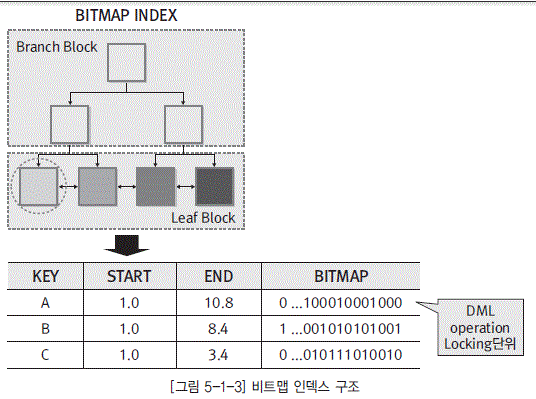

  * [그림 5-1-3] 비트맵 인덱스 구조">

비트맵 인덱스는 다중 조건을 만족하는 튜플의 개수를 계산하는 데 아주 적합하다. 이러한 현상은 비트맵 인덱스가 B+ 트리 인덱스에 비해 저장 공간이 획기적으로 줄고 키 값의 비교를 비트 연산으 로 처리하므로 비교 연산도 획기적으로 줄어들기 때문이다. 그 외에 비트맵 인덱스가 가지는 장점으 로 압축을 들 수 있다. 비트맵은 키 값 단위로 생성되므로 동일한 값이 반복될 확률이 높아 압축 효율 도 매우 좋아진다.

[표 5-1-6] B-tree와 Bitmap 구조 비교

| 구분 | B-tree | Bitmap |
|----|
 | 구조 특징|Root block, branch block, leaf block으로 구성되며, 인덱스 깊이를 동일하게 유지하는 트리 구조|키 값이 가질 수 있는 각 값에 대해 하나의 비트맵을 구성 |

 | 사용 환경|OLTP|DW, Mart 등 |

 | 검색 속도|처리 범위가 좁은 데이터 검색 시 유리함|다중 조건을 만족하는 데이터 검색 시에 유리함(특히, 비정형 쿼리) |

 | 분포도|데이터 분포도가 좋은 칼럼에 적합|데이터 분포도가 나쁜 칼럼에 적합 |

 | 장점|입력, 수정, 삭제가 용이함|비트 연산으로 OR 연산, NULL 값 비교 등이 가능함 |

 | 단점|처리 범위가 넓을 때 수행 속도 저하|전체 인덱스 조정의 부하로 입력, 수정, 삭제가 어려움 |

### 다. 함수 기반 인덱스

사원 테이블에서 이름이‘MIKE’로 시작하는 자료를 찾는 전형적인 방법은 Where절에 “like name='MIKE'”처럼 사용하는 것이다. NAME이라는 칼럼에 인덱스가 생성되어 있다면 옵티마이저 는 해당 인덱스를 사용해 자료를 찾을 것이다. 그런데 “like Upper(name) = 'MIKE'”처럼 조건절을 기술한다면 인덱스 칼럼에 변형이 일어나므로 옵티마이저는 인덱스를 사용하지 않고 Full Table Scan을 하게 된다.

그러나 함수 기반 인덱스(Function-based indexes)는 함수(function)나 수식(expression)으 로 계산된 결과에 대해 B+ 트리 인덱스나 Bit-Map Index를 생성, 사용할 수 있는 기능을 제공한 다. 함수 기반 인덱스에서 사용되는 함수는 산술식(Arithmetic expression), PL/SQL Function, SQL Function, Package, C callout이 가능하지만 동일한 입력 값에 대해 시간의 흐름에 결과 값 이 변경되는 함수에는 적용이 불가능하다. 또한 Object Type도 해당 칼럼에 정의된 method에 대 해 함수 기반 인덱스의 생성이 가능하지만 LOB, REF Type, Nested Table Column 또는 이들을 포함하고 있는 Object type에 대해서는 함수 기반 인덱스의 생성이 불가능하다.

  * [그림 5-1-4] 비트맵 조인 인덱스 구조">

### 라. 비트맵 조인 인덱스

비트맵 조인 인덱스는 단일 객체로만 구성되었던 기존 인덱스와 달리 여러 객체의 구성 요소(칼럼) 로 인덱스 생성이 이뤄지므로 기존의 인덱스와 테이블 액세스 방법과는 구조가 다르다.

비트맵 조인 인덱스의 물리적인 구조는 비트맵 인덱스와 완전히 동일하다. 단지 인덱스의 구성 칼 럼이 베이스 테이블의 칼럼 값이 아니라 조인된 테이블의 칼럼 값이라는 차이만 존재할 뿐이다. 즉, 비트맵 조인 인덱스는 기본 테이블을 기준으로 조인된 결과를 기존의 비트맵 인덱스와 같은 구조로 저장하여 카디날리티가 낮은 데이터의 액세스에 좋은 성능을 얻을 수 있게 하는 방법이다.

### 마. 도메인 인덱스

도메인 인덱스는 오라클8i에서부터 새롭게 도입된 개념으로 개발자가 자신이 원하는 인덱스 타입 을 생성할 수 있게 함으로써 인덱스 시스템에 많은 확장을 가져다주었다.

즉, 데이터베이스에는 아직 존재하지도 않는 새로운 구조의 인덱스 타입을 자신이 스스로 정의하 여 DBMS에서 지원하는 인덱스처럼 사용할 수 있다. InterMedia text index나 오라클 9i부터 지원 되는 Context 타입 인덱스와 Catalog 타입 인덱스 등은 모두 비정형 테스트를 빠르게 검색하려고 새롭게 도입된 도메인 인덱스

# 제4절 분산 설계

## 1. 분산 데이터베이스 개요

하나의 논리적 데이터베이스가 네트워크상에서 여러 컴퓨터에 물리적으로 분산되어 있지만 사용 자가 하나의 데이터베이스처럼 인식할 수 있도록 논리적으로 통합되어 공유되는 데이터베이스를 분 산 데이터베이스라 한다.

분산 데이터베이스는 데이터베이스를 하나 이상의 장소에 분산시켰기 때문에 이들을 하나의 논리적 인 데이터베이스로 인식하려면 지역 데이터베이스 관리 시스템 이외에 각 장소의 정보를 교환하고 관 리해 주는 시스템이 필요한데, 이러한 역할을 수행하는 시스템이 분산 데이터베이스 관리 시스템이다.

  * [그림 5-1-5] 분산 데이터베이스 구조">

분산 데이터베이스의 장점은 자신의 데이터를 지역적으로 제어하여 원격 데이터에 대한 의존도를 감소시키고 단일 서버에서 불가능한 대용량 처리가 가능하며, 기존 시스템에 서버를 추가하여 점진 적 증가가 용이하다. 또한 데이터베이스를 사용하는 중에 한 사이트가 고장 나더라도 고장 난 사이트 의 데이터만 사용하지 못하게 됨으로써 신뢰도와 가용성이 향상된다.

분산 데이터베이스는 중앙 집중 방식에 비해 이러한 장점을 가지고 있지만 분산 처리에 의해 복잡 도가 증가하여 소프트웨어 개발 비용이 증가하고, 통제 기능이 취약하고, 분산 처리에 따른 오류 발 생 가능성이 증가하게 된다. 그리고 데이터가 물리적으로 저장된 장소와 해당 지역 시스템의 상황에 따라 응답 속도가 불규칙할 수 있으며, 데이터의 무결성을 완전히 보장하기는 불가능하다.

## 2. 분산 데이터베이스 관리 시스템

여러 개의 물리적인 데이터베이스를 논리적인 단일 데이터베이스처럼 인식하려면 사용자들이 데 이터가 물리적으로 어디에 배치되어 있는지, 또는 특정 지역 사이트에서 위치한 데이터를 어떻게 액 세스해야 하는지 알 필요가 없어야 한다. 이러한 특성을 데이터 투명성이라고 하며, 분산 데이터베이 스 관리 시스템은 다음과 같은 투명성이 제공될 수 있어야 한다.

  * 분할 투명성

분할 투명성은 사용자에게 전역 스키마가 어떻게 분할되었는지를 알려주는 역할을 한다. 즉, 사용 자가 입력한 전역 질의를 여러 개의 단편 질의로 변환해 주기 때문에 사용자는 전역 스키마가 어떻 게 분할되어있는지를 알 필요가 없게 된다. 분할의 방법은 수직 분할과 수평 분할이 있다. 수직 분 할은 한 릴레이션을 속성들의 부분 집합으로 이루어진 릴레이션들로 나누고, 수평 분할은 튜플들 의 집합으로 이루어진 릴레이션들로 나누는 것을 말한다.

  * 위치 투명성

위치 투명성은 사용자나 애플리케이션에서 어떤 작업을 수행하기 위해 분산 데이터베이스상에 존 재하는 어떠한 데이터의 물리적인 위치도 알 필요가 없어야 한다는 것이다. 즉, 사용자는 데이터의 위치나 입력 시스템의 위치와 무관하게 동일한 명령을 사용하여 데이터에 접근할 수 있어야 한다.

분산 데이터베이스 관리 시스템은 위치 투명성을 보장하기 위해 분산 데이터베이스에 저장되어 있 는 모든 데이터에 대한 메타 데이터와 위치 정보를 참조하여 지역 트랜잭션은 지역 데이터베이스 에 처리를 일임하고, 전역 트랜잭션은 다른 지역의 데이터베이스에 처리를 일임하여 결과를 통보 받는다.

  * 중복 투명성

중복 투명성은 어떤 데이터가 중복되었는지, 또는 어디에 중복 데이터를 보관하고 있는지 사용자 가 알 필요가 없어야 한다는 것이다. 즉, 사용자는 자신이 사용하고 있는 데이터가 논리적으로 유 일하다고 생각할 수 있어야 한다.

중복 투명성과 위치 투명성이 보장될 경우 분산 데이터베이스 관리 시스템은 사용자의 데이터 처 리 요청을 가장 적은 시간이 걸리는 지역을 선택하여 처리하므로 수행 속도가 향상되지만 복제된 데이터에 대한 갱신을 처리하려면 복제된 모든 지역의 데이터를 갱신하여야 하므로 데이터 무결성 을 보장하기가 더 어려워진다.

  * 장해 투명성

장애 투명성은 데이터베이스가 분산되어 있는 각 컴퓨터 시스템이나 네트워크에 장애가 발생하더 라도 데이터의 무결성이 보장되어야 한다는 것이다. 즉, 분산 데이터베이스는 그 구성 요소의 장애 에 무관하게 트랜잭션의 원자성이 유지되어야 한다.

  * 병행 투명성

병행 투명성은 다수 트랜잭션이 동시에 수행되어도 결과의 일관성이 유지되어야 하는 성질을 말한 다. 분산 데이터베이스 관리 시스템은 분산 트랜잭션의 일관성을 유지하기 위해 잠금(Locking)과 타임스탬프(Timestamp)의 두 가지 방법을 주로 사용한다.

## 3. 분산 설계 전략

분산 데이터베이스의 주요 목적은 사용자 및 애플리케이션 프로그램이 원격지 데이터와 지역 데이 터에 접근할 수 있도록 하는 것이다. 그런데 분산 데이터베이스는 위에서 언급한 것처럼 잘못 설계할 경우 복잡성과 비용이 증가하고 불규칙한 응답 속도, 데이터 무결성에 대한 위협이 발생할 수 있으므로 분산 데이터베이스 설계 시에는 분산 환경의 형태와 분산 데이터베이스의 구조가 현재 구현된 시스템에 적합한지를 고려해 분산 데이터베이스의 장점은 향상시키고 단점은 최소화될 수 있도록 설계해야 한다.

기본적인 전략으로는 수직 분할, 수평 분할, 복제의 세 가지 방법을 사용하지만 데이터의 분할 및 복제, 지역 복제본의 갱신 주기, 데이터베이스의 유지 방식에 따라 다음과 같은 여러 가지 전략으로 나눌 수 있다.

  * 중앙 집중형 데이터베이스처럼 한 컴퓨터에서만 데이터베이스를 관리하고 여러 지역에서 접근할 수 있도록 하는 방식

  * 지역 데이터베이스에 데이터를 복제하고 실시간으로 복제본을 갱신하는 방식

  * 지역 데이터베이스에 데이터를 복제하고 주기적으로 복제본을 갱신하는 방식

  * 데이터 분할 시 전체 지역 데이터베이스를 하나의 논리적 데이터베이스로 유지하는 방식

  * 데이터 분할 시 각각의 지역 데이터베이스들을 독립된 데이터베이스로 유지하는 방식

## 4. 분산 설계 방식

분산 설계는 먼저 전역 릴레이션을 논리적으로 중복되지 않는 작은 단위로 나누고, 이를 여러 노드에 할당하는 순서로 진행된다. 이때 할당의 기준이 되는 작은 단위를 분할(Fragment)이라고 하며, 분할 스키마에 의하여 전역 릴레이션과의 사상(mapping) 관계가 관리된다.

분할이 할당될 때에는 하나의 분할이 분산 네트워크상에 있는 하나의 노드에만 존재하도록 하여 단일 복사본(single copy)을 유지하거나 복제(replication)하여 유지할 수 있다. 이처럼 분할은 분산 데이터베이스에 중복 혹은 비중복되어 존재하게 되는데, 할당 스키마에 의해 분할이 어느 노드에 위치하는지를 정의한다.

예를 들어, 고객 테이블이 고객 관리 서버에 존재하고 다른 서버에는 고객 테이블이 존재하지 않게 설계하거나 사용하는 모든 서버에 고객 테이블이 복제되도록 설계할 수 있다.

### 가. 테이블 위치 분산

테??는 것이다. 테이블이 전역적으로 중복되지 않 는다. 예를 들어 고객 테이블은 고객 관리 서버에 존재하고 다른 서버에는 고객 테이블이 존재하지 않게 설계하는 것이다. 이를 위해서는 각각의 테이블마다 위치가 다르게 지정을 위해 테이블마다 존재할 서버를 결정해야 한다.

### 나. 분할(Fragmentation)

분할은 앞에서 기술한 바와 같이 분할 방법을 먼저 결정하고 결정된 분할을 할당하는 개념으로, 완 전성, 재구성, 상호 중첩 배제의 3가지 분할 규칙이 준수되어야 한다.

  * 완전성(Completeness)

완전성은 분할 시에 전역 릴레이션 내의 모든 데이터가 어떠한 손실도 없이 분할로 사상 (mapping)되어야 한다는 것으로 분할의 대상이 전체 데이터를 대상으로 이뤄져야 함을 의미한다.

  * 재구성(Reconstruction)

분할은 관계 연산을 사용하여 원래의 전역 릴레이션으로 재구성이 가능하여야 한다.

  * 상호 중첩 배제(Dis-jointness)

상호 중첩 배제는 분할 시에 하나의 분할에 속한 데이터 항목이 다른 분할의 데이터 항목에 속하지 않아야 한다는 의미로, 수평 분할은 각각의 분할에 속한 튜플들이 서로 중첩되지 않아야 하고, 수 직 분할은 식별자를 제외한 속성들이 중복되지 않아야 한다.

분할 방법은 로우(Row) 단위로 분리하는 수평 분할 방법과 테이블 칼럼을 분할하는 수직 분할이 있다.

  * 수평 분할

수평 분할은 특정 속성의 값을 기준으로 분할을 수행한다. 속성 값에 의해 서버 간 데이터가 상호 배타적으로 존재하므로 분할을 통합하여도 식별자의 중복이 발생하지 않는다.

  * 수직 분할

수직 분할은 속성을 기준으로 분할을 수행한다. 튜플을 기준으로 분리하지 않았기 때문에 각 서버 에는 동일한 식별자를 가진 튜플이 중복되어 존재한다. 동일한 식별자 구조를 가지므로 식별자를 이용하여 분할 전 릴레이션을 재구성할 수 있다.

### 다. 할당(Allocation)

할당은 동일한 분할을 복수 서버에 생성하는 분산 방법으로, 분할의 중복이 존재하는 할당 방법과 중복이 존재하지 않는 할당 방법이 있다. 중복되지 않는 할당 방식은 최적의 노드를 선택하여 분할이 분산 데이터베이스상에서 하나의 노드에서만 존재하도록 하는 것이다. 그런데 애플리케이션은 릴레 이션을 상호 배타적인 분할로 분리하기 어려운 요구 사항을 가지는 경우가 대부분이므로 분할 간의 의존성을 무시한 이 방법은 비용이 증가하고 성능상 문제를 야기할 수도 있다.

분할이 중복되지 않아 비용이 증가하고 성능이 저하된다면 각각의 노드에 분할을 중복하여 할당하 는 방법을 고려하여야 한다. 이때 데이터 복제는 실시간 처리의 필요성이 없는 경우 야간 일괄 복제 방식을 사용하도록 한다.

복제는 분할의 일부만 복제하는 부분 복제와 데이터베이스 전체를 복제하는 완전 복제 두 가지 방 식으로 구성이 가능하다.

  * 부분 복제

전역 서버 테이블의 일부 데이터를 지역 서버에 복제하는 방식이다.

  * 광역 복제

전역 서버 테이블의 전체를 지역 서버에 복제하는 방식이다.

## 5. 데이터 통합

분산 설계는 최적의 비용으로 지역적으로 분산된 데이터베이스에서 데이터 일관성을 유지할 수 있 는가에서 출발했다. 현재는 데이터 통합이라는 관점에서 분산아키텍처의 단점을 보완하고 정보의 적 시성과 실시간 데이터 교환이라는 목적으로 통합 아키텍처를 구축한다. 통합 방식은 DW를 이용하 는 방법과 EAI(Enterprise Application Integration)를 이용하는 방법, 두 가지를 혼합해 통합하 는 방법이 있다.

# 제5절 보안 설계
                            
데이터베이스 보안이란 데이터베이스 정보가 비인가자에 의해 노출, 변조, 파괴되는 것을 막는 것 이다. 사용자가 원하는 작업을 하려면 필요한 자원에 대한 허가가 있어야 한다. “누가, 어느 데이터 에 대해, 무슨 연산을 수행할 수 있도록 허락받았는가?”를 명시적으로 정의하고, 정의된 내용을 구현 하는 과정이 데이터베이스 보안 설계이다.

보안 설계의 주요 목표는 권한이 없는 사용자에게 정보가 노출되는 것을 방지하고, 권한이 있는 사 용자는 데이터에 접근하여 수정할 수 있도록 보장하는 것이다. 이러한 목표를 달성하려면 일관성 있 는 보안 정책이 수립되어야 하며, 이러한 보안 정책은 보안 모델을 통해 운영체제와 DBMS에 의하 여 보장되어야 한다.

일반적으로 데이터베이스 관리 시스템은 데이터 보안을 유지하기 위해 접근 통제 기능, 보안 규칙, 뷰(View), 암호화 등과 같은 다양한 보안 모델의 기능을 제공하고 있다.

다음은 일관성 있는 데이터베이스 보안 정책을 수립하기 위해 요구되는 사항들이다.

  * 자원에 접근하는 사용자 식별 및 인증 - 사용자, 비밀번호, 사용자 그룹

자원에 접근하는 사용자는 인증을 통해 그 실체가 보장되어야 한다. 누군가가 자신의 실체를 인증 받았다면 다른 임의의 사용자가 그 사람의 인증을 사용할 수 없도록 보장되어야 한다.

  * 보안 규칙 또는 권한 규칙에 대한 정의

보안 규칙은 어떤 사용자가 접근할 수 있는 데이터와 그 데이터에 대하여 허용된 행위나 제한 조건을 기록하는 것으로, 보안 모델을 통해 구현된다.

  * 사용자의 접근 요청에 대한 보안 규칙 검사 구현 - 보안 관리 시스템 구현

보안 규칙에 대한 검사 구현은 운영체제와 DBMS를 활용하여 보장되어야 한다.

## 1. 접근 통제 기능

접근 통제는 보안 시스템의 중요한 기능적 요구 사항 중 하나로, 임의의 사용자가 어떤 데이터에 접근하고자 할 때 접근을 요구하는 사용자를 식별하고, 사용자의 요구가 정상적인 것인지를 확인, 기 록하고 보안 정책에 근거하여 접근을 승인하거나 거부함으로써 비인가자의 불법적인 자원 접근 및 파괴를 예방하는 보안 관리의 모든 행위를 의미한다.

데이터베이스 보안을 위한 접근 통제는 크게 강제적 접근 통제와 임의적 접근 통제 두 가지로 분류한다.

  * 임의적 접근 통제(DAC, Discretionary Access Control)

임의적 접근 통제는 사용자의 신원에 근거를 두고 권한을 부여하고 취소하는 메커니즘을 기반으로 하고 있다. 여기서 권한은 사용자가 어떤 객체에 대해 특정 행위를 할 수 있도록 허용하는 것으로, 임의적 접근 통제에서 객체를 생성한 사용자는 그 객체에 대해 적용 가능한 모든 권한을 가지게 되 고, 또한 이 권한들을 다른 사용자에게 허가할 수 있는 허가 옵션도 가지게 된다. 그 외 사용자는 어떤 객체에 대해 데이터 조작 행위를 하려면 DBMS로부터 권한을 부여 받아야 한다.

데이터베이스 관리 시스템은 임의적 접근 통제를 지원하기 위해 SQL의 GRANT와 REVOKE 명령어를 사용한다. GRANT는 사용자에게 객체에 대한 권한을 부여하기 위해 사용하는 명령어이 고, REVOKE는 부여한 권한을 취소하기 위해 사용하는 명령어이다.

다음은 GRANT에 대한 구문 형식을 표현한 것이다.

  * GRANT [권한] ON [객체] TO [사용자] [WITH GRANT OPTION]">

다음은 REVOKE에 대한 구문 형식을 표현한 것이다.

  * REVOKE [권한] ON [객체] FROM [사용자]">

임의적 접근 통제는 권한 관리에 효과적이지만 통제의 기준이 사용자의 신분에 근거를 두고 있기 때문에 다른 사람의 신분을 사용하여 불법적인 접근이 이루어진다면 접근 통제 본래의 기능에 중 대한 결함이 발생한다. 그리고 트로이 목마 공격에 취약하다는 문제점을 가지고 있다. 그래서 보안 등급에 따라 데이터와 사용자를 분류하는 부가적인 보안 정책이 고려되어야 한다.

  * 강제적 접근 통제(MAC, Mandatory Access Control)

강제적 접근 통제는 주체와 객체를 보안 등급 중 하나로 분류하고, 주체가 자신보다 보안 등급이 높은 객체를 읽거나 쓰는 것을 방지한다. 각 데이터베이스 객체에는 보안 분류 등급이 부여되고 사 용자마다 인가 등급을 부여하여 접근을 통제하는 것이다. 읽기는 사용자의 등급이 접근하는 데이 터 객체의 등급과 같거나 높은 경우에만 허용된다. 수정 및 등록은 사용자의 등급이 기록하고자 하 는 데이터 객체의 등급과 같은 경우에만 허용한다. 이는 높은 등급 데이터가 사용자에 의해 의도적 으로 낮은 등급 데이터로 쓰여지거나 복사되는 것을 방지하기 위한 것이다.

## 2. 보안 모델

보안 모델이란 보안 정책을 실제로 구현하기 위한 이론적인 모델로 군사적 목적으로 개발된 기밀 성 모델, 데이터 일관성 유지에 중점을 둔 무결성 모델, 접근 통제 메커니즘에 기반을 둔 접근 통제 모델 등이 있다.

### 가. 접근 통제 행렬(Access control matrix)

접근 통제 행렬은 임의적 접근 통제를 위한 보안 모델로, 행은 주체를 나타내고, 열은 객체를 나타내며, 행과 열은 주체와 객체가 가지는 권한의 유형을 나타낸다.

  * 주체

데이터베이스에 접근할 수 있는 조직의 개체로 일반적으로 객체에 대하여 접근을 시도하는 사용자를 의미한다.

  * 객체

보호되고 접근이 통제되어야 하는 데이터베이스의 개체로, 테이블, 칼럼, 뷰, 프로그램, 논리적인 정보의 단위 등이 될 수 있다.

  * 규칙

주체가 객체에 대하여 수행하는 데이터베이스의 조작으로, 입력, 수정, 삭제, 읽기와 객체의 생성과 파괴 등이 존재한다. 그리고 객체가 프로그램으로 확장된다면 실행, 출력 등의 작업 유형을 정의할 수 있다.

[표 5-1-7] 접근 제어 매트릭스

|  | 사원 | 급여 | 상여 | 사원평가 |
|----|----|----|----|----|
| 김명민 | ALL | C/R/U/D | R | - |
| 김아중 | ALL | ALL | ALL | R |
| 하지원 | R | R | R | ALL |

### 나. 기밀성 모델

기밀성 모델은 군사용 보안 구조의 요구 사항을 충족시키기 위하여 정보의 불법적인 파괴나 변조 보다는 기밀성(Confidentiality) 유지에 초점을 둔 최초의 수학적인 모델로, 다른 보안 모델과의 비 교를 위한 참조 모델로서 이용되지만 정보의 무결성이 비밀성보다 중요하게 요구되는 상용 환경에 적용하기에는 부적합한 모델이다.

이 모델은 각 주체(사용자, 계정, 프로그램)와 객체(릴레이션, 튜플, 속성, 뷰, 연산)를 보안 등급인 극비(Top Secret), 비밀(Secret), 일반(Confidential), 미분류(Unclassified) 중의 하나로 분류하 며, 데이터 접근에 대해 주체/객체의 등급을 기반으로 다음과 같은 제약 조건을 준수하여야 한다.

  *  *단순 보안 규칙* ?: 주체는 자신보다 높은 등급의 객체를 읽을 수 없다.

인가 받은 비밀 등급이 낮은 주체는 비밀 등급이 높은 객체를 읽어서는 안된다는 정책으로 BLP는 기밀성 보장을 위한 보안 모델이므로 기밀성 보장을 위해 낮은 비밀 등급을 가진 주체가 높은 비밀 등급의 객체에 접근하는 것은 당연히 통제되어야 한다.

  *  **(스타)-무결성 규칙* ?: 주체는 자신보다 낮은 등급의 객체에 정보를 쓸 수 없다. 높은 비밀 등급을 인가 받은 주체가 자신이 접근 가능한 비밀 정보를 낮은 등급으로 복사하여 정보를 유출시키는 행 위를 금지하여 정보의 기밀성(Confidentiality)을 보호하고자 하는 정책이다.

  *  *강한 *(스타) 보안 규칙* ?: 주체는 자신과 등급이 다른 객체에 대하여 읽거나 쓸 수 없다.

### 다. 무결성 모델

정보의 일방향 흐름 통제를 이용하여 정보의 비밀성을 제공하는 기밀성 모델에서 발생하는 정보의 부당한 변경 문제를 해결하기 위해 개발된 무결성 기반의 보안 모델로, 기밀성 모델처럼 주체와 객체 의 보안 등급으로 표현되며, 다음과 같은 제약 조건을 준수하여야 한다.

  *  *단순 보안 규칙* ?: 주체는 자신보다 낮은 등급의 객체를 읽을 수 없다.

  *  **(스타)-무결성 규칙* ?: 주체는 자신보다 높은 등급의 객체에 정보를 쓸 수 없다.

## 3. 접근 통제 정책

접근 통제 정책은 어떤 주체(Who)가 언제(When), 어떤 위치에서(Where), 어떤 객체(What)에 대하여, 어떤 행위(How)를 하도록 허용할 것인지 접근 통제의 원칙을 정의하는 것으로, 신분-기반 정책, 규칙-기반 정책, 역할-기반 정책 등이 있다.

<dl class="t_dot">

  * 신분-기반 정책

  * 개인 또는 그들이 속해 있는 그룹들의 신분에 근거하여 객체에 대한 접근을 제한하는 방법으로, 한 사용자가 하나의 객체에 대하여 허가를 부여받는 IBP(Individual-Based Policy)와 다수의 사용자가 하나의 객체에 대하여 동일한 허가를 부여받는 GBP(Group-Based Policy)로 표현할 수 있다(예 : 경영진, 관리자, 감사, CEO 등).

</dl>

<dl class="t_dot">

  * 규칙-기반 정책

  * 강제적 접근 통제와 동일한 개념으로, 주체가 갖는 권한에 근거하여 객체에 대한 접근을 제한한다. 이 정책은 사용자 및 객체별로 부여된 기밀 분류에 따른 정책(MLP)과 조직 내의 부서별로 구분된 기밀 허가에 따르는 정책(CBP)으로 표현될 수 있다.

</dl>

<dl class="t_dot">

  * 역할-기반 정책

  * 역할-기반 정책은 GBP의 한 변형된 형태로 생각할 수 있다. 즉, 정보에 대한 사용자의 접근이 개별적인 신분이 아니라 개인의 직무 또는 직책에 따라서 결정된다(예 : 인사 담당자, 출고 담당자, DBA 등).

</dl>

## 4. 접근 통제 매커니즘

사용자 통제를 기술적으로 구현하는 방법은 패스워드, 암호화, 접근 통제 목록 적용, 제한된 사용자 인터페이스, 보안 등급 등의 방법이 이용된다.

<dl class="t_dot">

  * 패스워드

  * 어떤 통신 주체가 자신이라고 주장하는 것을 증명하려고 사용하는 인증 방법 중 하나로, 시스템을 액세스할 때 패스워드를 제시하면 인증 시스템이 보유 목록과 비교하여 사용자의 신분을 확인하는 기법이다.

</dl>

<dl class="t_dot">

  * 암호화

  * 암호화란 인간에 의해 해석될 수 없는 형태로 데이터를 변형시키는 것으로, 통신망을 통해 중요한 데이터를 전송할 때 무단 도용을 방지하기 위해 주로 사용된다. 암호화 시스템은 데이터를 암호화하는 프로그램과 암호화된 데이터를 풀 수 있는 복호화 프로그램으로 구성되며, 데이터에 접근하기 위해서는 복호화 키를 소유하여야 한다.

</dl>

<dl class="t_dot">

  * 접근 통제 목록(Access Control List)

  * 접근 통제 행렬의 문제점을 해결하기 위해 객체를 기준으로 접근 통제 정보를 저장하는 방식으로, 어떤 사용자들이 객체에 대하여 어떤 행위를 할 수 있는지를 나타낸다. 접근 통제 목록은 주체의 수가 많아지면 관리가 어려워지므로 대부분의 운영체제에서는 객체에 대한 접근 권한을 동일한 권한을 가진 주체들의 그룹에 부여함으로써 접근 통제 목록의 관리를 용이하게 하고 있다.

</dl>

<dl class="t_dot">

  * 능력 리스트(Capability List)

  * 접근 통제 행렬의 문제점을 해결하기 위해 주체가 접근할 수 있는 객체와 접근 권한을 주체에 저장하는 방식이다.

능력 리스트는 비교적 객체가 적을 경우에 적합하다. 그러나 주어진 객체에 접근할 수 있는 사용자들을 파악하는 데는 많은 시간이 소요된다.

</dl>

<dl class="t_dot">

  * 보안 등급

  * 보안 등급은 주체나 객체 등에 부여된 보안 속성의 집합으로, 다단계 접근 통제 정책을 지원하기위해 각 주체와 객체를 보안 등급 중 하나로 분류하고, 데이터 접근 요청을 처리할 때 주체/객체의 보안 등급을 기반으로 접근 승인 여부를 결정하는 방식이다.

</dl>

<dl class="t_dot">

  * 통합 정보 매커니즘

  * 과거에는 접근 통제 목록, 능력 리스트, 보안 등급과 같은 매커니즘은 접근 통제 정책을 구현하는 별도의 방법으로 고려되어 왔다. 그러나 최근에는 보안 요구의 다양화와 복잡성으로 인해 적어도 두 가지 이상의 복합된 특성으로 구현되는 추세이다.

</dl>

## 5. 접근 통제 조건

접근 통제 매커니즘의 취약점을 보완하기 위해 접근 통제 정책에 적용할 수 있는 조건들로, 어떤 임계 값, 사용자 간의 동의, 사용자의 특정 위치 및 시간 등을 지정할 수 있다.

<dl class="t_dot">

  * 값 종속 통제(Value-Dependent Control)

  * 대부분의 통제 정책들은 객체에 저장된 데이터의 값에 상관없이 동일한 접근 통제 허가를 부여하 지만 객체에 저장된 값에 따라 접근 통제 허가가 다양화되어야 하는 경우도 많이 발생한다. 예를 들어, 계약 금액에 따라 기밀 수준이 다르다면 특정 임계 값이나 계약 금액에 따라 보안 등급을 설 정하고 해당 보안 등급을 가진 사용자만 접근을 허용해야 한다.

</dl>

<dl class="t_dot">

  * 다중 사용자 통제(Multi-User Control)

  * 지정된 객체에 대해 다수의 사용자가 연합하여 접근을 요청할 경우 접근 통제를 지원하기 위한 수 단이 제공되어야 한다. 예를 들어, 명시된 두 개인이 동의할 것을 요구하는 경우나 하나의 그룹에 서 다수결에 의하여 접근 통제를 수행할 필요가 있을 수 있다.

</dl>

<dl class="t_dot">

  * 컨텍스트 기반 통제(Context-Based Control)

  * 이 통제 방법은 특정 시간, 네트워크 주소 등 확인이 가능한 접근 경로나 위치, 인증 수준 등과 같 은 외부적인 요소에 의존하여 객체의 접근을 제어하는 방법으로, 다른 보안 정책들과 결합하여 보 안 시스템의 취약점을 보완하기 위해 주로 사용된다. 예를 들어, 업무 시간대인 월요일에서 금요일 까지 09:00 - 18:00 시간대에만 데이터 접근을 허용하는 것과 같다.

</dl>

## 6. 감사 추적

애플리케이션 및 사용자가 데이터베이스에 접근하여 수행한 모든 활동을 일련의 기록으로 남기는 기능으로, 오류로 인해 데이터베이스가 파괴되었을 때 복구하기 위한 중요한 정보로 사용하거나 데 이터베이스에 대한 부당한 조작을 파악하기 위한 수단으로 사용되기도 한다. 즉, 감사 추적을 실시하 므로 개인 책임성을 보조하고, 문제가 발생했을 때 사건의 재구성이 가능하게 된다. 사전에 침임 탐 지를 확인한다거나 사후 문제를 분석하여 보안을 강화하기 위해 필요하다.

감사 추적 시에는 사용자 실행 프로그램, 사용 클라이언트, 사용자, 날짜 및 시간, 접근하는 데이 터의 이전 값 및 이후 값 등을 저장한다.

# 제2장 데이터베이스 이용

# 제1절 데이터베이스 관리 시스템(DBMS)

## 1. 개념적 데이터베이스 관리 시스템 아키텍처

DBMS 서버는 인스턴스(Instance)와 데이터베이스(Database)로 구성된다. 인스턴스는 메모리 (Memory) 부문과 프로세스(Process) 부문으로 구성된다. 그 외 데이터베이스의 기동과 종료를 위하여 DBMS 환경을 정의한 매개변수 파일과 파일 목록(데이터 파일, 로그 파일)을 기록한 제어 파일이 있다.

  * [그림 5-2-1] 데이터베이스 관리 시스템 구조">

## 2. 데이터베이스 서버 시작과 종료

데이터베이스를 사용하려면 권한을 가진 데이터베이스 관리자가 DBMS 인스턴스를 시작해야 한 다. 인스턴스 시작은 매개변수 파일을 읽어야 한다. 매개변수 파일은 인스턴스와 데이터베이스에 대 한 구성 매개변수(초기화 매개변수)의 목록이 있는 텍스트 파일이다. 인스턴스 구성 매개변수를 특정 값으로 설정하여 인스턴스의 메모리와 프로세스 설정을 초기화한다.

대부분의 초기화 매개변수는 다음 그룹 중 하나이다.

  * 파일과 같은 항목에 이름을 지정하는 매개변수

  * 최대 값과 같은 한계를 설정하는 매개변수

  * 메모리 크기와 같은 용량에 영향을 주는 매개변수(가변 매개변수라고 함)

  * 인스턴스를 시작할 데이터베이스 이름

  * 로그 파일의 처리 방법

  * 데이터베이스 제어 파일의 이름과 위치

### 가. 데이터베이스 서버 시작

데이터베이스 서버의 기동은 인스턴스 시작, 데이터베이스 마운트(Mount), 데이터베이스 오픈(Open)순으로 진행된다.

  * 인스턴스 시작

매개변수 파일을 읽어 초기화 매개변수 값을 결정하고 데이터베이스 정보를 위해 사용되는 메모리나. 데이터베이스 서버 종료 데이터베이스 서버 종료는 데이터베이스 닫기, 마운트 해제, 인스턴스 종료 순으로 진행된다.

  * 데이터베이스 닫기

데이터베이스를 닫으면 메모리에 있는 모든 데이터베이스 데이터와 로그를 데이터 파일과 리두 로그 파일에 각각 기록하고 온라인 데이터 파일과 온라인 로그 파일을 닫는다. 이때부터 데이터베이스는 닫혀 있어 정상적인 작업을 수행할 수 없다. 그러나 제어 파일은 열린 상태이다.

  * 마운트 해제

데이터베이스 마운트를 해제하여 데이터베이스와 인스턴스 간의 관계를 끊고 데이터베이스의 제어 파일을 닫는다.

  * 인스턴스 종료

데이터베이스를 종료하는 마지막 단계로 인스턴스가 종료되면서 할당된 공유 영역이 메모리에서 제거되고 백그라운드 프로세스가 종료된다.

## 3. 데이터베이스 구조

### 가. 데이터 딕셔너리

데이터 딕셔너리는 데이터베이스의 가장 주요한 부분 중 하나이다. 연관된 데이터베이스 정보를 제공하는 읽기 전용 테이블 또는 뷰 집합이다. 데이터 딕셔너리에는 다음 정보가 있다.

  * 데이터베이스의 모든 스키마 객체 정보

  * 스키마 객체에 대해 할당된 영역의 사이즈와 현재 사용 중인 영역의 사이즈

  * 열에 대한 기본 값

  * 무결성 제약 조건에 대한 정보

  * 사용자 이름, 사용자에게 부여된 권한과 역할

  * 기타 일반적인 데이터베이스 정보

DBMS마다 제공되는 딕셔너리 정보의 양에는 차이가 있지만 데이터베이스의 형상을 관리하는 데 중요한 정보를 제공한다. 그 외 작업 수행 시 현재 데이터베이스 작업을 기록하는 동적 성능 테이블이 있다. 동적 성능 테이블은 세션, 록킹, SQL pool 등 다양한 정보를 제공하므로 데이터베이스 모니터링에 이용된다.

### 나. 데이터베이스, 테이블 스페이스 및 데이터 파일

데이터는 테이블을 통해서 논리적으로는 테이블스페이스에, 물리적으로는 해당 테이블스페이스와 연관 데이터 파일에 데이터를 저장한다.

### 다. 데이터 블록, 확장 영역 및 세그먼트 간의 관계

DBMS는 데이터베이스의 모든 데이터에 대한 논리적 데이터베이스 영역을 할당한다. 데이터베이스 영역의 할당 단위는 데이터 블록(Data block), 확장 영역(Extent), 세그먼트(Segment)이다.

  * 데이터 블록

DBMS가 데이터를 저장하는 가장 작은 단위는 데이터 블록(또는 페이지)이라 한다. 하나의 데이터 블록은 디스크상의 물리적 데이터베이스 영역의 특정 바이트 수에 해당한다. 일반적으로 2K, 4K, 8K, 16K 등 다양하다. 과거에는 데이터베이스에 단일 블록 사이즈를 이용했으나 현재는 테이블 스페이스별로 사이즈를 결정할 수 있다. 데이터베이스 용도가 OLTP, DW 등 다양해져 데이터 블 록을 사이즈가 다르게 사용할 수 있다. 데이터 블록은 1회 물리적인 디스크 입출력량을 결정하므 로 성능에 직접적인 영향이 있다. DBMS에 따라 블록의 구조도 차이가 있지만 확장 가능 영역인 Free space에 따라 데이터의 체인을 억제할 수 있는 방법을 확보해야 한다.

  * [그림 5-2-2] 블록 구조">

  * 데이터 확장 영역(Extent)

확장 영역은 특정 유형의 정보를 저장하기 위해 할당된 몇 개의 연속적인 데이터 블록이다. 테이블 을 생성하면 DBMS는 지정된 몇 개 데이터 블록의 초기 확장 영역을 테이블 데이터 세그먼트에 할 당한다. 아직 행을 삽입하지 않았지만 초기 확장 영역에 해당되는 데이터 블록은 해당 테이블의 행에 대해 예약된 것이다. 예약된 데이터 블록이 모두 차면 새로운 증분 확장 영역을 자동으로 할당 한다. 확장 영역의 크기와 한계를 결정함으로써 불필요한 저장 공간 낭비를 줄이고 무한정 확장되 는 것을 방지할 수 있다. 확장된 영역은 데이터를 삭제하여도 확장된 영역을 반환하지 않는다. 생 성된 객체를 Drop하거나 Truncate해야 테이블스페이스로 반환된다. 아니면 직접 해제 명령 SQL 구문을 사용하여 해제할 수 있다.

  * 세그먼트(Segment)

테이블 스페이스 내에 어떤 논리적인 구조를 정의하기 위해 할당한 확장 영역의 집합으로, 테이블, 인덱스, 임시용 세그먼트가 지원된다. 각 테이블은 하나 이상의 확장 영역을 할당하여 해당 테이블 의 데이터 세그먼트를 형성하고, 각 인덱스는 하나 이상의 확장 영역을 할당하여 테이블의 인덱스 세그먼트를 형성한다.

## 4. 메모리 구조

  * DBMS 정보 저장

DBMS는 다음과 같은 정보를 저장하기 위해 메모리를 사용한다.

  * 실행되는 프로그램 코드

  * 현재 사용하지 않더라도 접속되어 있는 세션 정보

  * 프로그램 실행되?하거나 교환되는 정보(예 : 록킹 정보)

  * 보조 메모리에 영구적으로 저장된 캐시 데이터

메모리는 사용 용도에 따라 소프트웨어 코드 영역, 시스템 메모리 영역, 프로그램 영역으로 나눌 수 있다. 소프트웨어 코드 영역은 수행되고 있거나 수행될 수 있는 소프트웨어의 코드를 저장하기 위 한 메모리 영역이다. 시스템 메모리 영역은 모든 프로세스가 공유하는 메모리 영역으로 데이터베이 스 버퍼와 로그 버퍼로 구성되어 있다. 프로그램 영역은 프로세스가 시작될 때 DBMS에 의하여 할 당되는 비공유 메모리 영역으로, 프로세스에서 필요로 하는 데이터나 제어 정보 등을 저장한다.

  * [그림 5-2-3] DBMS 메모리 구조">

  * 데이터베이스 버퍼(Buffer)

데이터베이스 버퍼는 데이터 파일로부터 읽어 들인 데이터 블록의 복사본을 가지고 있다. 인스턴 스에 동시 접속된 모든 사용자 프로세스는 데이터베이스 버퍼에 대한 액세스를 공유한다. 버퍼는 더티 목록(Dirty list)과 LRU(Least Recently Used) 목록을 가지고 있다. 더티 목록은 더티 버 퍼를 가진다(더티 버퍼는 수정되었지만 아직 디스크에 기록되지 않은 버퍼이다). LRU 목록은 빈 버퍼, 현재 액세스 중인 고정된 버퍼, 더티 목록으로 이동되지 않은 더티 버퍼를 가진다.

데이터 액세스 순서는 다음과 같다.

  * 데이터베이스 사용자 프로세스가 데이터를 요구할 때 데이터베이스 버퍼에 있는 데이터를 검색한다.

  * 데이터를 찾으면 메모리에서 직접 데이터를 읽는다.

  * 데이터베이스 버퍼에 없으면 데이터 블록을 디스크의 데이터 파일에서 버퍼로 복사한다. 버퍼에 있는 데이터를 적중하면 수행 속도가 빠르다.

  * 데이터 블록을 디스크에서 버퍼로 읽어 들이기 전에 프로세스는 먼저 빈 버퍼를 찾는다. 프로세스는 끝에서부터 LRU(Least Recent Used) 목록을 검색한다. 프로세스는 빈 버퍼를 찾거나 버퍼의 임계점에 도달할 때까지 검색한다.

  * 더티 버퍼를 찾을 경우 이 버퍼를 더티 목록으로 이동시킨다.

  * 사용자 프로세스가 빈 버퍼를 찾으면 데이터 블록을 디스크에서 버퍼로 읽어 들이고 이를 LRU 목록이 MRU(Most Recent Used) 끝으로 이동시킨다.

사용자 프로세스가 전체 테이블을 스캔한 경우에는 테이블 블록을 버퍼로 읽어 들여 LRU 목록의 LRU 끝에 놓는다. 전체를 스캔하는 테이블은 짧은 시간 동안 사용될 가능성이 높으므로 더 자주 사용되는 블록이 남아 있도록 빨리 제거한다. 버퍼 캐시의 크기는 데이터를 요구했을 때 적중률에 영향을 준다. 크면 그만큼 요구한 데이터를 포함하고 있을 가능성이 크다. 고정된 캐시 사이즈에서 는 가능한 한 불필요한 데이터를 메모리에 올리지 않으면 적중률이 높아진다. 효과적인 인덱스 디 자인이나 SQL 사용으로 적중률을 높일 수 있다.

  * 로그 버퍼(Log Buffer)

로그 버퍼는 데이터베이스의 변경 사항 정보를 유지하는 것으로, 일반적으로 원형 버퍼를 사용한 다. Insert, delete, create, alter 또는 drop 작업으로 변경된 사항을 재구성하거나 재실행하는 데 필요한 정보인 REDO 입력 항목을 가진다. REDO 입력 항목은 데이터베이스 복구에 사용된 다. 로그 버퍼의 내용은 서버 프로세스에 의해서 로그 파일에 작성된다.

  * 공유 풀(Shared Pool)

공유 풀은 라이브러리 캐시, 딕셔너리 캐시, 제어 구조 등으로 구성되어 있다. 라이브러리 캐시는 SQL 영역, 저장 SQL 프로시저 영역, 제어 구조 등을 공유하고, 딕셔너리 캐시는 데이터 딕셔너리 정보를 공유한다. 공유 풀에는 LRU 알고리즘에 의해 영역을 할당하고 해제한다. 여러 세션이 사용 하는 공유 풀 항목은 원래 항목을 생성한 프로세스가 종료되어도 해당 항목이 유용한 한 계속 메모 리에 남아 있다. 이는 SQL을 실행하기 위한 파싱 오버 헤드와 처리가 최소한으로 유지되게 한다.

  * 정렬 영역(Sort Area)

정렬을 하려면 메모리에 영역이 필요하다. 인덱스를 생성하거나 SQL문에 GROUP BY 연산, ORDER BY가 있을 경우 정렬 작업을 한다. DBMS별이나 동일 DBMS라도 버전에 따라서 정렬 영역이 존재하는 영역이 차이가 있다. 정렬되어야 하는 데이터량이 메모리 영역을 초과할 때는 데이터를 작은 부분으로 나눈 후 각 부분을 개별적으로 정렬하고 개별적으로 정렬된 결과는 병합하여 최종 결과를 생성한다. 일정한 성능 을 유지하려면 정렬해야 할 대상이 클 경우 정렬 영역을 크게 한 후 작업을 실시하고 불필요한 정 렬 작업을 최소화 해야 한다.

## 5. 프로세스 구조

DBMS에서 프로세스는 사용자 프로세스와 DBMS 프로세스로 분류된다. DBMS 프로세스는 서버 프로세스와 백그라운드 프로세스로 나뉜다.

  * 사용자 프로세스

사용자 프로세스는 애플리케이션이나 데이터베이스 도구를 실행할 때 생성된다. 이때 세션이 만들어지고 세션은 사용자 프로세스와 데이터베이스 인스턴스 간 통신 경로가 된다.

  * 서버 프로세스

서버 프로세스는 사용자 프로세스와 통신을 하는 역할을 한다. 다중 스레드 서버 방식과 단일 서버 프로세스 방식이 있다. 다중 스레드 서버를 사용할 경우는 단일 서버 프로세스를 여러 사용자 세션 간에 공유한다. 단일 서버 프로세스 방식은 각 사용자 세션에 대해 하나의 서버 프로세스를 생성한다.

  * 백그라운드 프로세스

데이터베이스가 동작하기 위한 프로세스들로 구성되면 대부분의 DBMS에서 다중 프로세스 방식이다.

[표 5-2-1] DBMS 주요 백그라운드 프로세스

| 오라클 | SQL 서버 | 설명 |
|----|
|PMON

process monitor|ODS

Open data services|사용자 프로세스에 장애가 발생하면 프로세스 복구를 수행 |
|SMON

system monitor|DB cleanup/shrinking|인스턴스 시작 시 필요한 경우 고장 복구를 수행, 임시 세그먼트 정리 수행 |
|DBWn

Database Writers|Lazywriter thread|버퍼의 내용을 데이터 파일에 기록 |
|CKPT checkpoint|DB checkpoint thread|체크 포인트가 발생하면 데이터 파일의 헤더를 갱신 |
|LGWR

Log Writer|Log writer thread|로그 버퍼를 관리하여 로그 버퍼를 디스크의 로그 파일에 기록 |

# 제2절 데이터 액세스

## 1. 실행 구조

사용자는 데이터베이스 내에 있는 데이터를 조작하기 위해 데이터베이스에서 제공하는 인터페이 스를 사용한다. 대부분의 다중 사용자를 지원하는 데이터베이스는 클라이언트/서버 구조이며, 클라 이언트 부분에 사용자 인터페이스를 제공한다.

  * [그림 5-2-4] 사용자와 데이터베이스 인터페이스">

사용자는 데이터베이스를 이용할 수 있는 사용자 인터페이스에서 명령어를 입력하고 데이터베이 스에 결과를 요청하면 네트워크 서비스를 통하여 데이터베이스 인스턴스(엔진)에 전달된다. 전달된 명령어는 문법적인 오류나 의미적인 오류를 확인하고 옵티마이저(Optimizer)에 의해 SQL로 요구 된 결과를 최소의 비용으로 처리할 수 있는 최적의 처리 경로를 결정하여 실행 계획(Execution Plan)을 작성한다. 실행 계획에 의해 데이터베이스 엔진은 실행(Execution) 과정이 반복된다. 사용 자에게 전달될 데이터 결과가 있으면 네트워크 서비스를 통하여 정해진 버퍼 사이즈만큼씩 전달 (Fetch)한다.

### 가. 옵티마이저

관계형 DBMS에서 사용되는 언어는 SQL이다. SQL 언어의 특징은 사용자가 데이터베이스에서 자신이 원하는 데이터(What)만 정의하고 그 데이터를 어떻게(How) 구하는가는 DBMS가 자동으로 결정해 처리해 준다. 어떻게 처리할 것인가를 결정하는 것이 옵티마이저이다.

여러 개의 테이블들을 조인할 때 조인 순서, 조인 방법, 테이블 액세스 방법을 선택하는 것을 실행 계획이라고 한다. 옵티마이저는 가능한 실행 계획들을 모두 검토하고 이중에서 가장 효과적인 것을 결정한다. 옵티마이저가 최적의 실행 계획을 찾는 과정을 최적화라 한다.

최적화 과정은 주어진 SQL 질의를 처리할 수 있는 모든 실행 계획을 다 고려할 수 없으므로 비용 을 산정한다. 비용 산정은 데이터베이스 내의 데이터들에 대해 갖고 있는 통계 정보와 비용을 예측하 는 모델을 이용하여 비용을 계산한다. 이를 비용 기준 최적화(CBO, Cost-Based Optimization)라 한다. 이때 실행 계획에 대한 것은 예상 비용이며, 실제 수행할 때의 비용과는 차이가 있다. 비용 산 정의 과정 없이 일정한 액세스 방법에 따라 정해진 우선순위로 실행 계획을 작성하는 것을 규칙 기준 최적화(RBO, Rule-Based Optimization)라 한다.

SQL 튜닝은 특정 SQL 질의의 수행 시간을 단축하는 것이다. 옵티마이저와 관련한 방법으로는 SQL 재작성, 힌트 사용, 새로운 인덱스 추가, 통계 데이터의 추가/갱신 등을 통해 옵티마이저가 더 욱 더 효율적인 실행 계획을 생성하도록 하는 것이다.

### 나. SQL 실행 단계

사용자의 SQL 질의는 크게 다음 4단계를 거쳐서 수행된다.

<ol class="ct_num">
  * 1. 파싱(Parser)

  * 2. 옵티마이저(Query Optimizer)

  * 3. 로우 소스 생성(Row Source Generator)

  * 4. SQL 실행(SQL Execution Engine)

</ol>
  * 파싱(Parser) 단계

SQL의 구문(syntactic)과 의미(semantic)가 정확한지 검사하고, 참조된 테이블에 대해 사용자가 접근 권한을 가지고 있는지를 검사한다. 그리고 라이브러리 캐시에서 같은 SQL 문장이 존재하는 지 찾는다. 같은 SQL 문장 중에 같은 버전이 존재하면 기존 정보를 이용하여 실행하고, 존재하지 않으면 다음 단계를 진행한다.

  * 옵티마이저(Query Optimizer) 단계

앞에서 넘겨받은 결과 정보(parsed query)를 이용해 최적의 실행 계획을 선택한다.

  * 로우 소스 생성(Row Source Generator) 단계

옵티마이저에서 넘겨받은 실행 계획을 내부적으로 처리하는 자세한 방법을 생성하는 단계이다.

‘로우 소스’란 실행 계획을 실제로 구현하는 각 인터페이스를 지칭하는 말로, 테이블 액세스 방법, 조인 방법, 정렬(sorting) 등을 위한 다양한 로우 소스가 제공된다. 따라서 이 단계에서는 실행 계 획에 해당하는 트리 구조의 로우 소스들이 생성된다.

  * SQL 실행(SQL Execution Engine)

생성된 로우 소스를 SQL 수행 엔진에서 수행해 결과를 사용자에게 돌려주는 과정이다. 소프트 파싱(Soft Parsing)과 하드 파싱(Hard Parsing)은 크게 옵티마이저 단계의 포함 여부에 따른 차이이다. 즉, 소프트 파싱은 이미 최적화를 한 번 수행한 SQL 질의에 대해 옵티마이저 단계와 로우 소스 생성 단계를 생략하는 것이고, 하드 파싱은 이 두 단계를 새로 수행하는 것이다. 따라서 하 드 파싱은 통계 정보 접근과 실행 계획 탐색으로 인해 시간이 많이 걸린다.

## 2. 명령어

데이터베이스와 사용자 간의 통신을 하기 위해 사용자는 DBMS에서 제공하는 명령어를 사용한다. 이들 명령어는 DBMS마다 문법 차이는 있지만 ANSI SQL92 Entry Level을 준수하고 있다. 명령 어에 대한 분류 방법도 차이가 있으나 데이터 정의 언어(DDL), 데이터 조작 언어(DML), 제어 명령 어(Control Statements)로 나뉜다.

### 가. 데이터 정의 언어(DDL, Data Definition Language)

스키마 객체를 생성(CREATE)하고, 구조를 변경(ALTER)하고, 삭제(DROP), 명칭을 변경(Rename)하는 데 사용한다. 데이터베이스, 사용자, 테이블, 칼럼, 데이터 타입, 참조 무결성 제약 정의, 영역 무결성 제약 정의, 인덱스 등 모든 객체는 DDL에 의해서 관리된다.

DDL 실행은 현재 진행되는 트랜잭션에 대해 암시적으로 COMMIT을 실행하므로 트랜잭션 명령 어에서 제어할 수 없다. 생성, 변경, 삭제 작업은 실행 후 취소가 불가능하므로 사용상 주의가 필요 하다. Truncate 명령어는 데이터를 삭제하는 delete와 유사하지만 Truncate는 DDL이고 delete는 DML이므로 내부적으로 수행 구조가 다르다. 그 외 사용자 특권(Privilege)과 역할(Role)을 허가 (Grant)하고 취소(Revoke, Deny)하거나 데이터 사전에 코멘트를 추가하고 오디팅(Auditing) 옵션 을 설정하는 등의 명령어가 있다.

### 나. 데이터 조작 언어(DML, Data Manipulation Language)

DML은 데이터베이스에 있는 데이터를 조작할 수 있게 해주는 명령어로 DELETE, INSERT, SELECT, UPDATE 등이 대표적인 ANSI 표준 DML 명령어이다. 그 외 MERGE, LOCK TABLE, EXPLAIN PLAN 등이 있다. DML은 현재 트랜잭션을 암시적으로 처리 하지 않으므로 별도의 트랜 잭션 관리 명령어와 같이 수행한다.

DML문 처리 단계는 다음과 같다.

  * 1단계 커서 생성

커서는 SQL문에 대해 독립적으로 생성된다. 커서는 모든 SQL문에 사용될 수 있도록 생성된다. 대부분의 애플리케이션에서 커서는 자동으로 생성되지만 선행 컴파일러 프로그램에서는 커서 생 성이 암시적으로 발생할 수도 있고 명시적으로 선언될 수도 있다.

  * 2단계 명령문 구문 분석

SQL문을 변화하여 유효한 명령문인지 검증

  * 데이터 딕셔너리를 탐색해 테이블과 열 정의 검사

  * 구문 분석 잠금을 획득하여 객체 정의가 변경되지 않도록 함

  * 참조한 스키마 객체에 액세스 권한 검사

  * 명령문에 대한 최적의 실행 계획을 결정

  * 공유 SQL 영역으로 로드

  * 분산 명령문의 경우 명령문 모두 또는 일부를 원격 노드로 라우트

  * 3단계 질의 결과 설명(SELECT일 때)

데이터 유형, 길이, 이름 등 질의 결과의 특성을 판별한다.

  * 4단계 질의 결과 출력 정의(SELECT일 때)

질의에 대한 정의 단계에서 위치, 크기, 인출한 각 값을 받기 위해 정의된 변수의 데이터 유형을 지정한다.

  * 5단계 변수 바인드

값을 찾을 수 있는 메모리 주소를 지정한다.

  * 6단계 명령문 병렬화(병렬 처리일 때)

병렬화는 다중 서버 프로세스로 하여금 동시에 SQL문의 작업을 수행하도록 하므로 작업이 더 신속하게 완료될 수 있다.

  * 7단계 명령문 실행

SELECT나 INSERT문이면 데이터의 내용이 변경되지 않으므로 어떠한 행에 대해서도 잠금이 필요하지 않다. UPDATE, DELETE문에 영향을 받는 모든 행은 트랜잭션에 대한 다음 처리까지 잠 겨있어 데이터베이스의 다른 사용자는 사용할 수 없다.

  * 8단계 질의 로우 인출(SELECT일 때)

인출 단계에서 행이 선택되고 정렬된다. 연속적인 인출(Fetch)을 통해 마지막 행을 인출할 때까지 다른 결과 행이 읽혀진다.

  * 9단계 커서 닫기

### 다. 제어 명령어(Control Statement)

제어 명령어는 DBMS마다 사용자에게 제공하는 형태에 차이가 있다. 단순한 명령어 형태로 제공되 기도 하고 저장 프로시저 형태로 제공되기도 한다. 오라클과 MS-SQL을 비교하면 아래 표와 같다.

[표 5-2-2] 제어 명령어

| 구분 | Oracle | MS-SQL |
|----|----|----|
<tr>
<td rowspan="4">Transaction Control|COMMIT [work]|COMMIT [work|transaction] |
|ROLLBACK|ROLLBACK [work|transaction] |
|SAVEPOINT|SAVE TRAN[SACTION] |
|Set transaction|SET |

<tr>
<td rowspan="4">Session control|Alter session|SET |
|Set role|Sp_setapprole |
|Alter system|Sp_configure |
|Alter database|Sp_dboption |

트랜잭션 제어문은 1개 이상의 SQL문을 논리적으로 하나의 처리 단위로 적용하기 위해 사용하는 명령어이다. 트랜잭션의 처음과 종료는 명시적으로 COMMIT되거나 ROLLBACK을 처리한다.

세션 제어문은 실행하고 저장하는 SQL문에는 사용할 수 없으며 사용자 세션의 특성을 정의하는 명 령어이다. 개별적인 사용자 세션에 따라 환경 변수를 변경할 수 있다. 예를 들어, 대량의 배치 작업을 하기 위해 메모리 사이즈를 변경하거나 NLS 환경 변수를 클라이언트 프로그램과 동일하게 조정하는 등의 작업을 지원한다.

시스템 제어문은 시스템이나 데이터베이스 레벨에서 재기동(Restart) 없이 환경 변수 등을 조정할 수 있다. 데이터베이스 전체적으로 NLS 환경 변수를 변경하는 작업 등이 가능하다.

## 3. 저장 프로시저

데이터 조작 언어는 비절차적 언어이다. 대부분의 DBMS에서는 이를 보완하기 위해 절차적 언어 를 제공한다. 오라클은 PL/SQL로, MS-SQL은 Transaction-SQL로 지원한다. 절차적 언어를 이 용하여 저장 프로시저를 생성할 수 있다.

### 가. 저장 프로시저 설계 지침

높은 응집도와 낮은 결합도를 유지한 설계가 필요하다. 하나의 작업을 중점적으로 완료하도록 프 로시저를 정의한다. 여러 프로시저 코드에서 불필요하게 중복될 수 있는 공통적인 하위 작업이 있을 수 있으므로 여러 개의 서로 다른 하위 작업을 갖는 긴 프로시저는 정의하지 않는다. DBMS에서 제공되는 기능과 중복되는 프로시저는 정의하지 않는다. 선언적 무결성 제약 조건을 사용하여 수행할 수 있는 간단한 데이터 무결성 규칙을 프로시저로 정의하지 않는다.

### 나. 저장 프로시저의 장점

  * 보안

데이터 보안을 강제로 수행한다. 사용자는 작성자의 권한으로 실행되는 프로시저와 함수를 통해서 만 데이터에 액세스하도록 데이터베이스 작업을 제한할 수 있다. 프로시저를 실행하는 권한만 있 는 사용자는 프로시저를 호출할 수는 있지만 테이블 데이터를 조작할 수는 없다.

  * 성능

각각의 SQL문 실행과 비교할 때 네트워크를 통해 보내야 하는 정보의 양을 현격하게 줄인다. 한 번 정보를 보낸 후에는 사용될 때마다 호출되기 때문이다. 데이터베이스에서 프로시저를 컴파일한 상태로 사용되므로 실행 시 별도 컴파일이 필요 없고 공유 풀을 이용하여 재사용된다.

  * 메모리 할당

많은 사용자의 실행을 위해 프로시저의 단일 복사본만이 메모리에 로드된다. 동일한 코드를 공유 하면 애플리케이션에 의한 메모리 요구를 줄인다.

  * 생산성

개발 생산성을 증가시킨다. 프로시저 집합으로 애플리케이션을 설계하여 불필요한 코딩을 피하고 생산성을 증가시킨다. 작업 수행에 필요한 SQL문을 재작성하지 않고도 모든 애플리케이션에 의 해 호출될 수 있다. 데이터 관리 방법이 변경되면 사용하는 애플리케이션이 아닌 프로시저만 수정 하면 된다.

  * 무결성

애플리케이션의 무결성과 일관성을 향상시킨다. 검증된 프로시저는 다시 테스트하지 않고 많은 애 플리케이션에서 재사용할 수 있다. 프로시저가 참조하는 데이터 구조가 변경되었다면 프로시저만 재컴파일하면 된다. 프로시저를 호출하는 애플리케이션은 수정하지 않아도 된다.

## 4. 트리거(Trigger)

DBMS에서 INSERT, UPDATE, DELETE문을 관련 테이블에 대해 실행하거나 데이터베이스 시 스템 작업이 발생하면 암시적으로 실행되는 트리거를 정의할 수 있다. 저장 프로시저와 트리거는 호 출하는 방법이 다르다. 프로시저는 사용자, 애플리케이션 또는 트리거에 의해 명시적으로 실행된다. 반면에 하나 이상의 트리거는 접속된 사용자나 사용되는 애플리케이션에 관계없이 트리거 이벤트가 발생되면 DBMS에 의해 암시적으로 실행된다.

### 가. 트리거 사용

과다한 트리거 사용은 복잡한 내부 종속성을 초래하여 대규모 애플리케이션에서 유지 관리를 어렵 게 하므로 주의가 필요하다. 트리거는 DML 작업이 정규 업무 시간 동안 실행되도록 테이블에 대해 DML 작업을 제한할 수 있다. 트리거는 다음과 같이 사용한다.

  * 자동적으로 파생된 열 값 생성(예 : 합계, 잔액, 재고량 등)

  * 잘못된 트랜잭션 방지(예 : 무결성 제약 구현)

  * 복잡한 보안 권한 강제 수행

  * 분산 데이터베이스의 노드상에서 참조 무결성 강제 수행

  * 복잡한 업무 규칙 강제 수행

  * 이벤트 로깅 작업이나 감사 작업

  * 동기 테이블 복제 작업

  * 테이블 액세스에 대한 통계 수집

### 나. 트리거 유형

  * 행 트리거 및 명령문 트리거

행 트리거는 테이블이 트리거링 명령문에 의해 영향을 받을 때마다 실행된다. 예를 들어 UPDATE 문이 테이블의 여러 행을 갱신하면 각 행에 대해 한 번씩 실행된다. 명령문 트리거는 테이블에서 트 리거링 명령문에 의해 영향을 받는 행 수에 관계없이 한 번 실행한다. 예를 들어, DELETE문이 여 러 행을 삭제하면 테이블에서 삭제되는 행 수에 관계없이 한 번만 실행된다. 보안 감사나 감사 레코 드를 만들 때 사용된다.

  * BEFORE 및 AFTER 트리거

BEFORE 트리거는 명령문이 실행되기 전에 트리거 작업을 실행한다.

  * 불필요한 rollback을 제거하기 위해 트리거 작업이 실행 여부를 결정할 때 사용된다.

  * 트리거링 INSERT 또는 UPDATE문을 완료하기 전에 특정 열 값을 구하기 위해 사용된다.

AFTER 트리거는 명령문이 실행된 후에 트리거 작업을 실행한다.

### 다. 트리거링 이벤트와 제한 조건

트리거링 이벤트는 특정 테이블에 대한 INSERT, UPDATE, DELETE문이 실행될 때이다. 모든 DBMS에서 지원하는 사항은 아니지만 그 외에 시스템 차원에서 이벤트를 발생할 수 있다. 트리거 제한 사항은 트리거 실행을 위해 TRUE여야 하는 논리적 표현식을 지정한다.

# 제3절 트랜잭션
                            
트랜잭션은 ATM이나 데이터베이스 등의 시스템에서 더 이상 나눌 수 없는 업무 처리의 단위로, 하 나 이상의 SQL문으로 구성된다. 여기에서 더 이상 나눌 수 없다는 것은 실제로 나눌 수 없다기보다는 나눌 경우 시스템이나 데이터에 심각한 오류를 초래할 수 있다는 의미이다. 이러한 개념의 기능을 데이 터베이스에서 제공하는 것을 트랜잭션이라고 하며, ACID와 같은 기술적인 요건을 충족해야만 한다.

그런데 다중 사용자 환경의 데이터베이스에서 트랜잭션의 개념만 충족한다고 데이터의 일관성을 유 지할 수 있는 것은 아니다. 다중 사용자 환경의 데이터베이스 관리 시스템들은 여러 사용자의 질의나 프 로그램을 동시에 수행하므로 Dirty Read, Non-Repeatable Read, Phantom Read 등의 문제가 발 생할 수 있다. 때문에 트랜잭션들이 동시에 수행될 경우 각 트랜잭션이 고립적으로 수행된 것과 동일한 결과를 내려면 트랜잭션들이 서로 간섭을 일으키는 현상을 최소화하고 데이터의 일관성과 무결성을 보 장하도록 트랜잭션을 제어해야 하는데, 이러한 기능을 트랜잭션의 동시성 제어라 한다.

이 외에 데이터의 일관성을 유지하기 위해서는 트랜잭션 처리 중 장애가 발생했을 경우 데이터를 트 랜잭션이 시작되기 이전 상태로 되돌려 놓는 기능이 필요한데, 이러한 기능을 고장 회복(Recovery)이 라 한다.

## 1. 트랜잭션 관리

트랜잭션은 하나의 논리적 작업 단위를 구성하는 하나 이상의 SQL문으로 구성되며, 모든 트랜잭 션은 두 가지 상황으로 종료된다. 실행한 논리적 작업 단위 전체가 성공적으로 종료되면 그 트랜잭션 은 영구적으로 데이터베이스에 저장된다. 이것을 COMMIT이라 한다. 다른 한 가지는 실행한 SQL 중 하나라도 정상 종료되지 않으면 논리적인 작업 단위 전체를 이전 상황으로 rollback한다.

다중 사용자 환경에서 트랜잭션은 동시성 제어(Concurrency control)와 고장 회복(recovery) 기 법에 의하여 관리된다. 동시성 제어는 한 사용자의 작업이 다른 사용자의 작업에 의해 방해 받지 않 도록 하는 조치들로 구성되고, 고장 회복은 데이터 처리 중 통신, 하드웨어, 소프트웨어 오류 발생 등 예기치 않은 예외 상황에 대한 조치들로 구성된다.

## 2. 트랜잭션 특성

  * 원자성(Atomicity)

하나의 트랜잭션은 하나의 원자적 수행이다. 트랜잭션은 완전히 수행하거나 전혀 수행되지 않은 상태로 회복되야 한다. 계좌이체에서 송신 계좌에서 출금과 수신 계좌에 입금은 전체가 완전하게 수행되어야 한다.

  * 일관성 유지(Consistence)

트랜잭션을 실행하면 데이터베이스를 하나의 일관된 상태에서 또 다른 일관된 상태로 바뀐다. 일관성은 프로그래머나 무결성 제약 조건을 시행하는 DBMS에서 처리된다.

  * 고립성(Isolation)

하나의 트랜잭션은 완료될 때까지 자신이 갱신한 값을 다른 트랜잭션들이 보게 해서는 안된다. 고립성이 시행되므로 임시 갱신 문제를 해결하며 트랜잭션들의 연쇄 복귀는 불필요하다. 고립성은 갱신에 따른 손실이 없어야 하며 오손 판독이 없고 반복 읽기 성질을 갖는다.

  * 영속성(Durability)

단 한 트랜잭션이 데이터베이스를 변경시키고 그 변경이 완료되면 결과는 이후의 어떠한 고장에도 손실되지 않아야 한다. 지속성을 보장하는 것은 회복 기법의 책임이다.

## 3. 트랜잭션의 일관성

트랜잭션 수준 읽기 일관성(Transaction-Level Read Consistency)은 트랜잭션이 시작된 시점 을 기준으로 일관성 있게 데이터를 읽는 것을 말한다. 트랜잭션이 진행되는 동안 다른 트랜잭션에 의 해 변경이 발생하더라도 이를 무시하고 트랜잭션 내에서 계속 일관성 있는 데이터를 보고자 하는 업 무 요건이 있을 수 있다. 물론 트랜잭션이 진행되는 동안 자신이 발생시킨 변경 사항은 읽을 수 있어 야 한다.

대부분 DBMS가 기본적으로 트랜잭션 수준 읽기 일관성을 보장하지 않으며, 트랜잭션 수준으로 읽기 일관성을 강화하려면 고립화 수준을 다음과 같이 높여 주어야 한다.

set transaction isolation level serializable;

### 가. 낮은 단계 트랜잭션 고립화 수준에서 발생할 수 있는 현상들

  * Dirty Read(= Uncommitted Dependency)

다른 트랜잭션이 변경 중인 데이터를 읽었는데, 그 트랜잭션이 최종 롤백됨으로써 현재 트랜잭션이 비일관성(inconsistency) 상태에 놓이는 것을 말한다.

  * Non-Repeatable Read(= Inconsistent Analysis)

한 트랜잭션 내에서 같은 쿼리를 두 번 수행할 때 그 사이에 다른 트랜잭션이 값을 수정 또는 삭제 함으로써 두 쿼리의 결과가 상이하게 나타나는 현상을 말한다.

  * Phantom Read

한 트랜잭션 내에서 같은 쿼리를 두 번 수행할 때 첫 번째 쿼리에서 없던 유령(Phantom) 레코드가 두 번째 쿼리에서 나타나는 현상을 말한다.

### 나. 트랜잭션 고립화 수준(Transaction Isolation Level)

ANSI/ISO SQL standard(SQL92)에서 정의하고 있는 네 가지 트랜잭션 고립화 수준을 요약하면 다음과 같다.

  * 레벨 0(= Read Uncommitted)

트랜잭션에서 처리 중인 아직 커밋되지 않은 데이터를 다른 트랜잭션이 읽는 것을 허용한다. Dirty Read, Non-Repeatable Read, Phantom Read 현상 발생

  * 레벨 1(= Read Committed)

대부분의 DBMS가 기본 모드로 채택하고 있는 일관성 모드로서, 트랜잭션이 커밋되어 확정된 데 이터만 읽는 것을 허용한다. Non-Repeatable Read, Phantom Read 현상 발생

  * 레벨 2(= Repeatable Read)

선행 트랜잭션이 읽은 데이터는 트랜잭션이 종료될 때까지 후행 트랜잭션이 갱신하거나 삭제하는 것을 불허함으로써 같은 데이터를 두 번 쿼리했을 때 일관성 있는 결과를 리턴한다. Phantom Read 현상 발생

  * 레벨 3(= Serializable Read)

선행 트랜잭션이 읽은 데이터를 후행 트랜잭션이 갱신하거나 삭제하지 못할 뿐만 아니라 중간에 새로운 레코드를 삽입하는 것도 막아줌으로써 완벽한 읽기 일관성을 제공한다. 참고로 오라클은 잠김을 사용하지 않고 Undo 데이터를 이용해 Serializable Read를 구현한다.

## 4. 동시성 제어(Concurrency Control)

동시성 제어(Concurrency Control)란 다수의 사용자가 데이터베이스에 동시에 접근하여 같은 데이터를 조회 또는 갱신을 할 때 데이터 일관성을 유지하기 위한 일련의 조치를 의미한다. 여기서 데이터 동시성(Data Concurrency)이란 다수의 사용자가 동시에 데이터에 접근할 수 있어야 한다 는 의미이고, 데이터 일관성(Data Consistency)이란 각각의 사용자가 자신의 트랜잭션이나 다른 사람의 트랜잭션에 변경된 내용을 포함하여 일관된 값을 본다는 의미이다. 동시성 제어는 낙관적 동 시성 제어(Optimistic Concurrency Control)와 비관적 동시성 제어(Pessimistic Concurrency Control)로 나뉜다. 낙관적 동시성 제어 알고리즘은 다수 사용자가 동시에 같은 데이터에 접근할 경 우가 적다고 보고 구현한 알고리즘이고, 비관적 동시성 제어는 다수 사용자가 동시에 같은 데이터에 접근할 경우가 많다고 보고 구현한 알고리즘이다.

### 가. 낙관적 동시성 제어

낙관적 동시성 제어(Optimistic Concurrency Control)는 사용자들이 같은 데이터를 동시에 수 정하지 않을 것이라고 가정한다. 따라서 데이터를 읽을 때는 잠김을 설정하지 않는다. 그러나 낙관적 입장에 섰더라도 동시 트랜잭션에 의한 데이터의 잘못된 갱신에 주의를 기울여야 한다. 읽는 시점에는 잠김을 사용하지 않지만 데이터를 수정하고자 하는 시점에 앞서 읽은 데이터가 다른 사용자에 의해 변경되었는지를 반드시 검사해야 하는 것이다.

  * select 적립포인트, 방문횟수, 최근방문일시, 구매실적, 변경일시

  * into :a, :b, :c, :d, :mod_dt

  * from 고객

  * where 고객번호 = :cust_num;

  * -- 새로운 적립포인트 계산

  * update 고객 set 적립포인트 = :적립포인트, 변경일시 = SYSDATE

  * where 고객번호 = :cust_num

  * and 변경일시 = :mod_dt ; → 최종 변경 일시가 앞서 읽은 값과 같은지 비교

  * if sql%rowcount = 0 then

  * dbms_output.put_line('다른 사용자에 의해 변경되었습니다.');

  * end if;

낙관적 동시성 제어를 사용하면 잠김이 유지되는 시간이 매우 짧아져 동시성을 높이는 데 유리하다.

### 나. 비관적 동시성 제어

비관적 동시성 제어(Pessimistic Concurrency Control)는 사용자들이 같은 데이터를 동시에 수 정할 것이라고 가정한다. 따라서 한 사용자가 데이터를 읽는 시점에 잠김을 걸고 조회 또는 갱신 처 리가 완료될 때까지 이를 유지한다. 구체적으로 말해 다음과 같이 for update절을 사용해 select 시 점에 해당 레코드에 잠김을 걸어두는 식이다.

  * select 적립포인트, 방문횟수, 최근방문일시, 구매실적 from 고객

  * where 고객번호 = :cust_num for update;

  * -- 새로운 적립포인트 계산

  * update 고객 set 적립포인트 = :적립포인트 where 고객번호 = :cust_num;

잠김은 첫 번째 사용자가 트랜잭션을 완료하기 전까지 다른 사용자들이 그 데이터를 수정할 수 없 게 만들기 때문에 비관적 동시성 제어는 자칫 시스템 동시성을 심각하게 떨어뜨릴 우려가 있다. 이를 방지하려면 다음과 같이 wait 또는 nowait 옵션을 함께 사용해야 한다.

  * for update nowait → Lock이 걸렸다면 대기 없이 Exception을 던짐

  * for update wait 3 → Lock이 걸렸다면 3초간 대기하고 Exception을 던짐

## 5. 동시성 제어 기능

다중 사용자 환경에서는 트랜잭션들의 동시성을 제어하기 위해 Locking, 2PC, Timestamp 등의 기법을 주로 사용한다. 잠김(Locking)은 트랜잭션의 동시성을 제어하기 위해 가장 많이 사용되는 기 법으로 데이터 처리 과정에 있는 데이터를 읽지 못하게 하는 기법이다. 잠김은 암시적인 잠김 (Implicit Locking)과 명시적인 잠김(Explicit Locking)으로 구분된다. 암시적인 잠김은 DDL(Data Definition Language)를 실행할 때와 같이 DBMS에 의해 자동으로 실시된다. 명시적 인 잠김은 사용자에 의한 트랜잭션 제어(Transaction Control)에 의해 실시된다.

  * 잠김 단위(Lock Granularity 또는 Isolation Level)

잠김 단위는 잠김 대상의 크기를 뜻하며, 단위가 커지면 관리해야 하는 대상의 수가 적어지므로 DBMS가 관리하기 쉬워지지만 동일한 잠김 대상에 동시 액세스할 확률이 높아져 충돌이 자주 발 생하게 된다. 반대로 잠김의 단위가 작아지면 관리해야 하는 대상의 수가 많아져 관리하기는 어려 워지지만 동일한 잠김 대상에 동시 액세스할 확률이 낮아져 충돌 횟수는 적어지게 된다. DBMS에 따라 다소 차이는 있지만 일반적으로 데이터베이스 레벨, 테이블 레벨, 페이지(블록) 레벨, 행 레벨 이 대부분의 DBMS에 의하여 지원되고 있다.

  * 잠김 확산(Locking Escalation)

잠김 확산이란 관리해야 하는 잠금 단위의 개수가 미리 설정한 임계치에 도달하게 되면 잠김의 단 위를 현재 관리하고 있는 단위보다 하나 높은 수준으로 올리는 기능을 말한다. 이러한 개념은 하위 수준에서 관리해야 하는 대상을 상위 수준에서 관리함으로써 그 아래 수준에서는 개별적으로 잠금 들을 관리할 필요가 없어지므로 잠금 대상의 개수가 줄어들며, 그에 따른 자원들도 해제되어 잠김 을 관리하기 위한 DBMS의 부담도 최소화된다.

  * 잠김(Locking)의 유형

일반적으로 읽기 작업에서는 공용 잠김(Shared lock)을 필요로 하고 쓰기 작업에서는 배타적 잠 김(Exclusive lock)을 필요로 한다. 오라클의 경우, 읽기 작업에 공용 잠김을 사용하지 않고 Undo 데이터를 이용하는 방식으로 읽기 일관성을 제공한다. 대부분 DBMS가 하나의 행을 잠글 때 해당 테이블에 대한 잠김도 동시에 일어나는데, 이를 오라 클의 경우‘테이블(TM) 잠김’, SQL 서버의 경우‘Intent 잠김’이라 부른다. 그럼으로써 현재 트 랜잭션이 갱신 중인 테이블에 대한 호환되지 않는 DDL 또는 DML 오퍼레이션을 방지한다. 테이블 잠김에는 다음과 같은 여러 가지 잠김 모드가 있으며, 이 중 RX 모드 테이블 잠김은 DML 작업에 사용되고, RS 모드 테이블 잠김은 select for update 문을 위해 사용된다.

  *  RS : row share(또는 SS : sub share)

  *  RX : row exclusive(또는 SX : sub exclusive)

  *  S : share

  *  SRX : share row exclusive(또는 SSX : share/sub exclusive)

  *  X : exclusive

잠김 모드 간 호환성(Compatibility)을 정리하면 있 음을 의미함).

|  | RS | RX | S | SRX | X |
|----|----|----|----|----|----|
| RS | O | O | O | O |  |
| RX | O | O |  |  |  |
| S | O |  | O |  |  |
| SRX | O |  |  |  |  |
| X |  |  |  |  |  |

  * 2PC(2 Phased Commit)

2개 이상의 트랜잭션들이 병행적으로 처리되었을 때의 데이터베이스 결과는 그 트랜잭션들을 임 의의 직렬적인 순서로 처리했을 때의 결과와 논리적으로 일치해야 한다. 이처럼 병렬로 수행되는 트랜잭션의 직렬 가능성을 보장하기 위해 주로 사용하는 방법이 2PC(Two-Phased Locking 또 는 2 Phased Commit) 기법이다. 2PC에서는 트랜잭션 필요시 잠김을 필요한 만큼 걸 수 있지만 일단 첫 번째 Locking을 해지하면(Unlock이 되면) 더 이상의 Locking을 걸 수 없다. 따라서 트 랜잭션은 Locking을 거는 성장 단계(Growing Phase)와 Locking을 푸는 축소 단계(Shrinking Phase)의 2단계로 구성된다. 이것은 분산 트랜잭션에서도 데이터 일관성을 유지하기 위해 동일하 게 적용되고 있다.

  * 교착 상태(Dead Lock)

다른 사용자가 잠근 자원이 해제되기를 기다리면서 자신이 잠근 자원을 해제하지 않는 상태로 영 원히 처리를 할 수 없는 무한 대기 상태를 교착 상태라 한다.

  * [그림 5-2-5] 교착 상태(Dead Lock) - 대기 그래프">

교착 상태의 필수 조건은 4가지가 있다.

  * 상호 배제(Mutual Exclusive)

어느 자원에 대해 한 프로세스가 이미 사용 중이면 다른 프로세스는 기다려야 하는 것

  * 점유와 대기(Wait for)

하나 이상의 자원을 할당 받은 채로 나머지 자원을 할당 받기 위해 다른 프로세스의 자원이 해제되 기를 기다리는 프로세스가 존재하는 경우

  * 비중단(no preemption)

자원을 할당 받은 프로세스로부터 자원을 강제로 빼앗지 못하는 것

  * 환형 대기(circular wait)

자원 할당 그래프상에서 프로세스의 환형 사슬이 존재하는 것

위 4가지 교착 상태 필수 조건을 부정함으로써 교착 상태를 예방할 수 있다. 예를 들어, 점유와 대기의 부정으로 사용자가 필요한 자원을 한번에 요청하는 것이다.

4가지 교착 상태를 부정할 수 없는 경우가 발생하므로 트랜잭션을 처리할 때 교착 상태를 회피하 는 방법이 적용된다. 예를 들면, 개발자들이 마스터 테이블과 디테일 테이블을 변경한다면 마스터 테 이블 처리 후 디테일 테이블 처리 혹은 디테일 테이블 처리 후 마스터 테이블 처리로 동일한 순서를 사용하는 것이다.

## 6. 동시성 구현 사례

잠김을 이용해 선분 이력을 추가하고 갱신할 때 발생할 수 있는 동시성 이슈를 해결하는 사례를 살펴보자.

선분 이력 모델은 여러 측면에서 장점이 있지만 잘못하면 데이터 정합성이 쉽게 깨질 수 있다는 단 점이 있다. 아래 모델을 예로 들어 선분 이력이 동시성과 관련해 어떤 문제를 일으킬 수 있고 어떻게 해결할 수 있는지 살펴보기로 하자.

style="margin:0px 0px 3px;padding:0px;font-size:12px;font-weight:inherit;vertical-align:middle;border:none;" 

  * 선분 이력이 동시성과 관련한 문제:고객(# 고객ID ,* 고객명,* 속성1,？ 속성2) <-> 부가서비스이력(# 시작일시,# 종료일시,？ 기타이력속성) <-> 부가서비스(# 부가서비스ID,* 부가서비스명,* 속성1,？ 속성2 간의 동시성">

  * declare

  * cur_dt varchar2(14);

  * begin

  * ① cur_dt := to_char(sysdate, 'yyyymmddhh24miss');

  * ② update 부가서비스이력

  * set 종료일시 = to_date(:cur_dt, 'yyyymmddhh24miss') - 1/24/60/60

  * where 고객ID = 1

  * and 부가서비스ID = 'A'

  * and 종료일시 = to_date( '99991231235959', 'yyyymmddhh24miss' ) ;

  * ③ insert into 부가서비스이력(고객ID, 부가서비스ID, 시작일시, 종료일시)

  * values ( 1, 'A' , to_date(:cur_dt, 'yyyymmddhh24miss')

  * , to_date('99991231235959', 'yyyymmddhh24miss') ) ;

  * ④ commit;

  * end;

위 트랜잭션은 기존 최종 선분 이력을 끊고 새로운 이력 레코드를 추가하는 전형적인 처리 루틴이며, 신규 등록 건이면 ②번 update문에서 실패(0건 갱신)하고, ③번에서 한 건이 insert될 것이다. 첫 번째 트랜잭션이 ①을 수행하고 ②로 진입하기 직전에 어떤 이유에서건 두 번째 트랜잭션이 동 일 이력에 대해 ①~④를 먼저 진행해 버린다면 선분 이력이 깨지게 된다. 따라서 트랜잭션이 순차적 으로 진행할 수 있도록 직렬화 장치를 마련해야 하는데, ①번 문장을 수행하기 직전에 select for update문을 이용해 해당 레코드에 잠김을 설정하면 된다.

그런데 아래처럼 부가서비스 이력에 잠김을 걸어 동시성을 관리하려 한다면 기존에 부가서비스 이 력이 전혀 없던 고객일 경우 잠김이 걸리지 않는다. 그러면 동시에 두 개 트랜잭션이 ③번 insert문으 로 진입할 수 있고, 결과적으로 시작일시는 다르면서 종료일시가 같은 두 개의 이력 레코드가 생긴다.

  * select 고객ID from 부가서비스이력

  * where 고객ID = 1

  * and 부가서비스ID = 'A'

  * and 종료일시 = to_date( '99991231235959', 'yyyymmddhh24miss' )

  * FOR UPDATE NOWAIT ;

따라서 부가서비스 이력의 상위 엔터티인 고객 테이블에 잠김을 걸면 완벽하게 동시성 제어를 할 수 있다.

  * select 고객ID from 고객 where 고객ID = 1

  * FOR UPDATE NOWAIT ;

또 다른 상위 엔터티인 부가서비스는 여러 사용자가 동시에 접근할 가능성이 있어 여기에 잠김을 설정하면 동시성에 나빠질 수 있지만, 고객 테이블은 그럴 가능성이 희박하기 때문에 동시성에 미치 는 영향은 거의 0에 가깝다.

## 7. 고장 회복(Recovery)

트랜잭션 처리 중 장애가 발생했을 경우 데이터를 트랜잭션이 시작되기 이전 상태로 회복해야 한다. 이를 위해 데이터베이스는 로그를 사용해 Before Image로 UNDO(취소)를 실시하여 롤백 처리한다.

## 8. 로킹 지속 시간(Locking duration)

Locking duration을 최소화하는 것이 Locking에 의한 지연 문제를 최소화하는 것이다.

  * [그림 5-2-6] Locking duration">

Locking에 의한 경합은 식별자 번호를 얻기 위한 채번 로직에서 많이 발생한다. 따라서 채번은 트랜잭션 종료 시점에 실시하여 locking duration을 최소화하거나 시퀀스나 데이터 타입으로 자동 번호 발생 객체를 사용한다.

# 제4절 백업 및 복구
                            
데이터베이스는 전산 장비의 고장이나 사고에 대비하여 주기적인 백업을 실시하고 장애의 원인을 해결한 후 데이터베이스를 복구해야 한다. 데이터베이스 관리 시스템은 데이터베이스가 파괴되거나 실행이 중단되었을 경우 복구할 수 있는 기능을 제공한다. 비즈니스 영속성 요구 수준에 따라 제공된 기능을 활용하거나 추가적인 비용을 투자하여 대비를 해야 한다. 본 절은 데이터베이스의 기능을 중심으로 백업 및 복구에 대한 설명한다.

## 1. 장애 유형

장애 원인에 따라서 데이터베이스 기능에 의해서 자연 복구되거나 장애에 대비한 백업 전략에 의해 백업 매체를 통해 복구가 가능한 것도 있다.

  * 사용자 실수

사용자 실수로 테이블의 삭제하거나 잘못된 트랜잭션 처리로 데이터의 일관성에 문제가 되는 경우이다. 이는 운영자의 충분한 교육으로 사전에 대비를 충분히 이루어져야 한다. 이런 종류의 장애가 발생했다면 백업된 파일을 이용하여 복구한다.

  * 미디어 장애

하드웨어 장애는 CPU, 메모리, 디스크 등 다양하게 발생할 수 있다. 단순한 하드웨어 장애는 하드웨어 교체로 문제를 해결할 수 있지만 미디어 장애는 데이터가 파손되는 장애이다. 대표적인 것이 하드디스크에 장애가 발생하거나 데이터 파일이 파손되는 경우이다. 주기적 또는 실시간으로 백업을 실시하거나 하드디스크 밀러링으로 이에 대비한다. 장애 발생시는 백업 파일을 이용하여 복구를실시한다.

  * 구문 장애

구문 장애는 프로그램 오류나 사용 용량이 부족하거나 여유 공간이 부족하여 발생하는 장애이다.

  * 사용자 프로세스 장애

사용자 프로그램이 비정상 종료되거나 네트워크 이상으로 세션이 종료되므로 발생하는 오류이다.

이는 데이터베이스 기능에 의해서 복구 처리가 된다.

  * 인스턴스 장애

시스템이 비정상적인 요인으로 메모리나 데이터베이스 서버 프로세스가 중단된 경우를 말한다. 하드웨어 장애, 정전, 시스템 파일 파손 등으로 발생할 수 있다. 이 경우는 물리적인 장애 요소를 제거하고 데이터베이스를 재기동하면 롤포워드와 롤백을 수행하여 인스턴스를 복구한다.

## 2. 로그 파일

로그 파일은 데이터베이스에서 처리되는 트랜잭션의 내용을 모두 기록한 것으로 데이터베이스 복구를 위한 가장 기본적인 매체이다. 이를 매체를 사용하여 데이터베이스를 과거의 상태로 복귀시키거나 또는 과거의 상태로부터 현재 상태로 재생성 할 수 있다.

  * 로그 파일 기록 시기

로그 파일은 다음과 같은 작업이 발생될 때 기록된다.

  * 트랜잭션 시작시점

  * 데이터의 입력, 수정, 삭제 시점

  * 트랜잭션 rollback 시점

  * 로그 파일 내용

  * 로그 파일은 트랜잭션이 발생할 때마다 COMMIT이나 ROLLBACK에 관계없이 모든 내용을 기록한다.

  * 트랜잭션 식별

  * 트랜잭션 레코드

  * 데이터 식별자

  * 갱신 이전 값(Before Image)

  * 갱신 이후 값(After Image)

  * 로그 파일 보관

로그 파일은 로그 버퍼 내용을 Flat-file 형식으로 기록한다. 이는 데이터베이스가 운영 중에는계속해서 생성된다. 따라서 로그 파일을 저장 매체(테이프)로 영구 보관하는 것이 일반적이다.

## 3. 데이터베이스 복구 알고리즘

트랜잭션 실행 내용인 데이터베이스 버퍼를 저장매체에 동기적으로 기록하는 것을 동기적 갱신(Synchronous I/O)라 하고 트랜잭션이 완료된 내용을 일정 시간이나 작업량에 따라 시간 차이를 두고 데이터베이스 버퍼 내용을 저장 매체에 기록하는 것을 비동기적 갱신(Asynchronous I/O)라 한다. 장애가 발생하여 시스템을 재기동 했을 때는 로그 파일을 이용하여 유효한 트랜잭션 처리 데이터를 복구해야 한다. 따라서 동기적/비동기적 갱신에 의해서 데이터베이스 복구 알고리즘이 분류 된다.

  * NO-UNDO/REDO

데이터베이스 버퍼의 내용을 비동기적으로 갱신한다는 의미는 트랜잭션이 성공적으로 수행되어 완료점에 도달할 때까지 데이터베이스 변경 내용이 기록되지 않는다는 것을 의미한다. 즉, 트랜잭 션이 완료되기 이전에는 변경 내용이 데이터베이스에 기록되지 않으므로 완료되지 않은 트랜잭션 은 취소할 필요가 없다. 그러나 트랜잭션이 완료된 후 데이터베이스 버퍼에 기록되고 저장 매체에 기록되지 않는 상태에서 시스템이 파손되었다면 트랜잭션의 내용을 재실행해야 한다. 이러한 방식 의 알고리즘을 NO-UNDO/REDO 복구 알고리즘이라 한다.

  * UNDO/NO-REDO

데이터베이스 버퍼의 내용을 동기적 갱신하는 경우 트랜잭션이 완료되기 전에 데이터베이스 버퍼 내용을 모두 동시적으로 기록하므로 완료된 트랜잭션들은 어떤 연산도 재실행할 필요가 없다. 그 러나 트랜잭션들이 완료되기 이전에 시스템 파손이 발생할 경우 변경된 내용을 취소해야 한다. 이 러한 방식의 알고리즘을 UNDO/NO-REDO 복구 알고리즘이라 한다.

  * UNDO/REDO

데이터베이스 버퍼의 내용을 동기/비동기적으로 갱신할 경우 모든 갱신이 데이터베이스에 기록되 기 전에 트랜잭션이 완료될 수 있으므로 완료된 트랜잭션이 데이터베이스에 기록되지 못했다면 재 실행을 해야 한다. 이러한 방식의 알고리즘을 UNDO-REDO 복구 알고리즘이라고 한다. 이 복구 방법은 가장 일반적인 기법이지만 가장 복잡한 기법이기도 하다.

  * NO-UNDO/NO-REDO

데이터베이스 버퍼 내용을 동시적으로 저장 매체에 기록하나 데이터베이스와는 다른 영역에 기록 하는 경우이다. 항상 트랜잭션의 실행 상태와 데이터베이스의 내용이 일치하며, 따라서 데이터베 이스 버퍼의 내용을 취소하거나 재실행할 필요가 없다. 이러한 방식의 알고리즘을 NOUNDO/ NO-REDO 복구 알고리즘이라고 한다.

## 4. 백업 종류

데이터베이스 백업은 장애 시 복구를 위한 작업이다. 따라서 복구 수준에 따라서 백업의 종류가 결 정된다. 데이터베이스 백업은 운영체제를 이용한 물리 백업과 DBMS에서 제공한 유틸리티를 이용한 논리 백업으로 나뉜다.

[표 5-2-3] 백업 종류

| 구분 | 설명 | 복구 수준 |
|----|
<tr>
<td rowspan="2">물리 백업 | 로그 파일 백업 실시 | 완전 복구 |

 | 로그 파일 백업 없음</td>
<td rowspan="2">백업 시점까지 복구 |

 | 논리 백업 | DBMS 유틸리티 |

## 5. 데이터베이스 백업 가이드 라인

  * 정기적인 Full-backup을 수행한다.

  * 데이터베이스 구조적 변화가 생긴 전후 Full-backup을 수행한다.

  * 테이블 스페이스의 생성 또는 삭제

  * 테이블 스페이스에 데이터 파일을 추가하거나 변경했을 때

  * Log 파일을 변경했을 때

  * Archive Log Mode로 전환 시 Control 파일만이라도 백업을 실시하며, No-archive log mode로 전환할 때는 Full backup을 수행함

  * Read-write 수행이 많은 테이블스페이스는 자주 온라인 백업을 실시함

  * 백업 파일은 2본 이상을 보유한다. Incomplete Recovery를 용이하게 함

  * 논리 백업은 특정 데이터 또는 특정 테이블 오류 시 복구가 용이함

  * 분산 데이터베이스는 동일 모드에서 백업을 수행함

  * Read-only 테이블 스페이스는 온라인 백업할 필요가 없다.

# 제3장 데이터베이스 성능 개선

# 제1절 성능 개선 방법론

## 1. 성능 개선 목표

DBMS 성능 개선을 위해 개선 목표를 설정하는 것은 매우 중요하다. 목적에 따라 목표가 다를 수 있으며, 현재 가용한 비용에 대한 효과를 고려하여 목표를 설정하여야 한다.

  * 처리 능력(Throughput)

처리 능력은 해당 작업을 수행하기 위해서 소요되는 시간으로 수행되는 작업량을 나눔으로써 정의 된다. 만약 수행 작업이 트랜잭션이라면 시스템의 처리 능력은 다음과 같다.

처리능력 = 트랜잭션 수 / 시간

처리 능력은 전체적인 시스템 시각에서 측정되고 평가 된다.

  * 처리 시간(Throughput Time)

처리 시간(Throughput time)은 작업이 완료되는 데 소요되는 시간을 의미한다. 처리 시간은 배 치 프로그램의 성능 목표로 설정한다. 대량 배치 작업의 수행 시간을 단축하기 위해서는 다음과 같 은 작업을 고려한다.

  * 병행 처리(Parallel Processing)를 실시한다.

  * 인덱스 스캔보다 Full 테이블 스캔으로 처리한다.

  * Nest-Loop 조인보다 Hash 조인으로 처리한다.

  * 대량 작업을 하기 위한 SORT_AREA, HASH_AREA 의 메모리를 확보한다.

  * 병목을 없애기 위해서 작업 계획을 한다.

  * 대형 테이블인 경우는 파티션으로 생성한다.

  * 응답 시간(Response Time)

응답 시간은 입력을 위해 사용자가 키를 누른 때부터 시스템이 응답할 때까지 시간이다. 최종 사용 자가 느끼는 시스템의 성능 척도이다. 일반적으로 OLTP 시스템에서 성능 지표가 된다. 응답 시간 을 향상하기 위해서는 다음과 사항을 고려한다.

  * 인덱스를 이용하여 액세스 경로를 단축한다.

  * 부분 범위 처리를 실시한다.

  * Sort-Merge 조인이나 Hash 조인을 사용하지 않고 Nest-Loop 조인으로 처리한다.

  * Sort-merge 조인이나 해쉬 조인을 사용하지 않고 Nest-Loop 조인으로 처리한다.

  * 잠김(Locking) 발생을 억제한다. 예를 들어 시퀀스(Sequence) 오브젝트 이용한다.

  * 하드 파싱을 억제한다.

  * 로드 시간(Load Time)

다음날의 비즈니스를 위해 매일 밤 데이터를 로드하거나 시스템을 재구축하고, 목표 시간 내에 데 이터 마이그레이션을 완료해야 한다. 로드 시간은 이와 같은 정기적이거나 비정기적으로 발생되는 데이터베이스에 데이터를 로드하는 작업 수행 시간을 뜻한다. 로드 시간을 단축하려면 다음과 같 은 사항을 고려한다.

  * 로그 파일을 생성하지 않는 다이렉트 로드(Direct Load)를 사용한다.

  * 병렬 로드 작업을 실시한다.

  * DISK IO 경합이 없도록 작업을 분산한다.

  * 인덱스가 많은 테이블인 경우는 인덱스를 삭제하고 데이터 로드 후 인덱스를 생성한다.

  * 파티션을 이용하여 작업을 단순화한다.

## 2. 성능 개선 절차

데이터베이스 성능 튜닝 방법론은 튜닝 작업에 필요한 여러 가지 수행 방법과 이러한 작업들을 효 율적으로 수행하려는 과정에서 필요한 각각의 단계들을 체계적으로 정리하여 표준화한 것으로써 분 석, 이행, 평가 3단계를 거쳐 성능 최적화의 목적을 달성하기 위한 단계별 접근 전략이다.

### 가. 분석

튜닝 분석 단계에서는 자료 수집과 목표 설정이라는 2단계로 나뉜다.

  * 자료 수집

데이터베이스 모니터링과 데이터베이스 객체 현황 파악 및 물리 설계 요소에 대해 성능과 관련된 지표들을 분석하기 위한 기초 자료를 수집하는 단계이다.

  * 목표 설정

수집된 기초 자료를 통해 데이터 모델 분석, 액세스 패스 분석, 시스템 자원 현황 분석, SQL 성능 분석, SQL 효율 분석 등을 종합하여 성능상에 병목이나 지연 등과 같은 문제 요소 등을 구체적으 로 파악하고 성능 튜닝의 대상이 되는 목표들을 구체화하여 방향을 설정하는 단계이다.

### 나. 이행

튜닝 이행 단계에서는 성능상의 문제 요소로 파악된 대상에 대해 최적화 방안을 수립하고 적용하는 단계이다.

  * 데이터베이스 파라미터(Parameter) 조정

  * 전략적인 저장 기법 적용을 위한 물리 설계 및 디자인 검토

  * 비효율적으로 수행되는 SQL 문에 대한 최적화

  * 네트워크 부하 등을 고려한 데이터베이스 분산 구조에 대한 최적화

  * 적절한 인덱스 구성 및 사용을 위한 인덱스 설계 등의 최적화 작업

### 다. 평가

튜닝 평가 단계에서는 분석 단계에서 진단을 통해 분류된 문제 요소들에 대해 설정된 개선 목표와 이행단계에서 구체적인 튜닝 작업을 수행한 후의 성과를 비교 측정하는 단계이다. 튜닝 목표와 튜닝성과에 차이가 있다면 그 요소들을 파악한 후 목표와 성과를 합치시키는 과정을 거친다.

## 3. 성능 개선 접근방법

시스템 성능 문제는 하드웨어(CPU, 메모리, 네트워크 등) 자원 부족, DBMS 설계, SQL 비효율 등의 문제로 발생되는 경우가 대부분이다. 많은 비용을 들여 고성능의 하드웨어 교체 및 증설을 통해 성능상의 문제를 해결하기 이전에 데이터베이스의 성능상 문제점을 파악한 후 문제점의 튜닝을 통한 데이터베이스의 최적화를 우선적으로 고려해야 한다.

  * [그림 5-3-1] 성능 저하 요인">

  * [그림 5-3-2] 성능 개선 접근 방법">

## 4. SQL 성능 분석

SQL이 실행되기 위해서는 실행 가능한 소스코드로 변환되어야 하는데, 이 소스코드를 생성하기 위한 실행 전략을 실행 계획이라 한다. 옵티마이저는 실행 계획을 수립하기 위해 SQL을 관계 대수 형태로 변환하고 개별 연산자의 알고리즘들을 다양한 방법으로 결합해 이들을 트리 형태로 표현한다.

실행 계획이 수립되면 최적화 과정을 거쳐 최적의 실행 계획이 선택되지만 옵티마이저의 지능적 한계로 인해 최종 선택된 실행 계획이 항상 최적의 실행 계획이 아닐 수 있게 된다.

실행 계획 분석이란, 이러한 옵티마이저의 한계를 인식하고 옵티마이저가 최적화된 실행 계획을 수립할 수 있도록 유도하는 데 목적이 있하는 방법은 DBMS별로 약간 차이가 있지만 상용 혹은 DBMS 벤더가 제공하는 SQL 개발 도구를 사용하면 쉽게 실행 계획 보기를 수행할 수 있다.

  * SQL 트레이스 분석

오라클은 데이터베이스의 인스턴스 또는 세션 단계에서 수행되는 모든 SQL의 통계치 및 대기 이벤트에 대한 정보를 수집해주는 트레이스 기능을 제공하고 있다. 초기 SQL 트레이스 기능은 주로 Instance, Session 수준에서 이루어졌다. 그런데 최근부터는 End to End Application Tracing이 가능하도록 Client Identifier, Service, Module, Action 수준의 트레이스 기능을 추가하였는데, 이로 인해 cross-instance, multi-session, multi-user 수준의 SQL 트레이스가 가능하게 되었다.

다음은 오라클 SQL 트레이스 기능을 요약하여 도식화한 것이다.

  * [그림 5-3-3] 오라클 SQL 트레이스 기능">

오라클에서 트레이스 기능이 활성화되면 트레이스 결과 파일은 세션 단위로 지정 디렉토리에 .trc 확장자로 기록된다. 트레이스 파일은 로그와 같이 알기 힘든 약어들이 많이 사용되어 해석이 용이하 지 않다. 그래서 tkprof 유틸리티를 사용해 분석하기 용이한 형태로 변환해 사용한다.

리포트 파일은 여러 개의 세션 트레이스 파일들을 머지하여 하나의 리포트 파일로 생성하며, 헤드 부분, 바디 부분, 써머리 부분의 3부분으로 나눠져 있다.

다음은 헤드 부분에 대한 사례이다.

  * 헤드부분">

헤드 부분은 릴리즈 정보, 리포트를 생성한 시간, 저작권 문구, 트레이스 파일명, 리포트 생성 옵션 등의 정보를 포함하고 있다.

다음은 바디 부분에 대한 사례이다.

  * 바디 부분">

바디 부분은 머지된 모든 트레이스 파일 각각의 실행 통계와 이벤트 관련 정보들을 포함하고 있다.

  * SQL Statement

수행된 쿼리문 텍스트(Embeded /Static 쿼리문의 경우 포맷이 일부 변경)

  * Execution statistics

DBMS가 결과 집합을 만들기 위해 내부적으로 Parse, Execute, Fetch 단계에서 수행한 수행 횟 수, cpu 사용시간, 소요시간, 물리적으로 읽은 블록 수(disk), 논리적으로 읽은 블록 수(query+ current), 처리한 로우 건 수 등에 대한 정보들을 포함하고 있다.

  * Misses in library cache during parse : 1

실행 통계 정보에 표시된 Execute count를 수행하는 동안 하드 파싱이 일어난 횟수를 의미한다. 위 사례에서는 1회의 하드 파싱이 발생하였다.

  * Execution statistics

옵티마이져 모드는 옵티마이져가 최적화 목표를 어디에 두고 최적화를 수행해야 하는지 최적화 접 근 방법에 대한 선택 옵션으로 first_rows_n, first_rows, all_rows 등의 옵션이 지원된다.

  * first_rows_n

최초의 n개 로우를 가장 빠르게 리턴하는 것을 최적화 목표로 하여 최적화를 수행한다.

  * first_rows

최초의 몇몇 로우들을 가장 빠르게 리턴하기 위한 최적의 플랜을 찾는 것을 최적화 목표로 한다.

  * all_rows

최적의 throughput을 목표로 최적화를 수행한다.

  * Parsing user id: 26

SQL을 실행한 사용자의 id를 표시하는 부분으로, id에 대한 명을 확인하려면 dba_users 테이블을 참조하여야 한다.

  * Execution plan

SQL을 처리하기 위한 실행 계획을 Row Source Operation 단위의 정보와 함께 표시한다.

  * Rows : 해당 오퍼레이션 단계에서 리턴된 로우 수

  * cr은 consistent reads로 논리적으로 읽은 블록 수를 의미

  * pr은 physical reads로 물리적으로 읽은 블록 수를 의미

  * pw는 physical writes로 물리적으로 쓴 블록 수를 의미

  * time은 micro-sec 단위의 소요 시간을 의미

다음은 써머리 부분에 대한 사례이다.

  * 써머리 부분">

써머리 부분은 Tkprof로 변환한 모든 트레이스 파일에 대한 실행 통계를 누적한 부분으로, 사용 자가 요청한 SQL을 직접적으로 처리하기 위해 수행한 실행 통계는 NON-RECURSIVE에 집계되 고, 추가적으로 수행한 실행 통계는 RECURSIVE에 집계된다.

실행 통계 정보는 패턴에 따라 다음과 같은 분석이 가능하다.

|  | count | 분석 |
|----|
 | Parse

Execute

Fetch | 1

1

1|.동일 SQL에 조건만 다른 SQL 반복을 사용하거나 Dynamic SQL 형태로 개발된 SQL일 가능성이 높다.

.DBMS에 심각한 Parsing 부하를 가중시킬 수 있다.

.Trace TKPROF File size가 과대하게 될 수 있다. |

 | Parse

Execute

Fetch | 100

100

100|.프로그램 100번 수행 : 프로그램이 여러 번 실행되면 SQL을 파싱하지 않 고 Shared SQL AREA에서 찾아 왔더라도 Parse 횟수가 증가한다.

.SQL 100번 수행되었는데, Parse가 100이라는 것은 프로그램이 100번 수행  복 수 행되었다는 것을 의미한다. |

 | Parse

Execute

Fetch | 1

100

100|.프로그램 1번 수행 : 애플리케이션이 여러 번 실행되면 SQL을 파싱하지 않고 Shared SQL AREA에서 찾아 왔더라도 Parse 횟수가 증가한다.

.SQL 100번 수행되었는데, Parse가 1이라는 것은 PL/SQL 내에서 반복 수행된 SQL이거나 프로그램(Pro*c)에서 Hold Cursor 지정하여 사용했 다는 것을 의미한다. |

 | Parse

Execute

Fetch | 1

1

100|.SQL은 1번 수행되었고 패치만 100번 수행했다는 것은 CURSOR로 지정된 SQL이 LOOP 내에서 반복 Fetch 처리를 수행하였다는 것을 의미한다. |

 | Parse

Execute

Fetch | 200

100

10000|.Parse count가 Execute count보다 큰 것은 SQL이 파싱만 되고 수행되 지 못한 경우로, 개발 시 오류로 인하여 실행이 취소되거나 시스템 오버헤 드로 인하여 SQL이 실행되지 못한 경우에 발생할 수 있다.

.SQL이 100번 수행될 때 패치를 10000번 수행했다는 것은 CURSOR로 지정 된 SQL이 LOOP 내에서 반복 Fetch 처리를 수행하였다는 것을 의미한다. |
|  | count | rows | 분석 |
|----|
 | Parse

Execute

Fetch | 2500

2500

0 | 0

9800

0|.HOLD_CURSOR를 지정하지 않고 3GL처럼 INSERT, UPDATE, DELETE가 반복 수행되는 구조의 프로그램 |

 | Parse

Execute

Fetch | 1

100

100 | 0

0

200|.다중 처리로 수행된 SQL

.한 번에 2 Rows가 Fetch 처리 |

 | Parse

Execute

Fetch | 1

1

100 | 0

0

200|.다중 처리로 수행된 SQL

.한 번에 2 Rows가 Fetch 처리 |
| 구분 | 분석 항목 | 분석 내용 |
|----|
<tr>
<td rowspan="4">일반 | SQL당 수행 시간|.total cpu / execute count       [0.01초 이내]

.total elapsed / execute count      [0.03초 이내] |

 | Parse Overhead|.parse elapsed / execute elapsed [10% 이내]

.Misses in library cache during parse

.parse count * 0.01보다 parse cpu time이 크면 Dynamic SQL

이 많이 사용되었거나 라이브러리 캐시가 적게 지정된 경우임

※ 위의 결과로 Dynamic SQL의 사용 비율을 추정할 수 있음 |

 | Block I/O 비효율|.total disk / total rows [1미만의 수치일수록 양호한 상태]

.Memory Block Access = total query + total current

.Memory Hit Ratio = Memory Block Access / (total disk + Memory Block Access) [90% 이상]

.Execute vs. Fetch의 비율

  *  처리된 row의 절대량이 많지 않은데, DB Block I/O가 많은 경우는 Optimizing 전략 부재일 가능성이 크고,

  *  처리된 row의 절대량이 많으면서 DB Block I/O가 많은 경우 DB Block Buffer Hit Ration가 낮으면 DB Block Buffer 크기의 문제일 가능성이 크다고 판단 가능 |

 | Total elapsed /

Total cpu|.100%보다 지나치게 크게 나타나면 Optimizing 전략 부재로 인한 Full Scan 등으로 Disk I/O 병목 현상에 의한 것인 가능성이 큼 |

<tr>
<td rowspan="2">응용 PGM

문제 Pattern | fetch rows /

fetch count|.1보다 큰 특정 10의 배수 수치에 가깝게 나타나는 경우 애플리케 이션에 Array Processing이 적용되고 있다고 판단할 수 있으 면 1에 가까운 수치로 나타나는 경우 Array Processing이 적용 되지 않았다고 판단할 수 있음 |

 | RECURSIVE

CALL

OVERHEAD|.OVERALL TOTALS FOR ALL RECURSIVE STATEMENTS 의 execute count / OVERALL TOTALS FOR ALL NONRECURSIVE STATEMENTS Execute의 비율

.애플리케이션 내에서 DB Function 사용 비율을 판   여부를 조사할 필요가 있음 |

<tr>
<td colspan="2">악성 SQL의 분포 추정|.TKPROF utility에 의해 처음 생성된 파일의 크기와 Full scan 및 cputime에 의해 추출된 결과 파일의 크기를 비교하여 전체 SQL대비 악성 SQL의 비율을 추정할 수 있음 |

### 가. 실행 계획 분석 사례

#### 1) 오라클 실행 계획 분석 사례 1

  * 오라클 실행 계획 분석 사례 1">

위의 실행 계획을 보면 위험고객기본 테이블과 사절고객정보 테이블이 해쉬 조인으로 수행되고, 그 결과를 가지고 계약선택경로정보 테이블과 RIGHT OUTER 해쉬 조인을 수행하였다. 그리고 다 시 보험계약기본정보 테이블과 Nested-Loop 조인을 수행한 후 그 결과를 가지고 그룹핑을 하였다.

첫 번째 해쉬 조인에서 위험고객기본_IX_03을 RANGE SCAN하여 1건이 추출되었다. 그런데 DISK I/O가 43,769 블록으로 매우 크게 나타나고 있는 것으로 보아 매우 큰 범위를 RANGE SCAN하였다는 것을 알 수 있다. 그리고 1건이 추출되었다는 것은 분포도가 아주 좋은 체크 조건을 가지고 있다는 의미이기도 하다.

SQL을 보면 위험고객기본 테이블에 인덱스를 사용할 수 있는 두 가지 상수 조건이 주어져 있다. 그런데 두 조건 모두 Like 조건으로 비교되었으므로 하나를 사용하면 다른 하나는 체크 조건으로만 사용이 가능하다. 그런데 위 실행 계획에서는 두 조건 중 값이 입력되지 않은 조건을 드라이빙 조건으 로 사용하고 값이 입력된 조건을 체크 조건으로 사용해 위와 같은 비효율이 발생한 것으로 판단된다.

이 비효율을 개선하기 위해서는 이 두 조건을 UNION ALL로 분리하여 값이 입력되는 조건에 따 라 인덱스를 선택적으로 사용할 수 있도록 하여야 한다.

두 번째 비효율은 사절고객정보를 해쉬 조인으로 수행한 부분이다. 해쉬 조인의 경우 먼저 스스로 처리 범위를 줄인 후 조인에 참여하므로 대용량 데이터의 조인 시에는 문제가 되지 않지만 위의 경우 처럼 조인의 대상 집합이 1건인 경우에는 더 많은 비효율이 발생하게 된다.

이 비효율을 개선하기 위해서는 위험고객기본 테이블을 차례로 액세스하면서 그 결과를 가지고 사 절고객정보 테이블을 탐침할 수 있도록 Nested-Loop 조인으로 조인 방식을 변경하여야 한다. 마지막 비효율은 계약선택경로 테이블과의 조인 방식에 대한 부분이다. 계약선택경로 테이블의 경 우 코드성 테이블로 비교적 적은 집합이라 해쉬 조인으로 인한 비효율이 크게 나타나지 않았다. 하지 만 선행 집합이 아주 작은 집합이므로 선행 집합의 결과로 조인을 수행하는 Nested-Loop 조인으로 변경을 해야 한다.

아래의 SQL과 실행 계획은 위와 같은 관점에서 최적화를 수행한 결과이다.

  * SQL과 실행 계획은 위와 같은 관점에서 최적화를 수행한 결과">

#### 2) 오라클 실행 계획 분석 사례 2

  * 오라클 실행 계획 분석 사례 2">

위의 실행 계획을 보면 케이스기본 테이블 액세스에 대부분의 시간이 소요되고 있는 것을 알 수 있다 (주의! 위 사례에서는 오퍼레이션 수준 통계에서 보이는 5.55초, 즉“time=5551452 us”는 쿼리 수행 통계 부분의 4.594초와 불일치하지만 대부분의 소요 시간이 케이스기본 테이블 액세스에서 발생했다 는 사실은 변함없다).

케이스기본 테이블을 657회 탐침하면서 651번의 물리 블록 읽기(pr 696 - pr 45)가 발생하였다는 것은 읽고자 하는 657개의 데이터 로우 각각이 서로 다른 데이터 블록에 저장되어 있다는 의미이다. 이 때문에 처리 시간의 대부분이 651번의 물리 블록 읽기에서 소요되었다. 개선을 위해서는 케이스기본 테이블 로우가 동일한 그룹증권번호로 클러스터링될 수 있도록 테이블 을 정렬하는 것이다.

#### 3) MS-SQL 실행 계획 분석 사례 1 : 스칼라 서브쿼리에서의 비효율

  * MS-SQL 실행 계획 분석 사례 1">

위 실행 계획은 from절에서 테이블 5개를 조인하고 select-list에서 스칼라 서브쿼리 3개를 기술한 SQL의 트레이스 결과다. 오라클에서는 스칼라 서브쿼리가 메인 쿼리의 실행 계획 맨 위에 별도로 표 시되지만 SQL 서버에서는 일반적인 조인 형태로 표현된다.

트레이스 파일의 상단에는 테이블별 스캔 수와 페이지 읽기 수가 표시되는데, 위 트레이스 파일에서 는 mBarItm 테이블의 페이지 읽기 수가 매우 큰 것을 알 수 있다. 트레이스 파일의 아래에서 6번째 줄을 보면 IX_mBarItm_01 인덱스를 Index Scan 방식으로 액세스해 0건을 출력했다. 이 부분에 별 다른 비효율이 없어 보이지만 SQL 서버에서 Index Scan 연산은 해당 인덱스를 처음부터 끝까지 스캔 하는 것을 의미하므로 인덱스를 전체 스캔해 결과가 0건이라는 의미이다.

Nested Loop 조인 시 Inner 집합의 조인 속성에 인덱스가 없으면 Outer 집합에서 출력된 건 수만 큼 반복해서 Inner 집합을 전체 스캔해야 하기 때문에 많은 비효율이 발생한다. 그런데 다행히 outer 집합에서 1건이 출력되었으므로 IX_mBarItm_01 인덱스를 1번만 전체 스캔하였다.

비효율을 개선하려면 스칼라 서브쿼리에서 IX_mBarItm_01 인덱스를 Index Seek(* 오라클의 index range scan 또는 index unique scan과 같음) 방식으로 액세스하도록 SQL을 개선해야 한다.

다음은 mBarItm에 생성된 인덱스 정보이다.

reate index IX_mBarItm_01 on mBarItm (bar_code);

create index IX_mBarItm_02 on mBarItm (bar_no);

개선 전 SQL에서 메인 쿼리가 먼저 수행되면 메인 쿼리의 m.lot_no는 상수가 되기 때문에 스칼라 서 브쿼리는 where bar_code like [상수값]||’%’형태의 검색 조건으로 대체되므로 인덱스 IX_mBarItm_01을 사용해 수행되어야 한다. 그런데 우리가 원하는 방식으로 실행되지 않았다.

옵티마이저가 우리가 원하는 액세스 패스를 가지도록 유도하기 위해 논리적으로 동일한 결과를 가지는 m.lot_no is not null이라는 dummy 조건을 추가하였다. 개선 후 실행 계획에서 옵티마이저가 인덱스 IX_mBarItm_01을 사용하여 정상적으로 액세스하고 있는 것을 확인할 수 있다.

  * mBarItm에 생성된 인덱스 정보">

#### 4) MS-SQL 실행 계획 분석 사례 2 : OR 조건에 의한 비효율

  * mBarItm에 생성된 인덱스 정보">

위 SQL의 트레이스 결과를 분석해 보면 IX_mShipMst_01 인덱스에서 454건을 추출하여 mBarHis 테이블과 Nested Loops 방식으로 454회 탐침을 시도하였으나 결과는 1건만 추출되었다는 사실을 알 수 있다.

탐침을 시도한 횟수가 454회인데 결과 건수가 1이라는 것은 테이블 액세스에서 453건이 제거된다는 의미이며, Inner 집합을 탐침할 때 처리 범위를 결정하는 데 참여하지 못하고 있는 아주 변별력이 좋은 조건이 있다는 의미이다.

실제로 mBarHis 테이블의 2개 칼럼에 똑똑한 변수 값이 각각 제공되었지만 or 조건에 의해 각 칼럼 에 생성된 인덱스를 사용하지 못했다. 문제의 or 조건 대신 union 연산자로 실행 계획을 분리하여 비 효율을 제거할 수 있다.

개선 후 SQL을 보면 union으로 분리된 각각의 SQL이 IX_mBarHis_01 인덱스와 IX_mBarHis_02 인덱스를 효율적으로 사용했음을 알 수 있다. union all 대신 union을 사용함으로써 Sort(DISTINCT …) 연산이 발생한 것이 불만이기는 하지만 이 사례에서는 중복 건이 존재하므로 불가피한 선택이었다.

  * mBarItm에 생성된 인덱스 정보">

## 5. 성능 개선 도구

DBMS에서는 성능 개선이나 모니터링을 하기 위한 기능을 제공하고 있다. 각 기능은 차이가 있 다. 기본적으로 서버 상태, 트레이스(Trace), 딕셔너리(Dictionary) 정보, 실행 계획을 제공하고 있 다. 여기에 소개하는 오라클, UDB, SQL 서버 외의 DBMS에서도 유사한 기능을 제공한다.

### 가. Oracle

  * StatsPack/AWR

8i부터 사용하던 Statspack, 10g 이후 사용하게 된 AWR(Automatic Workload Repository)은 오라클이 제공하는 표준 성능 관리 도구다(그 이전에는 utlbstat/utlestat 스크립트를 이용해 비 슷한 리포트를 뽑아볼 수 있었다). 이들 도구가 제공하는 기능을 간단히 요약하면 오라클이 내부적으로 누적 관리하는 다양한 동적 성능 뷰를 주기적으로 특정 리파지토리에 별도 저장했다가 사용자가 원하는 시점에 특정 기간 동 안의 성능 분석 리포트를 출력해 봄으로써 데이터베이스 전반의 건강 상태를 체크할 수 있게 해 주 는 것이다.

부하 프로파일, 인스턴스 효율성, 공유 풀 통계, Top 5 대기 이벤트 발생 현황 등을 일목요연하게 보여줄 뿐만 아니라 분석 항목별 상세 분석 자료를 제공함으로써 데이터베이스 성능 병목 현상이 발생하는 주원인을 쉽게 찾을 수 있게 해 준다. Statspack과 AWR은 거의 비슷한 내용을 담고 있 으며, 다른 점이 있다면 정보를 수집하는 방식에 있다. Statspack은 SQL을 이용해 데이터 사전 을 조회하는 방식인데 반해, AWR은 SGA를 DMA(Direct Memory Access) 방식으로 직접 액세 스하므로 좀 더 빠르게 정보를 수집한다. 상대적으로 부하가 적으므로 이전보다 더 많은 정보를 수 집하고 제공할 수 있게 된 것이다.

  * SQL 트레이스

SQL 트레이스는 데이터베이스의 인스턴스 또는 세션 단계에서 수행되는 모든 수행 SQL의 통계 치 및 대기 이벤트에 대한 정보를 수집해 주는 기능을 제공한다. 주요 수집 정보로는 파스(Parse), 실행(Execute), 패치(Fetch) 시의 CPU 사용시간, 수행(Elapsed) 시간(대기 시간 포함), 메모리 블록 I/O 횟수 및 디스크 블록 I/O 횟수 등이 있다. 또 선택적으로 대기 이벤트에 대한 정보도 같 이 수집하게 할 수 있다. TKPROF를 이용하면 수집된 정보를 가공하여 분석하기 용이한 레포팅 기능을 제공한다. SQL 트레이스를 통해 응답 시간 또는 처리 시간을 줄일 수 있는 대상 SQL을 식 별할 수 있고, 수집 기간 동안 수행된 모든 SQL에 대한 정보를 담고 있기 때문에 인덱스 설계 시 에 직접적인 자료로 활용된다.

### 나. IBM UDB

  * 스냅샷 모니터

DB2의 운영, 성능, 애플리케이션에 대한 정보를 수집할 때 사용할 수 있는 모니터링 방법이며, 스 냅샷이나 이벤트 모니터를 사용하고 특정 시점에서의 데이터베이스 활동에 관한 정보를 제공하며, DB2 활동 상태에 대한 정보이다. 스냅샷을 취했을 때 사용자에게 반환되는 정보 양은 사용하는 모니터 스위치에 의해 결정된다. 이 스위치들은 인스턴스 또는 인용 프로그램 레벨에서 설정할 수 있다. 이 데이터는 DB2가 수행될 때 유지되고, 성능과 문제 해결을 위한 중요한 정보로 제공된다.

  * 이벤트 모니터

이벤트 모니터링은 DB2 이벤트의 특정 사건 발생을 기록한다. 교착 상태, 연결, SQL 문장들을 포 함한 일시적인 이벤트 정보를 수집할 수 있다. 스냅샷 모니터링이 스냅샷을 취할 때 데이터베이스 활동의 상태를 기록하는 반면, 이벤트 모니터는 이벤트나 전이가 발생할 때 데이터베이스 활동을 기록한다. 이벤트 모니터는 SQL DDL을 사용하여 생성된다.

  * SQL 모니터링

SQL이 어떻게 수행되는지를 알기 위해서는 액세스 플랜을 분석한다. 실행 계획 기능은 SQL 문장 을 해석하기 위해 어떻게 DB2가 데이터를 액세스하는지에 대한 정보를 제공한다. 다.

  * NT 성능 모니터링

운영체제의 특정 구성 요소에서 사용하는 리소스 및 프로그램에서 사용하는 리소스에 대한 자세한 데이터를 제공하며, 성능 모니터링을 통해 CPU, 메모리, 디스크 등에 대한 다양한 정보를 얻을 수 있다. 상태를 실시간으로 모니터링할 수도 있으며 그 내역을 파일로 저장하여 엑셀 등에서 다양한 방법으로 분석할 수도 있다. 물론 원하는 시간 동안 자료를 수집하도록 스케줄링도 가능하다.

  * SQL 프로파일러

SQL 서버 인스턴스의 이벤트에 대한 데이터를 캡처하고 파일 또는 테이블에 저장하여 분석할 수 있는 기능을 제공한다. 수집된 트레이스를 분석하여 주요 액세스 경로를 파악할 수 있으며 인덱스 설계 시에 기초 자료가 된다. SQL 프로파일러를 사용해 SQL 서버 인스턴스의 성능을 모니터링하 고, 트랜잭션 SQL문과 저장 프로시저를 디버그하며, 실행 속도가 느린 쿼리를 확인할 수 있으며, 운영 시스템에서 이벤트를 캡처하고 테스트 시스템에서 그 이벤트를 재생하여 SQL 서버의 문제 를 해결할 수 있다. 또한 SQL 서버 인스턴스에서 발생하는 동작을 감시하고 검토할 수 있다.

# 제2절 조인(Join)
                            
조인은 카티션 프로덕트를 수행 후 셀렉션과 프로젝션을 수행하는 데이터베이스의 연산으로, 관계형 데이터베이스에서 공통적으로 사용하고 있는 조인 기법(Join Technique)에는 Nested loops 조인, Sort merge 조인, Hash 조인 등이 있다. 이 이외에도 일부 데이터베이스에서는 Hybrid 조인, Star 조인과 Semi 조인 등을 지원한다.

  * [그림 5-3-4] 조인 설명">

조인은 위에서 언급한 조인을 수행하는 내부적인 매카니즘으로 구분을 할 수도 있지만, 조인을 기술한 조인 조건의 연산자를 기준으로 조인의 종류를 나누기도 한다. 예를 들어, 조인 조건이 (=)로 정의되었다 면 equi 조인이라 하며, &gt;=, &lt;=, between 등이 조인 조건에 기술되었다면 between 조인이라 한다.

마지막으로 조인을 분류하는 방법은 조인의 결과가 어떤 집합에 의하여 결정되느냐에 따라 분류하는 방법으로, 조인의 결과가 Outer 집합에 의하여 결정되는 Outer 조인과 Inner 집합에 의하여 결정되 는 Inner 조인으로 구분할 수 있다. 아래 조인의 결과를 나타내기 위한 밴 다이어그램을 보면 Inner 조인의 결과는 B 집합이 되고, 사원 집합을 Outer 집합으로 하여 Outer 조인을 수행한 결과는 A + B 집합이 된다. 그런데 Inner 조인의 결과인 집합 B는 사원과 부서의 교집합으로, Inner 집합인 부서를 액세스하여야만 결정될 수 있다. 그리고 Outer 조인의 결과인 A + B 집합은 Outer 집합인 사원과 동 일한 집합이므로 Outer 조인의 결과는 Outer 집합을 액세스할 때 이미 결정된다.

  * [그림 5-3-5] 조인 결과">

위에서 조인을 분류한 내용들을 이해하려면 Nested Loop 조인의 알고리즘을 이해하여야 한다. 이 알고리즘을 보면 두 개의 Loop가 중첩되어 조인이 수행되고 있는 것을 알 수 있다. 여기에서 EMP 테 이블을 Outer 집합이라 하고, DEPT 테이블을 Inner 집합이라 한다. 그 이유는, EMP 테이블은 바깥 쪽 루프에서 액세스되고 DEPT 테이블은 안쪽 루프에서 액세스되는 테이블이기 때문이다. 즉, Outer 집합이란 Nested Loop 조인에서 바깥쪽 루프에서 액세스되는 집합을 의미하고, Inner 집합은 안쪽 루프에서 액세스되는 집합을 의미한다. 그런데 Outer 집합이라는 용어가 Nested Loop 조인에서만 사용되는 것은 아니다. 조인 연산이 가지는 특성상 어떤 조인 기법을 사용하더라도 항상 Outer 집합과 Inner 집합이 나타나게 된다. 물론 다른 조인 기법에서는 Nested-Loop 조인처럼 Outer 집합과 Inner 집합의 구분이 명확하지 않아 이 용어의 사용이 적절하지 않다고 주장하는 사람들도 있지만 이 러한 용어가 나타난 배경을 이해하고 사용한다면 굳이 사용하지 못할 이유가 없다고 생각한다.

Outer 집합과 Inner 집합은 조인을 수행하는 각 단계에 그 집합이 참여하는 위치로 구분을 한 것이 므로 조인 각 단계마다 정의될 수 있다. 그러나 드라이빙 집합은 조인 전 과정에서 하나의 집합만이 가 질 수 있는 특징으로 조인에 참여하는 집합 중 최초로 액세스되는 집합을 의미한다. 예를 들어, 아래 알 고리즘에서 사원 테이블은 Loop의 바깥쪽에 있고 최초로 액세스되므로 Outer 집합이면서 드라이빙 집합도 된다.

  * [그림 5-3-6] Nested-Loop 조인 알고리즘">

## 1. Nested-Loop 조인

조인 연산은 두 집합을 카티션 프로덕트 형태로 모든 튜플을 열거한 다음, 조인에 만족하지 않는 튜플 을 제거하는 두 가지 기본 알고리즘으로 구성되어 있다. 특히 Simple Nested-Loop 조인은 이러한 기 본 개념만 가지고 구성되었기 때문에 인덱스를 필요로 하지 않을 뿐만 아니라 어떠한 조인 조건에서도 사용할 수 있는 조인 알고리즘이다. 그러나 조인을 수행하기 위해 두 집합의 모든 튜플을 카티션 프로덕 트 형태로 검사하므로 비용이 매우 많이 든다. 예를 들어, 사원과 부서 테이블이 Nested-Loop 조인을 수행한다고 가정해 보자. 사원 테이블은 10,000개의 로우를 가지고 있고 부서 테이블은 200개의 로우 를 가지고 있다면 이 조인에서 액세스되어야 하는 튜플의 개수는 10,000 * 200 이다. 즉, 모든 사원이 모든 부서를 스캔해야 한다. 이처럼 처리해야 하는 대상 집합이 커지면 탐침해야 하는 일량도 급속하게 증가해 수행 속도가 저하된다. 그리고 Outer 집합에 추출된 로우의 수만큼 Inner 집합을 반복적으로 액세스하므로 Inner 집합을 메모리로 읽어 들인 횟수가 증가할수록 수행 속도는 더욱더 저하된다.

위의 두 가지 성능 저하 조건이 모두 충족된다면 최악의 시나리오가 나올 가능성이 높기 때문에 옵티 마이저는 Nested-Loop 조인으로 수행하는 것을 포기하게 될 것이다.

그러나 Inner 집합에 조인 조건으로 기술된 속성에 인덱스가 존재한다면 옵티마이저는 테이블 스캔을 하지 않고 인덱스를 통해 조인 조건을 만족시키는 튜플을 얻어낼 수 있다. 이러한 조인 기법을 Indexed Nested-Loop 조인이라 한다. 이 조인 기법에서는 이미 구축되어 있는 인덱스를 사용할 수 도 있고 조인을 수행하기 위해 임시로 인덱스를 만들어 사용할 수도 있다.

다음은 Indexed Nested-Loop 조인에 대한 몇 가지 사례를 도식화한 것이다.

  * [그림 5-3-7] Indexed Nested-loop 조인">

CASE1의 경우라면 다음과 같은 절차로 수행을 하게 될 것이다.

<ol class="ct_num">
<li style="list-style-type:none;">
<ol class="ct_num">
  * ① CASE1의 경우 사원 테이블을 드라이빙 테이블로 선정하였다. 그런데 사원 테이블은 주어진 조건 중에서 사용 가능한 인덱스가 없으므로 테이블 스캔으로 전체 데이터를 검색한다.

  * ② 사원 테이블에서 추출되는 로우의 수만큼 반복해 부서.부서코드 인덱스를 탐침한다. 부서.부서코 드는 부서 테이블의 PK이므로 탐침 시에는 인덱스 Unique scan을 한다.

  * ③ 부서 테이블의 ROWID를 이용해 부서 테이블을 액세스한다.

  * ④ 부서 테이블에서 SELECT-LIST에 포함된 속성을 추출하여 결과 집합을 완성한다.

  * ⑤ 완성된 결과 집합을 일정한 크기로 사용자에게 반환한다.

</ol>

</ol>
  * 조인 조건

Indexed nested-loop 조인으로 수행되려면 Inner 테이블에 조인 조건으로 사용된 칼럼에 반드 시 인덱스가 존재해야만 한다. Inner 테이블에 인덱스가 존재하지 않는다면 Outer 테이블에서 추 출된 로우의 수만큼 Inner 테이블을 반복해서 테이블 스캔하게 된다. 이러한 비효율을 없애기 위 해 옵티마이저는 드라이빙 조건의 범위가 넓거나 Inner 테이블의 사이즈가 크면 Sort-merge 조 인이나 Hash 조인으로 실행 계획을 유도하려oop 조인에서 결과 집합이 출력되는 순서는 드라이빙 테이블을 액세스한 순서와 동일하 다. 즉, 드라이빙 테이블을 Full Scan했다면 드라이빙 테이블의 데이터 저장 순서로 출력되고, 드 라이빙 테이블 액세스 시에 인덱스를 이용했다면 이용한 인덱스의 순서로 결과 집합이 출력된다.

<ol class="ct_num">
<li style="list-style-type:none;">
<ol class="ct_num">
<li style="list-style-type:none;">

  * CASE 1인 경우 사원 테이블에 데이터가 저장된 순서

  * CASE 2인 경우는 사원.직급인덱스 순서

  * CASE 3인 경우는 부서.지역 순서

</ol>

</ol>
  * 조인 순서

옵티마이저는 조인 시에 먼저 드라이빙 테이블을 결정하고 나머지 집합의 조인 순서를 결정한다. 드라이빙 테이블은 드라이빙의 범위가 가장 작은 집합, 즉 가장 작은 작업량을 가지고 드라이빙할 수 있는 집합을 선정하고 조인의 순서를 정할 때에는 조인의 효율이 좋은 집합을 먼저 조인에 참여시키려고 노력한다. 여기에서 조인의 효율이 좋다는 의미는 조인의 결과로 출력하는 로우의 수가 작다는 것을 의미한다. 이것은 Nested Loop 조인의 경우 선행 집합의 결과가 다음 집합을 액세스 하는 작업량을 결정하기 때문이다.

CASE 3과 같이 사원.부서 코드에 인덱스가 있다면 옵티마이저는 사원을 드라이빙 테이블로 선정 할 수도 있다. 그리고 SQL문의 조건절에 부서.지역=.제주’AND 사원.직급 LIKE ‘A%’가 추가 된 경우는 CASE 2나 CASE 3로 실행 계획이 작성될 수 있다.

<ol class="ct_num">
<li style="list-style-type:none;">
<ol class="ct_num">
<li style="list-style-type:none;">

  * CASE 2 인 경우 : 사원.직급이.A’로 시작되는 사원을 검색하고 검색된 결과 집합으로 부서 테이블을 탐침한다. 직급이.A’로 시작되는 사원 100명이 검색되었다면 100명을 대상으로 부서를 탐침하게 되고, 이들 중 부서.지역이.제주’인 대상을 최종 결과 집합으로 출력하게 된다.

  * CASE 3 인 경우 : 부서.지역이.제주’인 부서를 검색하고 검색된 결과 집합으로 사원 테이블을 탐침한다. 만약, 2개의 부서가 검색되었다면 2개의 부서를 대상으로 모든 사원을 탐침하면서 사원.직급이.A’로 시작되는 사원을 최종 결과 집합으로 출력하게 된다. 위에서 언급한 것처럼 Nested-Loop 조인은 드라이빙 테이블의 선정과 조인 순서가 작업과 성능에 많은 영향을 미친다. 그리고 응답 시간에 대한 성능은 다음과 같은 규칙을 가지고 있다.

  * 드라이빙 조건의 범위가 좁은 경우는 항상 성능이 양호하다.

  * 드라이빙 조건의 범위가 넓은 경우는 체크 조건도 검색 범위가 넓어야 성능이 양호하다.

</ol>

</ol>

## 2. Sort-Merge 조인

Sort-merge 조인은 조인하려는 두 집합을 조인 속성으로 정렬하여 sorted lists를 만든 후 이들 을 merge하는 조인 기법으로, 인덱스가 없을 때 Simple Nested-Loop 조인으로 수행하는 비효율 을 개선하기 위한 방안으로 연구되었기 때문에 Inner 집합에 인덱스가 존재하지 않을 경우 수행하는 Simple Nested-Loop 조인보다 훨씬 더 좋은 성능을 나타낸다. Sort-merge 조인은 Simple Nested-Loop 조인의 가장 큰 비효율인 카티션 프로덕트를 해결하 기 위해 모든 튜플들이 조인 속성에 대해 같은 값을 갖도록 파티션함으로써 조인해야 하는 대상 튜플 들의 그룹들을 쉽게 검색이 가능하도록 구성하였다.

Sort-merge 조인이 동등 조인 조건에 대해서만 수행이 가능한 것은 이러한 파티션 기반의 방식 을 지원하고 있기 때문이다.

[그림 5-3-8]을 보면 Sort-Merge 조인은 다음과 같은 절차로 수행되고 있는 것을 알 수 있다.

<ol class="ct_num">
<li style="list-style-type:none;">
<ol class="ct_num">
<li style="list-style-type:none;">
<ol class="ct_num">
  * ① 정렬 단계 : 조인에 참여하는 두 집합을 조인 조건에서 사용되는 속성을 기준으로 정렬한다.

  * ② 머지 단계 : 정렬된 두 집합 중에서 하나의 집합을 차례로 검색하면서 다른 나머지 하나의 집합 에서 검색 조건에 맞는 튜플을 찾아 결과 집합에 포함시킨다. 머지 단계의 기본 알고리즘은 Nested-Loop 조인의 기본 알고리즘과 매우 흡사하다. 차이가 있다면 두 집합이 조인 속성으 로 정렬되어 있고 머지는 동등 조인 조건에서만 가능하므로 동등 조건이 아니면 머지를 시도하 지 않는다는 것이다. 동등 조건을 찾는 알고리즘이 인덱스의 머지 알고리즘과 비슷하여 머지 단 계가 인덱스 머지의 알고리즘과 동일하다고 이야기를 하는 경우도 있지만 그것은 절대 그렇지 않다.

  * ③ 머지를 수행해 가면서 처음 동등 조건이 나타나면 Inner 집합을 하나씩 증가하면서 동등 조건인 경우 계속해서 머지를 수행한다. Inner 집합이 더 큰 값을 가지게 되면 검색을 멈추고 Outer 집합으로 회귀하여 Outer 집합에서 포인트를 증가시키고 다음 데이터를 읽는다.

  * ④ ②, ③ 단계를 반복 수행한다.

</ol>

</ol>

</ol>

  * [그림 5-3-8] Sort-merge 조인">

  * 조인 조건

Sort-Merge 조인은 조인 속성인 사원.부서코드와 부서.부서코드 칼럼에 인덱스가 없는 경우에 주로 발생한다. 조인은 위에서 언급한 것처럼 정렬 단계와 머지 단계로 나누어 수행된다.

  * 출력 및 연결 순서

정렬된 결과를 순차적으로 비교하여 머지를 수행하므로 Outer 집합의 정렬 순서와 Inner 집합의 정렬 순서가 머지되어 출력된다. 그리고 조인에 참여하는 집합이 3개 이상이라면 조인의 순서가 조인 성능에 영향을 미칠 수 있다. Sort-Merge 조인도 조인의 순서를 결정하는 원리는 다른 조인 기법처럼 조인 효율이 좋은 집합을 조인에 먼저 참여시킨다. 즉, 선행 집합의 조인 결과가 다음 조 인에 참여하는 집합의 작업량에 영향을 미치므로 조인 효율이 좋은 집합을 조인에 먼저 참여시켜 야 전체적인 조인 성능이 좋아지게 된다.

  * 조건절

조건절이 부서.지역='제주' AND 사원.직급 LIKE 'A%'가 추가된 경우는 사원.직급 LIKE 'A%'를 만족하는 100건을 정렬하고, 부서.지역이 제주인 2개 부서를 정렬하여 만족하는 5명을 출력한다. Sort-merge 조인은 소트에 참여하는 로우의 수에 의해 수행 속도가 결정된다. 정렬할 로우의 수 가 많은 경우는 정렬하는 데 수행되는 시간이 길어지므로 OLTP 환경에서 사용할 수 없다. 배치 작 업인 경우에도 정렬 작업이 메모리 내 정렬 영역(Sort area)을 초과할 경우는 스와핑이 발생하고 수행 속도가 더욱 느려진다. 필요시 정렬 영역을 추가 할당하는 것을 고려해야 한다.

  * 이용

<ol class="ct_num">
<li style="list-style-type:none;">
<ol class="ct_num">
<li style="list-style-type:none;">
<ol class="ct_num">
<li style="list-style-type:none;">

  * 독립적으로 처리 범위를 줄인 후 조인에 참여하므로 테이블 각각의 조건에 의해 대상 집합을 줄일 수 있을 때 유리하다.

  * 처리 대상이 전체 테이블일 때 랜덤 IO 부하가 큰 Nested-Loop 조인보다 유리하다.

  * 조인 속성에 인덱스가 없을 때 Simple Nested-Loop 조인보다 성능이 우수하다.

  * 효과적인 수행을 위해서는 적정한 SORT AREA 사이즈가 확보되어야 한다.

  * 정렬에 대한 부하가 많이 발생하므로 대용량 처리 시 수행 속도가 저하될 수 있다.

</ol>

</ol>

</ol>

## 3. Hash 조인

Hash 조인은 관계형 데이터베이스에서 비용이 가장 많이 들어가는 조인 방법이지만 대용량의 데 이터 조인 시에 Sort-merge 조인이나 Nested-Loop 조인보다 더 좋은 성능을 나타낸다. 이러한 이 유는 Sort-merge 조인의 경우 데이터량이 증가할수록 양쪽 집합을 정렬해야 하는 비용 부담이 커지 고, Nested-Loop 조인은 Inner 집합을 반복 탐침해야 하는 비효율이 더욱더 증가하기 때문이다. Hash 조인의 기본 알고리즘은“조인에 참여한 두 집합 중에서 작은 집합의 해쉬 테이블을 메모리 상에 만들고 큰 집합은 조인을 위해 해쉬 테이블을 탐침한다”는 것이다. Hash 조인은 이용 가능한 Hash area가 작은 집합을 유지할 만큼 충분히 클 경우에 만족할 정도로 좋은 성능을 나타내지만 이 용 가능한 메모리가 작은 집합을 유지할 정도로 충분하지 않다면 Hash area는 오버플로우가 발생 한다. Hash 조인은 이 문제를 다루기 위해 두 집합을 좀 더 작은 단위로 나누게 되는데, 이를 파티션 이라 한다.

Hash 조인은 다음과 같은 여러 단계로 나누어 조인을 수행한다.

  * [그림 5-3-9] Hash 조인">

* Step 1 - 파티션 수

파티션의 개수가 많으면 I/O 효율을 떨어뜨리고 적으면 메모리 적중률을 떨어뜨리기 때문에 이를 적절하게 가져가는 것이 가장 중요하다.

* Step2 - 해쉬 함수

조인에 참여한 두 집합 중에서 작은 집합을 드라이빙 테이블로 선택하여 메모리로 읽어 들인다. 이 때 해쉬되는 로우가 파티션에 골고루 분산되게 하기 위해 해쉬 함수1을 사용하여 해당 파티션에 매핑하고, 해쉬 함수2를 사용하여 생성된 해쉬 값은 다음 단계를 위하여 조인키와 함께 저장한다.

* Step3 - 비트맵 벡트

비트맵은 2차원 버켓으로 이루어져 있으며 해쉬 함수 1,2를 통과하여 만든다. 즉, 파티션이 100개 라면 100*100의 10000개의 셀로 이루어지게 된다.

* Step 4 - 디스크에 파티션 쓰기

Hash area가 모두 차면 가장 큰 파티션이 디스크로 내려간다. 디스크의 파티션은 파티션에 할당 되는 로우에 의해 디스크에서 갱신된다. Hash area의 부족으로 하나의 파티션만이 메모리에 올 라간다면 나머지 파티션은 모두 디스크에 놓여진다.

* Step5 - 메모리에 적재 가능한 최대 파티션

Step5.1 - 최대 파티션 수를 정하고 크기순으로 파티션을 정렬한다.

Step5.2 - 파티션 번호가 가장 작은 것부터 선택하여 메모리에 로드한다.

Step5.3 - 나머지는 디스크에 저장한다.

* Step6 - 작은 집합의 해쉬 테이블 생성

이미 생성된 해쉬 값을 사용하여 해쉬 테이블을 생성한다.

* Step7 - 비트 벡트 필터링

조인 수행 시 비트맵과 대조하여 1이면 조인을 해야 하는 로우로 인식하고 아니면 조인이 필요 없 는 로우이므로 버린다. 이러한 과정을 비트 벡트 필터링이라고 하며, 조인되는 칼럼의 카디날리티 가 아주 적고 probe input 대부분이 일치하지 않을 때 아주 효과적이다.

* Step8 - 처리되지 않은 파티션 쌍을 디스크로부터 읽어오기

큰 집합의 파티션이 끝나면 작은 집합의 수행되지 않은 파티션들이 최대한 메모리로 올려지고 해 쉬 테이블이 생성된다. 그리고 그에 대응되는 큰 집합의 파티션이 다시 읽혀져 메모리 조인이 실행 된다. 최초 파티션 조인에서 옵티마이저는 작은 집합을 build input으로 사용하고 큰 집합은 probe input으로 사용하지만 그 이후에는 파티션 쌍에서 작은 파티션을 build input으로 사용하 고 큰 파티션은 probe input으로 사용하는 동적 역할 전환(dynamic role reversal)이 일어난다.

## 4. Hybrid 조인

하이브리드 조인은 이름이 의미하는 것처럼 Nested-Loop 조인과 Sort-merge 조인의 알고리즘 을 혼합한 개념이다.

Indexed Nested-Loop 조인에서 Inner 테이블의 조인 속성이 non-clustered index로 되어있 을 경우 각 데이터 엔트리는 서로 다른 페이지를 가리키므로 Outer 테이블에서 반환되는 로우의 수만큼 Inner 테이블의 페이지를 탐침하여야 한다.

하이브리드 조인은 이러한 비효율을 개선하기 위해 Inner 테이블의 인덱스를 탐침할 때마다 테이 블을 검색하는 것이 아니라 Inner 테이블의 인덱스를 탐침한 후 그 결과를 중간 집합으로 생성하여 중복이 없는 Rowid 리스트를 만들고, 그 결과를 가지고 Inner 테이블의 페이지를 탐침하는 조인 방 식이다.

  * [그림 5-3-10] Hybrid 조인">

# 제3절 애플리케이션 성능 개선

## 1. 온라인 프로그램 성능 개선

온라인 프로그램의 성능 개선 목표는 응답 시간 단축인 경우가 대부분이다. 애플리케이션 사용자 가 업무를 수행하기 위해 최소한 응답 시간을 보장하고 더 나아가 효과적인 진행이 가능한 수준을 유 지해야 한다.

온라인 프로그램의 특징은 다음과 같다.

  * 화면 조회가 가능할 정도로 1회 조회 데이터가 소량이다.

  * 신속한 트랜잭션 처리가 요구된다.

  * 조회 조건이 단순하다.

  * 업무 형태에 따라 데이터 액세스 패턴이 고정되어 있다.

온라인 프로그램 성능 개선 작업은 다음 사항을 고려한다.

  * 사용 빈도가 높은 SQL 문을 개선하는 것이 효과적이다.

  * 인덱스를 이용하여 데이터 액세스 범위를 줄이는 것이 효과적이다.

  * 부분 범위 처리로 응답 시간을 단축한다.

  * 부분 범위 처리를 하기 위해서 Nested-Loop 조인과 인덱스를 이용한 정렬을 유도한다.

  * 장기 트랜잭션 처리를 억제한다.

## 2. 온라인 프로그램의 성능 개선 사례

### 가. 상수 바인딩에 의해 발생되는 파싱 부하

  * 문제점

최근 대중적인 개발 형태인 웹 기반의 애플리케이션은 SQL문 작성 시 조건절에 변수 바인딩을 실 행하는 정적인 형태의 작성 기법이 아니라 SQL문을 저장한 문자열에 사용자로부터 입력 받은 상 수 값을 직접 결합시켜 동적으로 실행시키는 상수 바인딩 형태의 작성 기법을 주로 사용한다. 이런 방법으로 개발된 시스템은 사용자가 작은 경우에는 문제가 되지 않으나 동시 접속자 수가 증가하 면 심각한 성능 저하 현상이 발생한다.

  * 원인

이런 형태의 SQL 작성 기법은 개발이 용이하지만 데이터베이스에 과도한 파싱 부하 및 옵티마이 저 최적화 작업을 어렵게 만든다. 대부분의 데이터베이스들은 옵티마이저에 의해 실행 계획을 미 리 작성하여 정적으로 보관하고 있거나 동적으로 작성하여 작성된 정보를 담고 있는 파싱 정보를 데이터베이스의 공유 메모리 영역에 적재한다. 동일한 SQL문이 실행될 때 메모리에 적재된 실행 계획을 재사용한다. 상수가 바인딩되어 실행되는 SQL문은 상수 값의 변화에 따라 SQL문이 동적 으로 바뀌어 데이터베이스 메모리 영역에 보관되어 있는 실행 계획 정보를 재사용할 수 없거나 재 사용 확률이 상당히 낮아진다. 상수가 바인딩된 부분을 제외하고는 동일한 SQL문임에도 하드 파 싱을 해야 하는 일이 발생한다. 파싱에 소요되는 비용은 대부분 CPU 사용 시간이므로 SQL문 실 행 시 변수가 바인딩되어 파싱 결과를 재사용할 수 있도록 구현하는 것이 데이터베이스 성능을 안 정화시키는 데 유리하다.

### 나. 웹 게시글 형태의 인터페이스 시 부분 범위 처리

인터넷이 대중화되면서 웹 서비스 아키텍처 구조가 보편화되었다. 웹아키텍처는 N-티어 구조로 실행 프로그램이 데이터베이스와 지속적인 세션을 가질 수 없다. 미들웨어를 사용하는 환경에서도 동일하다. 이런 환경에서는 클라이언트/서버의 2계층 구조에서 GUI 툴을 이용하여 쉽게 구현하던 부분 범위 처리에 의한 스크롤 처리가 불가능하다.

이러한 현실적인 어려움으로 인해 대부분의 게시판 인터페이스에서는 사용자 액션이 들어올 때마 다 해당 테이블 전체를 다시 읽거나 조건절에 만족하는 대상을 읽어 필요한 부분을 잘라 질의 결과를 반환하는 형태를 취한다. 이 방식은 대상 건수가 증가하면 할수록 응답 속도가 떨어질 수밖에 없으 며, 조회에서 조인을 하는 대상 테이블들의 조건이 어느 한 테이블에만 특정되는 것이 아니라 각각의 테이블에 조건이 분산되어있는 경우나 정렬 또는 집계가 필요한 경우 전체 범위 처리를 하지 않고는 실질적으로 필요한 부분만을 읽어 응답 속도를 줄여 줄 수 있는 부분 범위 처리가 어렵다. 이러한 문 제를 해결하기 위해 IBM의 DB2나 오라클 9i R2의 경우 Scrollable 커서를 지원하고 있지만 2-티 어 환경에서만 적용 가능하여, 3-티어와 같은 비연결 지향적인 서비스 형태를 가지는 구조에서는 이 기능을 사용할 수 없다.

액세스에 필요한 I/O를 최소화하기 위한 전략적인 테이블 설계와 인덱스의 설계가 성능 향상을 위 해 가장 중요하다. Page-Up/Page-Down 스크롤에 사용되는 정렬 기준 값으로 인덱스를 생성하고 스크롤 처리 시 인덱스를 이용한다. 인덱스는 칼럼 값으로 정렬되어 있으므로 현재 위치에서 다음 위 치로 옮겨갈 때 스크롤 조건을 SQL문에 제공하여 구현하면 불필요한 IO를 줄일 수 있다.

### 다. 과다한 함수 사용으로 인한 부하 발생

저장 함수는 절차적 처리가 불가능한 SQL의 단점을 보완하기 위해 사용되는 언어이다. 목적에 맞게 효과적으로 이용하면 높은 생산성과 관리의 편리성을 제공하지만 잘못 사용하면 성능에 악영향을 미친 다. 대표적인 예가 코드명, 고객명, 상품명 등과 같이 이름 찾기 저장 함수 사용이다. 이름 찾기용 저장 함수는 프로그램 구조가 단순해져 편리성 측면에서 사용될 수는 있겠지만 DBMS 측면에서 보면 아주 비효율적인 개발 방법이다.

저장 함수는 where 조건을 만족하는 로우의 수만큼 실행되기 때문에 처리 범위가 넓은 경우 많은 비 효율이 발생하게 된다. 1,000개의 결과를 반환하는 SQL에 하나의 저장 함수를 사용하면 SQL을 한 번 수행할 때마다 저장 함수를 1,000번 호출한다.

  * [그림 5-3-11] 저장 SQL 구조">

그리고 SQL 엔진과 절차적인 처리를 위한 PL/SQL 엔진이 분리되어 있으므로 SQL 엔진에서 처리 한 결과를 절차적으로 처리하려면 결과 값을 PL/SQL엔진으로 전송해 주어야 한다. 이러한 과정을 문 맥 전환(Context Switching)이라 하며, PL/SQL의 성능이 저하되는 주요한 원인이다. 이러한 문맥 전환을 없애기 위해서는 절차적인 부분 대신 조인 연산을 통해 처리해야 한다.

저장 함수는 다음과 같은 경우에 효과적으로 이용될 수 있다.

  * 결과 행 중 일부에서 행에 대해 복잡한 연산이 필요한 경우

  * 집계 부분으로 인해 전체 범위 처리로 수행되는 있는 SQL을 부분 범위 처리로 변경하고자 하는 경우

  * 복잡한 계산 처리가 자주 변경되어 이를 통합 관리할 필요가 있는 경우(단, 과도한 함수 호출이 예 상되는 업무에 적용할 경우 부하를 감수해야 한다)

## 3. 배치 프로그램의 성능 개선

데이터베이스에서 배치 프로그램의 성능 개선은 처리 시간의 최소화에 가장 큰 목적이 있다. IT 기 술이 발전하고 정보의 활용 요구가 증가하면서 데이터 량은 기하급수적으로 증가하고 있다. 단순히 업 무 수행을 위한 데이터 증가뿐만 아니라 DW, 고객, 상품, 수익 등을 대상으로 분석에 활용하기 위한 정보량도 증가하였다. 처리해야 할 데이터량이 증가하게 되어 배치 작업, ETL, 마트 생성 등을 처리하 기 위한 방안이 제시되어야 할 시점이다. 일부에서는 배치 작업을 위한 전용 서버??서 이슈화 되는 대표적인 요소는 다음과 같다.

  * 절대 수행 시간 부족

  * 수행 결과 검증 시간 확보의 어려움

  * 오류에 따른 재처리 시간 확보가 불가능

  * 미완료 시 대안 제시에 어려움

  * 미처리 또는 지연으로 파급되는 문제 해결에 장시간이 소요됨

옵티마이저가 최적화를 수행하는 단위는 SQL 단위이므로 절차적인 방식으로 작성된 프로그램의 성능 개선 작업은 개별적인 SQL 단위로 이루어져야 한다. 그런데 개별적인 SQL의 최적화를 수행한 다고 해서 전체적인 프로그램의 최적화가 이루어지는 것은 아니므로 전체적인 최적화를 위해서는 절 차적인 프로그램을 집합적인 형태로 변경하여야 한다.

  * [그림 5-3-12] 절차적 처리 vs 집합적 처리">

### 가. 절차적인 처리 방식의 비효율

  * SQL이 루프 내에서 반복적으로 수행되는 구조이므로 DBMS call이 과도하게 발생한다.

  * 단위 SQL이 반복적으로 수행되는 구조이므로 Random I/O 발생이 증가한다.

  * 동일 데이터를 반복해서 읽는다.

  * 업무 규칙을 절차적으로 구성하였기 때문에 업무 규칙이 변경되면 프로그램 구조의 수정이 불가피하다.

  * 다수의 단위 SQL로 구성되어 있어 개별적인 단위 SQL의 개선만 가능하다.

### 나. 절차적인 처리방식의 보완 요소

  * 이중 커서 사용을 하지 않고 조인을 이용하여 단일 커서를 사용한다.

  * 동일 모듈 내에서는 같은 데이터를 2회 이상 읽지 않게 프로그램을 구조화한다.

  * 최소한 개별적인 SQL 단위 비효율은 제거한다.

### 다. 집합적인 처리방식의 고려사항

집합적 처리란 사용자가 기술한 SQL을 한 번의 DBMS Call로 결과 집합(Result Set)을 생성하는 DBMS 연산을 의미한다. 사용자는 결과 집합(WHAT)을 정의하고 DBMS는 처리 절차(How)를 결정 하므로 집합적인 처리 방식을 사용하려면 다음과 같은 사항을 고려해야 한다.

  * DBMS는 실행 계획을 수립하기 위한 내부적인 매커니즘을 가지고 있지만 옵티마이저의 지능적 한 계나 정보의 부족 등 여러 가지 변수에 의하여 최적의 실행 계획을 수립하지 못하는 경우가 많이 발 생하므로 SQL 작성 후 원하는 방식으로 실행 계획이 수립되었는지 반드시 확인하여야 한다.

  * 대량 배치 처리와 같이 대용량 데이터를 처리해야 하는 경우는 Hash 조인을 사용하는 것이 유리한다.

  * 분포도가 나쁘면 Random IO 비효율이 급속도로 증가하므로 인덱스 스캔보다 Table full scan 방식이 유리하다.

  * 절대적인 작업량이 정해져 있는 대용량 데이터 처리 시 병렬 처리(parallel processing)을 사용하 여 처리 시간을 단축한다.

  * Hash 조인이나 집계를 위한 소트 작업을 고려하여 추가 메모리를 세션에 할당한다. 집합 처리에 의한 작업은 병행 처리, Full scan, 메모리 영역 확보 등으로 짧은 시간에 데이터베이 스의 자원을 확보하여 처리를 해야 한다. 따라서 작업의 종속성을 고려하여 배치 프로그램 작업 계획 을 수립하여 자원의 경합을 낮춰야 한다.

## 4. 배치 프로그램의 성능 개선 방안

### 가. 분석 함수(Analytic Function)를 통한 성능 개선 방안

초기 RDBMS는 집합 처리의 장점이 있었지만 포인터(Pointer)와 오프셋(Offset)에 대한 연산을 할 수 없는 것이 단점이었다. 따라서 표준 SQL로는 이와 관련된 연산을 하지 못했다. 이른 이유로 절차적 언어를 사용하거나 데이터를 복제하여 처리할 수 있는 SQL문을 작성하였다.

Red Brick은 데이터 분석이나 DSS(Decision-Support System)에 적합한 다양하고 강력한 기 능을 가진 SQL 문법을 제안하였다. 이 제안에는 집합적 개념인 표준 SQL문에서 처리가 어려워 절 차적으로 처리할 수밖에 없었던 업무 분석 요구를 수용하기 위해 포인터(Pointer)와 오프셋(offset)의 개념을 추가시킨 다양한 분석 함수의 다양한 기능을 포함한다.

분석 함수를 지원하는 관계형 데이터베이스를 사용하는 경우 자체 조인(Self-join) 또는 클라이언 트 프로그램의 절차적 로직으로 처리하거나 SQL문으로 표현하기 위해 고난도의 여러 기법을 적용 하였던 것을 Native SQL문에서 하나의 명령어로 바로 적용할 수 있게 되어 개발자가 명백하고 간 결한 SQL문으로 복잡한 분석 작업을 수행할 수 있으며, 개발 및 유지 보수가 편하므로 생산력이 향 상되었다. ANSI 표준 SQL로 채택되어 대부분의 데이터베이스에서 동일한 SQL 문법을 사용할 수 있다.

다음은 상용 데이터베이스인 오라클에서 제공하는 분석 함수들이다.

  * Ranking Family

대상 집합에 대하여 특정 칼럼(들) 기준으로 순위나 등급을 매기는 분석 함수 그룹으로, 다음과 같 은 종류가 있다. 예를 들어 RANK, DENSE_RANK, CUME_DIST, PERCENT_RANK, NTILE, ROW_NUMBER 등이 있다.

  * Window Aggregate Family

현재 행(current row)을 기준으로 지정된 윈도우(window) 내의 행들을 대상으로 집단화 (aggregation)를 수행하여 여러 가지 유용한 집계 정보(running summary, moving average 등)를 구하는 분석 함수군이다. SUM, AVG, MIN, MAX, STDDEV, VARIANCE, COUNT, FIRST_VALUE, LAST_VALUE 등이 있다.

  * Reporting Aggregate Family

서로 다른 두 가지의 집계 레벨을 비교하고자 하는 목적으로 사용하는 분석 함수군이다. SUM, AVG, MAX, MIN, COUNT, STDDEV, VARIANCE 등이 있다.

  * LEAD/LAG Family

서로 다른 두 행 값을 오프셋(Offset)으로 비교하기 위한 분석 함수이다. LEAD, LAG가 있다.

### 나. 파티션 스토리지 전략을 통한 성능 향상 방안

대용량의 데이터를 신속하게 처리하기 위해서는 파티셔닝(분할)과 같은 스토리지 전략이 중요하 다. 파티셔닝은 대용량의 큰(지속적으로 증가하는) 테이블을 파티션이라는 보다 작은 단위로 나눔으 로써 성능이 저하되는 것을 방지하고 관리를 보다 수월하게 하고자 하는 개념이다. 파티셔닝은 칼럼 단위의 수직 파티션을 제공하고 있는 사이베이스를 제외한 DB2, 인포믹스, 오라클 등과 같은 대용 량의 데이터베이스 상용 벤더들은 범위 파티션(Range Partition)과 같이 유사한 형태의 파티션을 제공한다. 파티셔닝을 하게 되면 하나의 테이블이 동일한 논리적 속성을 공유하는 여러 개의 단위(파 티션)로 나눠지게 된다. 각 파티션은 열(Column)과 제약 조건에 대한 정의를 공유하지만 별도의 세 그먼트로 저장되어 물리적인 속성인 블록 파라미터나 스토리지 파라미터를 독립적으로 지정할 수 있 다. 이러한 특성으로 파티셔닝 테이블은 다음과 같은 장점이 있다.

  * 데이터 액세스 시에 파티션 단위로 액세스 범위를 줄여 I/O에 대한 성능 향상을 가져올 수 있다.

  * 여러 분할 영역으로 나눔으로써 전체 데이터의 훼손 가능성이 감소하고 데이터의 가용성이 향상된다.

  * 각 분할 영역을 독립적으로 백업하고 복구할 수 있다.

  * 디스크 스트라이핑으로 I/O 성능을 향상(디스크 암에 대한 경합의 감소)시킬 수 있다.

# 제4절 서버 성능 개선

## 1. 객체 튜닝

테이블, 인덱스, 세그먼트에 관련한 사항이 대상이다.

  * 객체는 성능을 고려하여 설계되어야 한다.

  * 저장 장치를 이루는 블록, 확장 영역, 세그먼트에 관련된 사항을 튜닝한다.

  * 인덱스는 삭제, 갱신으로 스큐 현상이 심한 경우는 재구성 작업이 필요하다.

  * IO 병목이 발생하지 않게 물리적인 배치를 실시한다.

## 2. 인스턴스 튜닝

DBMS 인스턴스는 메모리 부분과 프로세스가 튜닝 대상이다. 이는 DBMS 종속적인 요소가 많으므로 DBMS별 확인이 필요하다.

  * 메모리

  * 메모리는 Buffer 캐시, library 캐시 등의 히트율(HIT ratio)에 의해서 평가하여 조정한다.

  * sort area, hash area는 스와핑(swapping) 발생 여부에 따라 사이즈를 결정한다. 특정한 대형 작업은 작업을 실시하는 세션에서 조정하여 작업을 실시한다.

  * 프로세스

  * 대부분의 DBMS가 다중 프로세스 시스템이고 필요에 따라서 추가적인 프로세스 가동이 가능하다.

  * Latch 경합

  * 트랜잭션 처리를 위한 경합이 발생한다.

  * 객체 생성이나 변경 등으로 경합이 발생할 수 있다.

## 3. 환경 튜닝

환경 튜닝은 하드웨어나 운영체제 관점에서의 튜닝이다. CPU, 메모리, 디스크 I/O, 네트워크가 환경 튜닝 대상이다. 환경 튜닝은 기본값으로 설정되어 있는 경우를 제외하고 많은 성능의 향상을 기 대하기 어렵다. 하드웨어 성능이나 구성에 따라 환경 설정된 상태에서 운영하기 때문이다.

예외적으로 고가용성을 위한 시스템 구성, RAID의 구성, 버전에 따른 패치 적용이 정상적이지 않을 경우에 성능에 결정적인 영향을 줄 수 있으므로 확인이 필요하다.

  * CPU

  * 튜닝 대상이라기보다는 성능을 평가하기 위한 기준으로 CPU 사용율(Utilization)을 평가한다.

  * SAR(System Activity Report)로 모니터링 했을 때 CPU 사용이 %usr &gt; %sys &gt; %wio 순으로 되는 것이 바람직하다.

  * %idle이 일반적으로 20~30%을 유지하는 것이 바람직하며, 0%인 상태가 지속적으로 유지되면 증설을 고려한다.

  * Sun - ps, HP - top 또는 glance, IBM - monitor 등의 프로세스별 모니텅링이 가능하다.

이와같은 도구는 문제 프로세스를 OS 차원에서 확인할 수 있다.

  * 메모리 튜닝

  * Paging(page-in, page-out)과 프로세스 단위의 Paging 현상인 Swapping 발생 상태를 확인한다.

  * DBMS를 포함한 사용자 사용 메모리 크기가 전체 크기의 40 ~ 60%를 유지하는 것이 바람직하다.

  * I/O 튜닝

  * 데이터베이스 병목은 I/O에 의해서 발생한다.

  * 물리적인 디스크와 디스크 채널을 분산하므로 성능을 개선할 수 있다.

  * 읽기/쓰기 작업에 따른 분산이 필요하다

  * Cook Device보다는 Raw Device가 IO 성능에 유리하다.

  * 네트워크 튜닝

# 과목6. 데이터 품질 관리 이해

# 제1장 데이터 이해

# 제1절 데이터 품질 관리 프레임워크

데이터에 관한 연구는 지난 30년 동안 IT 분야에 이론적으로나 산업적으로 엄청난 변화를 일으켜 왔다. 현재 데이터 품질 관리에 관한 연구는 경영 관리 사이클(Plan-Do-See) 관점에서 재해석되고 있으며, 많은 학계 및 산업계에서 데이터 품질에 대한 중요성을 인식하고 있다.

데이터 품질 관리란 조직 내외부의 지식 노동자와 최종 사용자의 기대를 만족시키기 위한 지속적 인 데이터 및 데이터 서비스 개선 활동을 말한다. 한국데이터베이스진흥원은 데이터 품질 관리 개선 과 관리를 위한 체계적인 계획을 수립하여 2003년에 데이터베이스 품질 관리 확장 모델을 개발한 후, 2005년에는 해당 실무에서 실제로 적용할 수 있는 데이터베이스 품질 관리 지침과 해설서를 제 시함으로써 지속적인 개선을 통한 품질 관리를 지향하고 있다.

데이터 품질 요소에는 크게 데이터 값(Data Value), 데이터 서비스(Data Service), 데이터 구조 (Data Hierarchy), 데이터 관리 프로세스(Data Management Process) 등이 있다. 이러한 요소들 은 서로 연계되어 조직 데이터 품질에 영향을 주고 있어 종합적이고 체계적인 품질 관리 노력을 필요 로 한다. 그 결과 [표 6-1-1]과 같은 데이터 품질 관리 프레임워크를 개발하였다. 프레임워크를 구성 하고 있는 각 요소에 대한 설명은 본 과목에서 다루게 될 주요 내용으로, 2절 표준 데이터를 비롯해 본격적으로 데이터에 대한 이해를 하기 바란다.

  * [표 6-1-1] 데이터 품질 관리 프레임워크" border="0">

※ [표6-1-1]의 ‘DA’는 Data Administrator를 의미함

# 제2절 표준 데이터

## 1. 정의 및 관리 목적

표준 데이터란 정보시스템에서 사용되는 용어 및 도메인, 코드, 기타 데이터 관련 요소에 대해 공통된 형식과 내용으로 정의하여 사용하는 표준 관련 데이터를 의미한다. 표준 데이터는 정보시스템과 정보시스템 데이터의 품질 확보와 직결되는 요소로, 표준 데이터를 관리함으로써 기관이나 기업 전사 차원에서 단일화하고 표준화된 정보 시스템을 구현할 수 있다. 또한 데이터의 불일치나 데이터 오류를 방지하며, 표준화 되지 않은 데이터로 인해 야기되는 산출물 보정 작업 등을 최소화 함으로써 정보 시스템의 생산성을 향상시킬 수 있다. 표준 데이터를 관리함으로써 데이터에 대한 이해도를 높이고 의사소통을 원활하게 하며 데이터 통합을 효율적으로 수행할 수 있도록 한다.

현재 많은 기관 및 기업의 표준화 정도를 보면 대부분의 경우 단위 시스템별 표준화는 많은 부분에서 지켜지고 있지만 전사적인 표준화를 통해 통합 관리하는 경우는 매우 드물다. 그래서 전사 데이터 웨어하우스(EDW, Enterprise Data Warehouse)와 같은 통합 시스템을 구축할 경우 표준에 대한 재정비 및 재정비된 표준에 따른 기존 시스템에 대한 변경 작업을 위해 많은 인력 및 비용을 지불해야 한다. 표준 데이터는 관리 시스템 및 메타 관리 시스템을 도입하면 지속적이고 정량화된 관리가 가능하다.

## 2. 세부 관리 대상

### 가. 표준 단어(Word) 사전

일반적으로 단어란 문법상 일정한 뜻과 구실을 가지는 말의 최소 단위를 의미하며, 정보 시스템에서 사용되는 표준 단어 사전이란 기업이나 기관에서 업무상 사용되며 일정한 의미를 갖고 있는 최소단위의 단어를 정의한 사전을 말한다. 표준 단어를 정의함으로써 업무상 편의나 관습에 따라 동일한 단어를 서로 다른 의미로 사용하는 경우(예, 자산 이관 시‘인수자’,‘ 이관자’를 주는 곳과 받는 곳에서 서로 상반되는 의미로 사용하는 경우가 있음), 혹은 하나의 단어에 다양한 의미를 부여(예, 처리자)하여 사용하는 등의 문제를 방지할 수 있다. 표준 단어 사전은 다음과 같은 기준에 따라 관리되어야 한다.

  * 표준성

표준 단어는 정보시스템 구축 대상 업무 범위에서 사용하고 있거나 일반적으로 사용되는 사전적 의미의 단어 가운데에서 추출해야 하며, 지나치게 업무에 의존적이거나 방언을 사용해서는 안되며 약어의 사용도 최소화해야 한다.

  * 참조 가능성

표준 단어는 기업이나 기관에서 새로운 업무를 정의할 때 참조할 수 있어야 한다.

  * 일반성

표준 단어는 일상적으로 사용하고 있는 사전적 의미의 단어와 의미상 크게 다르지 않아 일반인도 해당 단어의 의미를 이해할 수 있어야 한다.

  * 대표성

표준 단어는 동의어를 가질 수 있으나 표준 단어로 선언된 단어는 비슷한 의미의 동의어들을 대표할 수 있어야 한다.

표준 단어는 전사적으로 관리하고 있는 엔터티와 속성을 개별 단위로 하여 추출하며 추출된 단어는 동음이의어와 이음동의어를 정비한 후 논리명(한글명)을 기준으로 물리명(영문명, 영문 약어명), 유사 용어까지 함께 정리하여 관리한다. 표준 단어 사전에는 개별 단어 외에도 동의어, 유의어, 반의어 등과 같은 단어 간의 구조도 함께 정의해야 한다.

### 나. 표준 도메인(Domain) 사전

도메인이란 속성에 정의된 조건을 만족시키는 값의 범위를 의미하며, 표준 도메인은 전사적으로 사용되고 있는 데이터 중에서 논리적, 물리적으로 유사한 유형의 데이터를 그룹화하여 해당 그룹에 속하는 데이터의 유형과 길이를 정의한 것을 말한다. 도메인은 여러 개의 하위 도메인(복합 도메인)으로 구성되거나 하나의 도메인이 여러 개의 도메인에 중복적으로 사용될 수 있다. 표준 도메인은 다음과 같은 기준에 따라 관리되어야 한다.

  * 표준성

표준 도메인은 전사 차원에서 공통적으로 사용되는 속성을 대상으로 정의한다. 예를 들어 은행의 계좌번호는 은행 하위 업무나 상품에 따라 다르지 않으므로 표준 도메인을 정의하여 사용해야 한다.

  * 유일성

동일한 내용의 중복 도메인이 서로 다른 이름으로 선언되지 않도록 관리해야 한다.

  * 업무지향성

도메인은 지나치게 일반화하여 정의하기 보다는 업무의 특성을 충분히 반영할 수 있도록 선언하여 관리한다. 예를 들어 계좌번호의 도메인은'-'가 없이 정의하는 것 보다 적절한 의미를 나타내도록 '-'를 이용하여 표현한다.

전사적으로 관리하고 있는 모든 데이터 속성 혹은 대표 속성 가운데에 DBMS(DatabaseManagement System)에 동일한 형태로 구현되는 속성들을 추출하여 그룹화한다. 모든 속성은 임의의 도메인에 할당되어야 하며, 하나 이상의 도메인에 복수로 할당되어서는 안 된다. 속성과 도메인은 상호 매핑하여 관리해야 하며 새로운 속성이 추가될 경우 해당 속성의 도메인을 선정, 등록할 것을 권장한다. 또한 도메인의 삭제는 해당 도메인을 사용하고 있는 속성이 없을 경우에만 가능하도록 해야 한다.

### 다. 표준 용어(Terms) 사전

용어는 업무에서 자주 사용하는 단어의 조합을 의미하며, 표준 용어는 전사적으로 사용하는 엔터티와 속성을 대상으로 표준 단어 사전에 정의된 단어를 조합하여 정의한다. 단어는 개별적이나 용어는 업무와 조직의 성격에 따라 그 조합이 달라질 수 있다. 표준 용어를 정의함으로써 기업 내부에서 서로 상이한 업무 간에 의사소통이 필요한 경우 용어에 대한 이해 부족으로 유발되는 문제점을 최소화 할 수 있다. 표준 용어 사전은 다음과 같은 기준에 따라 관리되어야 한다.

  * 표준성

같은 기업 내부라도 업무별로 동일한 의미를 서로 다른 용어를 사용하여 표현하는 경우가 매우 많다. 따라서 표준 용어 사전은 용어의 표준화를 통해 용어 사용의 차이에 따라 발생되는 전사 차원의 혼란을 최소화 할 수 있어야 한다.

  * 일반성

용어가 지나치게 업무 관점에서만 정의되어 일반적으로 이해하기 힘들거나 의미상 혼란을 초래해서는 안 된다. 일반적인 의미와 전혀 다르게 사용된 용어는 적절한 다른 용어로 대체하고, 새로운 용어 개발 또한 자제해야 한다.

  * 업무지향성

용어는 기업의 업무 범위 내에서 약어를 사용하거나 내부에서 별도로 정의하여 사용할 수 있다. 단 지나친 약어의 사용은 업무에 대한 이해도를 떨어뜨릴 수 있으므로 주의한다.

표준 용어는 전사적으로 보유하고 있는 엔터티와 속성을 대상으로 추출된 표준 단어를 조합하여 생성되며, 용어 사전은 엔터티 용어 사전과 속성 용어 사전으로 구분하여 정의 관리한다. 정의된 각각의 용어는 논리명(한글명)과 물리명(영문명)을 가지며, 용어 범위 및 자격 형식 등이 설명되어야 한다.

### 라. 표준 코드

표준 코드에는 각 산업별로 법적, 제도적으로 부여하여 공통적으로 사용되는 코드뿐만 아니라 기관이나 기업 내부에서 정의하여 사용하는 코드가 대상이 된다. 표준 코드는 다음과 같은 기준에 따라 관리되어야 한다.

  * 재사용성

표준 코드는 기관이나 기업에서 자체적으로 정의하여 사용하는 것보다 표준화 기구나 정부, 공공 기관에서 정의한 코드를 재??드 관리를 용이하게 하는 데 더 효과적이다.

  * 일관성

코드는 업무 범위 내에서 가능한 한 유일하게 정의해야 한다. 동일한 내용의 코드를 사용 형태나 업무 범위에 따라 중복 정의하여 사용할 경우 전사 차원의 코드 데이터의 중복은 물론 코드 데이터 의 불일치(Inconsistency)라는 보다 심각한 문제를 야기할 수 있다.

  * 정보 분석성

가능한 범위의 데이터는 모두 코드화하여 관리한다. 즉 사용자가 텍스트로 직접 입력하는 값을 최소화하고 정의된 범위 안에서 선택하도록 함으로써 정보 분석 시에 데이터는 있으나 분석 가치가없는 데이터가 양산되지 않도록 한다.

전사적으로 사용하고 있는 코드를 추출하여 법·제도적으로 부여된 코드와 동일한지를 확인하고, 동일한 값을 가지는 코드를 통합하여 단일화 작업을 수행한다. 코드는 표준화 팀에서 엄격한 기준에 따라 관리해야 하며, 사용자 임의대로 코드 체계를 생성하거나 수정해서는 안 된다. 코드는 도메인과 밀접하게 연관되어 관리해야 하나 도메인에 값의 범위가 명확히 정의되어 있는 경우(예를 들어‘여부’는‘Y/N’으로 표기)에는 특별히 코드화하여 관리하지 않아도 된다.

### 마. 데이터 표준 요소

데이터 표준 요소란 시스템을 설계하고 구축하는데 필요한 데이터 관련 요소의 표준이다. 데이터 관련 요소 표준 대상은 논리 데이터 모델의 주제 영역, 엔터티, 속성, 관계명을 포함하여 물리적 객체 대상인 Subject Areas, Relationships, Database &amp; Instance, Indexes, Constraints, Sequences, 사용자 정의 Procedures &amp; Functions, Synonyms, Views, Rollback Segments, Tablespaces, File Names, Script Names 등의 명명 규칙을 포함한다.

시스템 운영에는 시스템 운영에만 필요한 본질적 요소와 시스템 운영자가 필요에 의해 생성한 요소들이 존재할 수 있다. 예를 들어 프로그램 수행 결과를 단순 적재하는 요소들은 문제 발생시 역추적에 필요하지만 시스템 운영의 필수 요소라고는 할 수 없다. 데이터 관련 요소 중 관리 대상의 선별 기준은 시스템 운영에 필수적인 요소가 1차 대상이 될 수 있어야 한다.

데이터 표준 요소는 시스템 운영에 필요한 요소를 정확히 선별하여 관리해야 한다. 설계 및 구축에 필요한 요소를 추출하여 표준이 필요한 요소를 정의하고 그 요소에 대해 업무적 표준을 정의한다.

데이터 표준 요소는 다음과 같은 기준에 따라 관리되어야 한다.

  * 통합성

데이터 표준 요소의 각 요소는 전사적으로 통합하여 관리 및 적용해야 한다.

  * 일관성

정의된 표준 데이터가 데이터 모델 및 데이터베이스 스키마의 전 영역에 걸쳐 일관되게 적용되고 있는지 정기적으로 검토 확인한다.

## 3. 표준 데이터 상관도

표준 데이터 간의 상관 관계를 도식화하면 [그림 6-1-1]과 같다.

  * [그림 6-1-1] 표준 데이터 상관도">

# 제3절 모델 데이터

## 1. 정의 및 관리 목적

모델 데이터는 데이터 모델을 운용 관리하는데 필요한 데이터를 의미한다. 여기에는 데이터 참조 모델, 개념 데이터 모델, 논리 데이터 모델, 물리 데이터 모델에 대한 메타 데이터 및 DBMS 객체 정보가 포함된다. 데이터 모델에 대한 메타 데이터를 관리함으로써 데이터 구조에 대한 최신 정보를 유지하고 전사 차원에서 데이터 모델의 공유와 재사용성을 극대화하고 체계적인 데이터 모델의 변경관리를 가능하게 한다.

## 2. 세부 관리 대상

모델 데이터에서 다루는 세부 관리 대상은 데이터 참조 모델, 개념 데이터 모델, 논리 데이터 모델, 물리 데이터 모델에 대한 메타 데이터 및 DBMS 객체 정보 등이 있다. 이러한 모델 데이터는 다음과 같은 기준에 따라 관리되어야 한다.

  * 완전성

모델 데이터는 개념 데이터 모델, 논리 데이터 모델, 물리 데이터 모델, 데이터베이스와 같은 데이터 구조의 각 단계별 데이터 모델에 대한 모든 메타 데이터를 포함해야 한다.

  * 일관성

모델 데이터는 단어, 용어, 도메인 및 데이터 관련 요소 표준을 준수해 정의해야 한다.

  * 추적성

모델 데이터는 데이터 모델의 변경 이력에 대한 추적이 용이하고 과거 데이터 모델에 대한 활용 요구를 충족시켜야 한다.

  * 상호 연계성

모델 데이터는 데이터 구조를 입체적, 체계적으로 관리할 수 있도록 데이터 모델간의 상호 연관 관계를 표현해야 한다.

  * 최신성

모델 데이터는 데이터 구조의 각 단계별 데이터 모델과 업무 규칙은 물론, 실제 시스템에 구현된 물리 데이터와도 논리적으로 일치해야 한다.

  * 호환성

모델 데이터는 다른 종류의 관리 데이터와도 상호 호환이 가능해야 한다.

데이터 구조와 구조를 표현하는 모델 데이터는 별개로 관리한다. 데이터 모델에 변경 사항이 발생하면 변경 전과 변경 후의 데이터 모델과 이력은 물론, 데이터 모델 변경에 영향을 받은 응용 프로그램과 SQL의 변경 전과 변경 후의 내용도 함께 관리한다.

# 제4절 관리 데이터

## 1. 정의 및 관리 목적

관리 데이터란 데이터베이스를 효과적으로 운영, 관리하기 위해 필요한 데이터를 의미한다. 여기에는 사용 관리 데이터, 장해 및 보안 관리 데이터, 성능 관리 데이터, 흐름 관리 데이터, 품질 관리 데이터 등이 포함된다. 데이터베이스는 크게 두 가지로 구분할 수 있다. 하나는 주로 기관이나 기업의 경영에 따라 OLTP에서 발생하는 운영계 시스템의 데이터베이스이고 다른 하나는 이러한 운영계 시스템으로부터 정보를 추출하여 기업의 의사 결정에 사용하는 분석계 시스템의 데이터베이스이다.

본 가이드의 세부 관리 대상 가운데 사용 관리 데이터, 장애 및 보안 관리 데이터, 성능 관리 데이터 등은 두 가지 모두 적용하되 주로 운영계 시스템에서 사용하는 데이터베이스에 초점을 두고 있다. 반면에 흐름 관리 데이터는 주로 분석계 시스템의 데이터베이스에 초점을 두고 있다.

## 2. 세부 관리 대상

### 가. 사용 관리 데이터

사용 관리 데이터란 사용자가 데이터베이스를 효과적으로 사용할 수 있도록 지원하고 문제를 해결하는데 필요한 관리 데이터를 의미하며, 다음과 같은 기준에 따라 관리되어야 한다.

  * 데이터 활용도

주기적으로 데이터 사용 추세를 파악하여 저장 공간의 활용과 데이터로서의 활용 가치를 평가한다.

  * 사용자 만족도

사용자의 데이터베이스 관리에 대한 만족도는 제공되는 데이터에 대한 만족과 유지되는 데이터의 품질을 보증할 수 있다.

  * 문제 해결 소요기간

문제 발생에서 확인까지 소요되는 시간과 문제 확인 후 해결까지 소요되는 시간을 점검한다. 문제 해결 소요 기간은 데이터가 얼마나 체계적이고 구체적으로 관리되고 있는지를 가늠할 수 있는 잣대이다.

사용 관리 데이터의 관리 방법은 다음과 같이 요약할 수 있다.

  * 일별, 주별, 월별로 데이터 변경 현황을 집계한다. 급격한 변화의 기준을 정하고 원인 및 추세 분석, 예상되는 문제점과 대책을 세운다.

  * 월별로 데이터베이스 사용상의 문제점에 대한 개선 요구를 분석한다. 추세가 악화되는 원인을 파악한다.

  * 문제 발견에 대한 경로를 다양하게 정의한다.

  * 문제 원인을 유형별로 분류하고 처리 결과를 상세히 기록한다.(문제 정의, 관련 데이터베이스, 담당자와 관련자, 작업 진행 상황 등)

### 나. 장애 및 보안 관리 데이터

장애 및 보안 관리 데이터란 데이터베이스의 정상적인 상태 유지나 효과적인 사용을 방해하는 사건을 사전에 예방하거나 사건 발생시에 신속한 복구가 이루어질 수 있도록 하는 데이터이며, 다음과 같이 기준에 따라 관리되어야 한다.

  * 주기적인 상태 기록

데이터베이스의 백업 주기, 백업 방법, 백업된 데이터의 안전한 보관과 백업된 데이터로부터의 정상적인 복구 여부의 관리는 장애로부터 데이터의 안전성을 보장한다.

  * 복구 절차와 규칙

비상시 복구 절차와 적용되는 규칙의 완전성은 장해로부터 데이터의 안전성과 데이터 복구의 완전성을 보장한다.

  * 접근 통제

사용자 관리와 사용자 접근 권한의 관리는 내부 및 외부의 부적합한 사용자의 접근은 차단하고 권한 없는 자의 데이터베이스 접근을 차단하여 데이터의 안전성을 보장한다.

장애 및 보안 관리 데이터의 관리 방법은 다음과 같이 요약할 수 있다.

  * 데이터베이스를 평가하여 중요도를 결정한다.

  * 중요도에 따라 일별, 주별, 월별로 백업할 데이터를 분류한다.

  * 백업 및 복구 절차를 확립하고 주기적으로 교육한다.

  * 적용하는 규칙은 최대한 상세히 기술하되 중복이나 모순이 없는지를 확인한다.

  * 백업 데이터의 보관 장소는 가급적 네트워크 및 서버가 다른 시스템과 분리되도록 하며 안전 장치를 설정한다.

  * 데이터베이스에 대한 보안 규정을 수립하고 주기적으로 교육 및 홍보한다.

  * 데이터베이스별로 사용자의 접근 권한을 명시하고 주기적으로 불법적인 접근을 검사하여 조치한다.

### 다. 성능 관리 데이터

성능 관리 데이터란 데이터베이스의 성능을 향상시키는데 필요한 관리 데이터를 의미하며, 다음과 같은 기준에 따라 관리되어야 한다.

  * 주기적 성능 점검

데이터베이스의 성능 측정 기준과 측정 주기가 정립되어 있어야 하며 그에 대한 사용자의 만족도 역시 관리되어야 한다.

  * 성능 향상 수단

데이터베이스의 성능 향상을 위한 절차와 규칙을 정의하여 전반적인 데이터베이스 성능을 관리한다.

성능 관리 데이터의 관리 방법은 다음과 같이 요약할 수 있다.

  * 성능 측정 기준을 정립한다. 기준은 모두 정량화한다.

  * 일별, 주별, 월별로 성능을 측정하고 그 추세를 분석한다.

  * 성능 향상을 위한 절차와 규칙을 정비한다. 질의어 최적화, 데이터베이스 구조 변경 등에 대한 절차와 규칙을 포함한다. 데이터베이스 관리에 따른 재구성 작업의 시기와 방법을 정의한다.

  * 스토리지의 교체 및 확장 시기에 대한 규칙을 정립한다.

### 라. 흐름 관리 데이터

흐름 관리 데이터란 하나의 정보시스템 데이터를 다른 정보시스템으로 이동할 때 사용하는 소스 데이터와 타깃 데이터 간의 매핑 정보를 관리하는 데이터를 의미하며, 다음과 같은 기준에 따라 관리되어야 한다.

  * 안전성

데이터 이동이 필요한 모든 소스와 타깃을 정의하고 소스, 타깃 간의 매핑 규칙을 정의해야 한다.

  * 유효성

정의된 소스와 타깃의 매핑 규칙을 준수하고 이에 위배되는 데이터에 대한 클린징(Cleansing) 규칙이 정의되어 있어야 한다.

  * 데이터 정합성

소스와 타깃의 데이터가 매핑 규칙을 준수하여 데이터의 정합성이 보장되어야 한다.

흐름 관리 데이터의 관리 방법은 다음과 같이 요약할 수 있다.

  * 소스 데이터와 타깃 데이터 간의 매핑 리스트를 작성하고, 타깃 시스템에서 필요로 하는 소스 데이터가 모두 포함되어 있는지 확인한다.

  * 데이터 이동이 필요 없는 소스와 타깃의 매핑 여부를 검사한다.

  * 삭제된 소스를 매핑 소스로 사용하고 있는지를 검사한다.

  * 소스와 타깃의 데이터 구조가 동일한지 조사한다. 동일하지 않은 경우 변환 규칙을 적용하고 있는지 조사한다.

  * 변환 규칙이 데이터 무결성 규칙을 준수하는지 검사한다. 그 결과가 데이터 정합을 보장하는지 검사한다.

### 마. 품질 관리 데이터

품질 관리 데이터란 데이터의 정합성을 확보하고 데이터 품질의 유지, 개선을 위할 데이터를 의미하며, 다음과 같은 기준에 따라 관리되어야 한다.

  * 품질 기준

시스템에서 관리하는 데이터의 품질 기준을 정의한다. 품질 기준은 데이터의 중요도에 따라 등급을 두어 관리할 수 있다.

  * 품질 점검 주기

데이터 품질 관리를 지속적, 정기적으로 수행하기 위해 데이터베이스 성능과 데이터 품질 등에 대 한 측정 주기를 설정한다. 품질 점검 주기는 사용자의 요구 수준을 반영하여 결정한다.

  * 품질 검증 절차와 규칙

정의된 품질 기준을 적용하기 위한 데이터 품질 검증 절차와 규칙을 정의한다. 여기에서는 정의된 절차와 규칙을 따를 수 없는 예외 사항에 대한 조치 방안도 함께 고려되어야 한다.

  * 품질 개선 절차

측정된 품질 평가 결과를 반영하여 데이터의 품질을 향상시키고 고품질 데이터를 유지할 수 있는 절차와 방법을 정의한다.

데이터 품질 관리가 필요한 항목을 도출해야 하며, 여기에는 기본적으로 다음과 같은 항목들이 포함된다.

  * 엔터티 무결성(Entity Integrity)

  * 참조 무결성(Referential Integrity)

  * 도메인 무결성(Domain Integrity)

  * 속성, 칼럼의 비즈니스 규칙 적용

  * 엔터티, 테이블(Table) 정의에 따른 데이터 생성, 변경, 삭제 규칙

  * 트리거(Trigger) 등 사용자 정의 DBMS 객체의 작동 여부

  * 데이터 복제 허용시 원본 데이터와 복제 데이터 간의 정합성

그 밖에 품질 기준에 어긋나는 부적합한 데이터에 대한 오류 수정 규칙을 정의한다.

# 제5절 업무 데이터

## 1. 정의 및 관리 목적

업무 데이터란 기관이나 기업의 업무 및 비즈니스를 수행하는 데 필요한 데이터를 의미하며, 일반적으로 데이터 흐름에 따라 원천, 운영, 분석 데이터로 구분할 수 있다.

## 2. 세부 관리 대상

### 가. 원천(Source) 데이터

원천 데이터란 운영 업무 데이터의 원천이 되는 현실 세계의 데이터로, 일반 문서, PC에 저장된 데이터 원천 파일, 이메일 및 팩스 등을 말하며, 통합적 시스템에 의한 관리보다는 원천 업무 데이터 소유주인 개인이나 단체에 의하여 관리되는 데이터를 의미한다. 원천 데이터는 다음과 같은 기준에 따라 관리되어야 한다.

  * 보안성

원천 데이터는 시스템이나 프로그램, 데이터베이스 객체에 의해 시스템적으로 관리되지 않아 허용되지 않은 사용자에게 노출될 위험성이 많으므로 중요 원천 데이터의 경우 보안에 각별히 유의해야 한다.

  * 안전성

원천 데이터는 재해 발생 시 데이터 손실률이 높고 손실된 원천 데이터의 복구가 매우 어려우므로 중요 원천 데이터의 경우 안전 관리의 수준이 높아야 한다.

  * 신뢰성

원천 데이터의 정확성과 신뢰성을 판단할 수 있도록 이와 관련된 근거를 정의하여 관리해야 한다.

데이터베이스 구축에 필요한 원천 데이터를 분류해 각 원천 데이터에 대한 접근 권한과 생성, 변경, 소멸 규칙을 정의한다. 원천 데이터의 검색은 일반적으로 시스템 내에 저장된 데이터를 검색하는 것보다 많은 시간이 소요될 수 있으므로 관리 체계를 명확히 정의해야 한다.

### 나. 운영(Operation) 데이터

운영 데이터란 기업 및 기관의 목표 달성을 위해 데이터베이스에서 저장, 관리하여 활용하는 데이터로 단순한 입출력 작업 처리상 일시적으로 필요한 임시 데이터는 제외한다. 운영 데이터는 다음과 같은 기준에 따라 관리되어야 한다.

  * 정확성

실세계에 존재하는 원천 데이터와 동일한 데이터가 오류 없이 관리되어야 한다.

  * 일관성

데이터가 용어 정의, 규정, 표준, 속성 정의, 데이터 형식 등과 일치하여야 한다.

  * 최신성

제공 데이터가 가장 최근 형태로 갱신되어야 하고 데이터의 최신성 유지를 위하여 데이터 최신성 등급(매우 중요, 중요, 보통)을 둘 수 있다.

  * 완전성

정보 시스템 내의 저장된 데이터는 완전한 형태를 가지고 있어야 하며, 조직의 목표 달성을 위해 요구되는 데이터의 폭과 깊이의 관점에서 이를 제공할 수 있을 만큼의 데이터를 보유하고 있어야 한다.

  * 사용 용이성

정보시스템에서 제공하는 인터페이스, 도움말, 고객 지원 기능 등이 사용자가 데이터베이스를 이용하는 데 불편함이 없도록 제공되어야 한다.

  * 검색 용이성

정보 시스템에서 원하는 데이터를 추출하여 활용할 수 있도록 검색 관련 제반 기능과 검색 조건에 따른 검색 결과 및 출력 방식이 정확하며 적절하여야 한다.

데이터의 정확성, 일관성, 최신성, 완전성을 보장하기 위해 정의된 관리 기준과 관리 방법에 따라 주기적으로 데이터를 점검 관리한다. 사용 용이성과 검색 용이성은 성능 관리 데이터의 관리 기준과 관리 방법을 따를 수 있다.

### 다. 분석(Analysis) 데이터

분석 데이터란, 운영 데이터의 추출(Extract), 변환(Transformation), 적재(Loading) 등의 과정을 통해 생성되는 데이터이다. 분석 데이터가 기관이나 조직의 업무나 제반 활동을 신속하게 지원할 수 있도록 하기 위해서는 최신성과 정확성을 갖춰야 하며, 다음과 같은 기준에 따라 관리되어야 한다.

  * 분석 주기

분석용 데이터의 원천이 되는 운영 데이터의 분석 및 변환 주기를 결정한다.

  * 마감 기한

운영 데이터를 분석용 데이터로 변환하기 위해 이용하는 운영 데이터의 특정 시점을 정의한다.

  * 요약 레벨

분석 데이터에 요구되는 요약 수준을 정의한다. 요약 수준은 운영 데이터의 범위와 깊이의 관점에서 고려되어야 한다.

  * 주제 지향성

분산되어 관리되는 운영 데이터를 통일된 주제 영역별로 분류할 수 있어야 한다.

  * 통합성

분석 데이터를 동일하고 일관된 표준‘( 남/여’,‘ 1/0’,…)에 따라 분류할 수 있어야 한다.

  * 시계열성

일정 시간 동안 축적된 데이터를 다양한 시점별로 정의할 수 있어야 한다.

  * 비휘발성

데이터의 삭제, 갱신이 자주 일어나지 않고 검색 위주의 데이터로 구성되어야 한다.

운영 데이터를 분석 데이터로 추출, 변환, 적재하는 규칙을 정의한다. 또한 일반적으로 분석되는 데이터의 양이 매우 많을 수 있으므로 사용되는 데이터베이스의 특성에 맞는 관리 방법이 같이 병행 되어야 한다.

# 제2장 데이터 구조 이해

# 제1절 개념 데이터 모델

## 1. 정의 및 관리 목적

개념 데이터 모델이란 업무 요건을 충족하는 데이터의 주제 영역과 핵심 데이터 집합을 정의하고 관계를 정의한 모델을 의미한다. 기관이나 기업의 업무 특성에 적합한 주제 영역과 핵심 데이터 집합 과의 관계를 정의하여 향후에 정의하게 될 상세 논리 데이터 모델과 물리 데이터 모델과의 데이터 구 조적 정렬(Alignment)을 지원한다. 또한 주제 영역을 통해 전체 업무 범위와 업무 구성 요소를 확인 할 수 있다.

데이터 구조를 위한 데이터 모델은 건축물을 짓는 공법과 유사하다. 큰 건축물에서 방 하나의 인테 리어부터 시작하지 않고 건물의 용도, 건물의 전체적 구조, 쓰이는 자재의 분류부터 시작하듯이 데이 터 구조에 대한 정의 역시 같은 방법으로 접근해야 한다.

개념 데이터 모델은 건축물의 조감도와 같이 구축하고자 하는 업무 모델의 핵심 데이터 구조를 그 림으로써 전체 업무에 대한 큰 윤곽을 잡고 세부적인 단계로 나아갈 수 있게 한다. 개념 데이터 모델 의 정의로부터 접근하는 것은 골조가 튼튼한 건물을 짓는 것과 같이 데이터 구조에 대한 기본 구조를 확실히 정의하고 업무 요건 변경에 취약하지 않는 데이터 구조를 세우는 것과 같다. 경우에 따라서는 개념 데이터 모델의 상위 모델인 개괄 데이터 모델을 둘 수 있다.

개괄 데이터 모델은 상위 수준의 전사 데이터 영역을 분류하여 표현한 것으로, 흔히 사용되는 주제 영역 관계도와 대응되는 부분이라고 할 수 있다. 반면에 개념 데이터 모델은 전사 수준에서 사용하는 데이터를 전체적으로 표현할 수 있는 틀로서, 단위 주제 영역별로 핵심 엔터티와 핵심 엔터티들 사이 의 관계를 정의한 모델이라고 할 수 있다.

개괄 데이터 모델은 데이터 영역과 데이터 집합을 업무 영역에 국한하지 않고 전사적 관점에서 정 의하는 것으로, 각 데이터 영역은 다른 데이터 영역과 관계를 가질 수 있다. 또한 기업의 이익 관점이 아닌 공익적인 관점에서 공통으로 사용되는 속성을 좀 더 원시화된 형태의 수준으로 정의할 수 있다. 데이터 구조에서의 세부 관리 대상은 개별적인 항목으로 관리하는 것이 아닌 개체-관계 다이어그램 (ERD, Entity Relationship Diagram)으로 표현해 관리한다.

[그림 6-2-1], [그림 6-2-2]는 개괄 데이터 모델과 바커표기법을 기준으로 작성한 개념 데이터 모델의 예다. [그림 6-2-3]은 [그림 6-2-2]의 개념 데이터 모델을 IE표기법 기준으로 작성한 예다. 작성에 사용된 도구의 특성상 동일하게 표현할 수는 없으나 바커표기법을 기준으로 작성한 예에 대 해 최대한 유사한 개념을 표현하도록 구성하였다.

  * [그림 6-2-1] 개괄 데이터 모델">

  * [그림 6-2-2] 개념 데이터 모델">

## 2. 세부 관리 대상

### 가. 주제 영역(Subject Area)

주제 영역은 업무상 친밀도가 높은 데이터 집합을 하나의 주제 영역으로 정의한다. 일반적으로 업무를 명확히 구분하는 범위를 하나의 주제 영역으로 정의하기도 하나 주의할 점은 서로 다른 주제 영역간 공유하는 엔터티의 수가 가급적 적게 해야 한다. 다음과 같은 기준에 따라 관리되어야 한다.

  * 원자성

하나의 단위 주제 영역은 가급적 다른 주제 영역의 엔터티나 관계의 영향을 받지 않는 엔터티의 모임이어야 한다.

  * 집중성

단위 주제 영역 내의 엔터티와 관계는 단위 주제 영역 내에 집중되어야 한다.

  * 업무 지향성

주제 영역을 명명하는데 있어 업무적 명확성을 나타내는 단수 단위로 명명할 수 있어야 한다.

  * [그림 6-2-3] IE표기법에 따른 개념 데이터 모델 예">

업무상 동일한 영역에서 다루는 것이 보다 효과적인 엔터티 집합들을 하나의 주제 영역으로 선언하며, 주제 영역은 업무의 다양성에 따라 여러 개로 나뉠 수 있다.

### 나. 핵심 엔터티(Kernal Entity)

핵심 엔터티는 업무 영역 내에서 관리하고자 하는 데이터 집합으로 두 개 이상의 속성과 두 개 이상의 데이터 인스턴스를 가져야 하며 각각의 인스턴스는 개별적, 동질적, 독립적인 데이터 집합이며 영속적으로 존재하는 데이터 단위이다. 키(Key) 엔터티, 메인(Main) 엔터티인 핵심 엔터티는 업무의 근간이 되고 수많은 자식(업무, 트랜잭션) 엔터티를 만들 수 있는 상위 개념의 엔터티이다. 다음과 같은 기준에 따라 관리되어야 한다.

  * 집합성

엔터티는 두 개 이상의 속성과 두 개 이상의 데이터 인스턴스를 갖는 데이터의 집합이어야 한다.

  * 식별성

엔터티는 하나 이상의 속성으로 엔터티의 각 데이터 인스턴스를 유일하게 구분할 수 있어야 한다.

  * 영속성

엔터티는 업무의 활동 주기에 따라 영속적으로 존재해야 하는 데이터 집합이다. 즉, 업무의 내용이달라질 때 사라지거나 생성되어야 하는 데이터 집합은 엔터티로 선언하고 관리하기에 부적절하다.

  * 사용성

엔터티는 업무 범위 내에서 반드시 사용되어야 하는 데이터 집합이다.선언은 되었으나 사용되지 않는다면 엔터티로서의 존재 가치가 없다.

  * 관계성

엔터티는 반드시 다른 엔터티와의 관계가 존재해야 한다. 관계가 없는 엔터티는 사용되지 않는 엔터티일 수 있으므로 사용성에 위배된다.

엔터티는 업무의 문서, 장표, 인터뷰, 관련 전문서적, 데이터 흐름도(Data Flow Diagram), 타시스템, 보고서, 현장 조사로부터 수집될 수 있다. 엔터티는 논리적인 단위로 정확히 분할하여 선언하되 하나의 엔터티가 의미상으로 다르게 보인다고 해서 중복되게 선언해서는 안된다.

이는 매우 중요 한 사항이다. 즉, 하나의 엔터티가 상태에 따라 다르게 보인다면 데이터의 동질성을 파악하여 서브타입으로 하나의 엔터티로 선언할 수 있는지 확인해야 한다.

### 다. 핵심 관계

핵심 관계는 핵심 엔터티 간의 논리적인 관계를 나타낸 것으로 엔터티의 존재 형태나 상호 영향을 주는 비즈니스 규칙과 현재나 가까운 장래에 유용한 관계를 한정적으로 표현하며, 관계 명칭과 선택 사양과 관계 형태(Degree)를 갖는다. 관계형 데이터 모델에서 엔터티 간에는 반드시 관계가 존재해 야 한다. 핵심 관계는 개념 데이터 모델 단계에서 M:M 관계를 그대로 유지할 수도 있고, M:M 관계 가 해소된 엔터티를 포함할 수도 있다. 핵심 관계는 부모와 자식 간의 관계명을 반드시 정의하여야 하며, 다음과 같은 기준에 따라 관리되어야 한다.

  * 선택성

관계는 ‘필수’와 ‘선택’을 구별하여 표현할 수 있어야 한다.

  * 형태성

관계에는 1:1, 1:M, M:M의 형태가 정의되고 관리되어야 한다.

  * 업무 지향성

관계는 두 엔터티 간의 존재가 상호 어떤 영향을 미치는가를 명확히 표현할 수 있어야 한다. 즉, 자 식 엔터티의 인스턴스 존재는 반드시 부모 인스턴스의 존재를 필요로 하지만 부모 인스턴스의 존 재는 자식 인스턴스의 존재에 영향을 받지 않는다면 관계는 이와 같은 부모와 자식 엔터티 간의 존 재 영향에 대하여 명확히 표현할 수 있어야 한다.

관계명은 구체적이어야 하며 엔터티 간의 주는 쪽(부모)과 받는 쪽(자식)의 관계가 명확해야 한다. 또한 반드시 관계를 갖는 데이터가 있어야 하는 경우와 관계를 갖는 대상 데이터가 없어도 되는 경우 에 대한 선택성이 있어야 한다. 하나의 데이터와 하나 이상의 데이터에 대한 관계의 형태도 명확히 표현할 수 있어야 한다.

# 제2절 데이터 참조 모델

## 1. 정의 및 관리 목적

데이터 참조 모델(DRM, Data Reference Madel)이란 업무 영역별, 주제 영역별 표준 데이터 집합, 관리 항목들이 표기되어 재사용이 가능한 데이터 모델을 말한다. 전사적 업무 혹은 범용적 데이터 모델 정의시 기존에 검증된 데이터 모델을 참조함으로써 데이터 모델의 정확성과 재사용성을 높이고 새로운 데이터 모델 정의에 따른 시간과 비용을 절감할 수 있다. 또한 새로운 데이터 모델링시 참조 모델을 활용함으로써 정보의 누락을 예방할 수 있으며, 기존에 검증된 데이터 참조 모델을 이용하여 자사 데이터 모델의 오류를 확인하거나 보완할 수 있다.

중앙 기관이나 부서에서 양질의 데이터 참조 모델을 채택, 활용함으로써 단기간에 하부 기관이나 부서 데이터 모델의 품질을 개선할 수 있다. 하지만 기업을 대상으로 한 데이터 참조 모델과 공공 기 관을 대상으로 한 데이터 참조 모델은 관리 및 활용 측면에서 서로 상이할 수 있다. 예컨대 기업 데이 터 참조 모델은 개별 기업의 정보 유출 및 보안 문제로 활성화되기 어려울 수 있다. 그러나 공공 기관 의 경우 상위 기관이 하위 기관에게 데이터 참조 모델의 사용을 제도화할 수 있으며, 이에 따라 데이 터 참조 모델을 활용한 공공 기관 데이터 모델의 품질 표준화 및 데이터 품질 개선을 신속하게 추진할 수 있다. 데이터 참조 모델에 대한 예로 [그림 6-2-4]를 들 수 있다. [그림 6-2-5]는 [그림 6-2-4] 의 데이터 참조 모델을 IE표기법을 기준으로 작성한 예이다.

  * [그림 6-2-4] 데이터 참조 모델 예">

  * [그림 6-2-5] IE표기법을 기준으로 작성한 데이터 참조모델 예">

## 2. 세부 관리 대상

### 가. 데이터 참조 모델

데이터 참조 모델은 재사용이 가능한 형태의 데이터 모델로 속성 단위, 엔터티, 개체-관계 다이어 그램, 전체 업무 영역 단위 등도 데이터 참조 모델이 될 수 있다. 또한 개념 데이터 모델, 논리 데이 터 모델, 물리 데이터 모델도 데이터 참조 모델의 범위가 될 수 있다. 다음과 같은 기준에 따라 관리 되어야 한다.

  * 범용성

데이터 참조 모델은 특정 업무의 특정 데이터에 대한 정보로 범용적으로 다양한 업무 영역에서 참 조할 수 있을 만한 것을 정의하여 관리한다.

  * 단순성

비즈니스의 복잡성을 나타낸 데이터 모델은 특정 업무에 국한될 가능성이 높으므로 데이터 참조 모델로의 효용은 떨어진다.

  * 표준성

데이터 참조 모델에서 표현되는 데이터 용어는 상식적이고 일반적인 수준에서 이해될 수 있는 용 어를 사용하여 데이터 모델의 참조 활용성을 높이도록 한다.

  * 정확성

참조의 성격을 가지므로 무엇보다 관리되는 정보가 정확해야 한다.

  * 정보 이용성

데이터 참조 모델은 단순히 엔터티 간의 관계뿐만 아니라 엔터티와 엔터티 간의 정의, 엔터티의 데 이터 관리 규칙, 속성 정의도 함께 저장하여 참조될 수 있도록 해야 한다.

  * 분류성

데이터 참조 모델은 업무 영역과 업종은 물론 데이터 구조 각 단계와 데이터 참조 모델의 범위 내 에서도 분류될 수 있어야 한다.

데이터 참조 모델은 중앙 기관이나 상부 조직에서 정의하고 하부 기관이나 조직에서 공유, 활용 가 능하도록 관리해야 한다.

# 제3절 논리 데이터 모델

## 1. 정의 및 관리 목적

논리 데이터 모델이란 개념 데이터 모델을 상세화 하여 논리적인 데이터 집합, 관리 항목, 관계를 정의한 모델을 말한다. 논리 데이터 모델은 전체 데이터 구조에서 가장 핵심을 이루는 모델로서 전체 업무 범위와 업무 구성요소를 확인할 수 있다.

따라서 모든 업무의 데이터 구조를 구체적으로 정의하고 최신의 내용으로 관리될 수 있도록 해야 한다. 논리 데이터 모델은 데이터 구조 정의시 상세하게 정의될 수 있는 모든 정보를 포함해야 하며, 논리 데이터 모델이 구체적이고 상세할수록 업무에서 관리하는 모든 데이터 구조는 상세하게 관리될 수 있다.

데이터가 논리 데이터 모델 단계에서 상세하게 관리되면 불필요한 데이터 중복을 방지할 수 있다. 데이터의 중복은 결과적으로 중복된 데이터로 인해 발생하는 데이터의 불일치(Inconsistency)를 방지하므로 궁극적으로 목적하는 데이터의 품질을 보장할 수 있다. 즉, 구조적이고 상세화된 논리 데이터 모델의 관리와 현재의 논리 데이터 모델이 현재의 업무를 반영하는 주의 깊은 논리 데이터 모델의 관리는 데이터의 품질 보증을 위한 핵심 사항이다.

논리 데이터 모델의 관리는 무엇보다 해당 논리 데이터 모델이 현재의 업무 상태를 그대로 반영해 야 한다. 물리 데이터 모델이나 데이터베이스의 객체는 변경하였으나 논리 데이터 모델에는 변경 사 항을 반영하지 않는다면 논리 데이터 모델의 정확성이 떨어지고 결과적으로 관리하는 데이터의 품질 에도 영향을 주게 된다. 가능하다면 논리 데이터 모델의 변경 사항 이력도 관리되는 것을 권장한다. 이력이 관리되면 사안에 따라 과거 일정 시점의 논리 데이터 모델로 복귀할 수 있다. 또한 논리 데이 터 모델에서 엔터티나 속성, 관계명을 표현하는 용어는 표준 데이터에서 명시한 표준 단어와 표준 용 어 내에서 정의할 것을 권장한다. 논리 데이터 모델에 대한 예로 [그림 6-2-6]을 들 수 있다. [그림 6-2-6]에 나타낸 모델은 식별자 상속모드를 사용하지 않고 작성하여 부모 엔터티의 식별자가 자식 엔터티에 관계 속성으로 나타나지 않았음을 감안하여야 한다. [그림 6-2-7]은 [그림 6-2-6]의 논리 데이터 모델을 IE표기법을 기준으로 작성한 예이다.

  * [그림 6-2-6] 논리 데이터 모델 예">

  * [그림 6-2-7] IE표기법을 기준으로 작성한 논리 데이터 모델 예">

## 2. 세부 관리 대상

### 가. 주제 영역(Subject Area)

주제 영역은 업무상 친밀도가 높은 데이터 집합을 하나의 주제 영역에서 선언하여 관리한다. 논리 데이터 모델의 주제 영역 관리 기준은 개념 데이터 모델의 주제 영역 관리 기준을 따른다. 주제 영역을 통해 전체 업무 범위 결정과 업무 구성 요소를 확인할 수 있다.

### 나. 엔터티(Entity)

엔터티는 개념 데이터 모델의 정의를 포함하고 이력 관리와 동질성, 독립성 정보가 보다 더 상세히 파악된 서브타입 정보가 추가될 수 있으며, 다음과 같은 기준에 따라 관리되어야 한다.

  * 완전성

엔터티는 개별적인 데이터 집합으로 두 개 이상의 속성과 두 개 이상의 인스턴스를 유지해야 한다.

  * 영속성

현재 관리하고 있는 데이터 집합이거나 앞으로도 관리할 데이터 집합이다.

  * 식별성

엔터티의 인스턴스를 개별적으로 구별할 수 있는 하나 이상의 속성이 존재해야 한다.

  * 동질성

하나의 데이터 집합인 엔터티에는 동질의 데이터가 모인 데이터 집합이어야 한다.

  * 정규화

엔터티는 일반적으로 3차 정규화까지 정규화 되는 것을 권장한다.

개념 데이터 모델의 관리 방법을 따르면서 정보의 상세화에 따라 엔터티 정의, 데이터 발생 규칙 등의 세부 정보를 추가 관리한다.

### 다. 관계(Relationship)

관계는 개념 데이터 모델의 정의를 포함하고 상세 논리 데이터 모델 단계에서 모든 M:M 관계는 해소되어야 한다. 다음과 같은 기준에 따라 관리되어야 한다.

  * 선택성

관계는 필수와 선택으로 나누어질 수 있다. 필수 관계는 해당 관계를 갖는 인스턴스가 반드시 엔터티에 존재해야 함을 의미한다.

  * 관계 형태

관계는 1:1 혹은 1:M, M:M의 관계를 가질 수 있다.

  * 관계 명칭

관계는 관계명이 명확한 경우 표현에 있어 생략 가능할 수 있으나 일반적으로 반드시 엔터티와 엔터티 간의 관계 설정시 관계명을 갖는다.

개념 데이터 모델의 관리 방법을 따르면서 엔터티의 통합, 관계의 통합에 따라 관계는 순환 관계, 배타 관계가 추가되어 보다 복잡해 질 수 있다. 또한, 관계에서 내포하는 비즈니스들을 상세하게 정의하여 관리한다.

### 라. 속성(Attribute)

속성은 엔터티 내에서 관리하고자 하는 정보의 항목들을 말하며, 다음과 같은 기준에 따라 관리되어야 한다.

  * 원자성

의미 있는 최소 단위까지 분할되어야 하며, 하나의 속성은 동시에 여러 상태의 정보를 포함할 수 없다.

  * 일관성

하나의 속성은 하나의 데이터 유형을 가리키며 하나의 데이터만 관리한다.

  * 무결성

참조되는 속성의 데이터는 해당 속성을 참조하는 속성의 데이터와 일치해야 한다.

  * 정보성

업무와 관련해 의미 있는 범위 내에서 상세화의 수준이 결정되어야 한다. 속성은 엔터티의 관리 항목 범위 내에서 초기에 결정된 후 사용자의 요구에 따라 무분별하게 증가될 우려가 있다. 속성은 기존의 정보에서 추출이 가능하지 않을 때 새로 추가될 수 있고 속성의 상세화에 따라 엔터티가 추가될 수 있다.

# 제4절 물리 데이터 모델

## 1. 정의 및 관리 목적

물리 데이터 모델이란 논리 데이터 모델을 DBMS의 특성 및 성능을 고려하여 구체화시킨 모델을 말한다. 물리 데이터 모델은 DBMS 선정 이후에 해당 DBMS 상에서 최상의 성능을 보장하도록 논리 데이터 모델에서 저장하는 데이터의 물리적 특성을 최대한 반영하여 설계하고 이를 관리한다. 논리 데이터 모델이 1:1로 데이터베이스의 객체로 대응되어 생성되지 않으므로 DBMS의 성능을 최대한 살릴 수 있고 저장되는 데이터의 특성을 충분히 반영할 수 있다.

물리 데이터 모델로의 설계 단계에서 샘플 데이터를 이용하여 논리 데이터 모델의 정합성을 재 검증할 수 있다. 물리 데이터 모델의 설계를 위해서는 업무 요건과 필요에 따라 사용자 화면이 완성되어야 하므로 사용자 애플리케이션과 상호 검증 하에 설계될 수 있다. 물리 데이터 모델의 설계 시점은 애플리케이션의 설계나 업무 요건이 명확해지는 단계이므로 업무 요건을 반영한 물리 데이터 모델을 설계할 것을 권장한다.

물리 데이터 모델의 테이블명, 관계명, 칼럼명 등은 표준 데이터에서 명시한 표준 단어와 표준 용 어 규칙에 따른 물리명을 선언하고 이를 기준으로 하여 생성할 것을 권장한다. 물리 데이터 모델에서 는 무엇보다 도메인의 선언이 중요하며 도메인 규칙에 대한 충실한 준수는 물리 데이터 모델 내에서 유지하는 데이터를 고품질로 유지할 수 있는 필수 조건이 될 것이다. 물리 데이터 모델에 대한 예로 [그림 6-2-8]을 들 수 있다. [그림 6-2-9]는 IE표기법을 기준으로 작성한 예이다.

  * [그림 6-2-8] 물리 데이터 모델 예">

  * [그림 6-2-9] IE표기법을 기준으로 작성한 물리 데이터 모델 예">

## 2. 세부 관리 대상

### 가. 주제 영역(Subject Area)

주제 영역은 분산 DBMS의 고려나 업무 영역에 따라 다른 스키마의 설계로 대응을 고려할 수 있다. 논리 데이터 모델에서 정의한 주제 영역은 물리 데이터 모델에서 스키마나 서버로 분산될 수도 있으나 경우에 따라서는 하나의 서버에 하나의 스키마 내에서 테이블의 명명 관례(Naming Convention)에 의하여 물리적 주제 영역을 구분하여 관리할 수도 있다. 물리 데이터 모델의 주제 영역 관리 기준은 개념 데이터 모델과 논리 데이터 모델의 관리 기준을 따른다. 논리적인 주제 영역은 분산 DBMS의 인스턴스나 스키마와의 대응 관계에 따라서 관리되어야 한다.

### 나. 테이블

테이블은 데이터의 물리적 특성과 DBMS의 특성에 따라 하나의 물리적 저장 장소인 테이블 혹은 서브타입이나 업무적 특성에 따라 하나 이상의 물리적 테이블로 분할될 수 있으며, 다음과 같은 기준에 따라 관리되어야 한다.

  * 영속성

테이블의 데이터는 현재 관리하고 있는 데이터이며 앞으로도 관리해야 할 필요가 있다.

  * 식별성

테이블 내의 레코드들은 하나 이상의 칼럼 데이터에 의해 구별 가능해야 한다.

테이블 내에 저장되는 데이터의 생명주기와 일정 기간 유지되어야 하는 데이터의 양이 반영된 설계 정보를 관리한다.

### 다. 관계(Relationship)

관계는 부모 테이블과 자식 테이블 간의 데이터 생성, 삭제, 변경 규칙을 정의할 수 있으며, 다음과 같은 기준에 따라 관리되어야 한다.

  * 생성 규칙

자식 테이블의 데이터 생성시 부모 테이블에 참조되는 데이터가 반드시 존재해야 한다.

  * 변경 규칙

부모 테이블의 키 데이터가 변경되면 참조하는 자식 테이블의 참조 데이터는 같이 변경되거나 혹은 자식 데이터가 존재하면 부모 테이블의 키 데이터는 변경되지 못한다.

  * 삭제 규칙

부모 테이블의 데이터가 삭제되면 해당 데이터를 참조하는 자식 테이블의 데이터가 함께 삭제되거나 혹은 자식 데이터가 존재하면 부모 테이블의 데이터는 삭제될 수 없다.

관계는 업무 규칙이므로 DBMS 수준에서 관리할 것인지 혹은 애플리케이션 수준에서 관리할 것인지 먼저 결정되어야 하며, 트리거에 의한 자동 변경은 DBMS 오류시 추적이 어려우므로 가능한 최소화 한다.

### 라. 칼럼

데이터아키텍처 전문가 가이드 칼럼은 표준화된 도메인 내에서 업무 규칙이 반영된 데이터를 저장하도록 정의한다. 하나의 칼럼 데이터는 같은 데이터 유형(Type)을 갖는다. 비슷한 데이터 유형과 표현을 갖는 칼럼의 물리적 속성 을 도메인으로 정의하여 관리할 수 있다. 칼럼은 물리적 성질이 다양하나 표준화된 도메인 내에서 물리적 특성이 선택되도록 한다.

즉, 저장하는 데이터의 개별 단위가 가능하면 모두 표준화되어 도메인으로 미리 선언되고 칼럼의 물리적 특성은 미리 선언된 도메인 내에서 선택될 것을 권장한다. 이러한 칼럼 관리는 부하가 따를 수 있으나 데이터의 품질을 지속적으로 관리할 수 있는 최선의 방안이 될 것이다.

# 제5절 데이터베이스

## 1. 정의 및 관리 목적

데이터베이스는 물리 데이터 모델을 구현한 결과물이며 구축된 실제 데이터가 저장되는 데이터 저장소를 의미한다. 물리 데이터 모델이 구현된 데이터베이스 저장소인 테이블과 속도를 위한 인덱스, 비즈니스 규칙이 반영된 제약 사항 및 데이터베이스를 효과적으로 운영하기 위한 객체를 정의하고 관리한다.

데이터베이스 내에서 생성된 모든 객체는 DBMS 자체의 데이터 사전에 의해 관리된다. 데이터 사 전에서는 항상 현재의 상태와 DBMS 객체 자체의 정보만 관리되므로 논리 데이터 모델과의 정렬이 나 각 DBMS 객체에 대한 논리적 정보가 데이터 품질 관리 관점에서 함께 관리된다면 데이터 아키 텍처 관점에서 더 유효할 것이다. 참고로 데이터 사전(Data Dictionary) 정보와 DBMS 객체 관리 를 위한 정보는 구분되어야 한다. DBMS의 데이터 사전은 DBMS의 객체를 운영하기 위한 정보이므 로 데이터 구조상의 논리적 정보를 같이 관리하지는 않는다. 이는 논리 데이터 모델과 DBMS 객체 정보가 분리되어서 운영되고 상호의 형상 유지가 따로 관리되는 구조적 차이이기도 하나 이로 인한 데이터 아키텍처 관점에서 구조 정렬이 유지되지 않는 문제로 확대된다. 따라서 논리 데이터 모델과 DBMS 객체가 데이터 아키텍처 관점에서 논리적 연계성을 유지하는 방안이 데이터 품질 관리 방안 에서 무엇보다 중요한 사항이라 할 수 있다.

## 2. 세부 관리 대상

### 가. 저장 공간

저장 공간은 데이터베이스에서 데이터를 저장할 공간을 필요로 하는 테이블과 인덱스를 정의하는 영역(Tablespaces, Data File)이다. 데이터베이스에서 운영하는 모든 정보는 대표적으로 테이블과 인덱스로 구분되어 저장되며, 데이터의 관리는 기본적으로 저장 공간의 관리로부터 시작될 수 있다. 다음과 같은 기준에 따라 관리되어야 한다.

  * 안전성

저장 공간을 위한 시스템의 디스크 영역은 시스템의 다른 프로그램 수행 영역으로부터 분리되어 다른 프로그램으로부터 안전하게 보호되어야 한다. 이를 위하여 보통의 업무 시스템은 DBMS 전용 서버를 운영하기도 한다. 또한 데이터가 물리적으로 저장되는 실제 공간이므로 외부의 위협이나 재해로부터 저장공간의 존재가 보호되어야 한다.

  * 보안성

데이터가 물리적으로 저장되는 실제 공간이므로 허가 받지 않은 프로그램이나 사용자에 대하여 완전하게 접근 제어가 이루어져야 한다.

  * 확장성

데이터는 지속적으로 증가할 수 있으므로 저장 공간의 확장과 물리적 디스크 영역의 할당이 충분하고 편리하게 수행되어야 한다.

  * 성능 보장

대용량의 데이터가 DBMS 운영 중 수시로 호출되고 저장되므로 저장 공간을 할당한 물리적 디스크는 빠른 성능을 유지할 수 있는 제품과 구조적 배치가 이루어져야 한다.

데이터베이스 관리자(DBA, Database Administrator)는 관리 기준에 따라 성능과 보안을 고려 하여 시스템의 저장 공간을 수시로 확인하여 데이터의 최종 보안과 안전성을 제일의 목적으로 관리 해야 한다. 또한 개발자나 사용자의 편의에 따라 무분별하게 데이터가 확장되는 것을 제어하고 적절한 수준의 저장 공간에 대한 백업도 병행되어야 한다.

### 나. 테이블

테이블은 엔터티와 속성으로 정의한 것이다. 데이터의 특성에 따라 클러스터, 파티션 등의 다양한 방법이 적용될 수 있다. 데이터의 증가 추이도 관찰되고, 이에 따른 물리적 성질 변화도 필요할 수 있 다. 다음과 같은 기준에 따라 관리되어야 한다.

  * 주기성

테이블 내의 데이터는 일정한 주기에 따라 백업되거나 성능을 위하여 재생성 될 수 있다.

  * 다양성

테이블 내의 데이터는 성능을 위하여 적절한 분산 전략과 테이블 저장 공간 정의 방식에 따라 파티 션(Partition), 클러스터(Cluster), 인덱스 구성 테이블(IOT, Index Organized Table)등 여러 형태로 정의될 수 있다.

  * 보안성

테이블은 권한과 사용에 따라 제한된 범위의 사용자에게 테이블 단위, 칼럼 단위로 접근, 생성, 변경, 삭제 규칙이 정의되어야 한다.

  * 논리성

테이블의 추가와 칼럼의 추가는 반드시 논리 데이터 모델을 참조하여 반영되어야 한다. 논리 데이터 모델을 근거로 하지 않은 DBMS상의 테이블과 칼럼의 추가는 무분별한 중복 데이터를 양산하 게 되어 결과적으로 데이터의 품질을 보장할 수 없다.

데이터베이스 관리자는 관리 기준에 따라 성능과 보안을 고려하여 테이블의 데이터를 관리해야 하 고 개발자나 사용자의 편의에 따라 무분별하게 테이블이 생성되는 것을 적절하게 제한하여야 한다. 테이블 생성에 대한 예로 [그림 6-2-10]을 들 수 있다.

  * [그림 6-2-10] 테이블 생성 DDL 예">

### 다. 제약 조건

제약 조건은 NOT NULL, DEFAULT, FOREIGN KEY CONSTRAINT, CHECK 조건 등의 비즈니스 규칙은 칼럼에 정의할 것을 권장하나 테이블 간의 관계 적용 제약 규칙은 애플리케이션과 병 행하여 적용할 수 있으며, 다음과 같은 기준에 따라 관리되어야 한다.

  * NOT NULL

테이블에 데이터 생성시 데이터가 반드시 존재해야 하는 칼럼을 정의한다.

  * DEFAULT

데이터가 반드시 존재해야 하는 칼럼에 확정 값을 정의할 수 없을 때 기본 데이터를 정의할 수 있다.

  * FOREIGN KEY

물리 데이터 모델에서 정의한 관계의 입력, 삭제, 생성 규칙을 정의하여 관리한다.

  * CHECK

특정 칼럼에는 미리 정의한 데이터 종류 혹은 범위 내의 데이터만 존재하도록 정의한다.

칼럼에 대한 제약 조건의 반영 역시 논리 데이터 모델의 속성 정의와 맞추어져야 한다. 관계에 대한 규칙은 애플리케이션에 의해 유지될 수 있다.

### 라. 인덱스

인덱스는 논리 데이터 모델에는 반영되어 있지 않으나 데이터의 접근 속도를 빠르게 하기 위한데 이터 저장소의 하나이다. 인덱스는 업무 요건에 따라 다양하게 정의될 수 있다. 그러나 구성하는 칼럼의 중복도가 높을수록 저장 공간의 낭비와 데이터 입력, 삭제, 갱신시에 오히려 속도에 악영향을 줄 수 있다. 인덱스는 사용하는 상용 RDBMS의 종류에 따라 다양한 종류가 존재할 수 있다. 일반적 으로 B*Tree 형태로 유지된다. 인덱스는 저장 공간의 재사용이 거의 없으므로 주기적으로 인덱스를 재생성 하는 것을 권장한다.

### 마. 트리거

트리거는 테이블과 연계되어서 미리 규정된 함수를 수행한다. 트리거의 생성 시 이전(Before) 키 를 사용하여 Tuple(Row, Record)에 어떤 이벤트가 발생하기 전에 기동될 수 있도록 규정할 수 있 으며, 반대로 이후(After) 키수도 있다. 트리거는 실 행될 때 다른 트리거를 연쇄적으로 기동할 수 있다. 따라서 트리거의 생성과 사용은 신중하게 정의되 어야 하며 잘못된 트리거의 사용으로 원하지 않는 결과를 얻을 수도 있다. 또한 동일한 테이블에 동 일한 이벤트를 지정하는 하나 이상의 트리거를 정의할 수 있으나, 이는 트리거의 기동 순서를 예측할 수 없게 하므로 보다 주의 깊은 관리가 필요하다.

### 바. DB 링크

DB 링크(Link)는 원격지에 있는 데이터베이스를 연결하여 한 곳의 서버에서 다른 서버에 있는데 이터를 하나의 SQL문 내에서 다룰 수 있다. 분산 서버 환경에서 하나의 서버에서 다른 서버 혹은 다른 데이터베이스 인스턴스에 위치하는 테이블의 데이터를 손쉽게 호출하고자 할 때 정의한다. DB 링크가 제대로 생성되었으나 실제 질의시 연결에 실패하는 경우가 자주 발생하므로 실제 사용에서 작동 여부에 주의가 필요하다. 또한 DB 링크의 남용은 SQL 수행 속도의 저하를 가져올 수 있다.

### 사. 프로시저

함수(Function)와 프로시저(Procedure)를 사용자가 정의하여 사용할 수 있다. 함수와 프로시저는 프로그램 SQL 문으로 작성되며 사용자 함수는 SQL 문과 더불어서, 프로시저는 해당 프로시저의 이름을 호출함으로써 사용할 수 있다. 테이블의 데이터는 SQL 문에 의해서 입력, 수정, 삭제가 수행 되나 복잡한 업무를 수행할 때 혹은 같은 유형의 SQL이 반복 사용될 때 사용자 업무에 맞게 개선된 프로그램 유형의 SQL을 함수나 프로시저로 정의한다. (함수와 프로시저가 공용성이 보다 강조되면 동의어를 선언하여 다른 스키마에서 정의한 함수와 프로시저의 재사용률을 높이도록 한다.) 함수나 프로시저 내에 잘못 사용한 SQL 문장은 전체적인 수행 속도를 크게 저하시킬 수 있음을 주의한다.

### 아. 뷰

뷰(View)는 사용자 관점의 데이터를 보기 위하여 생성한 객체로 실제 물리적인 저장 공간을 필요로 하는 것이 아닌 사용자가 정의한 SQL문의 수행 결과를 보여주는 가상 데이터 영역이다. 상용 RDBMS의 종류에 따라 실제 물리적인 저장 공간을 갖는 뷰도 존재할 수 있다. 중요한 데이터에 대 한 접근 제한과 데이터베이스 복잡 완화, 복잡한 데이터베이스 디자인 숨김, 이질 데이터에 대한 분 산 질의를 포함한 복잡한 질의 단순화, 사용자 접근 관리 단순화 등을 위하여 생성한다. 뷰의 장점은 뷰의 단점이 될 수 있다. 복합적인 뷰는 사용자의 의도를 제대로 파악할 수 없고 전체적으로 수행되 는 SQL의 업무를 파악하기 힘들게 하며 속도에도 영향을 줄 수 있으므로 중첩 뷰의 사용과 너무 복 잡한 뷰의 사용은 자제해야 할 것이다.

### 자. 동의어

동의어(Synonym)는 테이블에 대한 별명을 의미한다. 일반 동의어는 모든 유저가 만들 수 있고, 소 유권은 만든 자신만이 사용할 수 있다. 공용 동의어는 PUBLIC을 사용한 동의어로, 데이터베이스 관 리자만이 만들고 삭제할 수 있는 동의어이다. 주제 영역을 스키마로 정의했을 때 다른 스키마에 정의 했지만 업무상 자주 상호 참조해야 하는 테이블 데이터에 대하여 동의어를 정의할 수 있다. 동의어는 하나의 객체를 여러 스키마에서 공용으로 사용하고자 할 때 생성하는 것을 권장한다. 다른 스키마에 서 생성된 객체를 읽기 권한이 있어도 객체에 대한 접근이 번거로울 때 동의어를 사용하여 간편화할 수 있다.

### 차. 롤

롤(Role)은 데이터베이스 객체에 대하여 생성, 삭제, 읽기 변경 권한에 대한 그룹(Group)을 만든다. 롤을 부여하고 제거할 수 있는 사람은 데이터베이스 관리자 뿐이다. 데이터베이스 객체를 관리할 때는 사용의 편리함도 중요하나 테이블 내의 데이터의 보안과 관리도 중요하다. 권한 그룹을 생성하여 데이터베이스를 사용하는 사용자의 권한을 적절히 제한하여 데이터베이스 객체를 보호하고 객체 내의 데이터를 보호하기 위해 롤을 정의할 수 있다. 상용 RDBMS에서는 자주 사용되는 것과 중요도가 높은 권한들을 묶어서 몇 개의 기본적인 롤을 제공한다. 롤의 사용은 기본적으로 상용 RDBMS에서 제공하는 것을 사용하는 것에서 시작하되 시스템 내의 보안 규칙에 따라 보다 다양하게 정의하여 사용할 수 있다.

# 제6절 사용자 뷰

## 1. 정의 및 관리 목적

사용자 뷰는 데이터를 제공하는 정보시스템상의 화면이나 출력물을 의미한다. 데이터 품질 관리 활동의 결과물인 데이터는 화면, 출력물과 같은 사용자 뷰를 통해 제공된다. 따라서 데이터에 대한 만족도를 극대화하기 위해서는 데이터 제공 매개체인 사용자 뷰도 관리되어야 한다. 사용자 뷰에 대한 관리는 시스템 개발 이후 유지, 보수 차원에서 좀더 의미가 있을 수 있다. 화면, 출력물과 시스템의 구조적 관계를 정의해 관리하면, 사용자 뷰를 개선 관리하기 위해 수행하는 데이터 모델이나 SQL 등에 대한 일련의 변경 작업을 신속하고 정확하게 수행할 수 있다. 사용자 화면과 출력물에 대한 관리가 필요한 이유는 다음과 같다.

  * 사용자 뷰는 사용자 요구 사항과 업무의 정확성 및 단순성을 반영한 최종 결과이다.

  * 사용자 화면과 출력물은 사용자가 요구하는 수준에 따라 개발되어야 하므로 시스템 개발 의뢰자와 시스템 개발자의 업무적 약속으로 정의할 수 있다.

  * 사용자 출력물은 데이터 품질 관리의 전반에 걸쳐 수행한 작업의 결과물로서 사용자에게 제공되는 최종 산출물이라고 할 수 있다.

## 2. 세부 관리 대상

### 가. 화면

화면은 정보시스템이 생성한 최종 산출물의 제공 인터페이스로 최종 사용자 화면과 시스템 관리자용 화면이 있으며, 다음과 같은 기준에 따라 관리되어야 한다.

  * 편의성

사용자 화면을 통해 처리되는 모든 작업 절차는 직관적이고 편리해야 한다.

  * 검색성

사용자는 화면을 통해 원하는 정보를 신속하고 정확하게 검색할 수 있어야 한다.

  * 지원성

화면을 처음 사용하는 사용자가 사용상 도움을 원할 때 적절한 수준으로 제공해야 한다.

  * 시스템 성능

화면을 통해 처리되는 모든 작업은 적정한 속도와 성능(예: 3초 이내의 응답성)을 유지해야 한다.

화면의 용도와 제약 사항에 대한 정보는 물론 해당 화면에 대한 사용자 요구 사항과 도움말 등을 함께 관리해야 한다.

### 나. 출력물

출력물은 정보시스템을 통해 생성되는 산출물을 의미한다. 여기에는 보고서, 장표, 전표 등과 같은 산출물은 물론 해당 출력물을 생성하는 응용 프로그램까지 포함된다. 일반적으로 출력물은 최종 사용자에게 제공되거나 정보시스템 내부에서 분석용으로 활용된다. 정보시스템을 통해 생성되는 모든 출력물을 관리할 수는 없으며 대개의 경우에 출력물은 사용자 화면을 통해 제공되므로, 해당 화면을 관리하는 것으로 출력물의 품질 관리를 갈음한다. 그러나 사용자 화면이 없는 경우에는 출력물 생성에 관련된 업무와 출력물 예제(스캔 받은 출력물)를 시스템 관리 툴을 통해 관리한다.

# 제3장 데이터 관리 프로세스 이해

# 제1절 데이터 관리 정책

## 1. 정의 및 관리 목적

데이터 관리 정책은 기업의 비전과 목표 달성에 필요한 데이터의 확보 계획과 확보된 데이터의 효과적인 운영 관리 체계 및 계획을 정의하는 작업을 말한다. 기업은 데이터 관리 정책을 수립함으로써 기관의 비전과 목표에 맞는 데이터를 확보하고, 확보된 데이터를 사용자가 원하는 시간에 원하는 형태로 안정적으로 서비스 할 수 있는 기본 원칙과 관리체계를 구축할 수 있다. 또한 데이터에 대한 의사결정의 기초로 활용함으로써 체계적이고 일관성 있는 데이터 관리가 가능해진다. 데이터 관리 정책 자체는 일상적이고 반복적인 활동이 아니므로 프로세스를 관리하는 것보다는 정책에 의해 관리 활동이 적절히 이루어지는지를 점검하는 것이 필요하다. 즉 정기적/비정기적인 데이터 품질 평가 활동을 통한 검토 작업이 필요하다.

## 2. 세부 관리 대상

데이터 관리 정책은 데이터 관리 원칙, 데이터 관리 조직, 데이터 관리 프로세스에 대한 체계 및 계획 을 수립하는 것을 의미한다. [그림 6-3-1]을 통해 각각의 세부 관리 대상 간의 상관 관계를 알 수 있다.

  * [그림 6-3-1] 데이터 관리 원칙 및 관리 조직, 프로세스간 상관 관계">

### 가. 데이터 관리 원칙

데이터 관리 정책은 데이터 관리 원칙, 데이터 관리 조직, 데이터 관리 프로세스에 대한 체계 및 계획 을 수립하는 것을 의미한다. [그림 6-3-1]을 통해 각각의 세부 관리 대상 간의 상관 관계를 알 수 있다.

  * 준수성

데이터 관리 원칙은 기업의 비전과 목표에 맞는 데이터를 확보하고 데이터 관리 목적을 달성할 수 있도록 정의하여야 한다.

  * 불가변성

수립된 데이터 관리 원칙은 아키텍처 원칙 변화에 의한 불가피한 경우를 제외하고는 쉽게 바뀌지 않도록 정의한다.

  * 이해성

데이터 관리 원칙은 쉽게 이해할 수 있어야 하며, 의미가 불분명하여 발생하는 혼란을 최소화해야 한다.

  * 완전성

데이터 관리 원칙은 정책 수립에 필요한 모든 사항을 정의해야 한다.

  * 일관성

데이터 관리 원칙은 원칙간의 충돌이 없도록 정의하고, 충돌이 발생한 경우에는 분명한 의사결정을 할 수 있도록 명시해야 한다.

데이터 관리 원칙은 문서화(Statement, Rationale, Implication)하여 관리하며, 변경은 데이터 관리와 관련된 담당자 및 사용자에 의해 이루어지도록 한다.

### 나. 데이터 관리 프로세스

데이터 관리 프로세스는 고품질의 데이터를 지속적이고 안정적으로 서비스하기 위해 각 기관의 특 성에 맞게 정의한 프로세스 간의 연관 관계를 정의한 프로세스를 의미하며, 다음과 같은 기준에 따라 관리되어야 한다.

  * 준수성

데이터 관리 메인 프로세스는 데이터 관리 원칙에 맞게 정의되어야 한다.

  * 완전성

데이터 관리 메인 프로세스는 각 기관의 기존 프로세스에 대한 특성을 고려하여 정의하고 정의된 메인 프로세스는 데이터와 관련된 모든 요소가 빠짐없이 관리될 수 있도록 정의되어야 한다.

  * 상호 운용성

데이터 관리 메인 프로세스에는 기존의 다른 프로세스(변화 관리, 프로젝트 관리 등)와 상호 연관 관계가 명확하게 정의되어 있어 적용함에 문제가 없어야 한다.

데이터 관리 원칙에 준하여 데이터 관리 프로세스 목록을 도출하고 도출된 프로세스 간의 상호 운용성을 고려하여 메인 프로세스를 정의한다.

### 다. 데이터 관리 조직

데이터 관리 조직 관리는 각 기관에서 정의한 데이터 관리 프로세스를 지원하고 담당할 담당자와 조직을 정의하는 것을 말하며, 다음과 같은 기준에 따라 관리되어야 한다.

  * 명확성

데이터 관리를 담당할 담당자가 선정되어 있고 담당자별로 수행해야 할 역할이 명확하게 정의되어야 한다.

  * 운영성

데이터 관리 조직 구성원은 해당 역할 및 업무를 수행하는데 필요한 능력을 갖추고 있거나 능력에 필요한 교육 프로그램 등의 운영을 통해 관리 프로세스에 맞게 원활한 수행이 가능해야 한다.

각 기업에서는 체계적으로 정의한 데이터 관리 메인 프로세스를 수행하기 위해 필요한 역할을 정의하고 정의된 역할을 수행할 수 있는 담당자를 선정해야 한다.

## 3. 데이터 관리 프로세스

### 가. 데이터 관리 프로세스

  * [그림 6-3-2] 데이터 관리 프로세스">

※ [그림 6-3-2]의 ‘DA’는 Data Administrator를 의미함

  * 사업 계획 수립

[그림 6-3-2]의 사업 계획 수립은 사업에 대한 기회 분석, 사업 전략 및 계획 수립, 실행, 평가로 구성된다. 사업 기회 분석은 선진 사례 분석 및 기관의 환경 분석 결과를 바탕으로 새로운 사업 기 회를 도출하는 작업이다. 사업 전략 및 계획 수립은 도출된 사업별로 전략을 수립하고 중장기 계획 을 수립하는 작업으로, 이해 관계자에 대한 검증을 통해 사업 계획을 확정하는 작업이 반드시 필요 하다. 이렇게 확정된 사업 계획을 토대로 실행하고 실행된 결과를 평가하는 작업을 반복적으로 수 행함으로써 해당 기관의 운영 연속성을 보장할 뿐만 아니라 고품질의 서비스를 사용자에게 제공 할 수 있다. 사업 계획 수립 프로세스는 데이터 관리 정책을 수립하는 기본 자료로 활용된다.

  * 신규사업

[그림 6-3-2]의 신규 시스템 개발은 신규 사업을 수행하는 데 필요한 시스템을 개발하고자 할 경 우와 사용자의 수정/보완 요청 사항 중 대규모/장기적인 작업이 필요한 요건인 경우에는 신규 시스 템 개발 작업을 수행하며, 소규모/단기적인 요건은 변경 작업을 수행한다. 신규 시스템의 개발은 기업별로 보유하고 있는 표준 개발 방법론에 정의된 절차에 의해 진행되어야 하며, 데이터 표준 및 데이터 참조 모델을 통해 전사적인 데이터베이스의 품질을 고도화하는 작업을 수행해야 한다.

  * 장애 발생

[그림 6-3-2]의 장애 발생은 비정상적인 애플리케이션 동작 및 데이터 오류, 시스템 오류 등으로 인해 고객에 대한 서비스의 품질을 떨어뜨리는 사건을 말한다. 우리가 일반적으로 이야기하는 장 애 관리는 이러한 문제를 빠르게 해결함으로써 기업의 피해를 최소화하는 작업을 말한다. 긴급 장 애(사후에 표준 및 설계서의 변경 처리를 수행함)를 제외한 장애 발생 시에도 사용자의 요구에 따 른 변경 관리 절차와 동일한 변경 관리 프로세스를 수행한다.

  * 애플리케이션 배포

[그림 6-3-2]의 애플리케이션 배포는 테스트가 완료된 애플리케이션 및 데이터베이스를 운영 환경에 이관하는 작업뿐만 아니라 사용자가 안정적으 작업을 포함한다.

  * DQ1.1 요구 사항 정의

[그림 6-3-2]의 DQ1.1 요구 사항 정의는 비즈니스의 연속성 및 장애에 따른 위험성을 사전에 제 거, 최소화하기 위해 사용자의 요구 사항을 수집·분석하는 작업이다. 요구 사항을 기준으로 데이 터베이스의 변경에 따른 영향도를 분석하고 분석 결과를 토대로 적용 우선순위를 정의한다. 요구 사항의 영향도 및 중요도 분석 후에는 규모와 적용 시점을 고려하여 신규 시스템 개발로 해결을 할 지 또는 기존 시스템의 변경으로 해결할지를 결정해야 한다.

  * DQ1.2 변경 계획 수립

[그림 6-3-2]의 DQ1.2 변경 계획 수립은 기존 시스템의 변경이 필요한 변경 사항인지, 표준 변경 요소인지, 모델 변경 요소인지를 판단하고 해당 작업을 수행하기 위한 작업자 배정 및 일정 계획을 수립하는 작업이다. 변경 계획 수립시에는 데이터 관련 변경 계획뿐만 아니라 애플리케이션과 기술에 대한 변경 계획도 포함시켜 종합적인 변경 계획이 수립될 수 있도록 작업을 수행해야 한다.

  * DQ2.1 데이터 관리 정책 수립

[그림 6-3-2]의 DQ2.1 데이터 관리 정책 수립은 사업 계획에 기반을 둔 기업의 비전과 목표를 달성하기 위해 필요한 데이터 확보 계획과 확보된 데이터를 효과적으로 관리, 유지하기 위한 체계 및 계획을 정의하는 작업을 말한다. 세부적인 작업 내역으로는 데이터베이스 품질과 관련된 프로세스 를 정의하고, 정의된 프로세스를 수행하는 작업 주체를 선정하고, 선정된 작업 주체가 해당 작업을 원활하게 수행할 수 있는 능력을 배양할 수 있는 교육 체계를 수립하는 것이다.

  * DQ3.1 데이터 표준 정의

[그림 6-3-2]의 DQ3.1 데이터 표준 정의는 해당 기관에서 사용되는 용어 및 도메인, 코드, 데이터 관련 요소에 대한 표준을 전사적으로 정의하는 작업으로 표준에 따른 원칙을 정의하고 사용자의 표준화 요건을 수렴한 후 각 표준화 요소에 대한 전사 표준을 정의한다.

  * DQ3.2 데이터 표준 변경

[그림 6-3-2]의 DQ3.2 데이터 표준 변경은 정의된 데이터 표준(단어 표준, 도메인 표준, 코드 표준, 데이터 관련 요소 표준)에 대한 신규 및 추가 요청을 반영하는 변경 관리 작업이다. 변경이 요청된 표준을 수정하고 표준 변경에 따라 조정이 필요한 모델 변경 사항을 분석하여 모델 변경을 요청함으로써 표준화된 데이터 모델을 유지할 수 있도록 한다.

  * DQ3.3 데이터 표준 평가

[그림 6-3-2]의 DQ3.3 데이터 표준 평가는 해당 기관에서 전사적으로 정의한 용어, 도메인 및 코드 표준의 준수 현황을 평가하는 작업으로 정의된 표준과 데이터 모델과의 매핑을 통해 표준 준수 여부를 체크하고 미 준수 데이터에 대해서는 원인 및 변경 영향도 분석 결과를 반영하여 개선 작업을 수행한다.

  * DQ4.1 데이터 모델 정의

[그림 6-3-2]의 DQ4.1 데이터 모델 정의는 신규 시스템 개발시에 데이터 모델링 작업을 통해 설계된 개념 데이터 모델, 데이터 참조 모델, 논리 데이터 모델, 물리 데이터 모델을 전사적으로 생성, 유지하기 위해 필요한 작업을 말한다. 만약, 기존 시스템의 데이터 모델이 생성되어 관리되지 못하고 있다면 별도의 작업 계획을 수립하여 현재 운영 중인 데이터베이스의 스키마와 동일한 데이터 모델을 정의해야 한다.

  * DQ4.2 데이터 모델 변경

[그림 6-3-2]의 DQ4.2 데이터 모델 변경은 사용자 요구 사항에 적합한 서비스를 제공하기 위해 데이터 표준 및 참조 모델을 토대로 데이터 모델을 변경하는 작업이다. 변경 작업 수행 시에는 개 념 데이터 모델과 논리 데이터 모델, 물리 데이터 모델이 상호 연관 관계를 유지할 수 있도록 변경 관리가 동시에 이루어져야 한다. 모델 변경 시에는 다른 영역에서 정의된 요소를 중복 요청한 것인 지, 데이터의 정합성에 맞게 변경 처리하였는지를 고려해 처리해야 한다.

  * DQ4.3 데이터 모델 평가

[그림 6-3-2]의 DQ4.3 데이터 모델 평가는 해당 기관에서 전사적으로 관리하고 있는 데이터 모델을 평가하는 작업으로 개념 데이터 모델-논리 데이터 모델간, 논리 데이터 모델-물리 데이터 모 델간, 물리 데이터 모델-DB간 매핑 작업과 연결정보(Alignment) 분석 작업을 실시하여 발생된 오류에 대한 데이터 모델 개선 작업을 수행하고, 영향도 분석을 거쳐 DBMS에 대한 개선 작업을 수행한다.

  * DQ5.1 데이터 흐름 정의

[그림 6-3-2]의 DQ5.1 데이터 흐름 정의는 원천 데이터(문서, Text, DB 등)를 수기로 생성하거나 추출, 변환, 적재, 가공을 통해 목표 데이터베이스에 저장하는 데이터의 라이프사이클을 통제, 관리하는 작업으로 정기적/비정기적인 배치 작업 및 정형/비정형 데이터의 배치 작업을 포함한다.

  * DQ5.2 데이터 흐름 평가

[그림 6-3-2]의 DQ5.2 데이터 흐름 평가는 소스 데이터를 생성하여 타깃 데이터로 저장/관리되는 데이터의 정합성을 평가하는 작업이다. 데이터 흐름 점검 기준과 지표를 설정하고 데이터의 정 합성을 체크하여 오류 데이터를 분석하고 영향도 분석 결과를 반영하여 개선 작업을 수행한다.

  * DQ6.1 데이터베이스 정의

[그림 6-3-2]의 DQ6.1 데이터베이스 정의는 데이터베이스를 안정적으로 운영, 유지하는데 필요한 정기적/비정기적 작업을 말한다. 여기에는 데이터 모델에 적합한 데이터베이스 구성 및 백업, 보안, 복구, 성능 관리 등이 있다.

  * DQ6.2 데이터베이스 변경

[그림 6-3-2]의 DQ6.2 데이터베이스 변경은 요구 사항에 따라 변경된 데이터 모델을 토대로 데이터베이스를 변경하는 작업을 말한다.

  * DQ6.3 데이터베이스 평가

[그림 6-3-2]의 DQ6.3 데이터베이스 평가는 현재 설정된 데이터베이스의 객체에 지정한 제약 조건과 객체 유형을 확인하여 해당 규칙이 최적의 성능을 보장하고 데이터의 오류를 방지하기에 적 합한지를 평가하는 것이다.

  * DQ7.1 데이터 활용도 평가

[그림 6-3-2]의 DQ7.1 데이터 활용도 평가는 데이터의 활용도를 높이기 위해 핵심 데이터를 수 집한 후 이를 대상으로 활용도 측정 기준을 마련하여 데이터의 활용도를 측정하는 작업이다.

  * DQ7.2 데이터 활용도 개선

[그림 6-3-2]의 DQ7.2 데이터 활용도 개선은 데이터 활용도의 저하 원인과 데이터 품질이 충족 되지 못한 원인을 분석하여 개선 방안을 마련하고, 데이터 품질 개선 활동을 통해 데이터 활용도를 높이기 위한 작업이다.

### 나. 데이터 관리 정책 수립 프로세스

  * [그림 6-3-3] 데이터 관리 정책 수립 프로세스">

  * DQ2.1.1 데이터 관리 정책 수립

[그림 6-3-3]의 DQ2.1.1 데이터 관리 정책 수립은 비즈니스나 IT의 환경 변화에 따라 데이터 관 리 정책의 수립 및 변경이 필요한 경우, 필요한 관련 자료를 수집하여 정책 자료를 작성한다. 정책 작성 시에는 데이터 관리 원칙에 대한 수립과 데이터 관련 프로세스의 정의, 관련 담당자의 역할 정의 등의 내용이 포함되어야 한다. 정책 수립 작업은 전사 데이터 관리자(EDA, Enterprise Data Administrator)가 작업하는 것이 일반적이나 데이터 관리자(DA, Data Administrator)가 작업을 수행한 후 EDA가 검토하여 최종안을 확정하는 경우도 있다.

  * DQ2.1.2 데이터 관리 정책 검토

[그림 6-3-3]의 DQ2.1.2 데이터 관리 정책 검토는 수립된 정책(안)을 토대로 CIO/EDA 및 관련 사용자, 관련 데이터 관리자 등이 참석하여 정책에 대한 완전성 및 일관성, 실현 가능성 등을 검토 하여 승인 처리한다.

  * DQ2.1.3 데이터 관리 정책 공표

[그림 6-3-3]의 DQ2.1.3 데이터 관리 정책 공표는 확정된 데이터 관리 정책을 선포하고, 정책 변 경에 따른 데이터 관리 프로세스의 정의 및 수정이 필요한 경우 이를 수행토록 한다. 전문성이 요 구되는 활동인 경우 담당자의 교육 훈련이 이루어지도록 한다.

# 제2절 데이터 표준 관리

## 1. 정의 및 관리 목적

데이터 표준 관리는 데이터 표준화 원칙에 따라 정의된 표준 단어 사전 및 도메인 사전, 표준 용어 사전, 표준 코드, 데이터 관련 요소 표준 등을 기관에 적합한 형태로 정의하고 관리하는 작업을 말하며, 데이터베이스 설계와 개발을 지원하고 전사적인 데이터 표준의 사용 및 재사용을 통해 시스템간 상호 운용성, 데이터 공유, 시스템 통합, 비즈니스 프로세스 개선 등을 지원한다. 데이터 표준 관리 는 전사적으로 공통된 표준을 사용하게 함으로써 데이터의 일관성과 정합성을 유지할 수 있다.

또한 데이터 표준 관리는 지속적인 표준화에 대한 교육과 개선/모니터링 활동으로 표준이 조직과 관련 담당자에게 체화되도록 한다. 데이터 표준은 현업의 의견이 반영되어야 하겠지만, 관습적으로 잘못 사용되어 온 용어를 모두 수용할 수는 없으므로 조정이 필요하다. 또한 표준의 적용은 신규 개발 시점에서 이루어지고 기존 시스템과의 중복 표준이 허용될 수 있다. 표준 관리 대상 및 적용 대상이 많을 경우 표준화 도구 등을 활용한 자동화를 고려할 수 있다.

## 2. 세부 관리 대상

세부 관리 대상으로 표준 데이터가 있으며, 해당 데이터와 관련된 내용은 앞서 1장 데이터 이해와 2장 데이터 구조 이해에서 다루었으므로 여기서는 생략하기로 한다.

## 3. 데이터 표준 관리 프로세스

### 가. 데이터 표준 관리 프로세스

[그림 6-3-4]와 [그림 6-3-5]는 데이터 표준 정의 및 데이터 표준 변경에 대한 데이터 표준 관리 프로세스를 보여준다.

  * [그림 6-3-4] 데이터 표준 정의 프로세스">

  * DQ3.1.1 표준화 요구 사항 수집

[그림 6-3-4]의 DQ3.1.1 표준화 요구 사항 수집은 현업, 모델러, 및 사용자 뷰 운영자를 대상으로 데이터 표준과 관련된 요구 사항을 인터뷰와 설문지 조사를 통해 수집하고, 전사 데이터 표준 대상 후보를 추출하여 개선 방안을 도출한다.

  * DQ3.1.2 표준화 원칙 수립

[그림 6-3-4]의 DQ3.1.2 표준화 원칙 수립은 현행 정보시스템에서 적용하고 있는 데이터 표준 원 칙과 모델 데이터, 업무 데이터를 수집하여 현행 데이터 표준에 대한 개선 방안을 토대로 향후에 적 용할 전사 데이터 표준화 원칙을 수립한다. 지속적으로 표준 데이터를 관리하고 개선할 수 있도록 데이터 표준 지침을 작성한다.

  * DQ3.1.3 표준 단어 사전 정의

[그림 6-3-4]의 DQ3.1.3 표준 단어 사전 정의는 기존 모델 데이터 및 용어집을 통해 해당 기관에 서 사용되고 있는 모든 단어를 추출하여 정의된 표준화 원칙에 따라 한글명, 영문명, 영문 약어명 등을 정의하고 단어의 종류와 유형을 분류한다.

  * DQ3.1.4 표준 도메인 사전 정의

[그림 6-3-4]의 DQ3.1.4 표준 도메인 사전 정의는 데이터의 물리적 데이터 특성과 사용 빈도, 업 무적 특성을 고려하여 정의된 표준화 원칙에 따라 도메인을 분류하고 도메인별 데이터 타입을 정의 한다.

  * DQ3.1.5 표준 코드 정의

[그림 6-3-4]의 DQ3.1.5 표준 코드 정의는 기존 모델 데이터를 통해 코드를 선별하여 현 코드집 에 누락된 코드 정보를 수집하고, 수집된 코드 정보와 표준화 원칙을 바탕으로 표준 코드를 정의한 다. 통합 요구 사항과 통합 필요성의 제기 시에는 코드 통합 대상을 추출하고 해당 코드를 활용하는 사용자를 대상으로 인터뷰 및 설문 등을 실시하여 표준 코드를 정의한다. 향후 지속적인 관리를 위 해 코드별 오너십(Ownership)을 부여한다.

  * DQ3.1.6 표준 용어 사전 정의

[그림 6-3-4]의 DQ3.1.6 표준 용어 사전 정의는 표준 단어, 표준 도메인, 표준 코드를 조합하여 정의된 표준화 원칙에 따라 표준 용어를 정의하고 용어의 설명을 수집한다.

  * DQ3.1.7 데이터 관련 요소 표준 정의

[그림 6-3-4]의 DQ3.1.7 데이터 관련 요소 표준 정의는 정의된 표준 데이터와 표준화 원칙을 바탕 으로 업무적 용도와 물리적 특성을 고려하여 데이터 관련 요소 표준을 정의한다.

  * DQ3.1.8 데이터 표준 검토

[그림 6-3-4]의 DQ3.1.8 데이터 표준 검토는 데이터 관리자가 정의한 표준 데이터가 업무적 용도 와 물리적 특성을 고려하여 표준화 원칙에 위배됨이 없이 정확하게 정의 되었는지를 확인하고 표준 예외 사항은 표준화 원칙에 피드백하여 처리한다.

  * DQ3.1.9 데이터 표준 공표

[그림 6-3-4]의 DQ3.1.9 데이터 표준 공표는 정의된 표준화 프로세스에 따라 전사 시스템에 표준 화 원칙이 적용 가능하도록 확정된 데이터 표준을 배포하고 표준 데이터 관리에 대한 이해 및 적용 을 위한 교육을 실시한다.

  * [그림 6-3-5] 데이터 표준 변경 프로세스">

  * DQ3.2.1 변경 요구 사항 검토

[그림 6-3-5]의 DQ3.2.1 변경 요구 사항 검토는 요청된 표준 변경 요구 사항이 기존에 정의된 데 이터 표준을 사용해서도 처리 가능한 요건인지를 먼저 검토하고, 추가 및 변경이 필요하다고 판단 되는 경우에만 추가/변경 작업을 요청한다. 만약 기존 표준만으로도 처리 가능한 요건이라면 데이 터 모델 변경 작업이나 변경 취소 처리를 한다.

  * DQ3.2.2 표준 변경 영향도 평가

[그림 6-3-5]의 DQ3.2.2 표준 변경 영향도 평가는 표준의 변경 시에 기존 테이블이나 칼럼에 영 향을 미치므로 해당 표준의 변경으로 인해 변경이 필요한 테이블 및 속성, 기타 요소들을 파악하고 해당 모델러(Modeler)에게 해당 작업을 요청한다. 변경 영향도 평가 작업 시 누락된 영향 요소가 없는지 철저히 파악하도록 한다.

  * DQ3.2.3 표준 추가 및 변경

[그림 6-3-5]의 DQ3.2.3 표준 추가 및 변경은 표준 변경 요소에 대한 내역을 데이터 표준화 원칙 에 맞게 추가 및 변경한다. 변경 작업이 완료되면 변경된 사항을 토대로 영향도 평가 작업 및 공표 작업을 요청한다.

  * DQ3.2.4 표준 등록 및 공표

[그림 6-3-5]의 DQ3.2.4 표준 등록 및 공표는 표준 추가 및 변경 작업을 통해 변경된 데이터 표 준 내역을 공표하여 향후 모델링 작업 및 데이터베이스 관리 작업 시에 활용하도록 한다. 표준 변 경 내역에 대한 올바른 적용을 위해 교육을 고려할 수도 있다.

### 나. 데이터 표준 개선 프로세스

  * [그림 6-3-6] 데이터 표준 개선 프로세스">

  * DQ3.3.1 데이터 표준-데이터 모델 매핑

[그림 6-3-6]의 DQ3.3.1 데이터 표준 - 데이터 모델 매핑은 용어 표준, 도메인 표준, 명명 규칙 표 준을 데이터 모델(개념, 논리, 물리)에 반영하는 작업을 말한다. 예를 들어 데이터 표준화 생성 프로 세스에서 생성된 용어 표준(속성 표준, 칼럼 표준 등)을 데이터 모델에 반영하는 작업이다. 통상적으 로는 데이터 모델을 생성하는 작업을 수행하면서 데이터 표준에 따라 모델을 생성하게 된다. 하지만 이미 만들어진 데이터 모델에 대해서는 각 데이터 모델에 용어 표준을 적용하여야 한다.

  * DQ3.3.2 데이터 표준 준수 체크

[그림 6-3-6]의 DQ3.3.2 데이터 표준 준수 체크는 데이터 표준과 데이터 객체(데이터 모델, 데이 터베이스 객체) 간에 데이터 표준을 준수하고 있는지를 체크하는 과정이다. 각 기관이 제정한 데이 터 표준(표준 용어, 표준 도메인, 명명 규칙 등)에 대해 각각의 데이터 모델 객체, 데이터베이스 객 체들이 표준을 준수하고 있는지 체크한다. 이러한 단계들은 통상적으로는 주기적으로 수행된다.

  * DQ3.3.3 변경 영향도 분석

[그림 6-3-6]의 DQ3.3.3 변경 영향도 분석은 앞선 체크 과정에서 데이터 표준 미준수 부분에 대 한 영향을 분석하는 과정이다. 구체적으로는 데이터 표준을 변경할 때의 영향, 데이터 모델을 변경 할 때의 영향, 데이터베이스 객체를 변경했을 때의 영향 등으로, 데이터 표준을 준수하지 않아 발 생할 수 있는 영향들을 분석하는 과정이다. 이러한 분석 과정을 통하여 데이터 표준 변경, 데이터 모델 변경, 데이터베이스 변경 가운데 하나의 프로세스를 분기하게 된다.

  * DQ3.3.4 데이터 표준 미준수 원인 분석

[그림 6-3-6]의 DQ3.3.4 데이터 표준 미준수 원인 분석은 실 데이터 값에 대해서 데이터 표준을 지키고 있는지를 체크하여 표준 미준수의 원인을 분석하는 과정이다. 실례로 데이터 표준에서 정 의한 코드 도메인 또는 표준 코드 값들을 실제 데이터들이 준수하고 있는지를 체크하는 과정을 들 수 있다.

  * DQ3.3.5 데이터 정제

[그림 6-3-6]의 DQ3.3.5 데이터 정제는 앞선 데이터 표준을 준수하지 않은 데이터에 대해서 여 러 분석 작업을 통하여 데이터를 수정하는 과정을 말한다.

# 제3절 요구 사항 관리

## 1. 정의 및 관리 목적

요구 사항 관리란 데이터를 비롯하여 관련 애플리케이션 및 시스템 전반에 걸친 사용자의 요구를 수집하고 분류하여 반영하는 작업을 말한다. 사용자의 정보 요구 사항을 종합적으로 검토, 확인하여 요건에 적합하도록 시스템을 개선, 반영함으로써 사용자의 만족도를 높이고 고품질의 서비스를 가능하게 한다.

사용자의 요구 사항 관리는 데이터와 관련된 요구 사항만을 따로 정의하는 것보다는 애플리케이션 과 관련된 요구 사항과 비즈니스에 대한 요구 사항 등을 통합하고 함께 정의하여 관리해야 한다. 이번 절에서는 대부분의 경우 요구 사항 관리 프로세스가 애플리케이션에 대한 요구 사항만을 관리함으로써 데이터에 대한 요구 사항이 원활하게 유지, 관리되지 못하는 점을 고려하여 데이터와 관련된 요구 사항에 대한 관리 방법을 제시하고자 한다. 따라서 각 기관에서 수행 중인 요구 사항 프로세스에 데이터 요구 사항 관리를 포함시킬 수 있는 참고 자료로 활용할 수 있다.

## 2. 세부 관리 대상

### 가. 외부 인터페이스 요건

외부 인터페이스 요건이란 외부 기관이나 외부 시스템과의 사이에서 발생되는 모든 입/출력에 대 한 요건으로 외부 기관이 추가 변경되거나 제도 및 기준 등이 변화하여 인터페이스 형식이 바뀌었을 경우가 이에 해당된다. 외부 인터페이스 요건은 다음과 같은 기준에 따라 관리되어야 한다.

  * 중복성

동일한 형태의 인터페이스가 중복되어 정의되지 않도록 정의한다.

  * 표준 준수도

관련 인터페이스와 관련된 국제 표준 및 국가 표준이 존재할 경우 그에 적합한 형태로 제공되어야 한다.

또한, 외부 인터페이스 요건에는 항목 이름, 목적 설명, 입력의 원천 및 출력의 방향, 유효 범위, 시간, 다른 입/출력과의 관계, 데이터 포맷, 최종 메시지 등이 포함되어 관리되어야 한다.

### 나. 기능 개선 요건

기능 개선 요건이란 애플리케이션에서 입력 발생되는 출력에 대한 요건을 말하며, 다음과 같은 기준에 따라 관리되어야 한다.

  * 불가변성

기능 개선 요건이 향후에 재변경되지 않도록 근본적인 개선 방안을 요청해야 한다.

  * 범용성

많은 사용자가 편리하게 사용할 수 있는 요건을 우선적으로 요청해야 한다.

또한 기능 개선 요건에는 입력에 대한 유효 체크, 정확한 처리 순서, 비정상 상태에 대한 반응(오버플로우, 통신 장비, 에러 처리), 매개변수의 기능, 입출력 관계, 입출력 순서, 입력을 출력으로 변환하는 공식 등이 포함되어 관리되어야 한다.

### 다. 성능 개선 요건

성능 개선 요건이란 해당 기관의 사용자가 필요로 하는 성능 개선 사항으로 정적인 수치 요구 사항 은 지원하는 터미널 수, 지원하는 동시 사용자 수, 처리하는 정보의 양과 종류 등이 있으며 동적인 수치 요구 사항은 일정한 기간 내에 처리하는 트랜잭션이나 작업의 수 등이 있다. 성능 개선 요건은 다음과 같은 기준에 따라 관리되어야 한다.

  * 실현 가능성

해당 성능 개선 요구 사항이 현행 기술 수준과 서비스 특성을 고려할 때 구현 가능한 요건인지를 확인한 후 제시해야 한다.

  * 측정 가능성

측정이 불가능한 모호한 형태로 요건이 제시되면 안된다. 예를 들어 ‘좀 더 빠르게 제공되었으면 좋겠다’는 표현보다는 ‘현재 15초 정도 소요되는 것을 5초 이내로 개선했으면 좋겠다’와 같이 구체적으로 제시해야 한다.

또한, 성능 개선 요건은 각 기관의 서비스 특성을 고려하여 정적, 동적 기준을 마련하고 해당 기준 에 맞게 서비스되고 있는지를 모니터링 작업을 통해 항시적으로 관리해야 한다.

### 라. 보안 개선 요건

보안 개선 요건이란 중요 데이터에 대한 훼손, 변조, 도난, 유출에 대한 물리적 접근 통제(제한 구 역, 동제 구역 등) 및 사용 통제(인증, 암호화, 방화벽 등)에 대한 요건을 말하며, 다음과 같은 기준에 따라 관리되어야 한다.

  * 불가변성

보안 개선 요건이 향후에 재변경되지 않도록 근본적인 개선 방안을 요청해야 한다.

  * 실현 가능성

해당 보안 개선 요구 사항이 현행 기술 수준과 서비스 특성을 고려할 때 구현 가능한 요건인지를 확인한 후 제시해야 한다.

보안 개선 요건에 대한 관리를 위해서는 먼저 보안 관리가 필요한 정보에 대한 등급을 설정하고, 해당 등급별로 접근 가능한 이용자의 등급을 관리해야 한다. 또한 접근 방식에 있어서의 접근 통제 기준 및 사용 통제 기준이 제시되어야 한다. 해당 기준에 따라 모니터 작업을 통해 안정적인 서비스 가 제공될 수 있도록 관리해야 한다.

## 3. 요구 사항 관리 프로세스

여기서 말하는 요구 사항 관리 프로세스는 ‘데이터 요건 분석’과목에서 다루는 내용과는 차이가 있다. ‘데이터 요건 분석’과목에서의 요건 분석은 사전 요구 사항 분석을 의미하며, 여기서는 사후 요구 사항 변경 관리를 의미하므로 그 차이점에 대해서 참고하기 바란다.

  * [그림 6-3-7] 요구 사항 관리 프로세스">

  * DQ1.1.1 변경 요청

[그림 6-3-7]의 DQ1.1.1 변경 요청은 사용자가 해당 기관의 시스템을 활용하면서 발생하는 외부 인터페이스 및 기능, 성능, 보안 등의 요건을 요구 사항 변경 신청서를 통해 변경 요청한다. 요구사항 변경 신청서는 [그림 6-3-8]과 같은 내용으로 구성될 수 있다.

  * [그림 6-3-8] 요구 사항 변경 신청서 예">

  * DQ1.1.2 요구 사항 수렴

[그림 6-3-7]의 DQ1.1.2 요구 사항 수렴은 사용자로부터 요청된 변경 요청서를 수집하여 변경 신 청서 작성 규칙에 맞게 정확하게 정의했는지를 확인하고 해당 요건을 검토할 처리담당자 (Modeler)를 지정한다.

  * DQ1.1.3 요구 사항 검토

[그림 6-3-7]의 DQ1.1.3 요구 사항 검토는 요청된 요구 사항과 관련된 자료 및 기준, 시스템 등을 확인하여 처리 가능 여부를 판단하고 처리 가능한 경우에 데이터 관리자를 통해 공식화를 요청 한다.

  * DQ1.2.1 변경 영향도 분석

[그림 6-3-7]의 DQ1.2.1 변경 영향도 분석은 변경 요청된 내역을 토대로 변경에 따른 영향이 미 치는 설계서 및 애플리케이션, 데이터베이스 등을 도출하고, 그 결과로 변경 영향도 분석서를 작성 한다.

  * DQ1.2.2 공식화

[그림 6-3-7]의 DQ1.2.2 공식화는 영향도 분석을 통해 변경 처리가 요구되는 관련 담당자를 소 집하여 공식화를 하고 해당 담당자들과의 협의를 통해 승리 방식은 규모 및 기간, 시급성에 따라 결정되며, 처리 방법은 신규 시스템 개발 방식과 기 존 시스템 변경 방식이 있다. 공식화 단계는 요구 사항 승인서를 통해 진행된다.

  * DQ1.2.3 변경 작업 계획 수립

[그림 6-3-7]의 DQ1.2.3 변경 작업 계획 수립은 영향도 평가서를 통해 관련된 업무 영역 및 관련 시스템 내역을 토대로 작업 일정 계획을 수립한다. 작업 일정 계획에는 표준과 설계서 변경, 데이 터베이스 및 애플리케이션 수정, 테스트, 이관 등의 작업이 명시되어야 하며, 작업별로 작업 담당 자 및 일정이 정의된 변경 작업 계획서를 작성한다.

# 제4절 데이터 모델 관리

## 1. 정의 및 관리 목적

데이터 모델 관리란 데이터 요구 사항 관리에 의해 변경되는 데이터 구조를 모델에 반영하는 작업 절차와 데이터베이스 시스템 구조와 동일하게 데이터 모델을 유지하도록 하는 작업 절차를 말한다. 데이터 모델은 기관의 비즈니스 목적에 맞는 최적화된 데이터 서비스를 제공하고 데이터베이스를 구 성하고 유지하기 위해 체계적으로 관리되어야 한다.

개념 데이터 모델을 관리함으로써 논리, 물리 데이터 모델의 연관 관계 분석을 통한 전사 데이터 구조에 대한 파악이 가능하다. 또한 물리 데이터 모델과 데이터베이스 간의 상관 관계 분석을 통해 현재 운영 중인 데이터베이스와 동일한 모델 확보를 통해 유지 보수 및 체계적인 전사 데이터베이스 관리가 가능하다. 이외에도 데이터 참조 모델을 활용함으로써 일정 수준 이상의 데이터 모델 및 고품 질의 데이터 서비스가 가능하다. 개념 데이터 모델, 논리 데이터 모델, 물리 데이터 모델을 관리하기 위해서는 모델링 도구를 활용하는 것이 효과적이다. 또한 업무 영역별 개별 관리 방식보다는 데이터 의 중복 및 불필요한 인터페이스를 확인하고 조정이 가능한 전사적 통합 관리 방식을 권장한다.

## 2. 세부 관리 대상

세부 관리 대상으로 개념 데이터 모델, 데이터 참조 모델, 논리 데이터 모델, 물리 데이터 모델이 있으며, 해당 데이터 모델과 관련된 내용은 앞서 2장 데이터 구조 이해에서 다루었으므로 여기서는 생략한다.

## 3. 데이터 모델 관리 프로세스

### 가. 데이터 모델 관리 프로세스

  * [그림 6-3-9] 데이터 모델 관리 프로세스">

  * DQ4.1.1 개념 데이터 모델 정의

[그림 6-3-9]의 DQ4.1.1 개념 데이터 모델 정의는 각 기관의 비전을 수립하는 데 필요한 데이터 주제 영역을 정의하고, 세부적인 내역보다는 전사 정보를 중복되지 않고 확장성 있게 설계하는 데 초점을 맞춘다. 데이터의 주제 영역과 핵심 데이터 집합 및 데이터 집합 간의 관계를 정의하여 향 후에 정의하게 될 상세 논리 데이터 모델과 물리 데이터 모델과의 데이터 구조적 정렬을 지원한다.

  * DQ4.1.2 데이터 참조 모델 정의

[그림 6-3-9]의 DQ4.1.2 데이터 참조 모델 정의는 업무 영역별, 주제 영역별 표준 데이터 집합, 관리 항목들이 표기되어 재사용이 가능한 데이터 모델을 정의하는 작업이다. 이미 검증된 데이터 모델을 참조함으로써 데이터 모델의 정확성과 재사용률을 높이고 일정 수준 이상의 설계 품질을 보장할 수 있다.

  * DQ4.1.3 논리 데이터 모델 정의

[그림 6-3-9]의 DQ4.1.3 논리 데이터 모델 정의는 비즈니스 규칙을 토대로 업무의 모든 데이터 구 조를 상세하고 구체적으로 정의한 모델로, 데이터 참조 모델 및 데이터 표준을 참고하여 설계 작업 을 수행한다. 개념 데이터 모델 정의 시에는 다른 주제 영역 간의 인터페이스 추출 작업에 초점을 맞 춘다면, 논리 데이터 모델 정의 작업 시에는 개념 데이터 모델의 인터페이스를 토대로 주제 영역 내 의 연관 관계를 중심으로 설계 작업을 수행한다. 논리 데이터 모델 정의 작업이 완료되면 데이터 관 리자 및 사용자 등과 함께 재검토 작업을 수행하여 해당 비즈니스 요건에 적합한 형태로 설계되었는 지를 검토한다.

  * DQ4.1.4 물리 데이터 모델 정의

[그림 6-3-9]의 DQ4.1.4 물리 데이터 모델 정의는 논리 데이터 모델 및 데이터 표준을 기준으로 대상 데이터베이스의 물리 특성을 고려하여 최적의 성능이 발휘될 수 있도록 상세한 설계 작업을 수행한다.

  * DQ4.2.1 개념 데이터 모델 변경

[그림 6-3-9]의 DQ4.2.1 개념 데이터 모델 변경은 사용자 요구 사항의 특성에 따라 모델 변경 요 청 및 표준에 대한 변경 요청으로 분리되는데, 이 중에서 변경 규모가 클 경우(다른 주제 영역 간의 인터페이스 조정 및 핵심 엔터티 타입의 변경, 핵심 엔터티 타입 간의 관계 변경) 개념 데이터 모델 의 변경 작업이 발생된다. 개념 데이터 모델의 변경 시에는 반드시 논리 데이터 모델 및 물리 데이 터 모델의 변경이 발생된다.

  * DQ4.2.2 논리 데이터 모델 변경

[그림 6-3-9]의 DQ4.2.2 논리 데이터 모델 변경은 개념 데이터 모델이 변경되거나 개념 데이터 모델의 변경이 없는 작은 규모의 변경(주제 영역 내의 인터페이스 조정 및 엔터티 타입의 변경, 엔 터티 타입 간의 관계 변경, 속성 변경)이 요청된 경우, 또는 데이터 표준이 변경된 경우 논리 데이 터 모델의 변경 작업이 수행된다. 논리 데이터 모델 변경 시에는 다른 주제 영역에 동일한 형태의 데이터 집합이 존재하는지 중복성을 검토하고, 데이터 표준 및 데이터 참조 모델 등을 참조하여 표 준화된 모델을 유지할 수 있도록 한다.

  * DQ4.2.3 물리 데이터 모델 변경

[그림 6-3-9]의 DQ4.2.3 물리 데이터 모델 변경은 변경 요청된 내역을 논리 데이터 모델 및 데이터 표준, 데이터베이스의 물리 특성 등을 참고하여 최적의 성능을 발휘할 수 있도록 물리 데이터 모델 변경 작업을 수행한다.

### 나. 데이터 모델 개선 프로세스

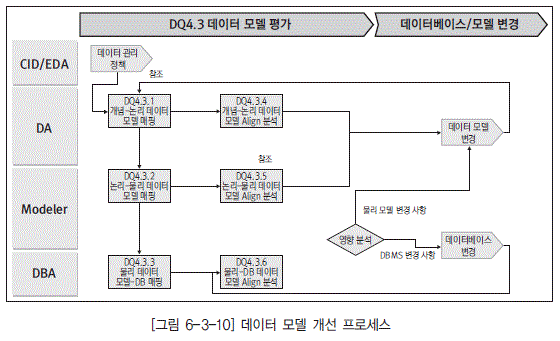

  * [그림 6-3-10] 데이터 모델 개선 프로세스">

  * DQ4.3.1 개념-논리 데이터 모델 매핑

[그림 6-3-10]의 DQ4.3.1 개념-논리 데이터 모델 매핑은 개념적으로 생성된 데이터 집합 또는 관리 항목과 논리 데이터 모델 사이의 구조적 정렬 정보를 생성하는 작업으로, 데이터 아키텍처 관 점에서 개념 데이터 모델의 각 객체와 논리 데이터 모델의 각 객체 간 연결 정보를 설정한다.

  * DQ4.3.2 논리-물리 데이터 모델 매핑

[그림 6-3-10]의 DQ4.3.2 논리-물리 데이터 모델 매핑은 비즈니스 규칙을 토대로 업무의 모델 데이터 구조와 이를 바탕으로 데이터베이스의 물리적인 특성을 고려하여 정의한 물리 데이터 모델 간의 구조적 연결 정보를 설정한다. 예를 들어 하나의 엔터티가 여러 개의 테이블이 되는 경우도 존재한다.

  * DQ4.3.3 물리 데이터 모델-DB 매핑

[그림 6-3-10]의 DQ4.3.3 물리 데이터 모델-DB 매핑은 물리 데이터 모델(최종 설계 도면)과 DBMS 카탈로그(건축물) 정보와의 구조적 연결 정보를 설정한다. 대부분의 모델링 툴은 물리 데이터 모델과 DB 간의 연결 정보를 자동으로 생성한다.

  * DQ4.3.4 개념-논리 데이터 모델 얼라인(Align) 분석

[그림 6-3-10]의 DQ4.3.4 개념-논리 데이터 모델 얼라인 분석은 개념 데이터 모델에 정의된 모델이 실제 논리 데이터 모델에 구체적으로 정의되지 않은 모델이 존재하는지를 체크하는 등의 차이 분석 작업을 말한다. 이렇게 분석된 결과에 의해 개념 데이터 모델의 변경 또는 논리 데이터 모델 변경의 프로세스를 수행하게 된다.

  * DQ4.3.5 논리-물리 데이터 모델 얼라인 분석

[그림 6-3-10]의 DQ4.3.5 논리-물리 데이터 모델 얼라인 분석은 논리 데이터 모델과 물리 데이터 모델 사이의 차이를 분석한다. 모델러 관점에서 변경 사항을 분석하여 해당 데이터 모델에 대한 변경을 수행하게 된다.

  * DQ4.3.6 물리 데이터 모델-DB 얼라인 분석

[그림 6-3-10]의 DQ4.3.6 물리 데이터 모델-DB 얼라인 분석은 물리 데이터 모델과 실제 DB와의 차이를 분석한다. 이렇게 함으로써 데이터 모델에 표현되지 않는 DB 객체가 있는지를 분석할 수 있다. 물론 정상적인 데이터 모델 변경 프로세스 또는 데이터베이스 변경 프로세스를 수행했다면 이러한 차이는 발생하지 않을 것이다.

# 제5절 데이터 흐름 관리

## 1. 정의 및 관리 목적

데이터 흐름 관리란 소스 데이터(문서, Text, DB 등)를 수기로 생성하거나 추출, 변환, 적재를 통 해 생성하여 타깃 데이터베이스에 저장·가공하는 것을 관리하는 절차를 말한다. 각 기관이 관리하 고 있는 데이터가 생성, 변경되고 활용되는 생명주기를 관리함으로써 전사 데이터에 대한 현황 파악 및 최적화된 형태로 활용되고 있는지를 확인할 수 있다.

개념 데이터 모델을 관리함으로써 논리, 물리 데이터 모델의 연관 관계 분석을 통한 전사 데이터 구조에 대한 파악이 가능하다. 또한 물리 데이터 모델과 데이터베이스 간의 상관 관계 분석을 통해 현재 운영 중인 데이터베이스와 동일한 모델 확보를 통해 유지 보수 및 체계적인 전사 데이터베이스 관리가 가능하다. 이외에도 데이터 참조 모델을 활용함으로써 일정 수준 이상의 데이터 모델 및 고품 질의 데이터 서비스가 가능하다. 개념 데이터 모델, 논리 데이터 모델, 물리 데이터 모델을 관리하기 위해서는 모델링 도구를 활용하는 것이 효과적이다. 또한 업무 영역별 개별 관리 방식보다는 데이터 의 중복 및 불필요한 인터페이스를 확인하고 조정이 가능한 전사적 통합 관리 방식을 권장한다.

## 2. 세부 관리 대상

세부 관리 대상으로 개념 데이터 모델, 데이터 참조 모델, 논리 데이터 모델, 물리 데이터 모델이 있으며, 해당 데이터 모델과 관련된 내용은 앞서 2장 데이터 구조 이해에서 다루었으므로 여기서는 생략한다.

## 3. 데이터 흐름 관리 프로세스

### 가. 데이터 흐름 관리 프로세스

  * [그림 6-3-11] 데이터 흐름 관리 프로세스">

  * DQ5.1.1 데이터 추출(변환) 요건 검토

[그림 6-3-11]의 DQ5.1.1 데이터 추출(변환) 요건 검토는 현업 업무를 위해 사용자로부터 접수한 요구 사항 중에서 데이터를 추출(변환)하여 해당 데이터베이스에 적재해야 하는 요건을 검토한다. 데이터베이스 관리자는 해당 요건 검토 시 전사아키텍처 뷰에서 데이터 정책/표준을 기준으로 요 건 반영 여부 및 방법에 대한 내용을 검토한다.

  * DQ5.1.2 소스 데이터 분석

[그림 6-3-11]의 DQ5.1.2 소스 데이터 분석을 위해 모델러는 소스 데이터를 추출(변환)하여 해당 데이터베이스에 적재하기로 결정된 요건에 대해 소스 데이터 관점에서 해당 테이블 및 칼럼에 대 한 내용을 분석한다. 칼럼 분석 시에는 칼럼에 대한 속성(데이터 타입 및 건수 등을) 중심으로 분석 하여 해당 요건을 지원할 수 있는 소스 데이터를 식별해 소스 데이터 분석서를 작성한다. [그림 6- 3-12]와 같은 형식으로 작성할 수 있다.

  * [그림 6-3-12] 소스 데이터 분석서 예">

  * DQ5.1.3 소스 데이터 추출(변환) 설계

[그림 6-3-11]의 DQ5.1.3 소스 데이터 추출(변환) 설계를 위해 모델러는 소스 데이터의 변환 로 직 및 적재 로직을 설계한다. 설계 시 고려할 사항은 타깃 데이터베이스의 테이블 및 칼럼을 식별 하여 매핑 로직 분석서를 작성하며, [그림 6-3-13]과 같은 형식으로 작성할 수 있다.

  * [그림 6-3-13] 매핑 로직 분석서 예">

  * DQ5.1.4 소스 데이터 추출(변환) 테스트

[그림 6-3-11]의 DQ5.1.4 소스 데이터 추출(변환) 테스트를 위해 모델러는 추출(변환) 설계에 따 라 소스 데이터를 테스트 형식으로 타깃 데이터베이스에 적재한다. 테스트를 통해 적재(가공)된 데 이터의 정확성을 사전 정의된 소스 대 타깃 대상 검증 항목을 기준으로 대상 검증 분석서를 작성한 다. [그림 6-3-14]와 같은 형식으로 작성할 수 있다.

  * [그림 6-3-14] 소스 대 타깃 대상 검증 분석서 예">

  * DQ5.1.5 소스 데이터 추출(변환) 검증

[그림 6-3-11]의 DQ5.1.5 소스 데이터 추출(변환) 검증을 위해 사용자는 소스 데이터 추출(변환) 테스트에서 작성된 대상 내용을 바탕으로 해당 요건이 타깃 데이터베이스에 정확하게 반영되어 데 이터가 적재되었는지를 확인한다. 해당 요건에 따라 타깃 데이터베이스로 데이터가 정확하게 적재 되지 않았을 경우에는 소스 데이터 분석을 다시 하도록 한다. 소스 데이터는 정확하게 타깃 데이터 베이스로 적재(가공)되었지만 테스트를 통해 확인된 내용이 해당 업무를 지원하지 못할 경우에는 사용자 요구 사항을 재정의한다.

  * DQ5.1.6 소스 데이터 추출(변환) 모듈 반영

[그림 6-3-11]의 DQ5.1.6 소스 데이터 추출(변환) 모듈 반영을 위해 데이터베이스 관리자는 사용 자의 검증이 완료된 소스 데이터 추출(변환) 변화를 운영 환경으로 적용한다. 해당 모듈을 운영 환 경으로 적용하면서 데이터베이스 관리자는 다른 시스템 및 프로그램에 영향을 주거나 성능을 저해 하는 사항이 없는지를 확인한 후 반영한다.

  * DQ5.1.7 소스 데이터 추출(변환) 모니터링

[그림 6-3-11]의 DQ5.1.7 소스 데이터 추출(변환) 모니터링을 위해 모델러는 운영 환경에 적용된 소스 데이터 추출(변환) 모듈을 정해진 규칙에 따라 주기적으로 모니터링하여 그 결과를 데이터 관 리자에게 보고한다. [그림 6-3-15]와 같은 형식으로 작성할 수 있다.

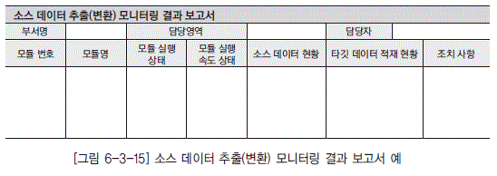

  * [그림 6-3-15] 소스 데이터 추출(변환) 모니터링 결과 보고서 예">

### 나. 데이터 흐름 개선 프로세스

  * [그림 6-3-16] 데이터 흐름 개선 프로세스">

  * DQ5.2.1 데이터 흐름 점검 기준 도출

[그림 6-3-16]의 DQ5.2.1 데이터 흐름 점검 기준 도출은 데이터 오류를 최소화하기 위해 지속적 으로 품질 점검을 통해 관리되어야 할 기준을 도출하는 과정이다. 예로는 데이터 구조적 측면의 흐 름 점검 기준, 데이터 정합성 유지 방안 등을 들 수 있다. 사용자가 설정한 품질 지표별로 데이터 이동에 대한 규칙들을 구체적인 기준들로 생성하여 관리할 수 있다.

  * DQ5.2.2 데이터 흐름 점검 지표 도출

[그림 6-3-16]의 DQ5.2.2 데이터 흐름 점검 지표 생성은 앞선 데이터 흐름 점검 기준별로 구체적 인 데이터 흐름의 정합성을 체크할 수 있는 지표들을 도출한다. 각각의 지표들은 데이터 흐름에 대 한 정합성을 체크할 수 있는 구체적인 데이터 이동으로 체크될 수 있는 형태로 도출되어야 한다.

  * DQ5.2.3 데이터 정합성 체크

[그림 6-3-16]의 DQ5.2.3 데이터 정합성 체크는 앞선 지표에 따른 구체적인 체크 모듈을 실행하여 정합성을 체크하는 과정이다.

  * DQ5.2.4 오류 데이터 분석

[그림 6-3-16]의 DQ5.2.4 오류 데이터 분석은 데이터 정합성 검증을 통하여 추출된 오류 데이터 에 대한 분석을 수행한다. 오류의 원인 분석에 따라 데이터 관리의 각 요소에 적절한 조치를 수행 하게 된다.

  * DQ5.2.5 변경 영향 분석

[그림 6-3-16]의 DQ5.2.5 변경 영향 분석은 앞선 체크 과정에서 오류 데이터의 원인에 대한 분석 을 통하여 구체적으로는 데이터 표준을 변경할 때의 영향, 데이터 모델을 변경할 때의 영향, 데이 터베이스 객체를 변경했을 때의 영향 등을 분석하는 과정이다.

  * DQ5.2.6 데이터 정제

[그림 6-3-16]의 DQ5.2.6 데이터 정제는 데이터 정합성을 지키지 않은 오류 데이터의 원인 분석 결과에 따라 데이터 관리의 각 요소에 적절한 조치를 수행하고, 데이터 값을 수정하는 과정을 말한다.

# 제6절 데이터베이스 관리

## 1. 정의 및 관리 목적

데이터베이스 관리란 원활한 데이터 서비스를 위해 필요한 데이터베이스를 안정적으로 운영, 관리 하는 데 필요한 작업을 체계화하는 것으로 백업, 보안, 튜닝, 모니터링 등의 작업이 포함된다. 데이 터베이스 관리 작업은 데이터베이스와 데이터베이스에 저장된 데이터가 오류 및 훼손 없이 안정적으 로 서비스될 수 있도록 데이터베이스에 대한 생성 및 변경, 보안, 성능 개선, 백업 관리를 지속적으 로 수행할 수 있도록 체계화하는 작업이라고 할 수 있다.

데이터베이스 관리 체계화를 통해 데이터의 오류 및 훼손 없이 사용자가 원하는 데이터를 원하는 시간에 원하는 형태로 정확하고 안정적으로 서비스함으로써 안정적이고 지속적인 업무 활동의 기반 을 마련할 수 있다.

데이터베이스 관리 프로세스 중 보안 관리는 데이터베이스에 대한 보안뿐만 아니라 애플리케이션, PC, 문서 등 각 기관이 보유하고 있는 모든 자원에 대한 외부 침입으로부터의 보호이기 때문에 별도 의 상세화된 지침을 통해 정의하는 것이 효과적이다. 또한 보안에 대한 전반적인 관리는 별도의 보안 담당자를 선임하는 것이 좋으며, 데이터베이스 관리자의 경우 데이터베이스 및 데이터베이스에 저장 된 데이터에 대한 보안에 책임을 갖도록 한다.

## 2. 세부 관리 대상

세부 관리 대상으로 표준 데이터, 모델 데이터, 관리 데이터, 업무 데이터, 데이터베이스가 있다. 해당 데이터와 관련된 내용은 앞서 1장 데이터 이해와 2장 데이터 구조 이해에서 다루었으므로 여기 서는 생략한다.

## 3. 데이터베이스 관리 프로세스

### 가. 데이터베이스 관리 프로세스

  * DQ6.1.1 데이터베이스 생성

[그림 6-3-17]의 DQ6.1.1 데이터베이스 생성은 비즈니스 요건에 맞게 설계된 데이터 모델을 토 대로 작성된 DDL문을 가지고 데이터베이스의 물리 특성을 고려하여 데이터베이스를 구성한다.

  * DQ6.1.2 백업 주기 및 스케줄 정의

[그림 6-3-17]의 DQ6.1.2 백업 주기 및 스케줄 정의는 어떠한 장애가 발생되더라도 사용 중인 데 이터의 완전 복구가 가능하도록 백업 주기 및 스케줄이 정의되어야 한다. 따라서 일 단위, 주 단위, 월 단위, 년 단위의 백업 주기별 백업 내용을 정의해 관리해야 한다. 백업 주기별 스케줄 표는 [그 림 6-3-18]과 같은 형식으로 작성할 수 있다.

  * [그림 6-3-17] 데이터베이스 관리 프로세스">

  * [그림 6-3-18] 백업 주기별 스케줄 예">

  * DQ6.1.3 데이터베이스 백업 수행

[그림 6-3-17]의 DQ6.1.3 데이터베이스 백업 수행은 백업 주기별 스케줄 표를 참고로 하여 백업 을 수행한다. 백업 수행 절차는 데이터베이스 가동 상태가 정상인지를 확인하고 배치 작업이 없는 시간을 배정하여 백업을 수행한다. 백업 수행이 완료되면 로그 파일 및 루트 메일(Root Mail)을 통해 결과를 확인한다. 백업 결과에 대해서는 일지를 반드시 기록해야 하며, 실패한 경우에도 작성 하도록 한다. 백업 실패 시 재수행을 하며, 재수행이 불가능할 경우 각 기관에서 정의한 장애 관리 프로세스에 의해 처리하도록 한다. 백업 수행과 관련되는 백업 일지 및 백업 관리 대장은 [그림 6- 3-19], [그림 6-3-20]과 같은 형식으로 작성할 수 있다.

  * [그림 6-3-19] 백업 일지 예">

  * [그림 6-3-20] 백업 관리 대장 예">

  * DQ6.1.4 데이터 보안 대상 선정

[그림 6-3-17]의 DQ6.1.4 데이터 보안 대상 선정은 보호되어야 할 자산의 파악 및 가치에 대한 평가 작업을 수행하고, 시스템에 존재하는 취약점 및 위험 요인에 대한 분석 작업을 수행한다. 분 석된 결과를 토대로 보안 대상을 선정하고 선정된 대상에 보안 등급을 적용하여 중요도에 따른 차 등 보안 적용을 수행한다.

  * DQ6.1.5 데이터 보안 적용

[그림 6-3-17]의 DQ6.1.5 데이터 보안 적용은 보안 관리 대상별 중요도에 따른 보안을 적용하는 작업으로, 물리적 접근 보안 및 네트워크 보안, 서버 및 운영체제 보안, 데이터베이스 보안, 응용 시스템 보안, PC 보안 등 종합적인 보안 적용이 필요하다. 그 중에서도 데이터베이스 보안은 데이 터베이스 사용자에 대한 보안 관리와 데이터베이스 자체에 대한 보안, 데이터에 대한 보안으로 나 눌 수 있으며, 데이터의 중요도에 따른 체계적인 적용이 필요하다.

  * DQ6.1.6 데이터 보안 교육 수행

[그림 6-3-17]의 DQ6.1.6 데이터 보안 교육 수행은 기관별로 수립된 데이터 보안 정책을 년 1회 이상 전 구성원을 대상으로 실시해야 하며, 교육 평가 작업 등을 통한 고품질의 교육이 될 수 있도 록 체계화한다. 보안 교육의 예로는 컴퓨터 및 인터넷에 대한 구조 및 해킹과 관련된 일반 내용을 담은 정보 보호 입문부터 인터넷 서버 보안 교육, 네트워크 보안 교육, 해킹 및 대응 등과 같은 세 부적인 교육까지 체계적으로 수립·시행되어야 한다.

  * DQ6.2.1 데이터베이스 성능 개선

[그림 6-3-17]의 DQ6.2.1 데이터베이스 성능 개선은 해당 기관의 사용자가 필요로 하는 성능 개선 사항으로, 정적인 수치 요구와 동적인 수치 요구를 처리하는 작업인 데이터베이스 성능 개선을 들 수 있다. 성능에 대한 작업은 사용자의 요구에 의해 개선되는 경우도 있지만 자체적인 성능개선 대상을 선정하고 선정된 대상에 대해 일별, 주별, 월별 모니터링 작업을 통해 일정 정도 성능 기준 에 미달했을 경우 조정하는 작업도 있다. 이러한 주기적인 성능 개선 작업은 안정적인 서비스를 위 한 근본적인 해결 방법이라 하겠다. 이때 작성해야 하는 것으로 [그림 6-3-21]과 같은 성능 개선 관리 대장이 있다.

  * [그림 6-3-21] 성능 개선 관리 대장 예">

  * DQ6.2.2 데이터 보안 개선

[그림 6-3-17]의 DQ6.2.2 데이터 보안 개선은 중요 데이터에 대한 훼손, 변조, 도난, 유출에 대 한 물리적 접근 통제(제한 구역, 통제 구역 등) 및 사용 통제(인증, 암호화, 방화벽 등)에 대한 요건 이 발생되었을 경우 보안 장치를 개선하는 작업으로, 데이터 보안 개선을 들 수 있다. 보안 작업 또 한 성능 개선 작업과 마찬가지로 보안 대상에 대해 항시적인 모니터링 작업을 통한 주기적인 개선 작업이 안정적인 데이터 관리를 위한 근본적 해결 방법이라 하겠다. 보안 개선 관리 대장은 [그림 6-3-22]와 같은 형식으로 작성할 수 있다.

  * [그림 6-3-22] 보안 개선 관리 대장 예">

  * DQ6.2.3 데이터베이스 복구

[그림 6-3-17]의 DQ6.2.3 데이터베이스 복구는 장애 등으로 인해 데이터에 대한 전반적인 훼손 및 에러로 인해 기존 백업된 데이터로의 복구 작업이다. 안정적인 복구 작업을 위해서는 복구와 관 련된 작업 절차를 사전에 정의하고 정의된 절차에 따라 사전 테스트 작업을 수행해야 한다. 복구 관리 대장은 [그림 6-3-23]과 같은 형식으로 작성할 수 있다.

  * [그림 6-3-23] 복구 관리 대장 예">

  * DQ6.2.4 테스트 데이터베이스 변경

[그림 6-3-17]의 DQ6.2.4 테스트 데이터베이스 변경은 변경 요청에 의해 제시된 요건에 따라 변 경된 데이터 모델을 토대로 작성된 DDL문을 가지고 데이터베이스의 물리 특성을 고려한 테스트 데이터베이스를 변경된 데이터 모델과 동일한 형태로 변경하는 작업이다.

  * DQ6.2.5 운영 데이터베이스 이관

[그림 6-3-17]의 DQ6.2.5 운영 데이터베이스 이관은 테스트 데이터베이스에 변경된 내역을 토대 로 해당 애플리케이션에 대한 문제점을 확인하는 단위 테스트와 타 애플리케이션과의 인터페이스 를 테스트하는 통합 테스트, 사용자의 만족도를 확인하는 사용자 테스트 등을 수행한 후 안정성 및 정확성이 확보되면 운영 데이터베이스에 해당 변경 내역을 반영한다.

### 나. 데이터베이스 개선 프로세스

  * [그림 6-3-24] 데이터베이스 개선 프로세스">

  * DQ6.3.1 데이터베이스 객체 관리 효율성 체크

[그림 6-3-24]의 DQ6.3.1 데이터베이스 객체 관리 효율성 체크는 현재 설정된 데이터베이스의 객체에 지정한 제약 조건과 객체 유형을 확인하여 최적의 성능을 보장하고 데이터의 오류를 방지하기 위한 객체 관리 규칙들인지 평가하는 것이다.

  * DQ6.3.2 비효율 원인 분석

[그림 6-3-24]의 DQ6.3.2 비효율 원인 분석은 현재 설정한 객체 관리 유형이나 객체 유형이 비 효율적 성능을 보인다면 해당 원인을 분석하는 것이다. 예를 들어 불필요한 제약 규칙의 남발이나 저장 공간 지정의 부적절, 데이터 객체에 데이터 분할 저장 방법의 문제, 인덱스 구성 칼럼의 순서 등이 원인이 될 수 있다.

  * DQ6.3.3 변경 영향도 분석

[그림 6-3-24]의 DQ6.3.3 변경 영향도 분석은 비효율을 개선하기 위하여 데이터베이스 내에서 제약 조건이나 객체 유형을 변경할 수도 있으나 테이블의 통합/분리의 변경이 요구된다면 물리 데 이터 모델의 변경이 요구될 수도 있다. 또한 객체의 도메인이 변경될 수 있다면 데이터 표준의 변 경이 역으로 요구될 수도 있다.

# 제7절 데이터 활용 관리

## 1. 정의 및 관리 목적

데이터 활용 관리란 데이터의 활용 여부를 점검하거나 활용도를 높이기 위해 측정 대상 데이터와 품질 지표를 선정하여 품질을 측정하고 분석하여 품질을 충족시키지 못하는 경우, 원인을 분석하여 담당자로 하여금 조치하도록 하는 작업을 말한다. 애플리케이션에서 활용되지 않는 데이터를 점검하 여 데이터베이스의 사용 환경을 개선하고 업무적 중요도가 높은 데이터에 대한 품질의 평가와 개선 으로 데이터의 활용도를 높인다. 데이터 활용 관리를 통해 데이터의 정확성을 저하시키는 원인을 분 석하고 개선함으로써 지속적인 데이터의 품질을 높이고 활용성을 높일 수 있다.

품질 저하를 개선하기 위해서는 조직 간의 원활한 협조 체계와 지속적인 활동이 필요하다. 미활용 테이블/칼럼에 대해 정리를 할 경우, 관련 항목을 사용하는 다른 애플리케이션이 있는지를 철저히 검토해야 한다. 데이터 품질 평가는 한 번의 수행을 통해 이루어지는 것이 아니라 반복적이고 지속적 으로 진행되었을 때 고품질의 데이터를 유지할 수 있다.

## 2. 세부 관리 대상

### 가. 핵심 데이터

핵심 데이터는 회사의 고객, 프로세스, 시장 환경, 재무 정보 등에 직접적으로 영향을 미치는 중요성이 높은 데이터를 말하며, 다음과 같은 기준에 따라 관리되어야 한다.

  * 완전성

데이터의 모든 값은 의미 있게 채워져 있어야 한다.

  * 일관성

데이터의 값은 동일하게 관리되어야 한다.

  * 최신성

데이터의 값은 실제 세계의 객체들이 가지고 있는 값과 같아야 한다.

  * 유효성

데이터의 값은 업무 규칙을 준수해야 한다.

  * 유일성

데이터의 값은 동일 테이블에서 중복 관리되어서는 안 된다.

  * 명확성

데이터의 의미가 혼동되지 않도록 분명하게 관리되어야 한다.

핵심 데이터는 업무 프로세스상의 중요성, 재무적 관점에서 관리의 필요성, 최종적인 사용자의 활용성 등을 기준으로 도출해 해당 테이블의 칼럼 수준으로 관리한다.

### 나. 측정 방법

데이터의 업무적인 규칙 및 물리적 특성(도메인, 유효성 등)을 반영한 데이터 품질 측정 기준을 말한다. 업무적인 규칙과 물리적인 특성이 정확하게 반영되도록 하며, 핵심 데이터별로 측정 방법을 관 리한다.

## 3. 데이터 활용 관리 프로세스

### 가. 데이터 활용 관리 프로세스

  * [그림 6-3-25] 데이터 활용 관리 프로세스">

  * DQ7.1.1 핵심 데이터 수집

[그림 6-3-25]의 DQ7.1.1 핵심 데이터 수집은 개선 대상이 되는 데이터를 선정 기준에 따라 선정 하고, 업무부하 및 시스템 부하를 고려하여 측정 데이터 량을 조정한다.

  * DQ7.1.2 데이터 활용도 측정 기준 수립

[그림 6-3-25]의 DQ7.1.2 데이터 활용도 측정 기준 수립은 데이터별 활용도 측정 기준을 정량적으 로 마련하고 데이터 활용 개선 목표치를 설정하여 향후 개선 작업에 대한 평가 작업 수행 시 활용한다.

  * [그림 6-3-26] 데이터 활용도 측정 결과서 예">

  * DQ7.1.3 데이터 활용 측정

[그림 6-3-25]의 DQ7.1.3 데이터 활용 측정은 데이터 활용도 측정 기준에 따른 활용도 평가 작업을 수행하고, 데이터 활용도 측정 결과서를 작성한다. [그림 6-3-26]과 같은 형식으로 작성할 수 있다.

  * DQ7.1.4 활용 저하 요인 분석

[그림 6-3-25]의 DQ7.1.4 활용 저하 요인 분석은 데이터 활용의 저하를 유발한 비즈니스적, IT 적 원인을 데이터의 생성, 갱신, 변환, 활용 관점에서 도출하고, 데이터 활용 저하 원인 분석서를 작성한다. [그림 6-3-27]과 같은 형식으로 작성할 수 있다.

  * [그림 6-3-27] 데이터 활용 저하 원인 분석서 예">

  * DQ7.2.1 개선 방안 마련

[그림 6-3-25]의 DQ7.2.1 개선 방안 마련은 활용 저하 원인별로 개선 방안을 마련한다. 개선 방 안은 주로 프로세스 개선, 표준화, 클린징의 범주로 분류될 수 있다.

  * DQ7.2.2 개선 활동 수행

[그림 6-3-25]의 DQ7.2.2 개선 활동 수행은 승인된 개선 방안과 원인별로 도출된 개선 방안의 활동 계획에 따라서 개선 활동을 추진한다.

  * DQ7.2.3 개선 활동 평가

[그림 6-3-25]의 DQ7.2.3 개선 활동 평가는 개선 활동을 평가하는 과정으로, 측정 목표치를 초 과한 데이터에 대해서는 개선 항목에서 제외시키거나 목표치를 조정한다. 종합적인 수행 결과를 정리하여 향후 활동에 활용할 수 있도록 한다.
